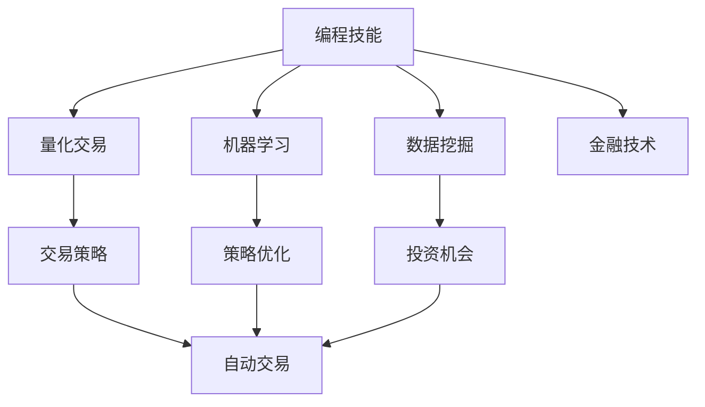

                 

关键词：自动化投资、编程技能、算法、量化交易、机器学习、数据挖掘、金融技术

> 摘要：本文将探讨如何将编程技能应用于自动化投资领域。通过核心概念的联系、算法原理的讲解、数学模型的构建以及项目实践，本文旨在为读者提供一套系统的自动化投资开发框架，并对其未来发展进行展望。

## 1. 背景介绍

自动化投资（Automated Investment）是指利用计算机算法和数学模型，自动进行资产配置、交易决策和风险管理的一种投资方式。随着金融科技的迅速发展，自动化投资已成为现代金融领域的一个重要组成部分。通过编程技能，投资者可以构建复杂的交易策略，实现投资决策的自动化和高效化。

编程技能在自动化投资中的重要性不可忽视。首先，编程技能可以帮助投资者快速理解和实现各种交易策略。其次，编程技能使得数据分析和处理变得更加高效，能够处理海量数据，提取有效信息。最后，编程技能还可以提高投资决策的可重复性和可靠性。

## 2. 核心概念与联系

### 2.1. 量化交易

量化交易（Quantitative Trading）是指通过数学模型和统计方法进行投资决策的交易方式。量化交易的核心在于通过数据分析发现市场规律，构建交易策略，并通过计算机程序实现自动交易。

### 2.2. 机器学习

机器学习（Machine Learning）是人工智能的一个分支，通过算法让计算机从数据中学习，进行预测和决策。在自动化投资中，机器学习可以用于策略优化、风险控制和市场预测。

### 2.3. 数据挖掘

数据挖掘（Data Mining）是指从大量数据中提取有价值信息的过程。在自动化投资中，数据挖掘可以帮助投资者发现潜在的投资机会，优化投资策略。

### 2.4. 金融技术

金融技术（Financial Technology，简称 Fintech）是指利用技术手段改善或创新金融产品、服务和流程的一种技术。金融技术包括区块链、加密货币、智能合约等多种形式，对自动化投资有着重要影响。

### 2.5. Mermaid 流程图

以下是自动化投资的核心概念与联系的 Mermaid 流程图：



## 3. 核心算法原理 & 具体操作步骤

### 3.1 算法原理概述

自动化投资的核心在于构建有效的交易策略，并对市场数据进行深入分析。以下是几种常用的算法原理：

- **技术分析**：通过历史价格和成交量等数据，分析市场趋势和模式，预测未来价格走势。
- **基本面分析**：通过分析公司的财务报表、行业趋势和市场环境，评估公司的价值和投资潜力。
- **机器学习**：利用历史数据，通过算法学习市场规律，预测未来价格。
- **博弈论**：通过模拟市场参与者的行为，预测市场动态。

### 3.2 算法步骤详解

以下是构建自动化投资策略的详细步骤：

1. **数据收集**：收集历史价格、成交量、财务报表等数据。
2. **数据预处理**：清洗和整理数据，去除噪声和异常值。
3. **特征工程**：提取对交易决策有影响的数据特征。
4. **模型构建**：选择合适的模型，如线性回归、决策树、神经网络等，进行模型训练。
5. **策略优化**：通过模拟交易，优化交易策略。
6. **自动交易**：通过计算机程序实现自动交易。

### 3.3 算法优缺点

- **技术分析**：优点是简单易懂，缺点是容易受到市场情绪的影响。
- **基本面分析**：优点是能够全面评估公司的价值，缺点是数据获取难度大，分析周期长。
- **机器学习**：优点是能够处理大量数据，自适应性强，缺点是模型复杂，调参难度大。
- **博弈论**：优点是能够模拟市场动态，缺点是假设条件复杂，应用难度高。

### 3.4 算法应用领域

自动化投资算法可以应用于股票、期货、外汇等多个领域。例如：

- **股票市场**：通过技术分析和基本面分析，构建交易策略，实现自动交易。
- **期货市场**：通过套利策略和趋势跟踪策略，实现稳定收益。
- **外汇市场**：通过高频交易和趋势跟踪策略，捕捉市场波动。

## 4. 数学模型和公式 & 详细讲解 & 举例说明

### 4.1 数学模型构建

自动化投资中的数学模型主要包括：

- **时间序列模型**：如 ARIMA、GARCH 等，用于分析价格波动。
- **回归模型**：如线性回归、逻辑回归等，用于预测价格。
- **机器学习模型**：如决策树、随机森林、神经网络等，用于分类和回归。

### 4.2 公式推导过程

以线性回归为例，其基本公式为：

$$
y = \beta_0 + \beta_1 x + \epsilon
$$

其中，$y$ 为因变量，$x$ 为自变量，$\beta_0$ 和 $\beta_1$ 分别为回归系数，$\epsilon$ 为误差项。

### 4.3 案例分析与讲解

以下是一个简单的线性回归案例：

#### 案例背景

假设我们要分析股票价格与其成交量之间的关系。

#### 数据处理

收集股票价格和成交量的历史数据，进行数据预处理，包括去除异常值、缺失值填充等。

#### 特征提取

将股票价格作为自变量 $x$，成交量作为因变量 $y$。

#### 模型训练

使用线性回归模型进行训练，得到回归系数 $\beta_0$ 和 $\beta_1$。

#### 模型评估

使用训练集和测试集对模型进行评估，计算拟合度。

#### 应用结果

根据模型预测，调整投资策略，实现自动交易。

## 5. 项目实践：代码实例和详细解释说明

### 5.1 开发环境搭建

搭建 Python 开发环境，安装必要的库，如 NumPy、Pandas、Scikit-learn 等。

### 5.2 源代码详细实现

以下是实现线性回归的 Python 代码：

```python
import numpy as np
import pandas as pd
from sklearn.linear_model import LinearRegression
from sklearn.model_selection import train_test_split

# 数据预处理
data = pd.read_csv('stock_data.csv')
data = data[['price', 'volume']]
data = data.fillna(method='ffill')

# 特征提取
X = data['price'].values.reshape(-1, 1)
y = data['volume'].values

# 模型训练
model = LinearRegression()
model.fit(X, y)

# 模型评估
X_train, X_test, y_train, y_test = train_test_split(X, y, test_size=0.2)
score = model.score(X_test, y_test)
print(f'Model Score: {score}')

# 应用结果
print(f'Prediction: {model.predict(X_test)}')
```

### 5.3 代码解读与分析

该代码首先导入必要的库，然后进行数据预处理和特征提取。接下来，使用线性回归模型进行训练和评估。最后，根据模型预测，调整投资策略。

### 5.4 运行结果展示

运行代码后，输出模型评分和预测结果。

## 6. 实际应用场景

自动化投资可以在多个领域得到应用，如：

- **量化基金**：通过自动化投资，量化基金可以快速响应市场变化，实现风险控制和收益最大化。
- **高频交易**：高频交易通过快速交易，捕捉市场微小波动，实现高收益。
- **智能投顾**：智能投顾利用自动化投资，为用户提供个性化的投资建议。

## 7. 工具和资源推荐

### 7.1 学习资源推荐

- **书籍**：《量化投资：技术与策略》、《金融计算：模型与算法》
- **在线课程**：Coursera 上的《机器学习》、edX 上的《量化交易》

### 7.2 开发工具推荐

- **编程语言**：Python、R
- **库与框架**：NumPy、Pandas、Scikit-learn、TensorFlow、PyTorch

### 7.3 相关论文推荐

- **经典论文**：《股票价格是否反应一切？》（1987）
- **最新论文**：《基于深度学习的股票市场预测》（2020）

## 8. 总结：未来发展趋势与挑战

### 8.1 研究成果总结

自动化投资在金融科技领域取得了显著成果，通过编程技能，投资者可以构建高效、稳定的交易策略，实现投资决策的自动化和智能化。

### 8.2 未来发展趋势

随着人工智能和大数据技术的发展，自动化投资将继续向智能化、个性化方向迈进。未来，自动化投资将在金融、医疗、零售等多个领域得到广泛应用。

### 8.3 面临的挑战

自动化投资仍面临许多挑战，如数据质量、模型可靠性和风险控制等。此外，市场波动性和监管政策的变化也可能对自动化投资产生较大影响。

### 8.4 研究展望

未来，自动化投资的研究应重点关注以下几个方面：

- **算法优化**：提高算法的准确性和效率，降低交易成本。
- **风险控制**：建立完善的风险评估体系，降低投资风险。
- **用户个性化**：根据用户需求和风险承受能力，提供个性化的投资建议。

## 9. 附录：常见问题与解答

### 9.1 什么

