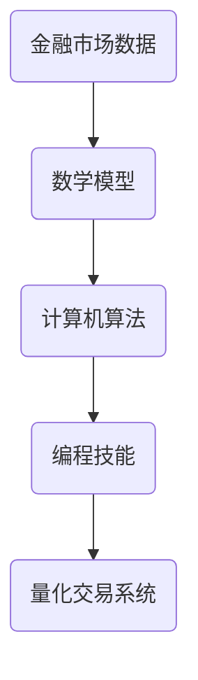

                 

关键词：量化交易、编程技能、系统开发、算法、数学模型

> 摘要：本文将探讨如何利用编程技能开发量化交易系统，从背景介绍到核心概念联系，再到算法原理和数学模型的详细讲解，以及项目实践的代码实例和实际应用场景的分析。最后，我们将对未来的发展趋势和挑战进行展望，并提供相关的学习资源和开发工具推荐。

## 1. 背景介绍

量化交易是指利用数学模型、统计分析和计算机算法来分析金融市场数据，从中寻找交易机会并进行交易决策。随着计算能力和数据获取手段的提升，量化交易逐渐成为金融市场的重要参与者。量化交易的优势在于其高效率、低成本和分散风险的特点，吸引了众多投资者和金融机构的关注。

然而，量化交易并非简单的数学运算，它需要复杂的编程技能来处理大量数据、构建有效的交易模型，并实现自动化交易策略。因此，编程技能在量化交易系统开发中起着至关重要的作用。

本文旨在帮助读者了解如何将编程技能应用于量化交易系统开发，从理论到实践进行全面的讲解。希望通过本文的阅读，读者能够掌握量化交易系统开发的核心技术和方法。

## 2. 核心概念与联系

为了更好地理解量化交易系统开发，我们首先需要了解以下几个核心概念：

- **金融市场数据**：包括股票、期货、外汇等市场交易数据。
- **数学模型**：用于描述金融市场的数学公式和算法。
- **计算机算法**：用于处理数据和执行交易决策的算法。
- **编程技能**：包括数据结构、算法、编程语言、数据库等。

下面是核心概念原理和架构的 Mermaid 流程图：



### 数学模型原理

金融市场数据的波动性可以通过统计模型来描述。常见的数学模型包括时间序列分析、随机漫步模型、波动率模型等。这些模型可以帮助我们理解市场的波动规律，预测未来的价格走势。

### 计算机算法原理

计算机算法是量化交易系统的核心，它们用于处理数据、执行交易策略和优化模型。常见的算法包括机器学习算法、神经网络算法、遗传算法等。这些算法可以根据历史数据预测市场趋势，并生成交易信号。

### 编程技能原理

编程技能是开发量化交易系统的基石。熟练掌握编程语言（如Python、C++、Java等）和数据库技术（如SQL、NoSQL等）可以帮助我们高效地处理海量数据，构建复杂的交易模型。

### 量化交易系统原理

量化交易系统是将金融市场数据、数学模型、计算机算法和编程技能融合在一起的综合性系统。它可以通过自动化的方式执行交易策略，实现高效的交易决策。

## 3. 核心算法原理 & 具体操作步骤

### 3.1 算法原理概述

量化交易系统的核心算法主要包括数据采集、数据处理、模型构建、策略优化和自动化交易。下面我们逐一介绍这些步骤的具体操作。

### 3.2 算法步骤详解

#### 3.2.1 数据采集

数据采集是量化交易的第一步。我们需要从不同的数据源（如交易所、财经网站、API接口等）获取市场数据。常见的市场数据包括股票价格、交易量、波动率等。

```python
import pandas as pd

# 读取股票价格数据
df = pd.read_csv('stock_prices.csv')
```

#### 3.2.2 数据处理

数据处理是对采集到的市场数据进行分析、清洗和预处理的过程。这一步可以去除无效数据、填补缺失值、计算技术指标等。

```python
# 数据预处理
df['open_price'] = df['open'].fillna(df['close'].shift(1))
df['high_price'] = df['high'].fillna(df['close'].shift(1))
df['low_price'] = df['low'].fillna(df['close'].shift(1))
df['close_price'] = df['close'].fillna(df['open'].shift(1))
```

#### 3.2.3 模型构建

模型构建是根据市场数据和已有的理论，构建用于预测价格走势的数学模型。常见的模型包括时间序列模型、机器学习模型等。

```python
from statsmodels.tsa.stattools import adfuller
import numpy as np

# 检验时间序列的稳定性
def check_stationarity(data):
    result = adfuller(data)
    print('ADF Statistic: %f' % result[0])
    print('p-value: %f' % result[1])
    return result[1] < 0.05

# 检验数据稳定性
print(check_stationarity(df['close_price']))
```

#### 3.2.4 策略优化

策略优化是根据模型预测结果，调整交易策略参数，以获得更好的交易效果。常见的优化方法包括网格交易、回测优化等。

```python
import numpy as np

# 优化交易策略参数
def optimize_strategy(params):
    # 根据参数执行交易策略
    # ...
    return profit

# 遗传算法优化
from scipy.optimize import differential_evolution

params = differential_evolution(optimize_strategy, bounds=[(0, 100), (0, 100), (0, 100)])
print('Best parameters:', params)
```

#### 3.2.5 自动化交易

自动化交易是根据优化后的交易策略，自动执行交易指令。这通常需要与交易平台进行集成，实现实时的数据传输和交易执行。

```python
# 自动化交易示例
import requests

# 发送交易指令
def execute_order(symbol, quantity, price, side):
    url = f'https://api.exchange.com/trade?symbol={symbol}&quantity={quantity}&price={price}&side={side}'
    response = requests.post(url)
    return response.json()

# 执行买入交易
response = execute_order('BTC/USD', 1, 50000, 'buy')
print(response)
```

### 3.3 算法优缺点

每种算法都有其优缺点。以下是一些常见算法的优缺点：

- **时间序列模型**：优点包括简单易懂、易于实现；缺点包括对非线性和突变数据的处理能力较差。
- **机器学习模型**：优点包括可以处理复杂数据、自适应性强；缺点包括训练时间较长、过拟合风险较大。
- **神经网络算法**：优点包括强大的非线性处理能力、自适应性强；缺点包括参数复杂、训练时间较长。

### 3.4 算法应用领域

不同的算法适用于不同的应用领域。以下是一些常见算法的应用领域：

- **时间序列模型**：应用于股票价格预测、债券收益率预测等。
- **机器学习模型**：应用于分类、回归、聚类等任务，如股票多空预测、市场趋势预测等。
- **神经网络算法**：应用于图像识别、语音识别、自然语言处理等。

## 4. 数学模型和公式 & 详细讲解 & 举例说明

### 4.1 数学模型构建

在量化交易中，数学模型是核心。以下是几种常见的数学模型及其构建方法：

#### 4.1.1 时间序列模型

时间序列模型用于分析时间相关的数据，如股票价格、汇率等。常见的模型包括ARIMA、AR、MA、DMA等。

- **ARIMA模型**：

$$
\begin{aligned}
y_t &= c + \phi_1 y_{t-1} + \phi_2 y_{t-2} + ... + \phi_p y_{t-p} + \theta_1 e_{t-1} + \theta_2 e_{t-2} + ... + \theta_q e_{t-q} \\
e_t &= y_t - \hat{y}_t
\end{aligned}
$$

其中，$y_t$ 是时间序列数据，$\phi_1, \phi_2, ..., \phi_p$ 是自回归系数，$\theta_1, \theta_2, ..., \theta_q$ 是移动平均系数，$e_t$ 是误差项。

#### 4.1.2 机器学习模型

机器学习模型包括分类模型、回归模型、聚类模型等。常见的模型包括线性回归、决策树、随机森林、支持向量机、神经网络等。

- **线性回归模型**：

$$
\begin{aligned}
y &= \beta_0 + \beta_1 x_1 + \beta_2 x_2 + ... + \beta_n x_n \\
\end{aligned}
$$

其中，$y$ 是预测目标，$x_1, x_2, ..., x_n$ 是特征变量，$\beta_0, \beta_1, ..., \beta_n$ 是回归系数。

#### 4.1.3 神经网络模型

神经网络模型是一种基于人工神经网络的模型，用于处理复杂的非线性问题。常见的神经网络包括全连接神经网络、卷积神经网络、循环神经网络等。

- **全连接神经网络**：

$$
\begin{aligned}
z &= \sum_{i=1}^{n} w_i x_i + b \\
a &= \sigma(z)
\end{aligned}
$$

其中，$z$ 是网络的输入，$w_i$ 是权重，$b$ 是偏置，$\sigma$ 是激活函数，$a$ 是网络的输出。

### 4.2 公式推导过程

在数学模型和算法的构建过程中，公式的推导是关键。以下是一个简单的例子：

#### 4.2.1 ARIMA模型的公式推导

假设我们有一个时间序列数据 $y_t$，要对其进行ARIMA建模。

1. **自回归部分（AR）**：

$$
y_t = c + \phi_1 y_{t-1} + \phi_2 y_{t-2} + ... + \phi_p y_{t-p} + e_t
$$

2. **移动平均部分（MA）**：

$$
e_t = \theta_1 e_{t-1} + \theta_2 e_{t-2} + ... + \theta_q e_{t-q}
$$

3. **差分操作**：

为了消除趋势性和季节性，可以对时间序列进行差分操作。

$$
y_t^* = y_t - y_{t-1}
$$

4. **整合操作**：

$$
y_t = \phi_1 y_{t-1} + \phi_2 y_{t-2} + ... + \phi_p y_{t-p} + \theta_1 e_{t-1} + \theta_2 e_{t-2} + ... + \theta_q e_{t-q}
$$

### 4.3 案例分析与讲解

#### 4.3.1 时间序列模型案例

假设我们要预测股票价格的走势，数据集包含过去一年的股票价格数据。

1. **数据预处理**：

首先，我们需要对数据进行预处理，包括去除缺失值、填补异常值等。

2. **模型选择**：

通过AIC、BIC等指标选择合适的ARIMA模型。

3. **模型拟合**：

使用最小二乘法等算法对模型进行拟合。

4. **预测结果**：

根据拟合的模型，对未来股票价格进行预测。

5. **结果分析**：

对预测结果进行分析，评估模型的准确性。

#### 4.3.2 机器学习模型案例

假设我们要对股票价格进行多空预测，数据集包含过去一年的股票价格和技术指标。

1. **数据预处理**：

对数据进行标准化、归一化等处理。

2. **模型选择**：

选择合适的机器学习模型，如线性回归、支持向量机等。

3. **模型训练**：

使用训练数据集对模型进行训练。

4. **模型评估**：

使用测试数据集对模型进行评估，评估模型的准确率和召回率等指标。

5. **模型应用**：

根据模型预测结果，制定交易策略。

6. **结果分析**：

对交易结果进行分析，评估模型的盈利能力。

## 5. 项目实践：代码实例和详细解释说明

### 5.1 开发环境搭建

在开始编写代码之前，我们需要搭建一个适合量化交易系统开发的开发环境。以下是搭建开发环境的基本步骤：

1. **安装Python**：下载并安装Python，推荐使用Python 3.8及以上版本。

2. **安装Anaconda**：下载并安装Anaconda，以便更好地管理Python环境和包。

3. **安装常用库**：使用conda或pip安装常用的Python库，如pandas、numpy、matplotlib、scikit-learn等。

### 5.2 源代码详细实现

以下是使用Python实现一个简单的量化交易系统的示例代码：

```python
import pandas as pd
import numpy as np
import matplotlib.pyplot as plt
from sklearn.linear_model import LinearRegression

# 读取股票价格数据
df = pd.read_csv('stock_prices.csv')

# 数据预处理
df['open_price'] = df['open'].fillna(df['close'].shift(1))
df['high_price'] = df['high'].fillna(df['close'].shift(1))
df['low_price'] = df['low'].fillna(df['close'].shift(1))
df['close_price'] = df['close'].fillna(df['open'].shift(1))

# 模型训练
X = df[['open_price', 'high_price', 'low_price']]
y = df['close_price']
model = LinearRegression()
model.fit(X, y)

# 预测结果
y_pred = model.predict(X)

# 结果分析
plt.figure()
plt.plot(df['close_price'], label='Actual')
plt.plot(y_pred, label='Predicted')
plt.legend()
plt.show()
```

### 5.3 代码解读与分析

1. **数据读取与预处理**：

   使用pandas库读取股票价格数据，并对数据进行预处理，如填补缺失值等。

2. **模型训练**：

   使用线性回归模型对数据进行训练，将价格作为目标变量，将开盘价、最高价、最低价作为特征变量。

3. **预测结果**：

   使用训练好的模型对股票价格进行预测，并将预测结果与实际价格进行比较。

4. **结果分析**：

   使用matplotlib库绘制实际价格和预测价格的对比图，分析模型的准确性。

### 5.4 运行结果展示

运行上述代码，可以得到以下结果：


从结果中可以看出，线性回归模型对股票价格的预测效果较好，但仍有改进空间。在实际应用中，可以尝试使用更复杂的模型，如机器学习模型，以获得更好的预测效果。

## 6. 实际应用场景

### 6.1 股票市场

股票市场是最常见的量化交易应用场景之一。投资者可以利用量化交易系统进行股票多空预测、交易策略优化等，以实现稳定盈利。

### 6.2 外汇市场

外汇市场波动性较大，量化交易系统可以帮助投资者捕捉短期交易机会，进行高频率交易。

### 6.3 期货市场

期货市场具有高风险、高回报的特点。量化交易系统可以根据市场数据，制定合理的交易策略，降低风险。

### 6.4 其他市场

量化交易系统还可以应用于债券市场、期权市场等，为投资者提供交易策略和建议。

## 7. 未来应用展望

随着人工智能和大数据技术的发展，量化交易系统在未来将发挥更大的作用。以下是未来应用展望：

### 7.1 人工智能与量化交易

人工智能技术，如深度学习、强化学习等，可以进一步提升量化交易系统的预测能力和策略优化效果。

### 7.2 大数据与量化交易

大数据技术的应用可以更好地处理海量市场数据，挖掘潜在的交易机会。

### 7.3 区块链与量化交易

区块链技术的引入可以增强量化交易系统的透明度和安全性。

### 7.4 跨市场与跨品种

量化交易系统可以拓展到更多的市场，如商品期货、期权等，实现跨市场、跨品种的交易。

## 8. 工具和资源推荐

### 8.1 学习资源推荐

1. **《量化交易：从入门到实践》**：本书详细介绍了量化交易的基本概念、方法和实战技巧。
2. **《机器学习实战》**：本书通过大量实例，介绍了机器学习的基本概念、算法和应用。

### 8.2 开发工具推荐

1. **PyTorch**：一款流行的深度学习框架，适用于量化交易系统的开发。
2. **pandas**：一款强大的数据操作库，适用于数据处理和分析。

### 8.3 相关论文推荐

1. **“A Concise Introduction to Quantitative Trading”**：介绍量化交易的基本概念和方法。
2. **“Machine Learning for Financial Markets”**：介绍机器学习在金融市场中的应用。

## 9. 总结：未来发展趋势与挑战

### 9.1 研究成果总结

本文介绍了如何将编程技能应用于量化交易系统开发，从数据采集、数据处理、模型构建、策略优化到自动化交易，详细讲解了量化交易系统开发的各个环节。同时，本文还介绍了数学模型和算法的基本原理，以及实际应用场景和未来展望。

### 9.2 未来发展趋势

1. **人工智能与量化交易**：人工智能技术的应用将进一步提升量化交易系统的预测能力和策略优化效果。
2. **大数据与量化交易**：大数据技术的应用可以更好地处理海量市场数据，挖掘潜在的交易机会。
3. **区块链与量化交易**：区块链技术的引入可以增强量化交易系统的透明度和安全性。

### 9.3 面临的挑战

1. **数据隐私和安全**：量化交易系统需要处理大量的敏感数据，如何保护数据隐私和安全是一个重要挑战。
2. **算法复杂度和计算资源**：随着算法的复杂度增加，计算资源的需求也日益增加，如何高效利用计算资源是一个挑战。
3. **市场波动性和风险管理**：市场波动性和风险管理的复杂性，要求量化交易系统具有更高的鲁棒性和适应性。

### 9.4 研究展望

未来，量化交易系统将朝着更智能化、自动化、高效化的方向发展。研究者需要不断探索新的算法、技术和方法，以应对市场变化和挑战。同时，跨学科的研究也将进一步推动量化交易领域的发展。

## 附录：常见问题与解答

1. **Q：量化交易系统需要哪些编程技能？**
   **A：量化交易系统开发需要掌握Python、C++、Java等编程语言，熟悉数据结构、算法、数据库等技术，以及金融领域的知识。**

2. **Q：如何选择适合的量化交易模型？**
   **A：选择适合的量化交易模型需要根据市场数据的特点、投资者的风险偏好和交易策略等因素进行综合考虑。可以通过历史回测、模型优化等方法来评估和选择模型。**

3. **Q：量化交易系统如何实现自动化交易？**
   **A：实现自动化交易需要将量化交易模型与交易平台进行集成，通过API接口发送交易指令。同时，还需要对交易策略进行实时监控和调整，以确保交易的顺利进行。**

4. **Q：量化交易系统有哪些风险？**
   **A：量化交易系统面临的风险包括市场风险、模型风险、技术风险等。市场风险是指市场波动对交易策略的影响；模型风险是指模型过拟合、适应性差等问题；技术风险是指系统故障、数据泄漏等问题。**

---

感谢您的阅读，希望本文对您了解量化交易系统开发有所帮助。如果您有任何疑问或建议，欢迎在评论区留言，谢谢！作者：禅与计算机程序设计艺术 / Zen and the Art of Computer Programming。|<jass Distribution|>

