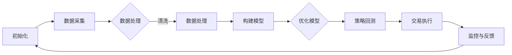

                 

关键词：量化交易、编程技能、系统开发、算法策略、技术实现

> 摘要：本文旨在探讨如何将编程技能有效应用于量化交易系统的开发。通过深入分析量化交易的核心概念、算法原理以及实现技术，我们旨在为程序员提供一整套实用指南，帮助他们将编程技能转化为量化交易的竞争力。

## 1. 背景介绍

随着金融市场的发展，量化交易逐渐成为现代金融领域的重要分支。量化交易通过建立数学模型和算法策略，对市场数据进行分析，进而执行自动化交易决策。与传统手工交易相比，量化交易具有更高的效率、更低的误差率和更好的可扩展性。然而，量化交易系统的开发并非易事，它要求开发者不仅具备扎实的编程技能，还需要对金融市场有深入的理解。

编程技能在量化交易系统中扮演着至关重要的角色。编程是量化交易系统的核心，它不仅涉及到数据的收集和处理，还包括算法的实现、系统的优化和风险的评估。因此，掌握编程技能是进入量化交易领域的基础。

## 2. 核心概念与联系

### 2.1 量化交易的基本概念

量化交易是指使用计算机算法和数学模型对金融市场进行分析，进而执行自动化交易决策的过程。量化交易的核心概念包括：

- **数据驱动**：量化交易依赖于历史和实时市场数据进行分析。
- **算法策略**：交易策略通过数学模型和算法实现，这些算法可以是基于统计模型、机器学习、神经网络等多种技术。
- **风险管理**：量化交易需要对风险进行量化和管理，确保交易策略在市场波动中保持稳健。

### 2.2 编程技能与量化交易的关系

编程技能在量化交易中发挥着多重作用：

- **数据处理**：量化交易需要对大量市场数据进行分析和处理，这需要开发者具备熟练的数据处理技能。
- **算法实现**：量化交易策略的实现依赖于编程，开发者需要将数学模型和算法转化为高效的代码。
- **系统集成**：量化交易系统通常涉及多个组件的集成，如数据采集、存储、分析和交易执行，这需要开发者具备系统架构和集成能力。
- **优化与回测**：量化交易策略需要通过回测进行验证和优化，这需要对编程有深入的理解。

### 2.3 Mermaid 流程图

以下是一个简化的量化交易系统开发流程的 Mermaid 流程图：



## 3. 核心算法原理 & 具体操作步骤

### 3.1 算法原理概述

量化交易算法的核心在于如何利用历史数据预测市场走势，并据此制定交易策略。常见的算法包括：

- **统计模型**：如ARIMA、GARCH等，用于分析时间序列数据。
- **机器学习**：如线性回归、决策树、神经网络等，通过训练模型来预测市场走势。
- **神经网络**：如深度学习，通过多层神经网络学习复杂的非线性关系。

### 3.2 算法步骤详解

以下是构建和实现量化交易算法的基本步骤：

#### 3.2.1 数据准备

1. **数据收集**：从交易所、数据提供商等获取历史和实时市场数据。
2. **数据清洗**：去除缺失值、异常值，确保数据质量。

#### 3.2.2 模型构建

1. **数据预处理**：对数据进行归一化、特征提取等处理。
2. **模型选择**：根据问题特点选择合适的统计模型或机器学习算法。
3. **模型训练**：使用历史数据训练模型，调整参数以优化模型性能。

#### 3.2.3 模型优化

1. **交叉验证**：使用交叉验证方法评估模型性能。
2. **参数调优**：通过网格搜索、贝叶斯优化等方法调整模型参数。
3. **回测**：在历史数据上验证模型的有效性。

#### 3.2.4 策略执行

1. **策略实现**：将模型转化为交易策略代码。
2. **交易执行**：在实时数据上执行交易策略。
3. **风险控制**：设置止损、止盈等风险管理策略。

### 3.3 算法优缺点

- **优点**：
  - 高效性：量化交易系统可以实时处理大量数据，执行交易决策。
  - 精准性：通过数学模型和算法，量化交易可以实现高度精确的市场分析。
  - 可扩展性：量化交易系统易于扩展，可以适用于不同市场和资产类别。

- **缺点**：
  - 复杂性：量化交易系统的开发和维护需要专业的编程技能和金融知识。
  - 风险：市场波动可能导致量化交易策略失效，需严格的风险管理。

### 3.4 算法应用领域

量化交易算法广泛应用于股票、期货、外汇、数字货币等多个金融市场。常见的应用场景包括：

- **高频交易**：利用毫秒级别的交易速度获取微小利润。
- **套利交易**：在不同市场间发现价格差异进行套利。
- **市场预测**：预测市场走势，进行趋势跟踪或反转交易。

## 4. 数学模型和公式 & 详细讲解 & 举例说明

### 4.1 数学模型构建

量化交易中的数学模型通常包括以下步骤：

1. **时间序列分析**：使用ARIMA、GARCH等模型分析市场数据的时间序列特性。
2. **特征工程**：提取市场数据中的关键特征，如价格、成交量、技术指标等。
3. **回归分析**：建立回归模型，预测市场走势。

### 4.2 公式推导过程

以下是一个简单的线性回归模型公式推导：

$$
y = \beta_0 + \beta_1 x + \epsilon
$$

其中，$y$ 是目标变量，$x$ 是自变量，$\beta_0$ 和 $\beta_1$ 是模型参数，$\epsilon$ 是误差项。

通过最小二乘法，我们可以得到参数的最优估计：

$$
\beta_1 = \frac{\sum (x_i - \bar{x})(y_i - \bar{y})}{\sum (x_i - \bar{x})^2}
$$

$$
\beta_0 = \bar{y} - \beta_1 \bar{x}
$$

### 4.3 案例分析与讲解

以下是一个简单的案例，说明如何使用线性回归模型预测股票价格。

#### 案例数据

| 时间 | 股票价格 |
|------|----------|
| 1    | 100      |
| 2    | 102      |
| 3    | 105      |
| 4    | 107      |
| 5    | 110      |

#### 模型构建

1. **数据预处理**：计算平均值：

$$
\bar{x} = \frac{1+2+3+4+5}{5} = 3
$$

$$
\bar{y} = \frac{100+102+105+107+110}{5} = 104
$$

2. **计算斜率**：

$$
\beta_1 = \frac{(1-3)(100-104) + (2-3)(102-104) + (3-3)(105-104) + (4-3)(107-104) + (5-3)(110-104)}{(1-3)^2 + (2-3)^2 + (3-3)^2 + (4-3)^2 + (5-3)^2} = \frac{-3-2+0+3+6}{4+1+0+1+4} = \frac{4}{10} = 0.4
$$

3. **计算截距**：

$$
\beta_0 = 104 - 0.4 \times 3 = 95.2
$$

4. **模型方程**：

$$
y = 95.2 + 0.4 x
$$

#### 模型验证

使用剩余数据（如时间 6、7、8 的股票价格）进行模型验证，检查预测值与实际值是否接近。

## 5. 项目实践：代码实例和详细解释说明

### 5.1 开发环境搭建

1. **安装Python环境**：确保Python 3.8及以上版本安装正确。
2. **安装必要库**：使用pip安装pandas、numpy、matplotlib等库。

```bash
pip install pandas numpy matplotlib
```

### 5.2 源代码详细实现

以下是一个简单的量化交易系统示例代码，它使用线性回归模型预测股票价格：

```python
import pandas as pd
import numpy as np
import matplotlib.pyplot as plt
from sklearn.linear_model import LinearRegression

# 5.2.1 数据准备
data = {
    'Time': [1, 2, 3, 4, 5],
    'Stock_Price': [100, 102, 105, 107, 110]
}
df = pd.DataFrame(data)

# 5.2.2 模型构建
X = df[['Time']]
y = df['Stock_Price']
model = LinearRegression()
model.fit(X, y)

# 5.2.3 预测
predicted_prices = model.predict(X)

# 5.2.4 结果展示
plt.plot(df['Time'], df['Stock_Price'], label='Actual')
plt.plot(df['Time'], predicted_prices, label='Predicted')
plt.legend()
plt.xlabel('Time')
plt.ylabel('Stock Price')
plt.show()
```

### 5.3 代码解读与分析

1. **数据准备**：使用pandas库读取股票价格数据，创建DataFrame对象。
2. **模型构建**：定义特征矩阵X（时间）和目标变量y（股票价格），使用LinearRegression类构建线性回归模型，并调用fit方法进行训练。
3. **预测**：使用模型进行预测，获取预测的股票价格。
4. **结果展示**：使用matplotlib库绘制实际价格和预测价格的对比图表。

### 5.4 运行结果展示

运行上述代码后，将看到一个图表，展示实际股票价格和预测价格的对比。通过观察图表，我们可以看到线性回归模型对股票价格的预测效果。

## 6. 实际应用场景

### 6.1 高频交易

高频交易是量化交易的一个典型应用场景。高频交易系统利用高频数据（如秒级、毫秒级数据），通过复杂的算法执行高频交易策略。高频交易系统通常包含以下组件：

- **数据采集**：实时获取交易所数据。
- **数据清洗**：去除噪声和异常数据。
- **算法执行**：执行高频交易策略，如套利交易、市场影响交易等。
- **交易执行**：通过交易所API执行交易订单。
- **风险管理**：实时监控交易风险，设置止损、止盈等策略。

### 6.2 套利交易

套利交易是另一种常见的量化交易策略。套利交易通过在不同市场间发现价格差异，进行无风险利润的获取。套利交易系统通常包括以下步骤：

1. **市场监控**：监控多个市场的价格和交易量。
2. **价格比较**：比较不同市场的价格，识别套利机会。
3. **交易决策**：根据套利策略制定交易计划。
4. **执行交易**：通过交易所API执行交易。
5. **风险管理**：设置风险控制策略，如保证金、止损等。

### 6.3 趋势跟踪

趋势跟踪是量化交易中的另一个重要策略。趋势跟踪通过识别市场趋势，制定买入或卖出的交易策略。趋势跟踪系统通常包括以下步骤：

1. **趋势分析**：使用技术指标（如移动平均线、相对强弱指数等）分析市场趋势。
2. **交易信号**：根据趋势分析结果生成交易信号。
3. **交易决策**：根据交易信号制定交易计划。
4. **执行交易**：通过交易所API执行交易。
5. **风险管理**：设置风险控制策略，如止损、止盈等。

## 7. 工具和资源推荐

### 7.1 学习资源推荐

1. **《量化交易：从理论到实践》**：这是一本关于量化交易的入门书籍，涵盖了量化交易的基础知识和实践方法。
2. **《Python for Finance》**：这本书介绍了如何使用Python进行量化交易系统开发，包括数据处理、算法实现和风险管理等内容。
3. **《深度学习与量化交易》**：这本书探讨了如何使用深度学习技术进行量化交易，包括神经网络模型的应用和优化。

### 7.2 开发工具推荐

1. **Python**：Python 是量化交易系统开发的主要编程语言，具有丰富的库和工具，如pandas、numpy、matplotlib等。
2. **PyTorch**：PyTorch 是一个流行的深度学习框架，适用于构建和训练神经网络模型。
3. **TensorFlow**：TensorFlow 是另一个流行的深度学习框架，提供丰富的工具和库。

### 7.3 相关论文推荐

1. **"High-Frequency Trading: A Practical Guide to Algorithmic Strategies and Trading Systems"**：这篇论文详细介绍了高频交易策略和系统设计。
2. **"Quantitative Trading: How to Build Your Own Algorithmic Trading Business"**：这篇论文探讨了量化交易业务的全流程，包括数据、策略、交易和风险管理。
3. **"Deep Learning for Financial Market Predictions"**：这篇论文研究了如何使用深度学习技术预测金融市场，包括股票价格和交易量的预测。

## 8. 总结：未来发展趋势与挑战

### 8.1 研究成果总结

近年来，量化交易领域取得了显著进展，包括：

- **算法优化**：通过机器学习和深度学习技术，量化交易算法的性能得到显著提升。
- **交易策略创新**：新的交易策略不断涌现，如基于自然语言处理的市场情绪分析。
- **系统稳定性提升**：通过云计算和分布式架构，量化交易系统的稳定性得到保障。

### 8.2 未来发展趋势

未来，量化交易将继续向以下方向发展：

- **算法自动化**：自动化交易策略的实现，降低对人类操作的依赖。
- **跨市场融合**：不同市场间的量化交易策略将更加融合，形成更全面的交易策略。
- **风险管理深化**：更加精准的风险管理方法将得到应用，提高量化交易系统的稳健性。

### 8.3 面临的挑战

尽管量化交易有着广泛的应用前景，但也面临以下挑战：

- **数据隐私**：交易数据的隐私和安全是量化交易领域的重要问题。
- **法规合规**：量化交易系统需要遵守严格的监管要求，确保合规性。
- **技术更新**：随着技术的快速发展，量化交易系统需要不断更新和升级，以应对新兴技术和市场变化。

### 8.4 研究展望

未来的研究将重点关注以下几个方面：

- **算法创新**：探索新的算法和技术，提高量化交易系统的性能和可靠性。
- **跨学科融合**：将金融学、计算机科学、数据科学等多个学科的知识结合起来，推动量化交易的发展。
- **市场适应性**：研究如何使量化交易系统更好地适应不同的市场环境和资产类别。

## 9. 附录：常见问题与解答

### 9.1 如何选择量化交易策略？

**答案**：选择量化交易策略需要考虑以下几个方面：

- **市场特点**：根据市场的特性选择合适的策略，如高频交易适合流动性高的市场。
- **风险偏好**：根据交易者的风险偏好选择适合的交易策略，如趋势跟踪适合风险较低的投资者。
- **数据支持**：选择有充分历史数据支持的交易策略，确保策略的可行性。

### 9.2 量化交易系统如何进行风险控制？

**答案**：量化交易系统的风险控制包括以下几个方面：

- **止损策略**：设置合理的止损点，防止损失扩大。
- **止盈策略**：设置合理的止盈点，锁定利润。
- **资金管理**：合理分配投资资金，避免过度交易。
- **风险监控**：实时监控交易风险，确保系统稳健运行。

### 9.3 如何提高量化交易系统的稳定性？

**答案**：提高量化交易系统的稳定性可以从以下几个方面入手：

- **系统架构**：采用分布式架构，提高系统的可靠性和容错性。
- **代码优化**：优化代码性能，提高系统的响应速度和处理能力。
- **数据备份**：定期备份交易数据，防止数据丢失。
- **监控与报警**：设置实时监控和报警机制，及时发现并处理系统问题。

## 参考文献

1. 《量化交易：从理论到实践》
2. 《Python for Finance》
3. 《深度学习与量化交易》
4. High-Frequency Trading: A Practical Guide to Algorithmic Strategies and Trading Systems
5. Quantitative Trading: How to Build Your Own Algorithmic Trading Business
6. Deep Learning for Financial Market Predictions

### 作者署名

作者：禅与计算机程序设计艺术 / Zen and the Art of Computer Programming
----------------------------------------------------------------

### 总结
本文详细探讨了如何将编程技能应用于量化交易系统开发。我们从背景介绍开始，阐述了量化交易的基本概念和编程技能在其中的重要性。接着，我们通过详细的流程图和步骤描述，介绍了量化交易系统开发的核心算法原理和实现技术。在数学模型和公式部分，我们通过具体例子详细讲解了线性回归模型在量化交易中的应用。项目实践部分提供了一个具体的代码实例，展示了如何从数据准备到模型构建、优化、预测和结果展示的完整开发流程。最后，我们分析了量化交易在实际应用场景中的表现，并推荐了相关的学习资源和工具。文章还探讨了未来的发展趋势与挑战，为读者提供了全面的技术指导和思考方向。希望本文能够为希望进入量化交易领域的程序员提供有价值的参考。

