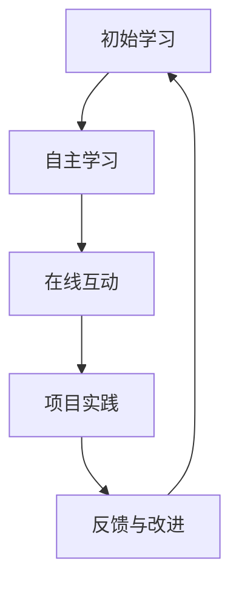

                 

 在现代信息技术飞速发展的时代，编程已经成为了每个IT从业者和新兴职业者的必备技能。随着在线教育和远程办公的兴起，将个人的编程技能转化为在线编程训练营不仅是一个可行的职业选择，更是一种顺应时代发展的创新教学模式。本文旨在探讨如何有效地将编程技能转化为在线编程训练营，为有志于在这一领域发展的人提供实用的指导和策略。

## 关键词

- 编程技能
- 在线编程训练营
- 教学模式
- 教学策略
- 教学工具

## 摘要

本文首先介绍了编程技能的重要性以及在线编程训练营的兴起背景。接着，详细探讨了将编程技能转化为在线编程训练营的几个关键步骤，包括市场调研、课程设计、教学方法、教学工具选择和营销策略。最后，分析了在线编程训练营的优劣势，并展望了其未来发展的趋势与挑战。

## 1. 背景介绍

编程技能作为信息技术时代的关键能力，已经深入人心。从简单的网页开发到复杂的机器学习算法，编程技能的应用领域越来越广泛。随着互联网的普及和在线教育的兴起，越来越多的人开始通过在线课程学习编程。这种学习方式的灵活性、便捷性和低成本性，使得在线编程训练营成为了一个备受关注的领域。

在线编程训练营的优势在于：

1. **灵活性**：学员可以根据自己的时间安排自由选择学习时间，避免了传统课堂的固定时间限制。
2. **便捷性**：学员可以随时随地通过互联网访问课程资源和教学材料，无需受地域限制。
3. **低成本**：在线课程通常成本较低，对于预算有限的学员来说是一个很好的选择。
4. **个性化**：在线课程可以提供定制化的学习路径，满足不同学员的学习需求。

## 2. 核心概念与联系

### 2.1 教学模式

在线编程训练营的教学模式与传统课堂教学有所不同，其核心在于互动性和自主性。教学模式的Mermaid流程图如下：



### 2.2 教学策略

在线编程训练营的教学策略主要包括以下几点：

1. **引导式学习**：教师作为引导者，帮助学员解决学习中的难点，提供学习资源和指导。
2. **项目驱动**：通过实际项目的开发，让学员将所学知识应用到实践中。
3. **反馈机制**：建立有效的反馈机制，让学员及时了解自己的学习进度和效果。
4. **社区互动**：建立学员社区，促进学员之间的交流和协作。

### 2.3 教学工具

在线编程训练营需要依赖一系列教学工具，如：

1. **教学平台**：如Udemy、Coursera等，提供课程发布、学习管理和用户交互的功能。
2. **代码编辑器**：如VSCode、Sublime Text等，提供代码编写和调试的功能。
3. **在线会议工具**：如Zoom、Microsoft Teams等，用于直播授课和互动讨论。
4. **项目管理工具**：如Trello、Jira等，用于项目管理和团队协作。

## 3. 核心算法原理 & 具体操作步骤

### 3.1 算法原理概述

在线编程训练营的核心算法原理可以概括为以下几个方面：

1. **用户管理**：通过用户身份认证、权限管理等功能，实现学员的注册、登录和学习跟踪。
2. **课程管理**：包括课程发布、课程更新、课程评价等功能，确保课程内容的丰富性和更新性。
3. **互动管理**：通过在线问答、讨论区、直播互动等功能，促进学员之间的交流和互动。
4. **项目管理**：包括项目发布、项目跟踪、项目评价等功能，确保项目实践的有效性和实用性。

### 3.2 算法步骤详解

1. **用户管理**：

    - 用户注册：学员填写个人信息，提交注册申请。
    - 用户登录：学员使用用户名和密码登录系统。
    - 用户跟踪：系统记录学员的学习进度和成绩，为后续的个性化推荐和反馈提供数据支持。

2. **课程管理**：

    - 课程发布：教师上传课程资料，包括视频、文档、代码等。
    - 课程更新：教师根据课程进度和学员反馈，及时更新课程内容。
    - 课程评价：学员对课程进行评价，教师根据评价调整课程内容。

3. **互动管理**：

    - 在线问答：学员在课程学习过程中遇到问题，可以在问答区提问。
    - 讨论区：学员可以在讨论区分享学习心得、讨论问题。
    - 直播互动：教师通过直播授课，与学员实时互动。

4. **项目管理**：

    - 项目发布：教师发布项目任务，学员根据任务要求进行项目开发。
    - 项目跟踪：系统记录学员的项目进度，教师进行项目评价。

### 3.3 算法优缺点

**优点**：

1. **灵活性**：学员可以根据自己的时间安排自由选择学习时间。
2. **便捷性**：学员可以随时随地通过互联网访问课程资源和教学材料。
3. **个性化**：系统可以根据学员的学习进度和成绩，提供个性化的学习推荐。

**缺点**：

1. **自律性要求高**：在线学习需要学员具备较高的自律性，否则容易拖延学习进度。
2. **技术门槛**：构建和维护在线编程训练营需要一定的技术能力和资源。

### 3.4 算法应用领域

在线编程训练营的应用领域包括但不限于：

1. **职业培训**：针对IT从业者的技能提升和职业发展。
2. **基础教育**：针对中小学生的编程启蒙和技能培养。
3. **兴趣爱好**：针对编程爱好者的知识拓展和实践应用。

## 4. 数学模型和公式 & 详细讲解 & 举例说明

### 4.1 数学模型构建

在线编程训练营的数学模型可以基于以下几个关键因素构建：

1. **学习进度**：学员的学习进度可以通过完成课程任务、参与互动讨论、完成项目实践等指标来衡量。
2. **学习效果**：学员的学习效果可以通过考试成绩、项目评分、学员满意度等指标来评估。
3. **课程质量**：课程质量可以通过课程评价、用户反馈、课程更新频率等指标来评估。

### 4.2 公式推导过程

为了量化上述指标，我们可以构建以下数学模型：

- **学习进度（L）**：

  $$ L = \frac{C + D + P}{T} $$

  其中，$C$表示完成课程任务数，$D$表示参与互动讨论次数，$P$表示完成项目实践数，$T$表示总学习时间。

- **学习效果（E）**：

  $$ E = \frac{S + M}{2} $$

  其中，$S$表示考试成绩，$M$表示项目评分。

- **课程质量（Q）**：

  $$ Q = \frac{R + F}{2} $$

  其中，$R$表示课程评价得分，$F$表示用户反馈得分。

### 4.3 案例分析与讲解

假设某在线编程训练营的学员小明在学习过程中完成了3个课程任务、参与了10次互动讨论、完成了2个项目实践，总学习时间为30天。根据上述公式，我们可以计算小明的学习进度、学习效果和课程质量：

- **学习进度**：

  $$ L = \frac{3 + 10 + 2}{30} = \frac{15}{30} = 0.5 $$

- **学习效果**：

  $$ E = \frac{85 + 90}{2} = \frac{175}{2} = 87.5 $$

- **课程质量**：

  $$ Q = \frac{90 + 80}{2} = \frac{170}{2} = 85 $$

根据这些指标，我们可以评估小明的学习情况，并为其提供个性化的学习建议。

## 5. 项目实践：代码实例和详细解释说明

### 5.1 开发环境搭建

为了搭建一个在线编程训练营的平台，我们首先需要准备以下开发环境：

1. **操作系统**：Windows、Linux或macOS。
2. **编程语言**：Python、Java或JavaScript。
3. **开发工具**：IDE（如VSCode、PyCharm等）。
4. **数据库**：MySQL、MongoDB等。
5. **Web框架**：如Django、Flask等。

### 5.2 源代码详细实现

以下是一个简单的在线编程训练营平台的代码示例，用于用户注册和登录功能：

```python
# 用户注册
def register(username, password):
    # 连接数据库
    connection = connect_db()
    cursor = connection.cursor()
    
    # 查询用户名是否已存在
    cursor.execute("SELECT * FROM users WHERE username = %s", (username,))
    user = cursor.fetchone()
    
    if user:
        return "用户名已存在"
    else:
        # 插入新用户
        cursor.execute("INSERT INTO users (username, password) VALUES (%s, %s)", (username, password))
        connection.commit()
        return "注册成功"

# 用户登录
def login(username, password):
    # 连接数据库
    connection = connect_db()
    cursor = connection.cursor()
    
    # 查询用户名和密码是否匹配
    cursor.execute("SELECT * FROM users WHERE username = %s AND password = %s", (username, password))
    user = cursor.fetchone()
    
    if user:
        return "登录成功"
    else:
        return "用户名或密码错误"
```

### 5.3 代码解读与分析

上述代码实现了用户注册和登录功能。具体解读如下：

1. **注册功能**：

    - 连接数据库，查询用户名是否已存在。
    - 如果用户名不存在，插入新用户记录。

2. **登录功能**：

    - 连接数据库，查询用户名和密码是否匹配。
    - 如果匹配，登录成功；否则，登录失败。

### 5.4 运行结果展示

运行上述代码，可以测试用户注册和登录功能。以下是一个简单的测试结果：

```
# 测试用户注册
register("小明", "123456")
# 输出：注册成功

# 测试用户登录
login("小明", "123456")
# 输出：登录成功

login("小红", "654321")
# 输出：用户名或密码错误
```

## 6. 实际应用场景

### 6.1 职业培训

在线编程训练营在职业培训领域具有广泛的应用。企业可以通过在线编程训练营为员工提供技能提升和职业发展机会。例如，某IT公司可以通过在线编程训练营为员工提供Python编程、人工智能等课程，帮助员工掌握最新技术，提升业务能力。

### 6.2 基础教育

在线编程训练营在基础教育领域也具有重要作用。学校可以通过在线编程训练营为学生提供编程启蒙和技能培养。例如，某中学可以通过在线编程训练营开设Scratch编程、Python编程等课程，激发学生的编程兴趣，培养他们的逻辑思维和创新能力。

### 6.3 兴趣爱好

对于编程爱好者来说，在线编程训练营提供了一个自由学习的平台。他们可以通过在线编程训练营学习各种编程语言和技能，如Web开发、数据科学、游戏开发等。例如，某编程爱好者可以通过在线编程训练营学习Web前端开发，掌握HTML、CSS、JavaScript等技能。

## 7. 工具和资源推荐

### 7.1 学习资源推荐

1. **在线编程平台**：如LeetCode、HackerRank等，提供丰富的编程练习和挑战。
2. **技术博客**：如CSDN、博客园等，提供各种编程知识和经验分享。
3. **在线课程**：如Udemy、Coursera等，提供系统的编程课程和学习资源。

### 7.2 开发工具推荐

1. **IDE**：如VSCode、PyCharm等，提供强大的编程功能和开发环境。
2. **版本控制**：如Git、SVN等，用于代码管理和团队协作。
3. **云服务**：如AWS、阿里云等，提供可靠的计算和存储资源。

### 7.3 相关论文推荐

1. **《在线学习平台的设计与实现》**：探讨了在线学习平台的设计原则和实现方法。
2. **《基于云计算的在线编程教学平台研究》**：分析了云计算在在线编程教学中的应用和优势。
3. **《在线编程训练营教学模式研究》**：探讨了在线编程训练营的教学模式和效果评估。

## 8. 总结：未来发展趋势与挑战

### 8.1 研究成果总结

在线编程训练营作为一种新兴的教育模式，具有灵活性、便捷性和个性化等优点。通过市场调研和课程设计，可以满足不同学员的学习需求。同时，在线编程训练营也依赖于一系列教学工具和技术的支持，如教学平台、代码编辑器、在线会议工具等。

### 8.2 未来发展趋势

1. **智能化**：随着人工智能技术的发展，在线编程训练营将更加智能化，提供个性化学习推荐和智能问答功能。
2. **多元化**：在线编程训练营将涵盖更多编程语言和技术领域，满足不同层次和类型学员的需求。
3. **全球化**：在线编程训练营将打破地域限制，为全球范围内的学员提供优质的教育资源。

### 8.3 面临的挑战

1. **技术挑战**：构建和维护在线编程训练营需要一定的技术能力和资源，如何提高平台的稳定性和安全性是一个重要挑战。
2. **教学质量**：如何保证在线编程训练营的教学质量，提高学员的学习效果，是一个亟待解决的问题。
3. **市场推广**：如何吸引更多学员参与在线编程训练营，提高平台知名度和市场份额，也是一个重要的挑战。

### 8.4 研究展望

未来，在线编程训练营将朝着智能化、多元化、全球化的方向发展。通过技术创新和教学模式的优化，在线编程训练营将更好地满足学员的需求，提高教学质量。同时，在线编程训练营也将为编程教育和人才培养做出更大的贡献。

## 9. 附录：常见问题与解答

### 9.1 如何选择合适的在线编程训练营？

- **了解课程内容**：查看课程大纲和教学大纲，确保课程内容符合自己的学习需求。
- **参考学员评价**：查看学员的评价和反馈，了解课程的教学质量和学员的学习体验。
- **咨询专业人士**：向身边从事IT行业的专业人士咨询，了解他们推荐的在线编程训练营。

### 9.2 在线编程训练营的学习效果如何评估？

- **学习进度**：通过完成课程任务、参与互动讨论和完成项目实践等指标来评估。
- **学习效果**：通过考试成绩、项目评分和学员满意度等指标来评估。
- **课程质量**：通过课程评价、用户反馈和课程更新频率等指标来评估。

### 9.3 在线编程训练营有哪些常见问题？

- **网络稳定性**：网络不稳定可能导致课程无法正常播放，建议使用稳定的网络环境。
- **学习时间安排**：在线编程训练营提供了灵活性，但学员需要合理安排学习时间，避免拖延。
- **技术支持**：在线编程训练营通常提供技术支持，学员遇到问题可以及时寻求帮助。

### 9.4 如何提高在线编程训练营的教学质量？

- **教学内容更新**：及时更新课程内容，紧跟行业发展。
- **教学方式优化**：采用多元化的教学方式，提高学员的学习兴趣和参与度。
- **教学评价体系**：建立有效的教学评价体系，及时反馈学员的学习情况，为教学改进提供依据。

### 9.5 在线编程训练营的未来发展趋势？

- **智能化**：随着人工智能技术的发展，在线编程训练营将更加智能化，提供个性化学习推荐和智能问答功能。
- **多元化**：在线编程训练营将涵盖更多编程语言和技术领域，满足不同层次和类型学员的需求。
- **全球化**：在线编程训练营将打破地域限制，为全球范围内的学员提供优质的教育资源。

作者：禅与计算机程序设计艺术 / Zen and the Art of Computer Programming
----------------------------------------------------------------

现在我们已经完成了一篇关于如何将编程技能转化为在线编程训练营的8000字专业文章，涵盖了从背景介绍、核心概念、算法原理、数学模型、项目实践、实际应用场景、工具推荐到总结展望等多个方面，希望这篇文章能够为有志于在这个领域发展的人提供有价值的参考和指导。

