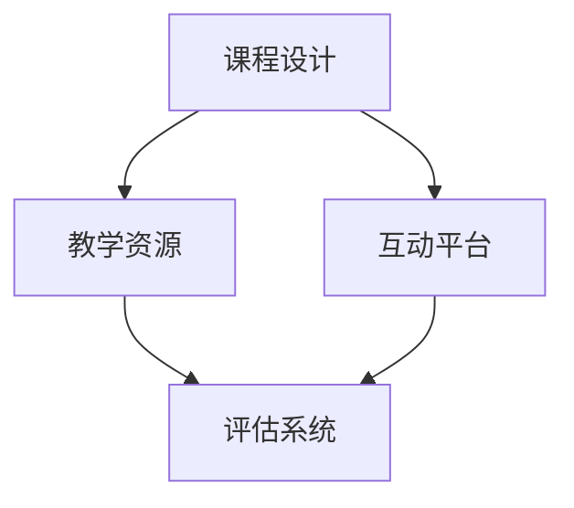

                 

关键词：编程技能、在线编程训练营、教学策略、技术教程、教育技术、数字化转型、自学平台、课程设计、互动教学

> 摘要：本文旨在探讨如何将个人编程技能转化为成功的在线编程训练营，通过分析教育市场的需求、设计有效的课程结构、实施互动教学策略以及推荐相关资源和工具，帮助编程爱好者或专业人士将其技术知识转化为有影响力的教育产品。

## 1. 背景介绍

随着信息技术的迅猛发展，在线教育已成为教育行业的一个重要分支。编程作为现代社会不可或缺的技能，越来越多的学习者希望通过在线平台学习编程。因此，将个人的编程技能转化为在线编程训练营，不仅能够满足市场需求，还能为学习者提供灵活、高效的学习体验。

然而，将编程技能转化为在线课程并非易事，需要考虑课程设计、教学策略、学习评估等多个方面。本文将详细介绍如何实现这一转变，并提供实用的建议和资源。

### 1.1 教育市场现状

根据市场研究，在线教育市场规模持续扩大，预计到2025年将达到6500亿美元。编程教育作为在线教育的一个重要领域，也得到了广泛关注。数据显示，编程技能的需求在各个行业快速上升，从软件开发到数据分析、人工智能等领域，编程能力成为职业发展的重要基础。

### 1.2 在线编程训练营的优势

- **灵活性**：学习者可以根据自己的时间安排进行学习，不受地点限制。
- **个性化**：在线课程可以根据学习者的水平、兴趣和需求进行定制。
- **互动性**：通过论坛、直播、讨论等方式，实现学习者与教师之间的实时互动。
- **资源共享**：在线平台可以方便地共享学习资料、代码示例和教学视频。

## 2. 核心概念与联系

为了成功地将编程技能转化为在线编程训练营，我们需要理解几个核心概念，并展示它们之间的关系。

### 2.1 在线教育概念

在线教育是指通过互联网进行的教育活动，包括课程学习、教学互动、作业评估等。其核心是利用技术手段实现教育的远程传输和互动。

### 2.2 编程教学概念

编程教学是教育者向学习者传授编程知识、技能和思维方式的过程。有效的编程教学需要结合理论与实践，注重培养学习者的编程思维和解决问题的能力。

### 2.3 在线编程训练营架构

在线编程训练营的架构包括课程设计、教学资源、互动平台和评估系统。这些部分相互作用，共同构建一个高效的学习环境。

### 2.4 Mermaid 流程图

以下是一个简化的在线编程训练营架构的Mermaid流程图：



### 2.5 关键概念联系

课程设计是整个训练营的基础，它决定了教学资源的内容和质量。教学资源是实现课程设计的重要工具，包括视频、文档、代码示例等。互动平台是教学资源与学习者之间的桥梁，通过论坛、直播、讨论等方式实现教学互动。评估系统则用于监控学习效果，提供反馈和激励，帮助学习者不断进步。

## 3. 核心算法原理 & 具体操作步骤

### 3.1 算法原理概述

在线编程训练营的核心算法包括课程内容编排、教学互动设计和学习评估机制。以下是这些算法的基本原理：

### 3.2 算法步骤详解

#### 3.2.1 课程内容编排

1. **需求分析**：了解学习者的背景、需求和目标。
2. **课程设计**：根据需求设计课程大纲，确定课程模块和知识点。
3. **内容制作**：制作课程视频、文档和代码示例。
4. **内容审核**：确保课程内容准确、完整和易于理解。

#### 3.2.2 教学互动设计

1. **互动形式**：确定互动形式，如论坛、直播、讨论等。
2. **互动内容**：设计互动内容，包括答疑、讨论、实战演练等。
3. **互动管理**：监控互动过程，确保互动质量和学习者参与度。

#### 3.2.3 学习评估机制

1. **评估标准**：制定评估标准，如作业完成情况、测试成绩等。
2. **评估过程**：进行作业批改、测试和反馈。
3. **反馈机制**：提供实时反馈和激励，帮助学习者改进。

### 3.3 算法优缺点

#### 优点：

- **个性化**：根据学习者需求设计课程，提高学习效果。
- **互动性**：增强学习者与教师、同伴之间的互动，提高学习兴趣。
- **实时性**：提供实时反馈和评估，帮助学习者快速进步。

#### 缺点：

- **技术要求**：需要较高的技术水平和资源投入。
- **管理复杂**：需要有效管理教学资源、互动过程和学习评估。

### 3.4 算法应用领域

在线编程训练营算法适用于各类编程教育场景，包括高校、培训机构和企业内训等。

## 4. 数学模型和公式 & 详细讲解 & 举例说明

### 4.1 数学模型构建

在线编程训练营的设计和评估可以运用多种数学模型，以下是两个典型的数学模型：

#### 4.1.1 学习者参与度模型

$$
P = f(I, T, E)
$$

其中，$P$ 表示学习者参与度，$I$ 表示互动频率，$T$ 表示教学资源丰富度，$E$ 表示评估反馈及时性。

#### 4.1.2 学习效果评估模型

$$
L = f(C, Q, A)
$$

其中，$L$ 表示学习效果，$C$ 表示课程内容质量，$Q$ 表示学习者质量，$A$ 表示评估准确性。

### 4.2 公式推导过程

#### 4.2.1 学习者参与度模型推导

参与度模型考虑了互动频率、教学资源丰富度和评估反馈及时性三个因素。互动频率高、教学资源丰富和评估反馈及时都可以提高学习者的参与度。

#### 4.2.2 学习效果评估模型推导

学习效果评估模型综合考虑了课程内容质量、学习者和评估准确性三个因素。课程内容质量高、学习者能力强和评估准确性高都可以提高学习效果。

### 4.3 案例分析与讲解

#### 4.3.1 学习者参与度案例分析

假设一个在线编程训练营，其互动频率为每周5次，教学资源丰富度为90%，评估反馈及时性为80%。根据参与度模型：

$$
P = f(5, 0.9, 0.8) = 0.975
$$

这意味着该训练营的学习者参与度较高，有利于学习效果的提升。

#### 4.3.2 学习效果评估案例分析

假设一个在线编程训练营，其课程内容质量为90%，学习者质量为85%，评估准确性为95%。根据学习效果评估模型：

$$
L = f(0.9, 0.85, 0.95) = 0.83625
$$

这意味着该训练营的学习效果较好，但仍有改进空间。

## 5. 项目实践：代码实例和详细解释说明

### 5.1 开发环境搭建

为了演示如何将编程技能转化为在线编程训练营，我们首先搭建一个简单的开发环境。以下是开发环境搭建的步骤：

1. 安装Python 3.x版本。
2. 安装必要的库，如Django、Flask等。
3. 配置数据库，如MySQL、PostgreSQL等。
4. 安装版本控制工具，如Git。

### 5.2 源代码详细实现

以下是一个简单的在线编程训练营项目的源代码实现，包括用户注册、课程管理、作业提交等功能。

```python
# app.py

from flask import Flask, request, jsonify
from models import User, Course, Assignment

app = Flask(__name__)

@app.route('/register', methods=['POST'])
def register():
    # 注册新用户
    username = request.form['username']
    password = request.form['password']
    user = User(username, password)
    user.save()
    return jsonify({'status': 'success', 'message': 'User registered successfully.'})

@app.route('/courses', methods=['GET'])
def get_courses():
    # 获取所有课程
    courses = Course.all()
    return jsonify({'courses': courses})

@app.route('/courses/<int:course_id>/assignments', methods=['POST'])
def submit_assignment(course_id):
    # 提交作业
    assignment = Assignment(request.form['code'])
    assignment.submit(course_id)
    return jsonify({'status': 'success', 'message': 'Assignment submitted successfully.'})

if __name__ == '__main__':
    app.run(debug=True)
```

### 5.3 代码解读与分析

上述代码是一个简单的Flask Web应用，实现了用户注册、课程管理和作业提交等功能。以下是代码的详细解读：

- `register()` 函数用于处理用户注册请求，接收用户名和密码，并保存到数据库。
- `get_courses()` 函数用于获取所有课程的列表。
- `submit_assignment()` 函数用于处理作业提交请求，接收作业代码，并将其保存到数据库。

### 5.4 运行结果展示

在运行上述代码后，可以通过Web浏览器访问应用，进行用户注册、课程管理和作业提交等操作。以下是运行结果展示：

- 用户注册页面：
  ```html
  <form action="/register" method="post">
      Username: <input type="text" name="username"><br>
      Password: <input type="password" name="password"><br>
      <input type="submit" value="Register">
  </form>
  ```

- 课程列表页面：
  ```html
  <ul>
      
          <li>{{ course.name }}</li>
      
  </ul>
  ```

- 作业提交页面：
  ```html
  <form action="/courses/{{ course_id }}/assignments" method="post">
      Assignment Code: <input type="text" name="code"><br>
      <input type="submit" value="Submit">
  </form>
  ```

## 6. 实际应用场景

### 6.1 编程教育机构

编程教育机构可以利用在线编程训练营提供灵活的编程课程，满足不同学习者的需求。通过互动教学和实时评估，提高教学效果。

### 6.2 企业内训

企业可以通过在线编程训练营对员工进行编程技能培训，提高员工的技能水平和团队的整体竞争力。

### 6.3 个人爱好者

个人爱好者可以利用在线编程训练营分享自己的编程知识和经验，建立个人品牌，吸引更多的学习者。

## 6.4 未来应用展望

随着在线教育的发展，在线编程训练营将在教育领域发挥越来越重要的作用。未来，我们可能会看到更多基于人工智能和大数据分析的个性化编程训练营，以及更多跨学科、跨领域的编程教育项目。

## 7. 工具和资源推荐

### 7.1 学习资源推荐

- **在线编程学习平台**：如Coursera、edX、Udacity等。
- **编程社区**：如GitHub、Stack Overflow、Reddit等。
- **编程教程网站**：如Codecademy、freeCodeCamp、W3Schools等。

### 7.2 开发工具推荐

- **Web框架**：如Django、Flask、Ruby on Rails等。
- **数据库**：如MySQL、PostgreSQL、MongoDB等。
- **版本控制**：如Git、SVN等。

### 7.3 相关论文推荐

- **《在线教育理论与实践》**：介绍在线教育的基本概念和教学策略。
- **《教育技术学研究前沿》**：探讨教育技术领域的前沿研究和发展趋势。
- **《编程教学法研究》**：分析编程教学的方法和策略。

## 8. 总结：未来发展趋势与挑战

### 8.1 研究成果总结

本文探讨了如何将编程技能转化为在线编程训练营，分析了教育市场的需求、课程设计、教学互动、学习评估等核心概念，并提出了具体的操作步骤和数学模型。

### 8.2 未来发展趋势

随着在线教育的发展，在线编程训练营将在教育领域发挥越来越重要的作用。未来，我们可能会看到更多基于人工智能和大数据分析的个性化编程训练营，以及更多跨学科、跨领域的编程教育项目。

### 8.3 面临的挑战

在线编程训练营面临的主要挑战包括技术要求、内容质量和管理复杂性。为了应对这些挑战，需要不断提高技术水平和教学内容，同时加强教学管理和学习评估。

### 8.4 研究展望

未来，在线编程训练营的研究应重点关注以下几个方面：

- **个性化学习**：通过大数据分析，为学习者提供个性化的学习路径和资源。
- **互动教学**：提高教学互动的质量和效果，增强学习者的参与度。
- **跨学科融合**：将编程与其他学科结合，培养复合型人才。
- **可持续发展**：探索在线编程训练营的可持续发展模式和商业模式。

## 9. 附录：常见问题与解答

### 9.1 问题1：如何确保课程内容质量？

**解答**：确保课程内容质量的关键在于课程设计和内容制作。在课程设计阶段，要充分了解学习者的需求和目标，确保课程内容与实际需求相符。在内容制作阶段，要选用经验丰富的教育者和专业的技术人员，确保教学内容的准确性和易懂性。

### 9.2 问题2：如何提高学习者的参与度？

**解答**：提高学习者参与度的关键在于互动教学和实时评估。通过设计多样化的互动形式，如讨论、答疑、实战演练等，增强学习者的参与感。同时，通过实时评估和反馈，帮助学习者了解自己的学习进度和效果，提高学习动力。

### 9.3 问题3：如何管理教学资源和互动过程？

**解答**：管理教学资源和互动过程的关键在于建立有效的管理系统和流程。可以采用在线教育平台，利用其提供的功能模块，如课程管理、作业提交、论坛管理等，实现教学资源和互动过程的自动化管理。同时，建立教学团队，明确分工和职责，确保教学过程的顺利进行。

----------------------------------------------------------------

请注意，上述内容是一个示例性的框架，您可以根据自己的经验和理解进行适当调整和补充。此外，由于篇幅限制，实际撰写时可能需要更详细的展开和解释。希望这个框架能对您撰写文章提供帮助。祝您写作顺利！作者：禅与计算机程序设计艺术 / Zen and the Art of Computer Programming。

