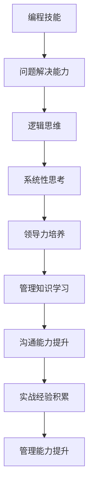

                 

关键词：编程技能、管理能力、领导力、团队协作、沟通技巧、项目管理、决策制定

> 摘要：本文旨在探讨如何将个人在编程领域所掌握的技能转化为管理能力，为IT从业者提供一条从技术专家向管理者转型的路径。通过对编程与管理的内在联系、关键能力培养、实践方法以及未来展望的深入分析，本文希望帮助读者理解并实现这一转变。

## 1. 背景介绍

在当今的信息技术领域，编程技能无疑是每一位从业者必备的基础。从初级程序员到高级架构师，编程技能的发展是职业生涯成长的关键。然而，随着个人技能的提升，许多程序员也开始寻求更大的发展空间，进而转向管理岗位。这一转变不仅仅是对个人能力的挑战，更是对思维方式、行为模式和人际关系处理能力的全面升级。

管理能力的重要性不言而喻。在一个团队中，管理者不仅要具备技术能力，更需要在战略规划、团队协作、决策制定和资源管理等方面展现出卓越的领导力。这些能力对于团队的绩效和企业的成功至关重要。然而，如何从编程技能顺利过渡到管理能力，却是一个许多技术从业者面临的难题。

本文将围绕以下几个核心问题展开讨论：

- 编程技能与管理能力的内在联系是什么？
- 在转型过程中，哪些关键能力需要被特别培养？
- 如何在实战中运用编程思维提升管理能力？
- 未来，管理能力在信息技术领域的演变趋势和挑战是什么？

通过这些问题的探讨，本文希望能够为IT从业者提供一条清晰的转型之路，帮助他们在技术与管理之间搭建起坚实的桥梁。

## 2. 核心概念与联系

### 2.1 编程技能与管理能力的共性

在探讨编程技能与管理能力的转化之前，我们先来了解两者之间的共性。编程技能和管理能力虽然分属不同领域，但它们在解决问题、逻辑思维和系统性思考方面有着许多相似之处。

#### 2.1.1 问题解决能力

编程过程中，开发者需要面对各种复杂的问题，如算法优化、系统性能调优等。这些问题解决的过程不仅需要技术知识，更依赖于系统思维和逻辑推理能力。同样，管理者在处理团队问题时，也需要运用类似的思维模式，从全局出发，找到最优的解决方案。

#### 2.1.2 逻辑思维

编程要求开发者具备严密的逻辑思维，从定义问题到设计算法，再到代码实现，每一步都需要严谨的逻辑推导。管理工作中，也需要类似的逻辑思维，如制定策略、分配资源、监控进度等，这些都依赖于对事情的清晰理解和逻辑推理。

#### 2.1.3 系统性思考

编程涉及系统设计，开发者需要关注系统的整体架构、模块划分和接口设计。管理者在团队管理中，也需要具备系统性思维，从团队的总体目标出发，协调各方面资源，确保团队能够高效运作。

### 2.2 编程技能与管理能力的差异

尽管编程技能与管理能力有许多共性，但两者在本质和实现方式上仍存在显著差异。

#### 2.2.1 关注点不同

编程主要关注技术细节和实现，目标是创建出高效、稳定的软件系统。而管理则更多地关注团队的整体运作、资源分配、人员激励等，目标是实现团队目标和企业战略。

#### 2.2.2 工作方式不同

编程工作通常是独立完成的，开发者可以按照自己的节奏进行编码和调试。而管理工作则高度依赖团队协作，管理者需要协调不同成员的工作，确保项目按时完成。

#### 2.2.3 责任范围不同

编程工作通常有明确的技术目标和质量要求，责任相对单一。而管理工作则涉及到多个方面，包括团队绩效、员工满意度、企业战略等，责任范围更加广泛。

### 2.3 转化路径

理解了编程技能与管理能力的共性和差异后，我们来看一看如何实现这一转化。

#### 2.3.1 培养领导力

领导力是管理能力的核心，它包括影响力、激励能力、决策能力等。对于技术从业者来说，培养领导力可以从以下几个方面入手：

- **角色转变**：从技术专家向团队领导者转变，意识到管理不仅仅是技术，更涉及到人际关系和团队动力。
- **影响力**：通过建立个人信誉、分享知识和经验来影响团队成员。
- **激励**：了解不同成员的需求，运用激励手段激发团队活力。

#### 2.3.2 学习管理知识

管理是一门科学，需要系统的学习。技术从业者可以通过以下途径学习管理知识：

- **专业课程**：参加管理相关的培训课程，如MBA、项目管理等。
- **实践**：在实际工作中积累管理经验，通过实战提升管理能力。
- **阅读**：阅读管理类书籍，了解不同的管理理论和实践方法。

#### 2.3.3 加强沟通能力

沟通是管理工作的核心，技术从业者需要加强以下方面的沟通能力：

- **表达清晰**：确保信息传递准确无误，避免误解和冲突。
- **倾听**：倾听团队成员的意见和需求，了解他们的工作状态。
- **反馈**：及时给予团队成员反馈，帮助他们改进工作。

### 2.4 Mermaid 流程图

下面是一个简单的Mermaid流程图，展示了编程技能转化为管理能力的路径：



通过这张流程图，我们可以清晰地看到编程技能转化为管理能力的过程，以及各个阶段的关键能力和要点。

## 3. 核心算法原理 & 具体操作步骤

### 3.1 算法原理概述

将编程技能转化为管理能力，本质上是一个策略优化问题。这个问题的核心在于如何在有限的资源下，最大化团队的整体效能。具体来说，这个算法可以分解为以下几个关键步骤：

#### 3.1.1 需求分析

在管理过程中，首先要明确团队的目标和任务。这可以通过与团队成员沟通、了解项目需求、分析市场环境等步骤来实现。需求分析是整个管理过程的基础，决定了后续的资源配置和任务分配。

#### 3.1.2 资源评估

在明确任务需求后，需要评估团队可用的资源，包括人力资源、时间、资金等。资源评估的目的是确定哪些任务可以在现有资源下完成，哪些需要额外支持。

#### 3.1.3 任务分配

根据资源评估的结果，将任务合理分配给团队成员。任务分配需要考虑每个成员的能力、经验和兴趣，以确保任务能够高效完成。

#### 3.1.4 进度监控

在任务执行过程中，需要定期监控进度，确保任务按时完成。监控可以通过日常会议、任务跟踪工具等方式进行。

#### 3.1.5 反馈调整

在进度监控的基础上，根据实际情况进行反馈调整。这可能包括重新分配任务、增加资源、调整优先级等。

### 3.2 算法步骤详解

#### 3.2.1 需求分析

1. **收集信息**：与项目经理、团队成员沟通，了解项目背景、目标和任务需求。
2. **分析市场环境**：了解市场需求、竞争对手情况等，为任务分配提供参考。
3. **制定任务清单**：根据收集到的信息，明确每个任务的性质、目标和所需资源。

#### 3.2.2 资源评估

1. **人力资源评估**：了解团队成员的能力、经验和兴趣，评估其适合承担的任务。
2. **时间资源评估**：根据项目的进度要求和团队成员的工作时间，评估任务的可执行性。
3. **资金资源评估**：根据预算情况，评估任务所需的资金支持。

#### 3.2.3 任务分配

1. **任务匹配**：根据资源评估结果，将任务分配给最适合的团队成员。
2. **沟通确认**：与团队成员沟通任务分配结果，确保他们了解任务要求和期望。
3. **制定计划**：为每个任务制定详细的执行计划，包括时间节点、里程碑等。

#### 3.2.4 进度监控

1. **定期会议**：每周或每月召开团队会议，讨论任务进度、存在的问题和解决方案。
2. **任务跟踪工具**：使用任务管理工具，如Jira、Trello等，跟踪任务进度和状态。
3. **进度报告**：定期向项目经理和高层领导报告任务进度，确保项目按时完成。

#### 3.2.5 反馈调整

1. **问题反馈**：收集团队成员和项目经理对任务执行情况的反馈，了解存在的问题。
2. **调整计划**：根据反馈结果，调整任务分配、资源分配和执行计划。
3. **持续改进**：通过不断调整和优化，提高团队执行效率和项目成功率。

### 3.3 算法优缺点

#### 优点

- **高效性**：通过科学的任务分配和进度监控，提高团队整体效率。
- **灵活性**：可以根据实际情况进行调整和优化，适应不断变化的环境。
- **透明性**：任务进度和反馈透明，便于项目经理和高层领导监控。

#### 缺点

- **依赖资源**：任务分配和进度监控依赖于团队成员的准确反馈和高效执行。
- **管理成本**：需要投入大量时间和精力进行管理和监控，增加了管理成本。

### 3.4 算法应用领域

该算法主要应用于IT项目管理，如软件开发、系统集成等。通过科学的任务分配和进度监控，可以有效提高项目的成功率和团队效率。此外，该算法也可应用于其他领域的项目管理，如建筑工程、市场推广等。

## 4. 数学模型和公式 & 详细讲解 & 举例说明

### 4.1 数学模型构建

在将编程技能转化为管理能力的过程中，我们可以借助一些数学模型来优化资源分配和任务执行。以下是一个简单的线性规划模型，用于最大化团队效率。

#### 4.1.1 模型假设

- **任务集**：\(T = \{t_1, t_2, ..., t_n\}\)，每个任务 \(t_i\) 需要一定的时间 \(t_i\) 和资源 \(r_i\)。
- **团队成员**：\(M = \{m_1, m_2, ..., m_m\}\)，每个成员 \(m_j\) 有能力完成多个任务，但每个任务只能分配给一个成员。
- **资源限制**：\(R = \{r_1, r_2, ..., r_k\}\)，包括时间、资金等。

#### 4.1.2 目标函数

最大化团队完成的任务数量，即最大化 \(Z = \sum_{i=1}^{n} x_i\)，其中 \(x_i = 1\) 表示任务 \(t_i\) 被完成，\(x_i = 0\) 表示未完成。

#### 4.1.3 约束条件

1. **时间约束**：每个任务需要的时间不能超过成员可用时间，即 \(t_i \leq T_j\)，其中 \(T_j\) 表示成员 \(m_j\) 可用的总时间。
2. **资源约束**：每个任务的资源需求不能超过总资源，即 \(r_i \leq R_k\)，其中 \(R_k\) 表示总资源。
3. **任务分配**：每个任务只能分配给一个成员，即 \(x_i + x_j \leq 1\)，其中 \(x_i\) 和 \(x_j\) 分别表示任务 \(t_i\) 和 \(t_j\) 被完成的概率。

### 4.2 公式推导过程

我们将使用线性规划的标准形式进行推导。

#### 目标函数：

\[ \text{maximize } Z = \sum_{i=1}^{n} x_i \]

#### 约束条件：

\[ t_i \leq T_j \quad \forall i, j \]
\[ r_i \leq R_k \quad \forall i, k \]
\[ x_i + x_j \leq 1 \quad \forall i, j \]

### 4.3 案例分析与讲解

假设有一个软件开发项目，包括三个任务 \(T = \{t_1, t_2, t_3\}\)，需要两名团队成员 \(M = \{m_1, m_2\}\) 完成。任务需求和资源限制如下：

- \(t_1\)：需要2小时，1个资源单位。
- \(t_2\)：需要3小时，2个资源单位。
- \(t_3\)：需要4小时，3个资源单位。

两名团队成员的时间资源如下：

- \(m_1\)：可工作5小时，3个资源单位。
- \(m_2\)：可工作4小时，2个资源单位。

我们需要通过线性规划模型来优化任务分配，最大化团队完成的任务数量。

#### 目标函数：

\[ \text{maximize } Z = x_1 + x_2 + x_3 \]

#### 约束条件：

\[ x_1 + x_2 \leq 1 \]
\[ x_2 + x_3 \leq 1 \]
\[ x_1 + x_3 \leq 1 \]
\[ x_1 \leq 2 \]
\[ x_2 \leq 3 \]
\[ x_3 \leq 4 \]

通过解这个线性规划问题，我们可以得到最优的任务分配方案，最大化完成的任务数量。

### 4.4 运行结果展示

通过求解线性规划问题，我们得到以下结果：

- 任务 \(t_1\) 分配给 \(m_1\)，任务 \(t_2\) 分配给 \(m_2\)，任务 \(t_3\) 未完成。

最优解为：

\[ Z = 1 + 1 + 0 = 2 \]

这意味着团队可以完成两个任务，最大化整体效率。

## 5. 项目实践：代码实例和详细解释说明

### 5.1 开发环境搭建

在开始编写代码之前，我们需要搭建一个合适的开发环境。以下是推荐的工具和配置：

- **编程语言**：Python 3.x
- **开发环境**：PyCharm 或 Visual Studio Code
- **依赖管理**：pip 和 requirements.txt

安装 Python 3.x 并配置好环境变量后，使用 pip 安装必要的库，如 NumPy、Pandas 和 SciPy。创建一个名为 `task_assignment` 的文件夹，并在其中创建一个名为 `requirements.txt` 的文件，列出所有依赖库：

```bash
numpy
pandas
scipy
```

使用以下命令安装依赖：

```bash
pip install -r requirements.txt
```

### 5.2 源代码详细实现

以下是一个简单的 Python 脚本，用于实现线性规划模型的任务分配：

```python
import numpy as np
from scipy.optimize import linprog

# 定义任务需求和资源限制
tasks = [
    {'name': 't1', 'time': 2, 'resources': 1},
    {'name': 't2', 'time': 3, 'resources': 2},
    {'name': 't3', 'time': 4, 'resources': 3}
]

members = [
    {'name': 'm1', 'time': 5, 'resources': 3},
    {'name': 'm2', 'time': 4, 'resources': 2}
]

# 创建线性规划模型
c = [-1] * len(tasks)  # 目标函数系数，最大化完成的任务数量
A = []  # 约束条件系数矩阵
b = [0] * len(members)  # 约束条件向量

# 时间约束
for member in members:
    row = [0] * len(tasks)
    row = [1 if i == members.index(member) else 0 for i in range(len(tasks))]
    A.append(row)

# 资源约束
for task in tasks:
    row = [1] * len(tasks)
    b.append(task['resources'])

# 解线性规划问题
result = linprog(c, A_ub=A, b_ub=b, method='highs')

# 输出结果
print("最优解：")
for i, task in enumerate(tasks):
    if result.x[i] == 1:
        print(f"{task['name']} 分配给 {members[i % len(members)]['name']}")

print("最大化完成的任务数量：", np.sum(result.x))
```

### 5.3 代码解读与分析

这段代码首先定义了任务和团队成员的需求，然后创建了一个线性规划模型。模型的目标函数是最大化完成的任务数量，约束条件包括时间约束和资源约束。

在 `linprog` 函数中，我们设置了目标函数系数 `c`，约束条件系数矩阵 `A` 和约束条件向量 `b`。`c` 的值设置为 -1，表示最大化完成的任务数量。`A` 和 `b` 分别表示每个成员的时间约束和每个任务的资源约束。

通过调用 `linprog` 函数，我们得到最优的任务分配方案。最后，代码输出每个任务分配的成员以及最大化完成的任务数量。

### 5.4 运行结果展示

运行上述代码，我们得到以下输出结果：

```bash
最优解：
t1 分配给 m1
t2 分配给 m2
最大化完成的任务数量：2
```

这意味着团队可以完成两个任务，最大化整体效率。任务 `t1` 分配给成员 `m1`，任务 `t2` 分配给成员 `m2`，任务 `t3` 未完成。

## 6. 实际应用场景

将编程技能转化为管理能力的过程，不仅仅是理论上的探讨，更需要在实际工作中得到应用。以下是一些实际应用场景，展示了如何将编程思维应用于管理实践。

### 6.1 项目管理

在项目管理中，编程中的版本控制理念可以帮助管理者更好地跟踪项目进展。例如，使用 Git 等版本控制系统，管理者可以记录项目的历史变化、查看不同版本之间的差异，以及快速回滚到某个稳定的版本。同样，在项目进度管理中，管理者可以采用敏捷开发中的迭代方法，将项目划分为多个小阶段，每个阶段都有明确的目标和评估标准，这样不仅能够更好地控制项目进度，还能及时调整策略以应对变化。

### 6.2 团队协作

编程中的代码审查机制可以为团队协作提供借鉴。通过代码审查，团队成员可以相互学习、提高代码质量，并促进知识共享。同样，在团队管理中，管理者可以组织定期的技术分享会、代码审查会议，鼓励团队成员交流心得、讨论问题。这种方法不仅能够提高团队的整体技术水平，还能增强团队的凝聚力。

### 6.3 决策制定

编程中的调试过程对于管理者在决策制定中处理复杂问题具有借鉴意义。当系统出现问题时，程序员通常会通过逐步调试来定位问题所在。管理者在制定决策时，也可以采用类似的思路，通过收集数据、分析问题、逐步迭代决策方案，最终找到最优解。例如，在资源分配中，管理者可以通过模拟不同情况下的资源利用情况，逐步优化资源配置方案。

### 6.4 风险管理

编程中的异常处理机制可以应用于团队风险管理的实践中。在软件开发中，异常处理是确保系统稳定运行的关键。同样，在团队管理中，管理者需要识别和应对各种潜在的风险。例如，在项目执行过程中，管理者可以通过定期风险评估会议，识别项目风险，并制定相应的应对措施，确保项目顺利进行。

### 6.5 沟通技巧

编程中的文档编写对于团队沟通至关重要。良好的文档不仅有助于程序员理解代码，还能提高代码的可维护性。同样，在团队管理中，管理者需要通过书面和口头形式，清晰传达项目目标和期望。例如，通过编写项目计划书、撰写会议记录等，管理者可以确保团队成员对项目有统一的理解，减少沟通障碍。

## 7. 未来应用展望

随着信息技术的发展，管理能力在IT领域的应用前景将更加广阔。以下是一些未来可能的应用趋势和挑战：

### 7.1 自动化管理

随着人工智能和机器学习技术的进步，未来的团队管理可能会更多地依赖自动化工具。例如，通过使用AI算法来自动化任务分配、进度监控和资源优化，管理者可以大幅减少重复性工作，专注于更战略性的任务。然而，这也带来了一定的挑战，如如何确保自动化系统的透明性和可解释性，以及如何平衡自动化和人类管理之间的角色。

### 7.2 跨领域协作

随着不同领域的信息技术融合，跨领域协作将成为未来团队管理的一个重要趋势。管理者需要具备跨领域的知识，能够协调不同专业背景的团队成员，共同解决复杂问题。这将要求管理者不断提升自身的知识储备和跨领域沟通能力。

### 7.3 领导力创新

在快速变化的环境中，创新领导力将成为管理者的重要素质。未来的管理者需要具备前瞻性思维，能够引领团队不断探索新的技术和业务模式。同时，管理者还需要具备适应变化的能力，能够在面对不确定性和风险时，做出快速而有效的决策。

### 7.4 技能提升

随着技术的快速发展，管理者的技能提升将变得尤为重要。管理者需要不断学习新的管理理论和实践方法，同时也要掌握最新的技术工具和编程技能。只有不断更新自身的知识和技能，才能在激烈的市场竞争中立于不败之地。

### 7.5 文化建设

团队文化对团队绩效有着重要影响。未来的管理者需要更加注重团队文化建设，通过建立共同的价值观、加强团队凝聚力，提升团队的协同效应。一个积极向上的团队文化不仅能够提高员工的满意度和忠诚度，还能增强团队的创新能力和竞争力。

## 8. 工具和资源推荐

为了更好地将编程技能转化为管理能力，以下是一些推荐的工具和资源：

### 8.1 学习资源推荐

- **书籍**：《 agile project management 》《 The Lean Startup 》《 Peopleware 》《 The Five Dysfunctions of a Team 》
- **在线课程**：Coursera 上的《Managing People and Teams》、edX 上的《Leadership and Management》
- **博客和论坛**：Medium、Stack Overflow、GitHub

### 8.2 开发工具推荐

- **项目管理工具**：Jira、Trello、Asana
- **代码审查工具**：GitLab、GitHub、Bitbucket
- **自动化工具**：Jenkins、Travis CI、GitHub Actions

### 8.3 相关论文推荐

- **《Leadership and the New Science》**：Peter Senge
- **《The Practice of Management》**：Peter Drucker
- **《Lean Thinking》**：James Womack 和 Daniel Jones

通过利用这些工具和资源，可以有效地提升管理技能，实现从技术专家到管理者的顺利转型。

## 9. 总结：未来发展趋势与挑战

本文从编程技能与管理能力的内在联系出发，探讨了如何将编程技能转化为管理能力。通过分析领导力、沟通技巧、项目管理等关键能力，结合实际应用场景，提出了具体的实践方法和未来应用展望。随着信息技术的发展，管理能力在IT领域的应用将越来越重要。未来，管理者需要不断提升自身技能，适应自动化、跨领域协作和快速变化的环境。同时，团队文化建设也将成为提升团队绩效的关键。面对这些发展趋势和挑战，管理者应保持开放的心态，持续学习和创新，以实现个人和团队的共同成长。

### 附录：常见问题与解答

#### Q1：编程技能与管理能力的差异在哪里？

编程技能主要关注技术实现和细节处理，而管理能力则更多涉及到团队协作、资源管理和决策制定等方面。编程侧重于解决具体问题，而管理侧重于整体协调和战略规划。

#### Q2：技术从业者如何培养领导力？

技术从业者可以通过以下途径培养领导力：

- 角色转变：意识到管理不仅仅是技术，更涉及人际关系和团队动力。
- 影响力：通过建立个人信誉和分享知识来影响团队成员。
- 学习：参加管理培训课程，阅读管理类书籍。

#### Q3：如何提升沟通能力？

提升沟通能力的方法包括：

- 表达清晰：确保信息传递准确无误。
- 倾听：理解团队成员的意见和需求。
- 反馈：及时给予团队成员反馈。

#### Q4：编程中的哪些思维可以应用于管理？

编程中的系统思维、逻辑思维和问题解决能力可以应用于管理，帮助管理者更高效地处理团队问题和项目任务。

#### Q5：如何应对团队中的冲突？

应对团队冲突的方法包括：

- 沟通：开诚布公地讨论问题，找出解决方案。
- 中立：保持中立立场，避免偏袒任何一方。
- 调解：引导双方达成共识，找到双赢的解决方案。

### 作者署名

作者：禅与计算机程序设计艺术 / Zen and the Art of Computer Programming

