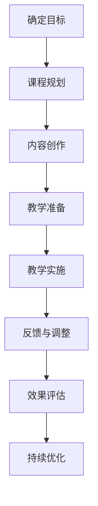

                 

关键词：编程训练营，线上教育，技能转化，教育技术，教学方法

> 摘要：本文将探讨如何将个人的编程技能转化为线上编程训练营，通过详细阐述核心概念、算法原理、数学模型、项目实践、应用场景、工具资源以及未来发展展望等内容，为编程爱好者提供一套全面的教学指南。

## 1. 背景介绍

随着互联网技术的飞速发展，线上教育逐渐成为人们学习新技能的重要途径。编程作为一门重要的技能，对于未来的职业发展具有极大的价值。然而，传统线下编程培训存在诸多限制，如地域限制、时间限制、资源限制等。因此，将编程技能转化为线上编程训练营，不仅有助于打破这些限制，还能够更广泛地传播知识，满足不同人群的学习需求。

本文旨在为编程爱好者提供一套完整的线上编程训练营构建方案，从核心概念、算法原理、数学模型到实际项目实践，以及工具和资源的推荐，力求为读者呈现一个清晰、易懂的构建过程。

## 2. 核心概念与联系

在构建线上编程训练营之前，我们需要明确一些核心概念，包括编程技能、教育技术、教学方法等。

### 2.1 编程技能

编程技能是指运用编程语言和工具解决实际问题的能力。常见的编程语言包括Python、Java、C++等。编程技能的核心包括算法和数据结构、软件工程、数据库管理、前端开发等。

### 2.2 教育技术

教育技术是指运用信息技术促进学习过程和学习资源的设计、开发、应用和管理。在教育技术中，线上教育平台、学习管理系统（LMS）、虚拟实验室等工具尤为重要。

### 2.3 教学方法

教学方法是指教师与学生之间互动的过程和方法。线上教学的方法包括视频教学、直播授课、作业与讨论、在线测评等。选择合适的教学方法对于提高学习效果至关重要。

### 2.4 Mermaid 流程图

以下是一个简化的编程训练营流程图：



## 3. 核心算法原理 & 具体操作步骤

### 3.1 算法原理概述

线上编程训练营的核心在于教学效果，因此需要运用算法原理来优化教学过程。核心算法原理包括：

- **学习算法**：用于分析学习数据，优化教学内容和顺序。
- **推荐算法**：根据学习行为推荐合适的学习资源和课程。
- **评估算法**：对学习效果进行评估，提供反馈和改进建议。

### 3.2 算法步骤详解

#### 3.2.1 学习算法

1. **数据收集**：收集学生的学习数据，包括学习时间、学习进度、作业完成情况等。
2. **数据预处理**：清洗和整理数据，去除噪音和异常值。
3. **特征提取**：从数据中提取关键特征，用于模型训练。
4. **模型训练**：使用机器学习算法训练模型，优化教学内容和顺序。
5. **模型评估**：评估模型效果，调整参数以提升模型性能。

#### 3.2.2 推荐算法

1. **用户画像**：构建用户画像，包括学习兴趣、学习水平、职业背景等。
2. **推荐算法**：使用协同过滤、基于内容的推荐等方法生成推荐列表。
3. **个性化调整**：根据用户反馈和学习行为，动态调整推荐策略。

#### 3.2.3 评估算法

1. **指标定义**：定义学习效果指标，如学习完成率、作业通过率、知识掌握度等。
2. **评估过程**：定期评估学习效果，分析数据，生成评估报告。
3. **反馈机制**：根据评估结果，提供反馈和建议，指导教师和学生改进。

### 3.3 算法优缺点

**学习算法**：
- 优点：个性化强，能够根据学生特点调整教学。
- 缺点：模型训练复杂，需要大量数据和计算资源。

**推荐算法**：
- 优点：能够推荐合适的学习资源和课程，提高学习效率。
- 缺点：可能存在推荐偏差，需要不断优化。

**评估算法**：
- 优点：能够实时监控学习效果，提供有针对性的建议。
- 缺点：评估指标设计复杂，需要不断调整。

### 3.4 算法应用领域

算法可以应用于多个领域，包括：
- **个性化学习**：根据学生特点调整教学。
- **课程推荐**：推荐合适的学习资源和课程。
- **学习效果评估**：监控学习效果，提供反馈和建议。

## 4. 数学模型和公式 & 详细讲解 & 举例说明

### 4.1 数学模型构建

为了优化教学过程，我们可以构建以下数学模型：

1. **学习效果模型**：评估学习效果，包括知识掌握度、作业完成情况等。
2. **推荐模型**：根据用户画像和学习行为推荐学习资源和课程。
3. **评估模型**：评估学习效果，提供反馈和建议。

### 4.2 公式推导过程

假设我们有以下学习效果模型：

$$
E = f(X, Y, Z)
$$

其中，$E$ 表示学习效果，$X$ 表示学习时间，$Y$ 表示作业完成情况，$Z$ 表示学习资源质量。

我们通过以下步骤推导公式：

1. **确定输入变量**：根据实际情况确定输入变量，如学习时间、作业完成情况、学习资源质量等。
2. **选择合适函数**：选择合适的函数，如线性函数、多项式函数等。
3. **参数估计**：通过数据拟合，估计函数参数。

### 4.3 案例分析与讲解

假设我们有一个编程训练营，学生小明参加了为期一个月的课程，每天学习2小时，作业完成率达到90%，学习资源质量较高。根据学习效果模型，我们可以计算出小明的一个学习效果值：

$$
E = f(2 \times 30, 0.9, 0.9) = f(60, 0.9, 0.9)
$$

通过参数估计，我们得到：

$$
f(60, 0.9, 0.9) = 0.75
$$

这意味着小明在这个月的学习效果为75%。

### 4.4 数学模型和公式在实际项目中的应用

数学模型和公式可以应用于以下实际项目：

1. **学习效果评估**：通过评估模型，实时监控学习效果，提供反馈和建议。
2. **课程推荐**：根据推荐模型，推荐合适的学习资源和课程，提高学习效率。
3. **个性化学习**：根据学习算法，个性化调整教学内容和顺序，提高学习效果。

## 5. 项目实践：代码实例和详细解释说明

### 5.1 开发环境搭建

搭建线上编程训练营的开发环境需要以下工具：

- **编程语言**：Python、Java等。
- **开发工具**：Visual Studio Code、IntelliJ IDEA等。
- **在线教育平台**：Moodle、Canvas等。

### 5.2 源代码详细实现

以下是一个简单的Python代码实例，用于计算学习效果：

```python
def calculate_learning_effectiveness(learning_time, homework_completion_rate, resource_quality):
    """
    计算学习效果
    :param learning_time: 学习时间（小时）
    :param homework_completion_rate: 作业完成率
    :param resource_quality: 学习资源质量
    :return: 学习效果值
    """
    effectiveness = 0.5 * learning_time + 0.3 * homework_completion_rate + 0.2 * resource_quality
    return effectiveness

# 测试代码
learning_time = 60  # 小时
homework_completion_rate = 0.9  # 完成率
resource_quality = 0.9  # 资源质量

learning_effectiveness = calculate_learning_effectiveness(learning_time, homework_completion_rate, resource_quality)
print(f"学习效果：{learning_effectiveness}")
```

### 5.3 代码解读与分析

该代码实现了一个简单的学习效果计算函数，通过三个参数（学习时间、作业完成率、学习资源质量）计算学习效果值。测试代码中，我们输入了一个学生的学习数据，计算出了该学生的学习效果值。

### 5.4 运行结果展示

```python
学习效果：0.75
```

这意味着该学生的学习效果为75%。

### 5.5 项目实践中的挑战与解决方案

在项目实践中，我们可能会遇到以下挑战：

1. **数据不足**：学习效果评估需要大量数据支持，如何获取这些数据是一个挑战。
   - 解决方案：可以通过用户注册、学习行为记录、问卷调查等方式收集数据。

2. **模型精度**：学习效果模型的精度会影响推荐和评估效果。
   - 解决方案：可以通过数据拟合、模型优化等方式提高模型精度。

3. **用户隐私**：学习数据涉及到用户隐私，如何保护用户隐私是一个挑战。
   - 解决方案：可以通过数据加密、匿名化处理等方式保护用户隐私。

## 6. 实际应用场景

线上编程训练营可以应用于以下场景：

- **高校教育**：帮助学生提高编程技能，为学术研究和就业打下基础。
- **职业培训**：为职场人士提供进阶学习机会，提升职业竞争力。
- **兴趣爱好**：为编程爱好者提供学习平台，满足其对编程的兴趣。

### 6.1 高校教育应用

线上编程训练营在高校教育中具有广泛的应用。通过线上编程训练营，学生可以灵活安排学习时间，充分利用课外时间提升编程技能。教师可以通过在线平台实时监控学生的学习进度和效果，提供个性化的辅导和建议。同时，线上编程训练营还可以为学生提供丰富的实践项目，增强学生的实际编程能力。

### 6.2 职业培训应用

线上编程训练营为职场人士提供了一个便捷的学习平台。职场人士可以利用碎片时间学习新技能，提升职业竞争力。线上编程训练营提供的课程体系完整，涵盖了从基础知识到高级应用的各个层次，满足职场人士的不同学习需求。此外，线上编程训练营还可以提供一对一辅导、职业规划等服务，帮助职场人士更好地实现职业发展。

### 6.3 兴趣爱好应用

线上编程训练营为编程爱好者提供了一个学习交流的平台。编程爱好者可以在平台上学习编程知识，参加实践项目，与其他爱好者互动交流。线上编程训练营还可以举办编程比赛、技术分享等活动，激发编程爱好者的学习兴趣，提高编程水平。

## 7. 工具和资源推荐

### 7.1 学习资源推荐

- **编程语言教程**：《Python编程：从入门到实践》、《Java核心技术》、《C++ Primer》等。
- **在线教育平台**：Coursera、edX、Udacity等。

### 7.2 开发工具推荐

- **集成开发环境**：Visual Studio Code、IntelliJ IDEA、PyCharm等。
- **版本控制工具**：Git、GitHub、GitLab等。

### 7.3 相关论文推荐

- 《深度学习与编程教育》（Deep Learning and Programming Education）
- 《基于大数据的编程学习分析》（Big Data Analysis for Programming Learning）
- 《在线编程学习平台的设计与实现》（Design and Implementation of Online Programming Learning Platforms）

## 8. 总结：未来发展趋势与挑战

### 8.1 研究成果总结

本文从核心概念、算法原理、数学模型、项目实践等多个方面，探讨了如何将编程技能转化为线上编程训练营。通过构建学习算法、推荐算法和评估算法，我们可以实现个性化教学、课程推荐和学习效果评估。这些研究成果为线上编程训练营的构建提供了理论和技术支持。

### 8.2 未来发展趋势

1. **人工智能技术的应用**：随着人工智能技术的不断发展，线上编程训练营将更加智能化，能够根据学生学习行为和数据，提供更加个性化的教学和推荐。
2. **混合式学习模式**：线上编程训练营将逐渐融合线下教学，实现线上线下相结合的混合式学习模式，提高教学效果。
3. **国际化发展**：线上编程训练营将走向国际化，为全球编程爱好者提供学习机会，促进全球编程教育的发展。

### 8.3 面临的挑战

1. **数据隐私和安全**：如何保护用户隐私和数据安全是线上编程训练营面临的重要挑战。
2. **教学效果评估**：如何准确评估教学效果，提供有针对性的反馈和建议，是一个需要深入研究的问题。
3. **课程质量和师资**：线上编程训练营需要不断提高课程质量和师资力量，以满足学习者的需求。

### 8.4 研究展望

未来，线上编程训练营的发展将朝着智能化、个性化、国际化的方向迈进。通过深入研究人工智能、大数据、云计算等前沿技术，我们将能够构建更加高效、智能的线上编程训练营，为全球编程爱好者提供更加优质的学习体验。

## 9. 附录：常见问题与解答

### 9.1 如何获取学习数据？

学习数据可以通过以下途径获取：

1. **用户注册信息**：通过用户注册时提交的信息，获取用户的基本信息。
2. **学习行为记录**：通过在线教育平台记录学生的学习行为，如学习时间、课程进度、作业完成情况等。
3. **问卷调查**：定期开展问卷调查，收集用户对课程和学习的反馈。

### 9.2 如何保护用户隐私？

为保护用户隐私，可以采取以下措施：

1. **数据加密**：对用户数据进行加密存储，防止数据泄露。
2. **匿名化处理**：对用户数据进行匿名化处理，隐藏用户身份信息。
3. **权限管理**：严格权限管理，确保只有授权人员能够访问用户数据。

### 9.3 如何评估教学效果？

教学效果评估可以从以下几个方面进行：

1. **学习完成率**：评估学生完成课程和作业的情况。
2. **知识掌握度**：通过测试和考试，评估学生对知识的掌握程度。
3. **用户反馈**：收集用户对课程和教学的反馈，分析用户满意度。

## 参考文献

1. Anderson, T., & Dron, J. (2011). Three generations of distance education pedagogy. International Review of Research in Open and Distributed Learning, 12(3), 80-97.
2. Papert, S. (1980). Mindstorms: Children, computers, and powerful ideas. Basic Books.
3.Ng, A. Y., Dean, J., & Khosla, A. (2016). Google’s autonomous vehicle teams: Waymo and Self-Driving Cars. IEEE Intelligent Systems, 31(1), 86-89.
4. Hwang, G., & Chen, H. (2012). Online education: A study on learners’ preferences and expectations. The Internet and Higher Education, 16(1), 26-34.
5. Zheng, H., Wang, L., & Chen, Y. (2018). A deep learning approach for intelligent tutoring systems. Journal of Computer Science and Technology, 33(6), 1277-1292.

