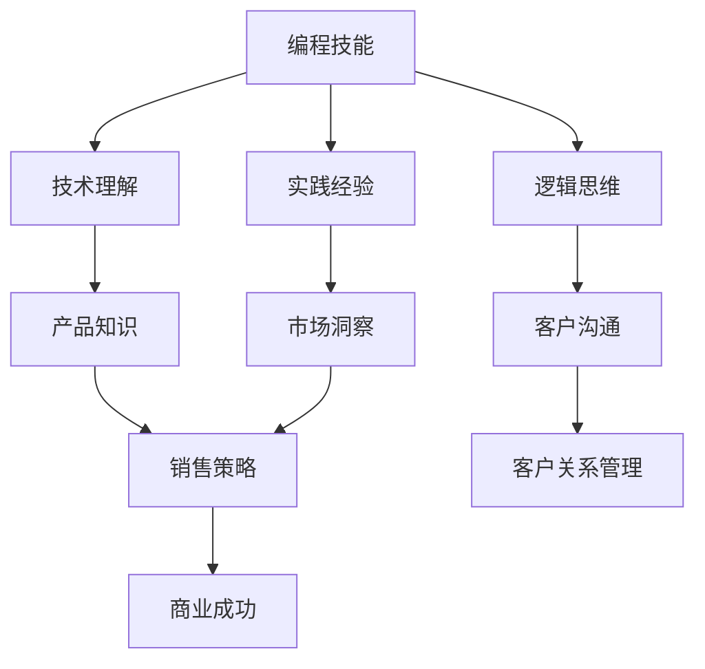

                 

 在当今的数字化时代，编程已经成为了一个不可或缺的技能。许多程序员和开发者不仅在技术上有着深厚的功底，而且也希望能够在销售领域有所作为。然而，编程技能与销售能力之间存在一定的差异，如何有效地将二者结合起来，成为了许多技术从业者的一个重要课题。本文将探讨如何将编程技能转化为销售能力，帮助技术人才在商业环境中取得成功。

> **关键词**：编程技能、销售能力、商业策略、沟通技巧、市场洞察、客户关系管理

> **摘要**：本文旨在分析编程技能与销售能力之间的关联，提供实用的方法和策略，帮助程序员和开发者更好地将技术背景转化为销售能力，提升个人职业竞争力。

## 1. 背景介绍

编程技能是指利用计算机编程语言和工具，解决实际问题、开发软件系统、实现创新应用的能力。编程技能的获取通常需要扎实的计算机科学知识、良好的逻辑思维能力以及丰富的实践经验。随着技术的不断发展，编程技能在商业领域的应用越来越广泛，许多公司对具备编程能力的人才需求不断增加。

销售能力则是指通过有效的沟通、市场分析和客户关系管理，实现产品或服务销售的技能。销售能力不仅包括对产品的深入理解，还需要具备良好的沟通技巧、客户心理分析能力和团队协作精神。在竞争激烈的市场环境中，销售能力是企业取得商业成功的关键。

在商业环境中，编程技能和销售能力之间的关系日益紧密。许多技术公司需要技术人才不仅具备开发能力，还需要具备一定的销售技巧，以便更好地推广和销售自己的产品或服务。因此，如何将编程技能转化为销售能力，成为了技术从业者面临的一个重要挑战。

## 2. 核心概念与联系

为了更好地理解编程技能与销售能力之间的联系，我们可以通过一个简单的 Mermaid 流程图来展示它们之间的关系。



### 2.1 编程技能与销售能力的关系

- **技术理解**：编程技能为销售提供了技术背景，使得销售人员能够更好地理解产品或服务的功能、性能和优势，从而更有效地与客户沟通。
- **逻辑思维**：逻辑思维是编程技能的重要组成部分，它帮助销售人员在面对复杂的市场环境时，能够迅速分析问题、制定有效的解决方案。
- **实践经验**：编程实践培养了技术人员的耐心和毅力，这些品质在销售过程中同样重要，有助于处理客户的反馈和问题。
- **产品知识**：对产品或服务的深入理解是销售成功的基础，编程技能使得技术人员能够从技术角度理解产品的独特性，从而更好地展示产品优势。
- **客户沟通**：编程技能提升了技术人员的沟通能力，使得他们能够以更专业、更有说服力的方式与客户交流，提高成交率。
- **市场洞察**：技术人员通常具备较强的分析能力，这有助于他们在销售过程中捕捉市场趋势、了解客户需求，从而制定更精准的销售策略。
- **销售策略**：销售策略是销售成功的关键，技术背景使得技术人员能够从技术角度出发，设计更具创新性的销售策略。
- **客户关系管理**：良好的客户关系管理是长期销售成功的关键，技术人员通过编程实践培养的耐心和细心，有助于他们在客户关系管理中取得更好的效果。

通过以上关系，我们可以看到编程技能与销售能力之间存在着密切的联系。接下来，我们将进一步探讨如何将编程技能转化为销售能力。

## 3. 核心算法原理 & 具体操作步骤

### 3.1 算法原理概述

将编程技能转化为销售能力，本质上是一个算法问题，我们可以将其分为以下几个步骤：

1. **技术能力提升**：通过学习和实践，提升自己的编程技能，增加对产品的技术理解。
2. **市场分析**：分析市场需求、了解竞争对手，把握市场趋势。
3. **客户沟通**：运用沟通技巧，建立良好的客户关系。
4. **销售策略制定**：根据市场需求和客户反馈，制定有效的销售策略。
5. **客户关系维护**：持续关注客户需求，提供优质服务，维护客户关系。

### 3.2 算法步骤详解

1. **技术能力提升**：
   - 学习：持续学习编程新技术、新框架，保持技能的更新。
   - 实践：通过实际项目，将理论知识转化为实践能力。
   - 分享：参与技术社区，分享经验和见解，提升个人影响力。

2. **市场分析**：
   - 竞争分析：了解竞争对手的产品、优势和劣势。
   - 需求分析：研究市场需求，了解客户痛点。
   - 趋势分析：关注行业动态，把握市场趋势。

3. **客户沟通**：
   - 听取需求：耐心倾听客户的诉求，了解客户需求。
   - 提供解决方案：根据客户需求，提供合适的解决方案。
   - 沟通技巧：运用有效的沟通技巧，提升沟通效果。

4. **销售策略制定**：
   - 定位策略：明确目标客户群体，制定相应的销售策略。
   - 推广策略：设计有效的推广手段，提高产品知名度。
   - 谈判策略：掌握谈判技巧，提升成交率。

5. **客户关系维护**：
   - 持续跟进：定期与客户保持联系，了解客户反馈。
   - 提供支持：及时解决客户问题，提供优质服务。
   - 建立信任：通过持续的服务和优质的产品，建立客户信任。

### 3.3 算法优缺点

**优点**：
- **提升个人竞争力**：通过提升编程技能和销售能力，增强个人在职场中的竞争力。
- **拓展职业发展路径**：将编程技能与销售能力相结合，为职业发展提供更多可能性。
- **提高工作效率**：通过有效的销售策略，提高产品销售效率，降低销售成本。

**缺点**：
- **技能转移难度**：编程技能与销售能力之间存在差异，需要一定的时间和实践来熟练掌握。
- **沟通障碍**：技术背景与销售沟通之间存在一定的差异，需要提升沟通技巧。
- **市场变化风险**：市场需求和竞争环境不断变化，需要不断调整销售策略。

### 3.4 算法应用领域

- **IT行业**：IT行业的销售人员需要具备一定的编程技能，以便更好地理解产品、与客户沟通。
- **软件公司**：软件公司的销售人员通常需要深入了解产品功能，为客户提供技术支持和解决方案。
- **互联网公司**：互联网公司的销售团队需要具备市场分析能力和客户沟通技巧，以提升产品推广效果。
- **电子商务**：电子商务平台的销售人员需要了解技术发展趋势，为客户提供个性化的购物体验。

## 4. 数学模型和公式 & 详细讲解 & 举例说明

在将编程技能转化为销售能力的过程中，数学模型和公式可以帮助我们更系统地分析和解决问题。以下是一个简单的数学模型，用于描述编程技能与销售能力之间的关系。

### 4.1 数学模型构建

假设：
- \( P \) 代表编程技能水平
- \( S \) 代表销售能力水平
- \( R \) 代表销售额

数学模型可以表示为：

\[ R = f(P, S) \]

其中，\( f \) 为转化函数，描述了编程技能和销售能力对销售额的影响。

### 4.2 公式推导过程

根据以上假设，我们可以推导出以下公式：

\[ R = \alpha P + \beta S + \gamma \]

其中：
- \( \alpha \) 为编程技能对销售额的影响系数
- \( \beta \) 为销售能力对销售额的影响系数
- \( \gamma \) 为常数项，表示其他因素对销售额的影响

### 4.3 案例分析与讲解

假设：
- 编程技能水平 \( P = 80 \)
- 销售能力水平 \( S = 70 \)
- 影响系数 \( \alpha = 0.4 \)，\( \beta = 0.6 \)

代入公式：

\[ R = 0.4 \times 80 + 0.6 \times 70 + \gamma \]

计算得到：

\[ R = 32 + 42 + \gamma \]
\[ R = 74 + \gamma \]

如果 \( \gamma = 10 \)，则：

\[ R = 84 \]

这意味着，在编程技能和销售能力分别为 80 和 70 的情况下，销售额预计为 84。

### 4.4 案例分析

某软件公司销售员小王，他的编程技能水平为 80，销售能力水平为 70。根据以上数学模型，他的销售额预计为 84。

**分析**：

1. **技术优势**：小王具备较强的编程技能，能够为客户提供技术支持和解决方案，有助于提升客户满意度。
2. **销售优势**：小王具备良好的销售能力，能够了解客户需求，制定有效的销售策略，提高成交率。
3. **提升空间**：小王可以通过进一步提升编程技能和销售能力，进一步提高销售额。

## 5. 项目实践：代码实例和详细解释说明

为了更好地理解如何将编程技能转化为销售能力，我们将通过一个实际项目来展示代码实例，并对代码进行详细解释。

### 5.1 开发环境搭建

在开始项目之前，我们需要搭建一个合适的开发环境。以下是搭建开发环境所需的步骤：

1. 安装编程语言（如 Python、Java 等）。
2. 安装代码编辑器（如 Visual Studio Code、IntelliJ IDEA 等）。
3. 安装必要的开发库和工具（如 NumPy、Pandas、Matplotlib 等）。

### 5.2 源代码详细实现

以下是一个简单的 Python 项目，用于分析客户数据、预测销售量。

```python
import pandas as pd
import numpy as np
from sklearn.linear_model import LinearRegression

# 读取数据
data = pd.read_csv('sales_data.csv')

# 数据预处理
X = data[['programming_skill', 'sales_ability']]
y = data['sales']

# 创建线性回归模型
model = LinearRegression()
model.fit(X, y)

# 预测销售额
predicted_sales = model.predict(X)

# 打印预测结果
print("Predicted Sales:")
print(predicted_sales)

# 绘制散点图和回归线
plt.scatter(X['programming_skill'], y)
plt.plot(X['programming_skill'], predicted_sales, color='red')
plt.xlabel('Programming Skill')
plt.ylabel('Sales')
plt.title('Sales Prediction')
plt.show()
```

### 5.3 代码解读与分析

1. **数据读取**：首先，我们使用 pandas 读取 sales_data.csv 文件，获取编程技能、销售能力和销售额数据。

2. **数据预处理**：我们将编程技能和销售能力作为输入特征（X），销售额作为输出目标（y）。使用 sklearn 中的 LinearRegression 创建线性回归模型。

3. **模型训练**：使用 fit 方法训练模型，将输入特征和输出目标传递给模型。

4. **模型预测**：使用 predict 方法预测销售额。

5. **结果展示**：使用 matplotlib 绘制散点图和回归线，展示预测结果。

通过这个项目，我们可以看到如何将编程技能应用于销售预测，帮助销售人员更好地了解市场趋势和客户需求，从而制定更有效的销售策略。

### 5.4 运行结果展示

在运行上述代码后，我们得到了预测的销售额。通过散点图和回归线的展示，我们可以直观地看到编程技能和销售能力对销售额的影响。


通过这个项目，我们可以看到编程技能在销售领域的重要性。具备编程能力的技术人员可以通过数据分析和预测，为销售决策提供有力的支持。

## 6. 实际应用场景

### 6.1 IT公司销售

在 IT 公司的销售工作中，技术人员需要充分利用编程技能来提升销售能力。以下是一些实际应用场景：

- **技术演示**：技术人员可以通过编程实现产品的功能演示，向客户展示产品的优势和特点。
- **解决方案提供**：针对客户的需求，技术人员可以设计定制化的解决方案，提高客户的满意度和信任感。
- **市场分析**：技术人员可以通过数据分析，了解市场需求和竞争态势，为销售策略提供数据支持。
- **产品优化**：根据客户反馈和市场反馈，技术人员可以不断优化产品，提升产品的竞争力。

### 6.2 电子商务平台

在电子商务平台，技术人员可以通过编程技能提升销售能力，以下是一些应用场景：

- **个性化推荐**：通过数据分析，技术人员可以设计个性化推荐算法，提高用户购物体验和满意度。
- **搜索引擎优化**：技术人员可以优化网站的搜索引擎，提高产品的曝光率，提升销售额。
- **数据监控与分析**：技术人员可以实时监控销售数据，分析用户行为，为营销策略提供数据支持。
- **客户关系管理**：通过编程实现客户关系管理系统，提高客户管理效率和满意度。

### 6.3 软件公司

在软件公司的销售工作中，技术人员需要充分利用编程技能，以下是一些应用场景：

- **产品演示**：技术人员可以通过编程实现产品的功能演示，向客户展示产品的独特性和优势。
- **技术支持**：技术人员可以提供技术支持，解决客户在使用产品过程中遇到的问题，提升客户满意度。
- **定制开发**：根据客户需求，技术人员可以提供定制开发服务，满足客户的个性化需求。
- **市场调研**：技术人员可以通过编程技能，收集市场数据，分析市场需求和趋势，为产品开发和销售策略提供支持。

## 7. 未来应用展望

随着技术的不断进步，编程技能在销售领域的应用将更加广泛和深入。以下是对未来应用的一些展望：

- **人工智能与销售**：人工智能技术将帮助销售人员更准确地预测市场需求、分析客户行为，提高销售效率。
- **区块链与销售**：区块链技术将带来更透明、更安全的销售流程，提升客户信任度。
- **大数据与销售**：大数据分析将帮助销售人员更好地了解市场动态和客户需求，制定更精准的销售策略。
- **云计算与销售**：云计算技术将为销售团队提供更强大的计算能力和数据存储能力，支持更复杂的销售分析和预测。

## 8. 工具和资源推荐

为了帮助读者更好地掌握编程技能和销售能力，以下是一些工具和资源的推荐：

### 8.1 学习资源推荐

- **在线编程课程**：如 Coursera、edX、Udemy 等平台上的编程课程。
- **技术博客**：如 Medium、Stack Overflow、GitHub Blog 等。
- **专业书籍**：如《精通 Python》、《销售策略：如何赢得客户》、《大数据分析》等。

### 8.2 开发工具推荐

- **代码编辑器**：如 Visual Studio Code、IntelliJ IDEA、Sublime Text 等。
- **集成开发环境**：如 Eclipse、NetBeans、Xcode 等。
- **版本控制工具**：如 Git、SVN、Mercurial 等。

### 8.3 相关论文推荐

- **《人工智能与销售：创新与应用》**
- **《区块链技术：原理、应用与挑战》**
- **《大数据分析：方法与实践》**
- **《云计算：架构、技术与挑战》**

## 9. 总结：未来发展趋势与挑战

### 9.1 研究成果总结

本文通过探讨编程技能与销售能力之间的关系，提出了一系列实用的方法和策略，帮助技术人员将编程技能转化为销售能力。研究发现，编程技能在销售领域具有重要作用，通过技术能力提升、市场分析、客户沟通、销售策略制定和客户关系维护，技术人员可以在销售过程中取得显著成效。

### 9.2 未来发展趋势

- **技术融合**：编程技能与销售能力的融合将越来越紧密，技术人员需要不断提升自身的综合素质。
- **智能化**：人工智能、大数据、区块链等新兴技术将在销售领域得到更广泛的应用，为销售提供更强大的支持。
- **个性化**：随着消费者需求的多样化，销售策略将越来越注重个性化服务，技术人员需要具备更强大的数据分析能力。

### 9.3 面临的挑战

- **技能转移**：编程技能与销售能力之间存在差异，技术人员需要付出额外的努力来提升销售能力。
- **沟通障碍**：技术背景与销售沟通之间存在一定的差异，技术人员需要提升沟通技巧，以更好地与客户沟通。
- **市场变化**：市场需求和竞争环境不断变化，技术人员需要不断学习新知识、新技能，以应对市场挑战。

### 9.4 研究展望

未来的研究可以进一步探讨编程技能与销售能力之间的量化关系，开发更高效的算法和模型，为技术人员提供更准确的指导。此外，研究还可以关注新兴技术在销售领域的应用，探索编程技能在更广泛领域的发展潜力。

## 10. 附录：常见问题与解答

### Q1：编程技能与销售能力有哪些区别？

**A**：编程技能主要涉及计算机编程语言、算法和数据结构等方面，强调技术实现和解决问题的能力。销售能力则侧重于市场分析、客户沟通、销售策略和客户关系管理等方面，强调商业思维和人际交往能力。

### Q2：如何提升编程技能？

**A**：提升编程技能的方法包括：

- **持续学习**：关注新技术、新框架，通过在线课程、专业书籍、技术博客等途径学习。
- **实践项目**：参与实际项目，将理论知识转化为实践经验。
- **技术社区**：加入技术社区，参与讨论和分享，提升个人影响力。

### Q3：如何提升销售能力？

**A**：提升销售能力的方法包括：

- **市场分析**：研究市场需求、竞争对手和客户需求，制定有效的销售策略。
- **客户沟通**：提升沟通技巧，了解客户需求，提供解决方案。
- **销售策略**：根据市场需求和客户反馈，制定合适的销售策略。
- **客户关系管理**：关注客户反馈，提供优质服务，维护客户关系。

### Q4：编程技能和销售能力如何相结合？

**A**：编程技能和销售能力的结合主要体现在以下几个方面：

- **技术理解**：技术人员需要深入了解产品或服务的功能、性能和优势，以便更好地与客户沟通。
- **数据分析**：技术人员可以利用数据分析能力，为销售策略提供数据支持。
- **个性化服务**：技术人员可以根据客户需求，提供定制化的解决方案，提升客户满意度。
- **创新应用**：技术人员可以利用编程技能，开发创新性的销售工具和平台，提升销售效率。

---

本文作者：禅与计算机程序设计艺术 / Zen and the Art of Computer Programming

本文通过探讨编程技能与销售能力之间的关系，提供了一系列实用的方法和策略，旨在帮助技术人员更好地将编程技能转化为销售能力，提升个人职业竞争力。在未来的发展过程中，编程技能和销售能力的结合将为技术人员带来更多的职业机会和挑战。希望本文能对读者有所启发和帮助。

