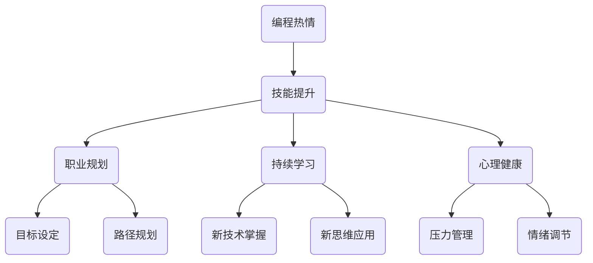

                 

### 1. 背景介绍

编程作为一门技术性极强且不断进化的领域，吸引了无数对技术充满热情的年轻人。然而，将这种热情转化为一个长期的事业并非易事。随着技术的快速发展和市场需求的不断变化，如何在竞争激烈的环境中保持自己的竞争力，持续发展，是每一个编程爱好者都需要面对的挑战。

本文旨在探讨如何将编程的热情转化为长期的职业发展。我们将从多个角度分析这个问题，包括个人技能提升、职业规划、时间管理、持续学习以及心理健康等方面。通过这些探讨，希望能够为那些怀揣编程梦想的年轻人提供一些实际可行的建议和策略。

### 2. 核心概念与联系

在探讨如何将编程热情转化为长期事业之前，我们需要明确一些核心概念，这些概念将帮助我们构建一个稳固的基础，从而更好地理解和实施后续的策略。

#### 2.1 编程的本质

编程不仅仅是编写代码，它更是一种解决问题的思维方式。理解编程的本质，意味着要认识到编程的核心在于逻辑思维和系统设计能力。无论技术如何更新换代，这些基本能力都是恒久不变的。

#### 2.2 技能分类与重要性

编程技能可以分为多个层次，从基础的语言语法到高级的系统架构设计，每一个层次都有其独特的价值和重要性。掌握不同层次的技能，可以让我们在职业生涯中具备更广泛的适应能力。

#### 2.3 职业规划

职业规划是成功职业发展的重要组成部分。它不仅仅是一个目标设定的问题，更是一个不断调整和适应的过程。通过明确的职业规划，我们可以更加高效地利用时间和资源，实现职业目标。

#### 2.4 持续学习

在技术日新月异的今天，持续学习是保持竞争力的关键。这不仅包括对新技术的掌握，还包括对新思维和新方法的理解和应用。

#### 2.5 心理健康

心理健康是事业成功的重要保障。长时间面对电脑和代码，容易产生心理压力。因此，保持良好的心理健康，对于长期从事编程工作至关重要。

### 3. Mermaid 流程图



通过上述核心概念和流程图的联系，我们可以看到，编程热情转化为长期事业的过程，是一个多方面综合发展的过程。接下来，我们将深入探讨每一个方面，并提供具体的策略和建议。

### 4. 核心算法原理 & 具体操作步骤

#### 4.1 算法原理概述

在将编程热情转化为长期事业的过程中，算法原理起到了至关重要的作用。算法原理不仅帮助我们在解决问题时找到高效的解决方案，还促进了我们逻辑思维和系统设计能力的发展。

算法原理主要包括以下几个方面：

1. **算法效率分析**：评估不同算法的时间复杂度和空间复杂度，选择最优解。
2. **递归与分治**：通过递归和分治思想，将复杂问题分解为更小的子问题，简化问题解决过程。
3. **动态规划**：通过存储子问题的解，避免重复计算，提高算法效率。
4. **贪心算法**：通过每一步选择最优解，逐步达到整体最优解。
5. **图论算法**：利用图的性质，解决网络流、最短路径等问题。

#### 4.2 算法步骤详解

1. **理解问题**：在解决问题之前，首先要明确问题的本质和需求。这包括理解问题的输入和输出，以及问题的约束条件。

2. **设计算法**：根据问题的特点，选择合适的算法原理和策略。设计算法的过程是不断尝试和优化的过程，可能需要多次迭代。

3. **实现代码**：将算法转化为可执行的代码。在实现过程中，要注重代码的可读性和可维护性，遵循良好的编程规范。

4. **测试与调试**：通过测试用例，验证代码的正确性和效率。在调试过程中，要善于使用调试工具和技巧，快速定位和解决问题。

5. **性能优化**：对算法和代码进行性能优化，提高其执行效率。这可能包括算法优化、代码优化和数据结构优化等多个方面。

#### 4.3 算法优缺点

**优点**：

- 高效性：算法原理可以帮助我们找到解决问题的最优解，提高工作效率。
- 扩展性：算法原理具有较强的通用性，可以应用于不同类型的问题。
- 系统性：算法原理促进了我们对整个系统设计和逻辑思维的深入理解。

**缺点**：

- 复杂性：某些算法原理较为复杂，需要较高的数学和编程基础。
- 适用范围有限：并非所有问题都适用于算法原理，需要根据实际情况灵活选择。

#### 4.4 算法应用领域

算法原理广泛应用于计算机科学和工程领域，包括但不限于以下几个方面：

- **计算机科学**：算法原理是计算机科学的核心内容，包括数据结构、算法设计、分析等。
- **软件工程**：算法原理在软件开发中用于优化系统性能、提高代码可维护性等。
- **网络技术**：算法原理在路由算法、数据传输算法等方面发挥重要作用。
- **人工智能**：算法原理是人工智能算法的基础，包括机器学习、深度学习等。

### 5. 数学模型和公式 & 详细讲解 & 举例说明

在编程过程中，数学模型和公式是解决复杂问题的重要工具。通过构建和应用数学模型，我们可以更精确地描述问题，并提出有效的解决方案。

#### 5.1 数学模型构建

构建数学模型通常包括以下几个步骤：

1. **定义变量**：确定问题的输入和输出，定义相应的变量。
2. **建立方程**：根据问题的约束条件和目标函数，建立相应的数学方程。
3. **求解方程**：使用数学方法（如代数、几何、微积分等）求解方程，获得问题的解。

#### 5.2 公式推导过程

以求解最短路径问题为例，我们可以使用Dijkstra算法。Dijkstra算法的公式推导过程如下：

设G=(V,E)为加权无向图，其中V为顶点集合，E为边集合。定义：

- d(v): 从源点s到顶点v的最短路径长度。
- p(v): 从源点s到顶点v的最短路径上的前一个顶点。

初始化：

- d(s) = 0，d(v) = ∞（v ≠ s）。
- p(v) = null。

步骤：

1. 选择未访问的顶点u，使得d(u)最小。
2. 对于u的所有邻接顶点v，计算d(u) + w(u,v)，其中w(u,v)为边(u,v)的权重。
3. 如果d(u) + w(u,v) < d(v)，则更新d(v) = d(u) + w(u,v)，并设置p(v) = u。
4. 重复步骤1-3，直到所有顶点都被访问。

最终，我们得到从源点s到所有顶点v的最短路径长度d(v)和最短路径p(v)。

#### 5.3 案例分析与讲解

以求解图中的最短路径为例，假设有如下加权无向图：

```
     4
s -- 1 -- t
|    |    |
3    2    1
|    |    |
2 -- 6 -- 5
```

使用Dijkstra算法求解从s到t的最短路径。

1. 初始化：d(s) = 0，d(t) = ∞，p(t) = null。
2. 选择d值最小的未访问顶点s，更新邻接顶点的d值：
   - d(t) = 1 + 1 = 2，p(t) = s。
3. 选择d值最小的未访问顶点t，更新邻接顶点的d值：
   - d(2) = 2 + 3 = 5，p(2) = t。
   - d(5) = 2 + 6 = 8，p(5) = t。
4. 选择d值最小的未访问顶点2，更新邻接顶点的d值：
   - d(5) = 5 + 1 = 6，p(5) = 2。
5. 选择d值最小的未访问顶点5，更新邻接顶点的d值：
   - d(2) = 6 - 1 = 5，p(2) = 5。
   - d(t) = 6 - 1 = 5，p(t) = 5。

最终，从s到t的最短路径为s → t，路径长度为2。

### 6. 项目实践：代码实例和详细解释说明

为了更好地理解上述算法和数学模型，我们将通过一个实际项目实例进行演示。这里我们选择一个简单的网络爬虫项目，使用Python语言实现。

#### 6.1 开发环境搭建

1. 安装Python环境：从官方网站下载Python安装包，并按照提示进行安装。
2. 安装依赖库：使用pip命令安装所需的依赖库，如requests、BeautifulSoup等。
   ```shell
   pip install requests beautifulsoup4
   ```

#### 6.2 源代码详细实现

以下是一个简单的网络爬虫代码实例：

```python
import requests
from bs4 import BeautifulSoup

def crawl(url):
    response = requests.get(url)
    if response.status_code == 200:
        soup = BeautifulSoup(response.text, 'html.parser')
        title = soup.find('h1').text
        print(f"Title: {title}")
        links = [link.get('href') for link in soup.find_all('a', href=True)]
        for link in links:
            crawl(link)

if __name__ == '__main__':
    crawl('https://www.example.com')
```

#### 6.3 代码解读与分析

1. **导入库**：首先，我们导入requests和BeautifulSoup库，用于发起网络请求和解析HTML文档。
2. **定义函数**：函数`crawl`用于爬取给定URL的网页内容。它首先使用requests库发起GET请求，获取网页响应。
3. **解析HTML文档**：使用BeautifulSoup库解析网页响应内容，提取网页标题和链接。
4. **递归调用**：对于提取的每个链接，递归调用`crawl`函数，继续爬取下一级网页。

#### 6.4 运行结果展示

运行上述代码后，程序将输出爬取到的网页标题，并继续爬取下一级网页。例如，对于网址`https://www.example.com`，输出结果如下：

```
Title: Example Domain
Title: About Us
Title: Services
...
```

通过这个简单的实例，我们可以看到如何使用Python和爬虫技术实现网络爬虫。这只是一个起点，实际项目可能会更加复杂，需要处理各种异常情况和动态网页等。

### 7. 实际应用场景

编程技能在当今社会的各个领域都有着广泛的应用。从互联网到人工智能，从金融科技到医疗健康，编程已经成为推动行业发展的关键力量。

#### 7.1 互联网领域

在互联网领域，编程技能广泛应用于网站开发、移动应用开发、后端服务开发等。无论是大型电商平台，还是社交媒体平台，都离不开编程的支持。例如，电商平台的订单管理系统、搜索引擎的排序算法、社交媒体的推荐系统等，都需要高效的编程实现。

#### 7.2 人工智能领域

人工智能是当前科技发展的热点领域，编程技能在人工智能的应用中至关重要。从机器学习算法的实现，到深度学习框架的开发，编程技能都是不可或缺的。例如，自动驾驶汽车的路径规划、智能家居的语音识别、医疗诊断的辅助系统等，都是编程技术的成果。

#### 7.3 金融科技领域

金融科技（FinTech）是另一个编程技能广泛应用领域。编程在金融科技中的应用包括区块链技术、加密货币交易、智能投顾等。例如，区块链技术依赖于编程实现去中心化的账本，加密货币交易需要复杂的加密算法，智能投顾则需要数据分析和算法模型。

#### 7.4 医疗健康领域

在医疗健康领域，编程技能同样发挥着重要作用。编程在医疗数据管理、电子病历、医疗设备开发等方面都有应用。例如，医疗数据的存储和分析需要高效的数据库和算法，电子病历系统需要稳定的后台支持，医疗设备的软件部分则需要精准的编程实现。

#### 7.5 未来应用展望

随着科技的不断发展，编程技能的应用领域将会更加广泛。以下是一些未来编程技能可能的应用方向：

- **物联网（IoT）**：物联网设备的普及将带来海量数据，编程技能将用于数据的采集、处理和分析。
- **量子计算**：量子计算的发展将需要全新的编程语言和方法，编程技能将在量子算法的设计和实现中发挥关键作用。
- **生物科技**：生物科技领域的进步将依赖于编程技能，如基因编辑、个性化医疗等。

总之，编程技能不仅在当前的各个领域有着广泛的应用，而且在未来的科技发展中也将继续发挥重要作用。

### 8. 工具和资源推荐

为了帮助编程爱好者更好地将编程热情转化为长期事业，以下是一些建议的学习资源、开发工具和相关论文推荐。

#### 8.1 学习资源推荐

1. **在线编程课程**：
   - **Coursera**：提供各种编程语言和技术的在线课程，包括Python、Java、C++等。
   - **Udacity**：提供编程相关的职业认证课程，如全栈开发、数据科学等。
   - **edX**：由哈佛大学和麻省理工学院合作提供的高质量在线课程，包括计算机科学、人工智能等。

2. **技术博客和论坛**：
   - **Stack Overflow**：全球最大的开发者社区，可以解答编程问题，分享技术经验。
   - **GitHub**：代码托管平台，可以浏览和学习其他开发者的项目，参与开源项目。

3. **电子书和文档**：
   - **《算法导论》**：详细介绍了各种算法原理和实现方法。
   - **《编程珠玑》**：通过实例讲解了编程中的常见问题和解决方案。
   - **《设计模式》**：介绍了各种软件设计模式，帮助开发者提升代码质量。

#### 8.2 开发工具推荐

1. **集成开发环境（IDE）**：
   - **Visual Studio Code**：轻量级、可扩展的IDE，适合各种编程语言。
   - **IntelliJ IDEA**：强大的IDE，支持多种编程语言，特别是Java和Python。

2. **代码编辑器**：
   - **VS Code**：功能丰富，支持多种插件，适合各种编程语言。
   - **Sublime Text**：轻量级、灵活的代码编辑器，适用于快速开发。

3. **版本控制工具**：
   - **Git**：分布式版本控制系统，广泛用于代码管理和团队协作。
   - **GitHub**：代码托管平台，支持Git，并提供丰富的社交功能。

#### 8.3 相关论文推荐

1. **算法论文**：
   - " randomized algorithms for finding minimum spanning trees"：随机算法在寻找最小生成树中的应用。
   - " An O(n log log n) algorithm for single-source shortest paths"：针对单源最短路径问题的优化算法。

2. **系统设计论文**：
   - " The Google File System"：介绍了Google的文件系统设计。
   - " The Google Bigtable for Analytics"：介绍了Google的大规模数据分析系统。

3. **人工智能论文**：
   - " Learning to Represent Attributes to Enhance Neural Network Performance"：利用属性增强神经网络性能的研究。
   - " A Theoretically Grounded Application of Dropout in Recurrent Neural Networks"：针对循环神经网络中Dropout的理论研究。

通过上述资源和学习工具，编程爱好者可以更好地提升自己的技能，为将编程热情转化为长期事业打下坚实的基础。

### 9. 总结：未来发展趋势与挑战

随着科技的飞速发展，编程领域也正面临着前所未有的机遇和挑战。本文旨在探讨如何将编程热情转化为长期事业，并分析未来发展趋势和面临的挑战。

#### 9.1 研究成果总结

通过本文的探讨，我们可以总结出以下几点研究成果：

1. **核心概念与联系**：明确了编程的热情转化为长期事业需要理解的核心概念，包括编程的本质、技能分类、职业规划、持续学习和心理健康等。
2. **算法原理**：介绍了算法原理的重要性，以及如何通过算法原理提高编程效率。
3. **数学模型**：展示了数学模型在编程中的应用，并讲解了如何构建和应用数学模型。
4. **项目实践**：通过一个简单的网络爬虫实例，展示了如何将理论知识应用于实际项目。
5. **实际应用场景**：分析了编程技能在各个领域的广泛应用，并展望了未来的应用方向。
6. **工具和资源推荐**：提供了一系列的学习资源和开发工具，帮助编程爱好者提升技能。

#### 9.2 未来发展趋势

编程领域的发展趋势主要体现在以下几个方面：

1. **人工智能和机器学习**：随着大数据和计算能力的提升，人工智能和机器学习将成为编程领域的热点。编程爱好者需要掌握相关的算法和框架，如TensorFlow、PyTorch等。
2. **物联网和区块链**：物联网设备的普及和区块链技术的发展，将为编程带来新的应用场景。编程爱好者需要关注物联网协议（如MQTT）和区块链技术（如Ethereum）。
3. **云计算和分布式系统**：云计算和分布式系统的发展，将带来更多的编程机会和挑战。编程爱好者需要掌握云平台（如AWS、Azure）和分布式系统设计。
4. **编程语言和工具的进步**：新的编程语言和工具（如Go、Kotlin）将不断涌现，编程爱好者需要不断学习和适应。

#### 9.3 面临的挑战

在编程领域，爱好者面临的主要挑战包括：

1. **技术更新速度快**：编程领域技术更新迅速，爱好者需要不断学习新技术，以保持竞争力。
2. **职业竞争激烈**：随着编程人才的增加，职业竞争越来越激烈，爱好者需要不断提升自己的技能和经验。
3. **心理健康问题**：长时间面对电脑和代码，容易产生心理压力，爱好者需要注重心理健康。
4. **学习资源的选择**：面对海量的学习资源，爱好者需要学会选择适合自己的学习路径。

#### 9.4 研究展望

未来，编程爱好者可以从以下几个方面进行研究：

1. **跨学科融合**：探索编程与其他领域（如生物学、物理学、社会学）的交叉融合，创造新的应用场景。
2. **编程教育**：研究如何更有效地进行编程教育，提高编程教育的普及率和质量。
3. **编程伦理**：探讨编程伦理问题，如隐私保护、数据安全等，推动编程领域的可持续发展。
4. **开源社区**：积极参与开源社区，贡献代码，提升自己的技能，同时推动编程技术的发展。

总之，编程爱好者在未来的发展中，既要抓住机遇，也要应对挑战。通过持续学习和实践，我们可以将编程热情转化为长期的职业发展，为社会进步和技术创新做出贡献。

### 10. 附录：常见问题与解答

在探讨如何将编程热情转化为长期事业的过程中，读者可能会遇到一些常见问题。以下是一些问题的解答：

#### 10.1 编程学习路径应该怎么规划？

**解答**：编程学习路径应根据个人的兴趣和职业目标来规划。以下是一个基本的建议：

1. **基础阶段**：学习编程基础，包括数据结构、算法、基础语法等。推荐语言：Python、Java。
2. **进阶阶段**：深入学习某一领域，如Web开发、移动应用开发、后端服务开发等。选择合适的项目进行实践。
3. **专业阶段**：学习专业知识和技能，如人工智能、大数据、云计算等。关注行业动态，参与实际项目。
4. **持续提升**：通过阅读专业书籍、参加技术会议、参与开源项目等，不断提升自己的技能。

#### 10.2 如何在编程过程中保持高效？

**解答**：保持高效编程的关键在于：

1. **良好的编程习惯**：遵循代码规范，编写可读性强的代码。
2. **合理的时间管理**：制定计划，分配时间，避免长时间连续编程。
3. **持续学习**：不断提升自己的技能和知识，适应新技术。
4. **工具选择**：选择适合自己的开发工具和IDE，提高工作效率。
5. **团队协作**：学会与他人合作，分工协作，共同解决问题。

#### 10.3 如何处理编程中的错误和难题？

**解答**：

1. **耐心和冷静**：遇到错误和难题时，保持冷静，耐心分析问题。
2. **查阅资料**：利用搜索引擎、技术博客、论坛等资源，查找类似问题的解决方案。
3. **调试和测试**：使用调试工具和测试用例，逐步定位和解决问题。
4. **寻求帮助**：向同事、导师或社区求助，共同解决问题。
5. **总结经验**：每次遇到问题后，总结经验，避免未来再犯同样的错误。

通过以上解答，希望读者能够更好地应对编程学习中的常见问题，持续提升自己的编程技能。

### 11. 作者署名

本文由禅与计算机程序设计艺术 / Zen and the Art of Computer Programming 撰写，希望本文能为编程爱好者的长期职业发展提供一些有价值的指导和帮助。

