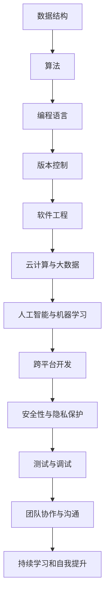
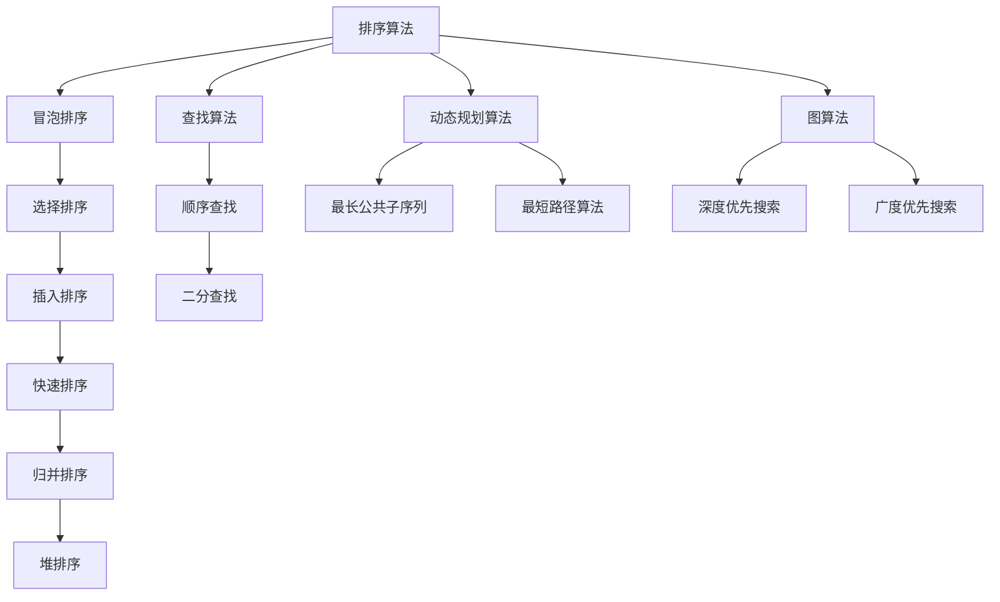

                 

 

## 1. 背景介绍

编程，作为一种极具创造性和挑战性的职业，吸引了无数人的热情和追求。许多人从编程的乐趣中发现了自己的天赋和激情，但要将这份热情转化为长期的事业，并非易事。本文旨在探讨如何有效地将编程热情转化为长期职业，帮助那些对编程充满热情的程序员们规划自己的职业道路。

编程不仅是技术的追求，更是思维方式的培养。它要求程序员具备逻辑思维、问题解决能力和不断学习的精神。对于许多人来说，编程是一种艺术，是一种可以让人沉浸其中、不断挑战自我极限的活动。然而，将这种热情转化为长期的职业发展，需要明确的规划和持续的努力。

本文将围绕以下几个方面进行讨论：

- **核心概念与联系**：介绍编程中的核心概念及其相互关系。
- **核心算法原理与具体操作步骤**：探讨编程中的核心算法及其应用。
- **数学模型和公式**：阐述编程中常用的数学模型和公式。
- **项目实践**：提供具体的编程实例和代码实现。
- **实际应用场景**：分析编程在不同领域中的应用。
- **工具和资源推荐**：介绍学习和开发的工具与资源。
- **总结与展望**：总结研究成果，探讨未来发展趋势和挑战。

希望通过本文，能够为那些热爱编程的人们提供一些有益的指导和思考。

## 2. 核心概念与联系

在探讨如何将编程热情转化为长期事业之前，我们需要了解一些编程中的核心概念及其相互关系。这些概念不仅构成了编程的基础，也是程序员职业生涯中不断学习和进步的基石。

### 2.1 数据结构与算法

数据结构是编程中的基础概念，它定义了数据在计算机中的存储和操作方式。常见的有数组、链表、栈、队列、树和图等。每种数据结构都有其特定的用途和优点，了解这些数据结构对于提高编程效率至关重要。

算法则是解决问题的一系列步骤。算法不仅包括解决问题的方法，还包括分析和评估这些方法的时间和空间复杂度。常见的算法有排序算法、查找算法、动态规划算法和图算法等。掌握算法不仅能够解决具体问题，还能够提升逻辑思维和问题解决能力。

### 2.2 编程语言

编程语言是程序员与计算机进行交流的工具。不同的编程语言有其独特的语法和特点，适用于不同的应用场景。常见的编程语言有Python、Java、C++、JavaScript等。每种语言都有其特定的应用领域，了解不同编程语言的特性和适用场景，有助于程序员选择合适的工具解决问题。

### 2.3 版本控制

版本控制是现代软件开发中不可或缺的一部分。它通过跟踪文件的历史版本，帮助程序员管理代码的变更和协作开发。常见的版本控制系统有Git、SVN和Mercurial等。掌握版本控制工具，不仅能够提高开发效率，还能够减少因代码冲突和错误导致的开发中断。

### 2.4 软件工程

软件工程是一门关于如何设计、开发、测试和维护软件的学科。它涉及项目规划、需求分析、设计、编码、测试和部署等多个环节。掌握软件工程的方法和工具，能够帮助程序员更好地管理项目，提高软件质量。

### 2.5 云计算与大数据

随着云计算和大数据技术的发展，这些领域已经成为编程中的重要方向。云计算提供了弹性的计算资源，使得程序员能够快速部署和扩展应用程序。大数据技术则提供了处理海量数据的方法和工具，帮助程序员从数据中提取有价值的信息。了解这些技术，有助于程序员在未来的职业发展中占据更有利的位置。

### 2.6 人工智能与机器学习

人工智能和机器学习是当前科技领域最热门的话题之一。它们通过模拟人类智能，实现机器的自动化学习和决策。掌握这些技术，不仅能够为程序员打开新的职业路径，还能够为各行各业带来创新和变革。

### 2.7 跨平台开发

随着移动设备和物联网设备的普及，跨平台开发变得越来越重要。跨平台开发工具如React Native、Flutter等，使得程序员能够使用一套代码库开发适用于多个平台的应用程序。了解跨平台开发，有助于程序员在多样化的市场中脱颖而出。

### 2.8 安全性与隐私保护

随着网络安全威胁的增加，安全性和隐私保护成为编程中的重要议题。了解安全编程的基本原则和常见的攻击手段，掌握加密技术和数据保护方法，能够帮助程序员构建更安全的应用程序。

### 2.9 测试与调试

测试与调试是软件开发过程中不可或缺的环节。通过编写测试用例，程序员能够验证代码的正确性和性能。调试工具则帮助程序员定位和修复代码中的错误。掌握测试与调试技术，能够提高软件质量，减少故障风险。

### 2.10 团队协作与沟通

在软件开发过程中，团队合作和沟通至关重要。程序员需要与其他团队成员紧密协作，共同完成任务。良好的沟通能力能够提高团队效率，减少误解和冲突。掌握团队协作和沟通技巧，有助于程序员在团队中发挥更大的作用。

### 2.11 持续学习和自我提升

编程领域日新月异，不断学习成为程序员职业发展的关键。通过参加培训、阅读技术文献、参与开源项目等方式，程序员能够不断更新知识体系，提升技能水平。持续学习和自我提升，是程序员保持竞争力的必要条件。

### 2.12 核心概念流程图

为了更清晰地展示这些核心概念之间的联系，我们可以使用Mermaid流程图进行描述：



通过这个流程图，我们可以看到编程领域的各个核心概念是如何相互关联和影响的。了解这些概念及其相互关系，不仅有助于程序员更好地理解编程的本质，也为将编程热情转化为长期事业奠定了坚实的基础。

## 3. 核心算法原理与具体操作步骤

在编程领域中，核心算法不仅是解决特定问题的方法，也是评估程序员技术能力和思维方式的重要标准。本章节将深入探讨几种常见的核心算法原理，并详细说明其操作步骤和应用场景。

### 3.1 算法原理概述

#### 排序算法

排序算法是计算机科学中最基本和最常用的算法之一。其主要目标是按照某种规则对一组数据进行排序。常见的排序算法包括冒泡排序、选择排序、插入排序、快速排序、归并排序和堆排序等。每种算法有其特定的实现方式和优缺点。

- **冒泡排序（Bubble Sort）**：通过多次比较和交换相邻元素，使数据逐步变得有序。时间复杂度为 \(O(n^2)\)，空间复杂度为 \(O(1)\)。
- **选择排序（Selection Sort）**：每次从未排序部分选择最小（或最大）的元素放到已排序部分的末尾。时间复杂度为 \(O(n^2)\)，空间复杂度为 \(O(1)\)。
- **插入排序（Insertion Sort）**：通过构建有序序列，将未排序的元素插入到已排序序列中的适当位置。时间复杂度为 \(O(n^2)\)，但在数据基本有序时表现良好。
- **快速排序（Quick Sort）**：通过递归地将数组分为较小的两部分，再分别排序。平均时间复杂度为 \(O(n\log n)\)，但最坏情况为 \(O(n^2)\)。
- **归并排序（Merge Sort）**：通过递归地将数组分为较小的两部分，再合并排序。时间复杂度为 \(O(n\log n)\)，空间复杂度为 \(O(n)\)。
- **堆排序（Heap Sort）**：利用堆这种数据结构进行排序。时间复杂度为 \(O(n\log n)\)，空间复杂度为 \(O(1)\)。

#### 查找算法

查找算法用于在数据集合中查找特定元素。最基本的是顺序查找和二分查找。

- **顺序查找（Linear Search）**：从数据集合的第一个元素开始，逐个比较直到找到目标元素或到达数据末尾。时间复杂度为 \(O(n)\)。
- **二分查找（Binary Search）**：基于有序数据集合，通过递归地将数据集合分为较小的两部分，逐步缩小查找范围。时间复杂度为 \(O(\log n)\)。

#### 动态规划算法

动态规划是一种解决优化问题的算法方法。它通过将问题分解为子问题，并保存子问题的解，避免重复计算。

- **最长公共子序列（Longest Common Subsequence, LCSS）**：通过递归地求解子序列的长度，找到两个序列的最长公共子序列。
- **最短路径算法（Shortest Path Algorithms）**：如迪杰斯特拉算法（Dijkstra's Algorithm）和弗洛伊德算法（Floyd's Algorithm），用于求解图中两点之间的最短路径。

#### 图算法

图算法用于处理图结构的数据。常见的有深度优先搜索（DFS）和广度优先搜索（BFS）。

- **深度优先搜索（DFS）**：通过递归或栈实现，从起点开始探索所有可能的路径，直到找到目标或达到边界。
- **广度优先搜索（BFS）**：通过队列实现，从起点开始逐层探索，优先访问距离起点较近的节点。

### 3.2 算法步骤详解

#### 冒泡排序

1. 从第一个元素开始，比较相邻的两个元素，如果第一个比第二个大，就交换它们。
2. 对每一对相邻元素做同样的工作，从开始第一对到结尾的最后一对。
3. 在这一点，最后的元素应该会是最大的数。
4. 针对所有的元素重复以上的步骤，除了最后一个。
5. 重复步骤1~3，直到排序完成。

#### 二分查找

1. 确定要查找的数组是有序的。
2. 选择中间的元素进行比较。
3. 如果中间元素等于目标值，则返回其索引。
4. 如果目标值比中间元素大，则在右半部分继续查找；如果目标值比中间元素小，则在左半部分继续查找。
5. 重复步骤2~4，直到找到目标值或确定目标值不存在。

#### 动态规划（最长公共子序列）

1. 将两个序列分别表示为 `A` 和 `B`。
2. 创建一个二维数组 `dp`，其中 `dp[i][j]` 表示 `A` 的前 `i` 个元素和 `B` 的前 `j` 个元素的最长公共子序列的长度。
3. 初始化 `dp[0][0]` 为 0。
4. 对于 `i` 从 1 到 `m`，`j` 从 1 到 `n`：
   - 如果 `A[i-1] == B[j-1]`，则 `dp[i][j] = dp[i-1][j-1] + 1`；
   - 否则，`dp[i][j] = max(dp[i-1][j], dp[i][j-1])`。
5. 返回 `dp[m][n]` 作为最长公共子序列的长度。

### 3.3 算法优缺点

#### 冒泡排序

- 优点：实现简单，易于理解。
- 缺点：时间复杂度较高，不适合大数据集合。

#### 二分查找

- 优点：时间复杂度低，适用于大数据集合。
- 缺点：要求数据集合有序，不适合动态变化的数据。

#### 动态规划

- 优点：能够解决许多优化问题，适用于求解子问题的递归关系。
- 缺点：实现相对复杂，可能需要较大的空间复杂度。

### 3.4 算法应用领域

#### 排序算法

- 排序算法广泛应用于数据处理和搜索场景，如数据库排序、网页排序和金融数据分析等。

#### 查找算法

- 查找算法在搜索算法库、数据库索引和文件系统中广泛应用。

#### 动态规划算法

- 动态规划算法在路径规划、资源分配和算法优化等领域具有广泛的应用。

#### 图算法

- 图算法在社交网络分析、路由规划和物流调度等方面有重要应用。

### 3.5 核心算法流程图

为了更清晰地展示这些核心算法的流程，我们可以使用Mermaid流程图进行描述：



通过这个流程图，我们可以清晰地看到不同算法之间的联系和应用领域，有助于程序员在实际开发中选择合适的算法。

## 4. 数学模型和公式与详细讲解及举例说明

在编程中，数学模型和公式是解决复杂问题的重要工具。它们不仅提供了理论支持，还能够帮助我们优化算法和提升代码效率。本章节将介绍几种常见的数学模型和公式，并详细讲解其构建过程、推导方法以及实际应用中的案例分析。

### 4.1 数学模型构建

数学模型是通过对现实世界的抽象和简化，构建用于描述和解决问题的数学框架。构建数学模型通常包括以下几个步骤：

1. **确定问题背景和目标**：明确需要解决的问题及其目标，如优化资源分配、最大化收益或最小化成本等。
2. **收集数据和信息**：收集与问题相关的数据，如数据规模、约束条件、变量关系等。
3. **建立假设**：根据问题的性质和现有数据，建立合理的假设，如线性关系、独立性、时间不变性等。
4. **构建方程或公式**：根据假设和目标，构建描述问题关系的方程或公式，如线性方程组、非线性方程等。
5. **分析模型**：验证模型的合理性和有效性，分析模型的适用范围和局限性。

### 4.2 公式推导过程

在本章节中，我们将介绍几种常见的数学模型和公式的推导过程。以下是一个示例：

#### 指数平滑法（Exponential Smoothing）

指数平滑法是一种常用的时间序列预测方法，用于分析趋势数据。其公式如下：

\[ S_t = \alpha X_t + (1 - \alpha) S_{t-1} \]

其中：
- \( S_t \) 是第 \( t \) 期的预测值。
- \( X_t \) 是第 \( t \) 期的实际观测值。
- \( \alpha \) 是平滑系数，通常取值范围在 \( 0 \) 到 \( 1 \) 之间。

#### 推导过程：

1. **初始化**：选择一个初始值 \( S_0 \)，通常取第一个观测值 \( X_0 \)。
2. **递推公式**：根据前一个时期的预测值和当前的实际观测值，更新预测值。

   \[ S_t = \alpha X_t + (1 - \alpha) S_{t-1} \]

3. **收敛性分析**：当 \( t \) 趋于无穷大时，指数平滑法的预测值将收敛到一个稳定的值。

### 4.3 案例分析与讲解

#### 案例一：线性回归模型

线性回归是一种用于分析自变量和因变量之间线性关系的统计模型。其公式为：

\[ y = \beta_0 + \beta_1 x \]

其中：
- \( y \) 是因变量。
- \( x \) 是自变量。
- \( \beta_0 \) 是截距。
- \( \beta_1 \) 是斜率。

#### 案例分析：

假设我们有一个数据集，包含一组房价和对应的房屋面积。我们需要建立线性回归模型来预测房价。

1. **收集数据**：收集不同房屋面积和对应房价的数据。
2. **绘制散点图**：绘制房屋面积和房价的散点图，观察数据分布。
3. **计算斜率和截距**：使用最小二乘法计算斜率 \( \beta_1 \) 和截距 \( \beta_0 \)。

   \[ \beta_1 = \frac{\sum(x_i - \bar{x})(y_i - \bar{y})}{\sum(x_i - \bar{x})^2} \]
   \[ \beta_0 = \bar{y} - \beta_1 \bar{x} \]

4. **建立模型**：将计算得到的斜率和截距代入线性回归公式，得到预测模型。

#### 案例二：时间序列分析

时间序列分析用于分析随时间变化的数据。假设我们有一个销售数据的时间序列，我们需要预测下一期的销售量。

1. **收集数据**：收集过去若干期的销售数据。
2. **绘制时间序列图**：绘制销售数据的时间序列图，观察数据趋势。
3. **建立模型**：选择合适的时间序列模型，如ARIMA模型、指数平滑模型等。
4. **参数估计**：根据历史数据，估计模型的参数。

   例如，对于ARIMA模型，其公式为：

   \[ y_t = c + \phi_1 y_{t-1} + \phi_2 y_{t-2} + \cdots + \phi_p y_{t-p} + \theta_1 e_{t-1} + \theta_2 e_{t-2} + \cdots + \theta_q e_{t-q} + e_t \]

   其中：
   - \( y_t \) 是第 \( t \) 期的销售量。
   - \( c \) 是常数项。
   - \( \phi_i \) 和 \( \theta_i \) 是模型的参数。
   - \( e_t \) 是白噪声误差。

5. **预测**：根据估计的模型参数，预测下一期的销售量。

### 4.4 数学模型和公式在实际编程中的应用

数学模型和公式在编程中有着广泛的应用，如数据分析和机器学习。以下是一个简单的示例：

#### 示例：线性回归模型在Python中的应用

```python
import numpy as np
import matplotlib.pyplot as plt

# 收集数据
x = np.array([1, 2, 3, 4, 5])
y = np.array([2, 4, 5, 4, 5])

# 计算斜率和截距
n = len(x)
x_mean = np.mean(x)
y_mean = np.mean(y)
sum_x_y = np.sum((x - x_mean) * (y - y_mean))
sum_x_sq = np.sum((x - x_mean) ** 2)
beta_1 = sum_x_y / sum_x_sq
beta_0 = y_mean - beta_1 * x_mean

# 建立模型
model = np.poly1d([beta_0, beta_1])

# 预测
x_new = 6
y_pred = model(x_new)

# 绘制结果
plt.scatter(x, y)
plt.plot(x, model(x))
plt.xlabel('House Area')
plt.ylabel('Price')
plt.show()
```

通过这个示例，我们可以看到线性回归模型是如何在Python中实现的，以及如何使用模型进行数据分析和可视化。

### 4.5 小结

数学模型和公式在编程中具有重要的作用，它们不仅能够帮助我们分析和解决复杂问题，还能够提升算法的效率。掌握常用的数学模型和公式，并结合实际应用场景进行灵活运用，是程序员提升技术水平的重要途径。

## 5. 项目实践：代码实例和详细解释说明

### 5.1 开发环境搭建

在进行项目实践之前，我们需要搭建一个合适的开发环境。以下是使用Python进行编程开发所需的基本步骤：

#### 1. 安装Python

- 访问Python官方网站（[python.org](https://www.python.org/)）下载Python的最新版本。
- 运行安装程序，按照提示完成安装。

#### 2. 安装必要的库

- 打开终端或命令提示符。
- 输入以下命令安装常用库：

  ```bash
  pip install numpy matplotlib scikit-learn pandas
  ```

这些库将用于数据处理、数据可视化、机器学习等方面，是我们进行项目开发的重要工具。

#### 3. 配置代码编辑器

- 选择一个适合自己的代码编辑器，如Visual Studio Code、PyCharm或Sublime Text。
- 安装Python插件，以便更好地支持Python开发。

### 5.2 源代码详细实现

以下是一个简单的线性回归项目的代码实例，用于预测房价。

```python
import numpy as np
import pandas as pd
import matplotlib.pyplot as plt

# 5.2.1 数据加载与预处理
def load_data(filename):
    data = pd.read_csv(filename)
    return data

def preprocess_data(data):
    # 将数据分为特征和目标
    X = data[['house_area']]
    y = data['price']
    # 数据标准化
    X_mean = np.mean(X)
    X_std = np.std(X)
    X = (X - X_mean) / X_std
    return X, y

# 5.2.2 线性回归模型
def linear_regression(X, y):
    # 计算斜率和截距
    n = len(X)
    x_mean = np.mean(X)
    y_mean = np.mean(y)
    sum_x_y = np.sum((X - x_mean) * (y - y_mean))
    sum_x_sq = np.sum((X - x_mean) ** 2)
    beta_1 = sum_x_y / sum_x_sq
    beta_0 = y_mean - beta_1 * x_mean
    return beta_0, beta_1

# 5.2.3 预测与可视化
def predict(X, beta_0, beta_1):
    model = np.poly1d([beta_0, beta_1])
    y_pred = model(X)
    return y_pred

def plot_results(X, y, y_pred):
    plt.scatter(X, y)
    plt.plot(X, y_pred, color='red')
    plt.xlabel('House Area')
    plt.ylabel('Price')
    plt.show()

# 主函数
def main():
    filename = 'house_data.csv'  # 数据文件名
    data = load_data(filename)
    X, y = preprocess_data(data)
    beta_0, beta_1 = linear_regression(X, y)
    y_pred = predict(X, beta_0, beta_1)
    plot_results(X, y, y_pred)

if __name__ == '__main__':
    main()
```

### 5.3 代码解读与分析

上述代码分为以下几个部分：

#### 1. 数据加载与预处理

- `load_data` 函数用于从CSV文件中加载数据。
- `preprocess_data` 函数将数据分为特征和目标，并进行标准化处理。

#### 2. 线性回归模型

- `linear_regression` 函数使用最小二乘法计算斜率和截距。

#### 3. 预测与可视化

- `predict` 函数根据模型参数进行预测。
- `plot_results` 函数用于绘制实际值与预测值的散点图和回归线。

#### 4. 主函数

- `main` 函数是程序的入口，负责加载数据、计算模型参数、进行预测和可视化结果。

### 5.4 运行结果展示

运行上述代码后，我们将看到一个展示实际房价与预测房价的散点图和回归线。通过可视化结果，我们可以直观地评估模型的效果。

### 5.5 项目实践总结

通过这个简单的线性回归项目，我们学习了如何搭建开发环境、编写源代码、进行数据预处理和模型训练，以及如何通过可视化结果评估模型效果。这个过程不仅帮助我们理解了线性回归模型的基本原理，也为我们提供了一个实践编程的范例。

### 5.6 扩展与应用

线性回归模型在数据分析中有着广泛的应用，如预测股票价格、房屋租赁价格等。在实际项目中，我们可以通过引入更多特征变量和采用更复杂的模型，提升预测的准确性和泛化能力。

通过这个项目实践，我们不仅能够将编程知识应用于实际问题，还能够提高解决实际问题的能力和经验。

## 6. 实际应用场景

编程作为一项核心技能，在各个领域都有着广泛的应用。本章节将深入探讨编程在不同实际应用场景中的重要性及其具体应用实例。

### 6.1 人工智能与机器学习

人工智能（AI）和机器学习（ML）是当前科技领域中最热门的领域之一。编程是实现AI和ML的关键。通过编写算法，我们可以训练模型以识别图像、语音、文本，甚至预测股票市场走势。

#### 应用实例：

- **图像识别**：使用卷积神经网络（CNN）进行图像分类，如人脸识别、自动驾驶车辆的物体检测。
- **自然语言处理（NLP）**：通过编写NLP算法，实现语音识别、机器翻译、情感分析等功能。
- **金融预测**：使用机器学习算法预测股票市场走势、风险管理、信用评分等。

### 6.2 大数据

随着数据量的爆炸性增长，大数据技术在各个领域的重要性日益凸显。编程技能是处理和分析大数据的核心。

#### 应用实例：

- **数据分析**：使用Python、R等编程语言进行数据清洗、数据分析和可视化，帮助企业和机构做出更明智的决策。
- **数据存储和处理**：编写程序进行分布式数据存储和处理，如使用Hadoop和Spark进行大数据处理。

### 6.3 云计算

云计算提供了弹性的计算资源，使得开发人员可以快速部署和扩展应用程序。编程是实现云计算服务的关键。

#### 应用实例：

- **云服务开发**：编写程序提供云存储、云数据库、云函数等云服务。
- **容器化与编排**：使用Docker和Kubernetes进行容器化部署和编排，实现高效的云计算环境。

### 6.4 物联网（IoT）

物联网连接了大量的物理设备，通过编程实现设备间的通信和数据交换，使得自动化和智能化的生活成为可能。

#### 应用实例：

- **智能家居**：通过编程控制智能家居设备，如智能灯泡、智能门锁等。
- **工业自动化**：使用编程实现生产线自动化控制，提高生产效率。

### 6.5 游戏开发

游戏开发是编程的一个重要应用领域。通过编程，我们可以创建各种类型的游戏，从单机游戏到多人在线游戏。

#### 应用实例：

- **2D和3D游戏**：使用Unity和Unreal Engine等游戏引擎开发2D和3D游戏。
- **移动游戏**：开发适用于iOS和Android平台的移动游戏。

### 6.6 软件工程

软件工程是编程的一个重要领域，涵盖了从需求分析、设计、开发到测试和维护的全过程。

#### 应用实例：

- **Web开发**：使用HTML、CSS、JavaScript等编程语言开发网站和应用。
- **移动应用开发**：开发适用于iOS和Android平台的移动应用。

### 6.7 安全性

随着互联网的普及，网络安全变得越来越重要。编程技能是保护系统和数据安全的关键。

#### 应用实例：

- **网络安全**：编写安全程序保护系统和数据免受攻击。
- **加密技术**：使用编程实现加密和解密技术，保护数据传输和存储。

### 6.8 人工智能辅助医疗

编程和人工智能在医疗领域的应用越来越广泛，从疾病诊断到个性化治疗，编程都发挥着重要作用。

#### 应用实例：

- **疾病诊断**：通过编程训练AI模型进行疾病诊断，如肺癌、乳腺癌等。
- **个性化治疗**：根据患者的基因数据和病情，编写程序制定个性化的治疗方案。

### 6.9 教育与科研

编程不仅是一种技能，也是教育的重要组成部分。在科研领域，编程是数据分析、模型构建和实验设计的重要工具。

#### 应用实例：

- **在线教育平台**：使用编程开发在线教育平台，如Coursera、edX等。
- **科研数据分析**：使用编程进行科研数据的清洗、分析和可视化。

### 6.10 智慧城市

智慧城市通过物联网、大数据和人工智能等技术，实现城市管理的智能化和精细化。

#### 应用实例：

- **交通管理**：通过编程实现智能交通信号控制和交通流量分析。
- **环境监测**：使用编程监控城市环境，如空气质量、水质等。

通过上述实际应用场景，我们可以看到编程在现代社会中的重要性。无论是人工智能、大数据、云计算，还是物联网、游戏开发、软件工程，编程都是实现技术创新和业务价值的关键。掌握编程技能，不仅能够为个人的职业发展打下坚实的基础，也能够为社会带来创新和进步。

## 7. 工具和资源推荐

在编程领域，选择合适的工具和资源对于提高开发效率和学习效果至关重要。以下是一些推荐的工具和资源，包括学习资源、开发工具和相关的学术论文。

### 7.1 学习资源推荐

#### 在线教程和课程

1. **Coursera**：提供各种计算机科学和编程相关的在线课程，包括Python、算法和数据结构等。
2. **edX**：哈佛大学、麻省理工学院等知名大学提供的免费在线课程，涵盖人工智能、机器学习和计算机科学基础等。
3. **Codecademy**：提供互动式的编程学习平台，适合初学者入门。
4. **Khan Academy**：提供免费的编程教程，涵盖Python、JavaScript等语言。

#### 书籍推荐

1. **《代码大全》（"Code Complete"）**：Steve McConnell的经典之作，详细讲解了编写高质量代码的方法。
2. **《算法导论》（"Introduction to Algorithms"）**：Thomas H. Cormen等人的经典教材，深入讲解了算法设计和分析。
3. **《Python编程：从入门到实践》（"Python Crash Course"）**：Eric Matthes的入门书籍，适合初学者。
4. **《深入理解计算机系统》（"Deep Learning"）**：Andrew Ng的深度学习教材，适合学习人工智能和机器学习。

#### 在线论坛和社区

1. **Stack Overflow**：全球最大的编程问答社区，适合解决编程中的疑难问题。
2. **GitHub**：代码托管和协作平台，许多开源项目和教程都在GitHub上分享。
3. **Reddit**：Reddit上的各种编程子版块，如/r/learnprogramming、/r/webdev等，是学习和交流的好去处。

### 7.2 开发工具推荐

#### 代码编辑器

1. **Visual Studio Code**：免费且功能强大的代码编辑器，支持多种编程语言和插件。
2. **PyCharm**：由JetBrains开发，适用于Python编程，提供丰富的工具和插件。
3. **Sublime Text**：轻量级且灵活的文本编辑器，适合快速开发和调试。

#### 版本控制

1. **Git**：分布式版本控制系统，适用于项目协作和代码管理。
2. **GitHub**：基于Git的在线代码托管平台，支持协作开发、代码审查和项目管理。

#### 调试工具

1. **pdb**：Python内置的调试工具，用于调试Python程序。
2. **VS Code Debugger**：Visual Studio Code提供的调试工具，支持多种编程语言。
3. **GDB**：GNU Debugger，用于调试C/C++程序。

### 7.3 相关论文推荐

1. **"A Few Useful Things to Know about Machine Learning"**： Pedro Domingos的综述性文章，介绍了机器学习的基本概念和应用。
2. **"Deep Learning"**：Ian Goodfellow、Yoshua Bengio和Aaron Courville的教材，详细讲解了深度学习的理论和技术。
3. **"The Hundred-Page Machine Learning Book"**：Andriy Burkov的入门书籍，以简洁的方式介绍了机器学习的基本概念。
4. **"Data Science from Scratch"**：Joel Grus的书籍，通过编程实践介绍了数据科学的基本概念和技术。

通过以上工具和资源的推荐，无论是编程初学者还是有经验的专业程序员，都可以在这些资源中找到适合自己的学习材料、开发工具和前沿论文，进一步提升自己的编程能力和技术水平。

## 8. 总结：未来发展趋势与挑战

在编程领域，随着技术的不断进步和应用的日益广泛，未来发展趋势和面临的挑战也愈发复杂和多样。以下是对未来编程领域发展趋势、面临的挑战以及未来研究方向和机会的总结。

### 8.1 未来发展趋势

1. **人工智能与机器学习的深化应用**：人工智能和机器学习将继续在各个领域得到广泛应用，从自动驾驶、智能助手到医疗诊断和金融分析。随着深度学习算法和硬件性能的提升，AI将在更多复杂任务中发挥作用。

2. **云计算和边缘计算的融合**：云计算提供了强大的计算和存储资源，而边缘计算则将计算能力推向网络的边缘，实现更快的响应和更低的延迟。未来，云计算和边缘计算将更紧密地融合，为实时应用提供更好的支持。

3. **物联网的普及**：物联网（IoT）将继续扩展，连接更多的设备和传感器，实现智能家庭、智能城市和智能制造。编程将成为实现物联网系统的基础，涉及设备编程、数据处理和网络通信等多个方面。

4. **区块链技术的成熟**：区块链技术以其去中心化、不可篡改的特点，将在金融、供应链管理、身份验证等领域发挥重要作用。未来，编程将更加注重区块链的应用和开发。

5. **跨平台开发**：随着移动设备和物联网设备的多样化，跨平台开发将成为主流。未来，开发人员将更加依赖跨平台框架和工具，如Flutter、React Native等，以实现高效的一体化开发。

6. **量子计算的探索**：量子计算作为下一代计算技术，将对编程语言、算法和数据结构产生深远影响。未来，量子编程将成为一个新的研究领域，为解决复杂问题提供新的工具和方法。

### 8.2 面临的挑战

1. **技术快速变革**：编程领域技术更新迅速，开发人员需要不断学习和适应新技术，以保持竞争力。

2. **数据安全和隐私保护**：随着数据的增加和应用的多样化，数据安全和隐私保护成为重要挑战。开发人员需要设计和实现更安全的系统，以保护用户数据。

3. **开发效率与质量**：在快速交付的压力下，开发人员需要在保证代码质量的同时提高开发效率。自动化测试、敏捷开发和DevOps等实践将成为应对这一挑战的关键。

4. **人才培养与技能缺口**：随着技术需求的增长，编程人才短缺问题愈发突出。教育和培训体系需要适应技术的发展，培养更多合格的编程人才。

5. **人工智能伦理**：随着人工智能技术的发展，伦理问题变得日益重要。如何确保AI系统的公平性、透明性和可解释性，是未来需要深入探讨的课题。

### 8.3 研究展望

1. **量子编程语言和工具**：量子计算的兴起需要新的编程语言和工具，以支持量子算法的开发和优化。

2. **智能合约和安全协议**：随着区块链技术的发展，研究智能合约的安全性和开发高效、安全的区块链协议成为重要方向。

3. **高效的数据处理与分析**：在大数据时代，如何高效地处理和分析海量数据，提高算法性能和效率，是亟待解决的问题。

4. **可解释人工智能**：为了增强用户对人工智能系统的信任，研究如何使AI系统更加可解释和透明，提高其可靠性和可信度。

5. **教育与实践相结合**：通过结合教育与实践，培养具有实际应用能力的编程人才，以应对快速变化的科技环境。

总之，编程领域的发展充满机遇和挑战。通过不断探索和创新，开发人员可以迎接未来的技术变革，为社会的进步和发展贡献力量。

## 9. 附录：常见问题与解答

### 9.1 编程新手常见问题

#### Q1：如何选择编程语言入门？
A1：对于编程新手，Python是一个非常好的选择，因为它语法简洁，易于理解，同时有着丰富的库和框架，适合快速上手。Java和C++也是不错的选择，因为它们在工业界有广泛的应用，可以帮助新手理解编程的基本原理。

#### Q2：如何开始编写第一个程序？
A2：可以从编写简单的“Hello World”程序开始，了解编程环境的基本操作和语法。然后逐步学习变量、数据类型、条件语句和循环等基础概念，通过练习编写一些小程序，如计算器、数据排序等，逐渐提升编程能力。

#### Q3：如何调试程序？
A3：调试程序是编程过程中必不可少的环节。可以使用IDE（如Visual Studio Code、PyCharm等）内置的调试工具，设置断点、观察变量值和执行流程。对于Python，可以使用`pdb`模块进行调试。

### 9.2 进阶开发者常见问题

#### Q1：如何提高编程效率？
A1：可以通过以下方式提高编程效率：
- 学习和使用编程工具和框架，如Git、Docker、Flutter等。
- 遵循编码规范和最佳实践，编写可读性和可维护性更好的代码。
- 定期进行代码审查和重构，以提高代码质量。

#### Q2：如何学习算法和数据结构？
A1：算法和数据结构是编程的核心知识，可以通过以下方式学习：
- 阅读经典教材，如《算法导论》、《数据结构与算法分析》等。
- 参与在线课程，如Coursera、edX上的算法和数据结构课程。
- 通过编写练习题和参与算法竞赛，如LeetCode、Codeforces等，实践算法知识。

#### Q3：如何进行性能优化？
A1：性能优化是提高软件效率的关键，可以通过以下方法进行：
- 分析代码瓶颈，使用性能分析工具，如Python的`cProfile`模块。
- 优化算法和数据结构，减少时间复杂度和空间复杂度。
- 避免不必要的内存分配和回收，提高内存使用效率。

### 9.3 编程学习中常见误区

#### Q1：编程需要先学数据结构和算法，再学编程语言？
A1：虽然数据结构和算法是编程的核心知识，但编程语言也是不可或缺的。初学者可以从学习编程语言入手，掌握编程基础后再学习数据结构和算法。

#### Q2：编程需要大量背诵和记忆？
A1：编程更多地依赖于理解和逻辑思维，而不是单纯的记忆。通过不断实践和解决问题，可以更好地掌握编程知识和技能。

#### Q3：编程一定要自学？
A1：自学是很好的学习方式，但有时需要指导和建议。参加线上或线下的编程课程、参与开源项目、加入编程社区等，都可以为编程学习提供帮助。

通过以上常见问题的解答，希望可以为编程初学者和进阶开发者提供一些有益的指导。持续学习和实践，是提升编程技能的关键。

