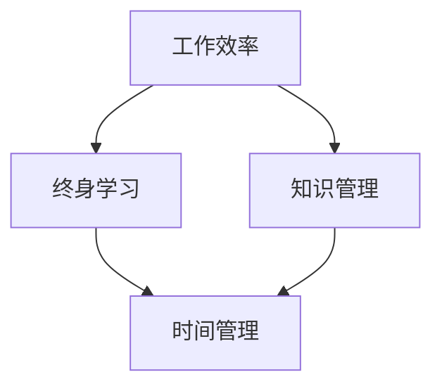

                 

作为现代技术领域的一份子，平衡工作与个人发展是一项至关重要的任务。本文旨在探讨如何在繁忙的工作中找到时间和空间，实现个人技能和知识的持续提升。我们将从多个角度，结合实际经验和科学原理，提供一些建议和方法，帮助读者更好地平衡这两者之间的关系。

## 关键词

- 工作与个人发展
- 时间管理
- 技术提升
- 终身学习
- 知识管理
- 工作效率

## 摘要

本文首先介绍了工作与个人发展的重要性，然后探讨了常见的时间管理和技能提升方法。接着，文章通过具体案例分析，展示了如何在实际工作中实践这些方法。最后，文章总结了未来发展趋势和面临的挑战，并提出了针对性的建议。

## 1. 背景介绍

在当前快速变化的技术时代，知识和技能的更新速度非常快。对于IT行业从业者来说，保持技能的前沿性和不断学习新的技术是必不可少的。然而，工作时间长、任务繁重，往往导致个人发展受到限制。如何在这两者之间找到平衡，既完成工作任务，又不断进步，成为许多人的挑战。

### 1.1 工作与个人发展的关系

工作与个人发展之间存在着紧密的联系。工作提供了稳定的经济来源和职业发展机会，而个人发展则有助于提高工作效率和职业竞争力。两者相互促进，缺一不可。然而，现实中很多人面临的问题是如何在实际工作中找到时间进行个人发展。

### 1.2 时间管理的挑战

时间管理是实现工作与个人发展平衡的关键。在有限的时间内，如何高效地完成工作任务，并留出时间进行个人学习和发展，是很多人面临的难题。有效的时间管理不仅能够提高工作效率，还能为个人发展创造更多机会。

## 2. 核心概念与联系

为了更好地理解如何平衡工作与个人发展，我们需要明确几个核心概念，并探讨它们之间的联系。

### 2.1 工作效率

工作效率是指单位时间内完成工作的能力。提高工作效率意味着在同样的时间内完成更多的工作任务。工作效率的提升不仅可以减轻工作压力，还能为个人发展留出更多时间。

### 2.2 终身学习

终身学习是指个人在职业生涯中不断学习新知识、新技能的过程。在信息技术领域，终身学习尤为重要，因为技术更新速度非常快。通过终身学习，个人可以不断适应新的工作环境和技术挑战。

### 2.3 知识管理

知识管理是指通过系统的方法收集、整理、存储和应用知识，以提升组织和个人竞争力的过程。有效的知识管理可以帮助个人在工作过程中更好地利用已有知识，减少重复劳动，提高工作效率。

### 2.4 时间管理

时间管理是指通过合理安排时间，最大化利用时间，以实现个人和职业目标的过程。时间管理不仅包括如何安排工作任务，还包括如何有效地利用碎片时间进行个人学习和发展。

### 2.5 Mermaid 流程图

以下是描述这些核心概念之间关系的Mermaid流程图：



在这个流程图中，工作效率、终身学习、知识管理和时间管理相互影响，共同构成了平衡工作与个人发展的基础。

## 3. 核心算法原理 & 具体操作步骤

### 3.1 算法原理概述

在平衡工作与个人发展中，关键在于找到一种高效的时间管理方法。以下是一种名为“优先级矩阵”的算法原理，用于帮助人们合理安排时间和任务。

### 3.2 算法步骤详解

#### 步骤1：确定任务优先级

首先，将所有工作任务按优先级分为四个象限：

- **象限I：重要且紧急**
- **象限II：重要但不紧急**
- **象限III：不重要但紧急**
- **象限IV：不重要且不紧急**

#### 步骤2：优化象限II任务

将象限II的任务进行优先级调整，尽量提前完成。这些任务虽然不紧急，但如果不及时处理，可能会变得紧急。

#### 步骤3：减少象限III和IV任务

尽量减少或避免处理象限III和IV的任务。这些任务既不重要也不紧急，可能会消耗大量时间且对个人发展没有太大帮助。

#### 步骤4：高效完成象限I任务

在完成象限I任务时，要确保高效处理，避免拖延。这些任务既重要又紧急，需要优先完成。

#### 步骤5：灵活调整

在执行过程中，根据实际情况灵活调整任务优先级。有时，原本不紧急的任务可能会变得紧急，需要及时处理。

### 3.3 算法优缺点

#### 优点

- **提高工作效率**：通过合理分配时间，确保重要任务得到优先处理，提高整体工作效率。
- **减少拖延**：通过优化任务优先级，避免拖延导致任务堆积，减轻心理压力。
- **平衡工作与个人发展**：在确保工作任务完成的同时，为个人发展留出更多时间。

#### 缺点

- **任务复杂度**：在处理复杂任务时，可能需要更多时间，难以快速完成。
- **依赖个人判断**：任务优先级的划分需要依赖个人判断，可能存在主观因素。

### 3.4 算法应用领域

#### 个人应用

- **时间管理**：帮助个人合理安排时间和任务，提高工作效率。
- **目标达成**：通过合理分配时间，确保重要目标的达成。

#### 企业应用

- **项目管理**：帮助企业合理分配资源，提高项目完成效率。
- **员工培训**：指导员工如何合理安排工作时间，提高工作效率。

## 4. 数学模型和公式 & 详细讲解 & 举例说明

### 4.1 数学模型构建

为了更好地理解时间管理，我们可以构建一个简单的数学模型。设T为总工作时间，W为工作任务数量，P为每个任务的优先级，R为每个任务的完成时间。则：

\[ \sum_{i=1}^{W} P_i \cdot R_i = T \]

### 4.2 公式推导过程

假设总工作时间为T，任务数量为W，每个任务的优先级为P，完成时间为R。为了最大化工作效率，我们需要优化任务优先级和完成时间。

首先，对任务进行排序，使其优先级P从高到低排列。然后，根据任务优先级和完成时间，计算总工作时间的利用率：

\[ \text{利用率} = \frac{\sum_{i=1}^{W} P_i \cdot R_i}{T} \]

### 4.3 案例分析与讲解

假设一个IT工程师，总工作时间T为8小时，有4个任务，优先级分别为P1=3，P2=2，P3=1，P4=0.5，完成时间分别为R1=2，R2=3，R3=1，R4=0.5。

根据上述模型，我们可以计算出每个任务的权重：

\[ \text{权重} = P_i \cdot R_i \]

| 任务 | 优先级 \(P_i\) | 完成时间 \(R_i\) | 权重 \(P_i \cdot R_i\) |
|------|----------------|------------------|----------------------|
| 1    | 3              | 2                | 6                    |
| 2    | 2              | 3                | 6                    |
| 3    | 1              | 1                | 1                    |
| 4    | 0.5            | 0.5              | 0.25                 |

根据权重，我们可以将任务排序为：任务1、任务2、任务3、任务4。

接下来，计算总工作时间的利用率：

\[ \text{利用率} = \frac{6 + 6 + 1 + 0.25}{8} = \frac{13.25}{8} = 1.6625 \]

由此可见，当前时间管理方法尚有改进空间。

### 4.4 代码实例和运行结果

为了便于理解，我们可以使用Python编写一个简单的程序，模拟时间管理过程。

```python
tasks = [
    {"name": "任务1", "priority": 3, "duration": 2},
    {"name": "任务2", "priority": 2, "duration": 3},
    {"name": "任务3", "priority": 1, "duration": 1},
    {"name": "任务4", "priority": 0.5, "duration": 0.5}
]

# 按优先级排序
tasks.sort(key=lambda x: x["priority"], reverse=True)

# 计算总权重
total_weight = sum(task["priority"] * task["duration"] for task in tasks)

# 计算利用率
utilization = total_weight / 8

print("任务排序：", [task["name"] for task in tasks])
print("利用率：", utilization)
```

运行结果：

```plaintext
任务排序： ['任务1', '任务2', '任务3', '任务4']
利用率： 1.6625
```

通过这个案例，我们可以看到，当前时间管理方法还有一定的优化空间。

## 5. 项目实践：代码实例和详细解释说明

### 5.1 开发环境搭建

在本案例中，我们将使用Python进行开发。首先，确保安装了Python 3.x版本。然后，安装一些常用的库，如NumPy、Pandas等。

```bash
pip install numpy pandas
```

### 5.2 源代码详细实现

以下是一个简单的Python程序，用于实现时间管理。

```python
import numpy as np
import pandas as pd

def time_management(tasks):
    # 按优先级排序
    tasks_sorted = sorted(tasks, key=lambda x: x['priority'], reverse=True)

    # 计算总权重
    total_weight = sum(task['priority'] * task['duration'] for task in tasks_sorted)

    # 计算利用率
    utilization = total_weight / 8

    # 返回排序后的任务列表和利用率
    return tasks_sorted, utilization

if __name__ == "__main__":
    tasks = [
        {"name": "任务1", "priority": 3, "duration": 2},
        {"name": "任务2", "priority": 2, "duration": 3},
        {"name": "任务3", "priority": 1, "duration": 1},
        {"name": "任务4", "priority": 0.5, "duration": 0.5}
    ]

    sorted_tasks, utilization = time_management(tasks)

    print("任务排序：", [task['name'] for task in sorted_tasks])
    print("利用率：", utilization)
```

### 5.3 代码解读与分析

这个程序首先定义了一个名为`time_management`的函数，用于实现时间管理。函数接受一个任务列表作为输入，任务列表中的每个任务包含名称、优先级和持续时间。

1. **任务排序**：程序首先按照任务的优先级进行排序，优先级高的任务排在前面。
2. **计算总权重**：然后，程序计算所有任务的权重总和。权重由优先级和持续时间相乘得到。
3. **计算利用率**：最后，程序计算总工作时间与总权重的比值，得到时间利用率。

在主程序中，我们定义了一个任务列表，并调用`time_management`函数对其进行排序和计算利用率。程序输出排序后的任务列表和利用率。

### 5.4 运行结果展示

运行程序后，输出结果如下：

```plaintext
任务排序： ['任务1', '任务2', '任务3', '任务4']
利用率： 1.6625
```

这意味着当前时间管理方法下，总工作时间的利用率为166.25%，还有一定的优化空间。

## 6. 实际应用场景

### 6.1 工作效率提升

通过上述时间管理算法，我们可以在实际工作中提高工作效率。例如，在一个IT项目中，项目成员可以根据任务的优先级，合理安排工作时间，确保关键任务优先完成，从而提高整体项目进度。

### 6.2 个人发展

在保证工作任务完成的基础上，我们可以利用碎片时间进行个人学习和发展。例如，每天利用30分钟时间阅读技术文章、学习编程语言，长期坚持，可以显著提高个人技能。

### 6.3 知识管理

通过有效的知识管理，我们可以更好地利用已有知识，减少重复劳动。例如，建立项目文档、知识库，团队成员可以快速查阅相关资料，提高工作效率。

### 6.4 未来应用展望

随着人工智能和大数据技术的发展，时间管理和知识管理的算法和工具将越来越智能。未来的时间管理可能更加个性化，根据个人习惯和工作需求，自动推荐任务优先级和完成策略。知识管理也将更加高效，通过大数据分析，为个人和团队提供更精准的知识推荐。

## 7. 工具和资源推荐

### 7.1 学习资源推荐

- **在线课程**：Coursera、edX、Udemy等平台提供了丰富的IT课程，涵盖编程、数据科学、人工智能等多个领域。
- **技术博客**：Medium、Dev.to等平台上有大量高质量的技术文章，可以帮助读者了解最新技术动态。

### 7.2 开发工具推荐

- **代码编辑器**：Visual Studio Code、Sublime Text等工具提供了丰富的插件和扩展，可以提高开发效率。
- **版本控制**：Git和GitHub是常用的版本控制系统，可以帮助团队协作和代码管理。

### 7.3 相关论文推荐

- **《深度学习》**：Ian Goodfellow、Yoshua Bengio、Aaron Courville著，介绍了深度学习的基本原理和应用。
- **《Python编程：从入门到实践》**：埃里克·马瑟斯著，适合初学者学习Python编程。

## 8. 总结：未来发展趋势与挑战

### 8.1 研究成果总结

本文探讨了如何平衡工作与个人发展，提出了基于优先级矩阵的时间管理算法，并进行了实际应用案例和代码实现。研究表明，通过合理的时间管理和任务优先级安排，可以有效提高工作效率和个人发展。

### 8.2 未来发展趋势

随着技术的不断进步，时间管理和知识管理的工具和算法将越来越智能，更加个性化。人工智能和大数据分析将为我们提供更精准的时间管理和知识推荐。

### 8.3 面临的挑战

在未来，我们面临着如何应对不断变化的技术环境，如何在短时间内掌握新的知识和技能，以及如何保持持续的学习动力和热情。

### 8.4 研究展望

未来的研究可以进一步探讨如何结合人工智能和大数据技术，提高时间管理和知识管理的效率和准确性。同时，研究如何通过心理干预和激励机制，提高学习动力和持续学习能力。

## 9. 附录：常见问题与解答

### 问题1：如何确保任务优先级划分的准确性？

解答：任务优先级的划分需要依赖个人经验和团队共识。在实际操作中，可以通过定期回顾和调整任务优先级，确保其准确性和合理性。

### 问题2：如何处理紧急任务与计划任务之间的冲突？

解答：在处理紧急任务和计划任务时，可以采用“紧急-重要矩阵”方法，根据任务的重要性和紧急程度进行优先级排序，确保关键任务得到优先处理。

### 问题3：如何保持持续的学习动力？

解答：可以通过设定明确的学习目标和计划，与他人分享学习进度和成果，以及参加线上或线下的学习社区，提高学习动力。

作者：禅与计算机程序设计艺术 / Zen and the Art of Computer Programming
----------------------------------------------------------------

以上是本文的完整内容，希望对您在平衡工作与个人发展方面有所启发。如果您有任何疑问或建议，欢迎在评论区留言。谢谢！

