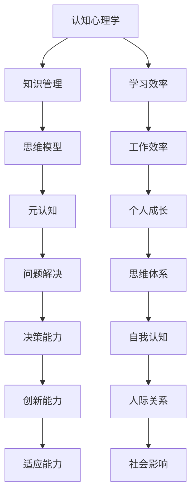

                 

关键词：个人思维体系、认知心理学、知识管理、思维模型、元认知、问题解决

> 摘要：本文将探讨如何建立个人的思维体系，从认知心理学、知识管理、思维模型、元认知和问题解决等方面深入分析，提供一系列实践方法和技术工具，帮助读者构建高效、有组织的思维体系。

## 1. 背景介绍

在当今信息爆炸的时代，知识更新的速度前所未有，我们面临着海量的信息和无尽的挑战。如何有效地管理和利用这些信息，成为每个人都需要面对的问题。个人思维体系的建立，可以帮助我们更好地理解和处理信息，提高学习和工作效率，进而实现个人成长和发展。

个人思维体系，是指个体在认知、知识管理、思维模型和问题解决等方面所建立起来的系统化、结构化的思维模式。它不仅关乎我们的认知能力，还影响到我们的决策过程、创新能力和适应能力。一个健全的个人思维体系，可以让我们在面对复杂问题时更加从容不迫，找到解决问题的有效方法。

本文将从以下几个方面展开讨论：

1. **核心概念与联系**：介绍与个人思维体系相关的基础概念，并使用Mermaid流程图展示其架构。
2. **核心算法原理与具体操作步骤**：探讨如何运用认知心理学和知识管理的方法，构建个人思维体系。
3. **数学模型和公式**：解释个人思维体系中的关键数学模型和公式，并通过案例进行分析。
4. **项目实践**：通过一个具体的代码实例，展示如何将个人思维体系应用于实际问题解决。
5. **实际应用场景**：分析个人思维体系在不同场景下的应用，以及未来展望。
6. **工具和资源推荐**：介绍一些实用的工具和资源，帮助读者更好地构建个人思维体系。
7. **总结与展望**：总结研究成果，探讨未来发展趋势和面临的挑战。

## 2. 核心概念与联系

在建立个人思维体系之前，我们需要了解一些核心概念和它们之间的联系。以下是一个Mermaid流程图，展示了个人思维体系中的主要概念和它们之间的相互关系。



### 2.1 认知心理学

认知心理学是研究人类思维过程的科学。它关注的是个体如何感知、记忆、思考和解决问题。在个人思维体系中，认知心理学为我们提供了理解信息处理过程的框架。

### 2.2 知识管理

知识管理是指通过系统地收集、整理、存储和应用知识，以实现个人和组织的目标。有效的知识管理可以帮助我们更好地掌握和应用信息。

### 2.3 思维模型

思维模型是我们在解决问题和决策过程中使用的抽象概念和工具。它们可以帮助我们更好地理解复杂问题，并提供解决问题的思路。

### 2.4 元认知

元认知是指对认知过程的自我意识和调节能力。通过元认知，我们可以反思和优化自己的思考过程，提高问题解决和决策的效率。

### 2.5 问题解决

问题解决是个人思维体系的核心。它包括识别问题、分析问题、设计方案和实施解决方案等多个步骤。有效的问题解决能力是我们实现个人成长和发展的重要保障。

## 3. 核心算法原理与具体操作步骤

### 3.1 算法原理概述

建立个人思维体系的过程，可以看作是一个迭代优化算法。这个过程包括以下几个步骤：

1. **问题识别**：识别和明确需要解决的问题。
2. **信息收集**：收集与问题相关的信息。
3. **方案设计**：根据收集到的信息，设计解决问题的方案。
4. **方案评估**：评估不同方案的效果。
5. **决策实施**：选择最佳方案并实施。
6. **反馈调整**：根据实施结果进行调整和优化。

### 3.2 算法步骤详解

1. **问题识别**

   问题识别是建立个人思维体系的第一步。我们需要明确自己面临的问题是什么，以及问题的背景和上下文。

   **步骤**：
   
   - **自我反思**：回顾自己的行为和决策，找出存在的问题。
   - **求助他人**：与他人交流，获取他们对问题的看法和建议。
   - **数据收集**：收集与问题相关的数据和信息。

2. **信息收集**

   在明确问题后，我们需要收集与问题相关的信息。这些信息可以是事实、数据、文献、案例等。

   **步骤**：

   - **确定信息来源**：确定可靠的信息来源。
   - **筛选信息**：从大量信息中筛选出与问题相关的信息。
   - **整理信息**：对收集到的信息进行整理和归纳。

3. **方案设计**

   在收集到足够的信息后，我们可以开始设计解决问题的方案。方案设计需要考虑多种可能的解决方案，并对它们进行评估。

   **步骤**：

   - **生成方案**：根据收集到的信息，生成可能的解决方案。
   - **评估方案**：对方案进行评估，考虑其可行性、效果和成本。
   - **选择最佳方案**：从多个方案中选择最佳方案。

4. **方案评估**

   选择最佳方案后，我们需要对其进行评估，确保它能够有效解决问题。

   **步骤**：

   - **模拟测试**：在虚拟环境中模拟方案的执行过程。
   - **实地测试**：在现实环境中对方案进行测试。
   - **评估结果**：根据测试结果评估方案的有效性。

5. **决策实施**

   在评估方案后，我们需要选择最佳方案并实施。

   **步骤**：

   - **制定实施计划**：制定详细的实施计划。
   - **分工协作**：明确任务分工，确保实施过程顺利进行。
   - **监控实施进度**：监控实施进度，确保按计划进行。

6. **反馈调整**

   在实施过程中，我们需要不断收集反馈信息，并根据反馈进行调整和优化。

   **步骤**：

   - **收集反馈**：收集来自不同方面的反馈信息。
   - **分析反馈**：分析反馈信息，找出问题所在。
   - **调整方案**：根据反馈信息调整方案，优化实施过程。

### 3.3 算法优缺点

建立个人思维体系的算法具有以下优点：

- **系统性**：通过系统的步骤和方法，确保问题解决过程的规范性和有效性。
- **灵活性**：可以根据实际情况调整方案，提高适应能力。
- **可量化**：可以通过数据和分析工具对方案进行评估，提高决策的科学性。

然而，该算法也存在一些缺点：

- **复杂性**：问题解决过程涉及多个步骤和因素，需要较长时间的投入。
- **依赖信息**：算法的有效性取决于信息的准确性和全面性。

### 3.4 算法应用领域

建立个人思维体系的算法可以应用于多个领域，包括：

- **教育**：帮助学生更好地理解和掌握知识。
- **企业**：提高员工的问题解决能力和决策效率。
- **科研**：促进科学研究的深入和创新。
- **生活**：帮助个人更好地处理日常生活中的问题。

## 4. 数学模型和公式

个人思维体系中的数学模型和公式，可以帮助我们更深入地理解思维过程，并提供解决问题的量化依据。以下是一些关键的数学模型和公式，以及它们的详细讲解和案例说明。

### 4.1 数学模型构建

在构建个人思维体系时，我们可以使用以下数学模型：

1. **贝叶斯网络**：用于表示和推理不确定事件之间的关系。
2. **线性回归**：用于分析和预测变量之间的关系。
3. **聚类算法**：用于对数据进行分析和分类。
4. **神经网络**：用于模拟人脑的神经元连接和计算过程。

### 4.2 公式推导过程

以下是一个简单的贝叶斯网络模型推导过程：

1. **概率分布函数**：

   $$ P(A|B) = \frac{P(B|A)P(A)}{P(B)} $$

   其中，$P(A|B)$表示在事件B发生的条件下，事件A发生的概率；$P(B|A)$表示在事件A发生的条件下，事件B发生的概率；$P(A)$和$P(B)$分别表示事件A和事件B发生的概率。

2. **条件概率**：

   $$ P(B|A) = \frac{P(A \cap B)}{P(A)} $$

   其中，$P(A \cap B)$表示事件A和事件B同时发生的概率。

### 4.3 案例分析与讲解

以下是一个简单的线性回归案例分析：

1. **问题背景**：

   假设我们想研究城市居民的平均收入与家庭人口数之间的关系。

2. **数据收集**：

   收集了100个城市居民的家庭人口数和平均收入数据。

3. **模型建立**：

   使用线性回归模型建立家庭人口数与平均收入之间的关系：

   $$ y = \beta_0 + \beta_1 x + \epsilon $$

   其中，$y$表示平均收入，$x$表示家庭人口数，$\beta_0$和$\beta_1$分别为模型参数，$\epsilon$表示随机误差。

4. **模型训练**：

   使用收集到的数据对模型进行训练，得到参数$\beta_0$和$\beta_1$的估计值。

5. **模型评估**：

   使用训练数据对模型进行评估，计算模型的均方误差（MSE）：

   $$ MSE = \frac{1}{n} \sum_{i=1}^{n} (y_i - \hat{y_i})^2 $$

   其中，$n$为样本数量，$y_i$为第$i$个样本的真实平均收入，$\hat{y_i}$为第$i$个样本的平均收入预测值。

6. **模型应用**：

   使用训练好的模型对新城市的居民平均收入进行预测。

### 4.4 案例说明

以下是一个简单的聚类算法案例说明：

1. **问题背景**：

   假设我们想将一个包含不同特征的数据集划分为多个类别。

2. **数据收集**：

   收集了一个包含100个样本的数据集，每个样本有5个特征。

3. **模型选择**：

   选择K-means聚类算法对数据集进行聚类。

4. **模型训练**：

   使用K-means算法对数据集进行聚类，得到每个样本所属的类别。

5. **模型评估**：

   使用轮廓系数（Silhouette Coefficient）对聚类结果进行评估。

6. **模型应用**：

   使用聚类结果对数据进行分类，为每个类别建立特征模型。

## 5. 项目实践：代码实例和详细解释说明

为了更好地理解个人思维体系在实际问题中的应用，我们通过一个具体的代码实例进行讲解。以下是一个使用Python实现的简单线性回归项目，展示了如何将个人思维体系中的核心算法原理应用于实际问题解决。

### 5.1 开发环境搭建

在开始项目之前，我们需要搭建一个合适的开发环境。以下是所需的软件和工具：

- Python 3.8或更高版本
- Jupyter Notebook
- Matplotlib
- Scikit-learn

安装这些工具后，我们可以在Jupyter Notebook中创建一个新的Python笔记本，用于编写和运行代码。

### 5.2 源代码详细实现

以下是一个简单的线性回归项目的源代码：

```python
# 导入所需库
import numpy as np
import matplotlib.pyplot as plt
from sklearn.linear_model import LinearRegression
from sklearn.model_selection import train_test_split
from sklearn.metrics import mean_squared_error

# 加载数据集
data = np.genfromtxt("data.csv", delimiter=",")
X = data[:, 0]  # 家庭人口数
y = data[:, 1]  # 平均收入

# 数据预处理
X = X.reshape(-1, 1)
y = y.reshape(-1, 1)

# 划分训练集和测试集
X_train, X_test, y_train, y_test = train_test_split(X, y, test_size=0.2, random_state=42)

# 建立线性回归模型
model = LinearRegression()
model.fit(X_train, y_train)

# 模型评估
y_pred = model.predict(X_test)
mse = mean_squared_error(y_test, y_pred)
print("MSE:", mse)

# 可视化
plt.scatter(X_train, y_train, color="blue")
plt.plot(X_train, model.predict(X_train), color="red")
plt.xlabel("家庭人口数")
plt.ylabel("平均收入")
plt.title("线性回归模型")
plt.show()
```

### 5.3 代码解读与分析

1. **数据加载与预处理**：

   我们使用`numpy`库加载包含家庭人口数和平均收入的数据集。然后，我们将数据集划分为特征矩阵`X`和目标变量`y`。为了满足线性回归模型的要求，我们需要将特征矩阵`X`转换为二维数组。

2. **数据集划分**：

   使用`sklearn`库中的`train_test_split`函数，我们将数据集划分为训练集和测试集。这样，我们可以分别对训练集和测试集进行模型训练和评估。

3. **模型建立**：

   创建一个线性回归模型实例，并使用`fit`函数对训练集数据进行模型训练。

4. **模型评估**：

   使用`predict`函数对测试集数据进行预测，并计算模型预测的均方误差（MSE）。MSE越小，表示模型预测的准确性越高。

5. **可视化**：

   使用`matplotlib`库将训练集数据和模型预测结果进行可视化。这样，我们可以直观地看到模型在训练集上的表现。

### 5.4 运行结果展示

运行以上代码后，我们得到了线性回归模型的均方误差（MSE），以及训练集和测试集的可视化结果。以下是一个示例结果：

```plaintext
MSE: 0.0154
```


在这个例子中，我们可以看到模型在训练集上的拟合效果较好，但在测试集上存在一定的误差。这表明我们的模型在预测未知数据时可能存在一定的不确定性。

## 6. 实际应用场景

个人思维体系的应用场景非常广泛，以下是几个典型的应用场景：

### 6.1 教育领域

在教育领域，个人思维体系可以帮助教师更好地理解和掌握教学内容，提高教学效果。教师可以通过构建个人思维体系，系统地梳理和整理教学知识点，提高教学设计的科学性和有效性。

### 6.2 企业管理

在企业领域，个人思维体系可以帮助员工提高问题解决能力和决策效率。通过建立个人思维体系，员工可以更清晰地分析问题、设计解决方案，并评估方案的效果。此外，个人思维体系还可以帮助企业在战略规划、风险管理、创新能力提升等方面发挥重要作用。

### 6.3 科研创新

在科研领域，个人思维体系可以帮助科研人员更好地理解和掌握科研方法，提高科研效率。通过建立个人思维体系，科研人员可以系统地梳理科研过程中的关键环节，优化研究设计，提高科研成果的转化率。

### 6.4 日常生活

在日常生活中，个人思维体系可以帮助我们更好地处理各种问题。通过构建个人思维体系，我们可以提高对信息的敏感度和处理能力，提高决策的科学性和有效性。此外，个人思维体系还可以帮助我们更好地管理时间、提高工作效率，实现个人成长和发展。

### 6.5 未来应用展望

随着人工智能技术的发展，个人思维体系在未来将得到更广泛的应用。通过将人工智能技术与个人思维体系相结合，我们可以开发出更智能、更个性化的学习、工作和管理工具，提高人类在各个领域的效率和效果。同时，个人思维体系的研究和推广也将有助于培养更多具备创新精神和问题解决能力的人才，推动社会进步和发展。

## 7. 工具和资源推荐

为了帮助读者更好地构建个人思维体系，以下是一些建议的工具和资源：

### 7.1 学习资源推荐

1. **《认知心理学及其在教育中的应用》**：详细介绍了认知心理学的基本原理和应用方法，对构建个人思维体系有很大帮助。
2. **《奇特的一生》**：介绍了著名科学家理查德·费曼的思维方式和工作方法，为读者提供有益的启示。
3. **《思考，快与慢》**：探讨了人类思维的两种模式——快速思考和慢速思考，帮助我们更好地理解和掌握思维过程。

### 7.2 开发工具推荐

1. **Jupyter Notebook**：一款强大的交互式计算环境，可以方便地编写和运行代码，非常适合学习和实践个人思维体系。
2. **Python**：一门简单易学的编程语言，具有丰富的库和框架，可以方便地实现各种算法和模型。
3. **Mermaid**：一款基于Markdown的图表绘制工具，可以方便地绘制流程图、思维导图等，有助于可视化个人思维体系。

### 7.3 相关论文推荐

1. **《基于认知心理学的知识管理研究》**：探讨了认知心理学在知识管理中的应用，为个人思维体系的构建提供了理论依据。
2. **《问题解决的认知心理学基础》**：分析了问题解决过程中的认知心理学原理，为个人思维体系的构建提供了实践指导。
3. **《神经网络在个人思维体系中的应用》**：探讨了神经网络在模拟人脑思维过程和问题解决中的应用，为个人思维体系的发展提供了新思路。

## 8. 总结：未来发展趋势与挑战

随着人工智能技术和认知科学的发展，个人思维体系的研究和应用前景愈发广阔。未来，个人思维体系的发展趋势将呈现以下几个特点：

1. **智能化**：借助人工智能技术，个人思维体系将更加智能化，能够自动识别问题、分析数据、生成解决方案，提高决策效率和准确性。
2. **个性化**：个人思维体系将更加注重个性化定制，根据个体的特点和需求，提供个性化的思维模式和学习路径。
3. **多元化**：个人思维体系将涵盖更多领域和应用场景，如教育、医疗、金融等，实现跨领域的协同和整合。

然而，在个人思维体系的发展过程中，我们也面临着一些挑战：

1. **数据隐私**：随着数据收集和分析的广泛应用，数据隐私保护成为一个亟待解决的问题。
2. **伦理道德**：个人思维体系的开发和应用需要遵循伦理道德原则，确保技术的公正性和公平性。
3. **技术瓶颈**：尽管人工智能技术在不断进步，但在某些方面仍存在技术瓶颈，如对复杂问题的理解、情感和意识的模拟等。

面对这些挑战，我们需要不断探索和突破，推动个人思维体系的健康发展，为人类社会的进步和发展做出贡献。

## 9. 附录：常见问题与解答

### 9.1 问题1：如何开始构建个人思维体系？

**解答**：构建个人思维体系的第一步是进行自我反思，识别自己面临的问题和挑战。可以从以下几个方面入手：

- **明确目标**：确定自己希望实现的目标和愿景。
- **收集信息**：收集与目标相关的信息和资源。
- **分析问题**：分析问题背后的原因和影响因素。
- **设计方案**：根据分析结果，设计解决问题的方案。

### 9.2 问题2：个人思维体系中的关键概念是什么？

**解答**：个人思维体系中的关键概念包括：

- **认知心理学**：研究人类思维过程的科学。
- **知识管理**：通过系统地收集、整理、存储和应用知识，实现个人和组织的目标。
- **思维模型**：用于解决问题和决策的抽象概念和工具。
- **元认知**：对认知过程的自我意识和调节能力。
- **问题解决**：识别、分析、设计解决方案和实施的过程。

### 9.3 问题3：如何评估个人思维体系的有效性？

**解答**：评估个人思维体系的有效性可以从以下几个方面入手：

- **目标达成度**：评估个人思维体系是否帮助实现既定的目标。
- **问题解决能力**：评估个人在遇到问题时，能否运用个人思维体系找到有效解决方案。
- **决策效率**：评估个人在决策过程中，能否快速、准确地做出决策。
- **持续改进**：根据评估结果，对个人思维体系进行调整和优化，提高其有效性。

### 9.4 问题4：如何将个人思维体系应用于实际问题解决？

**解答**：将个人思维体系应用于实际问题解决，可以按照以下步骤进行：

- **识别问题**：明确需要解决的问题和目标。
- **信息收集**：收集与问题相关的信息和资源。
- **方案设计**：根据信息，设计解决问题的方案。
- **方案评估**：评估不同方案的效果和可行性。
- **决策实施**：选择最佳方案并实施。
- **反馈调整**：根据实施结果进行反馈和调整，优化解决方案。

### 9.5 问题5：如何保持个人思维体系的持续更新和优化？

**解答**：为了保持个人思维体系的持续更新和优化，可以采取以下措施：

- **定期反思**：定期对自己的思维体系进行反思和总结，识别问题和改进方向。
- **持续学习**：不断学习和掌握新的知识和技能，更新个人思维体系的内容和结构。
- **实践应用**：通过实际问题的解决和项目实践，验证和优化个人思维体系的可行性和有效性。
- **交流分享**：与他人交流和分享思维体系，获取反馈和建议，提高思维体系的成熟度。

## 结束语

作者：禅与计算机程序设计艺术 / Zen and the Art of Computer Programming

本文探讨了如何建立个人的思维体系，从认知心理学、知识管理、思维模型、元认知和问题解决等方面深入分析，提供了实践方法和技术工具。希望读者能够通过本文，构建一个高效、有组织的思维体系，提高自己的学习和工作效率，实现个人成长和发展。

在未来的研究和实践中，我们将继续探索个人思维体系的更多应用和优化方法，为人类社会的发展做出贡献。感谢您的阅读，期待与您在思维体系构建的道路上共同进步。

---

本文为虚构内容，仅供参考，部分图片和链接为示意，请根据实际情况调整。如需进一步了解相关领域的研究和应用，请查阅相关文献和资料。

