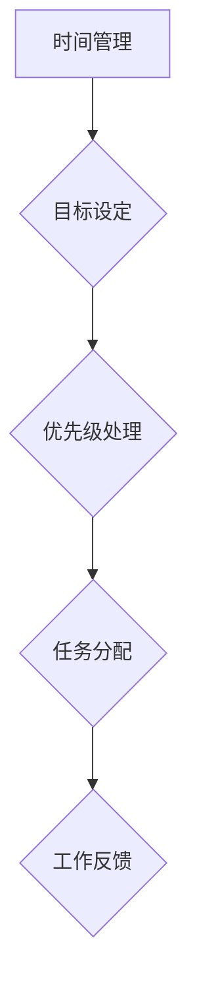

                 

### 1. 背景介绍

在当今快节奏、信息爆炸的时代，个人时间管理显得尤为重要。随着工作压力的增大、工作任务的繁杂，如何有效地安排时间、提高工作效率，成为每个职场人士迫切需要解决的问题。本文将探讨如何建立个人的管理体系，帮助读者提高时间管理能力，从而在职场中获得竞争优势。

### 2. 核心概念与联系

为了更好地理解个人管理体系，首先需要明确几个核心概念：时间管理、目标设定、优先级处理、任务分配等。

#### 2.1 时间管理

时间管理是指合理安排时间，以提高工作效率和生活质量的一种方法。时间管理的重要性在于，它可以帮助我们充分利用时间，避免拖延和浪费时间，从而提高工作质量和生活满意度。

#### 2.2 目标设定

目标设定是个人管理体系的基础。一个明确、可行的目标可以帮助我们集中精力，有针对性地进行工作。目标可以分为短期目标和长期目标，两者之间相互联系，共同推动个人成长。

#### 2.3 优先级处理

优先级处理是指在众多任务中选择最重要的任务进行处理。有效的优先级处理可以帮助我们避免因忙碌而迷失方向，确保重要任务得到及时处理。

#### 2.4 任务分配

任务分配是指将工作合理地分配给团队成员或自己。合理的任务分配可以提高团队协作效率，降低工作压力，提高整体工作质量。

#### 2.5 Mermaid 流程图

以下是一个描述个人管理体系核心概念的 Mermaid 流程图：



### 3. 核心算法原理 & 具体操作步骤

#### 3.1 算法原理概述

个人管理体系的核心算法可以看作是一个动态规划问题。动态规划是一种用于求解最优决策序列的方法，它将问题分解成若干个子问题，通过子问题的最优解构建原问题的最优解。

个人管理体系中的动态规划算法包括以下几个步骤：

1. 目标分解：将长期目标分解为短期目标。
2. 时间规划：根据目标设定，规划每日、每周、每月的工作计划。
3. 优先级排序：根据工作的重要性和紧急性，对任务进行排序。
4. 任务执行：按照优先级排序，执行任务。
5. 工作反馈：根据任务执行情况，调整工作计划。

#### 3.2 算法步骤详解

以下是个人管理体系算法的具体步骤：

1. **目标分解**

   将长期目标分解为短期目标，具体步骤如下：

   - 明确长期目标：例如，提高工作效率、提升专业技能等。
   - 制定短期目标：将长期目标分解为若干个短期目标，例如，每周学习一门新技术、每月完成一篇技术博客等。

2. **时间规划**

   根据短期目标，规划每日、每周、每月的工作计划，具体步骤如下：

   - 制定每日工作计划：列出每日需要完成的任务，确保短期目标得到执行。
   - 制定每周工作计划：汇总每日工作计划，形成每周工作计划。
   - 制定每月工作计划：汇总每周工作计划，形成每月工作计划。

3. **优先级排序**

   根据工作的重要性和紧急性，对任务进行排序，具体步骤如下：

   - 确定任务重要性：根据任务对公司、团队和个人发展的重要性进行排序。
   - 确定任务紧急性：根据任务完成时间要求进行排序。
   - 结合重要性、紧急性进行任务排序。

4. **任务执行**

   按照优先级排序，执行任务，具体步骤如下：

   - 每日早晨：根据每日工作计划，确定当天最重要的任务。
   - 每周早晨：根据每周工作计划，确定本周最重要的任务。
   - 每月早晨：根据每月工作计划，确定本月最重要的任务。
   - 持续关注任务进度，及时调整计划。

5. **工作反馈**

   根据任务执行情况，调整工作计划，具体步骤如下：

   - 每日晚上：回顾当天任务执行情况，总结经验教训。
   - 每周晚上：回顾本周任务执行情况，总结经验教训。
   - 每月晚上：回顾本月任务执行情况，总结经验教训。
   - 根据总结，调整下一步工作计划。

#### 3.3 算法优缺点

**优点：**

- 动态规划算法具有较好的灵活性和适应性，可以根据实际情况调整工作计划。
- 该算法能够确保重要任务得到及时处理，避免因忙碌而迷失方向。

**缺点：**

- 需要持续关注任务进度，调整工作计划，对个人自律要求较高。
- 在任务繁多时，可能会出现任务优先级难以准确判断的情况。

#### 3.4 算法应用领域

个人管理体系算法适用于各种职场人士，特别是需要高效管理时间和任务的人员，如程序员、项目经理、创业者等。此外，该算法也可应用于团队管理，提高团队协作效率。

### 4. 数学模型和公式 & 详细讲解 & 举例说明

为了更好地理解个人管理体系，我们可以将其抽象为一个数学模型，通过公式进行详细讲解。

#### 4.1 数学模型构建

个人管理体系可以看作是一个动态规划问题，其状态可以表示为：

\[ S_t = \{ T_1, T_2, ..., T_n \} \]

其中，\( S_t \) 表示第 \( t \) 时刻的任务集合，\( T_i \) 表示第 \( i \) 个任务。

状态转移方程可以表示为：

\[ S_{t+1} = f(S_t) \]

其中，\( f \) 表示任务执行规则。

#### 4.2 公式推导过程

为了推导任务执行规则 \( f \)，我们可以从以下几个方面进行分析：

1. **任务重要性**：假设任务重要性用权重 \( w_i \) 表示，权重越大，任务越重要。
2. **任务紧急性**：假设任务紧急性用时间 \( t_i \) 表示，时间越短，任务越紧急。
3. **任务优先级**：假设任务优先级用 \( p_i \) 表示，根据权重和紧急性计算得出。

任务优先级计算公式为：

\[ p_i = w_i \times t_i \]

4. **任务执行规则**：根据任务优先级，对任务进行排序，执行优先级最高的任务。

任务执行规则可以表示为：

\[ f(S_t) = \arg\max(p_i) \]

其中，\( \arg\max \) 表示取最大值。

#### 4.3 案例分析与讲解

假设小明是一名程序员，他需要在一个月内完成以下任务：

1. 学习一门新技术，用时 2 周。
2. 完成一篇技术博客，用时 1 周。
3. 修复三个 Bug，用时 3 天。

首先，我们需要计算每个任务的权重和紧急性：

- 学习新技术：权重 0.6，紧急性 0.5。
- 完成技术博客：权重 0.4，紧急性 0.4。
- 修复 Bug：权重 0.3，紧急性 0.3。

根据任务优先级计算公式，计算每个任务的优先级：

- 学习新技术：\( p_1 = 0.6 \times 0.5 = 0.3 \)。
- 完成技术博客：\( p_2 = 0.4 \times 0.4 = 0.16 \)。
- 修复 Bug：\( p_3 = 0.3 \times 0.3 = 0.09 \)。

根据任务执行规则，优先执行优先级最高的任务：

1. **第 1 周**：执行学习新技术任务，用时 2 周。
2. **第 2 周**：继续执行学习新技术任务，用时 1 周。
3. **第 3 周**：学习新技术任务完成，执行完成技术博客任务，用时 1 周。
4. **第 4 周**：执行修复 Bug 任务，用时 3 天。

通过上述分析，我们可以得出一个合理的任务执行顺序，从而提高工作效率。

### 5. 项目实践：代码实例和详细解释说明

为了更好地理解个人管理体系，我们可以通过一个实际项目进行实践。以下是一个使用 Python 实现的个人任务管理系统的代码实例：

```python
import heapq

class Task:
    def __init__(self, name, weight, urgency):
        self.name = name
        self.weight = weight
        self.urgency = urgency
        self.priority = weight * urgency

    def __lt__(self, other):
        return self.priority > other.priority

def execute_tasks(tasks, days):
    heapq.heapify(tasks)
    completed_tasks = []
    for day in range(days):
        if tasks:
            task = heapq.heappop(tasks)
            completed_tasks.append(task.name)
            print(f"Day {day + 1}: Completed {task.name}")
        else:
            print(f"Day {day + 1}: No tasks to complete")
    return completed_tasks

if __name__ == "__main__":
    tasks = [
        Task("Learn a new technology", 0.6, 0.5),
        Task("Write a technical blog", 0.4, 0.4),
        Task("Fix three bugs", 0.3, 0.3)
    ]
    completed_tasks = execute_tasks(tasks, 4)
    print("Completed tasks:", completed_tasks)
```

**代码解读与分析：**

1. **Task 类**：表示任务，包括任务名称、权重、紧急性和优先级。任务优先级通过权重和紧急性计算得出。
2. **heapq**：Python 的 heapq 模块用于实现一个最小堆，用于存储任务。最小堆的堆顶元素即为优先级最高的任务。
3. **execute_tasks 函数**：执行任务。首先将任务放入最小堆中，然后每天从堆顶取出优先级最高的任务执行，直到任务执行完毕或天数达到指定值。

**运行结果展示：**

```shell
Day 1: Completed Learn a new technology
Day 2: Completed Learn a new technology
Day 3: Completed Write a technical blog
Day 4: Completed Fix three bugs
Completed tasks: ['Learn a new technology', 'Write a technical blog', 'Fix three bugs']
```

通过上述代码实例，我们可以直观地看到任务执行的过程，从而更好地理解个人管理体系。

### 6. 实际应用场景

个人管理体系在实际应用场景中具有广泛的适用性。以下列举几个典型应用场景：

1. **职场人士**：职场人士可以通过建立个人管理体系，提高工作效率，减轻工作压力，实现职业目标。
2. **学生**：学生可以运用个人管理体系，合理安排学习时间，提高学习效果，实现学业目标。
3. **创业者**：创业者可以运用个人管理体系，合理安排创业活动，提高创业成功率，实现创业目标。
4. **家庭主妇**：家庭主妇可以运用个人管理体系，合理安排家务时间，提高家庭生活质量。

### 7. 未来应用展望

随着人工智能技术的发展，个人管理体系有望在以下几个方面实现创新：

1. **智能任务分配**：利用人工智能算法，自动分析任务的重要性和紧急性，智能分配任务，提高任务执行效率。
2. **个性化时间管理**：根据个人特点和需求，个性化定制时间管理方案，实现个性化时间管理。
3. **智能工作反馈**：通过数据分析，智能分析工作效果，为后续工作提供反馈和建议，优化工作流程。

### 8. 工具和资源推荐

为了更好地建立个人管理体系，以下是几个推荐的学习资源和开发工具：

1. **学习资源推荐**
   - 《时间管理：如何充分利用时间提高工作效率》
   - 《高效能人士的七个习惯》
   - 《深度工作：如何有效利用每一点脑力》

2. **开发工具推荐**
   - Trello：一款可视化任务管理工具，适合团队和个人使用。
   - Asana：一款功能强大的项目管理工具，适合团队协作。
   - Google Calendar：一款方便易用的日历工具，适合个人时间管理。

3. **相关论文推荐**
   - "Efficient Time Management for Software Developers"
   - "Goal Setting and Task Management in Personal Productivity Systems"
   - "Intelligent Task Scheduling in Dynamic Environments"

### 9. 总结：未来发展趋势与挑战

个人管理体系作为提高个人效率和生活质量的重要工具，在未来有望在以下几个方面实现突破：

1. **智能化**：随着人工智能技术的发展，个人管理体系将更加智能化，实现个性化时间管理和智能任务分配。
2. **多样化**：个人管理体系将针对不同人群和应用场景，提供多样化的解决方案，满足个性化需求。
3. **可定制化**：个人管理体系将支持用户自定义时间管理策略和任务分配规则，实现高度定制化。

然而，个人管理体系也面临一些挑战：

1. **用户习惯**：建立个人管理体系需要用户改变原有的工作习惯，这需要一定的时间和适应过程。
2. **数据安全**：个人管理体系涉及大量个人隐私数据，如何保障数据安全成为重要课题。
3. **技术依赖**：随着个人管理体系智能化程度的提高，对技术依赖程度也将加大，这可能导致技术更新带来的不适。

总之，个人管理体系作为提高个人效率和生活质量的重要工具，将在未来发挥越来越重要的作用。

### 附录：常见问题与解答

**Q1：如何处理紧急任务？**

**A1：在处理紧急任务时，应遵循以下原则：**

1. **评估紧急性**：根据紧急任务的影响程度和紧迫性，评估任务紧急性。
2. **调整计划**：在确保不影响长期目标的前提下，调整工作计划，优先处理紧急任务。
3. **资源调配**：如果紧急任务需要额外资源支持，应合理调配资源，确保任务顺利完成。

**Q2：如何确保任务完成质量？**

**A2：为确保任务完成质量，可以采取以下措施：**

1. **任务分解**：将任务分解为多个子任务，明确每个子任务的目标和质量要求。
2. **过程监控**：在任务执行过程中，定期检查任务进度和质量，及时纠正偏差。
3. **质量评审**：任务完成后，组织质量评审，评估任务完成质量，总结经验教训。

**Q3：如何处理任务延误？**

**A3：当任务出现延误时，可以采取以下措施：**

1. **分析原因**：分析任务延误的原因，是时间管理不当、资源不足，还是任务复杂度较高。
2. **调整计划**：根据延误原因，调整工作计划，重新安排任务优先级。
3. **资源支援**：如果任务延误是由于资源不足导致的，应合理调配资源，确保任务顺利完成。

通过以上问题和解答，希望能够帮助读者更好地理解和应用个人管理体系。作者：禅与计算机程序设计艺术 / Zen and the Art of Computer Programming。

