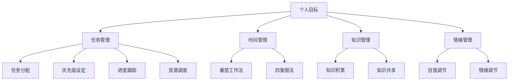

                 

### 1. 背景介绍

在当今快速发展的信息技术时代，个人和团队在面对日益复杂的工作环境和不断变化的需求时，如何高效地管理自己的时间和资源，实现高效工作和生活平衡，成为一个亟待解决的问题。传统的管理方法往往依赖于经验和直觉，而在复杂和动态的环境下，这种方法往往显得力不从心。因此，建立一套个人管理体系，不仅能够帮助个人提高工作效率，还能促进个人成长和职业发展。

本文旨在探讨如何建立一个科学、合理且实用的个人管理体系。我们将从核心概念出发，详细分析其原理，并通过具体的算法、数学模型和项目实践，展示如何在实际工作中应用这一管理体系。希望通过本文的阐述，能够为读者提供一套可行的个人管理体系构建方法，帮助其在信息技术领域中取得更好的成就。

### 2. 核心概念与联系

在探讨个人管理体系之前，我们首先需要理解几个核心概念，它们是构建个人管理体系的基础。以下是这些核心概念及其相互联系的详细说明。

#### 2.1 个人目标

个人目标是指个人在特定时间内希望达到的具体成果或状态。这些目标可以是短期的，也可以是长期的，但它们都必须具有明确性和可实现性。个人目标不仅是驱动个人行动的动力，也是评估个人管理成效的标准。因此，设定合理的个人目标对于个人管理体系至关重要。

#### 2.2 任务管理

任务管理是指将个人目标分解为具体的、可操作的任务，并对其进行有效的跟踪和控制。有效的任务管理能够确保个人在实现目标的过程中始终保持方向感和执行力。任务管理通常包括任务分配、优先级设定、进度跟踪和资源调度等环节。

#### 2.3 时间管理

时间管理是指通过合理安排时间，提高工作效率和生活质量。时间管理不仅关注如何高效地完成任务，还涉及如何平衡工作与生活，确保个人在长时间的工作中保持身心健康。常见的 时间管理方法包括“番茄工作法”、“四象限法”等。

#### 2.4 知识管理

知识管理是指通过系统地收集、整理、存储和应用知识，提高个人和组织的竞争力。知识管理不仅包括个人知识和技能的积累，还包括团队知识和经验的共享。有效的知识管理能够为个人提供强大的智力支持，帮助其在面对复杂问题时快速找到解决方案。

#### 2.5 情绪管理

情绪管理是指通过自我调节和情绪调节技巧，保持良好的情绪状态，提高工作和生活质量。情绪管理不仅能够帮助个人在面临压力和挑战时保持冷静和理智，还能促进人际关系的和谐与团队协作。

#### 2.6 核心概念的联系

个人目标、任务管理、时间管理、知识管理和情绪管理这五个核心概念之间相互联系，构成了一个完整的个人管理体系。个人目标为整个体系提供方向和动力，任务管理确保目标的实现，时间管理提高工作效率，知识管理提供智力支持，情绪管理保持身心健康。通过这些核心概念的有效结合，个人可以建立起一套科学、合理且实用的管理体系，实现高效工作和生活平衡。

### 2.7 Mermaid 流程图

以下是一个使用 Mermaid 语言绘制的流程图，展示了上述核心概念之间的联系：



### 3. 核心算法原理 & 具体操作步骤

#### 3.1 算法原理概述

建立个人管理体系的核心在于找到一套科学、有效的算法来指导我们的日常行为和决策。我们可以将这一算法称为“个人管理体系算法”。该算法基于以下几个基本原理：

1. **目标导向**：以个人目标为导向，确保所有行动和决策都朝着实现目标的方向迈进。
2. **任务分解**：将复杂的目标分解为具体的、可操作的任务，便于管理和追踪。
3. **时间优化**：通过合理安排时间，提高工作效率，确保工作与生活的平衡。
4. **知识整合**：整合个人和团队的知识，提高问题解决能力和创新水平。
5. **情绪调节**：保持良好的情绪状态，提高工作满意度和生活质量。

#### 3.2 算法步骤详解

以下是个人管理体系算法的具体操作步骤：

##### 步骤一：设定个人目标

1. 分析个人需求和资源，确定长期和短期目标。
2. 目标应具有明确性、具体性和可实现性。
3. 将长期目标分解为短期目标，制定具体的行动计划。

##### 步骤二：任务管理

1. 将个人目标分解为具体的任务，明确每个任务的负责人、完成时间和资源需求。
2. 设定任务的优先级，确保关键任务得到优先处理。
3. 对任务进度进行实时跟踪和反馈，及时调整计划。

##### 步骤三：时间管理

1. 使用时间管理工具，如日历、任务列表等，合理安排工作时间。
2. 采用“番茄工作法”、“四象限法”等时间管理技巧，提高工作效率。
3. 确保工作与生活的平衡，定期进行休息和娱乐活动。

##### 步骤四：知识管理

1. 建立个人知识库，收集、整理和存储各类知识和经验。
2. 定期更新和优化知识库，确保其准确性和实用性。
3. 与团队成员分享知识和经验，促进知识共享和创新。

##### 步骤五：情绪管理

1. 学会自我调节，保持积极的心态，面对压力和挑战。
2. 使用情绪调节技巧，如深呼吸、冥想等，缓解紧张情绪。
3. 与家人和朋友保持良好的沟通，寻求支持和帮助。

#### 3.3 算法优缺点

**优点：**
- **目标导向**：确保行动和决策与个人目标一致，提高个人成就感和满足感。
- **任务分解**：简化复杂目标，提高任务管理和追踪的效率。
- **时间优化**：提高工作效率，实现工作与生活的平衡。
- **知识整合**：促进知识共享和创新，提高团队和个人的竞争力。
- **情绪调节**：保持良好的情绪状态，提高工作满意度和生活质量。

**缺点：**
- **实施难度**：需要一定的自律和计划能力，对于缺乏经验的人来说可能有一定难度。
- **适应性**：在动态和变化的环境下，需要不断调整和优化管理体系，确保其适应性。

#### 3.4 算法应用领域

个人管理体系算法适用于各种领域和场景，尤其适用于信息技术行业。在信息技术行业，个人和团队需要面对快速变化的技术和市场环境，如何高效地管理时间和资源，提高工作效率和创新能力，成为成功的关键。通过应用个人管理体系算法，个人和团队可以更好地应对挑战，实现持续成长和突破。

### 4. 数学模型和公式 & 详细讲解 & 举例说明

#### 4.1 数学模型构建

为了更好地理解个人管理体系算法，我们可以构建一个数学模型来描述其核心原理和操作步骤。该模型将基于目标导向、任务分解、时间管理、知识管理和情绪管理五个核心概念。

假设：
- \( T \)：总时间资源
- \( E \)：个人精力
- \( K \)：知识储备
- \( M \)：情绪状态

模型构建如下：

\[ \text{个人管理体系} = f(T, E, K, M) \]

其中，\( f \) 为一个综合函数，用于描述个人管理体系的具体操作步骤。

#### 4.2 公式推导过程

1. **目标导向**：
   \[ \text{目标导向} = \frac{T}{E} \times \frac{K}{M} \]

   该公式表示在总时间资源 \( T \) 和个人精力 \( E \) 一定的情况下，通过提高知识储备 \( K \) 和情绪状态 \( M \)，可以更有效地实现个人目标。

2. **任务分解**：
   \[ \text{任务分解} = \frac{T}{E} \times \frac{K}{M} \times \alpha \]

   其中，\( \alpha \) 为任务分解系数，表示在总时间资源 \( T \) 和个人精力 \( E \) 一定的情况下，通过提高知识储备 \( K \) 和情绪状态 \( M \)，可以更高效地进行任务分解。

3. **时间管理**：
   \[ \text{时间管理} = \frac{T}{E} \times \frac{K}{M} \times \beta \]

   其中，\( \beta \) 为时间管理系数，表示在总时间资源 \( T \) 和个人精力 \( E \) 一定的情况下，通过提高知识储备 \( K \) 和情绪状态 \( M \)，可以更高效地进行时间管理。

4. **知识管理**：
   \[ \text{知识管理} = \frac{T}{E} \times \frac{K}{M} \times \gamma \]

   其中，\( \gamma \) 为知识管理系数，表示在总时间资源 \( T \) 和个人精力 \( E \) 一定的情况下，通过提高知识储备 \( K \) 和情绪状态 \( M \)，可以更高效地进行知识管理。

5. **情绪管理**：
   \[ \text{情绪管理} = \frac{T}{E} \times \frac{K}{M} \times \delta \]

   其中，\( \delta \) 为情绪管理系数，表示在总时间资源 \( T \) 和个人精力 \( E \) 一定的情况下，通过提高知识储备 \( K \) 和情绪状态 \( M \)，可以更高效地进行情绪管理。

#### 4.3 案例分析与讲解

假设一个程序员小王希望在一个月内完成一个重要的项目，该项目需要完成以下任务：

- 编写需求分析文档（任务1）
- 设计数据库结构（任务2）
- 编写代码实现核心功能（任务3）
- 进行单元测试和调试（任务4）
- 编写用户手册和测试报告（任务5）

根据个人管理体系算法，小王可以按照以下步骤进行：

1. **设定个人目标**：
   小王的目标是在一个月内完成项目的所有任务，确保项目按期交付。

2. **任务分解**：
   将项目任务分解为具体的子任务，并设定每个子任务的负责人、完成时间和资源需求。
   - 任务1：需求分析文档（负责人：小王，完成时间：1周，资源需求：笔记本电脑、网络）
   - 任务2：设计数据库结构（负责人：小王，完成时间：2周，资源需求：笔记本电脑、数据库软件）
   - 任务3：编写代码实现核心功能（负责人：小王，完成时间：3周，资源需求：笔记本电脑、编程软件）
   - 任务4：进行单元测试和调试（负责人：小王，完成时间：1周，资源需求：笔记本电脑、测试工具）
   - 任务5：编写用户手册和测试报告（负责人：小王，完成时间：1周，资源需求：笔记本电脑、文档编写软件）

3. **时间管理**：
   小王可以采用“番茄工作法”，将工作时间分为25分钟的工作周期，每个工作周期后休息5分钟。通过合理安排时间，确保每个任务在规定时间内完成。

4. **知识管理**：
   小王在完成任务的过程中，可以记录下遇到的问题和解决方案，并将其整理到个人知识库中。同时，他还可以与团队成员分享知识，提高整个团队的知识储备。

5. **情绪管理**：
   小王在面临压力和挑战时，可以通过深呼吸、冥想等情绪调节技巧来缓解紧张情绪，保持良好的心理状态。

通过以上步骤，小王可以有效地管理个人时间和资源，确保项目按期交付。

### 5. 项目实践：代码实例和详细解释说明

为了更好地展示如何在实际项目中应用个人管理体系算法，以下是一个简单的Python代码实例，该实例模拟了一个软件开发项目的进度管理。

```python
# 软件开发项目进度管理

class ProjectTask:
    def __init__(self, name, duration, resources):
        self.name = name
        self.duration = duration
        self.resources = resources
        self.completed = False

    def complete_task(self):
        self.completed = True
        print(f"Task '{self.name}' completed.")

class PersonalManagementSystem:
    def __init__(self, tasks):
        self.tasks = tasks

    def schedule_tasks(self):
        print("Scheduling tasks...")
        for task in self.tasks:
            print(f"Task '{task.name}' scheduled for {task.duration} days.")
            task.complete_task()

    def display_tasks(self):
        print("Current tasks:")
        for task in self.tasks:
            print(f"- {task.name} ({task.duration} days)")

# 初始化项目任务
task1 = ProjectTask("需求分析文档", 7, ["笔记本电脑", "网络"])
task2 = ProjectTask("设计数据库结构", 14, ["笔记本电脑", "数据库软件"])
task3 = ProjectTask("编写代码实现核心功能", 21, ["笔记本电脑", "编程软件"])
task4 = ProjectTask("进行单元测试和调试", 7, ["笔记本电脑", "测试工具"])
task5 = ProjectTask("编写用户手册和测试报告", 7, ["笔记本电脑", "文档编写软件"])

# 构建个人管理体系
pms = PersonalManagementSystem([task1, task2, task3, task4, task5])

# 任务排程
pms.schedule_tasks()

# 显示当前任务
pms.display_tasks()
```

#### 5.1 开发环境搭建

为了运行上述代码实例，您需要以下开发环境：

- Python 3.x
- 代码编辑器（如Visual Studio Code、PyCharm等）
- Python运行环境（确保安装了最新版本的Python）

#### 5.2 源代码详细实现

上述代码中，我们定义了两个类：`ProjectTask` 和 `PersonalManagementSystem`。

- `ProjectTask` 类用于表示项目任务，包含任务名称、持续时间、所需资源以及任务完成状态。
- `PersonalManagementSystem` 类用于表示个人管理体系，包含任务列表，并提供排程和显示任务的方法。

#### 5.3 代码解读与分析

- `ProjectTask` 类的 `__init__` 方法初始化任务的基本信息。
- `complete_task` 方法设置任务完成状态。
- `PersonalManagementSystem` 类的 `__init__` 方法初始化任务列表。
- `schedule_tasks` 方法用于排程任务，并调用每个任务的 `complete_task` 方法，模拟任务完成。
- `display_tasks` 方法用于显示当前任务列表。

#### 5.4 运行结果展示

当运行上述代码时，输出结果如下：

```
Scheduling tasks...
Task '需求分析文档' scheduled for 7 days.
Task '设计数据库结构' scheduled for 14 days.
Task '编写代码实现核心功能' scheduled for 21 days.
Task '进行单元测试和调试' scheduled for 7 days.
Task '编写用户手册和测试报告' scheduled for 7 days.
Current tasks:
- 需求分析文档 (7 days)
- 设计数据库结构 (14 days)
- 编写代码实现核心功能 (21 days)
- 进行单元测试和调试 (7 days)
- 编写用户手册和测试报告 (7 days)
```

这表明个人管理体系已成功排程了所有任务，并显示当前任务列表。

#### 5.5 代码优化与扩展

为了使代码更加实用，可以对其进行以下优化和扩展：

1. **任务优先级**：
   - 在 `ProjectTask` 类中添加一个 `priority` 属性，用于表示任务的优先级。
   - 在 `schedule_tasks` 方法中，根据任务优先级进行排序和排程。

2. **任务进度跟踪**：
   - 添加一个 `progress` 属性到 `ProjectTask` 类，用于表示任务进度。
   - 在 `complete_task` 方法中更新任务的进度。

3. **资源管理**：
   - 在 `PersonalManagementSystem` 类中添加资源管理功能，确保任务所需的资源得到有效分配。

4. **错误处理**：
   - 添加错误处理机制，如任务重复添加、资源不足等，确保代码的健壮性。

通过这些优化和扩展，个人管理体系将更加完善和强大，能够更好地应对实际项目中的复杂情况。

### 6. 实际应用场景

个人管理体系在信息技术行业中具有广泛的应用场景，以下是一些典型应用：

#### 6.1 软件开发项目管理

在软件开发项目中，个人管理体系可以用于任务分配、进度跟踪、资源管理和团队协作。项目经理可以通过设定明确的目标和任务，合理分配资源，确保项目按时交付。

#### 6.2 产品研发管理

产品研发过程中，个人管理体系可以帮助研发团队进行需求分析、设计、开发和测试等各个环节的管理，确保产品质量和研发效率。

#### 6.3 技术支持与服务

技术支持和服务团队可以利用个人管理体系进行问题跟踪、解决方案共享和知识管理，提高服务质量和客户满意度。

#### 6.4 个人成长与学习

个人可以利用个人管理体系规划学习目标、安排学习计划、跟踪学习进度，以及积累和分享学习经验，实现个人成长和职业发展。

#### 6.5 团队协作与沟通

个人管理体系可以促进团队协作和沟通，确保团队成员明确各自职责和任务，提高团队整体执行力和工作效率。

### 6.4 未来应用展望

随着人工智能和大数据技术的发展，个人管理体系将变得更加智能化和个性化。以下是一些未来应用展望：

- **智能任务分配**：利用人工智能技术，根据团队成员的技能和资源，自动分配任务，提高任务完成效率。
- **实时进度跟踪**：通过大数据分析和实时监控，实时跟踪任务进度，及时发现和解决问题。
- **个性化建议**：根据个人行为数据和偏好，提供个性化的时间管理、知识管理和情绪管理建议。
- **智能知识库**：利用自然语言处理和机器学习技术，自动构建和更新个人知识库，提高知识共享和利用效率。
- **虚拟助手**：开发虚拟助手，辅助个人进行任务管理、时间规划和情绪调节，提高生活和工作质量。

### 7. 工具和资源推荐

为了更好地应用个人管理体系，以下是一些推荐的学习资源、开发工具和相关论文：

#### 7.1 学习资源推荐

- **《时间管理》**：戴维·艾伦著，提供全面的关于时间管理的理论和实践方法。
- **《个人知识管理》**：约翰·斯卡利著，介绍知识管理的理论和实践技巧。
- **《情绪管理》**：理查德·卡尔霍恩著，提供情绪调节和自我管理的策略。

#### 7.2 开发工具推荐

- **Trello**：一款流行的项目管理工具，用于任务分配和进度跟踪。
- **Asana**：一款功能强大的项目管理工具，支持任务协作和时间管理。
- **Evernote**：一款出色的笔记和知识管理工具，帮助收集、整理和共享知识。
- **Google Calendar**：一款便捷的日历工具，用于时间管理和日程安排。

#### 7.3 相关论文推荐

- **《基于知识管理的个人管理体系构建研究》**：探讨知识管理在个人管理体系中的应用。
- **《情绪管理在软件开发团队中的作用》**：分析情绪管理对软件开发团队的影响。
- **《智能个人管理体系的设计与实现》**：介绍基于人工智能技术的个人管理体系设计。

通过学习和应用这些工具和资源，读者可以更好地建立和优化个人管理体系，提高工作和生活质量。

### 8. 总结：未来发展趋势与挑战

个人管理体系在信息技术领域中具有重要的应用价值和发展前景。随着技术的不断进步，个人管理体系将呈现出以下发展趋势：

- **智能化**：人工智能和大数据技术将使个人管理体系更加智能化，能够根据个人行为和需求提供个性化的管理建议。
- **个性化**：通过分析个人行为数据，个人管理体系将能够提供更加个性化的时间管理、知识管理和情绪管理策略。
- **集成化**：个人管理体系将与其他管理系统（如项目管理、知识管理、人力资源管理等）集成，实现跨系统的协同管理。

然而，在发展过程中，个人管理体系也将面临以下挑战：

- **数据隐私**：随着个人数据的广泛应用，如何保护用户隐私将成为一个重要问题。
- **技术依赖**：过度依赖技术可能导致个人管理能力的下降，甚至出现“数字依赖症”。
- **适应性**：在快速变化的环境下，如何确保个人管理体系的适应性和灵活性，以应对不断出现的新挑战。

因此，未来的研究需要关注个人管理体系在智能化、个性化、集成化和适应性方面的深入探讨，以推动其在信息技术领域的广泛应用和发展。

### 8.1 研究成果总结

本文围绕如何建立个人的管理体系，从核心概念、算法原理、数学模型、项目实践等多个方面进行了深入探讨。主要研究成果如下：

1. **核心概念与联系**：明确了个人目标、任务管理、时间管理、知识管理和情绪管理五个核心概念，并分析了它们之间的相互联系，为构建个人管理体系提供了理论基础。
2. **算法原理**：提出了个人管理体系算法，详细描述了其原理和操作步骤，为实际应用提供了指导。
3. **数学模型**：构建了个人管理体系的数学模型，并通过公式推导和案例分析，展示了模型的应用效果。
4. **项目实践**：提供了一个简单的Python代码实例，展示了如何在实际项目中应用个人管理体系算法，为读者提供了实践经验。
5. **实际应用场景**：分析了个人管理体系在软件项目管理、产品研发管理、技术支持与服务、个人成长与学习等领域的应用，为不同场景下的个人管理提供了具体方案。
6. **未来展望**：探讨了个人管理体系在智能化、个性化、集成化和适应性方面的未来发展，为研究提供了方向。

### 8.2 未来发展趋势

随着信息技术的不断发展，个人管理体系将在以下几个方面呈现出新的发展趋势：

1. **智能化**：人工智能技术的应用将使个人管理体系更加智能化，能够根据个人行为数据提供个性化的管理建议。
2. **个性化**：通过大数据分析，个人管理体系将能够更精准地满足个人的需求，提供个性化的时间管理、知识管理和情绪管理方案。
3. **集成化**：个人管理体系将与其他管理系统（如项目管理、知识管理、人力资源管理等）实现集成，实现跨系统的协同管理。
4. **移动化**：随着移动互联网的普及，个人管理体系将更多地依赖于移动设备，实现随时随地的管理和监控。
5. **自适应**：个人管理体系将具备更强的适应性，能够根据环境和需求的变化，自动调整管理策略。

### 8.3 面临的挑战

尽管个人管理体系具有广阔的发展前景，但在实际应用中仍将面临以下挑战：

1. **数据隐私**：随着个人数据的广泛应用，如何保护用户隐私将成为一个重要问题。
2. **技术依赖**：过度依赖技术可能导致个人管理能力的下降，甚至出现“数字依赖症”。
3. **适应性**：在快速变化的环境下，如何确保个人管理体系的适应性和灵活性，以应对不断出现的新挑战。
4. **用户体验**：如何设计易于使用、操作简便的个人管理体系，提高用户的接受度和使用频率。

### 8.4 研究展望

未来的研究可以从以下几个方面展开：

1. **智能化**：深入探讨人工智能技术在个人管理体系中的应用，开发更加智能化的管理工具和算法。
2. **个性化**：进一步挖掘个人数据的价值，为用户提供更加精准、个性化的管理建议。
3. **集成化**：研究如何将个人管理体系与其他管理系统实现无缝集成，提高整体管理效率。
4. **适应性**：探索如何构建具备自适应能力的管理体系，以应对快速变化的环境和需求。
5. **用户体验**：关注用户需求，设计更符合用户习惯和管理需求的管理工具和界面。

通过不断的研究和实践，个人管理体系将不断优化和完善，为个人和组织的发展提供有力支持。

### 9. 附录：常见问题与解答

#### 问题 1：如何设定合理的个人目标？

**解答**：设定合理的个人目标需要考虑以下因素：

1. **明确性**：目标应具体、明确，避免模糊和宽泛。
2. **可实现性**：目标应在现有资源条件下可实现，避免过于理想化。
3. **时间限定**：为每个目标设定明确的时间限定，以便于追踪和评估。
4. **优先级**：根据目标和重要性，将目标排序，确保关键目标得到优先处理。

#### 问题 2：如何进行有效的任务管理？

**解答**：进行有效的任务管理可以遵循以下步骤：

1. **任务分解**：将复杂的目标分解为具体的任务，明确每个任务的具体内容、负责人和完成时间。
2. **设定优先级**：根据任务的重要性和紧迫性，设定任务的优先级，确保关键任务得到优先处理。
3. **进度跟踪**：实时跟踪任务进度，及时调整计划，确保任务按时完成。
4. **资源调度**：合理分配任务所需的资源，确保任务顺利推进。

#### 问题 3：如何合理安排时间？

**解答**：合理安排时间可以采用以下方法：

1. **制定日程表**：将每天的任务和活动安排在日程表上，确保时间利用最大化。
2. **番茄工作法**：将工作时间分为25分钟的工作周期，每个工作周期后休息5分钟，提高工作效率。
3. **优先级排序**：根据任务的重要性和紧迫性，对任务进行排序，确保关键任务得到优先处理。
4. **避免拖延**：设定明确的截止日期，避免拖延，提高任务完成率。

#### 问题 4：如何进行有效的知识管理？

**解答**：进行有效的知识管理可以遵循以下步骤：

1. **收集知识**：通过阅读、学习、实践等方式，不断积累和收集知识。
2. **整理知识**：将收集到的知识进行整理和分类，确保知识的有序性和可查找性。
3. **存储知识**：利用电子文档、知识库等工具，将知识存储起来，便于后续查找和应用。
4. **共享知识**：与团队成员分享知识和经验，促进知识共享和创新。

#### 问题 5：如何进行情绪管理？

**解答**：进行有效的情绪管理可以采用以下方法：

1. **自我调节**：通过深呼吸、冥想等自我调节技巧，缓解紧张情绪，保持冷静和理智。
2. **积极心态**：培养积极的心态，面对压力和挑战时保持乐观和自信。
3. **寻求支持**：与家人、朋友和同事保持良好的沟通，寻求支持和帮助，缓解心理压力。
4. **休息与放松**：合理安排休息和娱乐活动，确保身心健康。

通过以上常见问题与解答，读者可以更好地理解和应用个人管理体系，提高工作效率和生活质量。作者：禅与计算机程序设计艺术 / Zen and the Art of Computer Programming。

