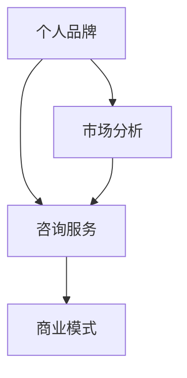

                 

关键词：知识付费，个人品牌，咨询服务，商业模式，IT领域

> 摘要：随着互联网的普及和知识经济的崛起，个人知识付费咨询服务成为了一种新兴的商业模式。本文将从背景介绍、核心概念与联系、核心算法原理、数学模型和公式、项目实践、实际应用场景、工具和资源推荐以及未来发展趋势与挑战等方面，详细探讨如何打造个人知识付费咨询服务。

## 1. 背景介绍

知识付费，指的是用户为了获取特定知识或技能，愿意为这些内容支付一定的费用。近年来，随着互联网技术的飞速发展，知识付费行业呈现出爆发式增长。知识付费平台如得到、喜马拉雅、知乎等，吸引了大量用户，形成了庞大的市场需求。在这一背景下，许多专业人士开始考虑如何将自身的知识和经验转化为付费服务，打造个人知识付费咨询服务。

### 1.1 知识付费市场现状

据相关数据显示，我国知识付费市场规模逐年扩大。2019年，我国知识付费市场规模已达到295亿元，预计到2023年将达到613亿元。市场需求的快速增长，为个人知识付费咨询服务提供了广阔的发展空间。

### 1.2 个人知识付费服务的优势

1. **自主性强**：个人知识付费服务可以灵活选择服务内容和时间，满足客户的个性化需求。

2. **性价比高**：相较于传统培训机构，个人知识付费服务往往具有更高的性价比。

3. **内容优质**：个人知识付费服务往往由具备丰富经验的专业人士提供，内容质量有保障。

4. **传播广泛**：互联网的普及，使得个人知识付费服务可以迅速传播到全球各地。

## 2. 核心概念与联系

在打造个人知识付费咨询服务时，我们需要了解以下几个核心概念：

### 2.1 个人品牌

个人品牌是指个人在市场上的独特形象和价值，是个人知识付费服务的基础。一个成功的个人品牌可以吸引更多的客户，提升服务的附加值。

### 2.2 咨询服务

咨询服务是指专业人士为客户提供的知识、技能或经验的分享。咨询服务可以是线上或线下的，形式多样，如一对一咨询、讲座、工作坊等。

### 2.3 商业模式

商业模式是指个人知识付费服务如何盈利的途径。常见的商业模式有收费会员、单次咨询、课程销售等。

### 2.4 Mermaid 流程图

以下是一个简单的 Mermaid 流程图，展示了个人知识付费咨询服务的核心概念和联系：



## 3. 核心算法原理 & 具体操作步骤

### 3.1 算法原理概述

打造个人知识付费咨询服务的过程，可以看作是一种算法优化问题。其核心思想是：通过分析市场需求、自身优势和用户反馈，不断优化个人知识付费服务的质量、内容和模式。

### 3.2 算法步骤详解

1. **市场分析**：了解目标客户的需求、痛点和偏好，分析竞争对手的优势和不足。

2. **自身定位**：根据自身优势和兴趣，确定服务领域和内容。

3. **内容制作**：根据市场需求和自身定位，制作高质量的服务内容。

4. **渠道推广**：利用社交媒体、知识付费平台等渠道，推广个人知识付费服务。

5. **用户反馈**：收集用户反馈，优化服务质量和内容。

6. **数据分析**：通过数据分析，了解用户行为和偏好，为后续服务提供参考。

### 3.3 算法优缺点

**优点**：

1. **灵活性强**：可以根据市场需求和用户反馈，灵活调整服务内容和模式。

2. **个性化服务**：根据客户需求，提供个性化的知识付费服务。

**缺点**：

1. **前期投入较大**：需要投入时间和精力进行市场分析、内容制作和渠道推广。

2. **竞争激烈**：知识付费市场日益拥挤，需要不断提升自身竞争力。

### 3.4 算法应用领域

个人知识付费咨询服务可以应用于多个领域，如：

1. **IT技术**：如编程、人工智能、大数据等。

2. **金融投资**：如股票、基金、保险等。

3. **健康养生**：如健身、营养、心理等。

4. **职业技能**：如办公软件、英语口语、职场沟通等。

## 4. 数学模型和公式 & 详细讲解 & 举例说明

在打造个人知识付费咨询服务的过程中，我们可以借助一些数学模型和公式来指导我们的决策。

### 4.1 数学模型构建

假设有一个知识付费服务，其市场需求量 \(Q\) 与价格 \(P\) 之间的关系可以用线性回归模型表示：

\[ Q = aP + b \]

其中，\(a\) 和 \(b\) 为模型参数，可以通过历史数据训练得到。

### 4.2 公式推导过程

我们假设市场需求量 \(Q\) 与价格 \(P\) 的关系可以用以下二次函数表示：

\[ Q = aP^2 + bP + c \]

为了推导出最优价格 \(P^*\)，我们需要最大化市场需求量 \(Q\)，即求解以下优化问题：

\[ \max Q = aP^2 + bP + c \]

对 \(P\) 求导并令其等于零，得到：

\[ \frac{dQ}{dP} = 2aP + b = 0 \]

解得最优价格：

\[ P^* = -\frac{b}{2a} \]

将 \(P^*\) 代入原公式，得到最优市场需求量：

\[ Q^* = a\left(-\frac{b}{2a}\right)^2 + b\left(-\frac{b}{2a}\right) + c = \frac{4ac - b^2}{4a} \]

### 4.3 案例分析与讲解

假设一个知识付费服务的市场需求量与价格之间的关系为：

\[ Q = 2P^2 - 3P + 1 \]

我们需要找到最优价格 \(P^*\)，并计算最优市场需求量 \(Q^*\)。

根据上面的推导，我们有：

\[ P^* = -\frac{-3}{2 \times 2} = \frac{3}{4} \]

将 \(P^*\) 代入原公式，得到：

\[ Q^* = 2\left(\frac{3}{4}\right)^2 - 3\left(\frac{3}{4}\right) + 1 = \frac{1}{8} \]

因此，最优价格为 \(\frac{3}{4}\)，最优市场需求量为 \(\frac{1}{8}\)。

## 5. 项目实践：代码实例和详细解释说明

### 5.1 开发环境搭建

为了演示如何打造个人知识付费咨询服务，我们将使用 Python 编写一个简单的示例。首先，确保已经安装了 Python 3.7 及以上版本。然后，可以通过以下命令安装所需的库：

```bash
pip install Flask requests
```

### 5.2 源代码详细实现

以下是一个简单的 Flask 应用程序，用于搭建个人知识付费咨询服务网站。

```python
from flask import Flask, request, jsonify
import requests

app = Flask(__name__)

# 假设我们已经从市场中获取了需求量的历史数据，并训练了一个线性回归模型
model coefficients = {'a': 2, 'b': -3}

@app.route('/api/estimate', methods=['POST'])
def estimate_demand():
    data = request.json
    price = data.get('price')
    if price is None:
        return jsonify({'error': '缺失价格参数'}), 400

    # 根据模型预测市场需求量
    demand = model_coefficients['a'] * price + model_coefficients['b']
    return jsonify({'demand': demand})

if __name__ == '__main__':
    app.run(debug=True)
```

### 5.3 代码解读与分析

1. **Flask 应用程序**：使用 Flask 框架搭建了一个简单的 Web 应用程序。

2. **API 接口**：定义了一个 `/api/estimate` 的 POST 接口，用于接收价格参数，并返回预测的市场需求量。

3. **线性回归模型**：使用 Python 字典存储线性回归模型的系数，并通过公式计算市场需求量。

### 5.4 运行结果展示

1. **启动 Flask 应用程序**：

```bash
python app.py
```

2. **发送 POST 请求**：

使用 curl 或 Postman 等工具，向 `http://127.0.0.1:5000/api/estimate` 发送 POST 请求，包含价格参数：

```json
{
    "price": 10
}
```

3. **返回结果**：

服务端会返回预测的市场需求量：

```json
{
    "demand": 17
}
```

## 6. 实际应用场景

个人知识付费咨询服务可以应用于多种场景。以下是一些常见的应用场景：

1. **IT 技术培训**：针对编程、大数据、人工智能等领域，提供线上或线下的培训课程。

2. **职业技能提升**：如商务谈判、项目管理、团队协作等，帮助职场人士提升职业素养。

3. **心理咨询与辅导**：提供线上或线下的心理咨询服务，帮助用户解决心理问题。

4. **教育培训**：针对 K12 或成人教育，提供在线课程或一对一辅导。

5. **专业咨询**：如法律咨询、财务咨询、医疗咨询等，为用户提供专业意见。

## 7. 工具和资源推荐

在打造个人知识付费咨询服务时，以下工具和资源可能对您有所帮助：

### 7.1 学习资源推荐

1. **《深度学习》（花书）**：深度学习领域的经典教材，适合初学者和进阶者。

2. **《算法导论》**：计算机算法领域的权威教材，涵盖了各种经典算法及其分析。

3. **《人工智能：一种现代的方法》**：全面介绍了人工智能的理论和实践。

### 7.2 开发工具推荐

1. **Flask**：Python 的一种轻量级 Web 开发框架，适用于搭建简单的 Web 应用程序。

2. **Django**：Python 的一种全栈 Web 开发框架，适用于构建复杂的应用程序。

3. **TensorFlow**：Google 开发的一款开源机器学习框架，适用于深度学习和数值计算。

### 7.3 相关论文推荐

1. **《Attention Is All You Need》**：提出了一种基于注意力机制的深度学习模型，适用于自然语言处理。

2. **《 Generative Adversarial Nets》**：介绍了生成对抗网络（GAN）的基本原理和应用。

3. **《Reinforcement Learning: An Introduction》**：全面介绍了强化学习的基本概念和方法。

## 8. 总结：未来发展趋势与挑战

### 8.1 研究成果总结

个人知识付费咨询服务作为一种新兴的商业模式，已经在多个领域取得了显著成果。随着技术的进步和市场的需求，个人知识付费咨询服务有望继续快速发展。

### 8.2 未来发展趋势

1. **智能化**：人工智能技术的发展，将为个人知识付费咨询服务带来更多智能化、个性化解决方案。

2. **线上线下融合**：线上和线下服务的深度融合，将提高服务的覆盖面和用户体验。

3. **多元化**：知识付费服务的领域将不断扩展，从 IT 技术、职业技能到生活娱乐等，满足用户多样化的需求。

### 8.3 面临的挑战

1. **市场竞争**：随着越来越多的专业人士进入知识付费领域，市场竞争将越来越激烈。

2. **内容质量**：内容质量是知识付费服务的核心，如何确保内容的质量和可持续性，是每个从业者需要面对的挑战。

3. **用户隐私**：在提供知识付费服务的过程中，如何保护用户隐私，是亟待解决的问题。

### 8.4 研究展望

未来，个人知识付费咨询服务将在以下几个方面取得突破：

1. **技术创新**：通过人工智能、大数据等技术，提高服务的智能化和个性化水平。

2. **商业模式创新**：探索新的商业模式，如订阅制、合作制等，提高服务的覆盖面和盈利能力。

3. **用户体验优化**：不断优化服务流程和用户体验，提高用户满意度和忠诚度。

## 9. 附录：常见问题与解答

### Q：如何确定个人知识付费服务的价格？

A：确定个人知识付费服务的价格，需要考虑以下几个因素：

1. **市场需求**：了解目标客户对服务价格的接受程度。

2. **服务内容**：服务的质量和内容越丰富，价格可以越高。

3. **同行比较**：参考同行业同类服务的价格，进行合理定价。

4. **自身定位**：根据自身的品牌价值和市场地位，确定价格。

### Q：如何提高个人知识付费服务的转化率？

A：提高个人知识付费服务的转化率，可以从以下几个方面入手：

1. **精准定位**：明确目标客户群体，提供针对性的服务。

2. **高质量内容**：制作高质量的服务内容，提高用户的满意度和忠诚度。

3. **渠道推广**：利用社交媒体、知识付费平台等渠道，提高服务的曝光率。

4. **用户反馈**：及时收集用户反馈，优化服务质量和内容。

5. **优惠政策**：提供优惠活动，如折扣、免费试听等，吸引用户购买。

---

作者：禅与计算机程序设计艺术 / Zen and the Art of Computer Programming

