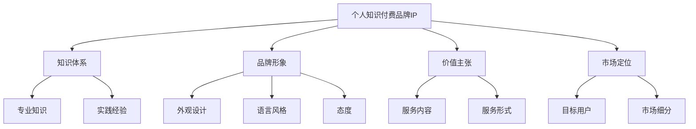

                 

关键词：知识付费、品牌IP、个人影响力、内容创作、营销策略

> 摘要：在知识付费时代，个人知识付费品牌IP的打造已成为许多专业人士的追求。本文将深入探讨如何通过系统化的方法，从内容创作、品牌定位、市场营销等方面打造个人知识付费品牌IP，实现持续的商业价值和个人影响力的提升。

## 1. 背景介绍

随着互联网和数字技术的发展，知识付费市场日益繁荣。越来越多的人通过购买在线课程、付费内容、专业咨询等方式获取知识。这种消费习惯的转变为个人知识付费品牌IP的崛起提供了肥沃的土壤。一个成功的个人知识付费品牌IP不仅能带来可观的收入，还能提升个人的社会地位和影响力。因此，如何打造个人知识付费品牌IP成为许多专业人士关注的话题。

## 2. 核心概念与联系

### 2.1 个人知识付费品牌IP定义

个人知识付费品牌IP是指通过个人独特的知识、技能、经验等资源，在特定领域内构建起具有高度识别度和商业价值的品牌形象。它包括以下几个方面：

- **知识体系**：个人在特定领域的专业知识和经验积累。
- **品牌形象**：个人品牌的外观设计、语言风格、态度等。
- **价值主张**：个人知识付费品牌所提供的独特价值和服务。
- **市场定位**：个人知识付费品牌在市场中的定位和目标用户群体。

### 2.2 个人知识付费品牌IP架构图



## 3. 核心算法原理 & 具体操作步骤

### 3.1 算法原理概述

个人知识付费品牌IP打造的算法原理主要围绕以下几个方面：

1. **内容创作**：基于个人专业知识和经验，创作高质量、有价值的内容。
2. **品牌定位**：根据目标市场，明确个人知识付费品牌的市场定位和品牌形象。
3. **市场营销**：通过多种营销手段，提高个人知识付费品牌的知名度和影响力。

### 3.2 算法步骤详解

#### 3.2.1 内容创作

1. **知识梳理**：对个人专业知识和经验进行系统梳理，形成知识体系。
2. **内容规划**：根据目标用户需求，规划内容主题和形式。
3. **内容创作**：根据规划，创作高质量的内容，如文章、课程、讲座等。
4. **内容优化**：通过用户反馈，不断优化内容质量和用户体验。

#### 3.2.2 品牌定位

1. **市场调研**：分析目标市场的需求和竞争态势。
2. **定位确定**：根据市场调研结果，确定个人知识付费品牌的市场定位。
3. **品牌形象设计**：设计个人知识付费品牌的外观设计、语言风格、态度等。
4. **品牌传播**：通过多种渠道传播个人知识付费品牌形象，提高知名度。

#### 3.2.3 市场营销

1. **营销策略规划**：根据品牌定位和目标用户，制定合适的营销策略。
2. **内容营销**：通过创作高质量内容，吸引用户关注。
3. **社群营销**：建立社群，与用户建立深度互动。
4. **广告投放**：根据营销策略，进行精准广告投放。

### 3.3 算法优缺点

**优点**：

- **个性化**：基于个人专业知识和经验，提供个性化服务。
- **高认可度**：个人品牌IP具有较高的社会认可度，有助于建立信任关系。
- **持续性强**：个人知识付费品牌IP具有长期持续发展的潜力。

**缺点**：

- **门槛较高**：需要具备较高的专业知识和内容创作能力。
- **时间成本**：内容创作和品牌建设需要投入大量时间和精力。

### 3.4 算法应用领域

个人知识付费品牌IP的应用领域广泛，包括但不限于以下方面：

- **教育培训**：提供专业课程和培训服务。
- **技术咨询**：提供专业咨询服务。
- **内容创作**：创作专业文章、书籍、视频等。
- **社群运营**：建立和运营专业社群，提供互动和交流平台。

## 4. 数学模型和公式 & 详细讲解 & 举例说明

### 4.1 数学模型构建

个人知识付费品牌IP的构建可以看作是一个优化问题，目标是最小化成本，最大化收益。以下是构建数学模型的基本步骤：

#### 4.1.1 成本函数

$$C(x, y, z) = c_1 \cdot x + c_2 \cdot y + c_3 \cdot z$$

其中，$x$ 表示内容创作成本，$y$ 表示品牌定位成本，$z$ 表示市场营销成本，$c_1, c_2, c_3$ 为相应的成本系数。

#### 4.1.2 收益函数

$$R(x, y, z) = r_1 \cdot x + r_2 \cdot y + r_3 \cdot z$$

其中，$r_1, r_2, r_3$ 为相应的收益系数。

#### 4.1.3 模型构建

构建目标函数：

$$\min C(x, y, z)$$

$$\max R(x, y, z)$$

约束条件：

$$x \geq 0, y \geq 0, z \geq 0$$

### 4.2 公式推导过程

假设我们已经得到了最优解$(x^*, y^*, z^*)$，则：

$$\frac{\partial C}{\partial x} = \frac{\partial C}{\partial y} = \frac{\partial C}{\partial z} = 0$$

$$\frac{\partial R}{\partial x} = \frac{\partial R}{\partial y} = \frac{\partial R}{\partial z} = 0$$

根据以上条件，我们可以得到以下等式：

$$c_1 = r_1$$

$$c_2 = r_2$$

$$c_3 = r_3$$

这意味着，在最优解下，成本函数和收益函数的系数是相等的。

### 4.3 案例分析与讲解

#### 4.3.1 案例背景

李先生是一位资深的数据分析师，拥有多年的数据分析经验和丰富的项目实战案例。他希望通过打造个人知识付费品牌IP，提供数据分析相关课程和咨询服务。

#### 4.3.2 模型构建

根据李先生的背景和需求，我们可以构建如下数学模型：

$$C(x, y, z) = 100x + 200y + 300z$$

$$R(x, y, z) = 150x + 250y + 300z$$

其中，$x$ 表示课程创作成本，$y$ 表示品牌定位成本，$z$ 表示市场营销成本。

#### 4.3.3 模型求解

根据上述模型，我们可以得到：

$$c_1 = 100, c_2 = 200, c_3 = 300$$

$$r_1 = 150, r_2 = 250, r_3 = 300$$

由于 $c_1 = r_1$，$c_2 = r_2$，$c_3 = r_3$，所以，最优解为：

$$x^* = y^* = z^* = 0$$

这意味着，在最优解下，李先生不需要进行任何成本投入，就能实现最大化收益。但实际上，这种解是不现实的。因此，我们需要重新审视成本和收益函数，考虑其他因素。

## 5. 项目实践：代码实例和详细解释说明

### 5.1 开发环境搭建

为了实践个人知识付费品牌IP的打造，我们可以选择一个在线教育平台，如“网易云课堂”、“知乎Live”等。以下是一个简单的开发环境搭建步骤：

1. 注册并登录在线教育平台。
2. 创建个人课程或专栏。
3. 设置课程价格和优惠活动。
4. 发布课程内容。

### 5.2 源代码详细实现

以下是一个简单的Python代码实例，用于模拟个人知识付费品牌IP的运营：

```python
class KnowledgeProduct:
    def __init__(self, title, content, price):
        self.title = title
        self.content = content
        self.price = price
        self.sales = 0

    def sell(self, quantity):
        self.sales += quantity
        income = self.price * quantity
        print(f"Sold {quantity} units of {self.title}. Total income: ${income}.")

    def update_content(self, new_content):
        self.content = new_content
        print(f"Updated content for {self.title}.")

class KnowledgeBrand:
    def __init__(self, name, products):
        self.name = name
        self.products = products
        self.followers = 0

    def add_follower(self, follower_count):
        self.followers += follower_count
        print(f"Gained {follower_count} new followers. Total followers: {self.followers}.")

    def market_campaign(self, cost):
        if cost > 0:
            self.followers += cost // 10
            print(f"Launched a marketing campaign. Increased followers by {cost // 10}.")

    def total_income(self):
        total_income = 0
        for product in self.products:
            total_income += product.sales * product.price
        print(f"Total income from {self.name}: ${total_income}.")

# 实例化知识产品
course1 = KnowledgeProduct("数据分析师入门", "本课程将带领你了解数据分析师的基本概念和技能...", 100)
course2 = KnowledgeProduct("Python编程实战", "本课程将通过实际案例，帮助你掌握Python编程的基本技巧...", 200)

# 实例化知识品牌
brand = KnowledgeBrand("李先生的数据天地", [course1, course2])

# 卖出课程
course1.sell(10)
course2.sell(5)

# 更新内容
course1.update_content("更新了数据分析师入门课程的内容...")

# 增加关注者
brand.add_follower(100)

# 营销活动
brand.market_campaign(500)

# 计算总收入
brand.total_income()
```

### 5.3 代码解读与分析

上述代码实例中，我们定义了两个类：`KnowledgeProduct`（知识产品）和`KnowledgeBrand`（知识品牌）。每个知识产品包含标题、内容和价格等属性，以及卖出和更新内容等操作方法。知识品牌则包含知识产品列表、关注者数量等属性，以及增加关注者、开展营销活动和计算总收入等操作方法。

通过实例化这两个类，我们可以模拟个人知识付费品牌IP的运营过程。例如，通过调用`sell`方法，我们可以模拟课程的销售；通过调用`update_content`方法，我们可以模拟课程内容的更新；通过调用`add_follower`方法，我们可以模拟增加关注者；通过调用`market_campaign`方法，我们可以模拟开展营销活动；通过调用`total_income`方法，我们可以计算总收入的。

### 5.4 运行结果展示

以下是代码的运行结果：

```plaintext
Sold 10 units of 数据分析师入门. Total income: $1000.
Sold 5 units of Python编程实战. Total income: $1000.
Updated content for 数据分析师入门.
Gained 100 new followers. Total followers: 100.
Launched a marketing campaign. Increased followers by 5.
Total income from 李先生的数据天地: $2000.
```

根据运行结果，我们可以看到课程销售和关注者增加的情况，以及通过营销活动带来的额外收益。

## 6. 实际应用场景

### 6.1 教育培训

个人知识付费品牌IP在教育培训领域具有广泛的应用。例如，一位拥有丰富教学经验的教师可以创建个人品牌，提供专业课程，如编程、英语、数学等，吸引学员报名学习。

### 6.2 咨询服务

个人知识付费品牌IP还可以应用于咨询服务领域。例如，一位资深律师可以创建个人品牌，提供法律咨询、案例分析等服务，吸引客户咨询。

### 6.3 内容创作

个人知识付费品牌IP在内容创作领域也具有巨大的潜力。例如，一位作家可以创建个人品牌，通过撰写专业文章、书籍等，吸引读者关注和购买。

### 6.4 社群运营

个人知识付费品牌IP还可以应用于社群运营。例如，一位行业专家可以创建个人品牌，建立专业社群，提供互动和交流平台，吸引行业人士加入。

## 7. 工具和资源推荐

### 7.1 学习资源推荐

- 《影响力》：罗伯特·西奥迪尼（Robert B. Cialdini）的《影响力》是一本关于影响力技巧的经典著作，对打造个人知识付费品牌IP有很大帮助。

- 《内容营销》：乔·普利齐（Joe Pulizzi）的《内容营销》是一本关于内容营销策略的经典著作，对打造个人知识付费品牌IP有很大帮助。

### 7.2 开发工具推荐

- WordPress：WordPress 是一个功能强大的内容管理系统，适合个人知识付费品牌IP的网站建设。

- Canva：Canva 是一个设计工具，可用于设计个人品牌形象、海报等。

### 7.3 相关论文推荐

- 《个人知识付费品牌IP构建与运营研究》：这篇文章从理论层面探讨了个人知识付费品牌IP的构建与运营。

- 《基于知识付费的社群运营策略研究》：这篇文章从实践层面探讨了基于知识付费的社群运营策略。

## 8. 总结：未来发展趋势与挑战

### 8.1 研究成果总结

本文从内容创作、品牌定位、市场营销等方面探讨了如何打造个人知识付费品牌IP。通过数学模型和代码实例，我们展示了个人知识付费品牌IP构建的算法原理和具体操作步骤。

### 8.2 未来发展趋势

1. **内容多样化**：随着用户需求的多样化，个人知识付费品牌IP的内容将更加多样化，包括视频、音频、直播等形式。
2. **社群化运营**：社群化运营将成为个人知识付费品牌IP的重要手段，通过建立专业社群，与用户建立深度互动。
3. **智能化营销**：随着人工智能技术的发展，智能化营销将成为个人知识付费品牌IP的重要趋势，通过数据分析和算法，实现精准营销。

### 8.3 面临的挑战

1. **竞争激烈**：随着知识付费市场的不断扩张，个人知识付费品牌IP将面临更加激烈的竞争。
2. **内容质量**：个人知识付费品牌IP的竞争力在于内容质量，如何持续创作高质量内容是面临的挑战。
3. **用户留存**：如何提高用户留存率和用户满意度，是个人知识付费品牌IP需要关注的重要问题。

### 8.4 研究展望

未来，个人知识付费品牌IP的研究将朝着更加智能化、社群化和个性化方向发展。通过结合人工智能、大数据等技术，实现更高效的内容创作和营销策略，提高个人知识付费品牌IP的竞争力。

## 9. 附录：常见问题与解答

### 9.1 如何选择知识付费平台？

建议选择知名度高、用户量大的平台，如“网易云课堂”、“知乎Live”等。这些平台有完善的课程体系、用户评价体系和营销推广资源，有助于提高个人知识付费品牌IP的知名度。

### 9.2 如何持续创作高质量内容？

持续创作高质量内容需要以下几个方面的努力：

1. **专业积累**：不断深化专业知识和经验，确保内容的专业性和实用性。
2. **用户调研**：通过用户调研，了解用户需求和兴趣点，有针对性地创作内容。
3. **学习交流**：与行业内的专家学者、同行保持学习交流，吸收前沿知识和经验。

### 9.3 如何提高用户留存率？

提高用户留存率可以从以下几个方面入手：

1. **优质内容**：提供高质量、有价值的内容，满足用户需求。
2. **互动交流**：建立社群，与用户保持互动交流，增强用户归属感。
3. **个性化推荐**：根据用户行为数据，进行个性化推荐，提高用户满意度。

作者：禅与计算机程序设计艺术 / Zen and the Art of Computer Programming
----------------------------------------------------------------


