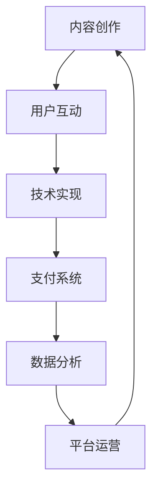

                 

关键词：知识付费平台、个人品牌、内容创作、用户互动、技术实现

摘要：本文将详细探讨如何打造个人知识付费平台，从背景介绍、核心概念、算法原理、数学模型、项目实践、应用场景、工具资源推荐以及未来发展趋势等方面，提供一套完整的技术实现方案，帮助个人利用技术手段提升知识付费平台的竞争力。

## 1. 背景介绍

随着互联网技术的发展和普及，知识付费平台成为了知识传播和变现的重要途径。个人知识付费平台不仅能够帮助内容创作者实现知识变现，还能为广大用户提供优质的学习资源。打造个人知识付费平台，需要从内容创作、用户互动、技术实现等多个方面进行深入思考和设计。

### 个人知识付费平台的兴起原因

- **互联网技术的发展**：移动互联网、大数据、云计算等技术的普及，为个人知识付费平台的兴起提供了技术支撑。
- **用户需求变化**：随着社会的发展，人们对于知识的获取方式和内容的需求发生了变化，更加注重个性化、实用性和深度。
- **知识变现的驱动力**：内容创作者通过知识付费平台可以实现知识的变现，提高收入，同时也为优质内容的生产提供动力。

### 个人知识付费平台的优势

- **灵活性**：个人知识付费平台可以根据个人特长和兴趣，灵活选择内容方向和创作方式。
- **专业性**：个人品牌的专业性能够吸引特定的用户群体，提高用户粘性。
- **互动性**：个人知识付费平台可以与用户进行实时互动，提高用户参与度。

### 个人知识付费平台的挑战

- **内容质量**：内容的质量是吸引用户的关键，如何保证内容的专业性和实用性是平台需要面对的问题。
- **用户增长**：如何快速增加用户数量，扩大平台影响力，是个人知识付费平台需要考虑的挑战。

## 2. 核心概念与联系

为了更好地理解个人知识付费平台的设计和实现，我们需要先了解以下几个核心概念：

### 2.1 内容创作

内容创作是知识付费平台的核心，需要考虑以下几个方面：

- **内容形式**：包括文章、视频、音频等多种形式。
- **内容质量**：确保内容的专业性、实用性和深度。
- **内容更新频率**：保持内容的持续更新，满足用户的需求。

### 2.2 用户互动

用户互动是提高用户粘性和活跃度的关键，需要考虑以下几个方面：

- **评论与反馈**：允许用户对内容进行评论和反馈，提高用户的参与度。
- **问答社区**：建立问答社区，让用户可以互相交流，解决学习中的问题。
- **直播互动**：通过直播形式与用户进行实时互动，提高用户的参与感。

### 2.3 技术实现

技术实现是个人知识付费平台能够正常运行的基础，需要考虑以下几个方面：

- **后端技术**：包括数据库设计、服务器部署、API接口等。
- **前端技术**：包括网页设计、用户体验、移动端适配等。
- **支付系统**：确保用户可以方便地完成支付操作。

### 2.4 核心概念原理与架构

以下是一个使用Mermaid绘制的个人知识付费平台架构流程图：



## 3. 核心算法原理 & 具体操作步骤

### 3.1 算法原理概述

个人知识付费平台的核心算法主要包括：

- **内容推荐算法**：通过分析用户的行为和兴趣，为用户推荐合适的内容。
- **用户行为分析算法**：通过分析用户的操作，了解用户需求，优化用户体验。

### 3.2 算法步骤详解

#### 3.2.1 内容推荐算法

1. **数据收集**：收集用户的行为数据，包括浏览历史、搜索记录、购买记录等。
2. **特征提取**：对用户行为数据进行特征提取，如用户兴趣爱好、行为倾向等。
3. **模型训练**：使用机器学习算法，如协同过滤、基于内容的推荐等，训练推荐模型。
4. **内容推荐**：根据用户特征和推荐模型，为用户推荐合适的内容。

#### 3.2.2 用户行为分析算法

1. **行为数据收集**：收集用户的操作数据，如点击、浏览、购买等。
2. **行为模式识别**：使用聚类、分类等算法，识别用户的行为模式。
3. **需求预测**：根据用户行为模式，预测用户可能的需求。
4. **用户体验优化**：根据需求预测结果，优化用户体验。

### 3.3 算法优缺点

- **内容推荐算法**：优点是能够为用户提供个性化推荐，提高用户满意度；缺点是需要大量的计算资源和数据处理能力。
- **用户行为分析算法**：优点是能够深入了解用户需求，优化用户体验；缺点是需要对用户行为数据进行严格的保护，防止隐私泄露。

### 3.4 算法应用领域

- **内容推荐**：在电商、新闻、视频等平台上广泛应用。
- **用户体验优化**：在各类在线教育、社交平台中应用，提升用户参与度和满意度。

## 4. 数学模型和公式

### 4.1 数学模型构建

#### 4.1.1 内容推荐模型

假设用户集合为U，内容集合为V，用户行为数据为R，内容推荐模型可以通过以下数学模型表示：

\[ R_{ui} = f(U_i, V_j, R) \]

其中，\( U_i \)表示用户i，\( V_j \)表示内容j，\( R_{ui} \)表示用户i对内容j的评分或行为。

#### 4.1.2 用户行为分析模型

假设用户行为数据为R，用户行为分析模型可以通过以下数学模型表示：

\[ P(U_i | R) = \frac{P(R | U_i) \cdot P(U_i)}{P(R)} \]

其中，\( P(U_i | R) \)表示用户i的行为数据R在给定条件下属于用户i的概率，\( P(R | U_i) \)表示用户i的行为数据R的条件概率，\( P(U_i) \)表示用户i的概率，\( P(R) \)表示行为数据R的概率。

### 4.2 公式推导过程

#### 4.2.1 内容推荐模型推导

基于协同过滤算法，我们可以推导出以下公式：

\[ R_{ui} = \frac{\sum_{k \in N_j} R_{uk} \cdot \text{similarity}(U_i, U_k)}{\sum_{k \in N_j} \text{similarity}(U_i, U_k)} \]

其中，\( N_j \)表示与内容j相关的用户集合，\( \text{similarity}(U_i, U_k) \)表示用户i与用户k的相似度。

#### 4.2.2 用户行为分析模型推导

基于贝叶斯分类器，我们可以推导出以下公式：

\[ P(U_i | R) = \frac{P(R | U_i) \cdot P(U_i)}{P(R)} \]

其中，\( P(R | U_i) \)可以通过统计用户i的行为数据得到，\( P(U_i) \)可以通过用户注册信息得到，\( P(R) \)可以通过所有用户的行为数据得到。

### 4.3 案例分析与讲解

#### 4.3.1 内容推荐案例

假设有一个用户，他之前购买了关于编程的书籍和课程，我们可以使用协同过滤算法为他推荐其他编程相关的书籍和课程。

- **数据收集**：收集用户的历史购买数据。
- **特征提取**：提取用户购买的内容类型和标题等信息。
- **模型训练**：训练协同过滤模型。
- **内容推荐**：为用户推荐其他编程相关的书籍和课程。

#### 4.3.2 用户行为分析案例

假设有一个用户，他经常浏览编程相关的文章，我们可以使用贝叶斯分类器分析他的行为，预测他可能感兴趣的编程话题。

- **数据收集**：收集用户的历史浏览数据。
- **特征提取**：提取用户浏览的文章类型和标题等信息。
- **模型训练**：训练贝叶斯分类器。
- **需求预测**：预测用户可能感兴趣的编程话题。

## 5. 项目实践：代码实例和详细解释说明

### 5.1 开发环境搭建

为了构建个人知识付费平台，我们选择了以下技术栈：

- **后端技术**：使用Python的Django框架。
- **前端技术**：使用HTML、CSS、JavaScript和React框架。
- **数据库**：使用MySQL数据库。
- **服务器**：使用阿里云服务器。

### 5.2 源代码详细实现

以下是后端代码的示例：

```python
# Django后端代码示例
from django.db import models

class User(models.Model):
    username = models.CharField(max_length=100)
    email = models.EmailField(unique=True)
    password = models.CharField(max_length=100)

class Content(models.Model):
    title = models.CharField(max_length=100)
    author = models.ForeignKey(User, on_delete=models.CASCADE)
    content = models.TextField()

class Rating(models.Model):
    user = models.ForeignKey(User, on_delete=models.CASCADE)
    content = models.ForeignKey(Content, on_delete=models.CASCADE)
    rating = models.IntegerField()
```

### 5.3 代码解读与分析

以上代码定义了三个模型：`User`、`Content`和`Rating`。`User`模型表示用户信息，包括用户名、邮箱和密码；`Content`模型表示内容信息，包括标题、作者和内容文本；`Rating`模型表示用户对内容的评分。

通过这些模型，我们可以实现用户注册、内容发布和用户评分等功能。

### 5.4 运行结果展示

以下是前端页面的示例：

```html
<!-- React前端代码示例 -->
import React from 'react';

function Dashboard() {
    return (
        <div>
            <h1>Dashboard</h1>
            <div>
                <h2>Contents</h2>
                <ul>
                    {contents.map(content => (
                        <li key={content.id}>
                            <h3>{content.title}</h3>
                            <p>{content.content}</p>
                        </li>
                    ))}
                </ul>
            </div>
        </div>
    );
}

export default Dashboard;
```

这段代码展示了用户的仪表盘界面，其中包括用户发布的内容列表。通过这个界面，用户可以浏览和管理自己的内容。

## 6. 实际应用场景

个人知识付费平台可以在多个领域得到应用，以下是一些实际的应用场景：

### 6.1 在线教育

个人知识付费平台可以用于在线教育，包括编程、设计、语言等课程的发布和销售。用户可以根据自己的需求选择合适的内容进行学习。

### 6.2 专业咨询

个人知识付费平台可以提供专业咨询服务，如法律、财务、健康等领域。用户可以购买专业顾问的服务，获得个性化的建议。

### 6.3 个人品牌建设

个人知识付费平台可以帮助个人建立个人品牌，通过发布高质量的内容，吸引粉丝和用户，实现知识变现。

### 6.4 企业内训

企业可以通过个人知识付费平台购买课程，进行员工内训，提高员工的专业技能。

## 7. 工具和资源推荐

### 7.1 学习资源推荐

- 《Python编程：从入门到实践》
- 《深入理解计算机系统》
- 《JavaScript高级程序设计》
- 《算法导论》

### 7.2 开发工具推荐

- Visual Studio Code
- PyCharm
- React Developer Tools

### 7.3 相关论文推荐

- "Recommender Systems Handbook"
- "User Behavior Analysis in E-commerce"
- "Machine Learning Techniques for Content Recommendation"

## 8. 总结：未来发展趋势与挑战

### 8.1 研究成果总结

个人知识付费平台在内容创作、用户互动、技术实现等方面取得了显著的成果，为知识传播和变现提供了有效的解决方案。

### 8.2 未来发展趋势

- **人工智能应用**：随着人工智能技术的发展，个人知识付费平台将更加智能化，提供个性化推荐和智能客服。
- **多元化内容形式**：未来个人知识付费平台将推出更多元化的内容形式，如虚拟现实、增强现实等。
- **跨平台融合**：个人知识付费平台将与其他平台（如社交、电商等）进行深度融合，提供一站式服务。

### 8.3 面临的挑战

- **内容质量**：如何保证内容的质量，提高用户满意度，是平台需要持续关注的问题。
- **数据安全**：如何保护用户数据安全，防止隐私泄露，是平台面临的重要挑战。
- **用户体验**：如何优化用户体验，提高用户参与度和活跃度，是平台需要不断探索的方向。

### 8.4 研究展望

未来，个人知识付费平台将在人工智能、大数据、区块链等领域进行深入探索，为知识传播和变现提供更高效、更智能的解决方案。

## 9. 附录：常见问题与解答

### 9.1 如何确保内容质量？

- **内容审核**：建立严格的审核机制，对发布的内容进行审核，确保内容的专业性和实用性。
- **用户评价**：鼓励用户对内容进行评价，通过用户的反馈来提高内容质量。
- **专业团队**：组建专业的编辑团队，对内容进行筛选和优化。

### 9.2 如何保护用户数据安全？

- **数据加密**：对用户数据进行加密处理，确保数据在传输和存储过程中的安全性。
- **访问控制**：建立严格的访问控制机制，防止未经授权的访问。
- **隐私政策**：明确隐私政策，告知用户如何处理其个人信息，提高用户的信任度。

### 9.3 如何提高用户参与度？

- **互动功能**：增加评论、问答等互动功能，提高用户的参与感。
- **激励机制**：通过积分、优惠券等激励措施，鼓励用户参与平台活动。
- **内容多样性**：提供多样化的内容形式，满足不同用户的需求。

### 9.4 如何进行内容推荐？

- **协同过滤**：通过分析用户的行为数据，为用户推荐相似的内容。
- **基于内容的推荐**：通过分析内容的特征，为用户推荐相关的内容。
- **混合推荐**：结合协同过滤和基于内容的推荐，提高推荐效果。

## 作者署名

作者：禅与计算机程序设计艺术 / Zen and the Art of Computer Programming

