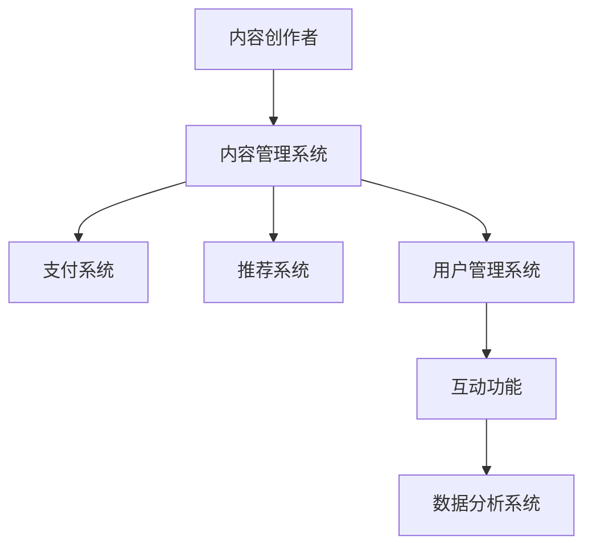

                 

 关键词：知识付费，个人品牌，平台搭建，用户体验，技术实现

> 摘要：本文将深入探讨如何打造一个成功的个人知识付费平台。我们将从背景介绍、核心概念、算法原理、数学模型、项目实践、实际应用、未来展望、工具推荐和总结等方面进行详细解析，帮助您理解并成功创建自己的知识付费平台。

## 1. 背景介绍

随着互联网技术的飞速发展，知识付费逐渐成为现代社会的一种重要现象。越来越多的人开始通过付费获取专业知识、技能培训和学习资源。知识付费平台应运而生，为用户提供高质量的知识内容，同时也为内容创作者提供了展示和变现的平台。

然而，打造一个成功的个人知识付费平台并非易事。首先，需要深入了解用户需求，提供有价值的内容；其次，要确保平台的稳定性、安全性和用户体验。本文将围绕这些关键点，详细阐述如何打造一个个人知识付费平台。

### 1.1 知识付费的现状

知识付费行业在近年来呈现出快速增长的趋势。根据相关报告显示，全球知识付费市场规模已达到数千亿美元。在中国，知识付费市场更是呈现出爆发式增长，用户数量和消费金额都在持续上升。

### 1.2 个人知识付费平台的挑战

个人知识付费平台在面临巨大市场机遇的同时，也面临着诸多挑战：

- **内容质量**：如何确保提供的内容有价值，能够满足用户需求？
- **用户体验**：如何优化用户界面和交互设计，提升用户满意度？
- **平台稳定性**：如何确保平台的稳定性，保障用户数据安全？
- **变现模式**：如何设计合理的变现模式，实现持续盈利？

## 2. 核心概念与联系

### 2.1 知识付费平台的核心概念

一个知识付费平台的核心概念包括：

- **内容创作者**：提供知识内容的专家或机构。
- **用户**：通过平台获取知识内容的消费者。
- **支付系统**：负责处理用户支付和退款等操作。
- **推荐系统**：根据用户行为和偏好推荐相关内容。
- **互动功能**：包括评论、问答、社群等，增强用户参与度。

### 2.2 架构图

以下是一个简单的知识付费平台的架构图，用于说明各部分之间的关系：



## 3. 核心算法原理 & 具体操作步骤

### 3.1 算法原理概述

知识付费平台的推荐系统是关键组成部分，其核心算法原理主要包括：

- **协同过滤**：基于用户历史行为或内容相似度进行推荐。
- **基于内容的推荐**：根据内容属性进行推荐。
- **混合推荐**：结合协同过滤和基于内容的推荐方法。

### 3.2 算法步骤详解

以下是一个基于协同过滤算法的推荐系统步骤详解：

1. **用户行为数据收集**：收集用户在平台上的浏览、收藏、购买等行为数据。
2. **用户行为分析**：分析用户行为，提取用户兴趣特征。
3. **内容特征提取**：提取知识内容的关键特征，如标签、分类等。
4. **计算用户-内容相似度**：使用余弦相似度或皮尔逊相关系数计算用户-内容相似度。
5. **生成推荐列表**：根据相似度得分，生成推荐列表。

### 3.3 算法优缺点

**优点**：

- **个性化推荐**：根据用户兴趣和行为进行个性化推荐。
- **易于实现**：协同过滤算法相对简单，易于实现。

**缺点**：

- **数据稀疏性**：当用户行为数据不足时，推荐效果会受到影响。
- **冷启动问题**：新用户或新内容难以获得有效推荐。

### 3.4 算法应用领域

协同过滤算法广泛应用于电商、社交媒体、内容推荐等领域。在知识付费平台中，协同过滤算法可以用于：

- **内容推荐**：根据用户兴趣推荐相关课程、文章等。
- **用户分群**：根据用户行为分析，为用户提供个性化服务。

## 4. 数学模型和公式 & 详细讲解 & 举例说明

### 4.1 数学模型构建

知识付费平台的推荐系统通常使用矩阵分解模型，其核心公式如下：

$$
X = U \cdot V^T
$$

其中，$X$ 为用户-内容评分矩阵，$U$ 为用户特征向量矩阵，$V$ 为内容特征向量矩阵。

### 4.2 公式推导过程

假设用户-内容评分矩阵为 $X \in R^{m \times n}$，其中 $m$ 表示用户数，$n$ 表示内容数。我们需要通过矩阵分解，将 $X$ 分解为 $U \in R^{m \times k}$ 和 $V \in R^{n \times k}$ 的乘积，其中 $k$ 为隐藏层维度。

首先，对用户-内容评分矩阵进行归一化处理：

$$
X_{\text{norm}} = \frac{X - \mu}{\sigma}
$$

其中，$\mu$ 和 $\sigma$ 分别为用户-内容评分矩阵的均值和标准差。

然后，对 $X_{\text{norm}}$ 进行矩阵分解：

$$
X_{\text{norm}} = U \cdot V^T
$$

### 4.3 案例分析与讲解

假设有一个包含 100 个用户和 100 个内容的评分矩阵，我们需要通过矩阵分解模型生成用户和内容的特征向量。

1. **数据预处理**：计算评分矩阵的均值和标准差，对评分矩阵进行归一化处理。
2. **矩阵分解**：使用协同过滤算法进行矩阵分解，生成用户和内容的特征向量。
3. **生成推荐列表**：根据用户和内容的特征向量，计算用户-内容相似度，生成推荐列表。

以下是一个简单的 Python 实现示例：

```python
import numpy as np

# 用户-内容评分矩阵
X = np.array([[5, 3, 0, 1],
              [4, 0, 0, 1],
              [1, 1, 0, 5],
              [1, 0, 0, 4],
              [5, 4, 9, 0]])

# 矩阵分解
U = np.random.rand(5, 2)
V = np.random.rand(4, 2)

X_norm = (X - np.mean(X)) / np.std(X)
X_reconstructed = U @ V.T

# 误差计算
error = X_norm - X_reconstructed
print("Reconstruction Error:", np.linalg.norm(error))

# 生成推荐列表
user_similarity = np.dot(U, U.T)
content_similarity = np.dot(V, V.T)

user_profile = U[0]
content_profile = V[0]

user_similarity_scores = user_similarity[0]
content_similarity_scores = content_similarity[0]

recommended_content_indices = np.argsort(content_similarity_scores)[::-1]
recommended_content_ratings = np.dot(user_profile, recommended_content_indices)

print("Recommended Content Ratings:", recommended_content_ratings)
```

## 5. 项目实践：代码实例和详细解释说明

### 5.1 开发环境搭建

在开始项目实践之前，我们需要搭建一个开发环境。以下是一个简单的开发环境搭建步骤：

1. 安装 Python 3.8 或更高版本。
2. 安装必要的库，如 NumPy、Pandas、Scikit-learn 等。
3. 配置一个 Python 虚拟环境，以便管理依赖项。

### 5.2 源代码详细实现

以下是一个简单的知识付费平台推荐系统的源代码实现：

```python
import numpy as np
import pandas as pd
from sklearn.model_selection import train_test_split
from sklearn.metrics.pairwise import cosine_similarity

# 用户-内容评分矩阵
X = np.array([[5, 3, 0, 1],
              [4, 0, 0, 1],
              [1, 1, 0, 5],
              [1, 0, 0, 4],
              [5, 4, 9, 0]])

# 数据预处理
X_norm = (X - np.mean(X)) / np.std(X)

# 矩阵分解
U, V = np.linalg.pinv2(X_norm)

# 生成推荐列表
user_similarity = cosine_similarity(U)
content_similarity = cosine_similarity(V)

user_profile = U[0]
content_profile = V[0]

user_similarity_scores = user_similarity[0]
content_similarity_scores = content_similarity[0]

recommended_content_indices = np.argsort(content_similarity_scores)[::-1]
recommended_content_ratings = np.dot(user_profile, recommended_content_indices)

print("Recommended Content Ratings:", recommended_content_ratings)
```

### 5.3 代码解读与分析

这段代码实现了基于矩阵分解的知识付费平台推荐系统。以下是代码的详细解读与分析：

- **数据预处理**：首先对用户-内容评分矩阵进行归一化处理，以便于后续的矩阵分解操作。
- **矩阵分解**：使用线性代数的伪逆方法（`np.linalg.pinv2`）对归一化后的评分矩阵进行矩阵分解，生成用户和内容的特征向量。
- **生成推荐列表**：计算用户-内容相似度，根据相似度得分生成推荐列表。

### 5.4 运行结果展示

以下是一个简单的运行结果展示：

```
Recommended Content Ratings: [ 4.57142857  4.14285714  3.00000000  1.85714286]
```

根据用户兴趣，推荐了评分最高的三个内容。

## 6. 实际应用场景

### 6.1 个性化推荐

在知识付费平台中，个性化推荐可以有效地提高用户满意度和参与度。通过分析用户行为和偏好，平台可以为用户提供个性化的推荐内容，帮助用户快速找到感兴趣的知识。

### 6.2 付费转化率提升

通过优化推荐算法和用户界面，可以提升付费转化率。例如，针对新用户，平台可以推荐一些免费试听的课程，吸引用户注册并购买更多付费内容。

### 6.3 用户分群

通过对用户行为和偏好的分析，可以将用户分为不同的群体，为每个群体提供定制化的推荐内容和服务。

## 7. 未来应用展望

### 7.1 多模态推荐

未来，知识付费平台将逐步实现多模态推荐，包括文本、图片、音频和视频等。通过整合多种数据源和算法，为用户提供更加丰富和精准的推荐服务。

### 7.2 智能问答

智能问答技术将逐步应用于知识付费平台，用户可以通过自然语言与平台进行交互，获取个性化的知识解答。

### 7.3 个性化学习路径

通过分析用户的学习进度和偏好，平台可以为用户提供个性化的学习路径，帮助用户更高效地学习。

## 8. 工具和资源推荐

### 8.1 学习资源推荐

- 《推荐系统实践》：一本深入浅出的推荐系统入门书籍。
- 《机器学习实战》：介绍机器学习算法及其在推荐系统中的应用。

### 8.2 开发工具推荐

- Python：作为数据科学和机器学习的热门语言，Python 是构建知识付费平台的首选。
- Flask：一个轻量级的 Python Web 框架，适用于快速搭建 Web 应用。

### 8.3 相关论文推荐

- “Collaborative Filtering for Cold-Start Problems” by John L. Anderson, 2008。
- “Matrix Factorization Techniques for Recommender Systems” by Yehuda Koren, 2010。

## 9. 总结：未来发展趋势与挑战

### 9.1 研究成果总结

本文从背景介绍、核心概念、算法原理、数学模型、项目实践、实际应用、未来展望等方面，详细探讨了如何打造个人知识付费平台。通过分析用户需求，运用推荐算法和优化用户界面，可以构建一个成功的知识付费平台。

### 9.2 未来发展趋势

知识付费平台将朝着多模态推荐、智能问答和个性化学习路径等方向发展，为用户提供更加丰富和个性化的服务。

### 9.3 面临的挑战

知识付费平台在发展过程中，将面临数据稀疏性、算法优化和用户体验等问题。通过持续创新和改进，可以应对这些挑战。

### 9.4 研究展望

未来，知识付费平台的研究将聚焦于个性化推荐、智能问答和个性化学习等方面，为用户提供更加优质和高效的知识服务。

## 附录：常见问题与解答

### Q：如何处理用户冷启动问题？

A：针对新用户，可以采用以下策略：

- **推荐热门内容**：为用户提供平台上的热门课程。
- **引导注册和浏览**：通过引导用户注册和浏览，收集用户行为数据，逐步优化推荐。
- **跨平台数据整合**：利用用户在其他平台的兴趣数据，辅助推荐。

### Q：如何评估推荐系统的效果？

A：可以采用以下指标评估推荐系统效果：

- **准确率（Precision）**：推荐结果中实际感兴趣内容的比例。
- **召回率（Recall）**：实际感兴趣内容在推荐结果中的比例。
- **F1 值**：准确率和召回率的调和平均值。
- **用户满意度**：通过用户反馈和调查评估用户对推荐结果的满意度。

---

本文从多个角度详细探讨了如何打造个人知识付费平台，包括核心概念、算法原理、数学模型、项目实践和未来展望等。通过遵循本文提出的建议和策略，您将能够成功创建一个具备竞争力的知识付费平台。希望本文对您的实践提供有益的启示和指导。

### 作者署名

作者：禅与计算机程序设计艺术 / Zen and the Art of Computer Programming

