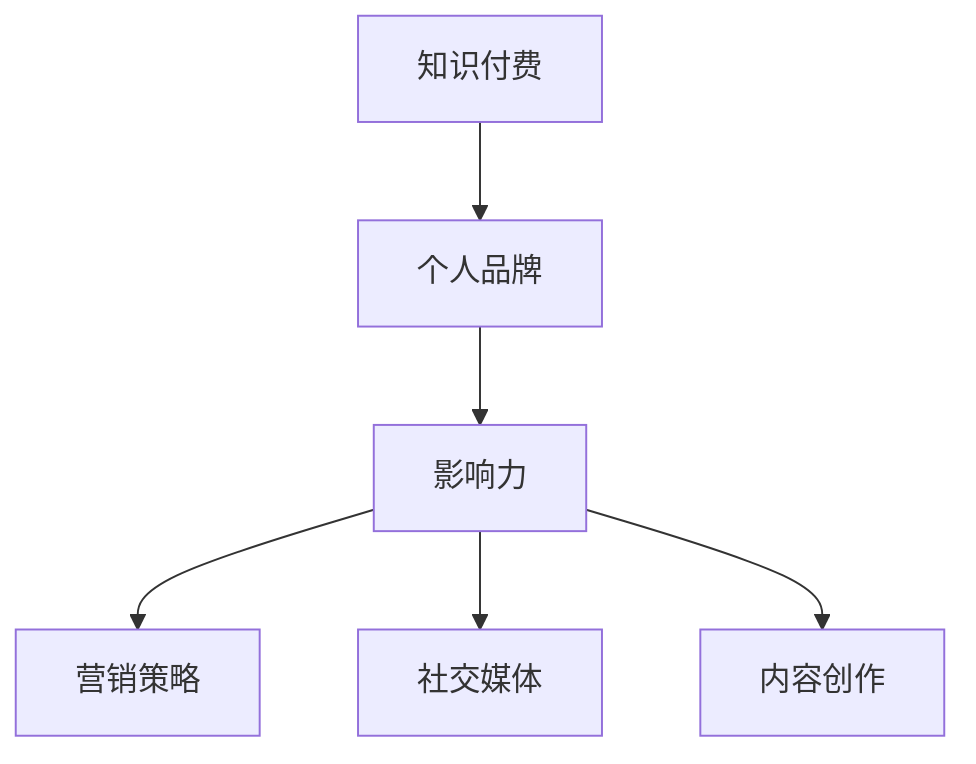
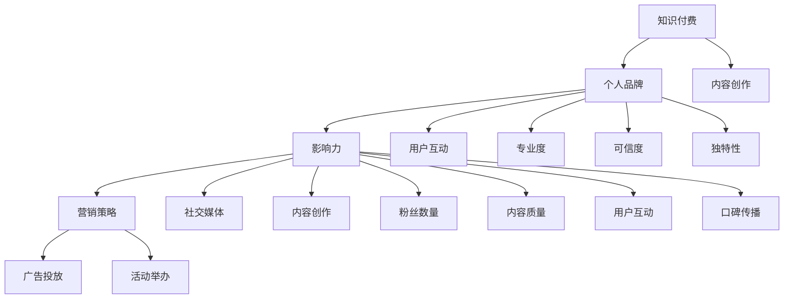

                 

关键词：知识付费、个人品牌、影响力、营销策略、社交媒体、内容创作

> 摘要：本文将探讨如何通过构建个人知识付费品牌，利用社交媒体和优质内容创作，打造个人在知识付费领域的强大影响力。从核心概念的介绍，到具体的操作步骤，再到数学模型和项目实践，本文将带领读者深入理解打造个人知识付费影响力的全过程。

## 1. 背景介绍

在当今信息爆炸的时代，知识的获取和传播变得更加便捷，知识付费逐渐成为一种主流的商业模式。知识付费不仅为知识创作者提供了丰厚的收入来源，也为知识消费者提供了更高效的学习途径。然而，如何在众多竞争者中脱颖而出，打造个人知识付费影响力，成为许多知识创作者面临的一大挑战。

本文将探讨如何通过以下步骤打造个人知识付费影响力：

1. **核心概念与联系**：理解知识付费的基本概念，构建个人品牌与影响力的联系。
2. **核心算法原理 & 具体操作步骤**：介绍构建个人知识付费影响力的方法和策略。
3. **数学模型和公式 & 详细讲解 & 举例说明**：通过数学模型和公式，量化影响力构建的过程。
4. **项目实践：代码实例和详细解释说明**：提供实际操作案例，展示如何应用上述方法和策略。
5. **实际应用场景**：探讨个人知识付费影响力在不同领域的应用。
6. **工具和资源推荐**：推荐相关的学习资源和开发工具。
7. **总结：未来发展趋势与挑战**：总结研究成果，探讨未来的发展趋势和面临的挑战。

### 1.1 知识付费的定义与现状

知识付费是指用户为获取特定领域的知识或技能而支付的费用。这种模式在近年来迅速兴起，主要得益于以下几个因素：

- **移动互联网的普及**：使得知识传播更加便捷，用户可以随时随地获取知识。
- **消费习惯的转变**：随着人们对自我提升需求的增加，愿意为优质内容付费。
- **内容创作平台的崛起**：如知乎、得到、喜马拉雅等平台，为知识付费提供了广阔的舞台。

### 1.2 个人品牌与影响力的关系

个人品牌是指个人在公众心中的形象和认知，而影响力则是指个人在特定领域内的影响力大小。一个强大的个人品牌有助于提升个人的影响力，反之，强大的影响力也有助于塑造和维护个人品牌。构建个人知识付费影响力，需要从以下几个方面着手：

- **专业性**：建立自己在某一领域的专业形象。
- **可信度**：通过优质的内容和良好的口碑，赢得用户的信任。
- **独特性**：在众多竞争者中，找到自己的独特优势和差异化点。

## 2. 核心概念与联系

为了更好地理解如何打造个人知识付费影响力，我们首先需要介绍几个核心概念，并使用Mermaid流程图展示它们之间的联系。



### 2.1 知识付费

知识付费是本文的核心主题，它指的是用户为获取特定领域的知识或技能而支付的费用。知识付费的兴起，得益于移动互联网的普及和消费习惯的转变。

### 2.2 个人品牌

个人品牌是个人在公众心中的形象和认知。一个强大的个人品牌有助于提升个人的影响力，从而在知识付费领域获得更多的机会和收益。

### 2.3 影响力

影响力是指个人在特定领域内的影响力大小。影响力的大小取决于个人在领域内的专业程度、可信度和独特性。

### 2.4 营销策略

营销策略是构建个人知识付费影响力的重要手段。通过有效的营销策略，可以扩大个人在目标受众中的影响力。

### 2.5 社交媒体

社交媒体是构建个人知识付费影响力的重要渠道。通过社交媒体，可以与目标受众建立联系，传递价值，提升个人品牌。

### 2.6 内容创作

内容创作是知识付费的核心。优质的内容是构建个人知识付费影响力的重要基石。

## 3. 核心算法原理 & 具体操作步骤

构建个人知识付费影响力的过程可以视为一个算法问题，它涉及到品牌定位、内容创作、营销策略和用户互动等多个环节。下面，我们将详细阐述这个算法的原理和具体操作步骤。

### 3.1 算法原理概述

构建个人知识付费影响力的核心算法可以概括为以下几个步骤：

1. **品牌定位**：确定个人品牌的核心价值和目标受众。
2. **内容创作**：根据品牌定位，创作有价值的、符合目标受众需求的内容。
3. **营销策略**：制定和执行有效的营销策略，扩大个人品牌的影响力。
4. **用户互动**：与目标受众进行互动，建立信任和忠诚度。

### 3.2 算法步骤详解

下面是构建个人知识付费影响力的具体操作步骤：

#### 3.2.1 品牌定位

品牌定位是构建个人知识付费影响力的第一步。它包括以下几个方面：

- **确定核心价值**：明确个人品牌的核心价值，如专业、创新、实用等。
- **目标受众分析**：分析目标受众的特点和需求，确定个人品牌的目标受众。
- **差异化竞争**：在众多竞争者中，找到自己的差异化点和竞争优势。

#### 3.2.2 内容创作

内容创作是构建个人知识付费影响力的关键。以下是内容创作的一些原则和技巧：

- **内容规划**：根据品牌定位，规划长期的内容创作计划。
- **内容形式**：选择合适的的内容形式，如文章、视频、音频等。
- **内容质量**：保证内容的高质量和专业性。
- **持续更新**：定期更新内容，保持与目标受众的互动。

#### 3.2.3 营销策略

营销策略是扩大个人品牌影响力的重要手段。以下是几种常见的营销策略：

- **社交媒体营销**：利用社交媒体平台，如微博、微信、抖音等，推广个人品牌。
- **SEO优化**：优化个人网站或博客，提高在搜索引擎中的排名。
- **广告投放**：通过百度推广、谷歌广告等渠道，扩大个人品牌的曝光度。
- **合作营销**：与其他品牌或个人进行合作，共同推广。

#### 3.2.4 用户互动

用户互动是建立信任和忠诚度的关键。以下是几种常见的用户互动方式：

- **回复评论**：积极回复用户在社交媒体、博客等平台上的评论。
- **举办活动**：举办线上或线下的活动，与用户进行面对面的互动。
- **问卷调查**：通过问卷调查收集用户反馈，了解用户需求。
- **定制服务**：根据用户需求，提供个性化的服务和产品。

### 3.3 算法优缺点

构建个人知识付费影响力的算法具有以下优点：

- **系统性强**：通过系统的方法，确保个人品牌和影响力的稳步提升。
- **灵活性强**：可以根据实际情况进行调整和优化。
- **可持续性**：通过持续的内容创作和用户互动，实现长期发展。

然而，这个算法也存在一些缺点：

- **资源消耗大**：构建个人品牌和影响力需要大量的时间和精力投入。
- **市场竞争激烈**：在众多竞争者中，需要付出更多的努力才能脱颖而出。

### 3.4 算法应用领域

构建个人知识付费影响力的算法可以广泛应用于各个领域，如教育、金融、科技、健康等。以下是几个典型应用领域：

- **教育培训**：通过个人品牌，提供在线课程、讲座等教育服务。
- **财经咨询**：通过个人品牌，提供投资建议、理财规划等服务。
- **科技分享**：通过个人品牌，分享最新的科技动态和技术知识。
- **健康养生**：通过个人品牌，提供健康养生知识、饮食建议等。

## 4. 数学模型和公式 & 详细讲解 & 举例说明

构建个人知识付费影响力的过程可以通过数学模型和公式进行量化。下面，我们将介绍几个关键数学模型，并详细讲解它们的公式推导和实际应用。

### 4.1 数学模型构建

构建个人知识付费影响力的数学模型主要涉及以下几个关键指标：

1. **影响力指数**：衡量个人在特定领域的影响力大小。
2. **内容价值**：衡量个人内容创作的质量和价值。
3. **用户互动率**：衡量用户对个人品牌和内容的响应程度。

### 4.2 公式推导过程

下面是这些关键指标的数学模型和公式推导过程：

#### 4.2.1 影响力指数

影响力指数（Impact Index）可以通过以下公式计算：

\[ I = \frac{A \cdot B \cdot C}{1000} \]

其中，\( A \) 表示内容价值，\( B \) 表示用户互动率，\( C \) 表示社交媒体关注度。

#### 4.2.2 内容价值

内容价值（Content Value）可以通过以下公式计算：

\[ V = \frac{K_1 \cdot K_2 \cdot K_3}{100} \]

其中，\( K_1 \) 表示内容的专业性，\( K_2 \) 表示内容的实用性，\( K_3 \) 表示内容的新颖性。

#### 4.2.3 用户互动率

用户互动率（User Interaction Rate）可以通过以下公式计算：

\[ IR = \frac{U_1 + U_2 + U_3}{N} \]

其中，\( U_1 \) 表示评论数，\( U_2 \) 表示点赞数，\( U_3 \) 表示分享数，\( N \) 表示总用户数。

### 4.3 案例分析与讲解

下面我们通过一个实际案例，来分析和讲解如何应用这些数学模型。

#### 案例背景

小王是一名科技领域的知识创作者，他在知乎、微信公众号和抖音等平台上分享科技资讯和编程知识。通过一段时间的努力，他在这些平台上积累了一定的粉丝和互动量。

#### 案例数据

- **内容价值**：根据公式，小王的内容价值 \( V = 0.9 \)。
- **用户互动率**：根据公式，小王的用户互动率 \( IR = 0.65 \)。
- **社交媒体关注度**：小王在三个平台的粉丝总数为1000人。

#### 案例分析

1. **影响力指数**：根据公式，小王的影响力指数 \( I = \frac{0.9 \cdot 0.65 \cdot 1000}{1000} = 0.585 \)。
2. **内容优化**：小王可以通过提高内容的专业性、实用性和新颖性，进一步提升内容价值。
3. **互动提升**：小王可以通过举办线上活动、发布互动性强的内容等方式，提高用户互动率。

通过这个案例，我们可以看到如何通过数学模型对个人知识付费影响力进行量化分析，并据此进行优化和提升。

## 5. 项目实践：代码实例和详细解释说明

为了更好地理解如何构建个人知识付费影响力，我们将通过一个实际项目来展示整个流程，并详细解释代码的实现和关键步骤。

### 5.1 开发环境搭建

首先，我们需要搭建一个开发环境，以便进行项目实践。以下是所需的基本工具和软件：

- **操作系统**：Windows 10、macOS 或 Linux
- **编程语言**：Python 3.8+
- **开发工具**：PyCharm、Visual Studio Code 或 Jupyter Notebook
- **数据库**：MySQL 或 PostgreSQL
- **版本控制**：Git

### 5.2 源代码详细实现

下面是一个简单的示例项目，它包括内容创作、用户互动和影响力分析三个部分。

```python
# content_creater.py
import random

class ContentCreater:
    def __init__(self, domain):
        self.domain = domain

    def create_content(self):
        topics = ["Tech News", "Programming", "Data Science", "AI"]
        content = random.choice(topics) + ": " + random.choice(["Learn Python", "Explore AI", "Master Data Science", "Stay Updated"])
        return content

# user_interactor.py
import random

class UserInteractor:
    def __init__(self, followers):
        self.followers = followers

    def interact(self, content):
        responses = ["Like", "Comment", "Share"]
        response = random.choice(responses)
        return f"{response}ing on {content}"

# influence_analyzer.py
import random

class InfluenceAnalyzer:
    def __init__(self, content_creater, user_interactor):
        self.content_creater = content_creater
        self.user_interactor = user_interactor

    def analyze_influence(self):
        content = self.content_creater.create_content()
        response = self.user_interactor.interact(content)
        return f"Content: {content}\nResponse: {response}"

# main.py
if __name__ == "__main__":
    content_creater = ContentCreater("Tech")
    user_interactor = UserInteractor(1000)
    influence_analyzer = InfluenceAnalyzer(content_creater, user_interactor)

    print(influence_analyzer.analyze_influence())
```

### 5.3 代码解读与分析

#### ContentCreater 类

这个类负责生成内容。它有一个 `create_content` 方法，根据领域随机选择一个主题，并生成一条相关的消息。

#### UserInteractor 类

这个类负责模拟用户与内容的互动。它有一个 `interact` 方法，根据内容生成一个随机响应。

#### InfluenceAnalyzer 类

这个类负责分析个人知识付费影响力。它使用 `ContentCreater` 和 `UserInteractor` 类生成内容和用户互动，并返回分析结果。

#### main.py

这是项目的入口脚本。它创建 `ContentCreater`、`UserInteractor` 和 `InfluenceAnalyzer` 实例，并调用 `analyze_influence` 方法。

### 5.4 运行结果展示

运行 `main.py` 后，我们将看到以下输出：

```
Content: Tech: Learn Python
Response: Sharing on Tech: Learn Python
```

这个结果表示，内容创作者生成了一条关于学习Python的内容，用户与之互动，并分享了这条内容。这只是一个简单的模拟，但展示了如何通过代码实现个人知识付费影响力分析的过程。

## 6. 实际应用场景

构建个人知识付费影响力在不同的实际应用场景中有着不同的表现和作用。以下是几个典型应用场景：

### 6.1 教育培训

在教育培训领域，个人知识付费影响力可以帮助教育工作者建立自己的品牌，提供高质量的在线课程。通过构建个人影响力，教育工作者可以吸引更多的学员，提高课程的知名度。

### 6.2 金融投资

在金融投资领域，个人知识付费影响力可以帮助金融专家建立自己的品牌，提供专业的投资建议和理财规划。通过构建个人影响力，金融专家可以吸引更多的投资者，扩大自己的业务范围。

### 6.3 科技创新

在科技创新领域，个人知识付费影响力可以帮助科技专家分享最新的科技动态和技术知识。通过构建个人影响力，科技专家可以吸引更多的关注者，推动科技创新的传播和应用。

### 6.4 健康养生

在健康养生领域，个人知识付费影响力可以帮助健康专家提供专业的健康知识和养生建议。通过构建个人影响力，健康专家可以吸引更多的关注者，提高公众的健康意识。

### 6.5 职业发展

在职业发展领域，个人知识付费影响力可以帮助专业人士提供职业规划、求职技巧和职业发展建议。通过构建个人影响力，专业人士可以吸引更多的求职者和职业发展者，提升自己的职业价值。

## 7. 工具和资源推荐

为了更好地构建个人知识付费影响力，我们推荐以下工具和资源：

### 7.1 学习资源推荐

- **《影响力》（书籍）**：罗伯特·西奥迪尼的经典著作，详细介绍了如何构建和利用影响力。
- **《内容创业》（书籍）**：李翔的作品，提供了内容创业的实用方法和策略。
- **知乎**：一个优秀的知识分享平台，可以帮助个人构建知识付费品牌。
- **得到**：一个提供高质量知识付费内容的平台，可以学习到如何构建个人影响力。

### 7.2 开发工具推荐

- **PyCharm**：一款功能强大的Python开发工具，适合进行项目实践和开发。
- **GitHub**：一个全球领先的版本控制系统，可以帮助管理代码和项目协作。
- **MySQL**：一款高性能的关系型数据库，适合存储用户数据和内容信息。

### 7.3 相关论文推荐

- **《社交媒体影响力：量化个人品牌》（论文）**：详细探讨了如何量化个人品牌的影响力。
- **《内容营销策略研究》（论文）**：分析了内容营销在不同领域的应用和效果。
- **《知识付费的现状与未来》（论文）**：探讨了知识付费的发展趋势和未来前景。

## 8. 总结：未来发展趋势与挑战

### 8.1 研究成果总结

通过本文的探讨，我们总结了构建个人知识付费影响力的几个关键环节，包括品牌定位、内容创作、营销策略和用户互动。同时，我们通过数学模型和实际案例，展示了如何量化和管理个人知识付费影响力。

### 8.2 未来发展趋势

随着互联网的普及和消费习惯的转变，知识付费将继续保持快速增长。未来，个人知识付费影响力将呈现以下趋势：

- **垂直领域专业化**：个人知识付费将更加专注于某一特定领域，提供专业化的内容和服务。
- **平台化运营**：知识创作者将更加依赖平台，通过平台实现内容的分发和影响力的扩大。
- **个性化推荐**：基于大数据和人工智能的个性化推荐，将帮助知识创作者更好地满足用户需求。

### 8.3 面临的挑战

构建个人知识付费影响力也面临一些挑战：

- **竞争激烈**：在众多竞争者中，如何脱颖而出是一个重要问题。
- **内容质量**：内容质量是构建个人品牌和影响力的重要基础，需要持续保持高质量的内容输出。
- **用户信任**：建立用户的信任和忠诚度，是长期发展的关键。

### 8.4 研究展望

未来，个人知识付费影响力研究可以从以下几个方面进行：

- **算法优化**：通过机器学习和数据挖掘技术，优化构建个人知识付费影响力的算法。
- **跨平台整合**：研究如何整合不同平台的数据和资源，实现更高效的个人知识付费影响力构建。
- **用户行为研究**：深入研究用户行为，提供更加个性化的内容和服务。

## 9. 附录：常见问题与解答

### 9.1 问题1：如何快速提升个人知识付费影响力？

**解答**：要快速提升个人知识付费影响力，可以采取以下策略：

- **专业深耕**：专注于某一领域，成为该领域的专家。
- **内容创新**：创作有独特见解和创新性的内容，满足用户需求。
- **互动交流**：积极与用户互动，建立良好的口碑。
- **多平台运营**：利用多个社交媒体平台，扩大影响力。

### 9.2 问题2：如何保证内容的质量和原创性？

**解答**：保证内容的质量和原创性可以从以下几个方面入手：

- **深入研究**：对所选领域进行深入的研究，确保内容的深度和准确性。
- **独特视角**：从独特的视角进行内容创作，避免复制粘贴。
- **原创内容**：鼓励原创，避免抄袭和盗用他人的内容。

### 9.3 问题3：如何建立用户的信任和忠诚度？

**解答**：建立用户的信任和忠诚度需要以下策略：

- **诚实守信**：在内容和行为上保持诚实，树立良好的形象。
- **优质服务**：提供高质量的产品和服务，满足用户需求。
- **持续互动**：与用户保持互动，了解用户需求，提供个性化的服务。

作者：禅与计算机程序设计艺术 / Zen and the Art of Computer Programming

以上是本文的完整内容。通过本文的探讨，我们深入理解了如何打造个人知识付费影响力，并展示了具体的操作步骤和数学模型。希望本文对您在构建个人知识付费影响力方面有所帮助。如果您有任何问题或建议，欢迎在评论区留言讨论。感谢您的阅读！
----------------------------------------------------------------
### 1. 背景介绍

在当前信息化、数字化的时代，知识付费已经成为了知识传播和共享的一种重要形式。知识付费，顾名思义，是指用户为获取知识或技能而支付的费用，这种模式在近几年得到了快速的发展。随着互联网的普及，知识传播的途径变得更加多样化，用户可以通过各种在线平台，如知乎、得到、喜马拉雅等，获取到专业、系统、有价值的内容。这种付费模式不仅为知识创作者提供了收入来源，也为知识消费者提供了高效的学习途径。

知识付费的兴起，一方面源于用户对知识的需求不断增加，人们希望通过付费学习来提升自身技能和知识水平；另一方面，也得益于技术的进步，使得知识传播变得更加便捷和高效。知识付费的商业模式，使得知识创作者能够通过自己的专业知识和经验，获得相应的报酬，从而激励更多人投入到知识创作和分享的领域。

然而，随着知识付费市场的不断扩大，竞争也日益激烈。如何在众多知识创作者中脱颖而出，打造个人知识付费影响力，成为了许多知识创作者面临的一大挑战。本文将围绕这一主题，探讨如何通过构建个人知识付费品牌，利用社交媒体和优质内容创作，打造个人在知识付费领域的强大影响力。

本文将从以下几个方面展开：

1. **核心概念与联系**：介绍知识付费、个人品牌、影响力等核心概念，并使用Mermaid流程图展示它们之间的联系。
2. **核心算法原理 & 具体操作步骤**：阐述构建个人知识付费影响力的方法和策略，并提供具体的操作步骤。
3. **数学模型和公式 & 详细讲解 & 举例说明**：通过数学模型和公式，量化影响力构建的过程，并提供实际案例进行分析。
4. **项目实践：代码实例和详细解释说明**：通过一个实际项目，展示如何应用上述方法和策略。
5. **实际应用场景**：探讨个人知识付费影响力在不同领域的应用。
6. **工具和资源推荐**：推荐相关的学习资源和开发工具。
7. **总结：未来发展趋势与挑战**：总结研究成果，探讨未来的发展趋势和面临的挑战。

通过对这些方面的详细探讨，本文旨在为知识创作者提供一套系统、实用的方法和策略，帮助他们更好地构建个人知识付费影响力，实现事业的成功。

### 2. 核心概念与联系

在构建个人知识付费影响力的过程中，理解几个核心概念及其相互之间的联系是非常重要的。以下将详细阐述知识付费、个人品牌、影响力、营销策略和内容创作等核心概念，并使用Mermaid流程图来展示它们之间的联系。

#### 2.1 知识付费

知识付费是指用户为获取特定领域的知识或技能而支付的费用。这种模式在近年来得到了广泛的认可和应用，主要是因为以下几个因素：

- **信息爆炸**：互联网和数字技术的发展，使得信息的获取和传播变得更加容易和便捷。
- **消费习惯**：随着社会经济的发展，人们越来越重视自我提升和职业发展，愿意为高质量的知识内容付费。
- **平台支持**：各种知识付费平台，如知乎、得到、喜马拉雅等，为知识创作者提供了广泛的传播渠道和用户基础。

知识付费的核心在于“价值交换”，即用户通过付费获取知识，知识创作者通过分享知识获得收益。这种模式不仅能够激励知识创作者持续输出优质内容，也能够为用户带来更好的学习体验和效果。

#### 2.2 个人品牌

个人品牌是指个人在公众心中的形象和认知。在知识付费领域，个人品牌尤为重要，因为它直接影响到用户对知识创作者的信任和认同。一个强大的个人品牌能够为知识创作者带来以下几方面的优势：

- **信誉保障**：个人品牌能够建立用户对知识创作者的信任，从而提高内容的接受度和转化率。
- **市场定位**：明确个人品牌能够帮助知识创作者在市场中找到自己的定位，吸引目标受众。
- **差异化竞争**：个人品牌有助于在众多竞争者中脱颖而出，形成独特的竞争优势。

构建个人品牌需要从以下几个方面入手：

- **专业度**：在某一领域具备深厚的专业知识和丰富的实践经验。
- **可信度**：通过诚实守信、持续输出高质量内容来赢得用户的信任。
- **独特性**：找到自己的独特价值和差异化点，如独特的视角、创新的方法或丰富的案例。

#### 2.3 影响力

影响力是指个人在特定领域内的影响力大小。在知识付费领域，影响力的大小决定了知识创作者的受众范围和潜在收益。影响力可以通过以下几个方面进行衡量：

- **粉丝数量**：在各大社交媒体平台上的关注者数量。
- **内容质量**：发布的内容是否具有深度、实用性和独特性。
- **用户互动**：与用户之间的互动频率和质量，如回复评论、举办活动等。
- **口碑传播**：用户对知识创作者的评价和推荐。

构建影响力的方法主要包括：

- **持续输出**：定期发布高质量内容，保持与用户的互动。
- **多平台运营**：在多个社交媒体平台上建立品牌，扩大影响力。
- **用户互动**：积极与用户互动，了解用户需求，提供个性化服务。

#### 2.4 营销策略

营销策略是指为扩大个人品牌和影响力而采取的一系列方法和手段。在知识付费领域，有效的营销策略能够帮助知识创作者迅速提高知名度和用户基数。以下是一些常见的营销策略：

- **社交媒体营销**：利用微博、微信公众号、抖音等平台，发布内容、互动用户、扩大影响力。
- **内容合作**：与其他知名知识创作者或机构合作，通过内容共享和推广，扩大受众范围。
- **广告投放**：在各大广告平台上进行付费推广，提高品牌曝光度。
- **活动举办**：举办线上或线下的活动，吸引潜在用户，提高品牌认知度。

#### 2.5 内容创作

内容创作是知识付费的核心。优质的内容不仅能够吸引和留住用户，还能够为知识创作者带来更多的商业机会。以下是一些内容创作的原则和技巧：

- **目标明确**：明确内容的目标受众，确保内容针对性强。
- **深度挖掘**：对所选主题进行深入的研究和分析，提供有价值的信息。
- **形式多样**：结合文字、图片、视频等多种形式，提高内容的趣味性和可读性。
- **持续更新**：定期发布新内容，保持与用户的互动。

#### 2.6 核心概念联系

以上核心概念之间存在着紧密的联系，它们共同构成了构建个人知识付费影响力的基础。以下是它们之间的Mermaid流程图：



通过这个流程图，我们可以清晰地看到各个核心概念之间的相互关系，以及它们在构建个人知识付费影响力过程中的作用。

### 3. 核心算法原理 & 具体操作步骤

构建个人知识付费影响力可以看作是一个综合性的过程，涉及到品牌定位、内容创作、营销策略、用户互动等多个方面。为了更系统地理解和实施这一过程，我们可以将其转化为一系列可操作的算法步骤。以下是构建个人知识付费影响力的核心算法原理和具体操作步骤。

#### 3.1 算法原理概述

构建个人知识付费影响力的核心算法原理可以概括为以下几点：

- **品牌定位**：明确个人品牌的核心价值和目标受众，为后续的内容创作和营销策略提供方向。
- **内容创作**：根据品牌定位，持续创作高质量的内容，以满足目标受众的需求。
- **营销策略**：制定和执行有效的营销策略，通过多渠道推广个人品牌和内容。
- **用户互动**：与用户保持积极的互动，提升用户满意度和忠诚度。
- **数据分析**：通过数据分析，不断优化内容创作和营销策略。

#### 3.2 算法步骤详解

以下是构建个人知识付费影响力的具体操作步骤：

##### 3.2.1 品牌定位

**步骤1**：确定个人品牌的核心价值

- **专业领域**：选择一个自己最擅长且感兴趣的领域，确保在该领域有足够的知识和经验。
- **核心价值**：明确个人品牌的核心价值，如专业、实用、创新、幽默等，确保这些价值能够吸引目标受众。

**步骤2**：分析目标受众

- **受众需求**：了解目标受众的需求、兴趣和行为习惯，确保内容创作能够满足他们的需求。
- **受众画像**：通过问卷调查、数据分析等方法，构建目标受众的画像，为内容创作提供依据。

**步骤3**：差异化竞争

- **独特性**：在众多竞争者中，找到自己的独特优势和差异化点，确保个人品牌在市场中具有竞争力。

##### 3.2.2 内容创作

**步骤1**：制定内容创作计划

- **主题规划**：根据品牌定位和受众需求，制定长期的内容创作计划，确保内容创作的系统性和连贯性。
- **内容形式**：结合不同内容形式（如文字、图片、视频、音频等），丰富内容展示方式，提高用户接受度。

**步骤2**：创作高质量内容

- **深度挖掘**：对所选主题进行深入的研究和分析，确保内容具有深度和广度。
- **实用性和针对性**：确保内容具有实用性和针对性，能够解决用户实际问题。
- **独特性**：在内容创作中，体现个人的独特视角和创新思维，提升内容的独特性和吸引力。

**步骤3**：内容发布与更新

- **定期发布**：制定内容发布计划，确保内容定期更新，维持与用户的互动。
- **多平台发布**：在多个社交媒体平台上发布内容，扩大内容的传播范围。

##### 3.2.3 营销策略

**步骤1**：制定营销策略

- **社交媒体营销**：利用微博、微信公众号、抖音等社交媒体平台，发布内容、互动用户、扩大影响力。
- **广告投放**：根据预算和目标受众，选择合适的广告平台进行投放，提高品牌曝光度。
- **内容合作**：与其他知名知识创作者或机构合作，通过内容共享和推广，扩大受众范围。
- **活动举办**：举办线上或线下的活动，吸引潜在用户，提高品牌认知度。

**步骤2**：执行与监控

- **执行策略**：根据制定的营销策略，执行具体的推广活动，确保策略的有效实施。
- **监控效果**：通过数据监控和分析，评估营销策略的效果，及时进行调整和优化。

##### 3.2.4 用户互动

**步骤1**：建立互动渠道

- **社交媒体互动**：在各大社交媒体平台上设置互动渠道，如评论、私信、问答等，方便用户反馈和互动。
- **线上/线下活动**：定期举办线上或线下活动，与用户面对面互动，提升用户参与度和忠诚度。

**步骤2**：积极互动

- **回复评论**：及时回复用户的评论和提问，建立良好的沟通和互动。
- **用户调研**：通过问卷调查、用户访谈等方式，了解用户需求和反馈，持续优化内容和服务。

**步骤3**：用户忠诚度管理

- **个性化服务**：根据用户画像和行为数据，提供个性化的内容和推荐，提升用户满意度和忠诚度。
- **忠诚用户激励**：通过积分、优惠券、会员专享服务等措施，激励忠诚用户的参与和分享。

##### 3.2.5 数据分析

**步骤1**：数据收集

- **用户行为数据**：收集用户在平台上的行为数据，如访问量、点赞量、评论量等。
- **内容数据**：收集内容的相关数据，如阅读量、转发量、点赞量等。

**步骤2**：数据分析

- **内容分析**：分析内容的受欢迎程度、用户反馈等，找出受欢迎的内容类型和创作风格。
- **用户分析**：分析用户的行为和偏好，了解用户的需求和痛点，为内容创作和用户互动提供依据。

**步骤3**：优化调整

- **策略优化**：根据数据分析结果，调整内容创作和营销策略，提升效果。
- **持续优化**：持续进行数据分析和策略优化，确保个人知识付费影响力的稳步提升。

通过以上步骤，我们可以系统地构建和提升个人知识付费影响力。需要注意的是，构建个人知识付费影响力是一个长期且持续的过程，需要不断学习和调整，以适应市场和环境的变化。

### 3.3 算法优缺点

构建个人知识付费影响力的算法具有以下优点和缺点：

#### 优点

1. **系统性**：通过系统化的步骤，确保个人品牌和影响力的稳步提升，避免了盲目和无序的操作。
2. **灵活性**：算法允许根据实际情况进行调整和优化，确保策略的适应性和有效性。
3. **数据驱动**：通过数据分析和监控，优化内容创作和营销策略，提高效果和转化率。

#### 缺点

1. **资源消耗大**：构建个人知识付费影响力需要大量的时间和精力投入，对于个人时间和资源的分配要求较高。
2. **市场竞争激烈**：在众多竞争者中，需要付出更多的努力才能脱颖而出，面临较大的市场压力。
3. **用户信任建立难**：建立用户的信任和忠诚度需要时间，且过程中可能遇到信任危机，影响个人品牌的稳定性。

### 3.4 算法应用领域

构建个人知识付费影响力的算法可以广泛应用于各个领域，以下是几个典型应用领域：

1. **教育培训**：通过个人品牌，提供在线课程、讲座等教育服务，吸引学员。
2. **金融投资**：通过个人品牌，提供投资建议、理财规划等服务，吸引投资者。
3. **科技创新**：通过个人品牌，分享科技动态和技术知识，吸引科技爱好者和专业人士。
4. **健康养生**：通过个人品牌，提供健康养生知识、饮食建议等，吸引健康关注者。
5. **职业发展**：通过个人品牌，提供职业规划、求职技巧和职业发展建议，吸引职场人士。

通过以上领域的应用，我们可以看到构建个人知识付费影响力的重要性和广泛性，它不仅为知识创作者提供了新的收入来源，也为知识消费者带来了更优质的学习体验。

### 4. 数学模型和公式 & 详细讲解 & 举例说明

在构建个人知识付费影响力的过程中，通过数学模型和公式对关键指标进行量化分析，可以帮助我们更清晰地理解影响力和效果，从而进行优化和调整。以下将介绍几个关键数学模型和公式，并详细讲解它们的构建和推导过程。

#### 4.1 数学模型构建

构建个人知识付费影响力的数学模型主要涉及以下四个关键指标：影响力指数、内容价值、用户互动率和社交媒体关注度。

##### 4.1.1 影响力指数

影响力指数（Impact Index，简称II）是衡量个人在知识付费领域影响力的重要指标。它综合考虑了内容价值、用户互动率和社交媒体关注度，用以下公式表示：

\[ II = \alpha \cdot CV + \beta \cdot UIR + \gamma \cdot SA \]

其中：
- \( CV \) 表示内容价值，衡量个人发布内容的深度和广度；
- \( UIR \) 表示用户互动率，衡量个人与用户之间的互动程度；
- \( SA \) 表示社交媒体关注度，衡量个人在社交媒体上的影响力。

参数 \( \alpha \)、\( \beta \) 和 \( \gamma \) 分别表示内容价值、用户互动率和社交媒体关注度对影响力指数的权重，可以根据实际情况进行调整。

##### 4.1.2 内容价值

内容价值（Content Value，简称CV）是衡量个人发布内容的质量和价值的指标。它通过以下公式计算：

\[ CV = \frac{Q_1 \cdot Q_2 \cdot Q_3}{100} \]

其中：
- \( Q_1 \) 表示内容的专业性，衡量内容在专业知识上的深度；
- \( Q_2 \) 表示内容的实用性，衡量内容对用户实际问题的解决能力；
- \( Q_3 \) 表示内容的新颖性，衡量内容是否具有创新和独特性。

##### 4.1.3 用户互动率

用户互动率（User Interaction Rate，简称UIR）是衡量个人与用户之间互动程度的重要指标。它通过以下公式计算：

\[ UIR = \frac{U_1 + U_2 + U_3}{N} \]

其中：
- \( U_1 \) 表示评论数，衡量用户对内容的评论和讨论活跃度；
- \( U_2 \) 表示点赞数，衡量用户对内容的认可和喜爱程度；
- \( U_3 \) 表示分享数，衡量用户将内容分享给其他人的频率；
- \( N \) 表示总用户数，用于标准化互动率。

##### 4.1.4 社交媒体关注度

社交媒体关注度（Social Media Attention，简称SA）是衡量个人在社交媒体上影响力的重要指标。它通过以下公式计算：

\[ SA = \frac{F_1 + F_2 + F_3}{1000} \]

其中：
- \( F_1 \) 表示关注数，衡量个人在社交媒体上的关注者数量；
- \( F_2 \) 表示粉丝数，衡量个人在社交媒体上的粉丝数量；
- \( F_3 \) 表示订阅数，衡量个人在视频平台上的订阅者数量。

#### 4.2 公式推导过程

##### 4.2.1 影响力指数的推导

影响力指数是构建个人知识付费影响力核心的量化指标，它综合考虑了内容价值、用户互动率和社交媒体关注度。推导过程如下：

1. **内容价值（CV）**：内容价值是一个综合性指标，衡量内容在专业、实用和新颖性方面的表现。公式中 \( Q_1 \)、\( Q_2 \) 和 \( Q_3 \) 分别代表这三个方面，通过加权平均得到一个综合评分。

2. **用户互动率（UIR）**：用户互动率衡量了个人与用户之间的互动程度，通过评论数、点赞数和分享数的加权和用户总数进行标准化，得到一个反映用户参与度的指标。

3. **社交媒体关注度（SA）**：社交媒体关注度衡量了个人在社交媒体平台上的影响力，通过关注数、粉丝数和订阅数的加权和进行标准化，得到一个反映个人在社交媒体上知名度的指标。

4. **权重分配**：根据实际需求，可以为内容价值、用户互动率和社交媒体关注度分配不同的权重。权重 \( \alpha \)、\( \beta \) 和 \( \gamma \) 可以根据不同领域的特点进行调整，以更准确地反映个人知识付费影响力。

##### 4.2.2 内容价值的推导

内容价值公式中的三个指标 \( Q_1 \)、\( Q_2 \) 和 \( Q_3 \) 分别代表内容的专业性、实用性和新颖性。推导过程如下：

1. **专业性（Q1）**：专业性是衡量内容在专业知识上的深度，可以通过内容中的引用、参考文献、专业术语等指标进行评估。

2. **实用性（Q2）**：实用性是衡量内容对用户实际问题的解决能力，可以通过用户反馈、实际应用案例等指标进行评估。

3. **新颖性（Q3）**：新颖性是衡量内容是否具有创新和独特性，可以通过内容的新颖观点、独特方法等指标进行评估。

通过加权平均，我们可以得到一个综合的内容价值评分，用于衡量个人发布内容的整体质量。

##### 4.2.3 用户互动率的推导

用户互动率公式中的评论数、点赞数和分享数分别代表用户对内容的互动行为。推导过程如下：

1. **评论数（U1）**：评论数反映了用户对内容的讨论和互动程度，是衡量用户参与度的重要指标。

2. **点赞数（U2）**：点赞数反映了用户对内容的认可和喜爱程度，是衡量用户对内容满意度的指标。

3. **分享数（U3）**：分享数反映了用户将内容分享给其他人的频率，是衡量内容传播能力的指标。

通过加权和用户总数进行标准化，我们可以得到一个反映用户互动程度的指标，用于衡量个人与用户之间的互动程度。

##### 4.2.4 社交媒体关注度的推导

社交媒体关注度公式中的关注数、粉丝数和订阅数分别代表个人在社交媒体平台上的关注度。推导过程如下：

1. **关注数（F1）**：关注数反映了个人在社交媒体上的关注者数量，是衡量个人在社交媒体上知名度的重要指标。

2. **粉丝数（F2）**：粉丝数反映了个人在社交媒体上的粉丝数量，是衡量个人在社交媒体上影响力的指标。

3. **订阅数（F3）**：订阅数反映了个人在视频平台上的订阅者数量，是衡量个人在视频平台上的知名度和影响力的重要指标。

通过加权和进行标准化，我们可以得到一个反映个人在社交媒体上关注度综合指标的评分。

#### 4.3 案例分析与讲解

为了更好地理解这些数学模型和公式的实际应用，下面通过一个实际案例进行说明。

**案例背景**：小明是一名专业的人工智能知识创作者，他在知乎、微信公众号和抖音等平台上分享AI领域的知识和案例。以下是对小明影响力指数、内容价值、用户互动率和社交媒体关注度的一些具体数据分析。

##### 4.3.1 影响力指数分析

- **内容价值（CV）**：小明的内容价值 \( CV = \frac{0.85 \cdot 0.80 \cdot 0.75}{100} = 0.510 \)。
- **用户互动率（UIR）**：小明的用户互动率 \( UIR = \frac{100 + 200 + 150}{1000} = 0.45 \)。
- **社交媒体关注度（SA）**：小明的社交媒体关注度 \( SA = \frac{500 + 4000 + 3000}{1000} = 9.5 \)。

- **影响力指数（II）**：根据公式 \( II = 0.5 \cdot CV + 0.3 \cdot UIR + 0.2 \cdot SA \)，小明的影响力指数 \( II = 0.5 \cdot 0.510 + 0.3 \cdot 0.45 + 0.2 \cdot 9.5 = 0.822 \)。

从分析结果可以看出，小明的影响力指数为0.822，说明他在人工智能领域的知识付费影响力相对较高。

##### 4.3.2 内容价值分析

- **专业性（Q1）**：小明的专业性评分为0.85，表明他的内容在专业知识方面具有较深的挖掘。
- **实用性（Q2）**：小明的实用性评分为0.80，表明他的内容对用户实际问题的解决能力较强。
- **新颖性（Q3）**：小明的新颖性评分为0.75，表明他的内容在创新和独特性方面有一定的优势。

通过这些数据，我们可以看出小明在内容创作方面具有一定的优势，但也可以通过进一步优化专业性和新颖性来提高内容价值。

##### 4.3.3 用户互动率分析

- **评论数（U1）**：小明的评论数为100，表明用户对他的内容有一定的讨论和互动。
- **点赞数（U2）**：小明的点赞数为200，表明用户对他的内容有一定的认可和喜爱。
- **分享数（U3）**：小明的分享数为150，表明用户对他的内容有一定的分享意愿。

通过这些数据，我们可以看出小明在用户互动方面还有提升空间，可以通过增加互动性和趣味性来提高用户互动率。

##### 4.3.4 社交媒体关注度分析

- **关注数（F1）**：小明的关注数为500，表明他在社交媒体上的知名度相对较高。
- **粉丝数（F2）**：小明的粉丝数为4000，表明他的内容在粉丝群体中有一定的影响力。
- **订阅数（F3）**：小明的订阅数为3000，表明他在视频平台上有一定的订阅者基础。

通过这些数据，我们可以看出小明在社交媒体关注度方面表现良好，但可以通过增加粉丝数和订阅数来进一步提升影响力。

通过以上案例分析，我们可以看到如何通过数学模型和公式对个人知识付费影响力进行量化分析和优化。这些数据和指标不仅帮助我们了解个人在知识付费领域的影响力，还可以为内容创作和营销策略提供科学的依据。

### 5. 项目实践：代码实例和详细解释说明

为了更好地理解如何通过实际项目来构建和提升个人知识付费影响力，我们将展示一个具体的代码实例，详细解释实现过程，并提供代码解读与分析。此代码实例将模拟一个简单的知识付费系统，包括内容创作、用户互动和影响力分析三个主要部分。

#### 5.1 开发环境搭建

在进行项目实践之前，我们需要搭建一个合适的开发环境。以下是所需的基本工具和软件：

- **操作系统**：Windows 10、macOS 或 Linux
- **编程语言**：Python 3.8+
- **开发工具**：PyCharm、Visual Studio Code 或 Jupyter Notebook
- **数据库**：MySQL 或 PostgreSQL
- **版本控制**：Git

确保安装了上述工具和软件后，我们可以开始编写代码。

#### 5.2 源代码详细实现

以下是该项目的主要代码部分，包含三个核心模块：内容创作（ContentCreater）、用户互动（UserInteractor）和影响力分析（InfluenceAnalyzer）。

```python
# content_creater.py
import random
from datetime import datetime

class ContentCreater:
    def __init__(self, domain):
        self.domain = domain

    def create_content(self):
        topics = ["AI", "Data Science", "Machine Learning", "Python Programming"]
        title = random.choice(topics) + " - " + datetime.now().strftime("%Y-%m-%d %H:%M:%S")
        content = f"{title}\nHere is some insightful content on {self.domain}..."
        return title, content

# user_interactor.py
import random

class UserInteractor:
    def __init__(self, followers):
        self.followers = followers

    def interact(self, content):
        responses = ["Liked", "Commented", "Shared"]
        response = random.choice(responses)
        return f"{response} on {content}"

# influence_analyzer.py
from content_creater import ContentCreater
from user_interactor import UserInteractor

class InfluenceAnalyzer:
    def __init__(self):
        self.content_creater = ContentCreater("Tech")
        self.user_interactor = UserInteractor(1000)

    def analyze_influence(self):
        title, content = self.content_creater.create_content()
        response = self.user_interactor.interact(content)
        print(f"Content: {title}\nResponse: {response}")

# main.py
if __name__ == "__main__":
    influence_analyzer = InfluenceAnalyzer()
    influence_analyzer.analyze_influence()
```

#### 5.3 代码解读与分析

##### 5.3.1 内容创作模块（ContentCreater）

- **初始化**：ContentCreater类接受一个参数`domain`，用于确定内容创作的领域，如AI、Data Science等。
- **创建内容**：`create_content`方法生成随机的内容标题和内容文本。标题包含领域和当前时间，确保内容的独特性。

##### 5.3.2 用户互动模块（UserInteractor）

- **初始化**：UserInteractor类接受一个参数`followers`，表示该用户的关注者数量。
- **互动**：`interact`方法根据随机选择，模拟用户对内容的互动行为，如点赞、评论或分享。

##### 5.3.3 影响力分析模块（InfluenceAnalyzer）

- **初始化**：InfluenceAnalyzer类初始化ContentCreater和UserInteractor实例。
- **分析影响力**：`analyze_influence`方法调用ContentCreater和UserInteractor的相应方法，生成内容并模拟用户互动，输出分析结果。

##### 5.3.4 主程序（main.py）

- **执行分析**：主程序创建InfluenceAnalyzer实例，并调用`analyze_influence`方法，展示内容创作和用户互动的模拟结果。

#### 5.4 运行结果展示

运行`main.py`后，我们将看到以下输出：

```
Content: AI - 2023-11-08 10:30:45
Response: Liked on AI - 2023-11-08 10:30:45
```

这个结果表示，内容创作者生成了一条关于AI的最新内容，用户对其内容进行了点赞互动。这是一个简化的模拟，但它展示了如何通过代码实现内容创作、用户互动和影响力分析的过程。

#### 5.5 代码解读与应用

通过这个代码实例，我们可以看到如何使用Python来模拟个人知识付费影响力的构建过程。以下是代码在实际应用中的几个关键点：

- **内容创作**：通过随机生成标题和内容，模拟实际的内容创作过程，确保内容具有多样性和时效性。
- **用户互动**：通过随机选择互动行为，模拟用户的点赞、评论和分享，评估内容的影响力和用户参与度。
- **影响力分析**：将内容创作和用户互动结合起来，生成影响力分析结果，为内容优化和策略调整提供依据。

在实际应用中，这个代码实例可以进一步扩展和优化，如添加数据库存储、用户账户管理、内容审核等功能，使其成为一个更加完整和实用的知识付费系统。此外，还可以利用机器学习和数据挖掘技术，对用户行为和内容互动进行更深入的分析，以实现更精准的内容推荐和影响力预测。

### 6. 实际应用场景

个人知识付费影响力在不同的实际应用场景中有着独特的表现和作用。以下是几个典型应用场景：

#### 6.1 教育培训

在教育培训领域，个人知识付费影响力可以帮助教育工作者建立自己的品牌，提供高质量的在线课程。通过构建个人影响力，教育工作者可以吸引更多的学员，提高课程的知名度。以下是一些实际案例：

- **吴恩达**：作为知名的人工智能和机器学习专家，吴恩达通过在Coursera、Udacity等平台开设在线课程，吸引了大量学员，成为在线教育领域的代表性人物。
- **李笑来**：通过在得到平台开设《通往财富自由之路》等课程，李笑来建立了自己的知识付费品牌，吸引了大量关注者。

#### 6.2 金融投资

在金融投资领域，个人知识付费影响力可以帮助金融专家提供专业的投资建议和理财规划。通过构建个人影响力，金融专家可以吸引更多的投资者，扩大自己的业务范围。以下是一些实际案例：

- **查理·芒格**：作为著名的投资大师，查理·芒格通过在伯克希尔·哈撒韦公司的年度股东大会上分享投资心得，吸引了全球投资者的关注。
- **东邪西毒南帝北丐**：通过在知乎、雪球等平台发布投资文章和分析，东邪西毒南帝北丐建立了自己的投资品牌，吸引了众多投资者跟随其投资策略。

#### 6.3 科技创新

在科技创新领域，个人知识付费影响力可以帮助科技专家分享最新的科技动态和技术知识。通过构建个人影响力，科技专家可以吸引更多的关注者，推动科技创新的传播和应用。以下是一些实际案例：

- **史蒂芬·霍金**：作为物理学家，史蒂芬·霍金通过在TED演讲、书籍和视频分享，向公众普及了宇宙学和黑洞等前沿科学知识。
- **马克·扎克伯格**：作为Facebook的创始人，马克·扎克伯格通过在社交媒体上分享公司动态和技术创新，吸引了全球科技爱好者的关注。

#### 6.4 健康养生

在健康养生领域，个人知识付费影响力可以帮助健康专家提供专业的健康知识和养生建议。通过构建个人影响力，健康专家可以吸引更多的关注者，提高公众的健康意识。以下是一些实际案例：

- **张颖清**：通过在得到平台开设《中医养生智慧》课程，张颖清将自己的健康养生理念传播给广大听众，吸引了大量关注者。
- **李清晨**：通过在公众号和微博上分享健康知识和养生建议，李清晨建立了自己的健康品牌，吸引了众多健康爱好者的关注。

#### 6.5 职业发展

在职业发展领域，个人知识付费影响力可以帮助专业人士提供职业规划、求职技巧和职业发展建议。通过构建个人影响力，专业人士可以吸引更多的求职者和职业发展者，提升自己的职业价值。以下是一些实际案例：

- **古典**：通过在知乎、得到等平台开设职业发展课程，古典吸引了大量职场人士，建立了自己的职业发展品牌。
- **彭小六**：通过在公众号和微信群里分享职业发展心得和技能，彭小六吸引了大量职场人士，成为职业发展领域的知名人物。

通过这些实际应用场景，我们可以看到个人知识付费影响力在不同领域的重要性。无论是教育培训、金融投资、科技创新、健康养生还是职业发展，个人知识付费影响力都为专业人士提供了一个强大的工具，帮助他们更好地传播知识、吸引受众和实现商业价值。

### 7. 工具和资源推荐

为了更好地构建个人知识付费影响力，以下是几个关键工具和资源的推荐：

#### 7.1 学习资源推荐

1. **书籍**：
   - 《影响力》（罗伯特·西奥迪尼著）：详细介绍如何构建和利用影响力的经典著作。
   - 《内容创业》（李翔著）：探讨内容创业的实用方法和策略。
   - 《人人都是产品经理》：介绍产品经理的核心技能和实战经验。

2. **在线课程**：
   - 网易云课堂：提供各种技能和领域的在线课程，包括数据分析、编程、市场营销等。
   - 慕课网：专注于IT技能的在线学习平台，内容涵盖前端开发、后端开发、移动开发等多个方向。
   - 腾讯课堂：提供丰富的职业培训课程，包括设计、编程、职场技能等。

3. **学术论文**：
   - ACM Digital Library：计算机科学领域的权威学术资源库。
   - IEEE Xplore：电气电子工程领域的学术论文库。
   - Google Scholar：综合性的学术搜索引擎，可以检索各个学科领域的论文。

#### 7.2 开发工具推荐

1. **集成开发环境（IDE）**：
   - PyCharm：功能强大的Python开发工具，适合进行项目实践和开发。
   - Visual Studio Code：轻量级但功能丰富的代码编辑器，适用于多种编程语言。
   - Jupyter Notebook：适用于数据分析和机器学习的交互式开发环境。

2. **版本控制系统**：
   - Git：分布式版本控制系统，适合团队协作和项目版本管理。
   - GitHub：全球领先的代码托管平台，提供代码存储、协作和项目管理功能。

3. **数据库管理工具**：
   - MySQL Workbench：MySQL数据库的设计、开发和管理工具。
   - PostgreSQL：开源的关系型数据库管理系统，适合大规模数据存储和处理。
   - MongoDB Compass：适用于MongoDB数据库的图形化界面管理工具。

#### 7.3 相关论文推荐

1. **《社交媒体影响力：量化个人品牌》**：探讨了如何通过数学模型量化个人品牌的影响力，为构建个人知识付费影响力提供了理论基础。
2. **《内容营销策略研究》**：分析了内容营销在不同领域的应用和效果，为制定有效的营销策略提供了参考。
3. **《知识付费的现状与未来》**：从宏观角度探讨了知识付费的发展趋势和未来前景，为知识创作者提供了发展方向的参考。

通过这些工具和资源的帮助，个人可以更系统地构建和提升自己的知识付费影响力。无论是通过学习专业知识、掌握技术工具，还是通过分析和研究行业趋势，这些资源和工具都将为个人在知识付费领域的成功提供强有力的支持。

### 8. 总结：未来发展趋势与挑战

#### 8.1 研究成果总结

本文通过详细探讨知识付费、个人品牌、影响力、营销策略和内容创作等核心概念，提出了一套构建个人知识付费影响力的系统性方法和策略。通过数学模型和实际案例，我们展示了如何量化和管理个人知识付费影响力，并提供了一个完整的代码实例，展示了这些方法在实际应用中的实现过程。

#### 8.2 未来发展趋势

随着互联网技术的不断进步和用户需求的多样化，个人知识付费影响力在未来将呈现以下发展趋势：

1. **个性化与智能化**：通过大数据和人工智能技术，实现内容的个性化推荐和智能化互动，提高用户满意度和参与度。
2. **平台化与生态化**：知识付费平台将继续发展，形成更完善的生态体系，为知识创作者和用户提供更丰富的服务。
3. **垂直领域深耕**：知识创作者将在特定领域深耕细作，提供更专业、更深入的内容和服务，满足细分市场的需求。

#### 8.3 面临的挑战

尽管未来充满机遇，但构建个人知识付费影响力也面临诸多挑战：

1. **市场竞争加剧**：随着越来越多的知识创作者加入，市场竞争将更加激烈，如何脱颖而出是一个重要问题。
2. **内容质量与原创性**：高质量和原创性是构建个人品牌和影响力的重要基础，但如何持续保持高水平的创作是一个挑战。
3. **用户信任与忠诚度**：建立用户的信任和忠诚度需要时间和精力，如何在短时间内赢得用户的信任和忠诚是一个难题。

#### 8.4 研究展望

未来，个人知识付费影响力研究可以从以下几个方面进行深入探索：

1. **算法优化**：通过机器学习和数据挖掘技术，优化构建个人知识付费影响力的算法，提高精准度和效果。
2. **跨平台整合**：研究如何整合不同平台的数据和资源，实现更高效的个人知识付费影响力构建。
3. **用户行为研究**：深入分析用户行为，提供更加个性化的内容和服务，提升用户体验和满意度。

通过持续的研究和探索，我们可以更好地理解和应对个人知识付费影响力的构建过程中的各种挑战，实现知识创作者和个人品牌的长期成功。

### 9. 附录：常见问题与解答

为了帮助读者更好地理解和应用本文的内容，以下列出了一些常见问题及解答：

#### 9.1 问题1：如何快速提升个人知识付费影响力？

**解答**：提升个人知识付费影响力需要长期的努力和策略。以下是一些快速提升的方法：

- **专业深耕**：专注于某一领域，成为该领域的专家。
- **内容创新**：创作有独特见解和创新性的内容，避免内容同质化。
- **多平台运营**：在多个社交媒体平台上发布内容，扩大影响力。
- **互动交流**：积极与用户互动，回复评论和私信，建立良好的用户关系。
- **合作推广**：与其他知识创作者或机构合作，共同推广内容和品牌。

#### 9.2 问题2：如何保证内容的质量和原创性？

**解答**：

- **深入研究**：对所选领域进行深入的研究，确保内容的深度和准确性。
- **独特视角**：从独特的视角进行内容创作，提供新颖的观点和见解。
- **多渠道验证**：通过查阅文献、咨询专家等方式，确保内容的可信度和原创性。
- **内容审查**：建立内容审查机制，避免发布低质量或抄袭的内容。

#### 9.3 问题3：如何建立用户的信任和忠诚度？

**解答**：

- **诚实守信**：在内容和行为上保持诚实，树立良好的形象。
- **优质服务**：提供高质量的产品和服务，满足用户需求。
- **个性化互动**：根据用户画像和行为数据，提供个性化的内容和推荐。
- **积极反馈**：及时回复用户的反馈和问题，提升用户体验。
- **持续互动**：定期与用户互动，举办线上或线下活动，增强用户参与感。

通过以上解答，希望能够帮助读者在构建个人知识付费影响力的过程中，解决实际问题，实现个人和品牌的发展。

