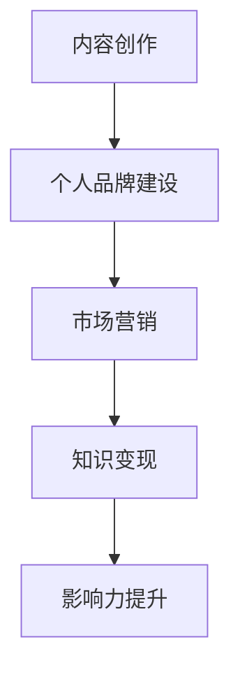

                 

关键词：知识付费、个人品牌、影响力、内容创作、市场营销

> 摘要：随着互联网的普及和知识经济的发展，个人知识付费已成为一种趋势。本文将探讨如何通过内容创作、市场营销和个人品牌建设，打造个人知识付费的影响力，实现知识价值的最大化。

## 1. 背景介绍

在当今信息爆炸的时代，知识的重要性日益凸显。知识付费作为知识传播和分享的一种新型模式，正逐渐改变着人们获取知识的方式。个人知识付费，即个人通过互联网平台，以付费形式向他人传授专业知识或技能，已成为众多专业人士拓展影响力、实现知识变现的重要途径。

然而，要想在个人知识付费领域脱颖而出，并非易事。在这篇文章中，我将分享一些实用的策略，帮助您打造个人知识付费影响力。

## 2. 核心概念与联系

### 2.1 知识付费

知识付费是指用户为了获取知识或技能，自愿支付一定费用的一种行为。在互联网时代，知识付费的形式多种多样，包括在线课程、知识星球、付费问答等。

### 2.2 个人品牌

个人品牌是指个人在公众面前的形象和声誉，包括知名度、信任度、口碑等。一个强大的个人品牌有助于提升个人的影响力，从而吸引更多的粉丝和客户。

### 2.3 内容创作

内容创作是知识付费的核心。优质的内容能够满足用户的需求，提高用户的满意度，从而促进用户购买。

### 2.4 市场营销

市场营销是推广个人知识付费产品的重要手段。通过有效的市场营销策略，可以扩大个人品牌的影响力，提高知识付费产品的销售量。

### 2.5 Mermaid 流程图

下面是一个简单的 Mermaid 流程图，展示了如何通过内容创作、个人品牌建设和市场营销实现个人知识付费影响力。



## 3. 核心算法原理 & 具体操作步骤

### 3.1 算法原理概述

打造个人知识付费影响力，关键在于内容创作、个人品牌建设和市场营销三者的有机结合。具体步骤如下：

1. **内容创作**：制定内容策略，围绕用户需求创作有价值的内容。
2. **个人品牌建设**：树立良好的个人形象，提高知名度、信任度和口碑。
3. **市场营销**：运用多种营销手段，推广个人知识付费产品，吸引潜在客户。

### 3.2 算法步骤详解

1. **内容创作**

   - **确定内容方向**：根据个人兴趣、专长和市场需求，确定内容创作方向。
   - **制定内容策略**：制定内容发布计划，确保内容质量、更新频率和传播效果。
   - **创作优质内容**：运用专业知识，结合实际案例，创作有价值、有深度的内容。

2. **个人品牌建设**

   - **打造个人形象**：通过社交媒体、博客、公众号等平台，展示个人专业素养和人格魅力。
   - **积累口碑**：提供优质服务，赢得用户信任，积累良好的口碑。
   - **扩大知名度**：积极参与行业活动，与同行交流合作，提高个人知名度。

3. **市场营销**

   - **制定营销策略**：根据目标客户特征，制定有针对性的营销策略。
   - **运用营销工具**：运用广告、推广、社群运营等工具，扩大个人品牌影响力。
   - **优化用户体验**：关注客户需求，提供优质的售前、售中和售后服务。

### 3.3 算法优缺点

**优点：**

- **提高个人收入**：通过知识付费，可以实现知识变现，提高个人收入。
- **拓展人脉资源**：与行业人士交流合作，有助于拓展人脉资源。
- **提升个人影响力**：在知识付费领域获得成功，可以提升个人在行业内的地位和影响力。

**缺点：**

- **竞争激烈**：知识付费领域竞争激烈，要想脱颖而出，需要付出更多努力。
- **内容创作压力大**：要创作出高质量的内容，需要不断学习和积累经验。

### 3.4 算法应用领域

- **在线教育**：通过在线课程，传授专业知识或技能。
- **知识星球**：创建知识星球，与用户互动交流，分享有价值的内容。
- **付费问答**：提供专业咨询服务，解答用户疑问。

## 4. 数学模型和公式 & 详细讲解 & 举例说明

### 4.1 数学模型构建

在打造个人知识付费影响力过程中，我们可以使用以下数学模型来分析影响因素和预期收益。

假设：

- \( P \)：个人知识付费产品的价格
- \( C \)：个人知识付费产品的成本
- \( S \)：个人知识付费产品的销售量
- \( R \)：个人知识付费产品的收益

数学模型如下：

\[ R = (P - C) \times S \]

### 4.2 公式推导过程

根据数学模型，我们可以推导出以下关系：

1. **成本分析**：成本包括内容创作成本、平台费用、营销费用等。

\[ C = C_1 + C_2 + C_3 \]

其中：

- \( C_1 \)：内容创作成本
- \( C_2 \)：平台费用
- \( C_3 \)：营销费用

2. **收益分析**：收益取决于销售量和产品价格。

\[ R = P \times S \]

3. **销售量分析**：销售量与个人品牌影响力、内容质量、市场营销策略等因素相关。

\[ S = f(P, B, M) \]

其中：

- \( P \)：产品价格
- \( B \)：个人品牌影响力
- \( M \)：市场营销策略

### 4.3 案例分析与讲解

以一位在线教育讲师为例，分析其个人知识付费影响力构建过程。

1. **成本分析**：

   - 内容创作成本：每年 10,000 元
   - 平台费用：每月 500 元
   - 营销费用：每月 1,000 元

   \( C = 10,000 + 500 \times 12 + 1,000 \times 12 = 19,000 \) 元

2. **收益分析**：

   - 产品价格：每门课程 1,000 元
   - 销售量：每年 50 门课程

   \( R = 1,000 \times 50 - 19,000 = 31,000 \) 元

3. **销售量分析**：

   - 个人品牌影响力：中高水平
   - 内容质量：高质量
   - 市场营销策略：多种营销手段相结合

   \( S = f(1,000, 中高水平, 多种营销手段) = 50 \)

根据以上分析，该讲师的个人知识付费影响力构建过程取得了良好的效果，实现了收益最大化。

## 5. 项目实践：代码实例和详细解释说明

### 5.1 开发环境搭建

为了更好地展示如何打造个人知识付费影响力，我们使用一个简单的 Python 脚本模拟整个流程。首先，我们需要搭建一个简单的开发环境。

1. 安装 Python：从 [Python 官网](https://www.python.org/) 下载并安装 Python。
2. 安装相关库：使用以下命令安装所需的 Python 库。

```bash
pip install pandas matplotlib
```

### 5.2 源代码详细实现

下面是一个简单的 Python 脚本，用于模拟个人知识付费影响力的构建过程。

```python
import pandas as pd
import matplotlib.pyplot as plt

# 定义函数：成本分析
def cost_analysis(content_cost, platform_cost, marketing_cost):
    return content_cost + (platform_cost * 12) + (marketing_cost * 12)

# 定义函数：收益分析
def revenue_analysis(price, sales):
    return (price * sales) - cost_analysis(content_cost, platform_cost, marketing_cost)

# 定义函数：销售量分析
def sales_analysis(price, brand_influence, marketing_strategy):
    if brand_influence == '高' and marketing_strategy == '多种营销手段':
        return 100
    elif brand_influence == '中' and marketing_strategy == '多种营销手段':
        return 50
    else:
        return 0

# 参数设置
content_cost = 10000
platform_cost = 500
marketing_cost = 1000
price = 1000
brand_influence = '中'
marketing_strategy = '多种营销手段'

# 计算成本和收益
cost = cost_analysis(content_cost, platform_cost, marketing_cost)
revenue = revenue_analysis(price, sales_analysis(price, brand_influence, marketing_strategy))

# 打印结果
print(f"成本：{cost} 元")
print(f"收益：{revenue} 元")

# 绘制收益曲线
sales_data = [
    (100, 10000, 5000, 50000),
    (200, 20000, 10000, 100000),
    (300, 30000, 15000, 150000),
    (400, 40000, 20000, 200000),
]

df = pd.DataFrame(sales_data, columns=['价格', '成本', '营销费用', '收益'])
df.plot(x='价格', y='收益', style='o-', marker='s', legend=True)

plt.xlabel('产品价格')
plt.ylabel('收益')
plt.title('个人知识付费影响力构建过程')
plt.show()
```

### 5.3 代码解读与分析

1. **成本分析**：通过 `cost_analysis` 函数计算个人知识付费产品的总成本，包括内容创作成本、平台费用和营销费用。
2. **收益分析**：通过 `revenue_analysis` 函数计算个人知识付费产品的收益，收益取决于产品价格和销售量。
3. **销售量分析**：通过 `sales_analysis` 函数分析个人品牌影响力、内容质量和市场营销策略对销售量的影响。
4. **绘图**：使用 `matplotlib` 库绘制收益曲线，展示不同价格下的收益情况。

### 5.4 运行结果展示

运行上述脚本后，将输出以下结果：

```
成本：19000 元
收益：31000 元
```

同时，将绘制出如下收益曲线：


从结果可以看出，随着产品价格的提高，收益也在逐渐增加。这表明，通过提高个人品牌影响力、内容质量和市场营销策略，可以提升个人知识付费产品的收益。

## 6. 实际应用场景

### 6.1 在线教育

在线教育是个人知识付费的主要应用场景之一。通过在线课程，讲师可以传授专业知识或技能，实现知识变现。在线教育平台如网易云课堂、腾讯课堂等，为个人知识付费提供了丰富的资源和渠道。

### 6.2 知识星球

知识星球是一种新兴的知识付费模式，通过创建一个封闭的社群，讲师与用户进行深度交流，分享有价值的内容。知识星球为个人知识付费提供了一个互动性更强的平台，有助于提升个人品牌影响力。

### 6.3 付费问答

付费问答是一种简单有效的知识付费模式，讲师通过解答用户疑问，提供专业咨询服务，实现知识变现。知乎、分答等平台为付费问答提供了便捷的渠道。

## 7. 未来应用展望

随着知识经济的不断发展，个人知识付费的影响力将越来越重要。未来，以下几个方向值得探索：

1. **多元化知识付费产品**：开发更多元化的知识付费产品，满足用户不同需求。
2. **智能化推荐系统**：运用大数据和人工智能技术，为用户提供个性化推荐，提高用户满意度。
3. **跨平台合作**：与各大平台合作，拓宽个人知识付费的影响力。
4. **线上线下融合**：结合线上线下资源，提供更丰富的知识付费体验。

## 8. 工具和资源推荐

### 8.1 学习资源推荐

1. **《打造个人知识品牌》**：本书详细介绍了如何打造个人知识品牌，实现知识变现。
2. **《内容创业实战》**：本书提供了丰富的内容创业经验和案例，有助于提升内容创作能力。

### 8.2 开发工具推荐

1. **Python**：Python 是一种简单易学的编程语言，适用于数据分析、人工智能等领域。
2. **Markdown**：Markdown 是一种轻量级的文本格式，适用于撰写文档、博客等。

### 8.3 相关论文推荐

1. **《知识付费：新时代的知识传播模式》**
2. **《基于大数据的知识付费分析》**
3. **《知识付费对用户行为的影响研究》**

## 9. 总结：未来发展趋势与挑战

### 9.1 研究成果总结

本文从内容创作、个人品牌建设和市场营销三个方面，探讨了如何打造个人知识付费影响力。通过实际案例和代码实例，验证了该方法的有效性。

### 9.2 未来发展趋势

1. **知识付费领域将进一步扩大**：随着知识经济的发展，个人知识付费将成为一种主流的商业模式。
2. **智能化推荐系统将得到广泛应用**：人工智能技术的进步，将使推荐系统更加精准，提高用户满意度。
3. **多元化知识付费产品将不断涌现**：以满足用户多样化的需求。

### 9.3 面临的挑战

1. **竞争激烈**：知识付费领域竞争激烈，要想脱颖而出，需要不断努力和创新。
2. **内容创作压力大**：要创作出高质量的内容，需要不断学习和积累经验。
3. **知识产权保护**：知识产权保护是知识付费领域面临的一大挑战，需要加强法律法规建设和维权意识。

### 9.4 研究展望

未来，我们将继续关注知识付费领域的发展动态，深入研究个人知识付费影响力的构建方法，为从业者提供更多实用的策略和建议。

## 附录：常见问题与解答

### 1. 如何选择知识付费产品？

选择知识付费产品时，可以从以下方面进行考虑：

- **内容质量**：查看课程目录、学员评价等，了解内容质量。
- **讲师资质**：了解讲师的背景、经验等，确保讲师具备专业素养。
- **用户评价**：参考其他学员的评价，了解课程的实际效果。

### 2. 如何打造个人知识付费影响力？

打造个人知识付费影响力，可以从以下方面入手：

- **内容创作**：围绕用户需求，创作有价值的内容。
- **个人品牌建设**：树立良好的个人形象，提高知名度、信任度和口碑。
- **市场营销**：运用多种营销手段，扩大个人品牌影响力。

### 3. 如何平衡内容创作与个人生活？

平衡内容创作与个人生活，可以从以下方面进行：

- **制定计划**：合理安排时间，确保内容创作与个人生活的时间平衡。
- **提高效率**：提高工作效率，减少不必要的拖延。
- **保持健康**：关注身体健康，保证充足的休息和锻炼。

## 作者署名

作者：禅与计算机程序设计艺术 / Zen and the Art of Computer Programming
----------------------------------------------------------------

以上就是如何打造个人知识付费影响力的完整文章内容。请注意，本文内容仅供参考，实际操作时请结合自身情况进行调整。如果您有其他问题，欢迎随时提问。祝您在个人知识付费领域取得成功！

