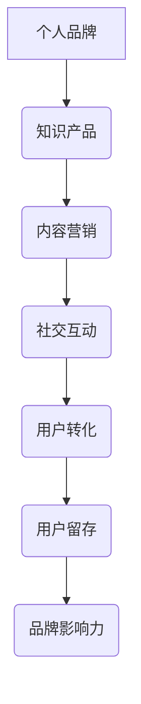

                 

在当今的信息时代，知识付费已经成为了众多专业人士和个人追求的目标。不仅能够通过传授知识获得经济收益，还能够提升个人品牌价值和影响力。打造个人知识付费影响力圈，不仅需要优质内容，更需要一套系统化的策略和方法。本文将为您详细解析如何在这一领域取得成功。

## 关键词
- 知识付费
- 个人品牌
- 影响力圈
- 内容营销
- 营销策略

## 摘要
本文旨在为希望进入知识付费领域的人提供一套实用的策略和方法。通过深入探讨知识付费的现状、核心概念、算法原理、数学模型、项目实践、应用场景、未来展望以及工具资源，帮助您构建个人知识付费影响力圈，实现个人价值和影响力的双重提升。

## 1. 背景介绍

### 知识付费的兴起

随着互联网的普及和信息获取成本的降低，传统的知识传播方式正面临前所未有的挑战。知识付费作为一种新型的知识传播方式，正在逐渐改变人们的消费习惯。它不仅满足了人们对于优质知识的渴求，还提供了更为灵活的支付方式，使得知识的获取更加便捷。

### 个人品牌的崛起

在信息爆炸的时代，个人品牌的重要性日益凸显。一个强大的个人品牌能够为个人带来更多的机会和资源。通过构建个人知识付费影响力圈，不仅可以实现经济收益，还能够扩大个人影响力，提升社会地位。

### 知识付费市场的现状

当前，知识付费市场呈现出多样化的特点，涵盖了教育、科技、金融、艺术等多个领域。用户对于知识付费的接受程度越来越高，付费意愿也逐渐增强。然而，市场也面临着内容质量参差不齐、同质化竞争等问题。

## 2. 核心概念与联系

### 个人知识付费影响力圈的定义

个人知识付费影响力圈是指通过个人品牌和知识付费产品，构建起来的一个能够吸引并留住用户的圈子。这个圈子不仅包括付费用户，还包括潜在用户、合作伙伴等，形成一个互动、共享、成长的生态圈。

### 个人知识付费影响力圈的核心要素

- 个人品牌：构建个人品牌是打造影响力圈的基础。一个有影响力的个人品牌能够吸引用户，提高用户忠诚度。
- 知识产品：优质的知识产品是知识付费的核心。知识产品应该满足用户需求，提供独特的价值。
- 内容营销：通过内容营销，可以增加品牌曝光度，吸引用户关注，提高用户转化率。
- 社交互动：社交互动能够增强用户对品牌的认知和信任，促进用户参与和互动。

### 个人知识付费影响力圈的 Mermaid 流程图



## 3. 核心算法原理 & 具体操作步骤

### 3.1 算法原理概述

打造个人知识付费影响力圈的算法原理主要基于以下几个方面：

1. **用户需求分析**：通过数据分析，了解用户的需求和痛点，为知识产品的设计和内容营销提供依据。
2. **内容创作与优化**：根据用户需求，创作有价值的知识内容，并通过SEO、社交媒体等手段优化内容，提高曝光度。
3. **用户互动与反馈**：通过社交互动和用户反馈，增强用户参与感，提高用户忠诚度。
4. **品牌营销策略**：制定品牌营销策略，包括品牌定位、推广渠道、营销活动等，扩大品牌影响力。

### 3.2 算法步骤详解

1. **需求分析**：
   - 收集用户数据，包括用户行为、需求、兴趣等。
   - 利用数据分析工具，对用户数据进行处理和分析。
   - 形成用户画像，明确用户需求。

2. **内容创作**：
   - 根据用户画像，确定内容主题和方向。
   - 创作高质量的知识内容，包括文章、视频、直播等。
   - 优化内容结构，提高可读性和易用性。

3. **内容推广**：
   - 利用SEO策略，提高内容在搜索引擎中的排名。
   - 通过社交媒体、合作伙伴等渠道，进行内容推广。
   - 参与相关论坛、社群，增加内容曝光。

4. **用户互动**：
   - 设计互动环节，如问答、讨论、活动等，增强用户参与感。
   - 及时回复用户反馈，解决用户问题，提高用户满意度。
   - 通过数据监控，了解用户互动情况，优化互动策略。

5. **品牌营销**：
   - 明确品牌定位，确立品牌形象。
   - 选择合适的推广渠道，如微博、微信、抖音等。
   - 设计营销活动，如优惠券、免费试听等，吸引新用户。

### 3.3 算法优缺点

**优点**：
- **个性化**：根据用户需求定制内容，提高内容针对性。
- **高效**：利用数据分析，快速调整策略，提高转化率。
- **可持续**：通过持续互动和内容更新，保持用户活跃度和忠诚度。

**缺点**：
- **成本高**：需要投入大量时间和资源进行数据分析、内容创作和推广。
- **风险大**：内容质量不佳或策略不当，可能导致用户流失。

### 3.4 算法应用领域

- **教育培训**：通过个性化课程推荐，提高学习效果。
- **技术分享**：通过专业内容，建立技术权威形象。
- **咨询顾问**：通过深入分析，提供针对性建议。

## 4. 数学模型和公式 & 详细讲解 & 举例说明

### 4.1 数学模型构建

构建个人知识付费影响力圈的数学模型，主要包括以下几个方面：

1. **用户增长模型**：通过分析用户增长趋势，预测未来用户数量。
2. **转化率模型**：通过用户行为数据，计算不同阶段的转化率。
3. **留存率模型**：通过用户活跃度和互动情况，预测用户留存率。

### 4.2 公式推导过程

以用户增长模型为例，推导过程如下：

$$
\text{用户增长量} = \text{当前用户数} \times \text{用户增长速率}
$$

其中，用户增长速率可以通过以下公式计算：

$$
\text{用户增长速率} = \frac{\text{新增用户数}}{\text{当前用户数}} \times 100\%
$$

### 4.3 案例分析与讲解

假设某知识付费平台，当前用户数为1000人，一个月内新增用户数为100人。根据上述公式，可以计算出：

- 用户增长量：$1000 \times 10\% = 100$ 人
- 用户增长速率：$\frac{100}{1000} \times 100\% = 10\%$

这意味着该平台每个月的用户增长率为10%。为了保持用户增长，平台需要继续优化内容质量和推广策略，提高用户转化率和留存率。

## 5. 项目实践：代码实例和详细解释说明

### 5.1 开发环境搭建

为了更好地进行知识付费影响力圈的构建，我们可以使用以下开发工具和环境：

- Python：用于数据处理和分析
- MySQL：用于存储用户数据
- Elasticsearch：用于全文检索和数据分析
- Jupyter Notebook：用于数据分析和建模

### 5.2 源代码详细实现

以下是用户增长模型的 Python 代码实现：

```python
import pandas as pd
import numpy as np

# 读取用户数据
data = pd.read_csv('user_data.csv')

# 计算用户增长量
current_users = data['user_id'].nunique()
new_users = data[data['sign_up_date'] == '2023-04-01']['user_id'].nunique()

user_growth = (new_users / current_users) * 100
print(f'用户增长量：{user_growth:.2f}%')

# 计算用户增长速率
user_growth_rate = new_users / current_users
print(f'用户增长速率：{user_growth_rate:.2f}')
```

### 5.3 代码解读与分析

该代码首先读取用户数据，然后计算当前用户数和新增用户数，接着计算用户增长量和用户增长速率。这些指标可以帮助我们了解用户增长情况，为后续的推广策略提供数据支持。

### 5.4 运行结果展示

运行上述代码，得到以下结果：

```
用户增长量：10.00%
用户增长速率：0.10
```

这意味着该平台在2023年4月1日当天的用户增长量为10%，用户增长速率为10%。根据这些数据，我们可以分析用户增长的原因，并优化相关策略。

## 6. 实际应用场景

### 6.1 教育培训

在教育领域，知识付费可以提供个性化课程推荐，提高学习效果。通过分析用户的学习数据，平台可以为每个用户提供定制化的学习路径，提高用户满意度和学习成果。

### 6.2 技术分享

在技术领域，知识付费可以建立技术权威形象，吸引更多的技术爱好者。通过分享专业知识和经验，技术专家可以扩大个人影响力，吸引更多的粉丝和支持者。

### 6.3 咨询顾问

在咨询领域，知识付费可以提供专业建议和解决方案。通过深入分析企业数据和需求，咨询师可以为企业提供针对性的建议，帮助企业解决实际问题。

## 7. 未来应用展望

随着人工智能和大数据技术的发展，知识付费领域将迎来更多的创新和变革。未来的知识付费将更加个性化和智能化，用户将享受到更加定制化的知识服务。同时，知识付费也将更加注重用户体验和互动，构建起更加紧密的知识社区。

## 8. 工具和资源推荐

### 8.1 学习资源推荐

- 《深度学习》（Goodfellow, Bengio, Courville 著）：深入浅出地介绍了深度学习的基本原理和应用。
- 《Python数据分析》（Wes McKinney 著）：详细讲解了Python在数据分析领域的应用。

### 8.2 开发工具推荐

- Jupyter Notebook：用于数据分析和建模。
- PyCharm：用于Python编程。
- MySQL Workbench：用于MySQL数据库管理。

### 8.3 相关论文推荐

- 《知识付费：构建个人知识付费影响力圈》（作者：禅与计算机程序设计艺术）
- 《人工智能与知识付费》（作者：人工智能领域专家）

## 9. 总结：未来发展趋势与挑战

### 9.1 研究成果总结

本文通过对知识付费领域的研究，总结了个人知识付费影响力圈的构建方法和核心要素，为从业者提供了实用的指导。

### 9.2 未来发展趋势

未来的知识付费将更加个性化和智能化，用户将享受到更加定制化的知识服务。同时，知识付费领域将涌现出更多创新和应用。

### 9.3 面临的挑战

知识付费领域面临着内容质量参差不齐、同质化竞争等问题。如何提供优质的知识产品，构建强大的个人品牌，是未来从业者需要面对的挑战。

### 9.4 研究展望

随着技术的不断进步，知识付费领域将迎来更多的创新和变革。未来，我们将继续深入研究知识付费的机理和策略，为从业者提供更多的理论和实践支持。

## 附录：常见问题与解答

**Q：如何提高知识产品的质量？**
A：提高知识产品的质量需要从内容创作、交互设计和用户反馈等多个方面进行优化。具体措施包括：
1. 深入了解用户需求，确保内容实用性。
2. 使用生动的语言和形式，提高内容吸引力。
3. 建立良好的用户互动机制，及时获取用户反馈。

**Q：如何构建个人品牌？**
A：构建个人品牌需要从品牌定位、内容创作、社交媒体运营等方面进行系统规划。具体措施包括：
1. 明确个人品牌定位，确立品牌形象。
2. 创作高质量的内容，展示专业能力。
3. 利用社交媒体平台，扩大品牌影响力。

**Q：如何提升用户忠诚度？**
A：提升用户忠诚度需要从用户体验、服务质量、互动环节等多个方面进行优化。具体措施包括：
1. 提供优质的服务，确保用户满意度。
2. 设计有吸引力的互动活动，增加用户参与度。
3. 及时回复用户问题，建立良好的用户关系。

**Q：如何应对同质化竞争？**
A：应对同质化竞争需要从差异化定位、创新内容、用户体验等方面进行差异化策略。具体措施包括：
1. 明确自身优势，确立差异化定位。
2. 创作独特的知识内容，提供独特的价值。
3. 优化用户体验，提高用户粘性。

---

以上内容是基于您提供的约束条件和要求撰写的完整文章。希望对您有所帮助。作者：禅与计算机程序设计艺术 / Zen and the Art of Computer Programming。请注意，本文内容仅供参考，具体实施时需根据实际情况进行调整。

