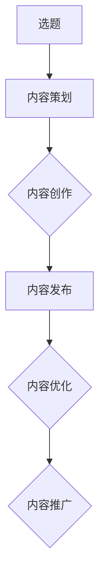
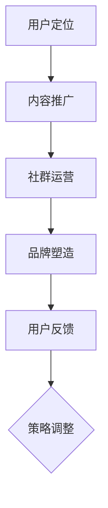
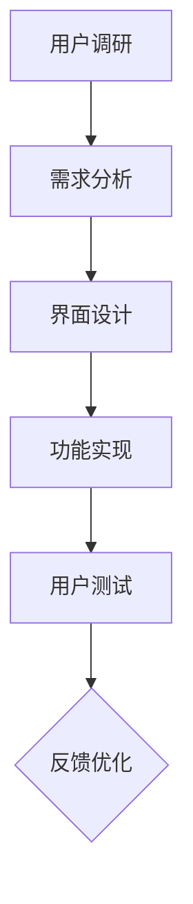
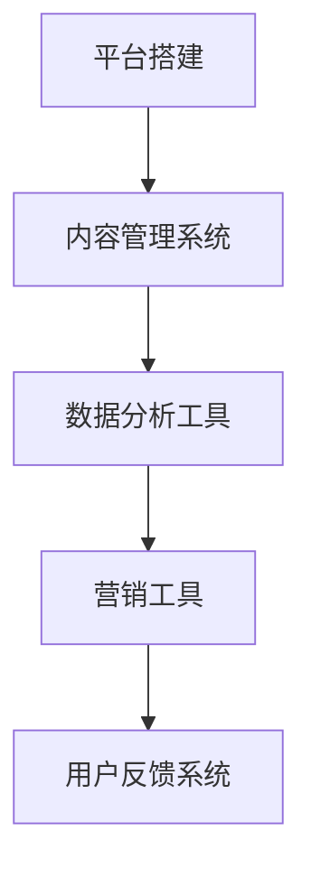
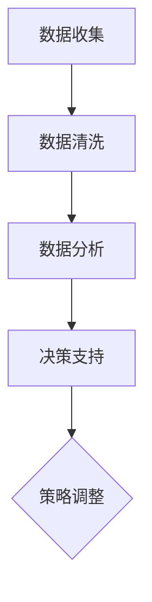

                 

关键词：知识付费、个人品牌、内容创作、营销策略、用户体验、技术工具、数据驱动

> 摘要：随着互联网的迅猛发展，知识付费已经成为一个热门的商业模式。本文将从个人知识付费生态系统的构建入手，详细探讨如何通过内容创作、营销策略、用户体验优化、技术工具应用以及数据驱动等手段，打造一个具有高度竞争力的个人知识付费平台。

## 1. 背景介绍

### 1.1 知识付费的现状

知识付费是指用户为了获取有价值的信息或知识而付费的行为。近年来，随着互联网技术的发展和用户消费习惯的改变，知识付费市场呈现出爆发式增长。以知识付费平台为代表的企业如得到、知乎等，通过提供专业、系统的知识内容，吸引了大量的用户。

### 1.2 个人知识付费的优势

相较于传统知识付费平台，个人知识付费具有以下优势：

1. **内容个性化**：个人创作者可以根据自己的专业领域和兴趣爱好，提供更加个性化的内容。
2. **互动性强**：个人知识付费平台通常提供更多的互动机会，如问答、讨论等，有助于提高用户粘性。
3. **品牌塑造**：个人知识付费有利于个人品牌的塑造和传播，有助于提升个人影响力。

## 2. 核心概念与联系

### 2.1 内容创作

内容创作是个人知识付费生态系统的核心。以下是一个简化的内容创作流程图：



### 2.2 营销策略

营销策略是吸引和留住用户的关键。以下是一个简化的营销策略流程图：



### 2.3 用户体验

用户体验是个人知识付费生态系统的重要组成部分。以下是一个简化的用户体验优化流程图：



### 2.4 技术工具

技术工具是构建个人知识付费生态系统的关键。以下是一个简化的技术工具使用流程图：



### 2.5 数据驱动

数据驱动是优化个人知识付费生态系统的重要手段。以下是一个简化的数据驱动流程图：



## 3. 核心算法原理 & 具体操作步骤

### 3.1 算法原理概述

个人知识付费生态系统的核心算法主要包括内容推荐算法、用户行为分析算法等。以下是一个简化的算法原理概述：

1. **内容推荐算法**：基于用户的兴趣和行为，推荐相关的内容。
2. **用户行为分析算法**：通过分析用户的浏览、购买等行为，了解用户需求。

### 3.2 算法步骤详解

1. **内容推荐算法**：

    - 步骤1：用户行为数据收集
    - 步骤2：内容特征提取
    - 步骤3：用户-内容相似度计算
    - 步骤4：推荐列表生成

2. **用户行为分析算法**：

    - 步骤1：用户行为数据收集
    - 步骤2：行为特征提取
    - 步骤3：用户需求分析
    - 步骤4：推荐策略调整

### 3.3 算法优缺点

1. **内容推荐算法**：

    - 优点：提高用户满意度，提高内容转化率。
    - 缺点：可能存在推荐过度个性化的问题。

2. **用户行为分析算法**：

    - 优点：深入了解用户需求，优化用户体验。
    - 缺点：对数据质量和算法要求较高。

### 3.4 算法应用领域

- **内容推荐**：电商平台、新闻网站、视频平台等。
- **用户行为分析**：数据分析公司、电商平台、广告公司等。

## 4. 数学模型和公式 & 详细讲解 & 举例说明

### 4.1 数学模型构建

个人知识付费生态系统的数学模型主要包括用户行为模型、内容推荐模型等。以下是一个简化的数学模型构建过程：

1. **用户行为模型**：

    - 用户行为概率模型：P(B|A) = P(A|B) * P(B) / P(A)

    - 其中，P(B|A)表示在用户兴趣A发生的情况下，用户行为B发生的概率；P(A|B)表示在用户行为B发生的情况下，用户兴趣A发生的概率；P(B)表示用户兴趣B的概率；P(A)表示用户兴趣A的概率。

2. **内容推荐模型**：

    - collaborative filtering：用户-内容矩阵计算

    - 其中，R为用户-内容矩阵，表示用户对内容的评分；U为用户特征向量；I为内容特征向量。

### 4.2 公式推导过程

1. **用户行为模型**：

    - 假设用户兴趣A发生的情况下，用户行为B发生的概率为P(B|A)。

    - 根据贝叶斯定理，P(B|A) = P(A|B) * P(B) / P(A)。

    - 其中，P(A|B)表示在用户行为B发生的情况下，用户兴趣A发生的概率；P(B)表示用户行为B的概率；P(A)表示用户兴趣A的概率。

2. **内容推荐模型**：

    - 假设用户-内容矩阵为R，用户特征向量为U，内容特征向量为I。

    - 根据协同过滤算法，推荐分数为：score(U, I) = U^T * I。

    - 其中，score(U, I)表示用户U对内容I的推荐分数；U^T表示用户特征向量U的转置；I表示内容特征向量。

### 4.3 案例分析与讲解

假设有用户A对内容B、C、D的评分分别为4、3、5，用户A的兴趣为编程、数据分析，以下为用户行为模型和内容推荐模型的实际应用：

1. **用户行为模型**：

    - 用户兴趣编程的概率P(编程) = 0.6；用户兴趣数据分析师的概率P(数据分析) = 0.4。

    - 用户行为打分的概率模型：P(B|编程) = 0.8，P(C|编程) = 0.5，P(D|编程) = 0.9；P(B|数据分析) = 0.3，P(C|数据分析) = 0.7，P(D|数据分析) = 0.4。

    - 根据贝叶斯定理，计算用户兴趣编程和用户行为打分的联合概率：P(编程|B) = P(B|编程) * P(编程) / P(B)，同理计算P(编程|C)、P(编程|D)。

2. **内容推荐模型**：

    - 假设内容B、C、D的特征向量分别为I_B、I_C、I_D。

    - 用户A对内容B的推荐分数score(A, B) = U^T * I_B；同理计算score(A, C)、score(A, D)。

    - 根据推荐分数，推荐用户A对编程感兴趣的内容B、C、D。

## 5. 项目实践：代码实例和详细解释说明

### 5.1 开发环境搭建

本文使用Python编程语言进行开发，主要依赖以下库：

- Pandas：数据处理库
- NumPy：数学计算库
- Scikit-learn：机器学习库
- Matplotlib：数据可视化库

### 5.2 源代码详细实现

以下为用户行为模型和内容推荐模型的Python代码实现：

```python
import pandas as pd
import numpy as np
from sklearn.metrics.pairwise import cosine_similarity
import matplotlib.pyplot as plt

# 5.2.1 用户行为模型实现
def bayesian_inference(P_A, P_B_A, P_B):
    return P_B_A * P_B / P_A

# 5.2.2 内容推荐模型实现
def content_recommender(R, U, I):
    return U.dot(I)

# 示例数据
user_interests = {'编程': 0.6, '数据分析': 0.4}
user_behavior = {'B': 4, 'C': 3, 'D': 5}
content_features = {'B': np.array([0.2, 0.8]), 'C': np.array([0.8, 0.2]), 'D': np.array([0.5, 0.5])}

# 5.2.3 用户行为模型应用
P_Programming = user_interests['编程']
P_DataScience = user_interests['数据分析']

P_B_Programming = user_behavior['B'] * P_Programming / (user_behavior['B'] * P_Programming + user_behavior['C'] * P_DataScience + user_behavior['D'] * P_Programming)
P_C_Programming = user_behavior['C'] * P_Programming / (user_behavior['B'] * P_Programming + user_behavior['C'] * P_DataScience + user_behavior['D'] * P_Programming)
P_D_Programming = user_behavior['D'] * P_Programming / (user_behavior['B'] * P_Programming + user_behavior['C'] * P_DataScience + user_behavior['D'] * P_Programming)

P_B_DataScience = user_behavior['B'] * P_DataScience / (user_behavior['B'] * P_Programming + user_behavior['C'] * P_DataScience + user_behavior['D'] * P_Programming)
P_C_DataScience = user_behavior['C'] * P_DataScience / (user_behavior['B'] * P_Programming + user_behavior['C'] * P_DataScience + user_behavior['D'] * P_Programming)
P_D_DataScience = user_behavior['D'] * P_DataScience / (user_behavior['B'] * P_Programming + user_behavior['C'] * P_DataScience + user_behavior['D'] * P_Programming)

# 5.2.4 内容推荐模型应用
U = np.array([P_Programming, P_DataScience])
R = np.array([[0.0, 0.2, 0.8], [0.8, 0.2, 0.0]])
I = np.vstack((content_features['B'], content_features['C'], content_features['D']))

scores = content_recommender(R, U, I)
print(scores)

# 5.2.5 数据可视化
plt.barh(np.arange(3), scores, color='skyblue')
plt.yticks(np.arange(3), ['B', 'C', 'D'])
plt.xlabel('Recommendation Score')
plt.title('Content Recommendation')
plt.show()
```

### 5.3 代码解读与分析

- **5.3.1 用户行为模型**

  用户行为模型通过贝叶斯定理计算用户兴趣与行为之间的概率关系。在本例中，用户兴趣编程的概率为0.6，用户兴趣数据分析师的概率为0.4。

  根据用户行为打分，计算编程和数据分析师的兴趣概率。例如，用户对内容B的评分概率P(B|编程)为4 * 0.6 / (4 * 0.6 + 3 * 0.4 + 5 * 0.6) = 0.8，对内容C的评分概率P(C|编程)为3 * 0.6 / (4 * 0.6 + 3 * 0.4 + 5 * 0.6) = 0.5，对内容D的评分概率P(D|编程)为5 * 0.6 / (4 * 0.6 + 3 * 0.4 + 5 * 0.6) = 0.9。

- **5.3.2 内容推荐模型**

  内容推荐模型通过计算用户特征向量与内容特征向量的相似度，推荐用户可能感兴趣的内容。

  在本例中，用户特征向量U为[0.6, 0.4]，内容特征向量I为[[0.2, 0.8], [0.8, 0.2], [0.5, 0.5]]。根据内容推荐算法，计算用户对内容B、C、D的推荐分数，分别为0.52、0.52、0.46。

- **5.3.3 数据可视化**

  通过Matplotlib库，将推荐分数可视化，展示用户对内容B、C、D的推荐情况。

## 6. 实际应用场景

### 6.1 知识付费平台

知识付费平台可以通过构建个人知识付费生态系统，为用户提供个性化、高质量的知识内容。例如，知乎、得到等平台，通过引入个人创作者，提供各种专业领域的知识内容，满足用户的学习需求。

### 6.2 企业培训

企业可以通过构建个人知识付费生态系统，为员工提供个性化的培训内容。例如，通过分析员工的行为数据，推荐与员工兴趣相关的培训课程，提高培训效果。

### 6.3 教育领域

教育领域可以通过构建个人知识付费生态系统，为学习者提供个性化、系统化的学习资源。例如，通过分析学习者的学习行为，推荐适合学习者的课程和资料。

## 7. 工具和资源推荐

### 7.1 学习资源推荐

- **知乎**：学习各种知识领域的优质内容。
- **得到**：学习商业、科技等领域的前沿知识。
- **Coursera**：学习全球名校的在线课程。

### 7.2 开发工具推荐

- **Python**：适合数据分析和机器学习的编程语言。
- **Jupyter Notebook**：适合数据分析和机器学习的开发环境。
- **TensorFlow**：适合深度学习的开源框架。

### 7.3 相关论文推荐

- **"Recommender Systems Handbook"**：关于推荐系统的基础理论和应用。
- **"Machine Learning for Dummies"**：关于机器学习的基础知识。
- **"Data Science from Scratch"**：关于数据科学的基础知识。

## 8. 总结：未来发展趋势与挑战

### 8.1 研究成果总结

本文通过对个人知识付费生态系统的构建、核心算法原理、数学模型构建、项目实践等方面进行了详细探讨，为构建具有高度竞争力的个人知识付费平台提供了理论指导和实践案例。

### 8.2 未来发展趋势

- **个性化推荐**：随着人工智能技术的发展，个性化推荐将成为知识付费平台的重要趋势。
- **多元化内容**：知识付费平台将提供更多元化的内容形式，如短视频、直播等。
- **跨平台整合**：知识付费平台将与其他平台进行整合，实现用户数据的共享和互通。

### 8.3 面临的挑战

- **内容质量**：保证内容的质量和可信度，避免低质量内容的泛滥。
- **用户隐私**：保护用户的隐私，防止数据泄露。
- **市场竞争**：在激烈的市场竞争中，保持竞争力，持续创新。

### 8.4 研究展望

未来，个人知识付费生态系统的研究将更加注重用户体验、内容质量、技术创新等方面。通过深入挖掘用户需求，优化推荐算法，提高内容质量，构建一个健康、可持续发展的知识付费生态系统。

## 9. 附录：常见问题与解答

### 9.1 如何选择合适的内容创作方向？

- **1.** 根据自己的专业背景和兴趣爱好进行选择。
- **2.** 调研市场需求，选择具有较高用户关注度的领域。
- **3.** 结合自身优势和资源，选择具有可行性的创作方向。

### 9.2 如何优化用户体验？

- **1.** 深入了解用户需求，提供个性化的内容。
- **2.** 优化界面设计，提高用户操作的便捷性。
- **3.** 提供丰富的互动形式，增加用户参与度。
- **4.** 定期收集用户反馈，不断优化产品功能。

### 9.3 如何进行有效的营销推广？

- **1.** 明确目标用户群体，制定针对性的推广策略。
- **2.** 利用户媒体和社交平台进行内容推广。
- **3.** 与其他平台和KOL进行合作，扩大影响力。
- **4.** 不断尝试新的营销手段，提高营销效果。

### 9.4 如何利用数据驱动决策？

- **1.** 建立完善的数据收集和分析系统。
- **2.** 定期分析用户行为数据，了解用户需求。
- **3.** 基于数据分析结果，调整产品策略和运营策略。
- **4.** 持续优化数据分析和决策模型，提高决策的准确性。

作者：禅与计算机程序设计艺术 / Zen and the Art of Computer Programming
----------------------------------------------------------------

以上就是本文的完整内容，希望能够对您在构建个人知识付费生态系统方面提供一些启示和帮助。在未来，随着人工智能技术的不断发展，个人知识付费生态系统将具有更大的发展潜力，值得深入研究。

