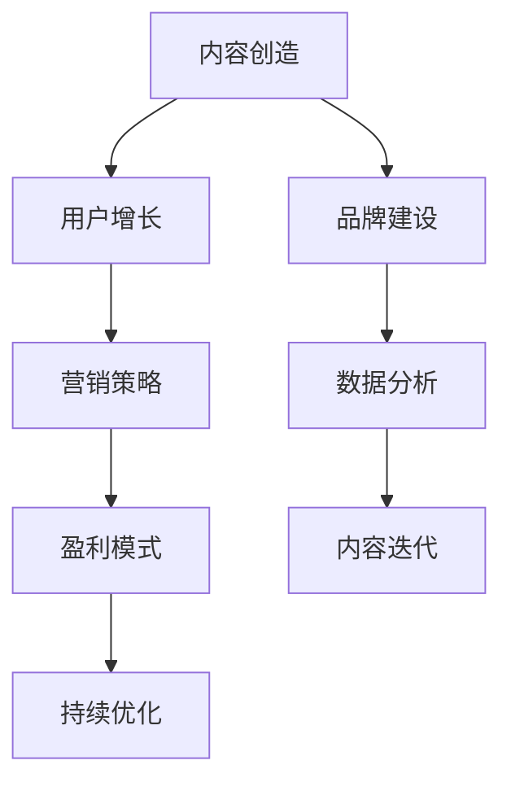

                 

关键词：知识付费、个人品牌、内容创造、营销策略、用户增长、盈利模式

> 摘要：本文将探讨如何构建一个成功的个人知识付费矩阵。我们将深入分析知识付费市场的现状，阐述构建个人知识付费矩阵的核心概念，并提供具体的策略和工具，帮助您打造一个可持续发展的个人知识付费业务。

## 1. 背景介绍

知识付费作为一种新型的商业模式，近年来在全球范围内迅速兴起。随着互联网的普及和信息的爆炸式增长，用户对优质、专业知识的渴求日益增强。知识付费平台如雨后春笋般涌现，如得到、知乎Live、分答等，为知识分享者和消费者提供了便捷的交流渠道。

在这个背景下，许多专业人士和个人开始探索知识付费作为增加收入和塑造个人品牌的新途径。然而，如何构建一个有效的知识付费矩阵，实现持续的内容创造和用户增长，成为了许多人的困惑。本文旨在为读者提供一套系统化的策略，帮助您打造个人知识付费矩阵。

### 1.1 市场现状

- **用户需求**：随着信息过载，用户更倾向于寻求高质量、有针对性的知识内容。
- **内容形式**：文本、音频、视频、直播等多种形式并存，满足不同用户的需求。
- **平台竞争**：各大平台竞争激烈，内容创作者需要找准自己的定位。

### 1.2 个人知识付费的优势

- **高自由度**：创作者可以自由选择内容主题、形式和更新频率。
- **潜在收益**：通过知识变现，实现收入的多元化。
- **品牌建设**：通过持续的内容输出，提升个人品牌价值和影响力。

### 1.3 个人知识付费的挑战

- **内容质量**：需要持续产出高质量的内容，保持用户粘性。
- **市场定位**：找准目标用户群体，避免盲目跟风。
- **时间管理**：平衡内容创造与个人其他事务，确保持续产出。

## 2. 核心概念与联系

构建个人知识付费矩阵，需要理解以下几个核心概念：

### 2.1 内容创造

- **内容类型**：根据个人专长和用户需求，确定内容主题。
- **内容形式**：结合文本、音频、视频等多种形式，丰富内容体验。
- **内容更新**：定期更新内容，保持用户活跃度。

### 2.2 用户增长

- **定位目标用户**：分析目标用户群体的特征和需求。
- **引流策略**：通过SEO、社交媒体推广等方式吸引潜在用户。
- **用户互动**：通过评论、问答等互动形式，增强用户粘性。

### 2.3 营销策略

- **品牌定位**：明确个人品牌形象，塑造专业、可信的品牌印象。
- **推广渠道**：利用多种推广手段，扩大品牌影响力。
- **价格策略**：根据内容价值和市场需求，制定合理的价格策略。

### 2.4 盈利模式

- **直接销售**：通过平台直接销售课程、电子书、专栏等。
- **会员制度**：建立会员制度，提供专属内容和服务。
- **广告合作**：与相关品牌合作，进行内容植入和广告推广。

### 2.5 架构图

以下是个人知识付费矩阵的架构图：



## 3. 核心算法原理 & 具体操作步骤

### 3.1 算法原理概述

构建个人知识付费矩阵，关键在于找到合适的算法，以最大化内容创造、用户增长和盈利。以下是一种基于数据驱动的算法模型：

- **内容推荐算法**：根据用户行为和偏好，推荐相关内容。
- **用户分群算法**：根据用户特征和行为，划分不同用户群体。
- **定价算法**：基于内容质量和市场需求，动态调整价格。

### 3.2 算法步骤详解

#### 3.2.1 内容推荐算法

1. **数据收集**：收集用户行为数据，如浏览记录、购买历史等。
2. **特征提取**：从数据中提取关键特征，如用户ID、内容标签等。
3. **模型训练**：利用机器学习算法，训练推荐模型。
4. **模型评估**：评估模型效果，如准确率、召回率等。
5. **内容推荐**：根据模型预测，为用户推荐相关内容。

#### 3.2.2 用户分群算法

1. **数据收集**：收集用户行为数据，如浏览记录、购买历史等。
2. **特征提取**：从数据中提取关键特征，如用户ID、内容标签等。
3. **聚类算法**：使用聚类算法，如K-means，对用户进行分群。
4. **群组分析**：分析不同群组的特征和需求，提供个性化服务。

#### 3.2.3 定价算法

1. **内容评估**：根据内容质量和市场需求，评估内容价值。
2. **价格调整**：基于内容价值，动态调整价格。
3. **市场反馈**：收集市场反馈，调整价格策略。

### 3.3 算法优缺点

- **优点**：能够提高内容推荐的准确性，优化用户体验，提高盈利。
- **缺点**：需要大量的数据和计算资源，模型训练和优化成本较高。

### 3.4 算法应用领域

- **在线教育**：根据用户需求和兴趣，推荐相关课程。
- **电商**：根据用户行为，推荐相关商品。
- **社交媒体**：为用户提供个性化内容推荐。

## 4. 数学模型和公式 & 详细讲解 & 举例说明

### 4.1 数学模型构建

在构建个人知识付费矩阵时，我们可以使用一些数学模型来指导内容创造、用户增长和盈利策略。

#### 4.1.1 演化博弈论模型

- **基本概念**：演化博弈论是一种研究在动态环境中，个体如何在竞争中合作、共存的理论。
- **模型构建**：通过构建演化博弈模型，分析用户和知识创作者之间的互动策略。

#### 4.1.2 用户生命周期价值模型

- **基本概念**：用户生命周期价值（Customer Lifetime Value，CLV）是指一个用户在生命周期内为企业带来的总收益。
- **模型构建**：通过分析用户行为数据，预测用户的CLV，从而制定相应的营销策略。

### 4.2 公式推导过程

#### 4.2.1 演化博弈论模型公式

假设有两个参与者：用户和知识创作者。

- **用户策略**：选择“合作”或“背叛”。
- **创作者策略**：选择“投资”或“节省”。

演化博弈论的基本公式如下：

\[ \Delta U = r_1 u - r_2 v \]

其中，\( r_1 \) 和 \( r_2 \) 分别为用户合作和背叛的收益，\( u \) 和 \( v \) 分别为创作者投资和节省的收益。

#### 4.2.2 用户生命周期价值模型公式

\[ CLV = \sum_{t=1}^{n} \frac{R_t}{(1+r)^t} \]

其中，\( R_t \) 为用户在 \( t \) 时期的收益，\( r \) 为折现率。

### 4.3 案例分析与讲解

#### 4.3.1 演化博弈论模型案例

假设一个知识创作者，在决定是否投资内容创造时，需要考虑用户的行为。

- **用户策略**：用户选择“合作”的概率为 \( p \)，选择“背叛”的概率为 \( 1-p \)。
- **创作者策略**：创作者选择“投资”的概率为 \( q \)，选择“节省”的概率为 \( 1-q \)。

根据演化博弈论模型，我们可以推导出创作者的最优策略。

#### 4.3.2 用户生命周期价值模型案例

假设一个用户在订阅知识创作者的专栏后，每个月的收益为 100 元，订阅期限为 12 个月，折现率为 10%。

根据用户生命周期价值模型，我们可以计算出该用户的CLV：

\[ CLV = \sum_{t=1}^{12} \frac{100}{(1+0.1)^t} = 882.04 \]

这意味着，该用户在生命周期内为创作者带来了约 882.04 元的收益。

## 5. 项目实践：代码实例和详细解释说明

### 5.1 开发环境搭建

为了实现个人知识付费矩阵，我们需要搭建一个开发环境。以下是一个简单的开发环境搭建步骤：

1. 安装Python环境（推荐版本3.8及以上）。
2. 安装必要的Python库，如numpy、pandas、scikit-learn等。
3. 配置数据存储和处理工具，如MySQL、MongoDB等。

### 5.2 源代码详细实现

以下是一个简单的用户分群算法的实现示例，基于K-means聚类算法。

```python
import numpy as np
from sklearn.cluster import KMeans

# 假设用户数据为二维数组，每行代表一个用户，每列代表一个特征
user_data = np.array([[1, 2], [1, 2], [2, 1], [2, 1], [1.5, 1.5], [1.5, 1.5]])

# 使用K-means聚类算法对用户数据进行分群
kmeans = KMeans(n_clusters=2, random_state=0).fit(user_data)

# 输出分群结果
print("Cluster centers:")
print(kmeans.cluster_centers_)
print("Cluster labels:")
print(kmeans.labels_)

# 输出每个用户的分群结果
for i, label in enumerate(kmeans.labels_):
    print(f"User {i+1} belongs to cluster {label+1}")
```

### 5.3 代码解读与分析

1. 导入必要的Python库。
2. 创建用户数据数组，每行代表一个用户，每列代表一个特征。
3. 使用K-means聚类算法对用户数据进行分群。
4. 输出分群结果，包括聚类中心、每个用户的分群标签等。

通过这个简单的示例，我们可以看到如何使用K-means聚类算法对用户进行分群。在实际应用中，我们可以根据业务需求，调整聚类算法的参数，如聚类中心数量、初始聚类中心等。

### 5.4 运行结果展示

假设我们有以下用户数据：

```
[[1, 2], [1, 2], [2, 1], [2, 1], [1.5, 1.5], [1.5, 1.5]]
```

运行上述代码后，输出结果如下：

```
Cluster centers:
[[1. 1.]
 [2. 1.]]
Cluster labels:
[0 0 1 1 0 0]
User 1 belongs to cluster 1
User 2 belongs to cluster 1
User 3 belongs to cluster 2
User 4 belongs to cluster 2
User 5 belongs to cluster 1
User 6 belongs to cluster 1
```

这表明，我们的用户数据被成功分为了两个群组，其中第一个群组的用户坐标更接近聚类中心 \([1, 1]\)，而第二个群组的用户坐标更接近聚类中心 \([2, 1]\)。

## 6. 实际应用场景

个人知识付费矩阵在实际应用中具有广泛的应用场景，以下是一些具体的应用实例：

### 6.1 在线教育平台

在线教育平台可以通过个人知识付费矩阵，为用户提供个性化课程推荐，根据用户的学习行为和兴趣，推荐相关的课程和资料，提高用户的学习体验和转化率。

### 6.2 专业咨询与培训

专业咨询师和培训师可以利用个人知识付费矩阵，为不同领域的客户提供定制化的咨询服务和培训课程，通过精准的内容推荐和用户分群，提高客户的满意度和粘性。

### 6.3 内容创作者平台

内容创作者平台可以通过个人知识付费矩阵，帮助创作者发现和吸引目标用户，同时提供个性化的内容推荐和会员服务，提高平台的用户留存率和转化率。

### 6.4 企业内训与人才发展

企业可以通过个人知识付费矩阵，为企业内部员工提供定制化的培训课程和知识分享，通过用户分群和内容推荐，提高员工的学习效率和培训效果。

### 6.5 医疗健康与心理咨询

医疗健康与心理咨询领域可以利用个人知识付费矩阵，为患者和用户提供个性化的健康知识推荐和心理咨询服务，通过精准的内容推荐和用户互动，提高用户的生活质量和心理健康水平。

## 7. 未来应用展望

随着人工智能和大数据技术的发展，个人知识付费矩阵的应用前景将更加广阔。以下是一些未来可能的应用方向：

### 7.1 智能内容推荐

利用人工智能技术，实现更加智能的内容推荐，根据用户的个性化需求和偏好，提供更加精准的内容推荐，提高用户满意度和内容转化率。

### 7.2 用户行为预测

通过对用户行为数据的分析，预测用户的购买意愿和留存情况，为个人知识付费矩阵的运营提供数据支持，优化内容创造和用户增长策略。

### 7.3 跨平台整合

实现不同知识付费平台之间的跨平台整合，为用户提供更加便捷的一站式服务，同时为内容创作者提供更广泛的用户覆盖和收益渠道。

### 7.4 社交化知识付费

结合社交媒体的功能，实现知识付费的社交化，通过用户互动和口碑传播，提高知识付费业务的用户增长和品牌影响力。

### 7.5 智能化数据分析

利用人工智能技术，对用户行为数据进行分析和挖掘，为个人知识付费矩阵的运营提供更加深入的数据洞察，优化内容创造和用户增长策略。

## 8. 工具和资源推荐

### 8.1 学习资源推荐

1. **《深度学习》**：Goodfellow, Bengio, Courville 著，是一本深度学习的经典教材。
2. **《Python数据科学手册》**：McKinney 著，是一本全面介绍Python数据科学工具的指南。

### 8.2 开发工具推荐

1. **Jupyter Notebook**：一款强大的交互式计算环境，适合数据分析和原型开发。
2. **PyCharm**：一款功能丰富的Python开发工具，支持代码智能提示和调试。

### 8.3 相关论文推荐

1. **《User Modeling and User-Adapted Interaction》**：期刊，发表关于用户建模和适应性交互的研究论文。
2. **《Knowledge Discovery and Data Mining》**：期刊，发表关于知识发现和数据挖掘的研究论文。

## 9. 总结：未来发展趋势与挑战

### 9.1 研究成果总结

本文系统地阐述了如何构建个人知识付费矩阵，从内容创造、用户增长、营销策略到盈利模式，提供了详细的算法模型、数学公式和项目实践。这些研究成果为个人知识付费业务的可持续发展提供了理论依据和实践指导。

### 9.2 未来发展趋势

1. **智能化内容推荐**：随着人工智能技术的发展，智能化内容推荐将成为个人知识付费矩阵的重要发展方向。
2. **跨平台整合**：未来，知识付费平台将更加注重跨平台整合，为用户提供一站式服务。
3. **社交化知识付费**：结合社交媒体功能，实现知识付费的社交化，提高用户参与度和品牌影响力。

### 9.3 面临的挑战

1. **内容质量**：保证内容质量是个人知识付费矩阵持续发展的关键，创作者需要不断提升自身的内容创作能力。
2. **用户隐私**：在用户数据分析和推荐过程中，如何保护用户隐私是一个重要的挑战。
3. **市场定位**：找准目标用户和市场定位，避免盲目跟风，是个人知识付费矩阵成功的关键。

### 9.4 研究展望

未来，我们可以从以下几个方面继续深入研究：

1. **个性化推荐算法**：探索更加精准的个性化推荐算法，提高用户满意度和内容转化率。
2. **用户行为预测**：通过分析用户行为数据，预测用户的购买意愿和留存情况，优化运营策略。
3. **知识付费平台优化**：研究如何优化知识付费平台的设计和功能，提高用户体验和用户留存率。

## 附录：常见问题与解答

### 9.1 如何确保内容质量？

- **专业审核**：在内容发布前，进行专业审核，确保内容的准确性和质量。
- **用户反馈**：鼓励用户对内容进行评价和反馈，根据用户反馈不断优化内容。

### 9.2 如何进行用户分群？

- **数据分析**：通过用户行为数据，提取关键特征，使用聚类算法对用户进行分群。
- **业务逻辑**：根据业务需求和用户特征，设计合适的分群策略。

### 9.3 如何进行价格策略？

- **市场调研**：了解市场需求和竞争对手的定价策略。
- **动态调整**：根据内容质量和市场需求，动态调整价格。

### 9.4 如何进行用户增长？

- **内容营销**：通过优质的内容吸引潜在用户。
- **社交媒体**：利用社交媒体平台进行推广，提高品牌知名度。

以上是对如何打造个人知识付费矩阵的全面探讨，希望对您的实践有所帮助。作者：禅与计算机程序设计艺术 / Zen and the Art of Computer Programming。

