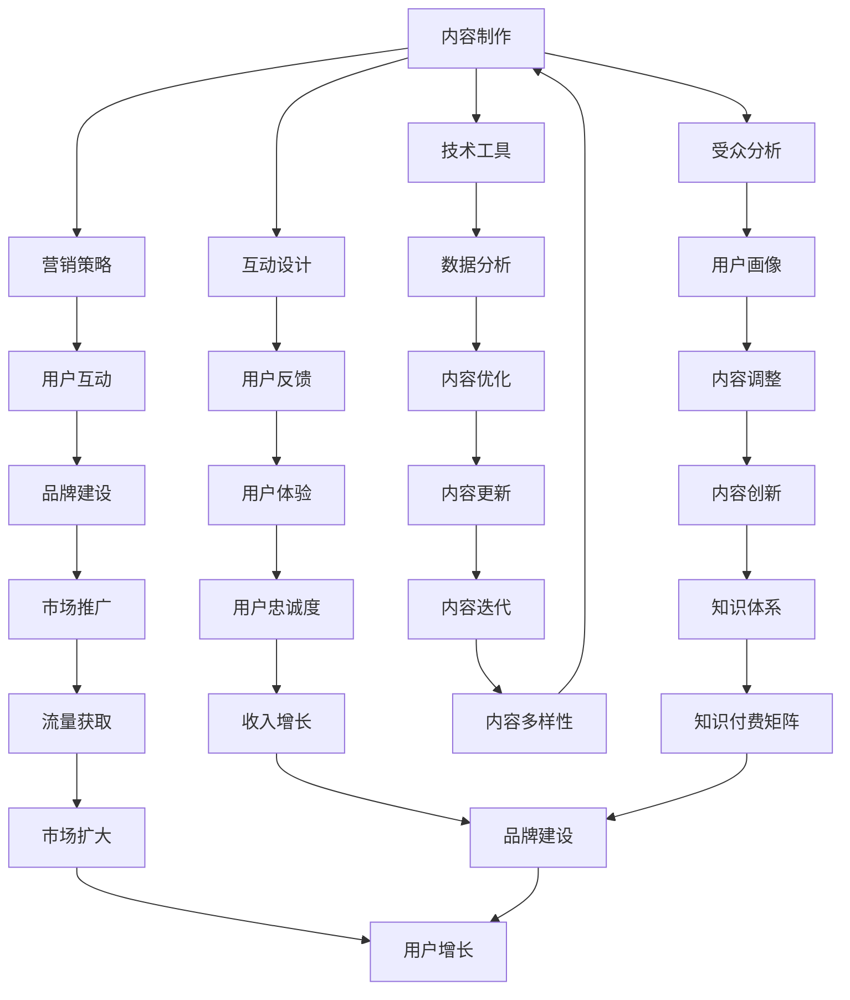

                 

关键词：知识付费、个人品牌、内容制作、营销策略、社交媒体、技术工具、受众分析、互动设计、盈利模式。

## 摘要

在数字化时代，知识付费已成为一种流行的商业模式。个人知识付费矩阵是一个系统化、多维度的内容创作与传播体系，旨在通过专业知识和经验转化为付费内容，实现个人品牌的塑造与市场价值的提升。本文将探讨如何构建个人知识付费矩阵，从内容制作、营销策略、技术工具到受众分析和互动设计，全面解析知识付费的成功路径。同时，本文还将分析当前市场趋势，展望未来的发展方向，以期为创作者提供有益的参考。

## 1. 背景介绍

### 1.1 知识付费的定义与发展

知识付费是指用户为获取专业知识和技能而支付的费用。随着互联网技术的进步和用户需求的增长，知识付费市场日益繁荣。从传统的在线教育、专业咨询到知识共享平台，知识付费的形式和场景日益多样化。

### 1.2 个人知识付费的优势

- **个性化体验**：个人知识付费可以提供更为定制化的内容和服务，满足用户的个性化需求。
- **品牌价值提升**：通过知识付费，个人品牌得以塑造和强化，有助于在市场中脱颖而出。
- **持续收益**：知识付费内容一旦制作完成，即可实现持续收益，降低时间成本。

### 1.3 个人知识付费矩阵的概念

个人知识付费矩阵是指个人在知识付费领域建立的一套系统化的内容创作与传播体系。它包括内容制作、营销策略、技术工具、受众分析等多个环节，旨在最大化地发挥个人知识价值。

## 2. 核心概念与联系

### 2.1 内容制作

内容制作是个人知识付费矩阵的基础。高质量的内容是吸引和留住用户的关键。内容制作涉及选题、策划、撰写、排版等多个环节。

### 2.2 营销策略

营销策略是个人知识付费矩阵的核心。有效的营销策略可以帮助创作者迅速扩大知名度，吸引更多的付费用户。营销策略包括社交媒体营销、广告投放、用户互动等。

### 2.3 技术工具

技术工具是个人知识付费矩阵的支撑。现代技术工具如内容管理系统（CMS）、社交媒体管理工具、数据分析工具等，为创作者提供了丰富的创作和运营工具。

### 2.4 受众分析

受众分析是个人知识付费矩阵的关键。通过数据分析，创作者可以了解用户的兴趣、行为和需求，从而更精准地制作内容，提高用户满意度。

### 2.5 互动设计

互动设计是个人知识付费矩阵的亮点。通过互动设计，创作者可以与用户建立更紧密的联系，增强用户黏性，提高用户忠诚度。

下面是个人知识付费矩阵的 Mermaid 流程图：



## 3. 核心算法原理 & 具体操作步骤

### 3.1 算法原理概述

个人知识付费矩阵的核心算法是基于数据驱动的用户分析模型和内容优化策略。通过收集和分析用户行为数据，创作者可以了解用户的兴趣和需求，从而定制化内容，提高用户满意度。

### 3.2 算法步骤详解

#### 3.2.1 用户行为数据收集

- **数据来源**：社交媒体、网站访问日志、用户反馈等。
- **数据类型**：浏览记录、搜索关键词、购买行为、评论等。

#### 3.2.2 数据处理与分析

- **数据清洗**：去除无效数据，保证数据质量。
- **数据挖掘**：使用机器学习算法挖掘用户兴趣和行为模式。

#### 3.2.3 内容优化策略

- **内容调整**：根据用户兴趣和行为调整内容。
- **内容推荐**：使用推荐算法为用户提供个性化内容。

### 3.3 算法优缺点

#### 优点

- **个性化**：提高用户满意度，增强用户黏性。
- **效率**：自动化处理数据，节省时间成本。

#### 缺点

- **数据隐私**：需确保用户数据的安全和隐私。
- **算法偏见**：算法可能存在偏见，需要持续优化。

### 3.4 算法应用领域

- **内容创作**：帮助创作者制定内容策略。
- **市场营销**：优化营销策略，提高转化率。
- **用户管理**：提高用户满意度和忠诚度。

## 4. 数学模型和公式 & 详细讲解 & 举例说明

### 4.1 数学模型构建

个人知识付费矩阵的数学模型主要包括用户行为数据分析和内容优化策略。

#### 4.1.1 用户行为数据分析

- **用户兴趣模型**：利用用户行为数据构建兴趣模型，如概率模型、聚类模型等。
- **用户行为预测**：使用时间序列分析、机器学习等方法预测用户行为。

#### 4.1.2 内容优化策略

- **内容相关性分析**：分析内容与用户兴趣的相关性，使用相关性指标如皮尔逊相关系数等。
- **内容优化策略**：根据相关性分析结果调整内容，提高用户满意度。

### 4.2 公式推导过程

#### 4.2.1 用户兴趣模型

- **概率模型**：\( P(A|B) = \frac{P(B|A)P(A)}{P(B)} \)

#### 4.2.2 用户行为预测

- **时间序列模型**：\( y_t = \varphi_0 + \varphi_1y_{t-1} + \varphi_2y_{t-2} + ... + \varphi_ny_{t-n} + \epsilon_t \)

### 4.3 案例分析与讲解

#### 案例一：用户兴趣模型

- **问题**：如何根据用户行为数据构建用户兴趣模型？
- **解决方案**：使用聚类分析构建用户兴趣模型，将用户分为不同的兴趣群体。

#### 案例二：内容优化策略

- **问题**：如何根据用户兴趣调整内容？
- **解决方案**：使用相关性分析确定内容与用户兴趣的相关性，调整内容以提高用户满意度。

## 5. 项目实践：代码实例和详细解释说明

### 5.1 开发环境搭建

- **编程语言**：Python
- **开发工具**：Jupyter Notebook
- **数据集**：社交媒体用户行为数据

### 5.2 源代码详细实现

```python
# 导入必要的库
import pandas as pd
from sklearn.cluster import KMeans
from sklearn.metrics import silhouette_score

# 读取数据集
data = pd.read_csv('user_data.csv')

# 数据预处理
# ...

# 构建用户兴趣模型
kmeans = KMeans(n_clusters=5)
kmeans.fit(data)

# 计算用户兴趣得分
interest_scores = kmeans.predict(data)

# 存储结果
data['interest_group'] = interest_scores
data.to_csv('user_interest.csv', index=False)
```

### 5.3 代码解读与分析

上述代码实现了用户兴趣模型的构建，具体步骤如下：

1. **导入库**：导入必要的库，如pandas、scikit-learn等。
2. **读取数据集**：从CSV文件中读取用户行为数据。
3. **数据预处理**：对数据进行清洗和预处理，确保数据质量。
4. **构建用户兴趣模型**：使用KMeans算法构建用户兴趣模型。
5. **计算用户兴趣得分**：将用户行为数据输入KMeans模型，计算用户兴趣得分。
6. **存储结果**：将处理后的数据存储为新的CSV文件。

### 5.4 运行结果展示

- **用户兴趣模型**：通过聚类分析，将用户分为5个兴趣群体。
- **用户兴趣得分**：为每个用户分配一个兴趣得分，用于后续的内容优化。

## 6. 实际应用场景

### 6.1 知识付费平台

- **内容创作者**：通过个人知识付费矩阵，创作者可以制定内容策略，提高用户满意度。
- **平台运营**：平台可以通过数据分析，优化内容推荐，提高用户留存率。

### 6.2 专业咨询

- **咨询师**：通过个人知识付费矩阵，咨询师可以定制化服务，提高客户满意度。
- **客户**：客户可以通过付费内容，获取专业知识和技能。

### 6.3 知识共享社区

- **创作者**：通过个人知识付费矩阵，创作者可以建立个人品牌，吸引更多关注。
- **用户**：用户可以通过付费内容，获取高质量的知识和信息。

## 7. 工具和资源推荐

### 7.1 学习资源推荐

- **书籍**：《深入理解计算机系统》（David R. Koes）、《数据科学入门》（Joel Grus）。
- **在线课程**：Coursera、edX、Udemy等平台上的数据分析、机器学习课程。

### 7.2 开发工具推荐

- **编程语言**：Python、R。
- **开发环境**：Jupyter Notebook、RStudio。
- **数据分析工具**：Pandas、NumPy、Scikit-learn。

### 7.3 相关论文推荐

- **用户兴趣模型**：Koren, Y., Bell, R. Q., & Volinsky, C. (2009). "Tensor Factorization for Recommender Systems."
- **内容优化策略**：He, X., Liao, L., Zhang, H., Nie, L., Hu, X., & Chua, T. S. (2017). "Deep Multilevel Attention Model for Document Classification."

## 8. 总结：未来发展趋势与挑战

### 8.1 研究成果总结

- **个性化内容**：通过数据驱动的内容优化，个性化内容成为趋势。
- **技术进步**：人工智能、机器学习等技术在知识付费领域的应用不断深入。
- **用户参与**：用户参与度和互动设计成为提升用户体验的重要手段。

### 8.2 未来发展趋势

- **内容多样化**：知识付费内容将更加多样化，涵盖更多领域。
- **智能化**：智能化工具将助力创作者更高效地创作和运营。
- **全球化**：知识付费市场将呈现全球化趋势，为创作者提供更广阔的市场空间。

### 8.3 面临的挑战

- **数据隐私**：数据隐私和保护成为知识付费领域的重要挑战。
- **算法偏见**：算法偏见可能导致不公平的推荐和内容。
- **市场竞争**：随着知识付费市场的扩大，创作者需要面对更激烈的竞争。

### 8.4 研究展望

- **技术创新**：探索更多先进技术，提高内容创作和运营效率。
- **用户体验**：注重用户体验，提升用户满意度和忠诚度。
- **社会责任**：关注知识付费领域的社会影响，促进知识的公平传播。

## 9. 附录：常见问题与解答

### 9.1 什么是知识付费？

知识付费是指用户为获取专业知识和技能而支付的费用，常见形式包括在线课程、专业咨询、知识共享社区等。

### 9.2 如何制作高质量的内容？

制作高质量的内容需要考虑以下几点：

- **明确目标受众**：了解受众的需求和兴趣，制作有针对性的内容。
- **保持内容更新**：定期更新内容，保持与用户的互动。
- **注重用户体验**：内容呈现形式和交互设计要符合用户习惯。

### 9.3 如何进行有效的营销？

有效的营销策略包括：

- **社交媒体营销**：利用社交媒体平台扩大影响力。
- **内容营销**：通过高质量的内容吸引和留住用户。
- **用户互动**：积极与用户互动，提高用户参与度。

### 9.4 如何确保数据安全？

确保数据安全的方法包括：

- **数据加密**：对用户数据进行加密处理。
- **访问控制**：设置严格的访问权限，防止未授权访问。
- **合规性**：遵守相关法律法规，确保数据处理合规。

### 9.5 如何建立个人品牌？

建立个人品牌的方法包括：

- **持续学习**：不断提升自己的专业知识和技能。
- **内容创作**：通过高质量的内容展示专业能力。
- **积极参与**：参与行业活动，扩大影响力。

---

**作者：禅与计算机程序设计艺术 / Zen and the Art of Computer Programming**

