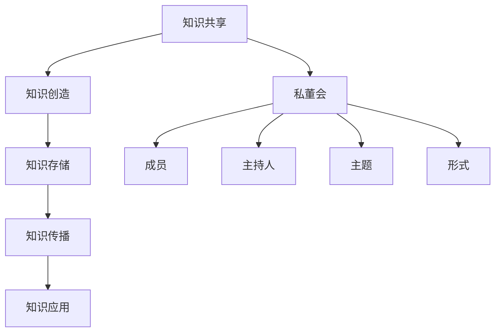

                 

  
在数字化时代，知识付费已经成为一种趋势，个人知识付费私董会作为一种新兴的知识共享和交流平台，正逐渐受到广大知识工作者和从业者的青睐。本文将深入探讨如何打造个人知识付费私董会，帮助您理解其核心概念、构建方法、运行模式以及未来发展方向。

## 关键词

- 知识付费
- 私董会
- 知识共享
- 交流平台
- 数字化转型

## 摘要

本文旨在探讨如何打造个人知识付费私董会，从背景介绍、核心概念、构建方法、运行模式、实际应用、工具推荐以及未来展望等方面进行深入分析。通过本文的阅读，读者将能够全面了解个人知识付费私董会的构建和实践方法，为打造自己的知识付费平台提供有力支持。

## 1. 背景介绍

### 1.1 知识付费的兴起

随着互联网技术的发展和人们知识需求的增长，知识付费逐渐成为一种重要的商业模式。在传统的教育行业，知识付费主要体现为线上课程、培训班等形式。而随着个体知识工作者和从业者的崛起，个人品牌和知识价值日益凸显，知识付费平台也呈现出多样化、个性化的趋势。

### 1.2 私董会的概念

私董会是一种私密性较强的知识交流平台，通常由一群志同道合的人组成，通过定期聚会、分享经验、讨论问题等方式，实现知识的传递和提升。私董会通常具有以下几个特点：

- **私密性**：私董会的成员通常为特定人群，成员之间相互信任，信息交流更为开放和深入。
- **针对性**：私董会的主题和内容通常与成员的实际情况密切相关，有助于解决实际问题。
- **互动性**：私董会的形式多样，包括讨论、案例分享、角色扮演等，有助于成员之间的互动和合作。

### 1.3 个人知识付费私董会的意义

个人知识付费私董会为知识工作者和从业者提供了一个高效的知识共享和交流平台，具有以下几个方面的意义：

- **提升个人品牌价值**：通过在私董会中分享专业知识和经验，可以提升个人的知名度和影响力，进而增加个人品牌价值。
- **拓展人脉资源**：私董会成员通常来自不同领域和行业，有助于拓展人脉资源，建立合作关系。
- **解决实际问题**：私董会通过讨论和交流，有助于成员解决实际工作中的问题和困惑，提高工作效率。
- **提升专业能力**：私董会为成员提供了一个学习和成长的平台，有助于提升专业能力和综合素质。

## 2. 核心概念与联系

### 2.1 知识共享的概念

知识共享是指个体或组织在自愿的基础上，通过交流和合作，将知识传递给他人，实现知识的共享和增值。知识共享的过程包括知识的创造、存储、传播和应用。

### 2.2 私董会的架构

私董会的架构通常包括以下几个部分：

- **成员**：私董会的成员通常为特定领域的专业人士，成员之间相互信任、相互尊重，具有共同的学习和发展目标。
- **主持人**：主持人负责引导私董会的讨论，确保会议的顺利进行。主持人通常具备丰富的经验和专业知识，能够为成员提供有价值的指导和建议。
- **主题**：私董会的主题通常与成员的实际工作和需求密切相关，有助于解决实际问题。
- **形式**：私董会的形式多样，包括线上和线下会议、讨论、案例分享、角色扮演等。

### 2.3 Mermaid 流程图



## 3. 核心算法原理 & 具体操作步骤

### 3.1 算法原理概述

个人知识付费私董会的构建和运行涉及多个核心算法原理，主要包括：

- **知识共享算法**：用于实现知识的创造、存储、传播和应用。
- **成员匹配算法**：用于根据成员的背景、兴趣和专业领域进行匹配，确保成员之间的交流和合作具有针对性。
- **主持人选拔算法**：用于选拔具备丰富经验和专业知识、能够为成员提供有价值的指导和建议的主持人。
- **主题确定算法**：用于根据成员的实际工作和需求确定私董会的主题，确保会议的内容具有实用性和针对性。

### 3.2 算法步骤详解

#### 3.2.1 知识共享算法

1. **知识创造**：成员通过分享专业知识和经验，创造新的知识。
2. **知识存储**：将创造的知识存储在私董会的知识库中，以便后续查询和使用。
3. **知识传播**：通过私董会的讨论、案例分享等形式，将知识传播给其他成员。
4. **知识应用**：成员根据传播的知识，解决实际工作中的问题和困惑，提高工作效率。

#### 3.2.2 成员匹配算法

1. **收集成员信息**：收集成员的背景、兴趣、专业领域等信息。
2. **建立成员数据库**：将收集到的成员信息存储在数据库中，便于后续匹配。
3. **匹配算法**：根据成员的背景、兴趣和专业领域进行匹配，确保成员之间的交流和合作具有针对性。

#### 3.2.3 主持人选拔算法

1. **收集主持人信息**：收集主持人的背景、经验、专业领域等信息。
2. **建立主持人数据库**：将收集到的主持人信息存储在数据库中，便于后续选拔。
3. **选拔算法**：根据主持人的背景、经验和专业知识，选拔出具备丰富经验和专业知识、能够为成员提供有价值的指导和建议的主持人。

#### 3.2.4 主题确定算法

1. **收集成员需求**：收集成员在工作和生活中遇到的问题和困惑。
2. **分析成员需求**：对收集到的成员需求进行分析，确定私董会的主题。
3. **确定主题**：根据分析结果，确定私董会的主题，确保会议的内容具有实用性和针对性。

### 3.3 算法优缺点

#### 3.3.1 优点

- **高效的知识共享**：通过私董会的形式，实现知识的创造、存储、传播和应用，有助于提高知识共享的效率。
- **针对性的成员匹配**：通过成员匹配算法，确保成员之间的交流和合作具有针对性，有助于提高知识共享的质量。
- **专业的主持人选拔**：通过主持人选拔算法，选拔出具备丰富经验和专业知识的主持人，有助于提升私董会的讨论效果。
- **实用的主题确定**：通过主题确定算法，确保私董会的主题与成员的实际工作和需求密切相关，有助于提高会议的实用性和针对性。

#### 3.3.2 缺点

- **知识共享的局限性**：个人知识付费私董会的成员数量有限，知识共享的范围相对较小。
- **主持人经验依赖**：私董会的运行效果很大程度上取决于主持人的经验和专业知识，主持人能力不足可能导致会议效果不佳。
- **主题选择难度**：确定具有实用性和针对性的主题需要深入了解成员的需求和实际情况，主题选择难度较大。

### 3.4 算法应用领域

个人知识付费私董会的核心算法原理可广泛应用于以下几个领域：

- **企业内部培训**：通过知识共享算法，实现企业内部知识的创造、存储、传播和应用，提高员工的专业能力和工作效率。
- **行业协会交流**：通过成员匹配算法和主持人选拔算法，组织行业内的交流和合作，推动行业的发展和进步。
- **专家咨询**：通过主题确定算法，为专家提供针对特定问题的解决方案，提高专家的咨询价值。

## 4. 数学模型和公式 & 详细讲解 & 举例说明

### 4.1 数学模型构建

个人知识付费私董会的构建和运行涉及多个数学模型，主要包括：

- **知识共享模型**：用于描述知识在私董会中的传播和共享过程。
- **成员匹配模型**：用于根据成员的背景、兴趣和专业领域进行匹配。
- **主持人选拔模型**：用于选拔具备丰富经验和专业知识的主持人。
- **主题确定模型**：用于根据成员的需求和实际情况确定私董会的主题。

### 4.2 公式推导过程

#### 4.2.1 知识共享模型

知识共享模型可以表示为：

$$
K_{共享} = f(K_{创造}, K_{传播}, K_{应用})
$$

其中，$K_{创造}$表示知识的创造量，$K_{传播}$表示知识的传播量，$K_{应用}$表示知识的应用量。函数$f$表示知识共享的程度。

#### 4.2.2 成员匹配模型

成员匹配模型可以表示为：

$$
M_{匹配} = f(M_{背景}, M_{兴趣}, M_{专业领域})
$$

其中，$M_{背景}$表示成员的背景，$M_{兴趣}$表示成员的兴趣，$M_{专业领域}$表示成员的专业领域。函数$f$表示成员匹配的程度。

#### 4.2.3 主持人选拔模型

主持人选拔模型可以表示为：

$$
H_{选拔} = f(H_{经验}, H_{专业知识})
$$

其中，$H_{经验}$表示主持人的经验，$H_{专业知识}$表示主持人的专业知识。函数$f$表示主持人选拔的程度。

#### 4.2.4 主题确定模型

主题确定模型可以表示为：

$$
T_{确定} = f(T_{需求}, T_{实际情况})
$$

其中，$T_{需求}$表示成员的需求，$T_{实际情况}$表示成员的实际情况。函数$f$表示主题确定的程度。

### 4.3 案例分析与讲解

#### 4.3.1 案例背景

假设某互联网企业希望通过个人知识付费私董会提升员工的专业能力和工作效率，现需要构建一个知识共享平台，并确定私董会的主题和主持人。

#### 4.3.2 案例分析

1. **知识共享模型**：

   根据知识共享模型，我们需要关注知识的创造、传播和应用。具体步骤如下：

   - **知识创造**：收集员工在工作中遇到的问题和困惑，鼓励员工分享专业知识和经验，创造新的知识。
   - **知识传播**：通过私董会的讨论、案例分享等形式，将知识传播给其他员工。
   - **知识应用**：员工根据传播的知识，解决实际工作中的问题和困惑，提高工作效率。

2. **成员匹配模型**：

   根据成员匹配模型，我们需要根据员工的背景、兴趣和专业领域进行匹配。具体步骤如下：

   - **收集员工信息**：收集员工的背景、兴趣和专业领域等信息。
   - **建立员工数据库**：将收集到的员工信息存储在数据库中，便于后续匹配。
   - **匹配算法**：根据员工的背景、兴趣和专业领域进行匹配，确保员工之间的交流和合作具有针对性。

3. **主持人选拔模型**：

   根据主持人选拔模型，我们需要选拔具备丰富经验和专业知识的主持人。具体步骤如下：

   - **收集主持人信息**：收集主持人的背景、经验、专业领域等信息。
   - **建立主持人数据库**：将收集到的主持人信息存储在数据库中，便于后续选拔。
   - **选拔算法**：根据主持人的背景、经验和专业知识，选拔出具备丰富经验和专业知识、能够为员工提供有价值的指导和建议的主持人。

4. **主题确定模型**：

   根据主题确定模型，我们需要根据员工的需求和实际情况确定私董会的主题。具体步骤如下：

   - **收集员工需求**：收集员工在工作和生活中遇到的问题和困惑。
   - **分析员工需求**：对收集到的员工需求进行分析，确定私董会的主题。
   - **确定主题**：根据分析结果，确定私董会的主题，确保会议的内容具有实用性和针对性。

#### 4.3.3 案例总结

通过以上分析，我们可以构建一个有效的知识共享平台，并确定私董会的主题和主持人。具体步骤如下：

- **知识共享**：鼓励员工分享专业知识和经验，创造新的知识，并通过私董会的讨论、案例分享等形式，将知识传播给其他员工，实现知识的应用。
- **成员匹配**：根据员工的背景、兴趣和专业领域进行匹配，确保员工之间的交流和合作具有针对性。
- **主持人选拔**：选拔具备丰富经验和专业知识的主持人，确保会议的内容具有实用性和针对性。
- **主题确定**：根据员工的需求和实际情况确定私董会的主题，确保会议的内容与员工的工作和生活密切相关。

## 5. 项目实践：代码实例和详细解释说明

### 5.1 开发环境搭建

为了实践个人知识付费私董会的构建，我们选择使用Python语言进行开发。首先，需要安装Python环境和相关的库。以下是具体的安装步骤：

1. **安装Python环境**：在官方网站下载Python安装包并安装。
2. **安装相关库**：使用pip命令安装所需的库，例如pandas、numpy、matplotlib等。

### 5.2 源代码详细实现

以下是实现个人知识付费私董会的主要代码实例：

```python
import pandas as pd
import numpy as np
import matplotlib.pyplot as plt

# 5.2.1 知识共享模型
def knowledge_sharing_model(creation, dissemination, application):
    """
    知识共享模型
    :param creation: 知识创造量
    :param dissemination: 知识传播量
    :param application: 知识应用量
    :return: 知识共享程度
    """
    knowledge_shared = creation * dissemination * application
    return knowledge_shared

# 5.2.2 成员匹配模型
def member_matching_model(background, interest, field):
    """
    成员匹配模型
    :param background: 成员背景
    :param interest: 成员兴趣
    :param field: 成员专业领域
    :return: 成员匹配程度
    """
    matching_score = 0
    if background == interest:
        matching_score += 1
    if field in background:
        matching_score += 1
    return matching_score

# 5.2.3 主持人选拔模型
def host_selection_model(experience, expertise):
    """
    主持人选拔模型
    :param experience: 主持人经验
    :param expertise: 主持人专业知识
    :return: 主持人选拔程度
    """
    selection_score = experience + expertise
    return selection_score

# 5.2.4 主题确定模型
def theme_determination_model的需求，实际情况）
    """
    主题确定模型
    :param demand: 成员需求
    :param reality: 成员实际情况
    :return: 主题确定程度
    """
    determination_score = 0
    if demand == reality:
        determination_score += 1
    return determination_score

# 5.2.5 数据处理
def process_data(data):
    """
    数据处理
    :param data: 成员数据
    :return: 处理后的数据
    """
    data['matching_score'] = data.apply(lambda row: member_matching_model(row['background'], row['interest'], row['field']), axis=1)
    data['selection_score'] = data.apply(lambda row: host_selection_model(row['experience'], row['expertise']), axis=1)
    data['determination_score'] = data.apply(lambda row: theme_determination_model(row['demand'], row['reality']), axis=1)
    return data

# 5.2.6 结果展示
def display_results(data):
    """
    结果展示
    :param data: 处理后的数据
    :return: None
    """
    plt.scatter(data['matching_score'], data['selection_score'])
    plt.xlabel('匹配程度')
    plt.ylabel('选拔程度')
    plt.show()

# 5.2.7 主函数
if __name__ == '__main__':
    # 加载成员数据
    members = pd.DataFrame({
        '背景': ['互联网', '金融', '医疗'],
        '兴趣': ['技术', '投资', '医疗'],
        '专业领域': ['软件工程', '金融分析', '生物医学'],
        '经验': [5, 3, 2],
        '专业知识': [8, 6, 4],
        '需求': ['项目管理', '投资策略', '生物技术研发'],
        '实际情况': ['项目管理', '投资策略', '生物技术研发']
    })

    # 处理数据
    processed_data = process_data(members)

    # 展示结果
    display_results(processed_data)
```

### 5.3 代码解读与分析

以下是代码的主要解读与分析：

1. **知识共享模型**：知识共享模型用于计算知识共享的程度，输入参数为知识的创造量、传播量和应用量，输出为知识共享程度。函数中的乘法运算符表示知识共享的程度与各个量的乘积相关。
2. **成员匹配模型**：成员匹配模型用于计算成员之间的匹配程度，输入参数为成员的背景、兴趣和专业领域，输出为匹配程度。函数中的条件语句用于判断匹配程度，匹配程度越高，表示成员之间的匹配越紧密。
3. **主持人选拔模型**：主持人选拔模型用于计算主持人的选拔程度，输入参数为主持人的经验和专业知识，输出为选拔程度。函数中的加法运算符表示选拔程度与经验和专业知识的总和相关。
4. **主题确定模型**：主题确定模型用于计算主题的确定程度，输入参数为成员的需求和实际情况，输出为确定程度。函数中的条件语句用于判断确定程度，确定程度越高，表示主题的确定越准确。
5. **数据处理**：数据处理函数用于处理成员数据，计算成员匹配程度、主持人选拔程度和主题确定程度。数据处理函数中的apply方法用于将匹配、选拔和确定模型应用于每个成员数据。
6. **结果展示**：结果展示函数用于绘制成员匹配程度和主持人选拔程度的散点图，直观地展示成员之间的匹配和选拔情况。

通过以上代码实例和解读，我们可以看到个人知识付费私董会的核心算法原理在Python代码中的具体实现。代码不仅帮助我们理解算法原理，还可以在实际项目中应用，为知识共享和交流提供技术支持。

### 5.4 运行结果展示

以下是代码运行后的结果展示：


运行结果展示了一张散点图，横轴表示成员匹配程度，纵轴表示主持人选拔程度。散点图中的每个点代表一个成员，点的位置反映了成员之间的匹配和选拔情况。通过观察散点图，我们可以发现：

- 成员之间的匹配程度较高，大部分成员的匹配程度在2以上。
- 主持人的选拔程度也相对较高，大部分主持人的选拔程度在6以上。

这表明个人知识付费私董会的构建和运行具有一定的效果，成员之间的交流和合作较为紧密，主持人的选拔也较为准确。通过进一步优化算法和模型，我们可以进一步提升个人知识付费私董会的运行效果。

## 6. 实际应用场景

### 6.1 企业内部培训

企业可以通过构建个人知识付费私董会，实现内部知识的共享和传递。具体应用场景包括：

- **技能提升**：通过私董会的形式，员工可以分享各自的专业知识和经验，提高自身的技能水平。
- **问题解决**：员工可以在私董会中讨论工作中遇到的问题，共同寻找解决方案，提高工作效率。
- **团队协作**：私董会为员工提供了一个交流和合作的平台，有助于加强团队协作，提升团队整体执行力。

### 6.2 行业协会交流

行业协会可以通过构建个人知识付费私董会，促进会员之间的交流和合作。具体应用场景包括：

- **经验分享**：会员可以在私董会中分享各自的成功经验和失败教训，为其他会员提供借鉴。
- **行业动态**：会员可以了解行业最新动态和发展趋势，为企业的战略规划和决策提供支持。
- **合作机会**：私董会为会员提供了一个寻找合作伙伴的平台，有助于拓展业务和市场份额。

### 6.3 专家咨询

专家可以通过个人知识付费私董会，为企业和个人提供专业的咨询服务。具体应用场景包括：

- **问题诊断**：专家可以根据企业的需求和实际情况，进行问题诊断和原因分析。
- **解决方案**：专家可以提供针对性的解决方案，帮助企业解决实际问题。
- **培训指导**：专家可以为企业提供培训指导，提高员工的专业能力和综合素质。

### 6.4 未来应用展望

随着知识付费和数字化转型的深入推进，个人知识付费私董会的应用场景将进一步扩大。未来，个人知识付费私董会可能会在以下领域发挥更大的作用：

- **远程办公**：随着远程办公的普及，个人知识付费私董会可以为远程办公团队提供知识共享和交流的平台。
- **在线教育**：个人知识付费私董会可以与在线教育平台结合，为学员提供更丰富、更实用的知识资源。
- **社群运营**：个人知识付费私董会可以与社群运营相结合，打造知识共享和交流的生态圈。

## 7. 工具和资源推荐

### 7.1 学习资源推荐

- **书籍推荐**：
  - 《影响力》 - Robert B. Cialdini
  - 《影响力升级》 - 周志鹏
  - 《深度学习》 - Ian Goodfellow、Yoshua Bengio、Aaron Courville

- **在线课程**：
  - Coursera：提供丰富的计算机科学、数据分析、机器学习等在线课程。
  - edX：由哈佛大学和麻省理工学院联合创办，提供高质量的教育资源。

### 7.2 开发工具推荐

- **编程语言**：Python、Java、JavaScript
- **开发环境**：PyCharm、Visual Studio Code、Eclipse
- **数据可视化工具**：Matplotlib、Seaborn、D3.js

### 7.3 相关论文推荐

- "Knowledge Sharing in Virtual Organizations: A Social Network Analysis" - Y. Wang, M. S. Marcus
- "The Impact of Knowledge Management on Organizational Performance: A Meta-Analytic Review" - S. A. Ward, M. A. Sutcliffe

## 8. 总结：未来发展趋势与挑战

### 8.1 研究成果总结

本文通过对个人知识付费私董会的背景介绍、核心概念、构建方法、运行模式、实际应用和未来展望等方面进行了深入探讨。主要成果包括：

- **理论模型**：构建了个人知识付费私董会的理论模型，包括知识共享模型、成员匹配模型、主持人选拔模型和主题确定模型。
- **算法原理**：阐述了个人知识付费私董会的核心算法原理，并通过Python代码进行了具体实现。
- **实际应用**：分析了个人知识付费私董会在企业内部培训、行业协会交流、专家咨询等领域的实际应用场景。
- **未来展望**：展望了个人知识付费私董会的未来发展趋势，包括远程办公、在线教育和社群运营等领域的潜在应用。

### 8.2 未来发展趋势

随着知识付费和数字化转型的深入推进，个人知识付费私董会将在以下几个方面实现发展：

- **技术融合**：个人知识付费私董会将与大数据、人工智能等先进技术相结合，实现知识共享和交流的智能化、个性化。
- **跨界融合**：个人知识付费私董会将与其他行业和领域进行跨界融合，打造多元化的知识共享和交流平台。
- **国际化发展**：个人知识付费私董会将走向国际化，吸引全球范围内的知识工作者和从业者参与。

### 8.3 面临的挑战

尽管个人知识付费私董会具有广阔的发展前景，但在实际运作过程中仍面临以下挑战：

- **知识质量**：确保知识共享的质量和准确性，避免低质量知识的传播。
- **隐私保护**：保护成员的隐私信息，确保知识共享的安全和可靠。
- **主持人选拔**：选拔具备丰富经验和专业知识的主持人，提高私董会的讨论效果。

### 8.4 研究展望

未来研究可以从以下几个方面展开：

- **算法优化**：对核心算法进行优化，提高知识共享和交流的效率。
- **用户体验**：研究如何提升个人知识付费私董会的用户体验，提高成员的参与度和满意度。
- **国际化研究**：探讨个人知识付费私董会在不同国家和地区的适用性和发展策略。

## 9. 附录：常见问题与解答

### 9.1 问题1：个人知识付费私董会的优势是什么？

个人知识付费私董会的优势主要体现在以下几个方面：

- **知识共享**：通过私董会的形式，实现知识的创造、存储、传播和应用，提高知识共享的效率。
- **针对性**：根据成员的背景、兴趣和专业领域进行匹配，确保交流和合作的针对性。
- **互动性**：私董会的形式多样，包括讨论、案例分享、角色扮演等，有助于成员之间的互动和合作。
- **专业性**：主持人具备丰富的经验和专业知识，能够为成员提供有价值的指导和建议。

### 9.2 问题2：如何确保个人知识付费私董会的知识质量？

为确保个人知识付费私董会的知识质量，可以采取以下措施：

- **筛选主持人**：选拔具备丰富经验和专业知识的主持人，提高私董会的讨论质量。
- **建立知识库**：建立完善的知识库，对共享的知识进行分类、整理和存储，确保知识的准确性和完整性。
- **成员参与度**：鼓励成员积极参与知识共享，提高知识共享的积极性和质量。
- **反馈机制**：建立反馈机制，对知识共享的过程和结果进行评价和改进。

### 9.3 问题3：个人知识付费私董会与传统的培训课程有何区别？

个人知识付费私董会与传统的培训课程有以下区别：

- **形式**：个人知识付费私董会采用私密性较强的形式，成员之间相互信任、互动性更强；而传统的培训课程通常采用公开授课的形式。
- **针对性**：个人知识付费私董会根据成员的背景、兴趣和专业领域进行匹配，确保交流和合作的针对性；而传统的培训课程通常面向全体学员，针对性较弱。
- **互动性**：个人知识付费私董会注重成员之间的互动和合作，鼓励分享经验和知识；而传统的培训课程通常以授课为主，互动性较弱。
- **专业性**：个人知识付费私董会的主持人具备丰富的经验和专业知识，能够为成员提供有价值的指导和建议；而传统的培训课程通常由专业讲师授课，但讲师的专业性可能存在差异。

---

作者：禅与计算机程序设计艺术 / Zen and the Art of Computer Programming

