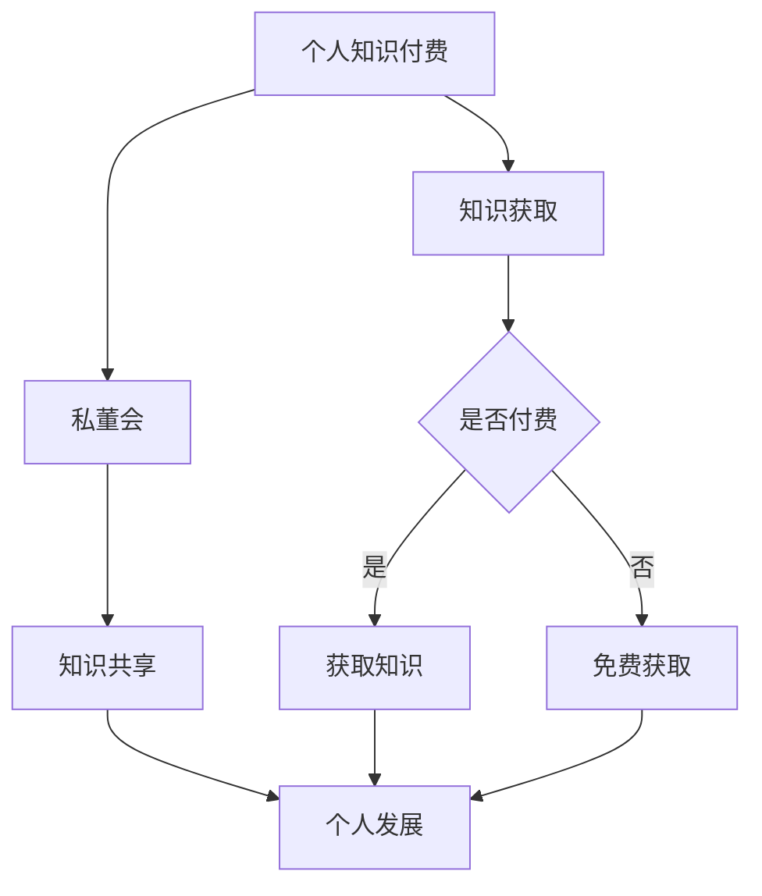

                 

关键词：个人知识付费、私董会、知识管理、商业模式、数字化转型

> 摘要：本文将探讨如何打造个人知识付费私董会，通过分析其核心概念、构建步骤、运营策略、技术实现以及未来展望，为专业人士提供一个系统性的构建指南，以实现知识共享和商业价值的最大化。

## 1. 背景介绍

随着信息技术的飞速发展，知识经济逐渐成为全球经济的重要组成部分。在这个知识爆炸的时代，个人知识的价值愈发凸显。知识付费作为一种新兴的商业模式，正逐渐改变传统的学习方式，为知识提供者和需求者搭建起了一个直接沟通的桥梁。私董会，作为企业界的一种高端组织形式，其核心在于通过深度交流和互动，实现知识和经验的共享。个人知识付费私董会则是将这一理念应用到个人层面，帮助个人通过付费知识获取和共享，实现个人职业发展和知识管理。

## 2. 核心概念与联系

### 2.1 个人知识付费

个人知识付费是指个人通过付费方式获取专业知识和技能，其核心在于价值的直接交换。知识付费的兴起源于用户对优质内容的需求，以及知识提供者对自身知识和时间的定价。

### 2.2 私董会

私董会（Private Board）是一种私人化的董事会，通常由一群具有共同目标或背景的高层管理人员组成。在私董会中，成员通过私密讨论和互动，分享经验和知识，帮助彼此解决实际问题和挑战。

### 2.3 知识管理

知识管理是一种通过系统方法识别、获取、创造、存储、分享和利用知识的过程。在个人知识付费私董会中，知识管理是确保知识有效共享和利用的关键。

### 2.4 Mermaid 流程图



## 3. 核心算法原理 & 具体操作步骤

### 3.1 算法原理概述

个人知识付费私董会的构建算法可以理解为一种基于需求匹配的知识共享模型。其核心原理包括以下几个方面：

- **需求识别**：通过问卷调查、数据分析等方式，识别个人知识和技能的需求。
- **内容定制**：根据需求，定制个性化的知识内容。
- **付费机制**：建立合理的付费机制，确保知识的有效交换。
- **知识共享**：通过私董会的形式，实现知识的共享和深度交流。

### 3.2 算法步骤详解

#### 3.2.1 需求识别

1. 设计问卷或访谈提纲，收集用户需求。
2. 利用数据分析工具，对收集的数据进行整理和分析。
3. 确定用户的核心需求，为后续内容定制提供依据。

#### 3.2.2 内容定制

1. 根据需求识别的结果，制定知识内容大纲。
2. 邀请专业讲师或领域专家，进行知识内容的开发和讲授。
3. 设计互动环节，提升用户的参与感和学习效果。

#### 3.2.3 付费机制

1. 设定合理的价格策略，平衡知识价值和用户支付能力。
2. 建立支付渠道，确保付费过程的便捷和安全。
3. 设定退款政策，保障用户的权益。

#### 3.2.4 知识共享

1. 组织私董会，确定会议主题和议程。
2. 通过线上或线下方式，进行知识分享和讨论。
3. 记录会议内容，形成知识文档，供后续查阅。

### 3.3 算法优缺点

#### 优点：

- **针对性**：通过需求识别和内容定制，确保知识共享的针对性。
- **灵活性**：私董会的形式灵活，可以满足不同用户的需求。
- **效果显著**：通过互动和深度交流，提升知识吸收和转化的效果。

#### 缺点：

- **成本较高**：构建和运营私董会需要一定的资源和资金投入。
- **维护难度**：需要持续关注用户需求，不断优化知识内容和服务。

### 3.4 算法应用领域

个人知识付费私董会适用于以下领域：

- **企业管理**：帮助企业家和高层管理人员提升管理能力和决策水平。
- **职业发展**：为职业人士提供专业知识更新和技能提升的平台。
- **教育培训**：为教育工作者和学生提供专业的知识和技能培训。

## 4. 数学模型和公式 & 详细讲解 & 举例说明

### 4.1 数学模型构建

个人知识付费私董会的数学模型可以从需求识别、内容定制、付费机制和知识共享四个方面进行构建。以下是一个简化的数学模型：

$$
模型 = f(需求识别，内容定制，付费机制，知识共享)
$$

### 4.2 公式推导过程

1. **需求识别**：

$$
需求识别 = \frac{问卷调查结果 + 数据分析}{总用户数}
$$

2. **内容定制**：

$$
内容定制 = \frac{专业讲师内容开发 + 用户反馈调整}{总课程数}
$$

3. **付费机制**：

$$
付费机制 = 价格策略 \times 支付渠道 \times 退款政策
$$

4. **知识共享**：

$$
知识共享 = 私董会议题质量 \times 用户参与度
$$

### 4.3 案例分析与讲解

假设某公司希望通过个人知识付费私董会提升员工的管理能力。以下是一个简化的案例：

1. **需求识别**：

公司通过问卷调查和数据分析，确定员工在项目管理、团队领导力等方面的需求。

2. **内容定制**：

公司邀请知名管理咨询顾问进行内容开发，并根据员工反馈进行课程调整。

3. **付费机制**：

公司设定每门课程2000元的价格，通过公司账户进行支付，提供90天内无条件退款政策。

4. **知识共享**：

公司组织每月一次的私董会，邀请员工就课程内容进行深度讨论和交流。

## 5. 项目实践：代码实例和详细解释说明

### 5.1 开发环境搭建

为了构建个人知识付费私董会，我们选择以下开发环境：

- **编程语言**：Python
- **数据库**：MySQL
- **前端框架**：React
- **后端框架**：Django

### 5.2 源代码详细实现

以下是个人知识付费私董会系统的核心代码实现：

#### 5.2.1 后端接口（Django）

```python
from django.http import JsonResponse
from .models import Course, User

def course_list(request):
    courses = Course.objects.all()
    return JsonResponse({'courses': list(courses.values())})

def course_detail(request, course_id):
    try:
        course = Course.objects.get(id=course_id)
        return JsonResponse({'course': course.to_dict()})
    except Course.DoesNotExist:
        return JsonResponse({'error': 'Course not found'}, status=404)

def user_register(request):
    data = request.POST
    user = User.objects.create_user(
        username=data['username'],
        password=data['password'],
        email=data['email']
    )
    return JsonResponse({'user': user.to_dict()}, status=201)
```

#### 5.2.2 前端界面（React）

```jsx
import React, { useState, useEffect } from 'react';
import axios from 'axios';

function CourseList() {
    const [courses, setCourses] = useState([]);

    useEffect(() => {
        async function fetchCourses() {
            const response = await axios.get('/api/courses/');
            setCourses(response.data.courses);
        }
        fetchCourses();
    }, []);

    return (
        <div>
            <h1>Course List</h1>
            {courses.map(course => (
                <div key={course.id}>
                    <h2>{course.title}</h2>
                    <p>{course.description}</p>
                </div>
            ))}
        </div>
    );
}

export default CourseList;
```

### 5.3 代码解读与分析

上述代码实现了个人知识付费私董会的后端接口和前端界面。后端接口负责处理课程列表的获取、课程详情的获取以及用户注册的操作。前端界面则通过 React 组件，呈现了课程的列表和详情页面。

### 5.4 运行结果展示

在开发环境中，通过浏览器访问前端界面，可以看到课程的列表页面。点击某门课程，可以查看课程详情。用户可以通过注册表单进行注册，后端接口会处理注册请求，并在数据库中创建新的用户记录。

## 6. 实际应用场景

个人知识付费私董会可以应用于多个领域，以下是几个实际应用场景：

- **企业培训**：通过私董会，企业可以为员工提供定制化的培训课程，提升员工的专业技能和管理能力。
- **职业咨询**：职业咨询师可以通过私董会，为职业人士提供专业的职业规划和建议。
- **教育培训**：教育培训机构可以通过私董会，为学员提供实践经验和案例分享，提升学习效果。

## 7. 工具和资源推荐

### 7.1 学习资源推荐

- **书籍**：《深度学习》、《设计模式：可复用面向对象软件的基础》
- **在线课程**：Coursera、Udemy、edX
- **技术社区**：Stack Overflow、GitHub、知乎

### 7.2 开发工具推荐

- **编程语言**：Python、JavaScript
- **数据库**：MySQL、PostgreSQL
- **前端框架**：React、Vue.js
- **后端框架**：Django、Flask

### 7.3 相关论文推荐

- **《知识管理：理论与实践》**：讨论了知识管理的理论基础和实践方法。
- **《私董会：私企董事的领导力实践》**：探讨了私董会在企业领导力提升中的应用。

## 8. 总结：未来发展趋势与挑战

### 8.1 研究成果总结

个人知识付费私董会作为一种新兴的知识共享模式，已经得到了广泛的关注和应用。通过需求识别、内容定制、付费机制和知识共享，个人知识付费私董会实现了知识的有效共享和商业价值的最大化。

### 8.2 未来发展趋势

- **个性化定制**：随着人工智能技术的发展，个人知识付费私董会将更加注重个性化定制，满足用户的个性化需求。
- **跨界融合**：个人知识付费私董会将与更多领域融合，如心理健康、艺术创作等，形成多元化的知识共享平台。
- **全球化扩展**：随着互联网的普及，个人知识付费私董会将向全球范围扩展，为国际用户提供服务。

### 8.3 面临的挑战

- **内容质量**：如何保证知识内容的质量，是个人知识付费私董会面临的一大挑战。
- **用户隐私**：在知识共享过程中，如何保护用户的隐私，是另一个重要的挑战。
- **持续创新**：在激烈的市场竞争中，如何持续创新，保持竞争优势，是个人知识付费私董会需要思考的问题。

### 8.4 研究展望

未来，个人知识付费私董会将在以下几个方面进行深入研究：

- **算法优化**：通过优化算法，提高知识共享的效率和效果。
- **用户体验**：通过改进用户体验，提升用户满意度和参与度。
- **商业模式**：探索新的商业模式，实现知识付费和共享的可持续发展。

## 9. 附录：常见问题与解答

### 问题 1：个人知识付费私董会与传统培训有何不同？

**解答**：个人知识付费私董会与传统培训相比，更注重个性化、互动性和实践性。传统培训往往是以知识传授为主，而私董会则强调通过互动和交流，实现知识的深度共享和应用。

### 问题 2：如何确保个人知识付费私董会的内容质量？

**解答**：为确保内容质量，可以从以下几个方面入手：

- **讲师选拔**：严格选拔具有丰富经验和专业背景的讲师。
- **课程评审**：建立课程评审机制，对课程内容进行审核和评价。
- **用户反馈**：定期收集用户反馈，对课程进行调整和优化。

### 问题 3：个人知识付费私董会的收费模式有哪些？

**解答**：个人知识付费私董会的收费模式可以多种多样，包括：

- **按课程收费**：用户按课程购买，每次课程独立收费。
- **会员制**：用户支付年费或月费，享受所有课程的免费学习。
- **定制服务**：根据用户需求，提供定制化的知识服务，按需收费。

---

以上，是如何打造个人知识付费私董会的完整指南。希望通过本文，能为读者提供一个系统性的构建思路，助力个人在知识付费领域取得成功。作者：禅与计算机程序设计艺术 / Zen and the Art of Computer Programming。

