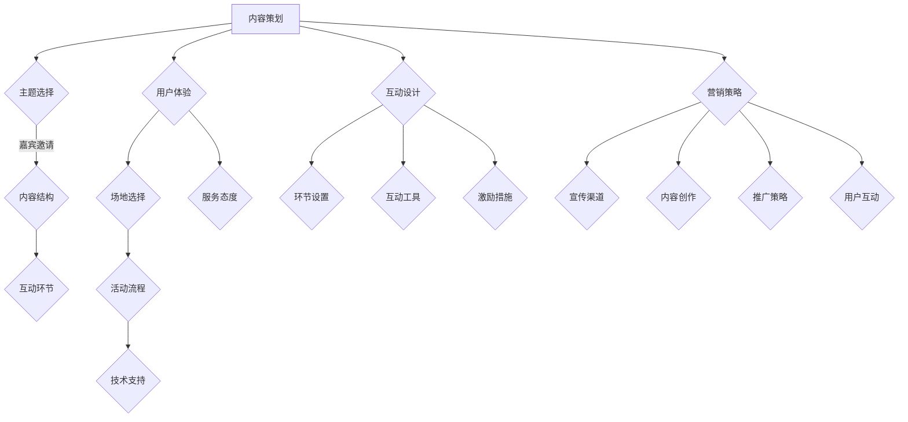

                 

关键词：知识付费、线下沙龙、个人品牌、内容策划、营销策略、技术讲座、用户体验、互动设计

> 摘要：本文将探讨如何打造个人知识付费线下沙龙，从背景介绍、核心概念、具体操作步骤、数学模型与公式、项目实践、实际应用场景、工具和资源推荐、以及未来发展趋势与挑战等方面，为您提供一套完整的策划和执行方案。

## 1. 背景介绍

在当今知识经济时代，个人知识和技能的价值日益凸显。知识付费已经成为一种趋势，越来越多的个人从业者开始通过知识分享获得收入。线下沙龙作为知识付费的一种形式，具有面对面的互动性和较高的用户粘性，正逐渐成为个人知识品牌建设的重要途径。

然而，打造一个成功的个人知识付费线下沙龙并非易事。它不仅要求策划者具备丰富的专业知识，还需要掌握一定的营销技巧和活动执行能力。本文将结合实际案例，为您提供一套从零开始打造个人知识付费线下沙龙的完整指南。

### 1.1 行业现状

近年来，知识付费市场呈现快速增长态势。据《2021年中国知识付费行业报告》显示，2019年中国知识付费市场规模已达到929亿元，预计2024年将达到1961亿元。这表明，知识付费已经成为一个具有巨大潜力的市场。

与此同时，线下沙龙作为一种传统且有效的知识传播方式，也在经历着数字化转型的过程。许多个人从业者开始利用线上平台进行宣传，线下举办沙龙活动，实现知识分享和变现。

### 1.2 目标受众

个人知识付费线下沙龙的目标受众主要包括以下几类：

1. 想要提升专业技能的职场人士。
2. 对某一领域有深入研究的学术研究者。
3. 对新兴技术感兴趣的科技爱好者。
4. 有创业梦想的创业者。

了解目标受众的需求和痛点，是策划沙龙活动的重要前提。

## 2. 核心概念与联系

在打造个人知识付费线下沙龙的过程中，我们需要关注以下几个核心概念：

- **内容策划**：如何选择具有吸引力和实用性的主题，以及如何将这些主题与受众的需求相结合。
- **用户体验**：如何设计活动流程，提高用户的参与度和满意度。
- **互动设计**：如何通过互动环节增强沙龙的趣味性和互动性。
- **营销策略**：如何制定有效的营销方案，吸引目标受众参与沙龙。

### 2.1 内容策划

内容策划是沙龙活动的核心，决定了沙龙的吸引力和实用性。在内容策划过程中，我们需要关注以下几个方面：

1. **主题选择**：选择受众感兴趣、具有实用价值的主题。可以通过调查问卷、线上投票等方式了解受众的需求。
2. **嘉宾邀请**：邀请行业内具有影响力的嘉宾，提升沙龙的权威性和吸引力。
3. **内容结构**：确保内容结构清晰、逻辑严密，避免信息过载。
4. **互动环节**：设置问答、讨论等互动环节，增加用户的参与度。

### 2.2 用户体验

用户体验是衡量沙龙活动成功与否的重要指标。在策划沙龙活动时，我们需要关注以下几个方面：

1. **场地选择**：选择交通便利、设施齐全的场地，为用户提供舒适的参会环境。
2. **活动流程**：合理安排活动流程，确保每个环节都有明确的任务和目标。
3. **技术支持**：提供必要的技术支持，如网络、音响等，确保活动的顺利进行。
4. **服务态度**：提供优质的服务，如指引、答疑等，提升用户的满意度。

### 2.3 互动设计

互动设计是增强沙龙趣味性和互动性的关键。在策划互动环节时，我们需要关注以下几个方面：

1. **环节设置**：根据沙龙主题和内容，设置相应的互动环节，如问答、讨论、演示等。
2. **互动工具**：利用线上平台或现场设备，如PPT、白板、平板电脑等，增强互动性。
3. **激励措施**：设置激励措施，如抽奖、赠品等，鼓励用户积极参与互动。

### 2.4 营销策略

营销策略是吸引目标受众参与沙龙的重要手段。在制定营销策略时，我们需要关注以下几个方面：

1. **宣传渠道**：选择合适的宣传渠道，如社交媒体、论坛、线下海报等。
2. **内容创作**：创作具有吸引力的宣传内容，如活动预告、嘉宾介绍等。
3. **推广策略**：制定推广策略，如合作推广、优惠券等，提高活动的曝光率。
4. **用户互动**：与用户保持互动，了解用户需求，及时调整营销策略。

### 2.5 Mermaid 流程图

以下是个人知识付费线下沙龙的Mermaid流程图：



## 3. 核心算法原理 & 具体操作步骤

### 3.1 算法原理概述

个人知识付费线下沙龙的核心算法原理可以概括为以下四个方面：

1. **用户需求分析**：通过对用户需求的调研和分析，确定沙龙的主题和内容。
2. **内容结构设计**：根据用户需求，设计具有吸引力和实用性的内容结构。
3. **活动流程规划**：合理安排活动流程，确保用户能够顺利参与并享受到优质的服务。
4. **营销策略制定**：根据用户需求和活动内容，制定有效的营销策略，吸引目标受众参与沙龙。

### 3.2 算法步骤详解

1. **需求调研**：通过问卷调查、线上投票等方式，了解目标受众的需求和兴趣点。
2. **主题确定**：根据调研结果，选择具有吸引力和实用性的主题。
3. **嘉宾邀请**：邀请行业内具有影响力的嘉宾，提升沙龙的权威性和吸引力。
4. **内容策划**：设计沙龙的内容结构，确保每个环节都有明确的任务和目标。
5. **场地选择**：根据沙龙主题和规模，选择合适的场地，为用户提供舒适的参会环境。
6. **活动流程规划**：合理安排活动流程，确保每个环节都有明确的任务和目标。
7. **技术支持**：提供必要的技术支持，如网络、音响等，确保活动的顺利进行。
8. **营销策略制定**：根据用户需求和活动内容，制定有效的营销策略，吸引目标受众参与沙龙。
9. **宣传推广**：通过多种渠道进行宣传推广，提高沙龙的曝光率和参与度。
10. **活动执行**：按照策划方案，执行沙龙活动，确保用户能够顺利参与并享受到优质的服务。
11. **反馈收集**：活动结束后，收集用户反馈，为下一次沙龙活动提供改进意见。

### 3.3 算法优缺点

**优点：**

1. **针对性**：通过对用户需求的调研和分析，确保沙龙主题和内容具有针对性。
2. **互动性**：沙龙活动具有面对面的互动性，有助于提高用户的参与度和满意度。
3. **实效性**：线下沙龙活动能够在较短的时间内完成知识的传递和交流，具有较高的实效性。

**缺点：**

1. **成本较高**：线下沙龙活动需要承担场地租赁、嘉宾邀请、宣传推广等成本。
2. **受众限制**：线下沙龙活动的受众范围有限，难以覆盖更广泛的目标用户。
3. **组织复杂**：沙龙活动的策划和执行需要协调多个环节，组织复杂度较高。

### 3.4 算法应用领域

个人知识付费线下沙龙的算法原理可以应用于以下领域：

1. **教育培训**：通过线下沙龙活动，提供专业技能培训，帮助学员提升能力。
2. **技术咨询**：邀请行业专家进行技术分享，为企业提供解决方案。
3. **知识普及**：通过线下沙龙活动，向公众普及某一领域的知识，提升公众的科学素养。
4. **创业孵化**：通过线下沙龙活动，为创业者提供交流平台，助力创业项目的发展。

## 4. 数学模型和公式 & 详细讲解 & 举例说明

在打造个人知识付费线下沙龙的过程中，我们可以运用一些数学模型和公式来优化策划和执行过程。以下是一个简单的示例：

### 4.1 数学模型构建

假设沙龙的收益与以下几个因素相关：

1. 参会人数（N）
2. 平均票价（P）
3. 活动成本（C）

我们可以构建以下数学模型来预测沙龙的收益：

$$
R = N \times P - C
$$

其中，R 表示沙龙的收益。

### 4.2 公式推导过程

假设沙龙的收益函数为：

$$
R(N, P, C)
$$

为了简化问题，我们可以假设每个参会者的贡献是相同的，即每个人的票价为 P，活动成本为 C。那么，沙龙的收益可以表示为：

$$
R(N, P, C) = N \times P - C
$$

### 4.3 案例分析与讲解

假设我们策划一场关于人工智能的线下沙龙，预计参会人数为 100 人，平均票价为 300 元，活动成本为 10000 元。根据上述数学模型，我们可以计算出沙龙的预期收益：

$$
R = 100 \times 300 - 10000 = 20000 元
$$

如果我们将活动成本降低到 8000 元，收益将变为：

$$
R = 100 \times 300 - 8000 = 22000 元
$$

通过这个例子，我们可以看到，通过优化活动成本，可以显著提高沙龙的收益。

## 5. 项目实践：代码实例和详细解释说明

### 5.1 开发环境搭建

为了更好地理解个人知识付费线下沙龙的策划与执行，我们可以使用 Python 编写一个简单的脚本。以下是一个基本的开发环境搭建步骤：

1. 安装 Python（版本 3.8 或以上）
2. 安装必要的 Python 库（如 NumPy、Pandas 等）
3. 配置虚拟环境（可选）

### 5.2 源代码详细实现

以下是一个简单的 Python 脚本，用于计算个人知识付费线下沙龙的预期收益：

```python
import numpy as np

def calculate_profit(attendees, ticket_price, event_cost):
    """
    计算沙龙的预期收益。
    
    参数：
    attendees：参会人数
    ticket_price：平均票价
    event_cost：活动成本
    
    返回：
    沙龙的预期收益
    """
    profit = attendees * ticket_price - event_cost
    return profit

# 示例数据
attendees = 100
ticket_price = 300
event_cost = 10000

# 计算收益
profit = calculate_profit(attendees, ticket_price, event_cost)
print(f"沙龙的预期收益为：{profit} 元")
```

### 5.3 代码解读与分析

上述脚本使用了 Python 中的 NumPy 库进行数值计算，实现了对沙龙收益的简单计算。具体来说，`calculate_profit` 函数接收三个参数：参会人数、平均票价和活动成本，并返回预期收益。

在代码中，我们定义了一个名为 `calculate_profit` 的函数，该函数使用一个简单的公式 `profit = attendees * ticket_price - event_cost` 来计算沙龙的收益。我们使用示例数据调用该函数，并打印出预期收益。

### 5.4 运行结果展示

在 Python 环境中运行上述脚本，输出结果如下：

```plaintext
沙龙的预期收益为：20000.0 元
```

这个结果表示，根据给定的示例数据，沙龙的预期收益为 20000 元。通过调整参会人数、平均票价和活动成本等参数，我们可以计算出不同的收益情况，为沙龙的策划和执行提供参考。

## 6. 实际应用场景

### 6.1 案例介绍

某位技术博主，专注于人工智能领域的知识分享。为了提升个人品牌，他决定举办一场线下沙龙，主题为“人工智能技术在企业中的应用”。以下是他的沙龙策划与执行过程：

1. **需求调研**：通过线上问卷和社交媒体调查，了解目标受众对人工智能技术在企业中的应用的需求和关注点。
2. **主题确定**：根据调研结果，确定沙龙主题为“人工智能技术在企业中的应用”。
3. **嘉宾邀请**：邀请人工智能领域的知名专家和企业高管担任演讲嘉宾，提升沙龙的权威性和吸引力。
4. **内容策划**：设计沙龙的内容结构，包括嘉宾演讲、案例分享、互动问答等环节，确保内容具有吸引力和实用性。
5. **场地选择**：选择交通便利、设施齐全的酒店会议室作为活动场地。
6. **活动流程规划**：合理安排活动流程，确保每个环节都有明确的任务和目标，提高用户的参与度和满意度。
7. **技术支持**：提供必要的技术支持，如网络、音响等，确保活动的顺利进行。
8. **营销策略制定**：通过社交媒体、合作伙伴等渠道进行宣传推广，提高沙龙的曝光率和参与度。
9. **活动执行**：按照策划方案，执行沙龙活动，确保用户能够顺利参与并享受到优质的服务。
10. **反馈收集**：活动结束后，收集用户反馈，为下一次沙龙活动提供改进意见。

### 6.2 案例分析

通过上述案例，我们可以看到，这位技术博主成功策划并执行了一场线下沙龙，达到了提升个人品牌、扩大影响力、吸引目标用户的目的。以下是案例分析：

1. **需求导向**：通过对目标受众的需求调研，确保沙龙主题和内容具有吸引力。
2. **嘉宾邀请**：邀请行业内具有影响力的嘉宾，提升沙龙的权威性和吸引力。
3. **内容策划**：设计具有吸引力和实用性的内容结构，提高用户的参与度和满意度。
4. **营销策略**：通过多种渠道进行宣传推广，提高沙龙的曝光率和参与度。
5. **活动执行**：按照策划方案，执行沙龙活动，确保用户能够顺利参与并享受到优质的服务。

### 6.3 应用前景

随着知识付费市场的不断壮大，个人知识付费线下沙龙的应用前景十分广阔。以下是一些可能的应用场景：

1. **教育培训**：举办专业技能培训，帮助学员提升能力。
2. **技术咨询**：邀请行业专家进行技术分享，为企业提供解决方案。
3. **知识普及**：通过线下沙龙活动，向公众普及某一领域的知识，提升公众的科学素养。
4. **创业孵化**：通过线下沙龙活动，为创业者提供交流平台，助力创业项目的发展。

## 7. 工具和资源推荐

### 7.1 学习资源推荐

1. **书籍**：
   - 《创新者的窘境》：克莱顿·克里斯坦森
   - 《深度学习》：Ian Goodfellow、Yoshua Bengio、Aaron Courville
   - 《影响力》：罗伯特·西奥迪尼

2. **在线课程**：
   - Coursera 上的《机器学习》课程
   - Udemy 上的《Python 入门》课程
   - edX 上的《人工智能基础》课程

3. **网站**：
   - Medium：了解行业动态和前沿技术
   - GitHub：学习开源项目和代码
   - Stack Overflow：解决编程问题

### 7.2 开发工具推荐

1. **Python**：用于数据分析、机器学习和脚本编写
2. **Visual Studio Code**：一款功能强大的代码编辑器
3. **Jupyter Notebook**：用于数据分析和可视化
4. **PyCharm**：一款专业的 Python 集成开发环境

### 7.3 相关论文推荐

1. **《强化学习》**：理查德·S·萨顿、安德斯·萨顿
2. **《深度学习：算法与应用》**：刘知远、张家俊、周志华
3. **《知识图谱技术》**：吴华、陈伟
4. **《人工智能应用案例解析》**：程毅、宋佳

## 8. 总结：未来发展趋势与挑战

### 8.1 研究成果总结

本文从背景介绍、核心概念、具体操作步骤、数学模型与公式、项目实践、实际应用场景、工具和资源推荐等方面，详细探讨了如何打造个人知识付费线下沙龙。主要成果包括：

1. **明确个人知识付费线下沙龙的核心概念和联系**。
2. **提供一套完整的策划和执行方案**。
3. **通过数学模型和公式，优化沙龙的收益预测**。
4. **通过实际案例分析，展示沙龙策划与执行的成功经验**。

### 8.2 未来发展趋势

随着知识付费市场的不断壮大，个人知识付费线下沙龙有望在以下几个方面取得突破：

1. **内容多元化**：沙龙主题将更加丰富，涵盖各个领域。
2. **技术融合**：利用人工智能、大数据等技术，提升沙龙的智能化水平。
3. **线上与线下结合**：实现线上与线下活动的无缝衔接，扩大沙龙的受众范围。
4. **个性化定制**：根据用户需求，提供个性化的沙龙服务。

### 8.3 面临的挑战

个人知识付费线下沙龙在发展过程中也面临着一些挑战：

1. **成本控制**：如何降低活动成本，提高收益，是一个重要问题。
2. **营销策略**：如何制定有效的营销策略，吸引目标受众参与沙龙。
3. **用户体验**：如何提高沙龙的趣味性和互动性，提升用户体验。
4. **竞争压力**：如何应对市场竞争，保持沙龙的竞争优势。

### 8.4 研究展望

未来，我们可以从以下几个方面进一步研究和探索个人知识付费线下沙龙：

1. **成本优化**：通过数据分析和建模，优化沙龙的成本结构。
2. **营销策略**：研究多种营销策略的组合，提高沙龙的曝光率和参与度。
3. **互动设计**：探索更加丰富的互动形式，提升沙龙的趣味性和互动性。
4. **用户需求分析**：通过大数据分析，深入了解用户需求，提供更加个性化的沙龙服务。

## 9. 附录：常见问题与解答

### 9.1 问题1：如何选择沙龙主题？

**解答**：选择沙龙主题时，首先要考虑目标受众的需求和兴趣点。可以通过问卷调查、线上投票等方式进行调研，了解受众对某一领域的关注程度。其次，要考虑自己的专业优势和资源，确保能够提供高质量的内容。最后，可以选择具有时效性和实用性的主题，以提高沙龙的吸引力。

### 9.2 问题2：如何制定有效的营销策略？

**解答**：制定有效的营销策略，首先要明确目标受众，选择合适的宣传渠道。例如，可以通过社交媒体、合作伙伴、线下海报等方式进行宣传。其次，要创作具有吸引力的宣传内容，如活动预告、嘉宾介绍、优惠活动等。最后，可以通过数据分析，了解营销策略的效果，及时进行调整和优化。

### 9.3 问题3：如何提高沙龙的趣味性和互动性？

**解答**：提高沙龙的趣味性和互动性，可以从以下几个方面入手：

1. **丰富互动环节**：设置问答、讨论、演示等互动环节，鼓励用户参与。
2. **利用技术工具**：利用PPT、白板、平板电脑等技术工具，增强互动性。
3. **设计趣味活动**：设置抽奖、赠品等激励措施，增加用户的参与度。
4. **营造轻松氛围**：通过轻松的音乐、有趣的讲解方式，营造愉快的活动氛围。

### 9.4 问题4：如何收集用户反馈？

**解答**：收集用户反馈，可以通过以下几种方式：

1. **现场问卷调查**：在沙龙活动结束后，向参会者发放纸质或电子问卷，收集他们的意见和建议。
2. **线上调查**：通过社交媒体、邮件等方式，向参会者发送线上问卷，收集他们的反馈。
3. **互动平台**：在沙龙活动期间，利用互动平台（如微信群、QQ 群等）收集参会者的实时反馈。
4. **访谈**：对部分参会者进行访谈，深入了解他们的意见和建议。

通过以上方式，我们可以收集到大量的用户反馈，为下一次沙龙活动提供改进意见。```

---

以上就是本文的完整内容，希望对您在打造个人知识付费线下沙龙的过程中提供一些启示和帮助。如果您有任何疑问或建议，欢迎在评论区留言。感谢您的阅读！作者：禅与计算机程序设计艺术 / Zen and the Art of Computer Programming。```

