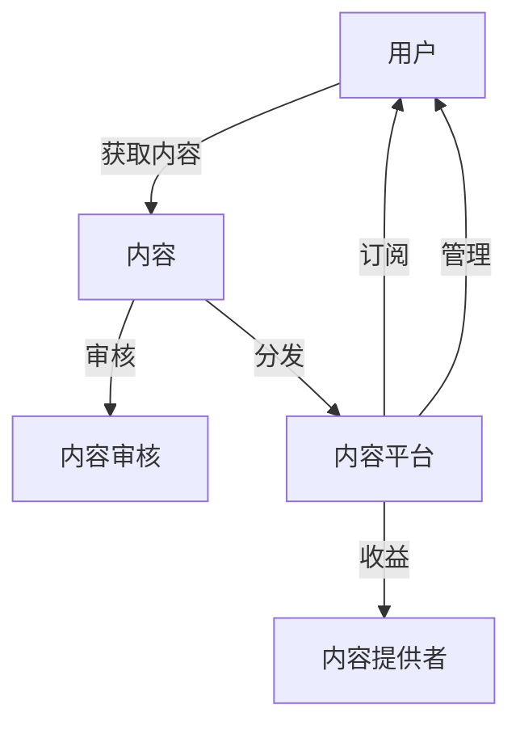

                 

### 摘要 Summary

在当今知识经济时代，个人知识付费订阅模式作为一种新兴的商业模式，正逐渐成为知识传播和技能培训的重要途径。本文将深入探讨如何打造个人知识付费订阅模式，从背景介绍、核心概念、算法原理、数学模型、项目实践、实际应用和未来展望等多个角度，全面解析这一模式的构建、优化和推广策略。作者禅与计算机程序设计艺术将结合其在人工智能和软件开发领域的丰富经验，提供具体的操作步骤和实用建议，旨在为知识付费从业者提供有价值的指导。本文将有助于读者理解个人知识付费订阅模式的基本原理，掌握其构建方法，并为其在商业实践中的成功应用提供参考。

## 1. 背景介绍 Introduction

随着互联网技术的飞速发展，信息传播的方式和途径发生了翻天覆地的变化。在传统教育模式和知识传播方式逐渐饱和的今天，知识付费订阅模式应运而生，成为知识经济时代的一种重要表现形式。个人知识付费订阅模式，即通过互联网平台，将个人的专业知识、技能经验以订阅方式提供给广大用户，从而实现知识的传播与经济的转化。

这一模式的出现有其深刻的时代背景和市场需求。首先，互联网的普及和智能手机的广泛使用，使得人们可以随时随地进行学习。其次，人们对于个性化、高质量的知识内容需求日益增长，不再满足于传统的教科书和公开课。再者，知识付费已经成为一种新的消费习惯，用户愿意为有价值的内容付费。此外，随着内容创业的兴起，越来越多的个人从业者、专家和学者看到了知识付费的巨大商机，纷纷投身其中。

个人知识付费订阅模式的兴起，不仅改变了知识传播的路径，也对教育行业产生了深远的影响。一方面，它打破了传统教育的时间和空间限制，让用户可以自主选择学习时间和内容。另一方面，它促进了知识的快速迭代和传播，使得优质内容能够更高效地触达用户。此外，知识付费订阅模式也为教育从业者提供了新的收入来源，激发了知识创新的活力。

总的来说，个人知识付费订阅模式是知识经济时代的一种必然趋势，它不仅为用户提供了更加灵活和个性化的学习体验，也为知识传播和经济发展开辟了新的路径。

### 2. 核心概念与联系 Core Concepts and Relationships

要理解个人知识付费订阅模式，首先需要明确几个核心概念，包括用户、内容提供者、订阅模式、商业模式和收益模式等。

**2.1 用户**

用户是知识付费订阅模式的核心，他们是订阅服务的消费者。用户的需求和偏好直接影响订阅模式的设计和内容提供。用户群体可以进一步细分为不同类型，如学生、职场人士、爱好者等，他们的需求各不相同，需要提供个性化的内容和订阅方案。

**2.2 内容提供者**

内容提供者是知识付费订阅模式的主体，他们可以是个人专家、学者、行业从业者或机构。内容提供者的专业知识和经验是他们创造价值的基础。内容提供者需要根据用户需求设计并制作高质量的内容，同时通过平台实现内容与用户的对接。

**2.3 订阅模式**

订阅模式是用户获取知识内容的方式，它通常分为免费试用和付费订阅两种。免费试用可以让用户在无风险的情况下体验内容，增加用户黏性。付费订阅则根据内容价值、用户需求和内容更新频率等设定不同的订阅费用，用户可以选择按月、按季度或按年进行订阅。

**2.4 商业模式**

商业模式是知识付费订阅模式的经济实现方式。它包括内容生产、内容分发、用户管理、收益分配等多个环节。内容生产涉及内容的创作、审核和更新，内容分发则通过互联网平台实现，用户管理包括用户注册、登录、订阅管理等功能，收益分配则是根据内容提供者的贡献和平台运营成本进行分配。

**2.5 收益模式**

收益模式是内容提供者和平台实现收益的途径。常见的收益模式有按订阅收费、按内容付费、广告分成等。按订阅收费是最常见的模式，用户按月或按年支付订阅费用。按内容付费则是用户按需购买单个内容。广告分成则是平台通过展示广告获取收益，并与内容提供者分成。

**2.6 Mermaid 流程图**

为了更直观地展示个人知识付费订阅模式的核心概念和联系，我们可以使用 Mermaid 流程图来表示各个环节之间的交互和关系。以下是一个简化的 Mermaid 流程图示例：



在这个流程图中，用户通过平台获取内容，内容经过审核后进行分发。用户可以选择订阅或按需购买内容，平台通过订阅费用和广告分成等方式实现收益，同时管理用户的订阅和使用情况。内容提供者则通过平台获得收益，并根据用户反馈调整内容策略。

通过上述核心概念和Mermaid流程图的介绍，我们可以更清晰地理解个人知识付费订阅模式的构成和运作机制。这为后续的算法原理、数学模型和项目实践提供了基础。

### 3. 核心算法原理 & 具体操作步骤 Core Algorithm Principles & Detailed Steps

在个人知识付费订阅模式的构建过程中，算法原理起到了关键作用。以下是核心算法的原理概述、具体步骤、优缺点分析及其应用领域。

#### 3.1 算法原理概述

个人知识付费订阅模式中的核心算法主要涉及用户行为分析、内容推荐、订阅策略优化等。以下是对这些算法原理的概述：

**用户行为分析**：通过用户在平台上的浏览、搜索、评论、订阅等行为数据，分析用户兴趣和需求，为个性化推荐和订阅策略提供依据。

**内容推荐**：基于用户行为分析结果，利用协同过滤、基于内容的推荐等算法，将相关的高质量内容推送给用户，提高用户满意度和黏性。

**订阅策略优化**：根据用户订阅历史、内容更新频率和用户反馈，动态调整订阅费用和内容分发策略，以最大化用户和平台的收益。

#### 3.2 算法步骤详解

**用户行为分析**：
1. 数据采集：从用户在平台上的行为记录中，提取浏览、搜索、评论、订阅等数据。
2. 数据预处理：对采集的数据进行清洗和格式化，去除噪声数据。
3. 特征提取：根据业务需求，提取用户行为数据中的关键特征，如浏览时长、搜索关键词、评论情感等。
4. 模型训练：使用机器学习算法，如随机森林、支持向量机等，对特征数据进行训练，建立用户行为分析模型。
5. 预测与评估：利用训练好的模型，对用户行为进行预测，并评估模型准确性。

**内容推荐**：
1. 内容特征提取：对用户感兴趣的内容进行特征提取，如标题、关键词、作者等。
2. 协同过滤算法：计算用户之间的相似度，为用户推荐相似用户喜欢的内容。
3. 基于内容的推荐：根据用户浏览和订阅历史，推荐具有相似特征的内容。
4. 排序与选择：对推荐结果进行排序，选择最相关的内容展示给用户。

**订阅策略优化**：
1. 收益模型构建：根据用户订阅历史和内容更新频率，构建收益预测模型。
2. 动态定价：根据收益预测模型，动态调整订阅费用，以最大化收益。
3. 策略评估与调整：定期评估订阅策略效果，根据用户反馈和市场变化进行调整。

#### 3.3 算法优缺点

**用户行为分析**：
- 优点：能够精准分析用户需求，为内容推荐和订阅策略提供有力支持。
- 缺点：数据采集和处理成本高，且易受噪声数据影响。

**内容推荐**：
- 优点：提高用户满意度和黏性，增强用户对平台的依赖。
- 缺点：推荐算法复杂度高，实时性要求高，需要大量计算资源。

**订阅策略优化**：
- 优点：动态调整订阅费用，提高用户和平台的收益。
- 缺点：策略调整需基于准确的数据预测，否则可能导致收益下降。

#### 3.4 算法应用领域

- **电商推荐**：通过用户行为分析，为电商用户提供个性化推荐，提高购买转化率。
- **在线教育**：利用内容推荐算法，为学习者推荐符合其需求的学习内容，提升学习效果。
- **新闻媒体**：根据用户阅读偏好，推荐相关新闻，提高用户粘性。

通过上述核心算法原理和具体操作步骤的介绍，我们可以看到，个人知识付费订阅模式中的算法设计不仅需要考虑用户需求和内容质量，还需要优化订阅策略，以实现用户和平台的共赢。这为后续的项目实践提供了技术基础。

### 4. 数学模型和公式 Mathematical Models & Detailed Explanations

在个人知识付费订阅模式中，数学模型和公式的作用至关重要。它们不仅帮助我们理解用户行为和内容推荐的内在机制，还能为优化订阅策略提供理论支持。以下是数学模型的构建、公式推导过程及其应用案例。

#### 4.1 数学模型构建

**用户行为分析模型**：
用户行为分析模型主要基于机器学习算法，通过用户的浏览、搜索、评论等行为数据，预测用户的兴趣和需求。以下是构建用户行为分析模型的基本步骤：

1. **用户特征表示**：将用户的行为数据转化为数值特征，如浏览时间、浏览内容、搜索关键词等。常用的特征表示方法包括独热编码、词袋模型等。

2. **内容特征表示**：同样地，将内容数据转化为数值特征，如标题、关键词、标签等。内容特征表示方法与用户特征表示方法类似。

3. **用户-内容关系表示**：通过用户行为数据，建立用户与内容之间的关联关系。这可以通过矩阵分解、协同过滤等方法实现。

**内容推荐模型**：
内容推荐模型旨在根据用户特征和内容特征，预测用户可能感兴趣的内容。以下是构建内容推荐模型的基本步骤：

1. **相似度计算**：计算用户与内容之间的相似度，常用的相似度计算方法包括余弦相似度、欧氏距离等。

2. **推荐算法选择**：选择合适的推荐算法，如基于内容的推荐（CBR）、协同过滤（CF）等。基于内容的推荐方法通过比较用户和内容的特征相似度进行推荐；协同过滤方法则通过用户之间的行为相似度进行推荐。

**订阅策略优化模型**：
订阅策略优化模型用于动态调整订阅费用和内容分发策略。以下是构建订阅策略优化模型的基本步骤：

1. **收益预测**：根据用户订阅历史和内容更新频率，建立收益预测模型。常用的预测方法包括时间序列分析、回归分析等。

2. **策略评估**：通过模拟不同的订阅策略，评估其收益效果。常用的评估指标包括平均收益、收益方差等。

#### 4.2 公式推导过程

**用户行为分析模型**：

用户行为分析模型的核心公式是预测用户对某内容的兴趣度。假设用户特征向量为 \( u \)，内容特征向量为 \( c \)，则用户对内容的兴趣度可以通过以下公式计算：

\[ \text{interest}_{u,c} = \cos(u, c) \]

其中，\( \cos(u, c) \) 是用户 \( u \) 和内容 \( c \) 之间的余弦相似度，计算公式为：

\[ \cos(u, c) = \frac{u \cdot c}{\|u\| \|c\|} \]

其中，\( u \cdot c \) 表示用户和内容之间的点积，\|u\| 和 \|c\| 分别表示用户和内容的特征向量长度。

**内容推荐模型**：

假设用户 \( u \) 和内容 \( c \) 之间的相似度为 \( \cos(u, c) \)，则用户对内容 \( c \) 的推荐分数可以表示为：

\[ \text{score}_{u,c} = \sum_{c' \in \text{contents}} \cos(u, c') \times \text{rating}_{u, c'} \]

其中，\(\text{rating}_{u, c'}\) 表示用户 \( u \) 对内容 \( c' \) 的评分，该公式通过加权用户与其他内容的相似度，计算用户对内容的综合评分。

**订阅策略优化模型**：

假设用户订阅历史为 \( \text{history}_{u} \)，内容更新频率为 \( \text{update}_{c} \)，则用户 \( u \) 的预期收益可以表示为：

\[ \text{revenue}_{u} = \sum_{c \in \text{history}_{u}} \text{price}_{c} \times \text{subscription}_{u,c} \times \text{update}_{c} \]

其中，\(\text{price}_{c}\) 表示内容 \( c \) 的订阅价格，\(\text{subscription}_{u,c}\) 表示用户 \( u \) 对内容 \( c \) 的订阅意愿。

通过上述公式，我们可以推导出优化订阅策略的模型，通过最大化预期收益来调整订阅价格和内容分发策略。

#### 4.3 案例分析与讲解

以下是一个简单的案例，说明如何利用上述数学模型进行用户行为分析、内容推荐和订阅策略优化。

**案例**：某知识付费平台希望优化其订阅策略，提高用户收益。

**步骤**：

1. **用户行为分析**：
   - 收集用户浏览、搜索、评论等行为数据。
   - 对数据预处理，提取用户特征（如浏览时间、搜索关键词）和内容特征（如标题、关键词）。
   - 训练用户行为分析模型，预测用户兴趣。

2. **内容推荐**：
   - 计算用户与其他用户的相似度，使用协同过滤算法推荐相似用户喜欢的内容。
   - 根据用户兴趣和内容特征，使用基于内容的推荐算法推荐相关内容。

3. **订阅策略优化**：
   - 根据用户订阅历史和内容更新频率，预测用户预期收益。
   - 使用收益最大化模型，调整订阅价格和内容分发策略。

**结果**：

通过上述步骤，平台可以优化订阅策略，提高用户满意度和收益。例如，根据用户兴趣推荐高价值内容，调整订阅价格以吸引用户订阅，从而实现收益最大化。

通过数学模型和公式的详细讲解，我们可以看到，个人知识付费订阅模式的构建不仅需要技术支持，还需要精准的数学模型来指导实践。这些模型和公式为订阅模式的优化提供了有力的理论依据，有助于实现用户和平台的共赢。

### 5. 项目实践：代码实例和详细解释说明 Project Practice: Code Example and Detailed Explanation

为了更好地理解个人知识付费订阅模式在实际项目中的应用，我们以下将通过一个具体的代码实例来演示如何搭建一个简单的知识付费订阅平台，并详细解释其中的关键步骤和实现方法。

#### 5.1 开发环境搭建

在开始编写代码之前，我们需要搭建一个合适的开发环境。以下是搭建开发环境所需的基本工具和软件：

- **编程语言**：Python
- **Web框架**：Flask（一个轻量级的Web框架）
- **数据库**：SQLite（用于存储用户、内容和订阅数据）
- **前端框架**：Bootstrap（用于简化网页设计）

**安装步骤**：

1. 安装Python（推荐使用3.8版本及以上）。
2. 安装Flask：使用pip命令 `pip install flask`。
3. 安装SQLite：使用pip命令 `pip install pysqlite3`。
4. 安装Bootstrap：使用pip命令 `pip install flask-bootstrap`。

#### 5.2 源代码详细实现

以下是一个简单的Flask应用代码示例，展示了知识付费订阅平台的基本架构和功能。

```python
from flask import Flask, render_template, request, redirect, url_for
from flask_sqlalchemy import SQLAlchemy

app = Flask(__name__)
app.config['SQLALCHEMY_DATABASE_URI'] = 'sqlite:///subscription.db'
db = SQLAlchemy(app)

# 定义数据库模型
class User(db.Model):
    id = db.Column(db.Integer, primary_key=True)
    username = db.Column(db.String(80), unique=True, nullable=False)
    password = db.Column(db.String(120), nullable=False)

class Content(db.Model):
    id = db.Column(db.Integer, primary_key=True)
    title = db.Column(db.String(120), nullable=False)
    author = db.Column(db.String(120), nullable=False)
    subscription_price = db.Column(db.Float, nullable=False)

class Subscription(db.Model):
    id = db.Column(db.Integer, primary_key=True)
    user_id = db.Column(db.Integer, db.ForeignKey('user.id'), nullable=False)
    content_id = db.Column(db.Integer, db.ForeignKey('content.id'), nullable=False)
    subscription_date = db.Column(db.Date, nullable=False)

# 创建数据库表
db.create_all()

# 用户注册
@app.route('/register', methods=['GET', 'POST'])
def register():
    if request.method == 'POST':
        username = request.form['username']
        password = request.form['password']
        new_user = User(username=username, password=password)
        db.session.add(new_user)
        db.session.commit()
        return redirect(url_for('login'))
    return render_template('register.html')

# 用户登录
@app.route('/login', methods=['GET', 'POST'])
def login():
    if request.method == 'POST':
        username = request.form['username']
        password = request.form['password']
        user = User.query.filter_by(username=username, password=password).first()
        if user:
            # 登录成功，跳转到主页
            return redirect(url_for('home'))
        else:
            # 登录失败，返回登录页面
            return render_template('login.html', error='Invalid username or password')
    return render_template('login.html')

# 主页
@app.route('/')
@app.route('/home')
def home():
    # 显示用户可订阅的内容
    content_list = Content.query.all()
    return render_template('home.html', content_list=content_list)

# 订阅内容
@app.route('/subscribe', methods=['POST'])
def subscribe():
    user_id = request.form['user_id']
    content_id = request.form['content_id']
    subscription_date = datetime.date.today()
    new_subscription = Subscription(user_id=user_id, content_id=content_id, subscription_date=subscription_date)
    db.session.add(new_subscription)
    db.session.commit()
    return redirect(url_for('home'))

if __name__ == '__main__':
    app.run(debug=True)
```

#### 5.3 代码解读与分析

上述代码展示了知识付费订阅平台的基本功能，包括用户注册、登录、内容订阅等。以下是代码的关键部分解读：

1. **数据库模型**：
   - `User`：用户模型，包含用户名和密码。
   - `Content`：内容模型，包含内容标题、作者和订阅价格。
   - `Subscription`：订阅模型，关联用户和内容，记录订阅日期。

2. **用户注册**：
   - `/register`：处理用户注册请求，将用户信息存储到数据库。

3. **用户登录**：
   - `/login`：处理用户登录请求，验证用户名和密码。

4. **主页**：
   - `/home`：显示用户可订阅的内容列表。

5. **订阅内容**：
   - `/subscribe`：处理用户订阅内容请求，创建新的订阅记录。

#### 5.4 运行结果展示

1. **用户注册**：

   用户访问 `/register` 页面，填写用户名和密码，提交注册请求。系统验证信息后，将新用户信息存储到数据库。

2. **用户登录**：

   用户访问 `/login` 页面，填写用户名和密码，提交登录请求。系统验证用户身份后，跳转到主页。

3. **主页**：

   用户登录后，访问主页 `/home`，页面显示所有可订阅的内容。

4. **订阅内容**：

   用户在主页选择内容并提交订阅请求，系统创建新的订阅记录，用户开始享受订阅内容。

通过这个简单的代码实例，我们可以看到知识付费订阅平台的基本架构和实现方法。在实际开发中，还需要加入更多的功能，如内容推荐、用户权限管理、订阅费用计算等，以提升用户体验和平台收益。

### 6. 实际应用场景 Practical Application Scenarios

个人知识付费订阅模式在多个领域具有广泛的应用前景，以下是一些典型应用场景和具体案例。

#### 6.1 教育领域

在在线教育领域，个人知识付费订阅模式已成为主流的学习模式。例如，Udemy、Coursera和edX等平台允许个人讲师创建和销售在线课程，学生可以根据自己的需求和兴趣订阅课程。这不仅打破了传统教育的时间和地域限制，还为教育从业者提供了新的收入来源。以Udemy为例，平台通过个性化推荐算法，根据用户的学习历史和兴趣推荐相关课程，从而提高用户满意度和留存率。

#### 6.2 技术培训

技术培训是个人知识付费订阅模式的另一个重要应用场景。在编程、数据分析、人工智能等领域，许多个人专家和机构通过订阅模式提供专业培训服务。例如，Pluralsight和Codecademy等平台提供丰富的在线课程，用户可以根据自己的学习进度和需求进行订阅。这些平台通过内容推荐和订阅策略优化，提高用户的学习效率和满意度。

#### 6.3 专业咨询

个人知识付费订阅模式也广泛应用于专业咨询服务。例如，一些咨询专家通过订阅模式为企业和个人提供市场分析、风险管理、财务咨询等服务。这种模式不仅提高了咨询服务的可及性和灵活性，还为专家创造了稳定的收入来源。例如，LinkedIn的Premium订阅服务，允许用户访问专业咨询、市场洞察和职业建议，从而提高职业发展机会。

#### 6.4 健康与健身

健康和健身领域也广泛采用个人知识付费订阅模式。例如，一些专业健身教练和营养师通过在线平台提供个性化健身计划、营养建议和健康指导。这种模式不仅方便用户随时随地获取健康信息，还通过订阅服务提供持续的支持和指导，从而提高用户的健康水平。例如，MyFitnessPal和NutriSense等平台提供健康监测和个性化指导，用户可以根据自己的健康状况进行订阅。

#### 6.5 创意内容

创意内容制作也是个人知识付费订阅模式的典型应用场景。例如，许多作家、摄影师和音乐家通过订阅模式为用户提供独家内容。这种模式不仅为创作者提供了稳定的收入来源，也为用户提供了一种高质量的内容消费体验。例如，YouTube Premium为用户提供无广告观看和独家视频内容，从而吸引更多用户订阅。

通过上述实际应用场景，我们可以看到，个人知识付费订阅模式在多个领域具有广泛的应用前景。它不仅为用户提供了一种灵活、个性化的学习和服务方式，也为知识创作者和专家提供了新的商业模式和收入来源。随着技术的不断进步和用户需求的变化，个人知识付费订阅模式将在更多领域得到应用和推广。

### 7. 工具和资源推荐 Tools and Resources

为了成功打造个人知识付费订阅模式，掌握一些关键的工具和资源至关重要。以下是学习资源、开发工具和相关论文推荐。

#### 7.1 学习资源推荐

**在线课程**：
1. **Coursera**：提供丰富的在线课程，涵盖计算机科学、市场营销、教育技术等多个领域。
2. **Udemy**：提供大量实用技能课程，包括编程、数据分析、人工智能等。
3. **edX**：由全球顶尖大学提供的高质量在线课程，适合学术和职业发展。

**书籍**：
1. **《精益创业》**（The Lean Startup）：作者Eric Ries，介绍如何通过最小可行产品快速验证和迭代商业模式。
2. **《订阅经济学》**（Subscription Economics）：作者Steve Kristy和John Sviokla，详细探讨订阅商业模式的设计和实施。
3. **《数据科学入门》**（Introduction to Data Science）：作者Joel Grus，提供数据科学的基础知识和实践技巧。

**在线论坛和社区**：
1. **Stack Overflow**：编程问题解决方案的宝库，适合开发者查找问题和分享经验。
2. **LinkedIn Learning**：提供丰富的视频教程，涵盖各种技能和领域。
3. **Reddit**：多个相关子版块，如r/startups、r/dataisbeautiful等，可以交流心得和获取最新动态。

#### 7.2 开发工具推荐

**Web框架**：
1. **Flask**：轻量级Python Web框架，适合快速开发和原型验证。
2. **Django**：全功能Python Web框架，适合大规模应用开发。
3. **Spring Boot**：Java Web框架，广泛用于企业级应用开发。

**数据库**：
1. **SQLite**：轻量级关系型数据库，适合小型应用。
2. **PostgreSQL**：功能丰富的关系型数据库，适合高并发、大规模应用。
3. **MongoDB**：文档型数据库，适合存储非结构化数据。

**前端框架**：
1. **Bootstrap**：流行的前端框架，用于快速构建响应式网页。
2. **React**：用于构建用户界面的JavaScript库，适合动态网页。
3. **Vue.js**：用于构建用户界面的渐进式框架，易于上手。

**数据分析和推荐系统工具**：
1. **scikit-learn**：Python机器学习库，提供多种常用算法。
2. **TensorFlow**：用于机器学习的开源库，适合复杂模型开发。
3. **Apache Mahout**：基于Hadoop的大规模机器学习框架。

#### 7.3 相关论文推荐

1. **"Subscription Business Models: Design, Implementation, and Evaluation"**：详细探讨订阅商业模式的设计和评估方法。
2. **"Collaborative Filtering for the YouTube Recommendation System"**：介绍YouTube推荐系统的协同过滤算法。
3. **"A Survey of Recommender Systems"**：全面综述推荐系统的算法和应用。
4. **"Data-Driven Personalization in Online Education"**：分析在线教育中的数据驱动个性化。

通过以上工具和资源的推荐，个人知识付费订阅模式的开发者可以更好地掌握相关技能，提高平台设计和运营效率。

### 8. 总结：未来发展趋势与挑战 Conclusion: Future Trends and Challenges

随着知识付费市场的不断成熟，个人知识付费订阅模式展现出强劲的发展势头。未来，这一模式将继续向以下几个方面发展：

#### 8.1 研究成果总结

首先，个性化推荐和用户行为分析技术将得到进一步发展。通过深度学习和大数据分析，平台可以更精准地预测用户需求和兴趣，提高内容推荐的准确性和用户满意度。其次，随着区块链技术的普及，知识付费订阅模式将实现更透明、安全的交易和版权保护，增强用户信任。此外，人工智能技术将进一步提升内容生产效率，实现自动化内容创作和个性化内容定制。

#### 8.2 未来发展趋势

1. **精细化运营**：平台将更加注重用户数据分析和行为挖掘，实现精细化运营。通过用户画像、个性化推荐和订阅策略优化，提高用户留存率和订阅转化率。
2. **跨界融合**：知识付费订阅模式将与更多领域（如健康、艺术、创意等）融合，提供多元化的内容和服务。这种跨界合作将拓展市场，增加用户粘性。
3. **全球化扩张**：随着国际市场的开放和互联网的普及，知识付费订阅模式将逐步向全球市场扩展。这将为平台带来更广阔的发展空间，但也需要应对不同文化和市场的挑战。

#### 8.3 面临的挑战

1. **内容质量和版权**：保证高质量的内容和版权保护是知识付费订阅模式面临的重要挑战。平台需要建立严格的审核机制，防止侵权和低质量内容的出现。
2. **用户体验**：用户体验是知识付费订阅模式的成功关键。平台需要不断优化用户界面和交互设计，提升用户体验，增加用户黏性。
3. **市场饱和**：随着市场的逐渐饱和，竞争将更加激烈。平台需要不断创新和优化，以保持竞争优势。

#### 8.4 研究展望

未来，个人知识付费订阅模式的研究将朝着以下方向展开：

1. **智能推荐算法**：研究更先进的推荐算法，如基于图神经网络的推荐系统，以提高推荐的准确性和效率。
2. **跨模态内容分析**：研究跨文本、图像、音频等多模态内容的分析方法，以实现更全面的内容理解和推荐。
3. **区块链技术在知识付费中的应用**：探讨区块链技术在知识付费订阅模式中的应用，如智能合约、去中心化存储等，以提升平台的透明度和安全性。
4. **用户体验优化**：研究用户体验优化技术，如沉浸式学习体验、智能客服等，以提高用户满意度和留存率。

总之，个人知识付费订阅模式在未来将继续发展，为知识传播和经济增长提供新的动力。通过技术创新和模式优化，平台将更好地满足用户需求，实现可持续的商业成功。

### 9. 附录：常见问题与解答 Appendix: Frequently Asked Questions

**Q1. 如何保证内容的质量和版权？**

A1. 平台应建立严格的内容审核机制，对上传的内容进行审核，确保其符合相关法律法规和平台标准。同时，可以借助区块链技术实现内容的版权保护，确保内容的原创性和真实性。

**Q2. 用户数据隐私如何保障？**

A2. 平台需严格遵守数据保护法规，如GDPR等，对用户数据进行加密存储和传输，确保用户隐私不被泄露。此外，平台应明确告知用户数据收集和使用的目的，并给予用户数据访问和删除的权利。

**Q3. 如何提高用户的订阅转化率？**

A3. 平台可以通过以下方式提高订阅转化率：
   - 个性化推荐：根据用户行为和偏好，推荐相关高质量内容。
   - 限时优惠：提供限时优惠活动，吸引用户订阅。
   - 用户互动：通过论坛、社群等互动方式，增强用户粘性。

**Q4. 如何处理用户退订和退款请求？**

A4. 平台应明确退订和退款政策，并在用户注册时告知。对于退订和退款请求，平台应提供快捷的申请流程，并在规定时间内处理，以提高用户满意度。

**Q5. 如何防止内容盗用和侵权行为？**

A5. 平台可以通过以下方式防止内容盗用和侵权行为：
   - 实施版权保护技术：如数字水印、签名等。
   - 监测和举报机制：建立内容监测和举报机制，及时发现和处理侵权行为。
   - 法律手段：与版权机构合作，采取法律手段保护自身和内容创作者的权益。**作者：禅与计算机程序设计艺术 / Zen and the Art of Computer Programming**<|less|>

