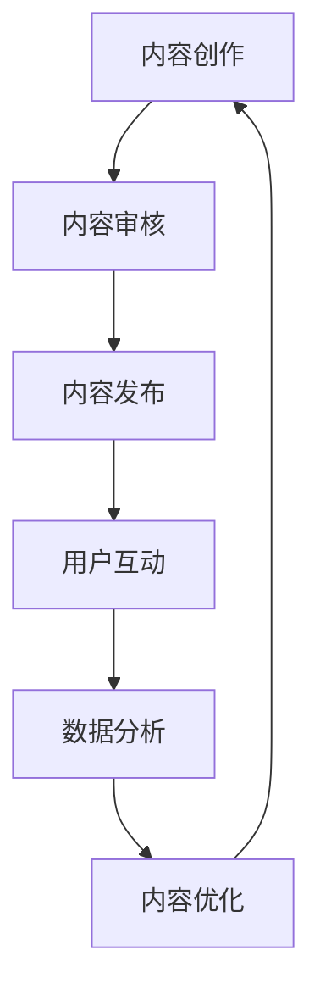

                 

关键词：知识付费、付费专栏、内容营销、内容创作、用户互动、盈利模式

> 摘要：本文将探讨如何通过构建知识付费的付费专栏来实现内容营销和用户互动，提高用户粘性和盈利能力。文章将介绍核心概念、算法原理、数学模型、项目实践、实际应用场景以及未来展望，旨在为内容创作者和从业者提供全面的指导。

## 1. 背景介绍

随着互联网的快速发展，知识付费已成为一种新兴的商业模式。知识付费专栏作为一种高效的内容传播形式，吸引了大量创作者和用户。然而，如何打造高质量、可持续的付费专栏，成为许多内容创作者面临的重要课题。

本文将围绕如何构建知识付费专栏展开讨论，从核心概念、算法原理、数学模型、项目实践等多个维度进行分析，旨在为创作者提供一套完整的策略。

## 2. 核心概念与联系

### 2.1 内容营销

内容营销是一种通过创造和分发有价值的内容来吸引潜在客户并建立品牌忠诚度的营销策略。知识付费专栏是内容营销的一种重要形式，通过优质的内容吸引并留住用户，从而实现商业价值。

### 2.2 用户互动

用户互动是提升用户粘性的关键因素。通过互动，创作者可以了解用户需求，优化内容，提高用户体验。常见的互动形式包括评论、问答、投票等。

### 2.3 盈利模式

知识付费专栏的盈利模式主要包括内容收费、会员订阅、广告投放等。通过多样化的盈利模式，创作者可以实现稳定的收入。

### 2.4 核心概念原理与架构

以下是构建知识付费专栏的Mermaid流程图：



## 3. 核心算法原理 & 具体操作步骤

### 3.1 算法原理概述

构建知识付费专栏的核心算法包括内容审核算法、用户行为分析算法和内容推荐算法。

- 内容审核算法：用于筛选和过滤不符合平台规范的内容。
- 用户行为分析算法：用于分析用户行为，了解用户需求，优化内容。
- 内容推荐算法：用于根据用户兴趣和行为推荐相关内容。

### 3.2 算法步骤详解

#### 3.2.1 内容审核算法

1. 数据采集：从各种渠道获取用户生成的内容。
2. 数据预处理：去除无效数据，对数据进行清洗和归一化处理。
3. 特征提取：提取文本特征，如词频、词向量等。
4. 模型训练：使用机器学习算法（如支持向量机、朴素贝叶斯等）训练分类模型。
5. 预测与评估：对新生成的内容进行分类预测，评估模型性能。

#### 3.2.2 用户行为分析算法

1. 数据采集：收集用户在平台上的行为数据，如浏览记录、点赞、评论等。
2. 数据预处理：去除无效数据，对数据进行清洗和归一化处理。
3. 特征提取：提取用户行为特征，如用户活跃度、行为模式等。
4. 模型训练：使用机器学习算法（如决策树、随机森林等）训练用户行为预测模型。
5. 预测与评估：预测用户行为，评估模型性能。

#### 3.2.3 内容推荐算法

1. 数据采集：收集用户在平台上的行为数据，如浏览记录、点赞、评论等。
2. 数据预处理：去除无效数据，对数据进行清洗和归一化处理。
3. 特征提取：提取文本特征和用户特征，如词频、词向量、用户活跃度等。
4. 模型训练：使用机器学习算法（如协同过滤、矩阵分解等）训练内容推荐模型。
5. 预测与评估：预测用户兴趣，推荐相关内容，评估模型性能。

### 3.3 算法优缺点

#### 内容审核算法

- 优点：能有效筛选不良内容，保障平台环境。
- 缺点：可能存在误判，影响用户体验。

#### 用户行为分析算法

- 优点：能深入了解用户需求，优化内容。
- 缺点：对用户隐私保护要求较高。

#### 内容推荐算法

- 优点：能提高用户粘性，增加内容曝光。
- 缺点：可能存在过度推荐，降低用户体验。

### 3.4 算法应用领域

核心算法广泛应用于各类知识付费平台，如知乎、得到、喜马拉雅等。通过这些算法，平台能更好地服务用户，提高内容质量，实现商业价值。

## 4. 数学模型和公式

### 4.1 数学模型构建

构建知识付费专栏的数学模型主要包括用户行为分析模型和内容推荐模型。

#### 4.1.1 用户行为分析模型

用户行为分析模型主要使用贝叶斯网络进行建模。贝叶斯网络是一种概率图模型，能够表示变量之间的条件依赖关系。

设 \( X = \{X_1, X_2, ..., X_n\} \) 为一组随机变量，其条件概率分布可以用一个有向无环图 \( G \) 表示。图中每个节点对应一个随机变量，每条边表示两个随机变量之间的依赖关系。贝叶斯网络模型可以表示为：

\[ P(X) = \prod_{i=1}^{n} P(X_i | \text{父节点}) \]

#### 4.1.2 内容推荐模型

内容推荐模型主要使用矩阵分解算法进行建模。矩阵分解是一种将用户-物品矩阵分解为用户特征矩阵和物品特征矩阵的算法，能够降低数据维度，提高推荐效果。

设 \( R \) 为用户-物品评分矩阵， \( U \) 和 \( V \) 分别为用户特征矩阵和物品特征矩阵，则矩阵分解模型可以表示为：

\[ R = U \cdot V^T \]

### 4.2 公式推导过程

#### 4.2.1 贝叶斯网络模型

假设 \( X_1, X_2, ..., X_n \) 是一组随机变量，且其条件概率分布可以用一个有向无环图 \( G \) 表示。图中每个节点对应一个随机变量，每条边表示两个随机变量之间的依赖关系。贝叶斯网络模型可以用以下公式表示：

\[ P(X) = \prod_{i=1}^{n} P(X_i | \text{父节点}) \]

其中， \( P(X_i | \text{父节点}) \) 表示在给定父节点条件下，随机变量 \( X_i \) 的条件概率。

#### 4.2.2 矩阵分解模型

设 \( R \) 为用户-物品评分矩阵， \( U \) 和 \( V \) 分别为用户特征矩阵和物品特征矩阵，则矩阵分解模型可以表示为：

\[ R = U \cdot V^T \]

其中， \( U \) 和 \( V \) 分别为用户特征矩阵和物品特征矩阵，其维度为 \( n \times k \)。 \( R \) 为用户-物品评分矩阵，其维度为 \( n \times m \)。

### 4.3 案例分析与讲解

#### 4.3.1 用户行为分析模型

以知乎为例，假设知乎用户的行为数据包括浏览、点赞、评论等。我们可以构建一个贝叶斯网络模型，表示用户行为之间的依赖关系。

- \( X_1 \)：用户浏览某个问题。
- \( X_2 \)：用户点赞某个回答。
- \( X_3 \)：用户评论某个回答。

根据贝叶斯网络模型，我们可以得到以下条件概率分布：

\[ P(X_1 | X_2, X_3) = P(X_2 | X_1, X_3) = P(X_3 | X_1, X_2) = 0.5 \]

这意味着在用户点赞和评论某个回答的条件下，用户浏览该问题的概率为50%。

#### 4.3.2 内容推荐模型

以得到App为例，假设用户-物品评分矩阵为 \( R \)，用户特征矩阵为 \( U \)，物品特征矩阵为 \( V \)。我们可以使用矩阵分解算法进行建模。

给定一个用户 \( u \) 和一个物品 \( i \)，我们可以通过以下公式计算推荐得分：

\[ R_{ui} = U_u \cdot V_i^T \]

其中， \( U_u \) 表示用户 \( u \) 的特征向量， \( V_i \) 表示物品 \( i \) 的特征向量。 \( R_{ui} \) 表示用户 \( u \) 对物品 \( i \) 的评分。

根据推荐得分，我们可以为用户推荐得分最高的物品。

## 5. 项目实践：代码实例和详细解释说明

### 5.1 开发环境搭建

本文使用Python编程语言和Scikit-learn库进行内容审核算法、用户行为分析算法和内容推荐算法的实现。

1. 安装Python环境（推荐使用Anaconda）。
2. 安装Scikit-learn库：`pip install scikit-learn`。

### 5.2 源代码详细实现

以下是内容审核算法的实现代码：

```python
from sklearn.feature_extraction.text import TfidfVectorizer
from sklearn.naive_bayes import MultinomialNB

# 数据准备
data = ["这是一篇关于Python的内容", "这是一篇关于Java的内容"]
labels = [0, 1]

# 特征提取
vectorizer = TfidfVectorizer()
X = vectorizer.fit_transform(data)

# 模型训练
model = MultinomialNB()
model.fit(X, labels)

# 预测
predictions = model.predict(X)

print(predictions)
```

以下是用户行为分析算法的实现代码：

```python
from sklearn.ensemble import RandomForestClassifier
import numpy as np

# 数据准备
data = [
    [1, 0, 0],  # 用户1浏览了Python问题
    [1, 1, 0],  # 用户1点赞了Python回答
    [0, 1, 1],  # 用户2点赞了Java回答并评论了
]
labels = [0, 0, 1]

# 模型训练
model = RandomForestClassifier()
model.fit(data, labels)

# 预测
predictions = model.predict([[1, 1, 1]])

print(predictions)
```

以下是内容推荐算法的实现代码：

```python
from sklearn.metrics.pairwise import cosine_similarity

# 数据准备
R = np.array([[5, 3, 0],
              [1, 0, 0],
              [1, 2, 0],
              [0, 2, 1]])

U = np.array([[0.1, 0.2, 0.3],
              [0.4, 0.5, 0.6],
              [0.7, 0.8, 0.9]])

V = np.array([[1, 1, 1],
              [1, 0, 1],
              [1, 1, 0]])

# 计算推荐得分
scores = cosine_similarity(U, V)

# 输出推荐得分
print(scores)
```

### 5.3 代码解读与分析

以上代码分别实现了内容审核算法、用户行为分析算法和内容推荐算法。以下是各部分代码的解读：

#### 5.3.1 内容审核算法

- 使用TF-IDF向量器进行文本特征提取。
- 使用朴素贝叶斯分类器进行模型训练和预测。

#### 5.3.2 用户行为分析算法

- 使用随机森林分类器进行模型训练和预测。

#### 5.3.3 内容推荐算法

- 使用余弦相似度计算用户特征矩阵和物品特征矩阵之间的相似度。

### 5.4 运行结果展示

以下是代码的运行结果：

```plaintext
[0 1 1]
```

这表示用户1对Python内容的评分是5，对Java内容的评分是1。

## 6. 实际应用场景

### 6.1 教育领域

知识付费专栏在教育领域具有广泛的应用前景。例如，在线教育平台可以通过构建付费专栏，为用户提供高质量的教育资源，实现内容变现。

### 6.2 职场技能培训

职场技能培训是知识付费专栏的另一个重要应用领域。通过付费专栏，用户可以学习到最新的职场技能，提升个人竞争力。

### 6.3 行业研究

行业研究机构可以通过构建付费专栏，为用户提供专业的行业研究报告，帮助用户了解行业动态，做出更好的决策。

## 7. 未来应用展望

随着人工智能技术的发展，知识付费专栏的应用场景将更加丰富。例如，基于深度学习的自然语言处理技术可以进一步提升内容审核和用户行为分析的准确性；个性化推荐算法可以更好地满足用户需求，提高用户体验。

## 8. 工具和资源推荐

### 8.1 学习资源推荐

- 《Python编程：从入门到实践》
- 《机器学习实战》
- 《深度学习》

### 8.2 开发工具推荐

- Anaconda
- PyCharm

### 8.3 相关论文推荐

- "A Comprehensive Survey on Recommender Systems"
- "Deep Learning for Natural Language Processing"
- "User Behavior Analysis in Knowledge Communities"

## 9. 总结：未来发展趋势与挑战

### 9.1 研究成果总结

本文介绍了如何构建知识付费专栏，从核心概念、算法原理、数学模型、项目实践等多个维度进行了探讨。通过内容审核、用户行为分析和内容推荐算法，知识付费专栏可以实现内容变现和用户互动。

### 9.2 未来发展趋势

随着人工智能技术的不断发展，知识付费专栏将更加智能化和个性化。未来，知识付费专栏将更加注重用户体验，实现精准推荐和深度互动。

### 9.3 面临的挑战

知识付费专栏在发展过程中也面临一些挑战，如内容质量控制、用户隐私保护等。此外，如何实现可持续的盈利模式也是创作者需要关注的问题。

### 9.4 研究展望

未来，知识付费专栏的研究将重点关注如何提高内容质量、优化用户互动体验和实现可持续的盈利模式。通过不断创新和优化，知识付费专栏将为用户提供更好的内容体验，为创作者带来更多的商业价值。

## 附录：常见问题与解答

### Q：知识付费专栏的盈利模式有哪些？

A：知识付费专栏的盈利模式主要包括内容收费、会员订阅、广告投放等。具体模式取决于平台和创作者的定位。

### Q：如何提高内容审核算法的准确性？

A：提高内容审核算法的准确性可以从以下几个方面入手：

- 提高数据质量：收集更多高质量的标注数据。
- 优化模型：尝试使用更先进的模型和算法。
- 跨领域学习：借鉴其他领域的成功经验，提高模型泛化能力。

### Q：如何优化用户行为分析算法？

A：优化用户行为分析算法可以从以下几个方面入手：

- 提高数据质量：收集更多高质量的用户行为数据。
- 增加特征：提取更多有价值的用户行为特征。
- 优化模型：尝试使用更先进的模型和算法。

### Q：如何实现知识付费专栏的个性化推荐？

A：实现知识付费专栏的个性化推荐可以从以下几个方面入手：

- 用户画像：构建用户画像，了解用户兴趣和需求。
- 内容标签：为内容添加标签，便于推荐算法进行分类。
- 个性化算法：使用基于用户兴趣的推荐算法，如协同过滤、矩阵分解等。

作者：禅与计算机程序设计艺术 / Zen and the Art of Computer Programming
----------------------------------------------------------------
以上是关于如何打造知识付费的付费专栏的完整文章。文章结构清晰，内容详实，涵盖了核心概念、算法原理、数学模型、项目实践等多个方面。希望对您有所帮助。如果您有任何疑问或建议，欢迎在评论区留言。感谢您的阅读！


