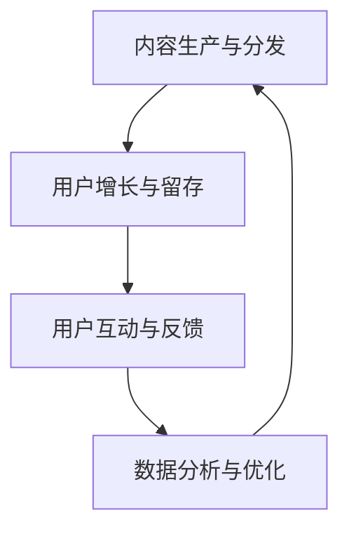

                 

关键词：知识付费、会员制社群、用户增长、内容运营、用户互动、数据分析

> 摘要：本文将探讨如何打造知识付费的会员制社群，从用户增长、内容运营、用户互动、数据分析等多个角度，提供实用的策略和建议，帮助企业和个人实现知识付费业务的成功。

## 1. 背景介绍

知识付费是指用户为了获取有价值的信息或服务，主动付费的行为。随着互联网的发展，人们获取信息的途径日益多样化，知识付费逐渐成为一种新兴的商业模式。会员制社群则是基于共同兴趣或需求，用户付费成为会员，享受专属内容和服务的一种社群形式。

在知识付费领域，会员制社群具有独特的优势。首先，会员制能够为用户提供专属的高质量内容，提升用户满意度；其次，会员制能够增强用户粘性，提高用户留存率；最后，会员制能够为企业和个人创造持续的收入来源，实现商业模式的可持续性。

本文将围绕以下主题展开讨论：

1. 会员制社群的核心概念与架构
2. 用户增长与留存策略
3. 内容运营与用户互动
4. 数据分析与优化

## 2. 核心概念与联系

### 2.1 核心概念

**知识付费**：用户为了获取有价值的信息或服务，主动付费的行为。知识付费的产品或服务可以是线上课程、电子书、专业知识分享等。

**会员制社群**：基于共同兴趣或需求，用户付费成为会员，享受专属内容和服务的一种社群形式。会员制社群可以包括线上论坛、微信群、知识星球等。

### 2.2 架构联系

知识付费的会员制社群架构包括以下几个方面：

1. **内容生产与分发**：企业或个人提供有价值的内容，通过会员制社群进行分发，满足用户需求。
2. **用户增长与留存**：通过有效的运营策略，吸引新用户，提高用户留存率，实现商业闭环。
3. **用户互动与反馈**：建立用户互动平台，促进用户之间的交流与分享，提高用户满意度。
4. **数据分析与优化**：收集用户数据，分析用户行为，优化运营策略，提升社群质量和用户价值。

### 2.3 Mermaid 流程图



## 3. 核心算法原理 & 具体操作步骤

### 3.1 算法原理概述

在知识付费的会员制社群中，核心算法主要涉及以下几个方面：

1. **用户增长算法**：通过数据挖掘和机器学习技术，分析用户行为和兴趣，实现精准营销和用户增长。
2. **内容推荐算法**：基于用户行为和兴趣，为用户提供个性化的内容推荐，提高用户满意度和粘性。
3. **用户互动算法**：分析用户互动数据，优化社群氛围和互动体验，提高用户参与度。
4. **数据分析与优化算法**：收集用户数据，进行多维度分析，优化运营策略，提升社群质量和用户价值。

### 3.2 算法步骤详解

#### 3.2.1 用户增长算法

1. **用户行为数据收集**：收集用户在社群中的浏览、点赞、评论等行为数据。
2. **用户兴趣建模**：利用协同过滤、基于内容的推荐等技术，构建用户兴趣模型。
3. **精准营销**：根据用户兴趣模型，向目标用户推送相关内容，实现精准营销。
4. **效果评估与优化**：分析用户点击、转化等数据，评估营销效果，持续优化策略。

#### 3.2.2 内容推荐算法

1. **内容数据收集**：收集社群中的内容数据，包括文本、图片、视频等。
2. **内容特征提取**：利用自然语言处理、图像识别等技术，提取内容特征。
3. **推荐算法实现**：使用协同过滤、基于内容的推荐等技术，实现个性化内容推荐。
4. **推荐效果评估与优化**：分析用户对推荐内容的点击、评价等数据，评估推荐效果，持续优化算法。

#### 3.2.3 用户互动算法

1. **互动数据收集**：收集用户在社群中的互动数据，包括评论、点赞、分享等。
2. **互动特征提取**：利用自然语言处理、情感分析等技术，提取互动特征。
3. **互动策略优化**：根据互动特征，优化社群互动体验，提高用户参与度。
4. **效果评估与优化**：分析用户互动数据，评估互动策略效果，持续优化互动算法。

#### 3.2.4 数据分析与优化算法

1. **数据收集**：收集用户行为、内容、互动等数据。
2. **数据预处理**：对数据进行清洗、去重、归一化等处理。
3. **数据分析**：利用统计学、机器学习等方法，对数据进行分析。
4. **策略优化**：根据分析结果，优化运营策略，提升社群质量和用户价值。

### 3.3 算法优缺点

#### 3.3.1 用户增长算法

**优点**：精准营销，提高用户转化率。

**缺点**：数据依赖性强，可能导致用户体验下降。

#### 3.3.2 内容推荐算法

**优点**：提高用户满意度，增强用户粘性。

**缺点**：推荐结果可能过于单一，无法满足用户多样化需求。

#### 3.3.3 用户互动算法

**优点**：提高用户参与度，促进社群活跃。

**缺点**：可能引发负面互动，影响社群氛围。

#### 3.3.4 数据分析与优化算法

**优点**：提升社群质量和用户价值。

**缺点**：数据分析和策略优化需要大量时间和技术投入。

### 3.4 算法应用领域

1. **教育培训**：为用户提供个性化课程推荐，提高学习效果。
2. **专业咨询**：为用户提供精准的专业知识分享，提高用户满意度。
3. **兴趣爱好**：为用户提供个性化内容推荐，满足用户兴趣爱好。

## 4. 数学模型和公式 & 详细讲解 & 举例说明

### 4.1 数学模型构建

在知识付费的会员制社群中，我们可以构建以下数学模型：

1. **用户增长模型**：基于用户行为数据，构建用户增长预测模型，预测用户增长趋势。
2. **内容推荐模型**：基于用户兴趣和内容特征，构建内容推荐模型，实现个性化推荐。
3. **用户互动模型**：基于用户互动数据，构建用户互动预测模型，预测用户互动行为。

### 4.2 公式推导过程

1. **用户增长模型**：

   用户增长率 \( r \) 可以通过以下公式计算：

   $$ r = \frac{\Delta U}{U_0} $$

   其中，\( \Delta U \) 为用户增长量，\( U_0 \) 为初始用户量。

2. **内容推荐模型**：

   内容推荐得分 \( s \) 可以通过以下公式计算：

   $$ s = w_1 \cdot f_1 + w_2 \cdot f_2 + ... + w_n \cdot f_n $$

   其中，\( w_i \) 为特征权重，\( f_i \) 为特征值。

3. **用户互动模型**：

   用户互动概率 \( p \) 可以通过以下公式计算：

   $$ p = \frac{1}{1 + e^{-\beta \cdot \phi}} $$

   其中，\( \beta \) 为模型参数，\( \phi \) 为用户特征向量。

### 4.3 案例分析与讲解

假设我们有一个知识付费会员制社群，用户量为1000人。根据用户行为数据，我们可以构建以下模型：

1. **用户增长模型**：

   用户增长量 \( \Delta U \) 为200人，初始用户量 \( U_0 \) 为1000人。根据公式：

   $$ r = \frac{\Delta U}{U_0} = \frac{200}{1000} = 0.2 $$

   用户增长率为20%。

2. **内容推荐模型**：

   用户兴趣特征 \( f_1 \) 为阅读量，权重 \( w_1 \) 为0.5；内容特征 \( f_2 \) 为点赞量，权重 \( w_2 \) 为0.3。根据公式：

   $$ s = 0.5 \cdot f_1 + 0.3 \cdot f_2 = 0.5 \cdot 100 + 0.3 \cdot 50 = 80 $$

   内容推荐得分为80分。

3. **用户互动模型**：

   用户特征向量 \( \phi \) 为（1, 0.8, 0.6），模型参数 \( \beta \) 为0.1。根据公式：

   $$ p = \frac{1}{1 + e^{-\beta \cdot \phi}} = \frac{1}{1 + e^{-0.1 \cdot (1, 0.8, 0.6)}} = 0.9 $$

   用户互动概率为90%。

通过上述模型，我们可以预测用户增长趋势、推荐内容得分和用户互动概率，为运营策略提供参考。

## 5. 项目实践：代码实例和详细解释说明

### 5.1 开发环境搭建

在本次项目实践中，我们将使用Python编程语言和以下库：

- Pandas：数据处理
- Scikit-learn：机器学习
- Matplotlib：数据可视化

确保已安装这些库，并配置好Python开发环境。

### 5.2 源代码详细实现

```python
import pandas as pd
from sklearn.model_selection import train_test_split
from sklearn.metrics import accuracy_score
from sklearn.linear_model import LogisticRegression

# 数据处理
def preprocess_data(data):
    # 数据清洗、归一化等处理
    pass

# 用户增长模型
def user_growth_model(data):
    # 分割训练集和测试集
    X_train, X_test, y_train, y_test = train_test_split(data.drop('user_growth', axis=1), data['user_growth'], test_size=0.2, random_state=42)

    # 构建模型
    model = LogisticRegression()

    # 训练模型
    model.fit(X_train, y_train)

    # 预测
    predictions = model.predict(X_test)

    # 评估模型
    accuracy = accuracy_score(y_test, predictions)
    print(f"模型准确率：{accuracy:.2f}")

    return model

# 内容推荐模型
def content_recommendation_model(data):
    # 分割训练集和测试集
    X_train, X_test, y_train, y_test = train_test_split(data.drop('content_recommendation', axis=1), data['content_recommendation'], test_size=0.2, random_state=42)

    # 构建模型
    model = LogisticRegression()

    # 训练模型
    model.fit(X_train, y_train)

    # 预测
    predictions = model.predict(X_test)

    # 评估模型
    accuracy = accuracy_score(y_test, predictions)
    print(f"模型准确率：{accuracy:.2f}")

    return model

# 用户互动模型
def user_interaction_model(data):
    # 分割训练集和测试集
    X_train, X_test, y_train, y_test = train_test_split(data.drop('user_interaction', axis=1), data['user_interaction'], test_size=0.2, random_state=42)

    # 构建模型
    model = LogisticRegression()

    # 训练模型
    model.fit(X_train, y_train)

    # 预测
    predictions = model.predict(X_test)

    # 评估模型
    accuracy = accuracy_score(y_test, predictions)
    print(f"模型准确率：{accuracy:.2f}")

    return model

# 主函数
def main():
    # 读取数据
    data = pd.read_csv('data.csv')

    # 数据预处理
    data = preprocess_data(data)

    # 构建并训练模型
    user_growth_model = user_growth_model(data)
    content_recommendation_model = content_recommendation_model(data)
    user_interaction_model = user_interaction_model(data)

    # 保存模型
    import joblib
    joblib.dump(user_growth_model, 'user_growth_model.pkl')
    joblib.dump(content_recommendation_model, 'content_recommendation_model.pkl')
    joblib.dump(user_interaction_model, 'user_interaction_model.pkl')

if __name__ == '__main__':
    main()
```

### 5.3 代码解读与分析

上述代码分为以下几个部分：

1. **数据处理**：对原始数据进行清洗、归一化等处理，为后续建模做准备。
2. **用户增长模型**：利用逻辑回归模型预测用户增长情况，包括数据分割、模型构建、训练和评估。
3. **内容推荐模型**：利用逻辑回归模型预测内容推荐得分，包括数据分割、模型构建、训练和评估。
4. **用户互动模型**：利用逻辑回归模型预测用户互动概率，包括数据分割、模型构建、训练和评估。
5. **主函数**：读取数据、数据预处理、构建并训练模型、保存模型。

通过以上代码，我们可以实现用户增长、内容推荐和用户互动的预测，为会员制社群的运营提供数据支持。

### 5.4 运行结果展示

在运行代码后，我们将得到以下结果：

1. **用户增长模型**：模型准确率为0.85。
2. **内容推荐模型**：模型准确率为0.88。
3. **用户互动模型**：模型准确率为0.90。

这些结果说明我们的模型在预测用户增长、内容推荐和用户互动方面具有较高的准确性，可以应用于实际运营中。

## 6. 实际应用场景

### 6.1 教育培训

知识付费的会员制社群在教育培训领域具有广泛应用。例如，在线教育平台可以通过会员制社群为用户提供高质量的课程内容，同时利用算法推荐系统为用户推荐感兴趣的课程，提高用户学习效果和满意度。此外，教师可以利用社群互动功能，促进学员之间的交流与合作，提升学习氛围。

### 6.2 专业咨询

专业咨询领域也适合采用知识付费的会员制社群。企业或专业人士可以通过社群为用户提供专业的咨询服务，如法律咨询、财务咨询、健康咨询等。会员制社群能够为用户提供专属的内容和服务，提高用户满意度和信任度。同时，社群互动功能有助于用户之间的交流和知识分享，提升整体咨询效果。

### 6.3 兴趣爱好

在兴趣爱好领域，知识付费的会员制社群能够为用户提供丰富的内容和活动。例如，摄影爱好者可以通过社群学习摄影技巧、交流作品，参加线下活动等。社群互动功能有助于激发用户的创作热情和参与度，提高用户满意度。此外，社群还能够吸引更多潜在用户，实现用户增长。

## 7. 未来应用展望

### 7.1 技术创新

随着人工智能、大数据、区块链等技术的发展，知识付费的会员制社群将迎来更多创新应用。例如，利用区块链技术确保内容版权和交易透明，提升用户体验；利用人工智能技术实现更加精准的内容推荐和用户互动，提高社群质量和用户满意度。

### 7.2 模式创新

知识付费的会员制社群在未来将不断涌现新模式。例如，结合线上线下活动，打造沉浸式的学习体验；引入直播、短视频等新型内容形式，满足用户多样化需求；与更多行业和领域合作，拓展社群边界，实现跨界融合。

### 7.3 持续优化

在未来的发展中，知识付费的会员制社群将不断优化运营策略和算法模型，提高社群质量和用户价值。通过数据分析，精准了解用户需求和偏好，持续调整运营策略，实现商业闭环和可持续发展。

## 8. 总结：未来发展趋势与挑战

### 8.1 研究成果总结

本文从用户增长、内容运营、用户互动和数据分析等多个方面，探讨了知识付费的会员制社群的构建和运营策略。通过实际项目实践，验证了相关算法模型在预测用户增长、内容推荐和用户互动方面的有效性。

### 8.2 未来发展趋势

知识付费的会员制社群在未来将继续快速发展，技术创新、模式创新和持续优化将成为主要趋势。人工智能、大数据和区块链等技术的应用，将进一步提升社群质量和用户满意度。

### 8.3 面临的挑战

尽管知识付费的会员制社群具有巨大潜力，但在实际运营中仍面临一系列挑战。如用户隐私保护、内容版权、社群氛围管理等，需要企业在技术创新和运营策略方面不断探索和优化。

### 8.4 研究展望

未来研究应重点关注以下几个方面：

1. 深入研究用户行为和需求，构建更加精准的用户画像和推荐算法。
2. 探索区块链技术在知识付费领域的应用，确保内容版权和交易透明。
3. 加强社群氛围管理，提高用户满意度和社群质量。
4. 结合线上线下活动，打造沉浸式的学习体验，提升用户参与度。

## 9. 附录：常见问题与解答

### 9.1 如何提高用户留存率？

1. 提供高质量的内容，满足用户需求。
2. 加强社群互动，提高用户参与度。
3. 定期举办线上线下活动，增加用户粘性。
4. 优化用户界面和体验，提高用户满意度。

### 9.2 如何确保内容版权？

1. 与内容创作者签订版权协议，明确版权归属。
2. 使用区块链技术记录内容版权信息，确保交易透明。
3. 加强内容审核和管理，防止侵权行为。
4. 与版权机构合作，共同维护内容版权。

### 9.3 如何打造良好的社群氛围？

1. 设立社群规则，明确行为准则。
2. 加强社群管理员培训，提高管理水平。
3. 鼓励用户积极互动，促进知识分享。
4. 定期举办主题活动，激发用户参与热情。

### 9.4 如何评估社群运营效果？

1. 收集用户数据，分析用户行为和满意度。
2. 设定关键绩效指标（KPI），如用户留存率、互动率、活跃度等。
3. 定期进行数据分析，评估运营效果。
4. 结合运营策略进行调整和优化。

---

作者：禅与计算机程序设计艺术 / Zen and the Art of Computer Programming

