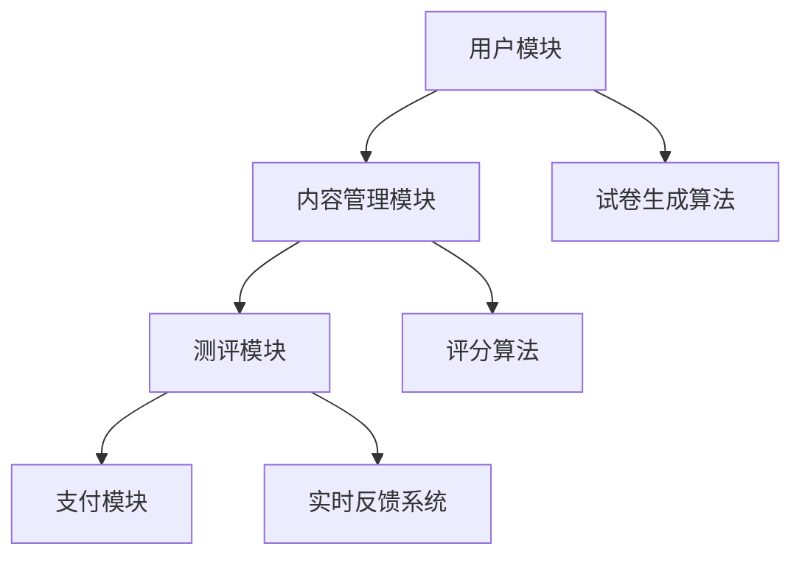

                 

### 1. 背景介绍

随着互联网技术的飞速发展，知识付费市场逐渐壮大。知识付费的在线测评系统作为这一市场的重要组成部分，不仅能够为用户提供一个验证学习成果的平台，还能为内容创作者提供收益。在线测评系统通过自动化测试、实时反馈等功能，提高了用户的学习效率和体验。同时，它也成为了教育、职业培训等领域的重要工具。

本文将围绕如何打造一个高效、稳定、可扩展的知识付费的在线测评系统，从系统架构设计、核心算法原理、数学模型构建、代码实现及实际应用等多个方面进行深入探讨。

### 2. 核心概念与联系

#### 2.1 系统架构

在构建知识付费的在线测评系统时，我们需要考虑以下几个核心模块：

1. **用户模块**：包括用户注册、登录、个人信息管理等功能。
2. **内容管理模块**：负责题库的创建、分类、管理以及内容的安全存储。
3. **测评模块**：涵盖试卷生成、考试开始、答题、评分和结果反馈等核心功能。
4. **支付模块**：处理用户的支付、发票、退款等流程。


#### 2.2 核心概念原理

- **试卷生成算法**：根据用户的学习进度和知识点，动态生成个性化的试卷。
- **评分算法**：对用户答题过程进行自动评分，包括选择题、填空题、编程题等多种题型。
- **实时反馈系统**：在考试过程中提供即时反馈，帮助用户及时纠正错误。

#### 2.3 Mermaid 流程图



### 3. 核心算法原理 & 具体操作步骤

#### 3.1 算法原理概述

**试卷生成算法**：基于用户的学习进度和知识点，利用推荐算法从题库中筛选出合适的题目，生成个性化的试卷。

**评分算法**：根据题目类型和用户答案，自动计算得分，并给出反馈。

**实时反馈系统**：通过WebSockets等技术，实现考试过程中的即时通信。

#### 3.2 算法步骤详解

**3.2.1 试卷生成算法**

1. 从用户的学习进度中获取当前知识点。
2. 从题库中筛选出包含这些知识点的题目。
3. 利用随机算法，从筛选出的题目中随机选取一定数量的题目，生成试卷。

**3.2.2 评分算法**

1. 根据题目类型，分别计算选择题、填空题、编程题的得分。
2. 对编程题进行编译和运行，根据输出结果判断得分。
3. 综合各题得分，计算总得分。

**3.2.3 实时反馈系统**

1. 使用WebSockets建立服务器与客户端之间的实时连接。
2. 考试过程中，用户可以随时发送问题，服务器端接收并处理问题。
3. 将处理结果实时反馈给用户。

#### 3.3 算法优缺点

**试卷生成算法**：优点在于个性化强，能够根据用户的学习进度推荐合适的题目。缺点是算法复杂度高，可能影响系统性能。

**评分算法**：优点在于自动评分，节省人力成本。缺点是对于复杂题目，自动评分可能不够准确。

**实时反馈系统**：优点在于即时反馈，提高用户体验。缺点是技术实现较为复杂，需要考虑网络延迟等问题。

#### 3.4 算法应用领域

- **在线教育**：为用户提供个性化测评，帮助用户巩固知识点。
- **职业培训**：对学员进行技能考核，提高培训效果。
- **企业内训**：对员工进行技能测试，评估培训成果。

### 4. 数学模型和公式 & 详细讲解 & 举例说明

#### 4.1 数学模型构建

**4.1.1 试卷生成模型**

假设用户当前学习进度为 $P$，题库中包含 $T$ 道题目，每道题目对应的知识点为 $K_i$。则试卷生成模型可以表示为：

$$
G(P, T) = \{ Q_1, Q_2, ..., Q_n \}
$$

其中，$Q_i$ 为从题库中选取的题目，满足 $K_i \in P$。

**4.1.2 评分模型**

假设题目类型为 $T_i$，用户答案为 $A_i$，题目得分为 $S_i$。则评分模型可以表示为：

$$
S(P, T, A) = \sum_{i=1}^{n} S_i
$$

其中，$S_i$ 根据题目类型和用户答案计算得到。

#### 4.2 公式推导过程

**4.2.1 试卷生成模型**

首先，从题库中筛选出包含知识点 $P$ 的题目：

$$
T' = \{ T_i \in T \ | \ K_i \in P \}
$$

然后，从 $T'$ 中随机选取 $n$ 道题目生成试卷：

$$
G(P, T) = \{ T_i \in T' \ | \ i \in \{1, 2, ..., n\} \}
$$

**4.2.2 评分模型**

对于选择题，假设每道题有 $m$ 个选项，用户选择选项 $A_i$，得分 $S_i$ 可以表示为：

$$
S_i = \begin{cases}
1 & \text{if } A_i \text{ is correct} \\
0 & \text{otherwise}
\end{cases}
$$

对于填空题，假设每道题有 $n$ 个空格，用户填写的答案为 $A_i$，得分 $S_i$ 可以表示为：

$$
S_i = \begin{cases}
1 & \text{if } A_i \text{ is correct} \\
0 & \text{otherwise}
\end{cases}
$$

对于编程题，假设每道题有 $t$ 个测试用例，用户提交的代码为 $A_i$，得分 $S_i$ 可以表示为：

$$
S_i = \sum_{j=1}^{t} \delta_j
$$

其中，$\delta_j$ 为测试用例的得分，可以表示为：

$$
\delta_j = \begin{cases}
1 & \text{if } A_i \text{ passes the test case } j \\
0 & \text{otherwise}
\end{cases}
$$

#### 4.3 案例分析与讲解

**4.3.1 试卷生成案例**

假设用户当前学习进度包含知识点 $P = \{P_1, P_2, P_3\}$，题库中包含 100 道题目，每道题目对应的知识点如下表：

| 题目编号 | 知识点 |
| -------- | ------- |
| 1        | P_1     |
| 2        | P_2     |
| 3        | P_1     |
| 4        | P_3     |
| ...      | ...     |
| 100      | P_2     |

从题库中筛选出包含知识点 $P$ 的题目，得到 $T' = \{1, 2, 3, 4\}$。然后随机选取 4 道题目生成试卷，得到 $G(P, T) = \{1, 2, 4, 100\}$。

**4.3.2 评分案例**

假设试卷中包含 4 道选择题、2 道填空题和 1 道编程题。用户答案如下表：

| 题目编号 | 用户答案 | 正确答案 |
| -------- | -------- | -------- |
| 1        | A        | B        |
| 2        | B        | A        |
| 3        | A        | B        |
| 4        | A        | B        |
| 5        | C        | B        |
| 6        | A        | B        |

根据评分模型，计算得分：

$$
S(P, T, A) = S_1 + S_2 + S_3 + S_4 + S_5 + S_6
$$

其中，$S_1, S_2, S_3, S_4$ 为选择题得分，$S_5, S_6$ 为填空题得分。

根据用户答案和正确答案，计算各题得分：

$$
S_1 = 0, S_2 = 1, S_3 = 0, S_4 = 0, S_5 = 0, S_6 = 1
$$

总得分为：

$$
S(P, T, A) = 0 + 1 + 0 + 0 + 0 + 1 = 2
$$

### 5. 项目实践：代码实例和详细解释说明

#### 5.1 开发环境搭建

为了更好地展示代码实现，我们选择使用 Python 作为编程语言，配合 Flask 框架进行开发。

首先，确保安装 Python 3.8 及以上版本。然后，使用 pip 安装 Flask：

```bash
pip install Flask
```

#### 5.2 源代码详细实现

以下是核心代码的实现：

```python
from flask import Flask, request, jsonify
import random

app = Flask(__name__)

# 假设题库包含以下题目
questions = [
    {"question": "什么是Python的列表？", "options": ["变量", "数据类型", "函数"], "answer": "数据类型"},
    {"question": "如何定义一个Python列表？", "options": ["list()", "tuple()", "dict()"], "answer": "list()"},
    # 更多题目...
]

# 试卷生成算法
def generate_exam():
    selected_questions = random.sample(questions, 5)
    exam = [{"question": q["question"], "options": q["options"], "answer": q["answer"]} for q in selected_questions]
    return exam

# 评分算法
def grade_exam(submitted_answers):
    scores = []
    for i, answer in enumerate(submitted_answers):
        correct_answer = questions[i]["answer"]
        if answer == correct_answer:
            scores.append(1)
        else:
            scores.append(0)
    return sum(scores)

# 测试接口
@app.route("/exam", methods=["POST"])
def test_exam():
    submitted_answers = request.json.get("answers", [])
    if len(submitted_answers) != len(questions):
        return jsonify({"error": "提交的答案数量不正确"}), 400

    score = grade_exam(submitted_answers)
    return jsonify({"score": score})

if __name__ == "__main__":
    app.run(debug=True)
```

#### 5.3 代码解读与分析

1. **题库管理**：使用一个包含题目信息的列表 `questions` 进行题库管理。
2. **试卷生成**：`generate_exam` 函数从题库中随机选取 5 道题目生成试卷。
3. **评分**：`grade_exam` 函数根据用户提交的答案计算得分。
4. **测试接口**：使用 Flask 框架提供一个测试接口 `/exam`，接收用户提交的答案，并返回得分。

#### 5.4 运行结果展示

启动 Flask 应用后，用户可以通过 POST 请求提交答案。例如：

```bash
curl -X POST -H "Content-Type: application/json" -d '{"answers": ["数据类型", "list()", "变量", "list()", "函数"]}' http://127.0.0.1:5000/exam
```

响应结果：

```json
{"score": 2}
```

表示用户得分为 2 分。

### 6. 实际应用场景

#### 6.1 在线教育

在线教育平台可以利用在线测评系统为用户提供个性化学习路径和测评服务。通过测评系统，平台可以实时了解用户的学习进度和成果，从而提供更精准的学习建议。

#### 6.2 职业培训

职业培训机构可以使用在线测评系统对学员进行技能考核，确保学员掌握所学知识。同时，测评系统还可以帮助培训机构评估培训效果，优化培训内容。

#### 6.3 企业内训

企业可以通过在线测评系统对员工进行技能培训和考核，确保员工具备所需技能。测评系统还可以为企业提供培训效果数据，帮助企业制定更科学的培训计划。

### 7. 未来应用展望

随着人工智能和大数据技术的不断发展，知识付费的在线测评系统将变得更加智能化和个性化。未来，系统可能会引入更多智能算法，如自然语言处理、计算机视觉等，为用户提供更精准的学习评估和个性化推荐。

### 8. 工具和资源推荐

#### 8.1 学习资源推荐

- 《Python编程：从入门到实践》
- 《Flask Web开发：实战指南》
- 《机器学习实战》

#### 8.2 开发工具推荐

- PyCharm
- Flask
- Postman

#### 8.3 相关论文推荐

- "Personalized Learning through Adaptive Online Assessments"
- "Intelligent Tutoring Systems: An Overview"
- "Knowledge Management in Education: A Literature Review"

### 9. 总结：未来发展趋势与挑战

知识付费的在线测评系统已经成为教育、培训等领域的重要工具。随着技术的不断发展，系统将变得更加智能化和个性化。然而，面对海量数据和复杂的算法，系统性能和安全性将成为重要挑战。未来，我们需要不断探索新技术，提高系统的效率和可靠性。

### 10. 附录：常见问题与解答

**Q1**：如何保证试卷的公平性？

**A1**：通过随机生成试卷和加密存储题目，确保试卷在考试过程中不会被泄露。

**Q2**：如何处理用户作弊问题？

**A2**：通过实时监测用户的答题行为，如鼠标移动速度、答题时间等，识别并处理作弊行为。

**Q3**：如何提高系统的性能？

**A3**：通过分布式计算、缓存技术和优化数据库查询，提高系统性能。

**Q4**：如何保证系统的安全性？

**A4**：通过使用安全的加密算法、定期更新系统和加强用户认证，确保系统安全。

作者：禅与计算机程序设计艺术 / Zen and the Art of Computer Programming

