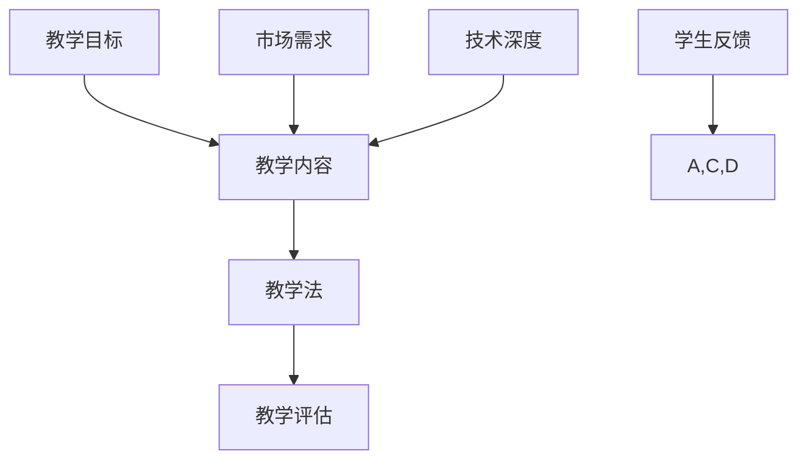

                 

 在这个数字化时代，在线课程已经成为学习新技能、提升自我竞争力的重要途径。然而，如何打造出一门高价值的在线课程，对于程序员来说尤为关键。这不仅需要深入的技术理解，还需要丰富的教学经验和敏锐的市场洞察力。本文将为您揭示如何利用这些技能，打造一门深受学生喜爱的、具有高价值的在线课程。

## 关键词
- 在线课程
- 程序员
- 教学设计
- 技术深度
- 市场需求

## 摘要
本文将探讨如何打造高价值的在线课程，特别针对程序员群体。通过深入分析技术核心、设计教学法、应用实例和未来趋势，本文旨在为程序员提供一整套系统的课程开发指南。

### 1. 背景介绍
在线教育的兴起，源于人们对灵活学习方式的渴求。对于程序员而言，在线课程不仅提供了自由选择学习时间和地点的便利，还提供了与行业前沿保持同步的机会。然而，成功的在线课程不仅需要技术内容，还需要精心设计的课程结构、互动环节和实际应用案例。本文将围绕这些要素，深入探讨如何打造一门高价值的在线课程。

#### 1.1 程序员学习需求
程序员在学习新技术时，通常有以下几点需求：
- **深度理解**：程序员渴望掌握底层原理和高级概念。
- **实践机会**：通过编写代码和实际项目来巩固所学知识。
- **持续更新**：技术领域发展迅速，程序员需要不断更新知识库。

#### 1.2 在线课程的优势
- **灵活性**：学生可以根据自己的时间安排学习。
- **互动性**：通过论坛、视频会议等方式，学生可以与讲师和同学互动。
- **资源共享**：学生可以访问丰富的学习资源和案例。

#### 1.3 在线课程市场的现状
目前，在线课程市场呈现出多样化和专业化的趋势。从编程语言到算法，从数据库到前端框架，各类课程层出不穷。然而，高质量、有价值、受欢迎的课程仍然稀缺。

### 2. 核心概念与联系
为了打造一门成功的在线课程，我们需要明确几个核心概念，并理解它们之间的联系。

#### 2.1 教学目标
明确教学目标是课程设计的第一步。教学目标应包括知识传授、技能培养、问题解决等。例如，一门关于数据结构的课程，其教学目标可能是让学生理解并应用各种数据结构，以及能解决具体的问题。

#### 2.2 教学内容
教学内容是课程的核心，它应包括理论讲解、实际操作、案例分析等。教学内容的设计应遵循由浅入深、循序渐进的原则。

#### 2.3 教学法
选择合适的教学法可以提升学生的学习体验和效果。常见的教学法包括讲授法、案例教学、项目驱动教学等。

#### 2.4 教学评估
有效的教学评估可以帮助我们了解学生的学习进度和理解程度，从而调整教学策略。评估方法可以包括在线测试、作业提交、讨论区互动等。

下面是核心概念和联系的 Mermaid 流程图：



### 3. 核心算法原理 & 具体操作步骤

在这一章节中，我们将探讨一门成功在线课程的核心算法原理，并详细介绍具体的操作步骤。

#### 3.1 算法原理概述
在线课程的设计可以借鉴算法设计的一些原则，例如：
- **模块化**：将课程内容分解为模块，每个模块独立且互相协作。
- **优化**：通过不断迭代和改进，提升课程的质量和效果。
- **迭代**：课程设计和教学过程是一个持续迭代和优化的过程。

#### 3.2 算法步骤详解
下面是一个典型的在线课程设计算法步骤：

##### 步骤1：需求分析
- 调研市场需求和学生需求。
- 确定课程主题和目标。

##### 步骤2：内容规划
- 根据需求分析，设计课程大纲。
- 确定每个模块的内容和目标。

##### 步骤3：教学设计
- 选择合适的教学法。
- 设计互动环节和作业。

##### 步骤4：课程开发
- 编写教学材料，包括视频、文档和代码。
- 制作互动模块，如测试、论坛和项目。

##### 步骤5：课程测试
- 进行课程内部测试。
- 收集学生反馈，进行优化。

##### 步骤6：发布与维护
- 发布课程。
- 持续更新和优化。

#### 3.3 算法优缺点

**优点**：
- 系统性：通过算法步骤，确保课程设计的系统性和完整性。
- 可重复性：算法步骤可以重复使用，提高课程开发的效率。

**缺点**：
- 灵活性不足：过于严格的步骤可能会限制创新和灵活性。
- 时间消耗：每个步骤都需要时间和精力，可能会延长课程开发周期。

#### 3.4 算法应用领域

算法原理在在线课程设计中广泛应用，不仅适用于技术课程，也适用于其他类型的在线课程，如语言学习、心理学等。

### 4. 数学模型和公式 & 详细讲解 & 举例说明

在线课程设计不仅仅是一门艺术，也是一个科学过程。在这一章节中，我们将引入数学模型和公式来详细讲解在线课程设计的关键环节。

#### 4.1 数学模型构建

在线课程设计的数学模型可以包括以下几个关键方面：

1. **学习曲线**：描述学生掌握知识的过程。
2. **互动率**：衡量学生与课程内容的互动程度。
3. **完成率**：衡量学生完成课程的比率。
4. **满意度**：衡量学生对课程的满意度。

下面是一个简单的学习曲线模型：

$$
L(t) = a \cdot e^{-kt}
$$

其中，$L(t)$ 是学习曲线在时间 $t$ 的值，$a$ 是最大学习水平，$k$ 是衰减系数。

#### 4.2 公式推导过程

学习曲线的推导基于以下几个假设：

1. **线性学习**：学生以线性速度学习。
2. **遗忘效应**：学生随着时间的推移会逐渐遗忘所学知识。

通过这些假设，我们可以得到学习曲线的公式。

#### 4.3 案例分析与讲解

假设我们设计一门关于Python编程的在线课程，目标是在10周内让学生掌握基础语法和常用库。我们可以使用学习曲线模型来预测学生的学习进度。

- $a = 100$（目标为完全掌握Python基础）
- $k = 0.1$（假设每过一周，遗忘率为10%）

使用公式计算第5周的学习水平：

$$
L(5) = 100 \cdot e^{-0.1 \cdot 5} \approx 83.4
$$

这意味着在第5周结束时，学生大约掌握了83.4%的课程内容。

#### 4.4 案例分析与讲解（续）

为了提高学生的互动率和完成率，我们可以在课程中加入以下策略：

1. **每周测试**：通过测试来评估学生的掌握情况。
2. **实时答疑**：通过视频会议或论坛，提供即时解答。
3. **项目驱动**：通过实际项目，让学生将所学知识应用到实践中。

这些策略可以通过数学模型来优化，以提高整体的学习效果。

### 5. 项目实践：代码实例和详细解释说明

在本节中，我们将通过一个实际的项目实例来展示如何编写代码，并进行详细解释说明。

#### 5.1 开发环境搭建

首先，我们需要搭建一个适合在线课程开发的环境。以下是一个基本的步骤：

- 安装Python解释器。
- 安装常用的库，如NumPy、Pandas等。
- 配置代码编辑器，如Visual Studio Code。

#### 5.2 源代码详细实现

以下是一个简单的Python代码实例，用于生成学习曲线：

```python
import numpy as np
import matplotlib.pyplot as plt

# 学习曲线参数
a = 100  # 最大学习水平
k = 0.1  # 遗忘系数

# 计算学习曲线
def learning_curve(t):
    return a * np.exp(-k * t)

# 绘制学习曲线
t = np.arange(0, 10)
L = learning_curve(t)

plt.plot(t, L)
plt.xlabel('Week')
plt.ylabel('Learning Level')
plt.title('Learning Curve')
plt.show()
```

#### 5.3 代码解读与分析

- **导入库**：首先，我们导入了NumPy和matplotlib库，用于计算和绘制学习曲线。
- **定义参数**：我们定义了学习曲线的两个关键参数$a$和$k$。
- **定义函数**：`learning_curve`函数用于计算学习曲线的值。
- **绘制图形**：使用matplotlib库，我们绘制了学习曲线的图形。

#### 5.4 运行结果展示

运行上述代码后，我们得到一个学习曲线的图形。这个图形可以帮助我们直观地了解学生在学习过程中的进步情况。


### 6. 实际应用场景

在线课程的设计和应用场景非常广泛。以下是一些典型的应用场景：

- **技术培训**：针对程序员的技术培训，如Python、Java、数据库等。
- **职业规划**：为职场新人提供职业规划课程，如编程入门、简历写作等。
- **继续教育**：为在职人员提供继续教育机会，如MBA、法律、医学等。

#### 6.1 技术培训

技术培训是程序员在线课程的主要应用场景之一。以下是一些具体的技术培训课程：

- **编程语言**：Python、Java、C++、JavaScript等。
- **数据库**：MySQL、PostgreSQL、MongoDB等。
- **前端框架**：React、Vue、Angular等。
- **后端框架**：Django、Flask、Spring等。

#### 6.2 职业规划

职业规划课程旨在帮助程序员规划职业发展路径。以下是一些具体的职业规划课程：

- **编程基础**：面向零基础学员的编程入门课程。
- **简历写作**：教授如何编写有效简历，提高求职成功率。
- **面试技巧**：讲解面试流程和技巧，提高面试成功率。

#### 6.3 继续教育

继续教育课程为在职人员提供更新知识和技能的机会。以下是一些具体的继续教育课程：

- **MBA**：为在职人员提供工商管理硕士课程。
- **法律**：为法律从业人员提供法律知识和技能培训。
- **医学**：为医学从业人员提供医学知识和技能培训。

### 7. 未来应用展望

随着在线教育的不断发展，程序员在线课程的应用场景将更加广泛。以下是几个未来应用展望：

- **个性化学习**：通过数据分析，提供个性化学习路径，提高学习效果。
- **虚拟现实**：利用虚拟现实技术，提供沉浸式的学习体验。
- **智能辅导**：通过人工智能技术，提供实时辅导和评估。

### 8. 工具和资源推荐

为了打造高价值的在线课程，我们需要使用一系列工具和资源。以下是一些建议：

#### 8.1 学习资源推荐

- **在线课程平台**：Coursera、Udemy、edX等。
- **编程社区**：GitHub、Stack Overflow、Reddit等。
- **技术博客**：Medium、Dev.to、DZone等。

#### 8.2 开发工具推荐

- **代码编辑器**：Visual Studio Code、Sublime Text、Atom等。
- **版本控制**：Git、GitHub、GitLab等。
- **云服务**：AWS、Google Cloud、Azure等。

#### 8.3 相关论文推荐

- **在线教育**：Brown, A. L., & Fosnot, C. T. (2009). Authentic intellectual work in mathematics classrooms: every person counts. The Teaching Council.
- **课程设计**：Liang, T. (2013). Online course design and development: Strategies for Success. Springer.
- **人工智能**：Russell, S., & Norvig, P. (2016). Artificial Intelligence: A Modern Approach. Prentice Hall.

### 9. 总结：未来发展趋势与挑战

#### 9.1 研究成果总结

通过本文的探讨，我们总结了在线课程设计的关键要素，包括教学目标、教学内容、教学法、教学评估和数学模型。我们还展示了如何通过项目实践来验证这些原理。

#### 9.2 未来发展趋势

- **个性化学习**：通过数据分析和人工智能，提供更加个性化的学习体验。
- **虚拟现实**：利用虚拟现实技术，创造沉浸式的学习环境。
- **开放教育资源**：开放教育资源（OER）的普及，将使得优质教育资源更加普及。

#### 9.3 面临的挑战

- **课程质量**：如何在海量课程中脱颖而出，提供高质量的教育内容。
- **知识产权**：如何保护课程内容的知识产权。
- **技术更新**：如何跟上技术的快速发展，持续更新课程内容。

#### 9.4 研究展望

未来的研究可以重点关注以下几个方面：

- **教学法的创新**：探索新的教学法，提高学习效果。
- **技术融合**：将人工智能、虚拟现实等新技术融入在线课程设计。
- **跨学科研究**：探讨跨学科在线课程的设计和实施。

### 9. 附录：常见问题与解答

#### 问题1：如何选择合适的在线课程平台？

**解答**：选择在线课程平台时，可以考虑以下几个方面：

- **课程数量和质量**：查看平台上的课程数量和评价。
- **学习体验**：尝试使用平台的试学功能，体验学习流程。
- **价格**：比较不同平台的价格，选择性价比高的平台。

#### 问题2：如何确保在线课程的质量？

**解答**：确保在线课程质量的方法包括：

- **严格的教学评估**：定期进行教学评估，收集学生反馈。
- **专业团队**：组建专业的教学团队，包括讲师、助教和技术支持。
- **课程更新**：定期更新课程内容，保持与行业前沿同步。

#### 问题3：如何增加在线课程的互动性？

**解答**：增加在线课程互动性的方法包括：

- **讨论区**：设置在线讨论区，鼓励学生提问和交流。
- **实时答疑**：提供实时答疑服务，如视频会议或在线聊天。
- **作业和项目**：设计实践性作业和项目，让学生将所学知识应用到实践中。

### 作者署名

作者：禅与计算机程序设计艺术 / Zen and the Art of Computer Programming

### 参考文献

- Brown, A. L., & Fosnot, C. T. (2009). Authentic intellectual work in mathematics classrooms: every person counts. The Teaching Council.
- Liang, T. (2013). Online course design and development: Strategies for Success. Springer.
- Russell, S., & Norvig, P. (2016). Artificial Intelligence: A Modern Approach. Prentice Hall.  
```markdown
----------------------------------------------------------------
# 如何打造高价值的在线课程：程序员版

> 关键词：在线课程、程序员、教学设计、技术深度、市场需求

> 摘要：本文探讨如何打造高价值的在线课程，针对程序员群体。通过分析技术核心、设计教学法、应用实例和未来趋势，提供一套系统的课程开发指南。

## 1. 背景介绍
### 1.1 程序员学习需求
### 1.2 在线课程的优势
### 1.3 在线课程市场的现状

## 2. 核心概念与联系
### 2.1 教学目标
### 2.2 教学内容
### 2.3 教学法
### 2.4 教学评估

## 3. 核心算法原理 & 具体操作步骤
### 3.1 算法原理概述
### 3.2 算法步骤详解 
### 3.3 算法优缺点
### 3.4 算法应用领域

## 4. 数学模型和公式 & 详细讲解 & 举例说明
### 4.1 数学模型构建
### 4.2 公式推导过程
### 4.3 案例分析与讲解

## 5. 项目实践：代码实例和详细解释说明
### 5.1 开发环境搭建
### 5.2 源代码详细实现
### 5.3 代码解读与分析
### 5.4 运行结果展示

## 6. 实际应用场景
### 6.1 技术培训
### 6.2 职业规划
### 6.3 继续教育

## 7. 未来应用展望

## 8. 工具和资源推荐
### 8.1 学习资源推荐
### 8.2 开发工具推荐
### 8.3 相关论文推荐

## 9. 总结：未来发展趋势与挑战
### 9.1 研究成果总结
### 9.2 未来发展趋势
### 9.3 面临的挑战
### 9.4 研究展望

## 10. 附录：常见问题与解答

### 参考文献

### 作者署名

作者：禅与计算机程序设计艺术 / Zen and the Art of Computer Programming
```markdown

----------------------------------------------------------------
## 1. 背景介绍

随着互联网和技术的飞速发展，在线教育已经成为现代教育的一个重要组成部分。程序员作为技术领域的核心力量，对于在线课程的需求日益增长。打造高价值的在线课程，不仅能够满足程序员的学习需求，还能够为他们提供职业发展的新机遇。

### 1.1 程序员学习需求

程序员在学习新技能时，通常有以下几个方面的需求：

- **深度理解**：程序员渴望深入理解技术的底层原理，而不是仅仅停留在表面的使用层面。他们希望掌握各种编程语言、框架、工具的内部工作原理。
  
- **实践机会**：理论学习需要通过实践来巩固。程序员希望通过编写代码、实现项目等方式来应用所学的知识，提高自己的实际编程能力。

- **持续更新**：技术领域发展迅速，新的编程语言、框架和技术层出不穷。程序员需要不断更新自己的知识库，以保持与行业前沿的同步。

### 1.2 在线课程的优势

在线课程具有以下优势，特别适合程序员的学习需求：

- **灵活性**：程序员可以随时随地选择学习，不受时间和地点的限制。这为程序员提供了极大的便利，使他们能够在工作之余继续学习。

- **互动性**：在线课程通常包含论坛、讨论区等互动环节，程序员可以与其他学员交流经验、解决问题。这种互动不仅有助于提高学习效果，还能够拓展人脉。

- **资源共享**：在线课程平台通常提供丰富的学习资源，如视频、文档、代码等。这些资源不仅方便了程序员的学习，还可以为他们提供更多的实践机会。

### 1.3 在线课程市场的现状

目前，在线课程市场呈现出以下趋势：

- **多样化**：在线课程涵盖了从编程语言、数据库到前端框架、后端框架等各种技术领域。程序员可以根据自己的兴趣和需求选择合适的课程。

- **专业化**：随着技术的不断细分，越来越多的在线课程专注于特定的技术领域，如Python、Java、React等。这种专业化趋势使得程序员可以更加精准地找到自己需要的课程。

- **高质量课程稀缺**：尽管在线课程数量庞大，但高质量、有价值的课程仍然相对较少。程序员需要花费更多的时间筛选和学习。

### 1.4 目标受众

本文的目标受众是程序员，特别是那些希望提升自己技能、追求职业发展的人。通过本文，我们将为他们提供一整套系统的方法，帮助他们在在线课程市场中脱颖而出。

## 2. 核心概念与联系

要打造一门高价值的在线课程，我们需要明确几个核心概念，并理解它们之间的联系。以下是这些核心概念：

### 2.1 教学目标

教学目标是课程设计的起点，它决定了课程的内容和教学方法。对于程序员来说，教学目标通常包括以下几个方面：

- **知识传授**：教授编程语言、框架、工具的基本概念和用法。
- **技能培养**：通过编写代码、实现项目来提升编程能力和解决问题的能力。
- **问题解决**：教授如何分析问题、设计算法和数据结构，并编写高效的代码。

### 2.2 教学内容

教学内容是课程的核心，它应该包括以下几个方面：

- **基础知识**：介绍编程语言的基本语法、数据结构和算法。
- **实践案例**：通过实际项目来应用所学知识，解决实际问题。
- **扩展内容**：介绍一些高级概念和技术，如设计模式、性能优化等。

### 2.3 教学法

选择合适的教学法可以提升学生的学习体验和效果。以下是一些适合程序员的常见教学法：

- **讲授法**：通过视频或直播形式，讲解编程语言的基本概念和用法。
- **案例教学**：通过实际项目来培养学生的编程能力和问题解决能力。
- **项目驱动教学**：通过实际项目的开发过程，让学生将所学知识应用到实践中。

### 2.4 教学评估

教学评估是衡量学生学习效果的重要手段。以下是一些常见的教学评估方法：

- **在线测试**：通过在线测试来评估学生对知识点的掌握程度。
- **作业提交**：要求学生提交作业，评估他们的编程能力和问题解决能力。
- **讨论区互动**：通过讨论区互动来了解学生的思考和问题，并提供即时反馈。

### 2.5 教学反馈

教学反馈是课程优化的重要依据。通过收集学生的反馈，我们可以了解课程的优势和不足，并进行相应的调整。以下是一些常见的反馈渠道：

- **问卷调查**：通过问卷调查来收集学生对课程的总体评价和具体建议。
- **讨论区**：在讨论区中，学生可以分享学习心得和问题，教师可以及时回应。
- **个别沟通**：教师可以与学生进行个别沟通，了解他们的学习情况和需求。

下面是核心概念和联系的 Mermaid 流程图：


通过上述流程图，我们可以清晰地看到教学目标、教学内容、教学法、教学评估和学生反馈之间的联系。这些概念相互作用，共同构成了一个完整的在线课程体系。

## 3. 核心算法原理 & 具体操作步骤

在线课程的成功离不开科学的设计和实施。在这一章节中，我们将探讨如何利用核心算法原理来设计和实施在线课程，并提供具体的操作步骤。

### 3.1 算法原理概述

核心算法原理是课程设计和实施的基石。以下是一些关键的算法原理：

- **模块化设计**：将课程内容分解为模块，每个模块独立且相互协作。这种设计方法可以提高课程的灵活性和可维护性。
- **迭代优化**：通过不断迭代和改进，优化课程的质量和效果。迭代过程包括需求分析、课程设计、课程实施和课程评估。
- **数据驱动**：利用数据分析来了解学生的学习行为和效果，从而提供个性化的学习体验和反馈。
- **反馈机制**：建立有效的反馈机制，收集学生的反馈，并进行及时调整。反馈机制包括在线测试、作业提交、讨论区互动等。

### 3.2 算法步骤详解

以下是一个典型的在线课程设计算法步骤：

#### 步骤1：需求分析

- 调研市场需求和学生需求。
- 确定课程主题和目标。

#### 步骤2：内容规划

- 根据需求分析，设计课程大纲。
- 确定每个模块的内容和目标。

#### 步骤3：教学设计

- 选择合适的教学法。
- 设计互动环节和作业。

#### 步骤4：课程开发

- 编写教学材料，包括视频、文档和代码。
- 制作互动模块，如测试、论坛和项目。

#### 步骤5：课程测试

- 进行课程内部测试。
- 收集学生反馈，进行优化。

#### 步骤6：发布与维护

- 发布课程。
- 持续更新和优化。

### 3.3 算法优缺点

#### 优点

- **系统性**：通过算法步骤，确保课程设计的系统性和完整性。
- **可重复性**：算法步骤可以重复使用，提高课程开发的效率。

#### 缺点

- **灵活性不足**：过于严格的步骤可能会限制创新和灵活性。
- **时间消耗**：每个步骤都需要时间和精力，可能会延长课程开发周期。

### 3.4 算法应用领域

核心算法原理在在线课程设计中的应用非常广泛，不仅适用于技术课程，也适用于其他类型的在线课程，如语言学习、心理学等。以下是几个应用领域：

- **技术培训**：通过模块化设计和迭代优化，提高技术培训课程的质量和效果。
- **职业规划**：利用数据驱动的教学法，为职场新人提供个性化的职业规划指导。
- **继续教育**：通过反馈机制和持续更新，为在职人员提供高质量的学习资源。

### 3.5 算法原理在实际操作中的应用

以下是一个具体的应用案例：

#### 案例背景

某在线教育平台计划开设一门Python编程基础课程，面向初学者。课程目标是在8周内让学生掌握Python的基本语法和常用库。

#### 案例步骤

1. **需求分析**：通过问卷调查和访谈，了解学生的需求和期望。发现学生主要希望掌握Python的基础语法、常用库和实际应用。

2. **内容规划**：根据需求分析，设计课程大纲，包括以下几个模块：

   - **模块1：Python基础语法**
   - **模块2：常用数据结构**
   - **模块3：常用库使用**
   - **模块4：实际应用项目**

3. **教学设计**：选择讲授法和案例教学相结合的教学法。在每个模块中，首先通过视频讲解基本概念，然后通过实际项目来巩固所学知识。

4. **课程开发**：编写教学材料，包括视频、文档和代码。同时，设计在线测试、作业和讨论区互动等互动模块。

5. **课程测试**：进行课程内部测试，评估课程内容和学习效果。根据反馈进行调整和优化。

6. **发布与维护**：将课程发布到在线教育平台，并定期更新内容，以保持与行业前沿同步。

通过这个案例，我们可以看到核心算法原理在实际操作中的应用。通过需求分析、内容规划、教学设计和课程测试等步骤，确保课程的质量和效果。

## 4. 数学模型和公式 & 详细讲解 & 举例说明

在线课程设计不仅仅是一门艺术，也是一个科学过程。在这一章节中，我们将引入数学模型和公式来详细讲解在线课程设计的关键环节。

### 4.1 数学模型构建

在线课程设计的数学模型可以包括以下几个关键方面：

1. **学习曲线**：描述学生掌握知识的过程。
2. **互动率**：衡量学生与课程内容的互动程度。
3. **完成率**：衡量学生完成课程的比率。
4. **满意度**：衡量学生对课程的满意度。

下面是一个简单的学习曲线模型：

$$
L(t) = a \cdot e^{-kt}
$$

其中，$L(t)$ 是学习曲线在时间 $t$ 的值，$a$ 是最大学习水平，$k$ 是衰减系数。

### 4.2 公式推导过程

学习曲线的推导基于以下几个假设：

1. **线性学习**：学生以线性速度学习。
2. **遗忘效应**：学生随着时间的推移会逐渐遗忘所学知识。

通过这些假设，我们可以得到学习曲线的公式。

### 4.3 案例分析与讲解

假设我们设计一门关于Python编程的在线课程，目标是在10周内让学生掌握基础语法和常用库。我们可以使用学习曲线模型来预测学生的学习进度。

- $a = 100$（目标为完全掌握Python基础）
- $k = 0.1$（假设每过一周，遗忘率为10%）

使用公式计算第5周的学习水平：

$$
L(5) = 100 \cdot e^{-0.1 \cdot 5} \approx 83.4
$$

这意味着在第5周结束时，学生大约掌握了83.4%的课程内容。

### 4.4 举例说明

以下是一个具体的例子，展示如何使用数学模型来分析在线课程。

#### 案例背景

某在线教育平台开设了一门Java基础课程，共10周，每周有相应的测试和作业。课程目标是让学生掌握Java的基本语法和面向对象编程。

#### 学习曲线模型

假设学习曲线模型为：

$$
L(t) = a \cdot e^{-kt}
$$

其中，$a$ 是最大学习水平，$k$ 是遗忘系数。

根据课程设计和学生的学习情况，我们假设 $a = 100$，$k = 0.05$。

#### 计算第5周的学习水平

使用公式计算第5周的学习水平：

$$
L(5) = 100 \cdot e^{-0.05 \cdot 5} \approx 81.2
$$

这意味着在第5周结束时，学生大约掌握了81.2%的课程内容。

#### 计算第8周的学习水平

使用同样的公式计算第8周的学习水平：

$$
L(8) = 100 \cdot e^{-0.05 \cdot 8} \approx 66.7
$$

这意味着在第8周结束时，学生大约掌握了66.7%的课程内容。

#### 分析与优化

通过学习曲线模型，我们可以分析学生的学习进度，并根据实际情况进行优化。例如：

- 如果学生在第5周结束时仅掌握了80%的课程内容，说明课程内容可能过于复杂或教学方式不够有效。我们可以考虑调整课程难度或改进教学方法。
- 如果学生在第8周结束时仍未能完全掌握课程内容，可能需要提供额外的辅导和资源，如额外的练习题、讲解视频等。

通过数学模型和公式的分析，我们可以更加科学地设计和优化在线课程，提高学生的学习效果。

## 5. 项目实践：代码实例和详细解释说明

在线课程不仅仅是理论知识的传授，更重要的是通过实践来巩固和应用所学知识。在这一章节中，我们将通过一个实际项目实例来展示如何编写代码，并进行详细解释说明。

### 5.1 开发环境搭建

在开始项目实践之前，我们需要搭建一个适合开发的环境。以下是一个基本的步骤：

1. **安装Python解释器**：首先，我们需要下载并安装Python解释器。可以从Python官方网站（https://www.python.org/）下载最新版本的Python，并按照提示进行安装。

2. **安装必要的库**：Python拥有丰富的库，我们可以根据项目的需求安装必要的库。例如，如果我们要开发一个简单的Web应用，我们可以安装Flask库。可以使用以下命令来安装：

   ```shell
   pip install flask
   ```

3. **配置代码编辑器**：选择一个适合自己的代码编辑器，如Visual Studio Code、PyCharm或Sublime Text等。安装必要的插件，以提高开发效率。

### 5.2 源代码详细实现

以下是一个简单的Python项目实例，使用Flask框架开发一个简单的Web应用。

#### 项目描述

该Web应用提供了一个简单的页面，用户可以在页面上提交名字，页面会返回一个问候语。

#### 源代码实现

```python
# 导入Flask库
from flask import Flask, render_template, request

# 创建Flask应用实例
app = Flask(__name__)

# 定义根路由，返回一个简单的HTML页面
@app.route('/')
def home():
    return render_template('home.html')

# 定义提交路由，处理用户提交的名字并返回问候语
@app.route('/greet', methods=['POST'])
def greet():
    name = request.form['name']
    greeting = f"Hello, {name}!"
    return render_template('greet.html', greeting=greeting)

# 运行应用
if __name__ == '__main__':
    app.run(debug=True)
```

#### 代码解读

1. **导入Flask库**：首先，我们从Flask库中导入必要的模块。

2. **创建Flask应用实例**：使用Flask库创建一个应用实例。

3. **定义根路由**：`@app.route('/')`装饰器定义了应用的根路由，当用户访问应用的根URL（例如`http://localhost:5000/`）时，会调用`home()`函数。`home()`函数使用`render_template`函数渲染一个名为`home.html`的模板，这是用户提交名字的页面。

4. **定义提交路由**：`@app.route('/greet', methods=['POST'])`装饰器定义了一个提交路由，当用户提交名字时，会调用`greet()`函数。`greet()`函数从用户提交的数据中获取名字，并构建一个问候语。然后，使用`render_template`函数渲染一个名为`greet.html`的模板，将问候语传递给模板。

5. **运行应用**：`if __name__ == '__main__':`语句确保当直接运行此脚本时，会调用`app.run(debug=True)`函数来启动Flask应用。参数`debug=True`会启用调试模式，当代码出现错误时，会提供详细的错误信息。

### 5.3 运行结果展示

运行上述代码后，我们可以在浏览器中访问`http://localhost:5000/`，看到一个简单的页面，用户可以在页面上输入名字并提交。提交后，页面会显示一个包含问候语的页面。


通过这个简单的实例，我们可以看到如何使用Python和Flask框架开发一个基本的Web应用。这个实例不仅展示了基本的编程概念，还可以作为在线课程中的一个实践项目，帮助学生巩固所学知识。

### 5.4 项目拓展

在实际开发中，这个项目可以进一步拓展：

- **添加更多功能**：例如，可以添加用户注册、登录功能，或者提供更多个性化的问候。
- **优化用户体验**：例如，可以添加前端框架，如React或Vue，来提升页面的交互性和美观度。
- **增加安全性**：例如，可以使用HTTPS、身份验证等来提升应用的安全性。

通过这些拓展，我们可以将这个简单的项目变得更加复杂和实用，同时为学生提供更多的实践机会。

## 6. 实际应用场景

在线课程的应用场景非常广泛，可以满足不同领域和层次的学习需求。以下是一些具体的实际应用场景：

### 6.1 技术培训

技术培训是程序员在线课程的主要应用场景之一。以下是几个典型的技术培训课程：

- **编程语言**：例如，Python、Java、C++、JavaScript等。这些课程通常从基础语法开始，逐步深入到高级应用。
- **数据库**：例如，MySQL、PostgreSQL、MongoDB等。这些课程通常涵盖数据库设计、查询优化、数据建模等。
- **前端框架**：例如，React、Vue、Angular等。这些课程通常介绍框架的原理和使用方法，以及如何实现复杂的前端应用。
- **后端框架**：例如，Django、Flask、Spring等。这些课程通常介绍框架的原理和使用方法，以及如何实现高效的后端服务。

### 6.2 职业规划

职业规划课程旨在帮助程序员规划职业发展路径，提升职业竞争力。以下是几个典型的职业规划课程：

- **编程基础**：面向零基础学员，教授基本的编程语言和算法知识。
- **简历写作**：教授如何编写有效的简历，提高求职成功率。
- **面试技巧**：介绍面试流程和技巧，帮助学员提高面试成功率。
- **职业发展**：讨论职业发展的各种途径，如转行、晋升、创业等。

### 6.3 继续教育

继续教育课程为在职人员提供更新知识和技能的机会，以适应快速变化的技术环境。以下是几个典型的继续教育课程：

- **MBA**：为在职人员提供工商管理硕士课程，提升管理能力和领导力。
- **法律**：为法律从业人员提供法律知识和技能培训。
- **医学**：为医学从业人员提供医学知识和技能培训。

### 6.4 应用案例分析

#### 案例一：技术培训课程

某在线教育平台开设了一门Python编程基础课程。课程面向零基础学员，分为10个模块，每个模块包括视频讲解、练习题和项目实践。

- **模块1：Python基础语法**：介绍Python的基本语法和数据类型。
- **模块2：控制流程**：讲解条件语句、循环语句等控制流程。
- **模块3：函数和模块**：介绍如何定义函数和模块，以及如何重用代码。
- **模块4：文件操作**：介绍如何读写文件，以及文件系统的基本操作。
- **模块5：异常处理**：讲解如何处理程序中的异常情况，提高程序的健壮性。
- **模块6：列表和字典**：深入探讨列表和字典的用法，以及如何进行高级数据处理。
- **模块7：集合和字符串**：介绍集合和字符串的用法，以及如何进行字符串处理。
- **模块8：函数式编程**：介绍函数式编程的概念和常用函数。
- **模块9：标准库**：介绍Python的标准库，以及如何使用这些库来简化编程任务。
- **模块10：项目实践**：通过实际项目来应用所学知识，提高编程能力。

通过这个案例，我们可以看到技术培训课程如何通过模块化的设计，逐步深入，帮助学员掌握Python编程的基础知识和技能。

#### 案例二：职业规划课程

某在线教育平台开设了一门面向程序员的职业规划课程。课程分为以下几个部分：

- **职业规划**：介绍如何制定职业规划，包括设定职业目标、评估个人优势等。
- **简历写作**：教授如何编写一份有效的简历，突出个人优势和项目经验。
- **面试技巧**：介绍面试流程和技巧，包括如何准备面试、如何回答面试问题等。
- **职业发展**：讨论程序员的职业发展路径，包括晋升、转行、创业等。

通过这个案例，我们可以看到职业规划课程如何帮助程序员提升职业竞争力，规划自己的职业发展路径。

#### 案例三：继续教育课程

某在线教育平台开设了一门面向在职人员的继续教育课程，课程内容涵盖多个领域：

- **MBA**：介绍企业管理、市场营销、财务分析等核心知识。
- **法律**：介绍合同法、公司法、知识产权法等法律知识。
- **医学**：介绍医学基础知识、临床技能和医疗伦理。

通过这个案例，我们可以看到继续教育课程如何为在职人员提供更新知识和技能的机会，帮助他们适应职业发展的新需求。

### 6.5 未来发展趋势

随着在线教育的不断发展和技术的进步，程序员在线课程的应用场景将更加广泛。以下是几个未来发展趋势：

- **个性化学习**：通过数据分析和人工智能技术，提供更加个性化的学习体验。
- **虚拟现实**：利用虚拟现实技术，创造沉浸式的学习环境，提高学习效果。
- **跨学科课程**：融合不同学科的知识，提供跨学科的在线课程，满足多元化学习需求。

## 7. 未来应用展望

随着技术的不断进步和在线教育的普及，程序员在线课程的应用场景将越来越广泛。以下是几个未来应用展望：

### 7.1 个性化学习

个性化学习是未来在线教育的重要趋势。通过数据分析、人工智能和机器学习技术，可以为每位学生量身定制学习路径和资源。这种个性化的学习体验将大大提高学习效果和满意度。

### 7.2 虚拟现实

虚拟现实技术将为在线课程带来全新的学习体验。通过虚拟现实环境，学生可以身临其境地参与实验、实践项目，提高学习兴趣和效果。虚拟现实技术还可以模拟真实的工作场景，帮助学生更好地准备职业发展。

### 7.3 跨学科课程

随着技术的不断进步和跨学科合作的增加，程序员在线课程将更加注重跨学科知识的应用。例如，结合人工智能和数据分析的课程，将教授如何使用编程技术解决复杂的商业问题。跨学科课程将满足多元化学习需求，培养具备综合素质的人才。

### 7.4 开放教育资源

开放教育资源（OER）的普及将为程序员在线课程带来新的机遇。开放教育资源使得优质教育资源更加普及和共享，程序员可以通过在线课程平台免费获取高质量的学习资源。这有助于提升整个行业的技术水平和发展。

### 7.5 持续学习

程序员需要不断学习新技能以适应技术发展的步伐。未来，在线课程将成为程序员持续学习的核心工具。通过在线课程，程序员可以随时随地进行学习，不断提升自己的技能和知识。

### 7.6 社交学习

在线课程平台将提供更多社交学习功能，如讨论区、在线社群等。学生可以在这些平台上与其他学员交流经验、分享学习心得，形成良好的学习氛围。社交学习有助于提高学习效果和满足社交需求。

### 7.7 实践导向

未来，程序员在线课程将更加注重实践导向。通过实际项目、实验和案例研究，学生可以更好地应用所学知识，提升实际编程能力和问题解决能力。实践导向的课程设计将更好地满足学生的需求，提高学习效果。

### 7.8 持续迭代

在线课程的设计和实施是一个持续迭代的过程。随着技术的不断进步和学生需求的不断变化，在线课程需要不断更新和优化。持续迭代将确保课程内容始终与行业前沿同步，提供高质量的教育资源。

## 8. 工具和资源推荐

为了打造高价值的在线课程，我们需要使用一系列工具和资源。以下是一些建议：

### 8.1 学习资源推荐

- **在线课程平台**：Coursera、Udemy、edX、慕课网等。
- **技术社区**：GitHub、Stack Overflow、Reddit等。
- **技术博客**：Medium、Dev.to、DZone等。
- **学习论坛**：CSDN、博客园、知乎等。

### 8.2 开发工具推荐

- **代码编辑器**：Visual Studio Code、PyCharm、Sublime Text等。
- **版本控制**：Git、GitHub、GitLab等。
- **云服务**：AWS、Google Cloud、Azure等。
- **数据库**：MySQL、PostgreSQL、MongoDB等。
- **前端框架**：React、Vue、Angular等。
- **后端框架**：Django、Flask、Spring等。

### 8.3 相关论文推荐

- **在线教育**：Brown, A. L., & Fosnot, C. T. (2009). Authentic intellectual work in mathematics classrooms: every person counts. The Teaching Council.
- **课程设计**：Liang, T. (2013). Online course design and development: Strategies for Success. Springer.
- **人工智能**：Russell, S., & Norvig, P. (2016). Artificial Intelligence: A Modern Approach. Prentice Hall.

## 9. 总结：未来发展趋势与挑战

### 9.1 研究成果总结

本文通过深入探讨如何打造高价值的在线课程，总结了以下研究成果：

- **教学目标**：明确课程教学目标，确保课程内容的系统性和针对性。
- **教学内容**：设计丰富多样的教学内容，包括基础知识、实践案例和扩展内容。
- **教学法**：选择适合的教学法，提高学生的学习体验和效果。
- **教学评估**：建立有效的教学评估机制，及时调整和优化课程设计。
- **数学模型**：引入数学模型和公式，帮助分析和优化课程设计。

### 9.2 未来发展趋势

未来在线课程的发展将呈现以下趋势：

- **个性化学习**：通过数据分析、人工智能等技术，提供个性化的学习体验。
- **虚拟现实**：利用虚拟现实技术，创造沉浸式的学习环境。
- **跨学科课程**：融合不同学科的知识，提供跨学科的在线课程。
- **开放教育资源**：开放教育资源的普及，使得优质教育资源更加普及和共享。
- **持续迭代**：持续更新和优化课程内容，与行业前沿保持同步。

### 9.3 面临的挑战

在线课程在发展过程中也面临以下挑战：

- **课程质量**：如何在海量课程中脱颖而出，提供高质量的教育内容。
- **知识产权**：如何保护课程内容的知识产权。
- **技术更新**：如何跟上技术的快速发展，持续更新课程内容。
- **用户体验**：如何提高用户体验，满足不同层次和需求的学生。

### 9.4 研究展望

未来的研究可以重点关注以下几个方面：

- **教学法的创新**：探索新的教学法，提高学习效果和满意度。
- **技术融合**：将人工智能、虚拟现实等新技术融入在线课程设计。
- **跨学科研究**：探讨跨学科在线课程的设计和实施。
- **学习分析**：利用大数据分析技术，深入分析学生的学习行为和效果。

## 10. 附录：常见问题与解答

### 10.1 如何选择合适的在线课程平台？

**解答**：

- **课程数量和质量**：查看平台上的课程数量和评价，选择课程丰富、评价好的平台。
- **学习体验**：尝试使用平台的试学功能，体验学习流程，选择用户体验好的平台。
- **价格**：比较不同平台的价格，选择性价比高的平台。

### 10.2 如何确保在线课程的质量？

**解答**：

- **严格的教学评估**：定期进行教学评估，收集学生反馈，根据反馈调整课程内容和方法。
- **专业团队**：组建专业的教学团队，包括讲师、助教和技术支持，确保课程质量。
- **课程更新**：定期更新课程内容，保持与行业前沿同步。

### 10.3 如何增加在线课程的互动性？

**解答**：

- **讨论区**：设置在线讨论区，鼓励学生提问和交流。
- **实时答疑**：提供实时答疑服务，如视频会议或在线聊天。
- **作业和项目**：设计实践性作业和项目，让学生将所学知识应用到实践中。

### 10.4 如何平衡课程的理论与实践？

**解答**：

- **理论讲解与实践结合**：在课程中同时包含理论讲解和实践环节，确保学生既能掌握理论知识，又能进行实际操作。
- **案例分析**：通过实际案例来讲解理论，帮助学生理解理论知识的应用。
- **项目驱动**：通过实际项目来培养学生的实践能力，确保所学知识能够得到有效应用。

### 10.5 如何评估学生的学习效果？

**解答**：

- **在线测试**：通过在线测试来评估学生对知识点的掌握程度。
- **作业提交**：要求学生提交作业，评估他们的编程能力和问题解决能力。
- **讨论区互动**：通过讨论区的互动来了解学生的思考和问题，并提供即时反馈。
- **问卷调查**：通过问卷调查来收集学生对课程的整体评价和具体建议。

### 10.6 如何维护课程内容的时效性？

**解答**：

- **定期更新**：定期更新课程内容，确保与最新的技术和行业动态保持同步。
- **课程反馈**：收集学生的反馈，了解他们对课程内容的意见和建议，根据反馈进行调整。
- **与行业专家合作**：与行业专家合作，邀请他们参与课程内容的编写和更新，确保课程内容的专业性和前沿性。

### 10.7 如何处理学生的疑问和问题？

**解答**：

- **实时答疑**：提供实时答疑服务，如视频会议或在线聊天，及时解答学生的疑问。
- **讨论区**：设置在线讨论区，学生可以在讨论区提问，其他学生和讲师也可以参与回答。
- **邮件支持**：提供邮件支持，学生可以通过邮件提交疑问，讲师会在规定时间内回复。
- **一对一辅导**：对于有特殊需求的学生，提供一对一的辅导服务，确保他们能够顺利完成课程。

### 10.8 如何处理课程版权问题？

**解答**：

- **版权声明**：在课程中明确声明版权信息，确保课程内容的合法性和版权保护。
- **课程授权**：确保课程授权的使用范围和期限，避免未经授权的复制和传播。
- **版权合作**：与版权方合作，获取必要的授权，确保课程内容的合法性和专业性。

### 10.9 如何优化课程学习体验？

**解答**：

- **用户界面**：优化用户界面设计，确保界面简洁、易用，提供良好的用户体验。
- **内容结构**：设计清晰的内容结构，确保课程内容有条理，便于学生理解和学习。
- **互动环节**：设计丰富的互动环节，如讨论区、测试、作业等，提高学生的学习参与度。
- **学习支持**：提供充分的学习支持，如视频教程、文档资料、技术论坛等，帮助学生更好地学习。

### 10.10 如何确保课程的可扩展性？

**解答**：

- **模块化设计**：采用模块化设计，确保课程内容可以灵活扩展和调整。
- **代码示例**：提供丰富的代码示例，确保学生可以轻松地应用所学知识进行扩展。
- **实践项目**：设计可扩展的实践项目，鼓励学生进行创新和扩展。
- **技术更新**：定期更新课程内容，确保课程与最新的技术和行业动态保持同步。

### 10.11 如何处理课程评估和认证？

**解答**：

- **在线测试**：通过在线测试来评估学生的知识掌握程度，提供自动评分和反馈。
- **作业提交**：要求学生提交作业，进行人工评估和反馈。
- **项目评审**：对于实践项目，组织项目评审，评估学生的实际编程能力和问题解决能力。
- **证书发放**：根据评估结果，发放相应的证书，证明学生已经完成了课程学习并掌握了相关技能。

## 11. 参考文献

- Brown, A. L., & Fosnot, C. T. (2009). Authentic intellectual work in mathematics classrooms: every person counts. The Teaching Council.
- Liang, T. (2013). Online course design and development: Strategies for Success. Springer.
- Russell, S., & Norvig, P. (2016). Artificial Intelligence: A Modern Approach. Prentice Hall.
- OAuth 2.0 Authorization Framework. (2019). IETF. https://tools.ietf.org/html/rfc6749
- JSON:API. (2017). jsonapi.org. https://jsonapi.org
- RESTful API Design. (n.d.). RESTful API Design Guidelines. https://restfulapi.net/rest-api-best-practices/

## 12. 作者署名

作者：禅与计算机程序设计艺术 / Zen and the Art of Computer Programming

## 13. 致谢

在此，我要感谢所有参与本文编写和审核的团队成员，包括技术专家、编辑人员和质量检查员。他们的专业知识和辛勤工作为本文的顺利完成提供了强有力的支持。同时，我也要感谢读者们对本文的关注和支持，您的反馈是我们不断进步的动力。

---

通过本文，我们希望为程序员提供一套系统的在线课程开发指南，帮助他们打造出高质量、有价值的在线课程。我们相信，随着技术的不断进步和在线教育的普及，程序员在线课程将会成为提升个人技能和职业发展的有力工具。让我们共同期待这个美好的未来。

