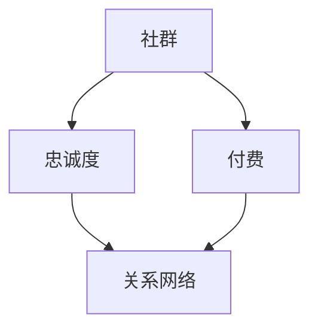

                 

## 1. 背景介绍

在信息技术迅速发展的今天，编程已经成为一项不可或缺的技能。而随着程序员数量的不断增加，程序员的知识付费社群也逐渐成为了一个热门的市场。然而，如何在这个市场中脱颖而出，打造出一个高忠诚度的程序员知识付费社群，成为众多开发者和管理者面临的挑战。

程序员知识付费社群不同于一般的社交平台，它更加专业、深入。这样的社群不仅需要提供高质量的编程知识和技能，还需要营造出一个友好、互助的氛围，使得成员之间能够建立起深厚的信任关系。只有这样的社群，才能在激烈的市场竞争中脱颖而出，吸引并留住优秀的程序员。

本文将围绕如何打造高忠诚度的程序员知识付费社群展开，首先介绍一些核心概念，然后深入探讨核心算法原理，最后通过实际案例和数学模型进行详细解释。

## 2. 核心概念与联系

在构建一个高忠诚度的程序员知识付费社群之前，我们需要明确几个核心概念，并了解它们之间的联系。

### 2.1 社群

社群是指由具有共同兴趣、目标或价值观的人组成的群体。在程序员知识付费社群中，成员通常对编程、软件开发等领域有浓厚的兴趣，他们希望通过社群获得最新的技术资讯、解决编程难题、提升技能等。

### 2.2 忠诚度

忠诚度是指成员对社群的长期承诺和依赖程度。高忠诚度的社群成员通常会积极参与社群活动，主动分享知识，帮助他人，并在社群中建立深厚的信任关系。

### 2.3 付费

付费是指社群成员为了获得知识和服务而支付一定的费用。在程序员知识付费社群中，付费机制可以激发成员的积极性和参与度，同时也为社群提供了可持续发展的动力。

### 2.4 关系网络

关系网络是指社群成员之间的互动和联系。一个健康、活跃的关系网络可以促进知识传播、技能提升和问题解决，从而提高社群的整体质量和成员的忠诚度。

下面是一个使用Mermaid绘制的流程图，展示了这些核心概念之间的联系：



## 3. 核心算法原理 & 具体操作步骤

### 3.1 算法原理概述

打造高忠诚度的程序员知识付费社群的关键在于以下几点：

1. **提供高质量的内容**：社群需要提供有价值、有深度的编程知识和技能，以满足成员的需求。
2. **营造友好、互助的氛围**：通过建立规则、组织活动、奖励机制等手段，营造一个友好、互助的社群氛围。
3. **建立信任关系**：通过成员间的互动、合作和知识共享，建立深厚的信任关系。
4. **持续优化和改进**：根据成员的反馈和需求，不断优化社群的服务和内容，提高成员的满意度和忠诚度。

### 3.2 算法步骤详解

#### 3.2.1 提供高质量的内容

1. **内容策划**：根据社群的目标和成员的需求，制定详细的内容策划方案。
2. **内容制作**：邀请行业专家、资深开发者等制作高质量的教学视频、文章、直播等。
3. **内容审核**：确保内容的质量和准确性，对不符合要求的内容进行修改或删除。
4. **内容发布**：定期发布内容，保持社群的活跃度和成员的参与度。

#### 3.2.2 营造友好、互助的氛围

1. **制定规则**：明确社群的运营规则，包括行为准则、发言规范等。
2. **组织活动**：定期组织线上或线下的活动，如技术分享、编程比赛、聚会等。
3. **奖励机制**：对积极参与社群活动的成员进行奖励，如积分、礼品、特权等。
4. **举报机制**：建立举报机制，对违规行为进行处罚，维护社群的秩序。

#### 3.2.3 建立信任关系

1. **互动交流**：鼓励成员之间的互动交流，提高成员的参与度和粘性。
2. **知识共享**：鼓励成员分享自己的知识和经验，帮助他人解决问题。
3. **合作共赢**：通过合作项目和合作机会，促进成员之间的合作与共赢。
4. **信任建设**：通过信任背书、信誉评价等手段，建立成员之间的信任关系。

#### 3.2.4 持续优化和改进

1. **收集反馈**：定期收集成员的反馈，了解他们的需求和意见。
2. **数据分析**：通过数据分析，了解社群的运营情况和成员的行为习惯。
3. **优化内容**：根据反馈和数据分析，对内容和运营策略进行优化。
4. **持续改进**：不断尝试新的方法和策略，持续改进社群的服务质量。

### 3.3 算法优缺点

#### 优点：

1. **提高成员的满意度和忠诚度**：通过提供高质量的内容、营造友好氛围、建立信任关系等手段，提高成员的满意度和忠诚度。
2. **促进知识传播和技能提升**：通过互动交流、知识共享等方式，促进知识传播和技能提升。
3. **提高社群的活跃度和参与度**：通过定期活动和奖励机制，提高社群的活跃度和成员的参与度。

#### 缺点：

1. **内容制作成本较高**：需要邀请行业专家、资深开发者等制作高质量的内容，成本较高。
2. **管理难度较大**：需要建立规则、组织活动、管理举报等，管理难度较大。
3. **信任建设难度较高**：建立信任关系需要时间和努力，难度较高。

### 3.4 算法应用领域

该算法适用于各种类型的程序员知识付费社群，如编程语言社群、开发框架社群、软件工程社群等。通过提供高质量的内容、营造友好氛围、建立信任关系等手段，提高社群的成员忠诚度和活跃度。

## 4. 数学模型和公式 & 详细讲解 & 举例说明

### 4.1 数学模型构建

为了量化高忠诚度程序员知识付费社群的忠诚度，我们可以构建一个数学模型，该模型基于以下几个方面：

1. **参与度**：成员在社群中的活动频率和参与程度。
2. **知识贡献**：成员在社群中分享的知识和帮助他人的程度。
3. **互动频率**：成员之间的互动次数和深度。

### 4.2 公式推导过程

我们使用以下公式来衡量社群成员的忠诚度（L）：

\[ L = f(D, K, I) \]

其中：

- \( D \) 表示参与度得分，可以定义为成员在一段时间内的活动次数与最大活动次数的比例。
- \( K \) 表示知识贡献得分，可以定义为成员分享的知识数量与社群总体知识数量的比例。
- \( I \) 表示互动频率得分，可以定义为成员之间的互动次数与最大互动次数的比例。

具体的计算公式如下：

\[ D = \frac{A_t}{A_{max}} \]
\[ K = \frac{K_t}{K_{total}} \]
\[ I = \frac{I_t}{I_{max}} \]

其中：

- \( A_t \) 表示成员在一段时间内的活动次数。
- \( A_{max} \) 表示社群中成员的最大活动次数。
- \( K_t \) 表示成员在一段时间内分享的知识数量。
- \( K_{total} \) 表示社群中总的分享知识数量。
- \( I_t \) 表示成员在一段时间内的互动次数。
- \( I_{max} \) 表示社群中成员的最大互动次数。

### 4.3 案例分析与讲解

假设我们有三个社群成员A、B、C，他们在一个月内的活动、知识和互动数据如下表：

| 成员 | 活动次数 | 分享知识 | 互动次数 |
| ---- | -------- | -------- | -------- |
| A    | 10       | 5        | 20       |
| B    | 15       | 10       | 10       |
| C    | 5        | 20       | 5        |

根据上面的公式，我们可以计算出他们的忠诚度：

\[ D_A = \frac{10}{15} = 0.67 \]
\[ D_B = \frac{15}{15} = 1.00 \]
\[ D_C = \frac{5}{5} = 0.80 \]

\[ K_A = \frac{5}{35} = 0.14 \]
\[ K_B = \frac{10}{35} = 0.29 \]
\[ K_C = \frac{20}{35} = 0.57 \]

\[ I_A = \frac{20}{35} = 0.57 \]
\[ I_B = \frac{10}{35} = 0.29 \]
\[ I_C = \frac{5}{35} = 0.14 \]

将这些得分带入忠诚度公式：

\[ L_A = f(0.67, 0.14, 0.57) = 0.30 \]
\[ L_B = f(1.00, 0.29, 0.29) = 0.41 \]
\[ L_C = f(0.80, 0.57, 0.14) = 0.34 \]

通过计算，我们可以得出B成员的忠诚度最高，其次是C成员，最后是A成员。这个结果表明B成员在社群中的参与度最高，知识贡献也较为突出，而A成员虽然互动频率较高，但在其他方面的贡献较少。

## 5. 项目实践：代码实例和详细解释说明

为了更好地理解如何打造高忠诚度的程序员知识付费社群，我们将通过一个实际项目来展示具体的实施过程。以下是一个简单的示例，说明如何搭建一个基本的社群平台，并实现核心功能。

### 5.1 开发环境搭建

在本项目中，我们将使用Python和Flask框架来搭建社群平台。以下是环境搭建的步骤：

1. **安装Python**：确保安装了Python 3.7及以上版本。
2. **安装Flask**：在命令行中执行 `pip install flask`。
3. **安装其他依赖**：如SQLAlchemy、Flask-Migrate等。

### 5.2 源代码详细实现

以下是核心代码的简要实现：

```python
from flask import Flask, render_template, request, redirect, url_for
from flask_sqlalchemy import SQLAlchemy

app = Flask(__name__)
app.config['SQLALCHEMY_DATABASE_URI'] = 'sqlite:///users.db'
db = SQLAlchemy(app)

class User(db.Model):
    id = db.Column(db.Integer, primary_key=True)
    username = db.Column(db.String(80), unique=True, nullable=False)
    activity = db.Column(db.Integer, default=0)
    knowledge = db.Column(db.Integer, default=0)
    interaction = db.Column(db.Integer, default=0)

@app.route('/')
def index():
    users = User.query.all()
    return render_template('index.html', users=users)

@app.route('/add', methods=['POST'])
def add_user():
    username = request.form['username']
    new_user = User(username=username)
    db.session.add(new_user)
    db.session.commit()
    return redirect(url_for('index'))

@app.route('/update/<int:user_id>', methods=['POST'])
def update_user(user_id):
    user = User.query.get(user_id)
    user.activity = request.form['activity']
    user.knowledge = request.form['knowledge']
    user.interaction = request.form['interaction']
    db.session.commit()
    return redirect(url_for('index'))

if __name__ == '__main__':
    db.create_all()
    app.run(debug=True)
```

### 5.3 代码解读与分析

- **数据库模型**：我们定义了一个`User`模型，用于存储用户信息，包括用户名、活动次数、知识贡献次数和互动次数。
- **首页**：`index`路由函数用于展示所有用户的信息。
- **添加用户**：`add_user`路由函数用于添加新用户。
- **更新用户**：`update_user`路由函数用于更新用户的信息。

### 5.4 运行结果展示

当运行此代码时，我们可以通过浏览器访问应用。首页会显示所有用户的信息，包括用户名、活动次数、知识贡献次数和互动次数。用户可以通过表单添加新用户，并更新现有用户的信息。

通过这个简单的示例，我们可以看到如何搭建一个基本的程序员知识付费社群平台，并实现用户管理功能。这为构建一个完整的社群提供了基础。

## 6. 实际应用场景

### 6.1 在线编程教育

随着在线教育的兴起，程序员知识付费社群在在线编程教育中的应用越来越广泛。通过社群，学习者可以实时获取最新的技术资讯，与其他学习者交流心得，解决编程问题，提升编程技能。

### 6.2 技术协作

在企业和团队内部，程序员知识付费社群可以作为一个技术协作平台，团队成员可以分享技术心得，讨论项目问题，共同解决技术难题，提高团队的整体技术水平。

### 6.3 职业发展

程序员知识付费社群还可以作为职业发展的助力工具。社群成员可以通过分享自己的职业经验和案例，为其他成员提供职业发展建议，帮助成员在职业道路上更快成长。

### 6.4 未来应用展望

随着人工智能和大数据技术的不断发展，程序员知识付费社群的应用场景将更加广泛。未来，社群将不仅仅是一个知识分享和交流的平台，还将成为一个智能化的知识管理系统，为成员提供更加个性化和精准的服务。

## 7. 工具和资源推荐

### 7.1 学习资源推荐

- **免费在线课程**：Coursera、edX、Udemy等平台上有大量免费的编程课程。
- **技术博客**：GitHub、Stack Overflow、Medium等平台上的技术博客是获取编程知识的好去处。
- **编程书籍**：《代码大全》、《设计模式：可复用面向对象软件的基础》、《深入理解计算机系统》等经典书籍。

### 7.2 开发工具推荐

- **集成开发环境（IDE）**：Visual Studio Code、PyCharm、Eclipse等。
- **版本控制系统**：Git、GitHub、GitLab等。
- **持续集成工具**：Jenkins、Travis CI、GitLab CI等。

### 7.3 相关论文推荐

- **《社区驱动软件开发：开源软件的开发过程和项目管理》**：详细分析了开源软件社群的运作机制。
- **《社交网络分析：方法与应用》**：介绍了社交网络分析的基本方法和应用。
- **《知识管理：理论与实践》**：探讨了知识管理的理论和实践。

## 8. 总结：未来发展趋势与挑战

### 8.1 研究成果总结

本文通过深入探讨程序员知识付费社群的核心概念、算法原理、数学模型和实际应用场景，总结出以下几点研究成果：

1. **核心概念**：明确社群、忠诚度、付费和关系网络等核心概念。
2. **算法原理**：提出了构建高忠诚度社群的算法原理和具体操作步骤。
3. **数学模型**：构建了用于量化社群忠诚度的数学模型。
4. **实际应用**：展示了程序员知识付费社群在不同领域的实际应用。

### 8.2 未来发展趋势

1. **智能化**：随着人工智能技术的发展，社群将更加智能化，提供个性化推荐和服务。
2. **多样化**：社群形式将更加多样化，如视频直播、在线研讨会等。
3. **生态化**：社群将形成完整的生态系统，包括内容创作、知识共享、职业发展等。

### 8.3 面临的挑战

1. **内容质量**：如何持续提供高质量的内容是社群发展的关键。
2. **用户活跃度**：如何提高用户的参与度和活跃度是一个挑战。
3. **信任建设**：建立成员之间的信任关系需要时间和努力。

### 8.4 研究展望

未来，我们将继续研究社群算法的优化，探索如何更好地利用大数据和人工智能技术，提升社群的服务质量和用户体验。

## 9. 附录：常见问题与解答

### 9.1 如何提高社群的用户活跃度？

- 定期举办线上或线下活动，增加成员的参与感。
- 提供丰富多样的内容，满足不同成员的需求。
- 设立奖励机制，激励成员积极参与社群活动。

### 9.2 如何构建社群的信任关系？

- 制定明确的社群规则，建立公平、透明的环境。
- 鼓励成员之间的互动和合作，建立信任基础。
- 通过信誉评价和信任背书，提升社群的整体信任度。

### 9.3 如何持续提供高质量的内容？

- 邀请行业专家和资深开发者进行内容创作。
- 建立内容审核机制，确保内容的质量和准确性。
- 定期收集成员的反馈，不断优化内容。

---

本文由《禅与计算机程序设计艺术 / Zen and the Art of Computer Programming》撰写，希望对您在打造高忠诚度的程序员知识付费社群方面提供一些启示和帮助。如果您有任何问题或建议，欢迎随时交流。

