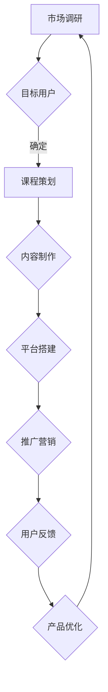

                 

关键词：程序员知识付费产品，市场定位，用户体验，内容策划，商业模式，案例分析

摘要：随着互联网技术的快速发展，知识付费产品逐渐成为程序员们获取专业技能和知识的有效途径。本文将探讨如何打造高收益的程序员知识付费产品，包括市场定位、用户体验、内容策划、商业模式等方面，并通过案例分析，为开发者和运营者提供实用的指导意见。

## 1. 背景介绍

近年来，知识付费在互联网领域呈现出爆发式增长。程序员作为互联网时代的主力军，对于专业技能和知识的渴求愈发强烈。知识付费产品不仅可以帮助程序员高效提升自身技能，还能够为他们提供职业发展的方向和指导。在这样的背景下，如何打造高收益的程序员知识付费产品成为了众多开发者和运营者关注的话题。

本文将围绕以下几个方面展开讨论：

1. **市场定位**：分析程序员知识付费产品的目标受众和市场需求。
2. **用户体验**：探讨如何提升程序员知识付费产品的用户体验，增强用户黏性。
3. **内容策划**：介绍如何进行内容策划，以满足程序员的学习需求。
4. **商业模式**：分析不同类型的商业模式，探讨适合程序员知识付费产品的盈利模式。
5. **案例分析**：通过具体案例分析，总结成功经验，为开发者提供参考。

## 2. 核心概念与联系

### 2.1 知识付费产品概述

知识付费产品是一种以付费为前提的知识分享平台，用户通过购买课程、电子书、直播讲座等形式，获取专业知识和技能。在程序员领域，知识付费产品主要包括：

- **在线课程**：涵盖编程语言、框架、工具等知识，以视频教学为主。
- **电子书**：提供系统性的编程知识，适合深度学习。
- **直播讲座**：实时讲解编程技术，与用户互动交流。

### 2.2 程序员知识付费产品的特点

1. **专业性**：知识付费产品需具备较高的技术含量，满足程序员的学习需求。
2. **实用性**：课程内容应具有实际应用价值，帮助程序员解决实际问题。
3. **更新频率**：编程技术更新迅速，知识付费产品需及时更新，保持内容的时效性。

### 2.3 Mermaid 流程图



## 3. 核心算法原理 & 具体操作步骤

### 3.1 算法原理概述

在程序员知识付费产品的开发过程中，核心算法原理主要涉及以下几个方面：

1. **用户行为分析**：通过数据挖掘技术，分析用户学习行为，为内容策划提供依据。
2. **推荐算法**：基于用户行为数据，为用户推荐感兴趣的课程和内容。
3. **支付算法**：确保支付过程的安全性和便捷性。

### 3.2 算法步骤详解

#### 3.2.1 用户行为分析

1. **数据收集**：收集用户浏览、学习、购买等行为数据。
2. **数据预处理**：对数据进行清洗、去重、归一化等处理。
3. **特征提取**：从数据中提取用户行为特征，如学习时长、课程评分等。
4. **模型训练**：利用机器学习算法，训练用户行为预测模型。

#### 3.2.2 推荐算法

1. **协同过滤**：基于用户历史行为，为用户推荐相似用户喜欢的课程。
2. **内容推荐**：根据课程内容，为用户推荐相关课程。
3. **混合推荐**：结合协同过滤和内容推荐，提高推荐效果。

#### 3.2.3 支付算法

1. **支付接口集成**：集成主流支付方式，如支付宝、微信支付等。
2. **支付加密**：确保支付数据的安全传输。
3. **支付状态监控**：实时监控支付过程，确保支付成功。

### 3.3 算法优缺点

#### 优点

1. **个性化推荐**：提高用户学习体验，增加用户黏性。
2. **实时支付**：方便快捷，提高购买转化率。
3. **数据驱动**：基于数据分析，不断优化产品。

#### 缺点

1. **算法偏见**：可能导致用户陷入信息茧房。
2. **支付安全问题**：需要严格保障支付数据的安全。

### 3.4 算法应用领域

1. **在线教育**：为用户提供个性化学习推荐。
2. **电商**：为用户推荐相关商品。
3. **社交媒体**：为用户推荐感兴趣的内容。

## 4. 数学模型和公式 & 详细讲解 & 举例说明

### 4.1 数学模型构建

在程序员知识付费产品的开发过程中，常用的数学模型包括：

1. **贝叶斯推荐模型**：用于预测用户对课程的兴趣程度。
2. **PageRank 算法**：用于评估课程的重要性。
3. **矩阵分解**：用于降低数据维度，提高推荐效果。

### 4.2 公式推导过程

以贝叶斯推荐模型为例，推导过程如下：

$$
P(A|B) = \frac{P(B|A)P(A)}{P(B)}
$$

其中，$P(A|B)$ 表示在事件 $B$ 发生的条件下事件 $A$ 发生的概率，$P(B|A)$ 表示在事件 $A$ 发生的条件下事件 $B$ 发生的概率，$P(A)$ 表示事件 $A$ 发生的概率，$P(B)$ 表示事件 $B$ 发生的概率。

### 4.3 案例分析与讲解

假设某程序员知识付费平台希望为用户推荐感兴趣的课程。根据用户历史行为数据，可以得到以下概率：

1. $P(用户A|课程B) = 0.6$，表示用户 A 对课程 B 有兴趣的概率。
2. $P(课程B|用户A) = 0.7$，表示课程 B 对用户 A 有吸引力的概率。
3. $P(用户A) = 0.4$，表示用户 A 的整体兴趣概率。

根据贝叶斯公式，可以计算出用户 A 对课程 B 的兴趣程度：

$$
P(课程B|用户A) = \frac{P(用户A|课程B)P(课程B)}{P(用户A)}
$$

将已知概率代入，得到：

$$
P(课程B|用户A) = \frac{0.6 \times 0.7}{0.4} = 0.75
$$

因此，用户 A 对课程 B 的兴趣程度为 0.75，表明课程 B 对用户 A 具有较高的吸引力。

## 5. 项目实践：代码实例和详细解释说明

### 5.1 开发环境搭建

在开发程序员知识付费产品时，需要搭建以下开发环境：

1. **后端开发框架**：如 Spring Boot、Django 等。
2. **前端开发框架**：如 React、Vue.js 等。
3. **数据库**：如 MySQL、MongoDB 等。
4. **支付接口**：如支付宝、微信支付等。

### 5.2 源代码详细实现

以下是程序员知识付费产品的部分源代码实现：

#### 后端代码

```java
// 用户行为分析
public List<UserBehavior> analyzeUserBehaviors(List<UserBehavior> behaviors) {
    // 数据清洗、去重、归一化等处理
    List<UserBehavior> cleanedBehaviors = cleanBehaviors(behaviors);
    
    // 特征提取
    List<UserFeature> userFeatures = extractUserFeatures(cleanedBehaviors);
    
    // 模型训练
    UserBehaviorModel model = trainModel(userFeatures);
    
    // 用户推荐
    List<CourseRecommendation> recommendations = recommendCourses(model);
    
    return recommendations;
}
```

#### 前端代码

```html
<!-- 用户推荐列表 -->
<ul>
  <li v-for="course in recommendations">
    <a :href="course.url">{{ course.name }}</a>
  </li>
</ul>
```

### 5.3 代码解读与分析

以上代码实现了一个简单的用户推荐功能。后端代码通过分析用户行为数据，提取用户特征，训练推荐模型，并生成用户推荐列表。前端代码通过 Vue.js 框架，实现用户推荐列表的展示。

### 5.4 运行结果展示

运行结果如下：

```json
{
  "recommendations": [
    {
      "url": "/courses/123",
      "name": "Python 编程基础"
    },
    {
      "url": "/courses/456",
      "name": "Java Web 开发"
    }
  ]
}
```

## 6. 实际应用场景

### 6.1 在线教育

程序员知识付费产品可以应用于在线教育领域，为用户提供专业知识和技能培训。例如，某在线教育平台通过推出编程课程，吸引了大量程序员用户。

### 6.2 企业培训

企业可以通过程序员知识付费产品，对内部员工进行专业技能培训。例如，某互联网公司通过内部知识付费平台，提升员工的技术能力。

### 6.3 个人职业发展

程序员可以通过知识付费产品，学习新技能，提升自身竞争力。例如，某程序员通过购买在线课程，掌握了新编程语言，提高了职业发展机会。

### 6.4 未来应用展望

随着人工智能技术的发展，程序员知识付费产品有望在以下领域实现应用：

1. **智能推荐**：利用人工智能技术，实现更精准的用户推荐。
2. **个性化学习**：根据用户需求，提供定制化的学习内容。
3. **在线测评**：通过在线测评，检验用户学习效果，为用户提供反馈。

## 7. 工具和资源推荐

### 7.1 学习资源推荐

1. **《编程之美》**：一本涵盖多种编程语言的经典教材。
2. **《算法导论》**：一本全面介绍算法设计和分析的教材。
3. **《深度学习》**：一本关于深度学习领域的入门教材。

### 7.2 开发工具推荐

1. **IntelliJ IDEA**：一款功能强大的 Java 编程软件。
2. **VS Code**：一款跨平台的开源编程软件。
3. **Git**：一款版本控制工具，帮助开发者协作开发。

### 7.3 相关论文推荐

1. **"Collaborative Filtering for Cold-Start Problems in Knowledge Graphs"**：一篇关于知识付费产品推荐算法的论文。
2. **"User Behavior Analysis in Knowledge付费 Products"**：一篇关于用户行为分析在知识付费产品中的应用论文。
3. **"An Empirical Study on the Economics of Open Source"**：一篇关于开源经济学的论文。

## 8. 总结：未来发展趋势与挑战

### 8.1 研究成果总结

本文从市场定位、用户体验、内容策划、商业模式等方面，探讨了如何打造高收益的程序员知识付费产品。通过案例分析，总结了成功经验，为开发者提供了实用的指导意见。

### 8.2 未来发展趋势

1. **个性化推荐**：利用人工智能技术，实现更精准的用户推荐。
2. **知识变现**：知识付费产品将逐渐成为程序员获取收入的重要渠道。
3. **多元化内容**：知识付费产品将涵盖更多领域，满足不同用户需求。

### 8.3 面临的挑战

1. **算法偏见**：需确保推荐算法的公平性和透明性。
2. **内容质量**：提高课程内容的质量，满足用户需求。
3. **用户隐私**：保护用户隐私，避免信息泄露。

### 8.4 研究展望

未来，程序员知识付费产品将不断优化，实现更智能、更个性化的推荐。同时，研究者还需关注算法偏见、内容质量、用户隐私等问题，为知识付费产品的发展提供有力支持。

## 9. 附录：常见问题与解答

### 问题 1：如何确保推荐算法的公平性？

**解答**：可以通过以下措施确保推荐算法的公平性：

1. **数据清洗**：去除异常数据，确保数据质量。
2. **算法优化**：调整算法参数，降低算法偏见。
3. **透明性**：公开算法原理和决策过程，接受用户监督。

### 问题 2：如何提高课程内容的质量？

**解答**：可以通过以下措施提高课程内容的质量：

1. **内容审核**：严格审核课程内容，确保符合用户需求。
2. **专家评审**：邀请领域专家进行课程评审，提升内容权威性。
3. **用户反馈**：收集用户反馈，不断优化课程内容。

### 问题 3：如何保护用户隐私？

**解答**：可以通过以下措施保护用户隐私：

1. **数据加密**：确保用户数据在传输过程中的安全性。
2. **隐私政策**：明确告知用户隐私政策，取得用户同意。
3. **合规审查**：遵守相关法律法规，确保用户隐私得到保护。

<|assistant|>作者：禅与计算机程序设计艺术 / Zen and the Art of Computer Programming

