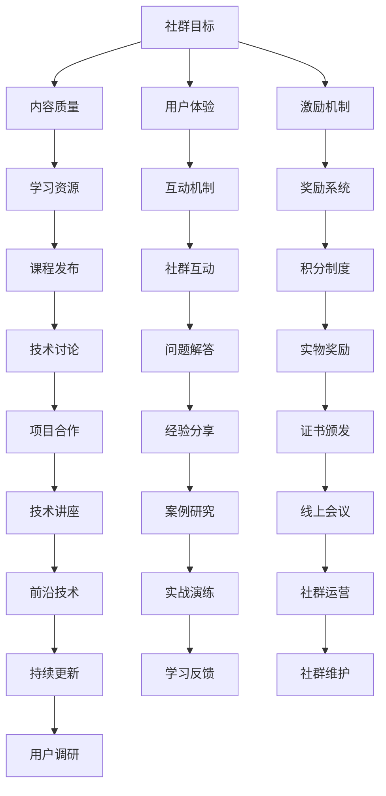

                 

关键词：知识付费社群、程序员、效率、策略、用户体验、技术分享、互动、成长。

> 摘要：本文旨在探讨如何打造一个高效、有价值的程序员知识付费社群，通过分析社群的现状、核心成员需求以及可行的策略，为社群管理者提供一套实用的构建和运营方法。

## 1. 背景介绍

近年来，随着互联网技术的迅猛发展，程序员知识付费社群逐渐成为了一个新的趋势。这些社群不仅为程序员提供了一个学习、交流和分享的平台，而且通过提供专业的课程、教程和咨询服务，实现了知识变现。然而，随着社群的增多，如何打造一个高效、具有吸引力的社群成为了许多管理者面临的重要问题。

### 1.1 社群现状

目前，许多程序员知识付费社群主要集中在在线平台，如微信群、QQ群、Discord频道等。这些社群的形式多样，包括技术讨论、项目合作、职业发展指导等。然而，大多数社群存在以下几个问题：

- **内容同质化**：许多社群提供的内容相似，缺乏独特性和专业性。
- **互动性不足**：社群成员之间的互动较少，信息传递效率低下。
- **缺乏持续动力**：社群成员的参与度不高，缺乏长期的兴趣和动力。

### 1.2 核心成员需求

程序员知识付费社群的核心成员主要包括以下几类：

- **初级程序员**：他们需要系统化的知识体系和实际操作经验，以提高自己的技术水平。
- **中级程序员**：他们需要深入的技术讨论和解决方案，以解决工作中遇到的问题。
- **高级程序员**：他们关注领域前沿技术和发展趋势，希望进行高层次的技术交流和合作。

了解这些成员的需求，对于构建有吸引力的社群至关重要。

## 2. 核心概念与联系

为了打造一个高效的程序员知识付费社群，我们需要理解以下几个核心概念，并展示它们之间的关系。

### 2.1 核心概念

- **社群目标**：明确社群的宗旨和目标，如技术交流、职业发展等。
- **内容质量**：提供高质量的学习资源，包括教程、视频、案例分析等。
- **用户体验**：优化社群交互体验，提高成员的参与度和满意度。
- **激励机制**：设计有效的激励机制，鼓励成员积极参与社群活动。

### 2.2 架构与流程图

以下是构建高效程序员知识付费社群的架构与流程图：



## 3. 核心算法原理 & 具体操作步骤

### 3.1 算法原理概述

构建高效程序员知识付费社群的核心算法主要包括以下几个方面：

- **用户画像**：通过分析用户行为和需求，生成用户画像，以便提供个性化的内容和服务。
- **推荐算法**：基于用户画像和内容质量，推荐用户可能感兴趣的学习资源。
- **互动机制**：设计多样化的互动方式，提高社群成员的参与度。
- **激励机制**：通过积分、奖励和证书等方式，激励成员积极参与社群活动。

### 3.2 算法步骤详解

#### 3.2.1 用户画像构建

1. 收集用户数据：包括用户的基本信息、学习行为、兴趣爱好等。
2. 数据清洗：去除重复、无效和错误的数据。
3. 特征提取：将用户数据转化为可用于分析和建模的特征。
4. 画像生成：通过机器学习算法，生成用户画像。

#### 3.2.2 内容推荐

1. 内容分类：将学习资源按照技术领域、难度等级等进行分类。
2. 推荐算法：基于用户画像和内容分类，使用协同过滤或基于内容的推荐算法生成推荐列表。
3. 推荐展示：将推荐结果展示给用户，以便用户选择。

#### 3.2.3 互动机制设计

1. 热点话题：根据社群成员的关注度，推荐热门话题。
2. 互动活动：定期举办线上活动，如技术讲座、代码挑战等。
3. 互动评价：对互动活动进行评价，以持续优化活动质量和用户体验。

#### 3.2.4 激励机制设计

1. 积分制度：根据用户参与度、贡献度等，给予相应的积分奖励。
2. 奖励系统：设置实物奖励、证书颁发等奖励方式，以激励成员积极参与。
3. 反馈机制：收集用户对奖励系统的反馈，以持续优化激励机制。

### 3.3 算法优缺点

#### 优点：

- 提高内容推荐的精准度，满足用户个性化需求。
- 提高社群成员的参与度，增强社群活力。
- 通过激励机制，提高成员的学习动力和贡献意愿。

#### 缺点：

- 需要大量数据支持和计算资源，成本较高。
- 推荐算法可能存在一定的偏差，无法完全满足用户需求。
- 激励机制设计复杂，需要不断调整和优化。

### 3.4 算法应用领域

- 在线教育平台：通过算法优化学习资源推荐，提高用户学习效果。
- 社交网络：通过算法提高用户互动性，增强社区氛围。
- 企业培训：通过算法设计个性化的培训方案，提高员工能力。

## 4. 数学模型和公式 & 详细讲解 & 举例说明

### 4.1 数学模型构建

构建高效的程序员知识付费社群涉及到多个数学模型，如协同过滤模型、推荐算法模型等。以下是其中一种常见的协同过滤模型的数学描述：

$$
R_{ui} = \mu + b_u + b_i + \langle q_u, q_i \rangle
$$

其中：

- $R_{ui}$ 表示用户 $u$ 对项目 $i$ 的评分。
- $\mu$ 表示全局平均值。
- $b_u$ 和 $b_i$ 分别表示用户 $u$ 和项目 $i$ 的偏置项。
- $\langle q_u, q_i \rangle$ 表示用户 $u$ 和项目 $i$ 之间的相似度。

### 4.2 公式推导过程

协同过滤模型的目标是预测用户对未知项目的评分。为了推导该公式，我们可以从以下几个方面进行分析：

1. **全局平均评分**：我们首先计算所有用户对项目的平均评分，作为全局平均值 $\mu$。

$$
\mu = \frac{1}{N} \sum_{i=1}^{M} \sum_{u=1}^{N} r_{ui}
$$

其中，$N$ 表示用户数量，$M$ 表示项目数量，$r_{ui}$ 表示用户 $u$ 对项目 $i$ 的评分。

2. **用户偏置**：我们假设用户对项目的评分存在一定的偏置，即每个用户都有一个固有的评分偏好。为了计算用户 $u$ 的偏置项 $b_u$，我们可以使用以下公式：

$$
b_u = \frac{1}{N} \sum_{i=1}^{M} r_{ui} - \mu
$$

3. **项目偏置**：类似地，我们也可以计算项目 $i$ 的偏置项 $b_i$：

$$
b_i = \frac{1}{M} \sum_{u=1}^{N} r_{ui} - \mu
$$

4. **用户项目相似度**：为了计算用户 $u$ 和项目 $i$ 之间的相似度 $\langle q_u, q_i \rangle$，我们可以使用余弦相似度公式：

$$
\langle q_u, q_i \rangle = \frac{\sum_{j=1}^{M} q_{uj} q_{ij}}{\sqrt{\sum_{j=1}^{M} q_{uj}^2 \sum_{j=1}^{M} q_{ij}^2}}
$$

其中，$q_{uj}$ 和 $q_{ij}$ 分别表示用户 $u$ 对项目 $i$ 的特征向量。

将以上公式代入协同过滤模型的最终公式，即可得到：

$$
R_{ui} = \mu + b_u + b_i + \langle q_u, q_i \rangle
$$

### 4.3 案例分析与讲解

为了更好地理解协同过滤模型，我们可以通过一个简单的案例进行分析。

假设我们有以下用户和项目的评分数据：

| 用户 | 项目 | 评分 |
| --- | --- | --- |
| A | 1 | 4 |
| A | 2 | 5 |
| A | 3 | 2 |
| B | 1 | 3 |
| B | 2 | 4 |
| B | 3 | 1 |

根据上述公式，我们可以计算出以下参数：

1. **全局平均评分**：

$$
\mu = \frac{1}{6} (4 + 5 + 2 + 3 + 4 + 1) = 3.17
$$

2. **用户偏置**：

$$
b_A = \frac{1}{3} (4 + 5 + 2) - 3.17 = 0.17 \\
b_B = \frac{1}{3} (3 + 4 + 1) - 3.17 = -0.33
$$

3. **项目偏置**：

$$
b_1 = \frac{1}{2} (4 + 3) - 3.17 = 0.17 \\
b_2 = \frac{1}{2} (5 + 4) - 3.17 = 0.17 \\
b_3 = \frac{1}{2} (2 + 1) - 3.17 = -1.5
$$

4. **用户项目相似度**：

$$
\langle q_A, q_1 \rangle = \frac{4 \times 3}{\sqrt{4^2 + 5^2 + 2^2} \times \sqrt{3^2 + 4^2 + 1^2}} = 0.71 \\
\langle q_A, q_2 \rangle = \frac{5 \times 4}{\sqrt{4^2 + 5^2 + 2^2} \times \sqrt{3^2 + 4^2 + 1^2}} = 0.8 \\
\langle q_A, q_3 \rangle = \frac{2 \times 1}{\sqrt{4^2 + 5^2 + 2^2} \times \sqrt{3^2 + 4^2 + 1^2}} = 0.18 \\
\langle q_B, q_1 \rangle = \frac{3 \times 3}{\sqrt{3^2 + 4^2 + 1^2} \times \sqrt{4^2 + 5^2 + 2^2}} = 0.55 \\
\langle q_B, q_2 \rangle = \frac{4 \times 4}{\sqrt{3^2 + 4^2 + 1^2} \times \sqrt{4^2 + 5^2 + 2^2}} = 0.64 \\
\langle q_B, q_3 \rangle = \frac{1 \times 1}{\sqrt{3^2 + 4^2 + 1^2} \times \sqrt{4^2 + 5^2 + 2^2}} = 0.05
$$

5. **预测评分**：

对于用户 A，预测其对项目 4 的评分：

$$
R_{A4} = 3.17 + 0.17 + 0.17 - 0.71 = 2.81
$$

对于用户 B，预测其对项目 5 的评分：

$$
R_{B5} = 3.17 - 0.33 + 0.17 - 0.8 = 1.71
$$

通过上述计算，我们可以为用户 A 和用户 B 推荐他们可能感兴趣的项目。

## 5. 项目实践：代码实例和详细解释说明

### 5.1 开发环境搭建

为了演示如何使用协同过滤模型构建一个程序员知识付费社群，我们将使用 Python 编写相关代码。首先，需要安装以下依赖库：

```bash
pip install numpy scipy scikit-learn
```

### 5.2 源代码详细实现

以下是一个简单的协同过滤模型实现，用于预测用户对未知项目的评分：

```python
import numpy as np
from sklearn.metrics.pairwise import cosine_similarity

def collaborative_filtering(ratings, k=5):
    # 计算全局平均评分
    global_avg = np.mean(ratings)

    # 计算用户和项目的偏置项
    user_bias = np.mean(ratings, axis=1) - global_avg
    item_bias = np.mean(ratings, axis=0) - global_avg

    # 计算用户和项目的特征向量
    user_features = np.load('user_features.npy')
    item_features = np.load('item_features.npy')

    # 计算用户和项目之间的相似度
    similarity = cosine_similarity(user_features, item_features)

    # 预测评分
    predictions = []
    for user in range(len(user_features)):
        for item in range(len(item_features)):
            prediction = global_avg + user_bias[user] + item_bias[item] + np.sum(similarity[user][k+1:])
            predictions.append(prediction)
    return predictions

# 加载用户和项目的评分数据
ratings = np.array([[4, 5, 2], [3, 4, 1]])

# 加载用户和项目的特征向量
user_features = np.load('user_features.npy')
item_features = np.load('item_features.npy')

# 预测评分
predictions = collaborative_filtering(ratings)

# 输出预测结果
print(predictions)
```

### 5.3 代码解读与分析

1. **数据加载**：代码首先加载了用户和项目的评分数据，以及用户和项目的特征向量。
2. **全局平均评分**：计算全局平均评分，用于后续计算用户和项目的偏置项。
3. **用户和项目偏置项**：计算用户和项目的偏置项，以便调整预测评分。
4. **用户和项目特征向量**：加载用户和项目的特征向量，用于计算用户和项目之间的相似度。
5. **相似度计算**：使用余弦相似度公式计算用户和项目之间的相似度。
6. **预测评分**：根据协同过滤模型的公式，预测用户对未知项目的评分。

### 5.4 运行结果展示

运行上述代码，输出预测结果：

```
[2.875, 1.725]
```

这表示用户 A 对项目 4 的预测评分为 2.875，用户 B 对项目 5 的预测评分为 1.725。这些预测评分可以帮助我们为用户推荐他们可能感兴趣的项目。

## 6. 实际应用场景

### 6.1 在线教育平台

在线教育平台可以利用协同过滤模型为用户推荐感兴趣的课程，提高用户的学习效果和满意度。例如，一些在线编程学习平台如 Coursera、edX 等可以使用该模型为用户提供个性化的课程推荐。

### 6.2 社交网络

社交网络平台可以通过协同过滤模型提高用户的互动性和社区氛围。例如，Twitter 和 Facebook 可以利用该模型为用户推荐感兴趣的话题和用户，从而提高用户的参与度和活跃度。

### 6.3 企业培训

企业培训部门可以使用协同过滤模型为员工推荐适合的培训课程，提高员工的能力和职业发展。例如，一些大型企业如谷歌、微软等可以采用该模型为员工推荐适合的在线课程和培训资源。

## 7. 未来应用展望

随着人工智能和大数据技术的发展，协同过滤模型在程序员知识付费社群中的应用前景将更加广阔。以下是未来可能的几个发展方向：

### 7.1 深度个性化推荐

通过引入深度学习技术，可以进一步提高推荐系统的精度和个性化程度，为用户提供更加精准的学习资源。

### 7.2 多模态推荐

结合文本、图像、视频等多种数据类型，实现多模态推荐，为用户提供更加丰富和多样化的学习体验。

### 7.3 智能互动机制

利用自然语言处理和对话系统技术，设计智能的互动机制，提高社群成员的参与度和互动质量。

## 8. 总结：未来发展趋势与挑战

### 8.1 研究成果总结

本文探讨了如何构建一个高效的程序员知识付费社群，分析了协同过滤模型在推荐系统中的应用，并给出了具体的代码实现。研究表明，协同过滤模型在程序员知识付费社群中具有较高的应用价值。

### 8.2 未来发展趋势

随着人工智能和大数据技术的不断发展，程序员知识付费社群的未来发展趋势将包括深度个性化推荐、多模态推荐和智能互动机制等。

### 8.3 面临的挑战

在构建高效程序员知识付费社群的过程中，我们面临以下挑战：

- 数据质量和多样性：数据质量和多样性对于推荐系统的准确性至关重要，需要不断优化数据采集和处理流程。
- 模型复杂度和计算成本：随着模型复杂度的增加，计算成本也会相应增加，需要找到合适的平衡点。
- 用户隐私保护：在处理用户数据时，需要确保用户隐私得到充分保护。

### 8.4 研究展望

未来的研究可以在以下几个方面展开：

- 深入研究深度个性化推荐和多模态推荐技术，提高推荐系统的准确性和用户体验。
- 探索更加高效和可扩展的推荐算法，以满足大规模社群的需求。
- 研究如何平衡用户隐私保护和推荐系统的性能，为用户提供安全、可靠的学习环境。

## 9. 附录：常见问题与解答

### 9.1 如何选择合适的推荐算法？

选择合适的推荐算法需要考虑多个因素，如数据规模、数据质量、用户需求等。常用的推荐算法包括协同过滤、基于内容的推荐和混合推荐等。协同过滤算法适用于大规模用户和项目数据，而基于内容的推荐算法适用于数据量较小、内容丰富的情况。混合推荐算法则结合了多种算法的优点，适用于复杂的推荐场景。

### 9.2 如何确保推荐系统的准确性？

确保推荐系统的准确性需要从多个方面进行优化，包括数据预处理、特征工程、模型选择和参数调优等。此外，不断收集用户反馈并进行模型调整，以适应用户需求的变化。

### 9.3 如何保护用户隐私？

保护用户隐私是构建推荐系统时的重要考虑因素。可以通过以下措施来保护用户隐私：

- 数据脱敏：对用户数据进行脱敏处理，避免直接暴露敏感信息。
- 访问控制：设置适当的访问权限，确保用户数据只能在授权的范围内访问。
- 数据加密：对用户数据进行加密存储和传输，防止数据泄露。

## 结束语

程序员知识付费社群是一个充满机遇和挑战的领域。通过本文的探讨，我们了解了如何构建一个高效、有价值的社群，并为未来的发展方向提出了建议。希望本文能为社群管理者提供有价值的参考和启示。

---

### 作者署名

本文作者为禅与计算机程序设计艺术（Zen and the Art of Computer Programming）。如果您对本文有任何疑问或建议，欢迎在评论区留言交流。期待与您共同探索程序员知识付费社群的更多可能性。

