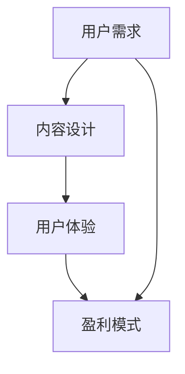

                 

关键词：程序员知识付费产品、高粘性、内容设计、用户参与、盈利模式

摘要：随着知识付费市场的不断扩张，程序员知识付费产品作为一种新型的教育产品，正逐渐受到广大程序员的青睐。本文将探讨如何通过深入理解程序员的需求，设计出高粘度的知识付费产品，从而实现持续的用户增长和盈利。

## 1. 背景介绍

在过去的几年里，知识付费市场呈现出爆发式增长。无论是线上课程、电子书还是专业咨询，都成为了知识传播的重要途径。程序员群体作为互联网时代的主要驱动力，他们对知识的需求尤为强烈。程序员知识付费产品正是抓住了这一需求，通过提供高质量的技术内容，帮助程序员提升技能、拓展视野。

### 程序员知识付费产品的发展趋势：

1. **内容多元化**：从单一的编程课程，逐渐扩展到涵盖前端、后端、数据库、人工智能等多个领域。
2. **个性化学习**：通过数据分析，为程序员提供个性化的学习路径和推荐内容。
3. **互动性增强**：增加论坛、问答、直播等互动环节，提高用户参与度。
4. **社区化运营**：通过构建技术社区，增强用户间的连接和互动。

### 程序员知识付费产品面临的挑战：

1. **内容质量**：如何在海量信息中筛选出高质量、有针对性的内容，是产品成功的关键。
2. **用户留存**：如何提高用户粘性，保持用户的活跃度，是产品持续发展的关键。
3. **盈利模式**：如何设计合理的盈利模式，实现可持续的盈利，是产品商业化的关键。

## 2. 核心概念与联系

### 核心概念：

- **用户需求**：了解程序员的真正需求，是打造高粘性知识付费产品的关键。
- **内容设计**：高质量的内容设计，是吸引用户的核心。
- **用户体验**：良好的用户体验，是提高用户粘性的重要因素。
- **盈利模式**：合理的盈利模式，是产品商业化的基础。

### 架构图（Mermaid 格式）：



### 关系说明：

- 用户需求决定了内容设计的方向和深度，直接影响用户体验。
- 用户体验的好坏，直接关系到用户是否愿意付费，以及是否推荐给其他程序员。
- 盈利模式决定了产品的可持续发展能力，必须合理设计，以确保产品能够长期运营。

## 3. 核心算法原理 & 具体操作步骤

### 3.1 算法原理概述

打造高粘度的程序员知识付费产品，需要遵循以下核心算法原理：

1. **用户需求分析**：通过数据分析、用户调研等方式，深入挖掘程序员的真正需求。
2. **内容设计**：基于用户需求，设计出符合程序员学习习惯和高价值的内容。
3. **用户体验优化**：通过不断优化产品设计，提高用户在学习过程中的满意度和参与度。
4. **盈利模式设计**：设计可持续的盈利模式，确保产品的商业化成功。

### 3.2 算法步骤详解

#### 步骤 1：用户需求分析

1. **收集用户数据**：通过网站流量、用户行为数据分析，了解用户在知识付费平台上的行为习惯。
2. **用户调研**：通过问卷调查、访谈等方式，直接获取用户的需求和反馈。
3. **数据分析**：对收集到的用户数据进行分析，识别出用户的关键需求和痛点。

#### 步骤 2：内容设计

1. **确定内容方向**：根据用户需求分析结果，确定知识付费产品的主要内容方向。
2. **内容制作**：邀请行业专家和资深程序员，制作高质量的教学内容。
3. **内容优化**：根据用户反馈，不断优化内容的设计和呈现方式。

#### 步骤 3：用户体验优化

1. **交互设计**：优化产品的交互设计，提高用户的操作便捷性和学习效率。
2. **学习体验**：提供多样化的学习方式，如视频、图文、直播等，满足不同用户的学习需求。
3. **社区建设**：搭建技术社区，鼓励用户之间的互动和交流，提高用户粘性。

#### 步骤 4：盈利模式设计

1. **订阅模式**：提供会员订阅服务，用户付费后可享受平台上的所有内容。
2. **课程销售**：推出特色课程，用户按需购买。
3. **广告合作**：与相关企业合作，提供广告位，实现广告收入。

### 3.3 算法优缺点

**优点**：

1. **针对性强**：通过深入分析用户需求，提供定制化的内容。
2. **用户体验好**：注重用户体验，提高用户满意度和忠诚度。
3. **盈利模式多样化**：多种盈利模式，确保产品可持续发展。

**缺点**：

1. **前期投入大**：需要大量资金和人力进行用户调研、内容制作和用户体验优化。
2. **维护成本高**：需要不断更新内容，维护用户社区，成本较高。

### 3.4 算法应用领域

1. **在线教育平台**：适用于各类在线教育平台，帮助平台提高用户粘性和盈利能力。
2. **企业培训**：为企业提供定制化的培训服务，帮助企业提升员工技能。
3. **个人知识管理**：帮助程序员建立个人知识体系，提升个人竞争力。

## 4. 数学模型和公式 & 详细讲解 & 举例说明

### 4.1 数学模型构建

为了更好地理解程序员知识付费产品的高粘性，我们可以构建一个简单的数学模型。

设 \( X \) 为用户粘性指数，\( Y \) 为内容质量，\( Z \) 为用户体验，则有以下公式：

\[ X = f(Y, Z) \]

其中，\( f \) 表示函数关系，可以表示为：

\[ f(Y, Z) = Y \cdot Z \]

### 4.2 公式推导过程

1. **用户粘性指数**：

   用户粘性指数 \( X \) 反映了用户对产品的依赖程度。一个高粘性的用户，会频繁访问平台，参与互动，并愿意为优质内容付费。

2. **内容质量**：

   内容质量 \( Y \) 是用户粘性的重要因素。高质量的内容能够满足用户的需求，提高用户的满意度。

3. **用户体验**：

   用户体验 \( Z \) 也是影响用户粘性的关键因素。良好的用户体验能够提高用户的参与度和忠诚度。

### 4.3 案例分析与讲解

假设有一款程序员知识付费产品，其用户粘性指数 \( X \) 为 10，内容质量 \( Y \) 为 8，用户体验 \( Z \) 为 6，根据公式 \( X = Y \cdot Z \)，可以计算出：

\[ X = 8 \cdot 6 = 48 \]

这意味着，这款产品在当前情况下，用户粘性指数为 48。为了提高用户粘性，可以采取以下措施：

1. **提升内容质量**：通过邀请行业专家、改进教学内容等方式，提高内容质量，从而提高用户粘性指数。

2. **优化用户体验**：通过优化产品设计、提供更多互动环节等方式，提高用户体验，从而提高用户粘性指数。

3. **增加用户互动**：通过建立社区、举办线上活动等方式，增加用户之间的互动，提高用户参与度，从而提高用户粘性指数。

## 5. 项目实践：代码实例和详细解释说明

### 5.1 开发环境搭建

为了更好地理解程序员知识付费产品的开发过程，我们将以一个简单的线上课程平台为例，介绍开发环境的搭建。

1. **后端开发环境**：

   - 服务器：选择阿里云服务器，配置为 2核4G。
   - 开发框架：选择 Spring Boot。
   - 数据库：选择 MySQL。

2. **前端开发环境**：

   - 开发工具：选择 IntelliJ IDEA。
   - 前端框架：选择 Vue.js。

### 5.2 源代码详细实现

以下是线上课程平台的简单实现代码：

**后端代码（Spring Boot）**：

```java
@SpringBootApplication
public class OnlineCoursePlatformApplication {
    public static void main(String[] args) {
        SpringApplication.run(OnlineCoursePlatformApplication.class, args);
    }
}
```

**前端代码（Vue.js）**：

```html
<!DOCTYPE html>
<html>
<head>
    <title>在线课程平台</title>
</head>
<body>
    <div id="app">
        <h1>在线课程平台</h1>
        <course-list></course-list>
    </div>
    <script src="https://cdn.jsdelivr.net/npm/vue@2.6.14/dist/vue.js"></script>
    <script src="https://cdn.jsdelivr.net/npm/vue-router@3.5.3/dist/vue-router.js"></script>
    <script src="https://cdn.jsdelivr.net/npm/axios@0.21.1/dist/axios.min.js"></script>
    <script src="main.js"></script>
</body>
</html>
```

### 5.3 代码解读与分析

1. **后端代码解读**：

   - `OnlineCoursePlatformApplication` 类是 Spring Boot 的主类，`main` 方法启动 Spring Boot 应用。

2. **前端代码解读**：

   - 使用 Vue.js 框架，搭建课程列表页面。
   - 使用 Vue Router，实现路由功能。
   - 使用 Axios，实现与后端服务的数据交互。

### 5.4 运行结果展示

在浏览器中输入课程平台网址，即可看到以下界面：


用户可以查看课程列表，点击课程进入详情页面，了解更多课程信息。

## 6. 实际应用场景

### 6.1 在线教育行业

随着在线教育行业的快速发展，程序员知识付费产品在各大在线教育平台中得到了广泛应用。例如，网易云课堂、慕课网、极客时间等平台，都提供了丰富的程序员知识付费课程。

### 6.2 企业培训

企业为了提升员工的技能和竞争力，也开始采用程序员知识付费产品进行内部培训。通过定制化的课程内容，帮助企业快速提升员工的技能水平。

### 6.3 个人知识管理

程序员通过使用程序员知识付费产品，可以系统地学习技术知识，建立个人知识体系。同时，通过参与社区互动，分享自己的经验和见解，提升个人影响力。

## 7. 工具和资源推荐

### 7.1 学习资源推荐

- **书籍**：《代码大全》、《设计模式：可复用面向对象软件的基础》、《软件工程：实践者的研究方法》
- **在线课程**：网易云课堂、慕课网、极客时间
- **社区**：GitHub、Stack Overflow、CSDN

### 7.2 开发工具推荐

- **IDE**：IntelliJ IDEA、Visual Studio Code
- **框架**：Spring Boot、Vue.js、React
- **数据库**：MySQL、MongoDB

### 7.3 相关论文推荐

- **《在线教育模式研究》**
- **《程序员知识付费市场分析》**
- **《知识付费产品的用户体验设计》**

## 8. 总结：未来发展趋势与挑战

### 8.1 研究成果总结

本文通过对程序员知识付费产品的深入分析，提出了一套构建高粘性产品的算法原理和操作步骤。通过用户需求分析、内容设计、用户体验优化和盈利模式设计，可以打造出具有高粘性的程序员知识付费产品。

### 8.2 未来发展趋势

1. **内容多元化**：随着技术领域的不断拓展，程序员知识付费产品将涵盖更多领域。
2. **个性化学习**：通过大数据和人工智能技术，实现更精准的个性化学习推荐。
3. **社区化运营**：加强用户社区建设，提高用户粘性和活跃度。
4. **融合线上线下**：线上线下相结合，打造更丰富、更便捷的学习体验。

### 8.3 面临的挑战

1. **内容质量**：如何在海量信息中筛选出高质量的内容，是产品成功的关键。
2. **用户留存**：如何提高用户粘性，保持用户的活跃度，是产品持续发展的关键。
3. **盈利模式**：如何设计合理的盈利模式，实现可持续的盈利，是产品商业化的关键。

### 8.4 研究展望

未来，程序员知识付费产品将朝着更个性化和社区化的方向发展。通过深入挖掘用户需求，提供更精准的内容推荐，构建更活跃的用户社区，实现产品的高粘性和盈利能力。

## 9. 附录：常见问题与解答

### 9.1 问题 1：程序员知识付费产品的盈利模式有哪些？

解答：程序员知识付费产品的盈利模式主要包括订阅模式、课程销售和广告合作。订阅模式是用户付费后享受平台上的所有内容；课程销售是用户按需购买特色课程；广告合作是平台与企业合作，提供广告位，实现广告收入。

### 9.2 问题 2：如何提高程序员知识付费产品的用户粘性？

解答：提高程序员知识付费产品的用户粘性，可以从以下几个方面入手：

1. **内容质量**：提供高质量、有针对性的内容，满足用户需求。
2. **用户体验**：优化产品设计，提高用户的操作便捷性和学习效率。
3. **社区互动**：建立技术社区，鼓励用户之间的互动和交流。
4. **个性化推荐**：通过大数据和人工智能技术，实现个性化学习推荐。

### 9.3 问题 3：程序员知识付费产品的市场前景如何？

解答：随着互联网技术的不断发展，程序员知识付费产品的市场前景非常广阔。一方面，程序员对知识的需求不断增长；另一方面，在线教育行业的兴起，为程序员知识付费产品提供了广阔的市场空间。未来，程序员知识付费产品有望在个性化学习、社区化运营等方面实现更大的突破。|user|

