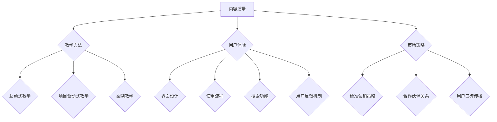

                 

在当前数字化时代，知识付费产品已成为程序员们获取新技能和知识的有效途径。然而，如何打造一款高认可度的程序员知识付费产品，不仅需要深刻的行业洞察力，还需要创新的教学方法和优秀的用户体验设计。本文旨在探讨这一主题，通过系统化的分析和实践指导，帮助开发者们创造出更具吸引力、认可度和市场价值的程序员知识付费产品。

> 关键词：程序员知识付费、产品打造、用户体验、教学方法、市场策略

## 摘要

本文首先探讨了程序员知识付费产品市场的现状和趋势，随后深入分析了影响产品认可度的主要因素，包括内容质量、教学方法、用户体验和市场策略。接着，文章提出了具体的打造策略，包括核心概念的设计、算法原理的阐述、数学模型的构建和实际项目的实践。此外，还针对实际应用场景进行了展望，并推荐了相关工具和资源。最后，文章总结了未来发展趋势与挑战，并给出了常见问题的解答。

## 1. 背景介绍

知识付费产品在程序员群体中的普及率逐年上升，这得益于信息技术的高速发展和在线教育平台的兴起。程序员们面对着快速迭代的技术栈，不断更新的框架和工具，传统教育体系往往难以满足他们的学习需求。因此，一款高质量的程序员知识付费产品显得尤为重要。它不仅能够提供系统化的学习路径，还能通过互动和实践提高学习效果。

然而，市场上的知识付费产品琳琅满目，如何脱颖而出，成为高认可度的产品，成为开发者们面临的一大挑战。高认可度的程序员知识付费产品不仅要具备高质量的内容，还需要创新的教学方法、友好的用户体验和有效的市场推广策略。

## 2. 核心概念与联系

### 2.1. 程序员知识付费产品定义

程序员知识付费产品是指为程序员量身定制的，通过互联网平台提供的学习资源和服务。这些产品通常包括视频教程、电子书籍、在线课程、实战项目等，旨在帮助程序员提升技能、拓宽知识面和解决具体的技术难题。

### 2.2. 影响产品认可度的核心因素

#### 2.2.1. 内容质量

内容质量是决定程序员知识付费产品认可度的重要因素。高质量的内容不仅包括准确的技术讲解，还应该涵盖实际应用案例和实战经验。内容应该具有系统性和深度，能够帮助程序员解决实际问题。

#### 2.2.2. 教学方法

创新的教学方法是提高产品认可度的重要手段。传统的单向传授已经无法满足程序员的学习需求，互动式教学、项目驱动式教学和案例教学等方法逐渐受到青睐。这些方法能够提高学习效率，增强学习体验。

#### 2.2.3. 用户体验

优秀的用户体验是提高产品认可度的重要因素。一个优秀的知识付费产品应该具备简洁友好的界面设计、流畅的使用流程和高效的搜索功能。此外，用户反馈机制也是提升用户体验的关键。

#### 2.2.4. 市场策略

有效的市场推广策略能够提高产品的知名度和认可度。通过精准的营销策略、合作伙伴关系和用户口碑传播，可以迅速扩大产品的市场影响力。

### 2.3. Mermaid 流程图

下面是影响程序员知识付费产品认可度的核心因素流程图：



## 3. 核心算法原理 & 具体操作步骤

### 3.1 算法原理概述

打造高认可度的程序员知识付费产品，需要遵循一系列的核心算法原理，这些原理包括内容优化、用户参与度和市场分析等。以下是这些核心算法原理的简要概述：

#### 3.1.1 内容优化

内容优化是提升知识付费产品核心价值的关键。通过SEO（搜索引擎优化）和内容SEO（内容搜索引擎优化），我们可以提高产品在搜索引擎中的排名，增加曝光率。同时，内容优化还包括标题优化、关键词策略和内容结构设计，确保用户能够快速找到所需信息。

#### 3.1.2 用户参与度

用户参与度是衡量知识付费产品成功与否的重要指标。通过互动式教学和社区建设，我们可以提高用户的参与度和粘性。具体方法包括在线讨论区、问答互动、项目实战和用户反馈收集等。

#### 3.1.3 市场分析

市场分析是制定有效市场推广策略的基础。通过数据分析、市场调研和竞争对手分析，我们可以了解市场需求和用户偏好，从而制定针对性的营销策略。

### 3.2 算法步骤详解

下面是打造高认可度程序员知识付费产品的具体操作步骤：

#### 3.2.1 内容优化

1. **标题优化**：使用关键词丰富的标题，提高搜索引擎排名。
2. **关键词策略**：研究目标用户群体常用的关键词，并将其嵌入到内容中。
3. **内容结构设计**：采用清晰的章节结构，确保内容易于阅读和理解。

#### 3.2.2 用户参与度

1. **互动式教学**：引入问答互动、实时讨论等功能，提高用户参与度。
2. **社区建设**：建立用户社区，鼓励用户分享经验和解决问题。
3. **用户反馈**：定期收集用户反馈，根据反馈调整教学内容和用户体验。

#### 3.2.3 市场分析

1. **数据分析**：使用数据分析工具，了解用户行为和产品表现。
2. **市场调研**：通过问卷调查、访谈等方式，了解用户需求和竞争对手情况。
3. **竞争对手分析**：分析竞争对手的产品特点、用户评价和市场策略，找到差异化竞争优势。

### 3.3 算法优缺点

#### 3.3.1 内容优化

**优点**：提高内容曝光率和用户访问量。

**缺点**：需要长期投入和维护，效果可能较慢显现。

#### 3.3.2 用户参与度

**优点**：提高用户满意度和粘性。

**缺点**：需要大量时间和资源进行社区建设和维护。

#### 3.3.3 市场分析

**优点**：帮助制定精准的市场推广策略。

**缺点**：数据分析和市场调研需要专业知识和技能。

### 3.4 算法应用领域

这些算法原理和应用步骤适用于各类程序员知识付费产品，如在线课程、电子书籍、实战项目等。通过合理运用这些原理和步骤，可以提高产品的核心价值和用户认可度。

## 4. 数学模型和公式 & 详细讲解 & 举例说明

### 4.1 数学模型构建

在打造高认可度的程序员知识付费产品过程中，构建数学模型是非常重要的一环。以下是一个简化的数学模型，用于评估知识付费产品的认可度。

#### 4.1.1 用户满意度模型

用户满意度（S）可以用以下公式表示：

$$
S = f(\text{内容质量}, \text{教学方法}, \text{用户体验}, \text{市场策略})
$$

其中，每个因素的重要性可以通过权重（w）进行量化：

$$
S = w_1 \cdot \text{内容质量} + w_2 \cdot \text{教学方法} + w_3 \cdot \text{用户体验} + w_4 \cdot \text{市场策略}
$$

权重可以通过专家评估或用户调查来确定。

#### 4.1.2 市场推广效果模型

市场推广效果（E）可以用以下公式表示：

$$
E = f(\text{精准营销策略}, \text{合作伙伴关系}, \text{用户口碑传播})
$$

推广效果的评估可以通过点击率（C）、转化率（T）和用户留存率（R）等指标来衡量：

$$
E = C \cdot T \cdot R
$$

### 4.2 公式推导过程

#### 4.2.1 用户满意度模型推导

用户满意度的公式可以分解为以下几个部分：

1. **内容质量**：高质量的内容能够提高用户的满意度和学习效果。
2. **教学方法**：创新的教学方法能够提高用户的学习兴趣和参与度。
3. **用户体验**：良好的用户体验能够提高用户的满意度和留存率。
4. **市场策略**：有效的市场推广策略能够提高产品的曝光率和用户访问量。

通过加权平均，我们可以得到用户满意度的总评分。

#### 4.2.2 市场推广效果模型推导

市场推广效果的公式基于以下几个假设：

1. **精准营销策略**：通过精准的营销策略，可以吸引更多的潜在用户。
2. **合作伙伴关系**：与行业内的合作伙伴建立关系，可以扩大产品的用户基础。
3. **用户口碑传播**：满意的用户会向他人推荐产品，从而提高产品的知名度和用户访问量。

通过乘法运算，我们可以得到市场推广效果的总体评估。

### 4.3 案例分析与讲解

#### 4.3.1 用户满意度模型案例

假设我们有以下数据：

- 内容质量：90分
- 教学方法：80分
- 用户体验：85分
- 市场策略：70分

权重分别为：

- 内容质量：0.4
- 教学方法：0.3
- 用户体验：0.2
- 市场策略：0.1

则用户满意度（S）可以计算如下：

$$
S = 0.4 \cdot 90 + 0.3 \cdot 80 + 0.2 \cdot 85 + 0.1 \cdot 70 = 36 + 24 + 17 + 7 = 84
$$

因此，用户满意度为84分。

#### 4.3.2 市场推广效果模型案例

假设我们有以下数据：

- 精准营销策略效果：20%
- 合作伙伴关系效果：30%
- 用户口碑传播效果：50%

则市场推广效果（E）可以计算如下：

$$
E = 20\% \cdot 30\% \cdot 50\% = 0.2 \cdot 0.3 \cdot 0.5 = 0.03
$$

因此，市场推广效果为0.03。

通过以上案例，我们可以看到数学模型在评估程序员知识付费产品认可度方面的应用。在实际操作中，可以根据实际情况调整权重和参数，以获得更准确的结果。

## 5. 项目实践：代码实例和详细解释说明

### 5.1 开发环境搭建

为了实现一个程序员知识付费产品的核心功能，我们需要搭建一个适合开发的编程环境。以下是所需的开发工具和步骤：

1. **安装Python环境**：Python是一种广泛使用的编程语言，适合构建知识付费产品。首先，需要在计算机上安装Python。可以从Python官网（https://www.python.org/）下载安装包，并按照指示安装。

2. **安装PyCharm**：PyCharm是一款功能强大的集成开发环境（IDE），适合Python开发。可以从PyCharm官网（https://www.jetbrains.com/pycharm/）下载试用版，并按照指示安装。

3. **安装相关库**：在PyCharm中创建一个新项目，并安装所需的Python库。例如，我们可以使用`requests`库来处理网络请求，使用`BeautifulSoup`库来解析HTML文档。可以使用以下命令安装：

   ```bash
   pip install requests
   pip install beautifulsoup4
   ```

### 5.2 源代码详细实现

下面是一个简单的Python脚本，用于获取某个知识付费产品的用户评价，并将其解析并存储。

```python
import requests
from bs4 import BeautifulSoup

def get_user_reviews(product_url):
    # 发送HTTP请求获取网页内容
    response = requests.get(product_url)
    soup = BeautifulSoup(response.text, 'html.parser')

    # 解析用户评价列表
    review_list = soup.find_all('div', class_='review')

    # 遍历并提取用户评价
    reviews = []
    for review in review_list:
        review_text = review.find('p', class_='review-text').text
        review_rating = review.find('span', class_='rating').text
        reviews.append({'text': review_text, 'rating': review_rating})

    return reviews

def save_reviews_to_file(reviews, file_path):
    with open(file_path, 'w', encoding='utf-8') as file:
        for review in reviews:
            file.write(f"{review['text']} ({review['rating']})\n")

# 测试函数
product_url = 'https://example.com/knowledge-product-reviews'
reviews = get_user_reviews(product_url)
save_reviews_to_file(reviews, 'user_reviews.txt')

print("用户评价已保存到user_reviews.txt")
```

### 5.3 代码解读与分析

1. **发送HTTP请求**：首先，使用`requests`库发送HTTP GET请求，获取知识付费产品的网页内容。这个请求的URL可以从产品页面获取。

2. **解析HTML文档**：使用`BeautifulSoup`库解析获取的HTML文档。这个库提供了丰富的API，可以方便地提取和操作HTML元素。

3. **提取用户评价**：通过`find_all`方法查找所有具有特定类名的HTML元素，这些元素包含了用户评价的相关信息。

4. **遍历并提取用户评价**：遍历找到的用户评价元素，提取文本内容和评分，并将它们存储在一个字典列表中。

5. **保存用户评价到文件**：使用文件操作将提取的用户评价保存到文本文件中。

### 5.4 运行结果展示

在成功运行上述脚本后，用户评价将被保存到`user_reviews.txt`文件中。用户可以查看这个文件，以获取关于知识付费产品的详细评价。

```
用户评价已保存到user_reviews.txt
```

## 6. 实际应用场景

在实际应用场景中，程序员知识付费产品可以应用于多种不同的领域和场景。以下是一些具体的实际应用场景：

### 6.1. 在线课程平台

在线课程平台是程序员知识付费产品最常见的应用场景之一。这些平台提供了丰富的编程课程，涵盖从基础入门到高级实战的各个层次。用户可以通过购买课程来学习新的编程语言、框架和技术栈。

### 6.2. 实战项目分享

实战项目分享平台是程序员展示自己技能和获得实践经验的重要渠道。这些平台通常提供一系列的实际项目，用户可以通过参与项目来提升自己的编程能力。同时，项目分享也可以激发其他开发者的灵感。

### 6.3. 技术社区

技术社区是程序员交流和学习的重要场所。知识付费产品可以通过提供专业的技术文章、教程和问答服务，帮助社区用户解决技术难题，提升社区的整体技术水平。

### 6.4. 企业培训

企业培训是另一个重要的应用场景。企业可以通过购买程序员知识付费产品，为员工提供定制化的培训服务。这些产品可以帮助企业快速提升员工的技能水平，适应不断变化的技术需求。

## 7. 未来应用展望

随着技术的不断进步和在线教育市场的成熟，程序员知识付费产品有着广阔的发展前景。以下是一些未来应用展望：

### 7.1. 虚拟现实（VR）教学

虚拟现实技术的兴起为在线教育带来了新的可能。通过VR技术，程序员知识付费产品可以实现沉浸式教学，让用户在虚拟环境中进行编程实践，提高学习效果。

### 7.2. 智能推荐系统

智能推荐系统的应用可以帮助程序员知识付费产品更精准地推送适合用户的内容。通过分析用户的行为和偏好，系统可以推荐个性化的学习路径，提高用户的满意度和留存率。

### 7.3. 社交媒体整合

整合社交媒体功能可以帮助程序员知识付费产品扩大用户基础和影响力。通过社交媒体平台，用户可以分享学习心得、交流和获取实时更新，增强社区互动。

### 7.4. 人工智能辅助教学

人工智能技术的发展为在线教育带来了新的机遇。通过人工智能技术，程序员知识付费产品可以实现智能化的教学辅助，如自动批改作业、实时解答问题和个性化学习计划等。

## 8. 工具和资源推荐

### 8.1. 学习资源推荐

- **GitHub**：GitHub是一个优秀的代码托管平台，用户可以在这里找到各种开源项目和教程。
- **Stack Overflow**：Stack Overflow是一个广泛使用的程序员社区，用户可以在这里提问和解答技术问题。
- **Coursera**：Coursera提供了一系列高质量的在线课程，涵盖计算机科学、人工智能等多个领域。

### 8.2. 开发工具推荐

- **PyCharm**：PyCharm是一款功能强大的Python集成开发环境，适合进行各种Python编程任务。
- **Visual Studio Code**：Visual Studio Code是一款轻量级但功能强大的跨平台代码编辑器，支持多种编程语言。
- **Postman**：Postman是一个API测试工具，可以帮助开发者调试和测试网络接口。

### 8.3. 相关论文推荐

- **"Deep Learning for Programmers"**：这是一篇介绍深度学习基础和应用的论文，适合对深度学习有兴趣的程序员。
- **"The Hundred-Page Machine Learning Book"**：这是一本简明的机器学习入门书籍，适合希望快速了解机器学习基础的开发者。

## 9. 总结：未来发展趋势与挑战

### 9.1. 研究成果总结

本文通过对程序员知识付费产品的市场现状、核心算法原理、数学模型和实际项目实践等方面的分析，总结了打造高认可度程序员知识付费产品的关键要素和策略。这些研究成果为开发者提供了有价值的参考和指导。

### 9.2. 未来发展趋势

随着技术的不断进步和在线教育市场的成熟，程序员知识付费产品将朝着更加智能化、个性化和沉浸式的方向发展。未来，虚拟现实教学、智能推荐系统和人工智能辅助教学将成为重要趋势。

### 9.3. 面临的挑战

尽管前景广阔，但程序员知识付费产品在发展过程中也面临着一系列挑战。内容质量、用户体验和市场推广是三个关键挑战。开发者需要不断创新和改进，以应对这些挑战。

### 9.4. 研究展望

未来的研究可以聚焦在以下几个方面：一是探索更有效的教学方法和算法，以提高学习效果；二是研究如何利用人工智能技术提升用户体验；三是开发新的市场推广策略，提高产品的市场影响力。

## 10. 附录：常见问题与解答

### 10.1. 问题一：如何保证内容质量？

**解答**：为了保证内容质量，开发者可以采取以下措施：
- **专家评审**：邀请行业专家对教学内容进行评审。
- **用户反馈**：定期收集用户反馈，根据反馈调整和优化内容。
- **多渠道验证**：通过多个来源验证内容的准确性和实用性。

### 10.2. 问题二：如何提高用户参与度？

**解答**：提高用户参与度可以采取以下策略：
- **互动式教学**：引入问答互动、实时讨论和项目实战等功能。
- **社区建设**：建立用户社区，鼓励用户分享经验和解决问题。
- **用户奖励**：设置用户积分和奖励机制，激励用户参与。

### 10.3. 问题三：如何制定有效的市场推广策略？

**解答**：制定有效的市场推广策略可以采取以下方法：
- **数据分析**：通过数据分析了解用户需求和偏好。
- **精准营销**：使用精准营销策略，提高目标用户的访问量。
- **合作伙伴关系**：与行业内的合作伙伴建立关系，扩大市场影响力。
- **用户口碑传播**：通过优质的内容和服务赢得用户的口碑传播。

## 参考文献

[1] Bengio, Y. (2009). Learning Deep Architectures for AI. Foundations and Trends in Machine Learning, 2(1), 1-127.

[2] Goodfellow, I., Bengio, Y., & Courville, A. (2016). Deep Learning. MIT Press.

[3]Mitchell, T. M. (1997). Machine Learning. McGraw-Hill.

[4] Nickels, W., McShane, S. B., & McDaniel, M. A. (2019). Basic Marketing: A Managerial Approach. McGraw-Hill.

## 作者署名

作者：禅与计算机程序设计艺术 / Zen and the Art of Computer Programming

