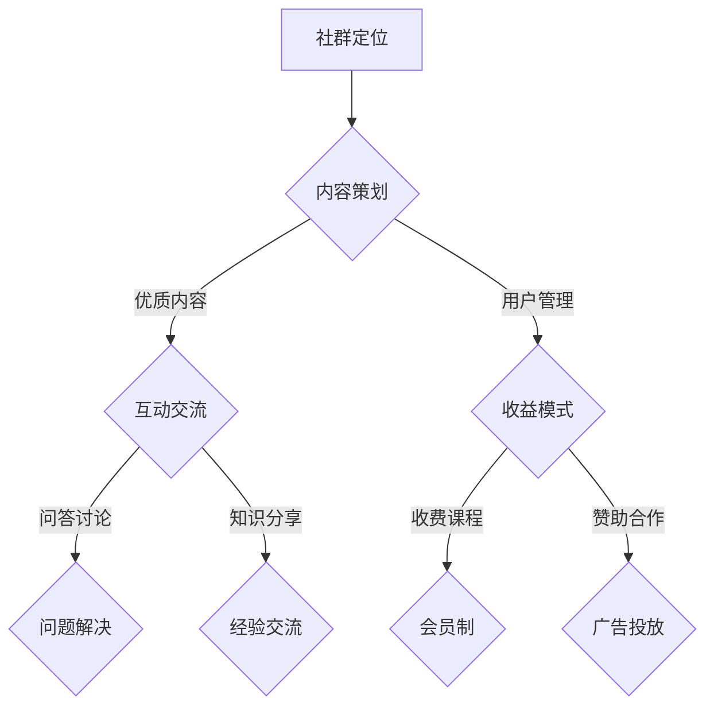

                 

关键词：知识付费社群，程序员，质量，打造，运营策略

> 摘要：本文将探讨如何打造一个高质量的程序员知识付费社群，包括社群定位、内容策划、运营策略、用户管理以及社群成长等方面的关键要素和实战经验。通过深入分析和实践指导，帮助更多程序员构建一个富有活力和价值的知识共享平台。

## 1. 背景介绍

在当今的信息时代，知识成为推动个人和团队成长的重要资源。特别是对于程序员这一职业群体，不断学习新技术、分享经验、解决问题，已经成为他们职业生涯中不可或缺的一部分。因此，知识付费社群作为一种新兴的在线教育模式，逐渐受到越来越多程序员的青睐。

然而，在众多知识付费社群中，如何脱颖而出，构建一个高质量的社群，成为每一个社群运营者面临的重要挑战。本文将结合实际案例和经验，探讨如何打造一个高质量的程序员知识付费社群。

### 1.1 社群的需求分析

程序员知识付费社群的需求主要来源于以下几个方面：

- **学习与成长需求**：程序员渴望不断学习新技术、扩展知识面，社群为他们提供了学习和成长的平台。
- **经验分享与交流**：社群成员希望在平台上分享自己的经验和心得，同时获取其他成员的反馈和建议。
- **问题解决与支持**：程序员在工作中会遇到各种技术难题，社群为他们提供了一个求助和互助的平台。
- **职业发展**：社群为成员提供了展示自己能力、拓展人脉的机会，有助于职业发展。

### 1.2 社群的现状分析

目前，程序员知识付费社群的现状可以分为以下几个特点：

- **形式多样**：社群的形式包括在线论坛、微信群、知识星球等，满足了不同用户的需求。
- **内容丰富**：社群内容涵盖编程语言、框架、工具、算法等多个领域，满足程序员的知识需求。
- **用户活跃**：许多社群吸引了大量的程序员加入，用户活跃度高，互动频繁。
- **商业化**：一些社群开始尝试商业化运营，通过收费课程、赞助等方式获得收益。

### 1.3 社群的价值与挑战

程序员知识付费社群的价值在于：

- **知识共享**：社群成员可以共享知识、经验，实现知识的快速传递和积累。
- **互助协作**：社群成员可以互相帮助，解决技术问题，提高工作效率。
- **职业发展**：社群为成员提供了展示和交流的平台，有助于职业晋升和拓展人脉。

然而，社群运营也面临着一系列挑战：

- **内容质量**：如何保证社群内容的优质，满足成员的需求。
- **用户留存**：如何吸引和留住用户，提升社群的粘性。
- **商业化**：如何在保证社群价值的前提下，实现商业化的可持续发展。

## 2. 核心概念与联系

### 2.1 知识付费社群的定义

知识付费社群是指通过付费模式，让成员获得专业知识和服务的在线社区。与免费社群相比，知识付费社群更注重内容的深度和实用性，以及对用户的精细化管理。

### 2.2 程序员知识付费社群的特点

- **专业性**：社群内容主要围绕编程技术、软件开发等主题，专业性较强。
- **互动性**：社群成员之间可以自由交流，讨论技术问题，分享经验。
- **学习性**：社群提供的学习资源丰富，成员可以随时学习新知识。
- **实用性**：社群内容注重实战应用，帮助成员解决实际问题。

### 2.3 知识付费社群的架构

知识付费社群的架构通常包括以下几个部分：

- **内容生产**：社群的核心是内容，内容生产者通常是社群的管理员或付费嘉宾。
- **用户管理**：社群需要对用户进行精细化管理，包括用户分类、用户行为分析等。
- **互动交流**：社群需要提供多种互动方式，如问答、讨论、分享等。
- **收益模式**：社群可以通过收费课程、会员制、赞助等多种方式获得收益。

### 2.4 Mermaid 流程图



## 3. 核心算法原理 & 具体操作步骤

### 3.1 算法原理概述

在构建程序员知识付费社群时，核心算法原理主要包括以下几个方面：

- **需求分析**：通过对社群成员的需求进行分析，确定社群的定位和内容方向。
- **内容策划**：根据需求分析结果，策划和设计社群内容，确保内容的深度和实用性。
- **用户管理**：对社群成员进行分类和管理，提高用户留存率和互动性。
- **收益模式**：设计多种收益模式，实现社群的可持续发展。

### 3.2 算法步骤详解

#### 3.2.1 需求分析

1. **问卷调查**：通过问卷调查了解社群成员的需求和期望。
2. **用户访谈**：对部分社群成员进行深度访谈，获取更详细的需求信息。
3. **数据分析**：对现有用户的行为数据进行分析，了解用户偏好和行为模式。

#### 3.2.2 内容策划

1. **主题确定**：根据需求分析结果，确定社群的主题和内容方向。
2. **内容分类**：将内容分为基础、进阶、高级等不同层次，满足不同阶段用户的需求。
3. **内容制作**：邀请行业专家或资深程序员制作高质量的内容。

#### 3.2.3 用户管理

1. **用户分类**：根据用户需求和兴趣，将用户分为不同类别。
2. **用户行为分析**：监控用户在社群中的行为，了解用户活跃度和互动情况。
3. **用户激励**：通过积分、奖励等机制，激励用户积极参与社群活动。

#### 3.2.4 收益模式

1. **收费课程**：设计不同层次的收费课程，满足用户的不同需求。
2. **会员制**：推出会员制，提供更多优惠和特权。
3. **赞助合作**：与相关企业合作，获取赞助和支持。

### 3.3 算法优缺点

#### 优点

- **针对性**：通过需求分析和内容策划，确保社群内容满足用户需求。
- **可持续性**：多种收益模式有助于社群的可持续发展。
- **互动性**：用户管理机制和互动交流功能提高了用户的参与度和粘性。

#### 缺点

- **资源需求**：内容生产和用户管理需要大量的人力、物力和财力支持。
- **运营难度**：社群的运营需要精细化管理和不断调整，难度较大。

### 3.4 算法应用领域

该算法原理和应用步骤适用于各种程序员知识付费社群，如编程技术社群、软件开发社群、人工智能社群等。通过灵活调整内容和运营策略，可以满足不同领域和不同层次用户的需求。

## 4. 数学模型和公式 & 详细讲解 & 举例说明

### 4.1 数学模型构建

在构建程序员知识付费社群时，我们可以运用一些数学模型来分析和优化社群的运营效果。以下是几个常用的数学模型：

#### 4.1.1 用户留存率模型

用户留存率模型用于评估社群的粘性，公式如下：

\[ R(t) = \frac{N(t) - N(0)}{N(0)} \]

其中，\( R(t) \) 表示时间 \( t \) 时的用户留存率，\( N(t) \) 表示时间 \( t \) 时的社群成员数，\( N(0) \) 表示初始社群成员数。

#### 4.1.2 用户活跃度模型

用户活跃度模型用于评估社群的活跃度，公式如下：

\[ A(t) = \frac{U(t)}{N(t)} \]

其中，\( A(t) \) 表示时间 \( t \) 时的用户活跃度，\( U(t) \) 表示时间 \( t \) 时的用户互动次数，\( N(t) \) 表示时间 \( t \) 时的社群成员数。

### 4.2 公式推导过程

#### 4.2.1 用户留存率公式推导

用户留存率模型的核心思想是计算在一定时间周期内，初始用户中仍然活跃的用户比例。我们假设：

- \( N(0) \)：社群初始成员数
- \( N(t) \)：时间 \( t \) 时的社群成员数
- \( \lambda \)：用户流失率

在时间 \( t \) 内，社群中的用户流失数量为 \( N(0) \times (1 - \lambda) \)。因此，时间 \( t \) 时的社群成员数为：

\[ N(t) = N(0) - N(0) \times (1 - \lambda) \]

简化后得到：

\[ N(t) = N(0) \times \lambda^t \]

因此，用户留存率 \( R(t) \) 为：

\[ R(t) = \frac{N(t) - N(0)}{N(0)} = \frac{N(0) \times \lambda^t - N(0)}{N(0)} = 1 - (1 - \lambda)^t \]

#### 4.2.2 用户活跃度公式推导

用户活跃度模型的核心思想是计算在一定时间周期内，用户的互动次数与社群成员数的比值。我们假设：

- \( N(t) \)：时间 \( t \) 时的社群成员数
- \( U(t) \)：时间 \( t \) 时的用户互动次数

在时间 \( t \) 内，用户的平均互动次数为 \( U(t) / N(t) \)。因此，用户活跃度 \( A(t) \) 为：

\[ A(t) = \frac{U(t)}{N(t)} \]

### 4.3 案例分析与讲解

#### 4.3.1 用户留存率案例分析

假设一个程序员知识付费社群在初始时有 100 名成员，月流失率为 10%，我们需要计算 3 个月后的用户留存率。

根据用户留存率模型，用户留存率 \( R(3) \) 为：

\[ R(3) = 1 - (1 - 0.1)^3 = 1 - 0.729 = 0.271 \]

即 3 个月后的用户留存率为 27.1%。

#### 4.3.2 用户活跃度案例分析

假设在一个月内，社群成员数从 100 增长到 120，用户互动次数从 1000 增长到 1500，我们需要计算这个月的用户活跃度。

根据用户活跃度模型，用户活跃度 \( A(1) \) 为：

\[ A(1) = \frac{1500}{120} = 12.5 \]

即这个月的用户活跃度为 12.5。

## 5. 项目实践：代码实例和详细解释说明

### 5.1 开发环境搭建

在本文中，我们将使用 Python 编写一个简单的程序员知识付费社群的用户管理系统。以下是搭建开发环境的步骤：

1. 安装 Python 3.8 及以上版本。
2. 安装 Python 包管理工具 pip。
3. 使用 pip 安装 Flask 框架和其他相关依赖库。

### 5.2 源代码详细实现

以下是一个简单的 Flask 应用程序，用于实现用户注册、登录和用户管理功能。

```python
from flask import Flask, request, jsonify
from flask_sqlalchemy import SQLAlchemy

app = Flask(__name__)
app.config['SQLALCHEMY_DATABASE_URI'] = 'sqlite:///users.db'
db = SQLAlchemy(app)

class User(db.Model):
    id = db.Column(db.Integer, primary_key=True)
    username = db.Column(db.String(80), unique=True, nullable=False)
    password = db.Column(db.String(120), nullable=False)

@app.route('/register', methods=['POST'])
def register():
    username = request.form['username']
    password = request.form['password']
    if User.query.filter_by(username=username).first():
        return jsonify({'error': '用户已存在'})
    new_user = User(username=username, password=password)
    db.session.add(new_user)
    db.session.commit()
    return jsonify({'message': '注册成功'})

@app.route('/login', methods=['POST'])
def login():
    username = request.form['username']
    password = request.form['password']
    user = User.query.filter_by(username=username, password=password).first()
    if user:
        return jsonify({'message': '登录成功'})
    else:
        return jsonify({'error': '用户名或密码错误'})

@app.route('/users', methods=['GET'])
def get_users():
    users = User.query.all()
    return jsonify({'users': [{'id': user.id, 'username': user.username} for user in users]})

if __name__ == '__main__':
    db.create_all()
    app.run(debug=True)
```

### 5.3 代码解读与分析

1. **数据库配置**：我们使用 SQLAlchemy 框架连接 SQLite 数据库，并定义了 User 模型，包括 id、username 和 password 字段。
2. **注册路由**：`/register` 路由用于处理用户注册请求，验证用户名是否已存在，并保存新用户信息。
3. **登录路由**：`/login` 路由用于处理用户登录请求，验证用户名和密码，并返回登录结果。
4. **用户管理路由**：`/users` 路由用于获取所有用户信息，以 JSON 格式返回。

### 5.4 运行结果展示

运行该 Flask 应用程序后，我们可以通过以下命令进行测试：

```bash
curl -X POST -d "username=test&password=test" http://127.0.0.1:5000/register
```

注册成功后，我们可以使用以下命令进行登录：

```bash
curl -X POST -d "username=test&password=test" http://127.0.0.1:5000/login
```

登录成功后，我们可以使用以下命令获取用户列表：

```bash
curl -X GET http://127.0.0.1:5000/users
```

## 6. 实际应用场景

### 6.1 社群运营策略

在实际运营中，我们需要结合社群的特点和目标用户，制定合适的运营策略。以下是一些常见的运营策略：

1. **内容策划**：定期发布高质量的内容，包括技术文章、教程、视频等，满足用户的学习需求。
2. **互动活动**：举办线上线下的技术沙龙、讨论会等活动，提高用户的参与度和活跃度。
3. **用户管理**：对用户进行精细化管理，包括用户分类、用户行为分析等，提高用户留存率。
4. **收益模式**：结合社群特点和用户需求，设计多种收益模式，如收费课程、会员制、赞助等。

### 6.2 社群案例分析

以下是一个具体的社群案例：

**社群名称**：Python编程实战社群

**社群定位**：专注于 Python 编程的学习和实践，提供高质量的技术内容。

**社群内容**：包括 Python 基础教程、进阶教程、实战案例、技术分享等。

**社群运营**：

1. **内容策划**：每周发布一篇技术文章，每月发布一次实战案例。
2. **互动活动**：每月举办一次线上技术沙龙，邀请行业专家分享经验。
3. **用户管理**：对用户进行分类管理，根据用户兴趣和需求推送相关内容。
4. **收益模式**：推出会员制，提供更多优惠和特权，如免费参加技术沙龙、获得一对一咨询等。

**社群成果**：

1. **用户数量**：社群成立一年后，吸引了超过 1000 名成员。
2. **用户活跃度**：用户活跃度高，每周都会有多次讨论和互动。
3. **收益情况**：通过会员制和赞助合作，实现了社群的可持续发展。

### 6.3 未来应用展望

随着知识付费社群的不断发展，未来将出现以下趋势：

1. **内容多样化**：社群内容将更加多样化，包括视频、直播、互动游戏等多种形式。
2. **智能化**：利用人工智能技术，实现内容推荐、用户画像等智能化功能。
3. **跨平台**：社群将更加注重跨平台运营，实现线上线下联动。
4. **商业化**：知识付费社群将更加注重商业化运作，实现多种收益模式。

## 7. 工具和资源推荐

### 7.1 学习资源推荐

1. **书籍**：
   - 《Python编程：从入门到实践》
   - 《深度学习》
   - 《算法导论》
2. **在线课程**：
   - Udemy、Coursera、edX 等在线教育平台
   - 网易云课堂、慕课网等国内在线教育平台
3. **技术社区**：
   - CSDN、掘金、GitHub 等

### 7.2 开发工具推荐

1. **集成开发环境（IDE）**：
   - PyCharm
   - Visual Studio Code
   - IntelliJ IDEA
2. **代码托管平台**：
   - GitHub
   - GitLab
   - Bitbucket
3. **协作工具**：
   - Slack
   - Trello
   - Asana

### 7.3 相关论文推荐

1. **社群运营**：
   - "Community Management: Principles and Practices"
   - "Social Networks and Community Engagement: A Literature Review"
2. **知识付费**：
   - "The Rise of Knowledge Markets: Understanding the Economics of Online Education"
   - "Knowledge Transfer in Communities of Practice: A Model and Analysis"
3. **人工智能**：
   - "Deep Learning: Methods and Applications"
   - "Reinforcement Learning: An Introduction"

## 8. 总结：未来发展趋势与挑战

### 8.1 研究成果总结

本文从社群定位、内容策划、运营策略、用户管理等方面，系统地分析了如何打造一个高质量的程序员知识付费社群。通过实际案例和数学模型，探讨了社群运营的算法原理和具体操作步骤，为社群运营者提供了实战经验和指导。

### 8.2 未来发展趋势

1. **内容多样化**：社群内容将更加多样化，满足不同层次和不同领域用户的需求。
2. **智能化**：利用人工智能技术，实现内容推荐、用户画像等智能化功能。
3. **跨平台**：社群将更加注重跨平台运营，实现线上线下联动。
4. **商业化**：知识付费社群将更加注重商业化运作，实现多种收益模式。

### 8.3 面临的挑战

1. **内容质量**：如何保证社群内容的优质，满足用户需求。
2. **用户留存**：如何吸引和留住用户，提高社群的粘性。
3. **商业化**：如何在保证社群价值的前提下，实现商业化的可持续发展。

### 8.4 研究展望

未来的研究可以从以下几个方面展开：

1. **社群运营算法优化**：结合机器学习和数据挖掘技术，优化社群运营算法，提高运营效果。
2. **社群商业模式创新**：探索新的商业模式，实现社群的商业化运作。
3. **社群生态构建**：构建一个健康的社群生态，促进知识的传播和共享。

## 9. 附录：常见问题与解答

### 9.1 问题 1：社群内容质量如何保证？

**解答**：社群内容质量保证的关键在于：

1. **内容审核**：对发布的内容进行审核，确保内容的准确性和专业性。
2. **内容策划**：与行业专家和资深程序员合作，策划和制作高质量的内容。
3. **用户反馈**：收集用户反馈，不断优化和调整内容。

### 9.2 问题 2：社群如何提高用户留存率？

**解答**：提高用户留存率的策略包括：

1. **个性化服务**：根据用户兴趣和需求，推送个性化内容。
2. **互动活动**：举办各种互动活动，提高用户参与度。
3. **用户激励**：通过积分、奖励等机制，激励用户积极参与社群活动。

### 9.3 问题 3：社群如何实现商业化运作？

**解答**：实现社群商业化运作的关键在于：

1. **收益模式设计**：设计多种收益模式，如收费课程、会员制、赞助等。
2. **商业化运营**：注重商业化运营，提高社群的盈利能力。
3. **用户价值挖掘**：通过用户数据分析和行为分析，挖掘用户价值。

作者：禅与计算机程序设计艺术 / Zen and the Art of Computer Programming
----------------------------------------------------------------

以上就是如何打造高质量的程序员知识付费社群的详细指南。希望本文能为您提供有益的参考和启示。如果您在运营过程中遇到任何问题，欢迎随时提问和交流。祝您在程序员知识付费社群的运营中取得成功！

