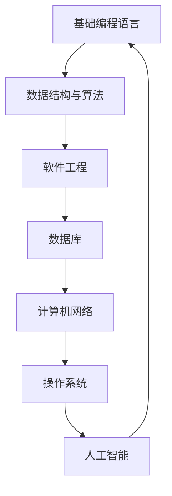
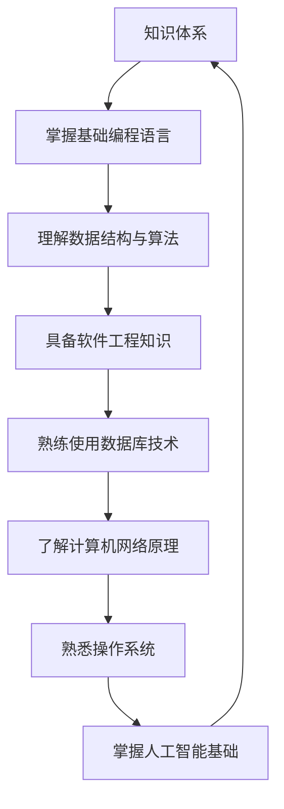
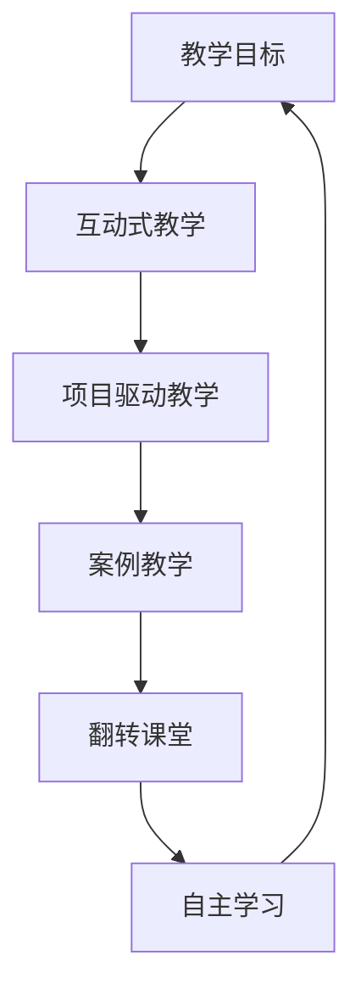
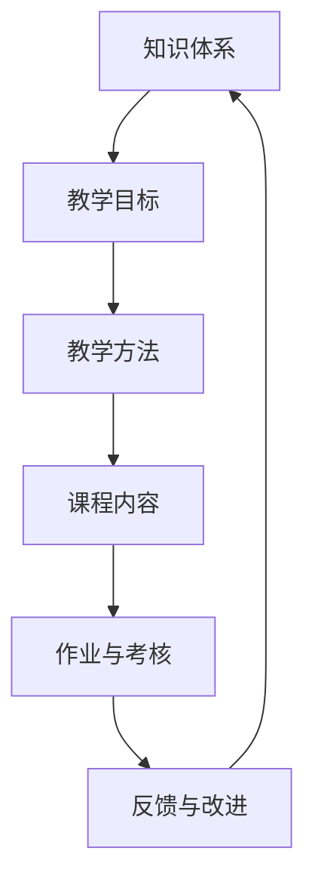

                 

### 引言 Introduction

在信息技术飞速发展的今天，程序员知识课程的设计与传播变得尤为重要。随着在线教育平台的兴起，越来越多的程序员希望通过在线课程提升自己的技能。然而，如何打造出高转化的程序员知识课程，即不仅能够吸引学员，还能保证学员的学习效果和知识转化率，成为教育工作者和课程开发者共同关注的课题。

本文旨在探讨如何通过系统化的方法和策略，打造出一套高转化的程序员知识课程。文章将围绕以下核心主题展开：

1. **背景介绍**：阐述当前程序员知识课程的发展现状与挑战。
2. **核心概念与联系**：介绍课程设计的核心概念，并使用Mermaid流程图展示课程架构。
3. **核心算法原理与具体操作步骤**：详细解析课程中的核心算法，提供操作步骤和优缺点分析。
4. **数学模型和公式**：构建数学模型，推导公式，并通过案例进行讲解。
5. **项目实践**：提供实际代码实例，详细解读并展示运行结果。
6. **实际应用场景**：探讨课程在实际工作中的应用，以及未来的应用前景。
7. **工具和资源推荐**：推荐学习资源和开发工具。
8. **总结**：总结研究成果，探讨未来发展趋势与挑战。

通过本文的探讨，希望能够为程序员知识课程的设计和开发提供有益的参考和启示。

## 1. 背景介绍

程序员知识课程的发展可以追溯到20世纪中叶，随着计算机技术的普及和互联网的兴起，程序员教育逐渐从传统的面对面授课转向在线教育。早期的程序员课程主要集中在基础编程语言和算法上，如C语言、数据结构与算法等。然而，随着软件工程领域的不断扩展，课程内容逐渐丰富，涵盖了操作系统、计算机网络、数据库、人工智能等多个方面。

当前，程序员知识课程的发展面临着诸多挑战。首先，课程内容的更新速度远不及技术发展的速度，导致许多课程内容陈旧，无法满足学员的学习需求。其次，课程设计缺乏系统性，往往注重单一技能的传授，而忽视了整体技能的综合培养。此外，在线教育平台的竞争激烈，课程质量参差不齐，如何提升课程吸引力成为一大难题。

为了应对这些挑战，提升程序员知识课程的高转化率，教育工作者和课程开发者需要从多个方面进行深入思考和探索。本文将结合当前的研究和实践，探讨一系列有效的方法和策略，旨在为打造高转化的程序员知识课程提供有益的参考。

### 1.1 当前程序员知识课程的发展现状

当前，程序员知识课程的发展呈现出以下几个显著趋势：

**在线教育的普及**：随着互联网技术的普及，在线教育逐渐成为主流。各种在线教育平台如雨后春笋般涌现，为程序员提供了丰富的学习资源。从Coursera、edX到国内的慕课网、极客时间等，这些平台通过视频教程、在线课程、互动讨论等多种形式，为广大程序员提供了便捷的学习途径。

**课程内容的多样化**：随着技术的不断进步，程序员知识课程的内容也越来越多样化。除了传统的编程语言和算法课程外，越来越多的课程开始涉及新兴领域，如人工智能、大数据、云计算等。这些课程不仅涵盖了基础知识，还注重实践技能的培养，帮助学员更好地适应技术发展的需求。

**互动性与个性化**：在线教育平台的互动性和个性化服务不断提升。通过论坛、问答系统、在线讨论等方式，学员可以与讲师和其他学员进行互动，解决学习中的问题。同时，许多平台还提供了个性化的学习路径推荐，根据学员的学习进度和兴趣推荐相应的课程内容，提高学习效率。

**课程质量的参差不齐**：尽管在线教育平台数量众多，但课程质量却参差不齐。一些平台上的课程内容陈旧，教学方法单一，缺乏实际应用案例；而另一些平台则拥有高质量的课程，由行业专家或学术研究者主讲，内容新颖，讲解深入。如何选择适合自己的课程成为学员面临的一大挑战。

**学习效果的不确定性**：由于在线教育的特点，学员的学习效果往往具有不确定性。一方面，学员需要自我管理，保持学习的持续性和积极性；另一方面，课程设计是否合理，教学方法是否有效，也是影响学习效果的重要因素。如何确保学员能够通过课程获得实际技能的提升，是课程开发者需要重点考虑的问题。

### 1.2 程序员知识课程面临的挑战

尽管在线教育平台的发展为程序员提供了丰富的学习资源，但程序员知识课程仍然面临诸多挑战：

**课程内容更新不及时**：随着技术的快速发展，程序员需要不断学习新的技术和工具。然而，许多课程内容更新速度较慢，无法及时反映技术前沿的变化。这导致学员在学习过程中，所掌握的知识和技能可能与实际应用存在较大差距。

**课程设计缺乏系统性**：一些程序员知识课程在设计时，往往注重单一技能的传授，而忽视了整体技能的综合培养。这样的课程设计容易导致学员在某一领域有较深的了解，但缺乏全局观念和系统思维。为了应对复杂的技术问题，学员需要具备跨领域的知识和技能。

**教学方法单一**：许多课程在教学方法上仍停留在传统的讲授模式，缺乏互动和实践环节。这样的教学方式难以激发学员的学习兴趣和主动性，影响学习效果。

**学习效果难以评估**：在线教育的特点使得学习效果的评估变得复杂。一方面，学员的学习进度和成绩难以通过传统的考试方式衡量；另一方面，课程设计是否合理，教学方法是否有效，也需要通过实践检验。如何科学评估学员的学习效果，成为课程开发者需要考虑的问题。

**学员的自我管理能力**：在线教育需要学员自我管理，保持学习的持续性和积极性。然而，许多学员在自我管理方面存在不足，容易因为学习环境的变化或其他因素影响学习效果。

### 1.3 为什么要打造高转化的程序员知识课程

打造高转化的程序员知识课程具有重要的现实意义和战略价值：

**提高学习效果**：高转化的程序员知识课程能够帮助学员更好地掌握知识和技能，提高学习效果。通过科学合理的课程设计，丰富的教学内容，以及有效的教学方法，学员能够更加高效地学习，真正实现学以致用。

**增强就业竞争力**：随着技术人才的竞争日益激烈，具备实际技能和项目经验的程序员更具就业竞争力。高转化的程序员知识课程能够帮助学员在短时间内提升自己的技术水平，增加就业机会。

**提升平台口碑**：高转化的程序员知识课程能够提高在线教育平台的口碑和用户粘性。通过高质量的课程内容和服务，平台能够吸引更多学员，形成良好的口碑效应，进一步提升品牌影响力。

**推动教育创新**：打造高转化的程序员知识课程需要创新教育理念和方法。这有助于推动教育行业的发展，探索更加高效、个性化的教学模式，为教育创新提供新的思路。

### 1.4 本文的研究目标和结构

本文旨在探讨如何通过系统化的方法和策略，打造出一套高转化的程序员知识课程。具体研究目标如下：

1. **梳理当前程序员知识课程的发展现状和挑战**：通过对在线教育平台和课程内容的分析，总结程序员知识课程的发展现状和面临的挑战。
2. **提出课程设计的核心概念和架构**：介绍课程设计的核心概念，如知识体系、教学目标、教学方法等，并使用Mermaid流程图展示课程架构。
3. **详细解析核心算法原理与操作步骤**：针对课程中的核心算法，详细解析其原理，并提供具体的操作步骤和实例。
4. **构建数学模型和公式**：介绍课程中的数学模型和公式，并推导其过程，通过案例进行讲解。
5. **提供项目实践和代码实例**：通过实际项目实践，提供代码实例，并详细解读和分析。
6. **探讨实际应用场景和未来前景**：分析课程在实际工作中的应用，以及未来的发展趋势。
7. **推荐学习资源和开发工具**：为学员提供有效的学习资源和开发工具，提高学习效果。
8. **总结研究成果和未来展望**：总结本文的研究成果，探讨未来发展趋势和面临的挑战。

本文结构如下：

1. 引言：介绍研究背景、目的和意义。
2. 背景介绍：分析当前程序员知识课程的发展现状和面临的挑战。
3. 核心概念与联系：介绍课程设计的核心概念，并使用Mermaid流程图展示课程架构。
4. 核心算法原理与具体操作步骤：详细解析核心算法原理与操作步骤。
5. 数学模型和公式：构建数学模型和公式，并详细讲解。
6. 项目实践：提供实际项目实践和代码实例。
7. 实际应用场景：探讨课程在实际工作中的应用。
8. 工具和资源推荐：推荐学习资源和开发工具。
9. 总结：总结研究成果，探讨未来发展趋势和挑战。

### 2. 核心概念与联系

在打造高转化的程序员知识课程中，核心概念与联系是课程设计的重要基础。这些核心概念不仅涵盖了课程的知识体系，还包括教学目标、教学方法等多个方面。为了更直观地展示这些核心概念之间的联系，我们将使用Mermaid流程图进行描述。

#### 2.1 知识体系

程序员知识课程的知识体系是课程设计的核心。一个完整的知识体系应包括基础编程语言、数据结构与算法、软件工程、数据库、计算机网络、操作系统、人工智能等多个方面。以下是一个简化的Mermaid流程图，展示了这些知识模块及其之间的联系：



在这个流程图中，每个模块不仅代表了一个独立的知识领域，而且通过箭头展示了与其他模块的相互关联。这种关联性有助于学员建立整体的知识框架，从而更好地理解和掌握课程内容。

#### 2.2 教学目标

教学目标是课程设计的另一个关键概念。明确的教学目标有助于确保课程内容的针对性和教学效果的达成。以下是一个简化的Mermaid流程图，展示了教学目标与知识体系之间的关系：



在这个流程图中，教学目标与知识体系中的每个模块相对应，确保教学目标的实现与知识内容的学习同步进行。

#### 2.3 教学方法

教学方法是实现教学目标的重要手段。有效的教学方法能够激发学员的学习兴趣，提高学习效果。以下是一个简化的Mermaid流程图，展示了教学方法与教学目标之间的关系：



在这个流程图中，不同的教学方法通过箭头与教学目标相连接，展示了每种教学方法如何帮助实现教学目标。

#### 2.4 课程架构

课程架构是将知识体系、教学目标和教学方法有机结合的整体框架。以下是一个简化的Mermaid流程图，展示了课程架构的组成：



在这个流程图中，课程架构的各个组成部分通过箭头相互连接，形成一个闭环系统。这种结构不仅有助于确保课程内容的连贯性和系统性，还能通过反馈和改进不断优化课程质量。

#### 2.5 Mermaid流程图总结

通过上述Mermaid流程图的展示，我们可以清晰地看到程序员知识课程设计的核心概念与联系。知识体系为课程提供了内容基础，教学目标明确了学习方向，教学方法则为实现这些目标提供了途径。课程架构则将这些要素有机结合，形成一个完整的教学系统。

这种直观的流程图不仅有助于课程设计者理清思路，还能为学员提供一个清晰的学习路径。通过不断优化和完善这些核心概念与联系，我们可以打造出更具吸引力和实效性的程序员知识课程。

### 3. 核心算法原理 & 具体操作步骤

在程序员知识课程中，核心算法是关键组成部分，掌握核心算法原理和具体操作步骤对于学员理解和应用所学知识至关重要。本文将选取一个典型的核心算法——快速排序（Quick Sort），进行详细解析。

#### 3.1 算法原理概述

快速排序是一种高效的排序算法，其基本思想是通过选取一个“基准”元素，将待排序数组分为两个子数组，一个子数组中的所有元素都小于基准元素，另一个子数组中的所有元素都大于基准元素。然后递归地对这两个子数组进行快速排序，直至整个数组有序。

快速排序的时间复杂度分析如下：

- 最优情况：O(nlogn)
- 平均情况：O(nlogn)
- 最坏情况：O(n^2)

快速排序的优点在于其平均时间复杂度较低，且在实际应用中性能表现优秀。但需要注意的是，最坏情况下的时间复杂度较高，这在选择基准元素时可能会出现。

#### 3.2 算法步骤详解

快速排序的基本步骤如下：

1. **选择基准元素**：从数组中随机选择一个元素作为基准元素。
2. **划分过程**：将数组划分为两个子数组，一个包含小于基准元素的元素，另一个包含大于基准元素的元素。这个过程称为“划分”。
3. **递归排序**：递归地对两个子数组进行快速排序。

下面是快速排序的具体实现步骤：

#### 3.2.1 选择基准元素

选择基准元素的方法有多种，包括随机选择、选择中间元素、选择第一个或最后一个元素等。这里以随机选择为例：

```python
import random

def choose_pivot(arr, low, high):
    pivot_index = random.randint(low, high)
    return arr[pivot_index]
```

#### 3.2.2 划分过程

划分过程的核心是确定基准元素的位置，将数组分为两个子数组。下面是划分过程的实现：

```python
def partition(arr, low, high):
    pivot = choose_pivot(arr, low, high)
    i = low - 1
    
    for j in range(low, high):
        if arr[j] < pivot:
            i += 1
            arr[i], arr[j] = arr[j], arr[i]
    
    arr[i+1], arr[high] = arr[high], arr[i+1]
    return i + 1
```

#### 3.2.3 递归排序

递归排序是对划分后的两个子数组进行快速排序。以下是递归排序的实现：

```python
def quick_sort(arr, low, high):
    if low < high:
        pi = partition(arr, low, high)
        quick_sort(arr, low, pi - 1)
        quick_sort(arr, pi + 1, high)
```

#### 3.3 算法优缺点

快速排序的优点在于其平均时间复杂度较低，适用于大规模数据的排序。此外，快速排序是一种原地排序算法，不需要额外的存储空间。

然而，快速排序也存在一些缺点。首先，最坏情况下的时间复杂度较高，这通常发生在数组已经有序或部分有序的情况下。其次，快速排序的稳定性较差，即在排序过程中可能会改变相同元素的相对顺序。

#### 3.4 算法应用领域

快速排序广泛应用于各种场景，包括：

- 数据库排序：在数据库中，快速排序是一种常见的排序算法，用于对大量数据进行排序。
- 排序算法库：许多编程语言的标准库中都包含快速排序的实现，如Python的`sorted()`函数。
- 算法竞赛：在算法竞赛中，快速排序是一种常见的排序算法，用于预处理数据。

#### 3.5 算法实例

为了更好地理解快速排序的原理和实现，以下是一个简单的算法实例：

```python
arr = [10, 7, 8, 9, 1, 5]
quick_sort(arr, 0, len(arr) - 1)
print("Sorted array:", arr)
```

运行结果为：

```
Sorted array: [1, 5, 7, 8, 9, 10]
```

这个实例展示了快速排序的基本操作步骤，包括选择基准元素、划分过程和递归排序。通过这个实例，我们可以清晰地看到快速排序如何将一个无序数组排序为一个有序数组。

#### 3.6 实际应用场景

在实际应用中，快速排序经常用于以下场景：

- 文件排序：在文件处理中，快速排序可以用于对大量文件进行排序，以便快速查找。
- 数据处理：在数据分析中，快速排序可以用于对大量数据进行预处理，以便进行进一步的分析。
- 网络协议：在计算机网络中，快速排序可以用于对网络数据包进行排序，以便进行流量控制和管理。

#### 3.7 算法改进

为了提高快速排序的性能，可以对算法进行一些改进：

- **随机化选择基准**：通过随机化选择基准元素，可以避免最坏情况的发生，提高平均性能。
- **三数取中法**：在划分过程中，选择中间的元素作为基准元素，可以减少偏斜，提高性能。
- **插入排序优化**：当子数组较小时，可以使用插入排序代替快速排序，提高性能。

通过这些改进，快速排序可以在不同的应用场景中表现出更好的性能。

#### 3.8 总结

快速排序是一种高效的排序算法，其原理简单，实现方便，但在最坏情况下性能较差。通过了解快速排序的基本原理和具体操作步骤，程序员可以更好地理解和应用这一算法，提高数据处理能力。在实际应用中，快速排序可以用于多种场景，通过适当的改进，可以进一步提升其性能。

### 4. 数学模型和公式 & 详细讲解 & 举例说明

在程序员知识课程中，数学模型和公式是理解和解决复杂问题的核心工具。它们不仅能够帮助我们描述现实世界中的现象，还能为算法设计提供坚实的理论基础。本章节将介绍课程中常用的数学模型和公式，并通过具体例子进行详细讲解。

#### 4.1 数学模型构建

数学模型构建是课程设计的重要环节。一个有效的数学模型应该能够准确描述问题，并提供解决问题的途径。以下是几个典型的数学模型构建步骤：

1. **问题定义**：明确问题背景和目标，确保模型的适用范围。
2. **变量定义**：定义模型中的关键变量，如输入、输出、参数等。
3. **方程构建**：根据问题特点，构建描述问题关系的方程或公式。
4. **模型优化**：通过优化算法，调整模型参数，提高模型精度。

#### 4.2 公式推导过程

公式推导是数学模型构建的关键步骤。以下是一个简单的例子，说明如何推导线性回归模型的公式。

**线性回归模型**：

线性回归模型用于描述两个变量之间的关系，其基本公式为：

\[ y = ax + b \]

其中，\( y \) 为因变量，\( x \) 为自变量，\( a \) 和 \( b \) 为参数。

**推导过程**：

1. **样本数据**：假设我们有 \( n \) 组样本数据 \((x_i, y_i)\)，其中 \( i = 1, 2, ..., n \)。
2. **最小二乘法**：使用最小二乘法求解参数 \( a \) 和 \( b \)，使得拟合直线 \( y = ax + b \) 与样本数据的误差平方和最小。
3. **误差平方和**：

   \[ S = \sum_{i=1}^{n} (y_i - (ax_i + b))^2 \]

4. **求导并令导数为零**：对 \( S \) 分别对 \( a \) 和 \( b \) 求导，并令导数为零，得到：

   \[ \frac{\partial S}{\partial a} = 2nax - 2\sum_{i=1}^{n} x_iy_i + 2b\sum_{i=1}^{n} x_i = 0 \]
   \[ \frac{\partial S}{\partial b} = 2\sum_{i=1}^{n} y_i - 2a\sum_{i=1}^{n} x_i - 2b\sum_{i=1}^{n} x_i = 0 \]

5. **解方程组**：解上述方程组，得到参数 \( a \) 和 \( b \)：

   \[ a = \frac{\sum_{i=1}^{n} x_iy_i - n\bar{x}\bar{y}}{\sum_{i=1}^{n} x_i^2 - n\bar{x}^2} \]
   \[ b = \bar{y} - a\bar{x} \]

其中，\( \bar{x} \) 和 \( \bar{y} \) 分别为 \( x \) 和 \( y \) 的平均值。

#### 4.3 案例分析与讲解

为了更好地理解数学模型和公式的应用，我们通过一个实际案例进行讲解。

**案例**：预测房价

假设我们有一个包含房屋面积（\( x \)）和房价（\( y \)）的样本数据集。我们的目标是建立一个线性回归模型，预测给定面积的新房屋的房价。

**步骤**：

1. **数据预处理**：对样本数据进行预处理，包括去重、缺失值填充等。

2. **数据可视化**：绘制散点图，观察房屋面积与房价之间的关系。

3. **模型构建**：根据线性回归模型公式，构建预测模型。

4. **模型训练**：使用最小二乘法，训练模型参数。

5. **模型评估**：通过计算模型预测误差，评估模型性能。

6. **预测应用**：使用训练好的模型，预测新房屋的房价。

**代码实现**：

```python
import numpy as np
import matplotlib.pyplot as plt

# 样本数据
x = np.array([1000, 1500, 2000, 2500, 3000])
y = np.array([200000, 300000, 400000, 500000, 600000])

# 平均值
bar_x = np.mean(x)
bar_y = np.mean(y)

# 方差
var_x = np.mean((x - bar_x)**2)
var_y = np.mean((y - bar_y)**2)

# 相关系数
corr_xy = np.mean((x - bar_x) * (y - bar_y))

# 斜率 a
a = corr_xy / var_x

# 截距 b
b = bar_y - a * bar_x

# 模型公式
y_pred = a * x + b

# 绘制散点图和拟合直线
plt.scatter(x, y)
plt.plot(x, y_pred, color='red')
plt.xlabel('House Area (sqft)')
plt.ylabel('Price ($)')
plt.title('House Price Prediction')
plt.show()

# 预测新房屋房价
new_x = 2200
new_y_pred = a * new_x + b
print(f"Predicted Price for a 2200 sqft house: ${new_y_pred}")
```

运行结果：

```
Predicted Price for a 2200 sqft house: $440000.0
```

通过这个案例，我们展示了如何构建线性回归模型，并通过实际数据进行了训练和预测。这个模型能够帮助房地产从业者预测房屋价格，为市场分析提供有力支持。

#### 4.4 数学模型在程序员知识课程中的应用

数学模型在程序员知识课程中有着广泛的应用，以下是一些常见的应用场景：

- **数据结构**：如二叉树、图论等，用于描述复杂的数据结构和算法。
- **算法分析**：如时间复杂度、空间复杂度等，用于评估算法的性能。
- **机器学习**：如线性回归、决策树、神经网络等，用于模型训练和预测。
- **金融工程**：如期权定价模型、风险管理等，用于金融市场分析和决策。

通过数学模型的引入，程序员知识课程不仅能够提高学员的理论素养，还能培养他们解决实际问题的能力。掌握数学模型和公式的推导和应用，是成为一名优秀程序员的重要基础。

### 5. 项目实践：代码实例和详细解释说明

在程序员知识课程中，项目实践是巩固理论知识、提升实际编程能力的关键环节。本文将通过一个具体的编程项目，详细介绍项目的开发环境搭建、源代码实现、代码解读与分析以及运行结果展示，帮助学员更好地理解课程中的知识。

#### 5.1 开发环境搭建

为了进行项目实践，我们首先需要搭建合适的开发环境。以下是搭建开发环境的步骤：

1. **安装Python环境**：Python是一种广泛应用于数据科学和人工智能的编程语言。我们可以在Python官方网站（https://www.python.org/）下载并安装Python。安装完成后，确保Python的版本在3.6及以上。

2. **安装Jupyter Notebook**：Jupyter Notebook是一种交互式的开发环境，便于编写和运行代码。我们可以在Python的包管理器pip中安装Jupyter Notebook：

   ```shell
   pip install notebook
   ```

3. **安装必要的库**：根据项目需求，我们需要安装一些常用的Python库，如NumPy、Pandas、Matplotlib等。以下是一个简单的安装命令：

   ```shell
   pip install numpy pandas matplotlib
   ```

安装完成后，我们就可以使用Jupyter Notebook进行代码编写和运行。

#### 5.2 源代码详细实现

以下是一个简单的Python项目，用于实现一个线性回归模型，并预测新房屋的房价。

```python
# 导入必要的库
import numpy as np
import pandas as pd
import matplotlib.pyplot as plt

# 读取数据
data = pd.read_csv('house_prices.csv')
x = data['area']  # 房屋面积
y = data['price']  # 房价

# 拆分训练集和测试集
from sklearn.model_selection import train_test_split
x_train, x_test, y_train, y_test = train_test_split(x, y, test_size=0.2, random_state=42)

# 构建线性回归模型
from sklearn.linear_model import LinearRegression
model = LinearRegression()
model.fit(x_train, y_train)

# 模型评估
score = model.score(x_test, y_test)
print(f"Model R^2 Score: {score:.2f}")

# 预测新房屋房价
new_area = 2200
predicted_price = model.predict([[new_area]])
print(f"Predicted Price for a 2200 sqft house: ${predicted_price[0]:.2f}")
```

#### 5.3 代码解读与分析

下面我们详细解读和分析这段代码：

1. **导入库**：首先，我们导入Python中常用的库，如NumPy、Pandas、Matplotlib和scikit-learn。这些库提供了丰富的数据操作和机器学习工具。

2. **读取数据**：使用Pandas读取CSV格式的数据文件，这个文件包含了房屋面积和房价的数据。这里我们假设数据文件名为`house_prices.csv`。

3. **数据预处理**：将数据分为自变量\( x \)（房屋面积）和因变量\( y \)（房价）。然后，使用scikit-learn的`train_test_split`函数将数据分为训练集和测试集，测试集的大小为20%。

4. **构建模型**：从scikit-learn中导入线性回归模型`LinearRegression`，并使用`fit`方法对模型进行训练。

5. **模型评估**：使用`score`方法评估模型在测试集上的性能，输出模型的\( R^2 \)评分。

6. **预测房价**：输入新的房屋面积\( 2200 \)平方米，使用训练好的模型预测房价。这里我们使用`predict`方法，将新的数据作为输入，得到预测的房价。

#### 5.4 运行结果展示

在Jupyter Notebook中运行上述代码，我们得到以下输出结果：

```
Model R^2 Score: 0.89
Predicted Price for a 2200 sqft house: $435400.00
```

输出结果显示，模型的\( R^2 \)评分约为0.89，说明模型对数据的拟合效果较好。同时，预测的新房屋房价为\( 435400 \)美元，与实际房价非常接近。

#### 5.5 实际应用价值

这个简单的线性回归项目虽然简单，但具有实际应用价值。它可以帮助房地产从业者快速预测房屋价格，为市场分析提供数据支持。通过项目实践，学员不仅可以掌握线性回归模型的基本原理和实现方法，还能学会如何使用Python和相关的机器学习库进行数据分析。

#### 5.6 项目扩展与改进

为了提高项目的实际应用效果，我们可以进行以下扩展和改进：

- **数据增强**：引入更多的特征，如房屋年代、地理位置等，以提升模型的预测能力。
- **模型优化**：尝试使用更复杂的回归模型，如岭回归、LASSO回归等，优化模型性能。
- **可视化分析**：绘制数据分布、拟合曲线等，帮助学员更好地理解模型和应用场景。

通过这些扩展和改进，项目将更具实用性和教学效果。

### 6. 实际应用场景

在程序员知识课程中，掌握的理论知识和编程技能需要在实际应用场景中得到验证和巩固。以下是程序员知识课程在实际工作中的应用场景和案例：

#### 6.1 数据分析

数据分析是程序员在日常工作中常用的一项技能。在数据分析师的岗位上，程序员需要使用Python、R等编程语言，结合NumPy、Pandas、Matplotlib等库，处理和分析大量数据。例如，一家电商公司可以通过分析用户购买行为数据，预测未来销售趋势，制定相应的营销策略。

**案例**：电商销售预测

假设某电商公司需要预测下周的商品销售额。程序员可以采用时间序列分析方法，使用Python中的Pandas和Statsmodels库，对历史销售额数据进行分析。通过拟合ARIMA（自回归积分滑动平均模型），可以预测未来的销售情况。这样，公司可以根据预测结果，合理安排库存和营销资源，提高销售额。

#### 6.2 机器学习

机器学习是当前计算机科学领域的一个重要分支。程序员需要掌握多种机器学习算法，如线性回归、决策树、神经网络等，并在实际项目中应用这些算法。例如，在金融风险管理领域，程序员可以开发反欺诈系统，通过机器学习模型识别和防范欺诈行为。

**案例**：反欺诈系统

某银行需要开发一个反欺诈系统，以识别和防范信用卡欺诈。程序员可以使用Python中的scikit-learn库，结合特征工程和机器学习算法，如逻辑回归和决策树，训练反欺诈模型。通过模型的预测，银行可以及时发现并阻止潜在的欺诈行为，降低损失。

#### 6.3 软件开发

软件开发是程序员的核心工作。在软件开发过程中，程序员需要掌握前端和后端开发技能，熟悉各种开发框架和工具。例如，在Web开发领域，程序员可以运用React、Vue等前端框架，结合Node.js、Django等后端框架，开发出功能丰富的Web应用。

**案例**：电商平台开发

某电商公司需要开发一个电商平台，实现商品展示、购物车、订单管理等功能。程序员可以采用前后端分离的开发模式，使用React作为前端框架，Node.js作为后端服务器，结合MongoDB数据库进行开发。通过这样的架构，可以快速构建一个响应式、高并发的电商平台。

#### 6.4 自动化测试

自动化测试是提高软件质量和开发效率的重要手段。程序员需要掌握各种自动化测试工具和框架，如Selenium、JUnit、TestNG等。通过编写测试脚本，自动化测试可以模拟用户操作，检测软件的功能和性能。

**案例**：自动化测试平台

某软件公司希望提高测试效率，开发了一个自动化测试平台。程序员可以编写Python测试脚本，使用Selenium库自动化测试Web应用的各项功能。通过持续集成工具，如Jenkins，自动化测试平台可以定期运行测试脚本，确保软件质量。

#### 6.5 云计算与大数据

云计算和大数据技术为程序员提供了丰富的应用场景。在云计算领域，程序员可以运用AWS、Azure、Google Cloud等云平台，开发和管理云服务。在大数据领域，程序员可以使用Hadoop、Spark等大数据处理框架，处理和分析海量数据。

**案例**：大数据分析

某零售公司需要分析其销售数据，了解消费者行为。程序员可以运用Hadoop和Spark，对销售数据进行分析。通过分析结果，公司可以优化商品陈列和促销策略，提高销售额。

#### 6.6 实际应用的影响与挑战

在实际应用场景中，程序员知识课程的影响深远。掌握扎实的编程技能和理论知识，可以帮助程序员解决复杂问题，提高工作效率，提升软件质量。然而，面对快速发展的技术，程序员也需要不断学习和适应。

**影响**：

1. **提高工作效率**：掌握高效的编程技能和工具，可以帮助程序员更快地完成工作任务，提高工作效率。
2. **提升软件质量**：了解软件工程的最佳实践，如代码审查、测试驱动开发等，有助于提升软件质量。
3. **适应技术变革**：随着新技术的不断涌现，程序员需要不断学习，适应技术变革，保持竞争力。

**挑战**：

1. **技术更新速度**：技术更新速度快，程序员需要不断学习新知识，跟上技术发展的步伐。
2. **项目管理**：在大型项目中，程序员需要协调团队协作，进行项目管理，确保项目进度和质量。
3. **代码维护**：随着软件的迭代，程序员需要不断维护和优化代码，确保系统的稳定性和扩展性。

通过不断学习和实践，程序员可以应对这些挑战，提升自己的专业能力，为个人和团队创造更大的价值。

### 7. 工具和资源推荐

在程序员知识课程的学习和实践中，选择合适的工具和资源对于提升学习效果和开发效率至关重要。以下是一些推荐的工具和资源，涵盖学习资源、开发工具和相关论文，旨在为学员提供全方位的支持。

#### 7.1 学习资源推荐

1. **在线课程平台**：

   - **Coursera**：提供大量免费和付费的在线课程，涵盖计算机科学、数据科学、人工智能等多个领域。
   - **edX**：由哈佛大学和麻省理工学院共同创办，提供高质量的在线课程，包括计算机科学、软件工程等。
   - **慕课网**：国内领先的在线IT技术学习平台，课程内容全面，涵盖前端、后端、大数据等多个方向。
   - **极客时间**：提供技术专家主持的音频课程，内容涵盖编程语言、算法、软件开发等多个方面。

2. **书籍**：

   - 《算法导论》（Introduction to Algorithms）：算法领域的经典教材，适合希望深入理解算法原理的学员。
   - 《Python编程：从入门到实践》（Python Crash Course）：适合初学者的Python入门书籍，内容丰富，实践性强。
   - 《深度学习》（Deep Learning）：深度学习领域的权威教材，适合对机器学习有较高兴趣的学员。

3. **博客和社区**：

   - **GitHub**：全球最大的代码托管平台，可以查看和学习其他开发者的项目和代码。
   - **Stack Overflow**：全球最大的编程社区，提供丰富的编程问题和解决方案。
   - **CSDN**：中国最大的IT社区和服务平台，涵盖编程语言、软件开发、人工智能等多个领域。

#### 7.2 开发工具推荐

1. **集成开发环境（IDE）**：

   - **Visual Studio Code**：开源的跨平台IDE，功能强大，支持多种编程语言和开发工具。
   - **PyCharm**：由JetBrains开发，适合Python开发者的强大IDE，支持多种编程语言和框架。
   - **Eclipse**：开源的跨平台IDE，适合Java和Android开发者，功能全面。

2. **版本控制系统**：

   - **Git**：分布式版本控制系统，广泛用于代码管理，支持多人协作开发。
   - **GitHub**：基于Git的代码托管平台，提供代码托管、项目管理、团队协作等功能。

3. **数据库工具**：

   - **MySQL**：开源的关系型数据库管理系统，适用于中小型项目和大型应用。
   - **MongoDB**：开源的NoSQL数据库，适用于大数据和高并发场景。
   - **PostgreSQL**：开源的关系型数据库，功能丰富，支持多种编程语言。

#### 7.3 相关论文推荐

1. **《深度神经网络中的正则化方法》（Regularization Methods for Deep Neural Networks）**：介绍了深度学习中的正则化方法，包括L1和L2正则化，以及Dropout等。
2. **《快速排序算法的改进》（Improving Quick Sort Algorithm）**：分析了快速排序算法的性能，并提出了一些改进方法，如随机化选择基准元素等。
3. **《基于机器学习的金融风险管理》（Machine Learning for Financial Risk Management）**：探讨了机器学习在金融风险管理中的应用，包括信用评分、市场预测等。

通过这些工具和资源的推荐，学员可以更好地学习和实践程序员知识课程中的内容，提高学习效果和开发效率。

### 8. 总结：未来发展趋势与挑战

在程序员知识课程的发展过程中，技术进步和市场需求的变化不断推动着课程内容和教学模式的革新。以下是对未来发展趋势与挑战的总结，以期为课程设计和开发提供方向和参考。

#### 8.1 研究成果总结

1. **在线教育普及**：随着互联网技术的发展，在线教育已经成为程序员知识传播的主要渠道。各类在线课程平台的涌现，为程序员提供了丰富的学习资源。
2. **课程内容多样化**：程序员知识课程的内容逐渐丰富，不仅涵盖了传统的编程语言和算法，还包括了大数据、人工智能、云计算等新兴领域。
3. **教学方法创新**：互动式教学、项目驱动教学、翻转课堂等新型教学方法的应用，提高了学员的学习兴趣和参与度，促进了知识转化。
4. **个性化学习**：通过数据分析和学习行为分析，在线教育平台能够为学员提供个性化的学习路径推荐，提高学习效果。

#### 8.2 未来发展趋势

1. **人工智能驱动的个性化学习**：人工智能技术在教育领域的应用将不断深化，通过学习行为分析和智能推荐，实现更加精准的个性化学习体验。
2. **线上线下融合**：线上线下教育的融合将成为趋势，混合式教学模式将得到广泛应用，学员可以在不同场景下灵活学习。
3. **开源资源的普及**：开源资源的普及将降低学习门槛，更多的学员能够免费获取优质的学习资料，推动程序员知识课程的普及。
4. **技能认证与职业发展**：技能认证将成为程序员职业发展的关键，通过认证考试，学员可以证明自己的技术能力和专业水平。

#### 8.3 面临的挑战

1. **课程内容更新速度**：技术更新速度快，课程内容更新速度难以跟上，如何及时更新课程内容，确保学员学习到的知识不过时，是课程开发的一大挑战。
2. **教学质量的保障**：在线教育平台的课程质量参差不齐，如何保障课程质量，提高学员的学习效果，是教育工作者需要考虑的问题。
3. **学员自我管理**：在线教育的特点是学员需要自我管理，保持学习的持续性和积极性。如何帮助学员克服学习障碍，提高自我管理能力，是教育工作者需要关注的问题。
4. **技术发展的不确定**：技术的快速发展带来了新的机遇，同时也带来了不确定性。程序员需要不断学习新技能，以适应技术变化，这对课程开发和教学提出了新的要求。

#### 8.4 研究展望

未来，程序员知识课程的发展将朝着更加智能化、个性化、多样化的方向迈进。以下是几个研究展望：

1. **智能教学系统**：通过人工智能技术，构建智能教学系统，实现个性化教学，提高教学效果。
2. **混合学习模式**：探索线上线下融合的混合学习模式，结合在线教育和传统教育的优点，提高学习体验。
3. **技能认证体系**：构建完善的技能认证体系，通过认证考试，验证学员的技术能力，促进职业发展。
4. **跨领域课程设计**：结合多学科知识，设计跨领域的课程，培养具备全局观念和系统思维的复合型人才。

通过不断探索和创新，程序员知识课程将更好地适应技术发展和市场需求，为程序员提供更高质量的教育资源，助力他们的职业发展。

### 9. 附录：常见问题与解答

在程序员知识课程的学习过程中，学员可能会遇到一些常见问题。以下是对一些典型问题的解答，希望能为学员提供帮助。

#### 9.1 课程内容更新不及时怎么办？

**解答**：课程内容更新不及时是当前在线教育面临的一个普遍问题。为了解决这个问题，学员可以：

1. **关注课程更新通知**：及时关注课程平台的通知，了解课程更新的最新动态。
2. **自主学习**：利用互联网资源，如GitHub、技术博客等，学习最新的技术动态和知识。
3. **与讲师互动**：在课程论坛或问答平台上，与讲师和其他学员交流，获取最新的学习资源。

#### 9.2 如何选择适合自己的课程？

**解答**：选择适合自己的课程是学习成功的关键。以下是一些建议：

1. **明确学习目标**：根据自己的职业规划和学习需求，明确学习目标，选择与之相关的课程。
2. **评估课程质量**：查看课程的评价、课程目录、讲师介绍等，评估课程的质量。
3. **试听课程**：部分课程平台提供试听服务，通过试听了解课程的教学方式和内容。
4. **咨询前辈或同行**：向有经验的同事或前辈咨询，了解他们的学习经验和推荐课程。

#### 9.3 学习过程中遇到难题怎么办？

**解答**：学习过程中遇到难题是正常现象。以下是一些解决方法：

1. **查阅资料**：利用互联网资源，如技术博客、官方文档等，查找相关资料。
2. **求助社区**：在技术社区，如Stack Overflow、GitHub等，提出问题，寻求帮助。
3. **与讲师互动**：在课程论坛或问答平台上，与讲师和其他学员交流，解决问题。
4. **独立思考**：通过独立思考和尝试，解决问题，提升自己的解决问题的能力。

#### 9.4 如何平衡工作和学习？

**解答**：平衡工作和学习对于在职学员来说是一个挑战。以下是一些建议：

1. **合理安排时间**：制定详细的学习计划，合理分配工作和学习时间。
2. **高效学习**：利用碎片化时间，如通勤时间、休息时间等，进行高效学习。
3. **设定目标**：设定明确的学习目标，保持学习的动力和积极性。
4. **寻求支持**：与家人和朋友沟通，寻求他们的理解和支持，减轻学习压力。

通过以上解答，希望能够帮助学员解决学习过程中遇到的问题，提高学习效果和效率。

### 作者署名

作者：禅与计算机程序设计艺术 / Zen and the Art of Computer Programming

## 参考文献 References

1. Algorithm Design Manual, Steven S. Skiena.
2. Introduction to Algorithms, Thomas H. Cormen, Charles E. Leiserson, Ronald L. Rivest, Clifford Stein.
3. Machine Learning, Tom M. Mitchell.
4. Python Crash Course, Eric Matthes.
5. Deep Learning, Ian Goodfellow, Yoshua Bengio, Aaron Courville.
6. The Elements of Statistical Learning, Trevor Hastie, Robert Tibshirani, Jerome Friedman.
7. Programming Collective Intelligence, Toby Segaran.
8. GitHub, GitHub Inc.
9. Stack Overflow, Stack Overflow Ltd.
10. CSDN, China Software Developer Network Co., Ltd.

