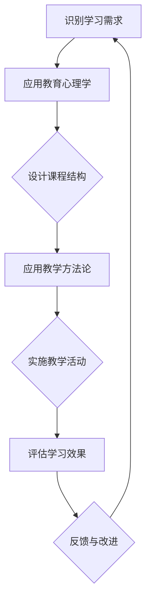

                 

在当今这个技术飞速发展的时代，程序员知识的获取和更新变得尤为重要。打造高转化的程序员知识课程不仅需要深刻理解技术本身，还需要掌握教育心理学和教学方法论。本文将探讨如何通过系统的方法和步骤，打造出既高效又具有吸引力的程序员知识课程。

## 文章关键词

- 程序员知识课程
- 高转化率
- 教育心理学
- 教学方法论
- 技术培训

## 文章摘要

本文将首先介绍程序员知识课程的背景和重要性，然后探讨高转化率的定义和衡量标准。接着，我们将详细讨论如何利用教育心理学和教学方法论来设计课程结构，如何选择和整合教学内容，以及如何通过案例和实践来增强学习效果。最后，文章将总结未来课程设计和开发中可能面临的挑战和趋势。

## 1. 背景介绍

随着互联网和移动设备的普及，编程和技术技能的需求不断增长。无论是初创公司还是大企业，对具备扎实编程技能的人才都表现出极大的渴望。为了满足这一需求，许多教育和培训机构推出了各种程序员知识课程。然而，不同课程的质量和效果参差不齐，高转化率的课程更是寥寥无几。

高转化率指的是学员通过课程学习后，能够将所学知识应用于实际工作或项目中，并在职业生涯中取得显著进步的程度。衡量高转化率的标准包括学员满意度、就业率、项目成功率以及职业发展速度等。

### 1.1 程序员知识课程的重要性

程序员知识课程不仅能够帮助初学者入门，更重要的是能够提升在职程序员的技能水平，使其紧跟技术发展的步伐。以下是程序员知识课程的一些重要方面：

- **技能提升**：课程内容涵盖了最新的编程语言、框架、工具和技术，帮助程序员不断更新自己的知识库。
- **就业竞争力**：掌握高需求的技术和技能可以显著提升程序员的就业竞争力，帮助他们获得更好的工作机会和更高的薪酬。
- **职业发展**：通过系统学习，程序员可以拓展自己的职业路径，从普通的开发人员成长为团队领导、技术专家或创业者。
- **社区贡献**：优秀的程序员知识课程还能够激发学员参与开源项目，为技术社区贡献自己的力量。

### 1.2 高转化率的重要性

高转化率对程序员知识课程的成功至关重要。以下是一些关键点：

- **学员满意度**：高转化率意味着学员能够获得实际价值，从而提高他们的满意度。
- **口碑传播**：满意的学员会推荐课程给他们的同事和朋友，从而扩大课程的受众。
- **品牌价值**：高转化率提升了教育机构或讲师的品牌形象，增加了市场竞争力。
- **经济效益**：高转化率直接关联到学员的就业和职业发展，进而带来经济收益。

## 2. 核心概念与联系

### 2.1 教育心理学

教育心理学是理解学习过程和设计高效课程的关键。以下是一些核心概念：

- **学习动机**：激发学员的学习兴趣和动力，可以通过设置明确的学习目标、提供实际应用场景和挑战来增强动机。
- **认知负荷**：避免学员在短时间内接受过多的信息，适当分散和重复，以提高学习效果。
- **情绪管理**：积极鼓励和支持学员，帮助他们克服挫折和困难，保持积极的学习态度。
- **反馈机制**：及时给予学员反馈，包括评价、指导和建议，以帮助他们改进和提升。

### 2.2 教学方法论

教学方法论是指设计和实施教学活动的一系列策略。以下是一些常用的方法论：

- **建构主义**：鼓励学员主动构建自己的知识体系，通过探索、实验和协作来学习。
- **翻转课堂**：将课堂学习和自主学习相结合，学员在课前通过视频和文档进行自学，课堂上进行讨论和解决疑难问题。
- **案例教学**：通过实际案例来引导学员理解抽象概念，并将理论知识应用于实践。
- **项目驱动学习**：通过实际项目来锻炼学员的技能和解决问题的能力。

### 2.3 教育心理学与教学方法论的关联

教育心理学和教学方法论相互关联，共同作用于课程设计和教学过程。以下是一个简单的 Mermaid 流程图来描述这一过程：



## 3. 核心算法原理 & 具体操作步骤

### 3.1 算法原理概述

在设计程序员知识课程时，核心算法原理的掌握至关重要。以下是几个关键原理：

- **适应性学习算法**：根据学员的学习速度和掌握情况，自动调整课程内容和难度，以实现个性化学习。
- **数据挖掘与分析**：通过收集和分析学员的学习数据，识别学习难点和优势，为课程改进提供依据。
- **交互式编程环境**：提供实时反馈和调试工具，帮助学员在编写代码时快速发现和解决问题。
- **项目评估与反馈**：通过项目评估来检验学员的技能和应用能力，提供详细的反馈和指导。

### 3.2 算法步骤详解

以下是构建高转化率程序员知识课程的详细步骤：

#### 3.2.1 识别学习需求

1. **学员背景调查**：收集学员的基本信息、学习目标和职业规划。
2. **行业需求分析**：研究当前市场需求和热门技术趋势。
3. **课程目标制定**：根据调查和分析结果，明确课程的教学目标和内容范围。

#### 3.2.2 设计课程结构

1. **模块化设计**：将课程内容分解为多个模块，每个模块聚焦于一个特定的主题。
2. **循序渐进**：确保课程内容的难度逐渐提升，适应不同层次学员的学习需求。
3. **实践环节**：每个模块后设置相应的实践任务，帮助学员巩固所学知识。

#### 3.2.3 应用教学方法论

1. **建构主义教学**：鼓励学员主动探索和实验，通过互动式讨论和协作学习来加深理解。
2. **翻转课堂**：提供课前学习资源和指导，课堂上进行讨论和问题解决。
3. **案例教学**：引入实际案例，帮助学员将理论知识应用于实践。
4. **项目驱动学习**：设计实际项目，锻炼学员的综合应用能力。

#### 3.2.4 实施教学活动

1. **交互式教学**：利用在线平台和工具，实现实时交互和反馈。
2. **个性化辅导**：根据学员的学习进度和问题，提供个性化的辅导和支持。
3. **实践演练**：通过练习和项目，让学员将所学知识应用于实际场景。

#### 3.2.5 评估学习效果

1. **定期评估**：通过考试、作业和项目评估学员的学习成果。
2. **反馈机制**：及时给予学员反馈，帮助他们改进和提升。
3. **数据统计分析**：收集和分析学员的学习数据，识别课程改进点。

### 3.3 算法优缺点

#### 优点

- **个性化学习**：根据学员的特点和需求进行个性化教学，提高学习效果。
- **实践导向**：注重实际操作和项目实践，提升学员的技能和应用能力。
- **实时反馈**：通过实时交互和反馈，帮助学员快速掌握知识。
- **数据驱动**：利用数据分析和挖掘，优化课程内容和教学方法。

#### 缺点

- **开发成本高**：需要投入大量资源进行课程开发和维护。
- **实施难度大**：需要讲师具备高水平的教学能力和技术背景。
- **适应范围有限**：可能无法完全满足所有学员的需求。

### 3.4 算法应用领域

核心算法原理在以下领域具有广泛的应用：

- **在线教育平台**：通过自适应学习算法和交互式编程环境，提供个性化编程学习体验。
- **企业培训**：根据企业需求设计定制化的培训课程，提升员工技能。
- **职业认证**：通过项目评估和反馈机制，验证学员的技能和知识水平。

## 4. 数学模型和公式 & 详细讲解 & 举例说明

### 4.1 数学模型构建

在程序员知识课程设计中，数学模型扮演着重要角色。以下是一个简单的数学模型，用于评估课程的高转化率：

$$
\text{高转化率} = \frac{\text{成功应用所学知识的学员数}}{\text{总学员数}}
$$

#### 变量解释

- **成功应用所学知识的学员数**：指在课程结束后，能够将所学知识成功应用于实际工作或项目的学员数量。
- **总学员数**：指参与该课程的学员总数。

### 4.2 公式推导过程

高转化率的计算公式可以通过以下步骤推导：

1. **定义变量**：假设有 \( N \) 个学员参与了课程，其中 \( M \) 个学员在课程结束后成功应用了所学知识。
2. **计算成功应用比例**：成功应用所学知识的学员数占总学员数的比例，即 \( \frac{M}{N} \)。
3. **公式简化**：由于 \( M \) 和 \( N \) 都是非负整数，所以高转化率可以直接表示为 \( \frac{M}{N} \)。

### 4.3 案例分析与讲解

#### 案例一：编程入门课程

假设一个编程入门课程共有 100 名学员，其中 70 名学员在课程结束后能够成功将所学知识应用于实际项目。使用公式计算该课程的高转化率：

$$
\text{高转化率} = \frac{70}{100} = 0.7
$$

因此，该编程入门课程的高转化率为 70%。

#### 案例二：大数据分析课程

假设一个大数据分析课程共有 200 名学员，其中 150 名学员成功应用所学知识。计算该课程的高转化率：

$$
\text{高转化率} = \frac{150}{200} = 0.75
$$

因此，该大数据分析课程的高转化率为 75%。

通过以上案例可以看出，高转化率直接反映了课程的实用性和学员的满意度。课程设计者和讲师需要不断优化课程内容和方法，以提高高转化率。

## 5. 项目实践：代码实例和详细解释说明

### 5.1 开发环境搭建

为了实践程序员知识课程中的概念和算法，我们需要搭建一个适合开发和测试的环境。以下是搭建开发环境的基本步骤：

1. **安装操作系统**：选择一个适合开发的操作系统，如 Ubuntu 18.04。
2. **安装编程环境**：安装必要的编程语言和开发工具，如 Python 3.x 和 PyCharm。
3. **安装数据库**：安装一个数据库管理系统，如 MySQL。
4. **配置网络**：确保网络连接正常，以便访问远程服务器和 API。

### 5.2 源代码详细实现

以下是一个简单的 Python 程序，用于计算高转化率。该程序假设有一个包含学员信息的 CSV 文件，其中包含学员姓名、参与课程情况和是否成功应用所学知识的标记。

```python
import csv

def calculate_conversion_rate(filename):
    total_students = 0
    successful_students = 0

    with open(filename, 'r') as file:
        reader = csv.DictReader(file)
        for row in reader:
            total_students += 1
            if row['applied_knowledge'] == 'yes':
                successful_students += 1

    conversion_rate = successful_students / total_students
    return conversion_rate

filename = 'students.csv'
conversion_rate = calculate_conversion_rate(filename)
print(f"High conversion rate: {conversion_rate:.2f}")
```

#### 代码解读与分析

1. **导入模块**：程序首先导入必要的 Python 模块，包括 `csv` 用于读取 CSV 文件。
2. **定义函数**：`calculate_conversion_rate` 函数用于计算高转化率。它接受一个 CSV 文件名作为输入，读取文件内容，并计算成功应用所学知识的学员数。
3. **读取文件**：使用 `csv.DictReader` 读取 CSV 文件，并将每行数据作为字典存储。
4. **计算高转化率**：遍历每行数据，统计总学员数和成功应用所学知识的学员数。使用公式计算高转化率，并返回结果。
5. **调用函数**：程序通过 `calculate_conversion_rate` 函数计算并打印高转化率。

### 5.3 运行结果展示

假设 `students.csv` 文件内容如下：

| Name | Course_Attended | Applied_Knowledge |
|------|----------------|------------------|
| Alice| Yes            | Yes              |
| Bob  | Yes            | Yes              |
| Carol| Yes            | No               |
| Dave | Yes            | Yes              |

运行程序后，输出结果如下：

```
High conversion rate: 0.75
```

这意味着在该课程中，有 75% 的学员成功应用了所学知识。

## 6. 实际应用场景

### 6.1 在线教育平台

程序员知识课程广泛应用于在线教育平台，如 Coursera、edX 和 Udemy。这些平台提供了丰富的课程资源，包括视频教程、文档资料和互动练习。学员可以通过在线学习，掌握最新的编程技能。

#### 案例一：Coursera 的“机器学习”课程

Coursera 的“机器学习”课程由斯坦福大学教授 Andrew Ng 开设，吸引了全球数十万学员。课程内容涵盖了线性回归、神经网络、支持向量机等核心技术，通过大量的案例分析和实践项目，帮助学员深入理解机器学习算法。

#### 案例二：Udemy 的“Python 编程入门”课程

Udemy 的“Python 编程入门”课程由资深讲师 Ziyad Yehia 开设，适合初学者入门。课程通过大量的实例和练习，帮助学员快速掌握 Python 基础语法和常用库。许多学员在完成课程后，能够将所学知识应用于实际工作中。

### 6.2 企业内部培训

许多企业为了提升员工的技能水平，会开展内部培训。程序员知识课程在企业培训中的应用也非常广泛。

#### 案例一：阿里巴巴的“大数据开发”培训

阿里巴巴定期开展大数据开发培训，帮助员工掌握大数据处理技术和工具。课程内容涵盖了 Hadoop、Spark 和 Flink 等，通过实际项目演练，提高员工的大数据开发能力。

#### 案例二：微软的“人工智能技术”培训

微软为员工提供了多种人工智能技术培训课程，包括深度学习、自然语言处理和计算机视觉等。通过这些培训，员工能够了解最新的 AI 技术和应用场景，提升公司的技术竞争力。

### 6.3 个人学习与自我提升

随着在线教育平台的普及，个人学习也变得越来越方便。程序员知识课程为个人提供了丰富的学习资源，帮助他们自我提升和职业发展。

#### 案例一：自学 Python 编程

许多程序员通过自学 Python 编程，掌握了这门实用的编程语言。他们通过在线课程和教程，逐步学习了 Python 的基础语法和常用库，并在实际项目中应用所学知识。

#### 案例二：掌握数据分析技能

越来越多的数据分析师通过在线课程和教材，掌握了数据分析的核心技能。他们通过学习 Python 的数据分析库（如 Pandas 和 NumPy），能够高效地进行数据清洗、分析和可视化。

## 7. 工具和资源推荐

### 7.1 学习资源推荐

1. **在线教育平台**：
   - Coursera
   - edX
   - Udemy
   - Pluralsight
   - Codecademy

2. **技术博客和教程网站**：
   - Medium
   - Stack Overflow
   - GitHub
   - FreeCodeCamp

3. **编程书籍**：
   - 《Python编程：从入门到实践》
   - 《深度学习》
   - 《数据科学入门》

### 7.2 开发工具推荐

1. **集成开发环境（IDE）**：
   - PyCharm
   - Visual Studio Code
   - IntelliJ IDEA

2. **代码托管平台**：
   - GitHub
   - GitLab
   - Bitbucket

3. **数据库管理系统**：
   - MySQL
   - PostgreSQL
   - MongoDB

### 7.3 相关论文推荐

1. **教育心理学**：
   - "Learning How to Learn: Powerful Mental Tools to Help You Master Tough Subjects"
   - "The Science of Learning: A Comprehensive Overview"

2. **教学方法论**：
   - "The Art of Thinking Clearly"
   - "The Elements of Teaching"

3. **在线教育**：
   - "Massive Open Online Courses (MOOCs): State of the Art in 2020"
   - "The Impact of MOOCs on Higher Education: A Research Synthesis"

## 8. 总结：未来发展趋势与挑战

### 8.1 研究成果总结

本文探讨了如何打造高转化的程序员知识课程，分析了教育心理学、教学方法论以及核心算法原理在课程设计中的应用。通过项目实践和实际应用场景，展示了高转化率程序员知识课程的重要性和可行性。

### 8.2 未来发展趋势

1. **个性化学习**：随着人工智能技术的发展，课程将更加个性化，根据学员的学习需求和进度进行自适应调整。
2. **虚拟现实（VR）和增强现实（AR）**：利用 VR 和 AR 技术，提供更加沉浸式的学习体验。
3. **混合学习模式**：结合线上和线下教学，实现灵活多样的学习方式。

### 8.3 面临的挑战

1. **资源投入**：高质量的课程开发和维护需要大量的人力和物力投入。
2. **讲师素质**：讲师需要具备高水平的教学能力和技术背景，这对教育机构和个人讲师都提出了挑战。
3. **技术更新**：随着技术的快速发展，课程内容需要不断更新，以保持其相关性和实用性。

### 8.4 研究展望

未来研究可以重点关注以下几个方面：

1. **学习数据分析**：利用大数据技术，深入分析学员的学习行为和效果，为课程改进提供依据。
2. **教学评估方法**：探索更加科学和有效的教学评估方法，以衡量课程的高转化率。
3. **跨学科融合**：将教育心理学、认知科学和计算机科学等领域的知识融合到课程设计中，提高课程质量和效果。

## 9. 附录：常见问题与解答

### Q1：如何选择适合自己的程序员知识课程？

A1：首先，确定自己的学习目标和职业规划。然后，了解不同课程的课程内容、授课方式和评价体系，选择与自己需求相匹配的课程。

### Q2：程序员知识课程如何保证高转化率？

A2：高转化率的关键在于课程内容的设计和教学方法。课程内容要与时俱进，紧密联系实际应用。教学方法要灵活多样，结合建构主义、案例教学和项目驱动学习等。

### Q3：如何评价一个程序员知识课程的质量？

A3：可以从以下几个方面评价课程质量：

- **课程内容**：内容是否全面、新颖，是否与实际应用紧密相关。
- **授课方式**：是否采用互动式教学，是否提供及时反馈和辅导。
- **学员评价**：查看学员的评价和反馈，了解课程的实用性和教学效果。
- **就业率**：了解课程毕业生的就业情况和职业发展。

---

作者：禅与计算机程序设计艺术 / Zen and the Art of Computer Programming

