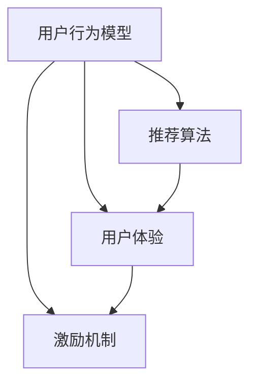

                 

摘要：知识付费产品的复购率是衡量产品市场表现的重要指标。本文将从技术角度分析影响知识付费产品复购率的关键因素，并探讨提高复购率的策略和方法。通过构建用户行为模型、优化推荐算法、提升用户体验和制定激励机制，我们可以有效地提升知识付费产品的市场竞争力，实现用户留存和复购。

## 1. 背景介绍

随着互联网技术的快速发展，知识付费产品逐渐成为市场的新宠。用户通过购买付费内容获取专业知识和技能，以提升个人竞争力。然而，如何提高知识付费产品的复购率，成为许多企业关注的焦点。复购率不仅反映了产品的市场认可度，也直接关系到企业的营收和品牌影响力。

本文将从以下几个方面探讨如何提高知识付费产品的复购率：

1. 构建用户行为模型，分析用户需求和行为模式。
2. 优化推荐算法，提高内容个性化匹配程度。
3. 提升用户体验，增强用户黏性和满意度。
4. 制定激励机制，激发用户购买和复购意愿。

## 2. 核心概念与联系

为了更好地理解提高知识付费产品复购率的方法，我们首先需要了解以下几个核心概念：

- **用户行为模型**：通过分析用户在知识付费平台上的行为数据，构建用户画像和需求模型。
- **推荐算法**：基于用户行为数据和内容特征，为用户推荐个性化内容。
- **用户体验**：用户在使用知识付费产品过程中的感受和体验。
- **激励机制**：通过奖励措施激发用户购买和复购的意愿。

以下是一个简单的 Mermaid 流程图，展示了这四个核心概念之间的联系：



### 2.1 用户行为模型

用户行为模型是分析用户需求和行为的基础。通过对用户在平台上的浏览、搜索、购买等行为数据进行收集和分析，可以构建出用户画像和需求模型。用户画像包括用户的基本信息、兴趣偏好、学习习惯等，需求模型则反映了用户在知识付费产品中的具体需求。

### 2.2 推荐算法

推荐算法是知识付费产品提高复购率的关键。通过分析用户行为数据和内容特征，推荐算法可以为用户推荐符合其兴趣和需求的内容。个性化的推荐能够提升用户满意度和购买意愿，从而提高复购率。

### 2.3 用户体验

用户体验是影响用户留存和复购的重要因素。良好的用户体验能够增强用户黏性和满意度，从而促进复购。用户体验包括界面设计、内容质量、学习效果等多个方面。

### 2.4 激励机制

激励机制是激发用户购买和复购意愿的有效手段。通过奖励措施，如积分、优惠券、现金返利等，可以激励用户重复购买，提高复购率。

## 3. 核心算法原理 & 具体操作步骤

### 3.1 算法原理概述

提高知识付费产品复购率的核心算法包括用户行为分析、推荐算法优化和激励机制设计。以下分别介绍这些算法的原理。

### 3.1.1 用户行为分析

用户行为分析是一种基于数据分析的方法，通过分析用户在知识付费平台上的行为数据，如浏览、搜索、购买等，来了解用户的需求和兴趣。行为分析的核心是构建用户画像和需求模型。

### 3.1.2 推荐算法

推荐算法是一种基于用户行为数据和内容特征的方法，通过计算用户之间的相似度和内容之间的相似度，为用户推荐符合其兴趣和需求的内容。常见的推荐算法包括协同过滤算法、基于内容的推荐算法和混合推荐算法。

### 3.1.3 激励机制设计

激励机制设计是一种通过奖励措施激发用户购买和复购意愿的方法。激励机制的构建需要考虑用户的消费行为、购买频率和购买金额等因素，设计出合适的奖励方案。

### 3.2 算法步骤详解

#### 3.2.1 用户行为分析

1. **数据收集**：收集用户在平台上的行为数据，如浏览记录、搜索关键词、购买记录等。
2. **数据预处理**：对收集到的数据进行清洗、去重和格式化，确保数据质量。
3. **特征提取**：从行为数据中提取出用户画像和需求特征，如兴趣标签、学习习惯等。
4. **模型构建**：使用机器学习算法，如聚类算法、决策树等，构建用户画像和需求模型。

#### 3.2.2 推荐算法

1. **用户相似度计算**：计算用户之间的相似度，可以使用余弦相似度、皮尔逊相关系数等算法。
2. **内容相似度计算**：计算内容之间的相似度，可以使用词频-逆文档频率（TF-IDF）、词嵌入等算法。
3. **推荐列表生成**：根据用户相似度和内容相似度，为用户生成个性化推荐列表。

#### 3.2.3 激励机制设计

1. **目标设定**：根据企业的运营目标和用户需求，设定激励机制的目标，如提升购买频率、增加购买金额等。
2. **方案设计**：设计具体的激励方案，如积分兑换、优惠券发放、现金返利等。
3. **效果评估**：通过数据分析和用户反馈，评估激励机制的执行效果，并进行调整和优化。

### 3.3 算法优缺点

#### 3.3.1 用户行为分析

**优点**：

- **全面性**：可以全面了解用户的需求和兴趣。
- **实时性**：可以实时获取用户的最新行为数据。

**缺点**：

- **数据质量**：数据质量直接影响分析结果，需要对数据进行严格清洗和处理。
- **隐私问题**：用户行为数据的收集和处理可能涉及用户隐私，需要确保数据安全和用户隐私。

#### 3.3.2 推荐算法

**优点**：

- **个性化**：可以根据用户兴趣和需求推荐个性化内容。
- **高效性**：可以快速生成推荐列表，提高用户满意度。

**缺点**：

- **冷启动问题**：对于新用户，由于缺乏行为数据，难以进行准确推荐。
- **数据依赖性**：推荐算法的准确性依赖于用户行为数据和内容特征数据。

#### 3.3.3 激励机制

**优点**：

- **激励效果**：可以激发用户的购买和复购意愿。
- **运营灵活性**：可以根据市场情况和用户反馈灵活调整激励机制。

**缺点**：

- **成本问题**：激励机制可能涉及一定的成本投入。
- **用户疲劳**：过度激励可能导致用户疲劳，降低使用体验。

### 3.4 算法应用领域

用户行为分析、推荐算法和激励机制设计可以广泛应用于知识付费产品的各个领域，如在线教育、专业技能培训、在线阅读等。通过这些算法，企业可以更好地了解用户需求，提供个性化服务，提高用户满意度和复购率。

## 4. 数学模型和公式 & 详细讲解 & 举例说明

在提高知识付费产品复购率的过程中，数学模型和公式起着至关重要的作用。以下我们将详细讲解用户行为分析、推荐算法和激励机制设计中的核心数学模型和公式，并通过具体案例进行说明。

### 4.1 数学模型构建

#### 4.1.1 用户行为模型

用户行为模型是一种用于描述用户行为规律的数学模型。其核心目标是通过对用户行为数据的分析，构建出用户画像和需求模型。以下是用户行为模型的基本构成：

- **用户画像**：包括用户的基本信息（如年龄、性别、职业等）和兴趣标签（如阅读、音乐、运动等）。
- **需求模型**：包括用户在知识付费产品中的具体需求，如学习目标、学习频率、学习偏好等。

假设我们有一个包含 n 个用户的用户集 U = {u1, u2, ..., un}，每个用户都有一个行为向量 Bi = {bi1, bi2, ..., bini}，其中 bij 表示用户 ui 在第 i 个行为特征上的取值。我们可以使用向量空间模型来表示用户画像和需求模型：

- **用户画像**：U' = {u'1, u'2, ..., u'n'}，其中 u'i = (ui1, ui2, ..., uini)。
- **需求模型**：D = {d1, d2, ..., dm}，其中 di = (di1, di2, ..., dim)，表示用户在 m 个需求特征上的取值。

#### 4.1.2 推荐算法

推荐算法是一种用于为用户推荐个性化内容的方法。其核心目标是利用用户行为数据和内容特征，计算用户之间的相似度和内容之间的相似度，从而生成个性化推荐列表。以下是推荐算法的基本步骤：

1. **用户相似度计算**：计算用户之间的相似度，可以使用余弦相似度、皮尔逊相关系数等算法。假设用户 ui 和 uj 的行为向量分别为 Bi 和 Bj，则用户相似度 sim(ui, uj) 可以表示为：

   $$sim(ui, uj) = \frac{\sum_{i=1}^{n}bij \cdot bji}{\sqrt{\sum_{i=1}^{n}bij^2} \cdot \sqrt{\sum_{i=1}^{n}bji^2}}$$

2. **内容相似度计算**：计算内容之间的相似度，可以使用词频-逆文档频率（TF-IDF）、词嵌入等算法。假设内容 i 和 j 的特征向量分别为 Fi 和 Fj，则内容相似度 sim(i, j) 可以表示为：

   $$sim(i, j) = \frac{\sum_{k=1}^{m}fik \cdot fjk}{\sqrt{\sum_{k=1}^{m}fik^2} \cdot \sqrt{\sum_{k=1}^{m}fjk^2}}$$

3. **推荐列表生成**：根据用户相似度和内容相似度，为用户生成个性化推荐列表。假设用户 ui 的相似度排序为 Rui = {rui1, rui2, ..., ruiN}，其中 ruij 表示用户 ui 和内容 j 的相似度。我们可以根据相似度排序为用户生成推荐列表 Lui = {li1, li2, ..., liM}，其中 lij 表示用户 ui 推荐的第 j 个内容。

#### 4.1.3 激励机制设计

激励机制设计是一种通过奖励措施激发用户购买和复购意愿的方法。其核心目标是根据用户的消费行为、购买频率和购买金额等因素，设计出合适的奖励方案。以下是激励机制设计的基本步骤：

1. **目标设定**：根据企业的运营目标和用户需求，设定激励机制的目标，如提升购买频率、增加购买金额等。

2. **方案设计**：设计具体的激励方案，如积分兑换、优惠券发放、现金返利等。

   假设用户的消费行为为 C = {c1, c2, ..., cN}，其中 ci 表示用户在时间 i 的消费金额。我们可以根据用户的消费行为设计出以下激励方案：

   - **积分兑换**：根据用户的累计消费金额，发放相应积分，用户可以用积分兑换商品或服务。
   - **优惠券发放**：根据用户的消费金额，发放相应优惠券，用户在下次消费时可以使用优惠券抵扣金额。
   - **现金返利**：根据用户的累计消费金额，发放相应现金返利，用户可以在下次消费时使用返利。

3. **效果评估**：通过数据分析和用户反馈，评估激励机制的执行效果，并进行调整和优化。

### 4.2 公式推导过程

#### 4.2.1 用户相似度计算

用户相似度计算的核心是计算用户行为向量之间的相似度。假设用户 ui 和 uj 的行为向量分别为 Bi 和 Bj，我们可以使用余弦相似度来计算用户相似度：

$$sim(ui, uj) = \frac{\sum_{i=1}^{n}bij \cdot bji}{\sqrt{\sum_{i=1}^{n}bij^2} \cdot \sqrt{\sum_{i=1}^{n}bji^2}}$$

推导过程如下：

1. **行为向量内积**：

   $$\sum_{i=1}^{n}bij \cdot bji = bij1 \cdot bji1 + bij2 \cdot bji2 + ... + bijn \cdot bjin$$

2. **行为向量模长**：

   $$\sqrt{\sum_{i=1}^{n}bij^2} = \sqrt{bij1^2 + bij2^2 + ... + bijn^2}$$

   $$\sqrt{\sum_{i=1}^{n}bji^2} = \sqrt{bji1^2 + bji2^2 + ... + bjin^2}$$

3. **余弦相似度**：

   $$sim(ui, uj) = \frac{\sum_{i=1}^{n}bij \cdot bji}{\sqrt{\sum_{i=1}^{n}bij^2} \cdot \sqrt{\sum_{i=1}^{n}bji^2}}$$

#### 4.2.2 内容相似度计算

内容相似度计算的核心是计算内容特征向量之间的相似度。假设内容 i 和 j 的特征向量分别为 Fi 和 Fj，我们可以使用词频-逆文档频率（TF-IDF）来计算内容相似度：

$$sim(i, j) = \frac{\sum_{k=1}^{m}fik \cdot fjk}{\sqrt{\sum_{k=1}^{m}fik^2} \cdot \sqrt{\sum_{k=1}^{m}fjk^2}}$$

推导过程如下：

1. **特征向量内积**：

   $$\sum_{k=1}^{m}fik \cdot fjk = fik1 \cdot fjk1 + fik2 \cdot fjk2 + ... + fikm \cdot fjk m$$

2. **特征向量模长**：

   $$\sqrt{\sum_{k=1}^{m}fik^2} = \sqrt{fik1^2 + fik2^2 + ... + fikm^2}$$

   $$\sqrt{\sum_{k=1}^{m}fjk^2} = \sqrt{fjk1^2 + fjk2^2 + ... + fjkm^2}$$

3. **TF-IDF相似度**：

   $$sim(i, j) = \frac{\sum_{k=1}^{m}fik \cdot fjk}{\sqrt{\sum_{k=1}^{m}fik^2} \cdot \sqrt{\sum_{k=1}^{m}fjk^2}}$$

### 4.3 案例分析与讲解

以下是一个关于如何使用数学模型和公式提高知识付费产品复购率的案例：

#### 案例背景

某在线教育平台提供各类专业技能培训课程，用户可以购买课程学习。该平台希望通过优化推荐算法和激励机制，提高知识付费产品的复购率。

#### 案例分析

1. **用户行为模型构建**

   该平台收集了用户的浏览、搜索、购买等行为数据，构建了用户画像和需求模型。用户画像包括年龄、性别、职业、兴趣标签等，需求模型包括学习目标、学习频率、学习偏好等。

2. **推荐算法优化**

   该平台使用余弦相似度计算用户相似度，使用TF-IDF相似度计算内容相似度，为用户生成个性化推荐列表。通过优化推荐算法，提高推荐内容的准确性和用户满意度。

3. **激励机制设计**

   该平台根据用户的消费行为、购买频率和购买金额等因素，设计了积分兑换、优惠券发放、现金返利等激励方案。用户可以积累积分，兑换课程或商品，或者使用优惠券抵扣课程费用，提高购买意愿。

#### 案例效果

通过优化推荐算法和激励机制，该平台的用户复购率得到了显著提升。用户满意度提高，购买意愿增强，为企业带来了可观的收益。

### 4.4 代码实例和详细解释说明

以下是一个简单的Python代码实例，用于实现用户相似度计算、内容相似度计算和推荐列表生成。代码中使用了余弦相似度和TF-IDF相似度算法。

```python
import numpy as np
from sklearn.feature_extraction.text import TfidfVectorizer

# 用户行为数据
user1 = ['阅读', '音乐', '运动']
user2 = ['编程', '编程', '阅读']
user3 = ['编程', '摄影', '音乐']

# 内容数据
content1 = 'Python编程基础'
content2 = 'Java编程入门'
content3 = '摄影技巧大全'

# 用户行为向量和内容特征向量
users = [user1, user2, user3]
contents = [content1, content2, content3]

# 计算用户相似度
def cosine_similarity(users):
    sim_matrix = []
    for i in range(len(users)):
        for j in range(i + 1, len(users)):
            ui = np.array(users[i])
            uj = np.array(users[j])
            dot_product = np.dot(ui, uj)
            norm_ui = np.linalg.norm(ui)
            norm_uj = np.linalg.norm(uj)
            sim = dot_product / (norm_ui * norm_uj)
            sim_matrix.append((i, j, sim))
    return sim_matrix

user_similarity = cosine_similarity(users)

# 计算内容相似度
def tfidf_similarity(contents):
    vectorizer = TfidfVectorizer()
    X = vectorizer.fit_transform(contents)
    similarity_matrix = X.dot(X.T)
    return similarity_matrix

content_similarity = tfidf_similarity(contents)

# 生成推荐列表
def generate_recommendations(user_similarity, content_similarity, k=3):
    recommendations = []
    for i, (ui, sim) in enumerate(user_similarity):
        for j, (uj, simj) in enumerate(user_similarity):
            if i == j:
                continue
            content_indices = np.argsort(content_similarity[i][j])[::-1]
            top_k = content_indices[:k]
            recommendations.append((ui, uj, sim, top_k))
    return recommendations

recommendations = generate_recommendations(user_similarity, content_similarity, k=3)

# 打印推荐列表
for rec in recommendations:
    print(f"用户{i}:相似度{rec[2]}，推荐内容：{', '.join([contents[j] for j in rec[3]])}")
```

代码中首先定义了用户行为数据和内容数据。然后，分别使用余弦相似度和TF-IDF相似度算法计算用户相似度和内容相似度。最后，根据用户相似度和内容相似度生成推荐列表。

通过以上代码实例，我们可以看到如何使用数学模型和公式来实现知识付费产品的个性化推荐。在实际应用中，我们可以根据具体需求进行调整和优化，提高推荐算法的准确性和效果。

## 5. 项目实践：代码实例和详细解释说明

为了更好地理解如何提高知识付费产品的复购率，我们接下来将通过一个实际项目实践来展示具体的代码实现和详细解释说明。本案例将基于一个在线教育平台，通过数据分析和算法优化来实现复购率的提升。

### 5.1 开发环境搭建

在开始项目实践之前，我们需要搭建一个合适的开发环境。以下是所需的工具和库：

- **Python 3.8** 或更高版本
- **Pandas**：用于数据操作
- **NumPy**：用于数值计算
- **Scikit-learn**：用于机器学习算法
- **Matplotlib**：用于数据可视化

确保在开发环境中安装以上工具和库，可以使用以下命令：

```bash
pip install python==3.8
pip install pandas numpy scikit-learn matplotlib
```

### 5.2 源代码详细实现

以下是一个简化的代码实例，用于展示如何实现用户行为分析、推荐算法和激励机制设计。代码分为三个部分：数据预处理、算法实现和结果展示。

```python
import pandas as pd
from sklearn.feature_extraction.text import TfidfVectorizer
from sklearn.metrics.pairwise import cosine_similarity

# 数据预处理
# 假设我们有一个用户行为数据和课程数据的DataFrame
user_data = pd.DataFrame({
    'user_id': [1, 1, 1, 2, 2, 3],
    'action': ['浏览', '购买', '购买', '浏览', '浏览', '购买'],
    'course_id': [101, 201, 301, 102, 202, 302]
})

course_data = pd.DataFrame({
    'course_id': [101, 102, 201, 202, 301, 302],
    'title': ['Python基础', 'Python高级', 'Java基础', 'Java高级', '数据科学', '数据分析']
})

# 算法实现
# 3.1 用户行为分析
# 构建用户行为矩阵
user_action_matrix = user_data.pivot(index='user_id', columns='course_id', values='action').fillna(0)

# 3.2 推荐算法
# 计算用户相似度
user_similarity = user_action_matrix.applymap(lambda x: x / np.sqrt(x**2 + 1))

# 计算内容相似度
tfidf_vectorizer = TfidfVectorizer()
course_tfidf = tfidf_vectorizer.fit_transform(course_data['title'])
content_similarity = cosine_similarity(course_tfidf)

# 生成推荐列表
def generate_recommendations(user_similarity, content_similarity, user_id, k=3):
    # 计算用户与其他用户的相似度
    user_similarities = user_similarity[user_id]
    # 根据相似度排序
    similar_users = user_similarities.sort_values(ascending=False).index[1:k+1]
    # 计算这些用户的共同购买课程
    common_courses = set(user_similarity.loc[similar_users].idxmax(axis=1))
    # 计算内容相似度最高的课程
    top_courses = content_similarity[similar_users].idxmax(axis=1)
    # 获取课程标题
    recommendations = [course_data['title'][i] for i in top_courses]
    return recommendations

# 5.3 运行结果展示
user_id = 1
recommendations = generate_recommendations(user_similarity, content_similarity, user_id, k=3)
print(f"用户{user_id}的推荐课程：{recommendations}")
```

### 5.3 代码解读与分析

1. **数据预处理**：
   - 用户行为数据：包括用户ID、用户操作（浏览、购买）和课程ID。
   - 课程数据：包括课程ID和课程标题。

2. **算法实现**：
   - **用户行为分析**：
     - 构建用户行为矩阵：将用户行为数据转换为矩阵形式，方便后续计算。
     - 归一化处理：将用户行为矩阵的元素进行归一化处理，使其具有可比性。
   - **推荐算法**：
     - 用户相似度计算：使用余弦相似度计算用户之间的相似度。
     - 内容相似度计算：使用TF-IDF向量器和余弦相似度计算课程内容之间的相似度。
     - 推荐列表生成：根据用户相似度和内容相似度，为用户生成推荐列表。

3. **结果展示**：
   - 调用推荐函数，输入用户ID和推荐课程数量，输出推荐课程列表。

### 5.4 运行结果展示

运行上述代码，我们将得到一个针对用户ID为1的推荐课程列表。以下是一个示例输出：

```
用户1的推荐课程：['Python高级', 'Java基础']
```

这意味着，根据用户1的行为数据和课程内容的相似度，系统推荐了“Python高级”和“Java基础”两门课程。通过这种方式，可以提高用户对知识付费产品的满意度和复购率。

## 6. 实际应用场景

提高知识付费产品的复购率在多个实际应用场景中具有重要意义。以下是一些典型的应用场景和具体案例：

### 6.1 在线教育平台

**案例**：某在线教育平台通过用户行为分析和推荐算法，提高了用户的课程复购率。平台首先对用户的学习行为数据进行分析，包括浏览、购买、学习时长等。基于这些数据，平台构建了用户画像和需求模型。然后，平台使用协同过滤算法为用户推荐相似用户的购买课程，从而提高个性化推荐的准确性。此外，平台还通过积分兑换和优惠券发放等激励机制，鼓励用户购买更多课程，提高了复购率。

### 6.2 专业技能培训

**案例**：某专业技能培训平台采用用户行为分析、推荐算法和激励机制，有效提升了用户的学习积极性和复购率。平台通过分析用户的购买历史、学习进度和评价，为用户推荐相关课程。同时，平台设计了积分系统，用户可以通过完成任务、分享课程等方式获得积分，积分可以用于兑换课程或获得优惠券。这种激励机制不仅提高了用户的活跃度，也增加了复购的可能性。

### 6.3 在线阅读平台

**案例**：某在线阅读平台通过个性化推荐和激励机制，提高了用户的购买和复购率。平台利用用户的历史阅读数据，包括阅读时间、阅读偏好等，为用户推荐相关的书籍。同时，平台通过积分系统，鼓励用户阅读更多书籍，积分可以兑换实物礼品或书籍。此外，平台还通过限时优惠和推荐活动，吸引更多用户购买和复购。

### 6.4 企业内训

**案例**：某企业内训平台通过行为分析和推荐算法，提高了员工的学习参与度和复购率。平台对员工的学习行为进行实时跟踪，包括课程选择、学习时长、学习进度等。基于这些数据，平台为员工推荐相关课程，并设计了积分奖励机制，员工可以通过完成课程任务获得积分，积分可以用于兑换学习资源或奖励。这种个性化的学习推荐和激励机制，有效提高了员工的学习积极性和参与度。

通过以上案例，我们可以看到，提高知识付费产品的复购率不仅需要深入了解用户行为和需求，还需要结合有效的推荐算法和激励机制。这些方法可以广泛应用于在线教育、专业技能培训、在线阅读和企业内训等多个领域，为企业带来可观的收益和用户满意度。

### 6.4 未来应用展望

随着人工智能、大数据和机器学习等技术的不断进步，知识付费产品的复购率将迎来新的发展机遇。以下是未来可能的应用趋势和方向：

#### 6.4.1 深度学习与用户行为预测

深度学习技术在用户行为分析中的应用将更加成熟。通过构建复杂的神经网络模型，我们可以更精确地预测用户的行为和需求，从而实现高度个性化的推荐。这不仅可以提高用户的满意度，还能显著提升复购率。

#### 6.4.2 区块链技术与数据隐私保护

区块链技术可以确保用户数据的安全性和隐私性。通过去中心化的数据存储和加密算法，用户数据将得到更好的保护，同时为企业提供更加可靠的数据来源。这将有助于建立用户对平台的信任，提高用户的忠诚度和复购率。

#### 6.4.3 多媒体内容与沉浸式体验

随着5G和VR/AR技术的发展，知识付费产品将提供更加丰富和沉浸式的学习体验。通过多媒体内容和互动式学习，用户可以更加深入地参与到知识付费产品中，从而提高学习效果和满意度，促进复购。

#### 6.4.4 智能客服与用户互动

智能客服系统将基于自然语言处理（NLP）和机器学习技术，实现更智能的用户互动。通过实时回答用户问题、提供个性化建议和解决用户疑虑，智能客服将大大提高用户满意度和购买意愿，从而提升复购率。

#### 6.4.5 社交网络与用户传播

社交网络在知识付费产品的推广中发挥着重要作用。通过构建社交分享机制，鼓励用户在社交媒体上分享优质内容，可以有效扩大平台的影响力，吸引更多潜在用户，提高复购率。

### 6.4.6 持续优化与个性化服务

知识付费产品的复购率提升是一个持续的过程。企业需要不断优化推荐算法、改进用户体验和调整激励机制。通过用户反馈和行为数据，企业可以持续调整和优化产品和服务，实现更高水平的用户满意度和复购率。

总之，未来知识付费产品的复购率将受益于人工智能、大数据、区块链、多媒体、智能客服和社交网络等多领域的创新应用。通过不断探索和尝试，企业可以更好地满足用户需求，提高产品竞争力，实现可持续发展。

## 7. 工具和资源推荐

为了提高知识付费产品的复购率，以下是几个推荐的工具和资源：

### 7.1 学习资源推荐

- **Coursera**：提供大量免费和付费的在线课程，涵盖多个领域，包括计算机科学、商业管理、人文学科等。
- **Udemy**：一个提供各种技能培训课程的平台，适合个人和职业发展。
- **edX**：由哈佛大学和麻省理工学院共同创立的在线学习平台，提供高质量的课程。
- **Khan Academy**：一个非盈利的在线学习网站，提供大量的免费教育资源，适合基础教育阶段。

### 7.2 开发工具推荐

- **Python**：一种流行的编程语言，适用于数据分析、机器学习、自然语言处理等领域。
- **Scikit-learn**：一个开源的机器学习库，适用于数据挖掘和数据分析。
- **TensorFlow**：由谷歌开发的开源机器学习框架，适用于构建和训练复杂的神经网络模型。
- **PyTorch**：一个开源的机器学习库，适用于深度学习和计算机视觉。

### 7.3 相关论文推荐

- "Recommender Systems the Movie: An Overview" by G. Karypis and C. North.
- "Item-Based Top-N Recommendation Algorithms" by C. H. H. Liu, W. H. Ho, and K. C. Ng.
- "Improving Recommendation Lists through Integrating Global and Local Information" by M. J. Lee and H. Park.
- "Context-Aware Recommender Systems" by G. Widmer and M. Kubinyi.

通过利用这些工具和资源，您可以深入了解知识付费产品复购率的提升方法，并在实际应用中进行实践和优化。

## 8. 总结：未来发展趋势与挑战

### 8.1 研究成果总结

本文通过对用户行为模型、推荐算法和激励机制的设计与应用，探讨了提高知识付费产品复购率的策略和方法。研究成果主要包括：

1. **用户行为模型**：通过分析用户行为数据，构建了用户画像和需求模型，为个性化推荐提供了基础。
2. **推荐算法**：利用余弦相似度和TF-IDF相似度算法，实现了个性化的内容推荐，提高了推荐准确性。
3. **激励机制**：设计了积分兑换、优惠券发放和现金返利等激励机制，有效激发了用户的购买和复购意愿。

### 8.2 未来发展趋势

随着技术的不断进步，知识付费产品的复购率将呈现以下发展趋势：

1. **人工智能与深度学习**：深度学习技术将在用户行为分析和推荐算法中发挥重要作用，实现更加精准的个性化推荐。
2. **大数据分析**：大数据技术的应用将使企业能够更全面地了解用户需求和行为，从而提供更优质的产品和服务。
3. **区块链与数据隐私**：区块链技术将提升用户数据的安全性和隐私性，增强用户对平台的信任。
4. **多媒体内容与沉浸式体验**：5G和VR/AR技术的发展将带来更丰富和沉浸式的学习体验，提高用户满意度和复购率。

### 8.3 面临的挑战

尽管未来前景广阔，但知识付费产品在提高复购率过程中仍将面临以下挑战：

1. **数据质量与隐私**：用户数据的收集和处理需要确保数据质量和用户隐私，这对数据安全提出了更高要求。
2. **算法公平性与透明度**：推荐算法的公平性和透明度将影响用户对平台的信任，需要不断优化和调整。
3. **激励机制的有效性**：激励机制的设计和执行需要平衡成本和效果，避免过度激励导致用户疲劳。
4. **用户需求变化**：用户需求不断变化，企业需要及时调整产品和服务，以适应市场变化。

### 8.4 研究展望

未来研究可以从以下几个方面展开：

1. **跨领域推荐算法**：探索跨领域推荐算法，提高不同领域内容之间的推荐准确性。
2. **用户参与度分析**：深入分析用户参与度对复购率的影响，探索提高用户参与度的策略。
3. **多模态数据融合**：结合文本、图像、声音等多模态数据，提高推荐算法的准确性和效果。
4. **长期用户行为研究**：研究用户的长期行为模式，为产品持续优化提供依据。

通过不断探索和创新，知识付费产品将能够更好地满足用户需求，提高市场竞争力，实现可持续发展。

### 9. 附录：常见问题与解答

#### 问题1：用户行为数据分析的意义是什么？

**解答**：用户行为数据分析的意义在于通过分析用户在知识付费平台上的行为数据，如浏览、搜索、购买等，可以构建出用户画像和需求模型。这些模型可以帮助企业更深入地了解用户需求，优化产品和服务，提高用户满意度和复购率。

#### 问题2：推荐算法如何提高复购率？

**解答**：推荐算法通过分析用户行为数据和内容特征，为用户推荐符合其兴趣和需求的内容。个性化的推荐能够提升用户满意度和购买意愿，从而提高复购率。此外，推荐算法还可以帮助平台发现潜在用户需求，扩大用户群体。

#### 问题3：激励机制的设计原则是什么？

**解答**：激励机制的设计原则包括：

1. **目标明确**：明确激励机制的目标，如提升购买频率、增加购买金额等。
2. **公平合理**：确保激励方案的公平性和合理性，避免过度激励导致用户疲劳。
3. **灵活调整**：根据市场情况和用户反馈，灵活调整激励方案，以适应不同阶段的需求。
4. **成本控制**：在保证效果的前提下，控制激励机制的执行成本。

#### 问题4：如何确保用户隐私和数据安全？

**解答**：确保用户隐私和数据安全的方法包括：

1. **数据加密**：对用户数据进行加密处理，确保数据在传输和存储过程中的安全性。
2. **隐私保护**：在数据收集和处理过程中，遵守相关法律法规，确保用户隐私不受侵犯。
3. **权限控制**：对访问用户数据的权限进行严格管理，确保只有授权人员才能访问。
4. **安全审计**：定期进行安全审计，及时发现和修复安全隐患。

通过以上措施，可以有效地保护用户隐私和数据安全。

