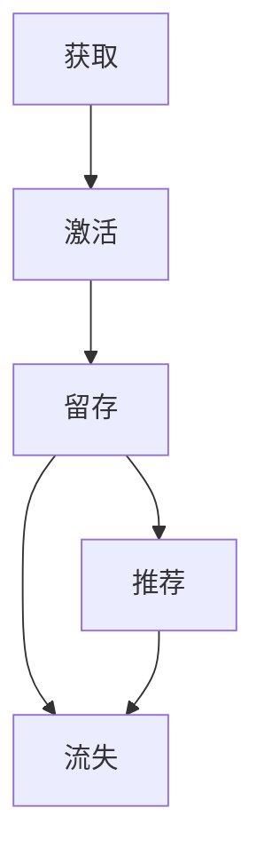

                 

### 1. 背景介绍

知识付费产品，作为近年来互联网经济的重要组成部分，已经在教育、咨询、技能培训等领域展现出了巨大的市场潜力。然而，尽管市场前景广阔，知识付费产品的用户留存率却普遍较低，这对于产品和平台的发展构成了严重挑战。用户留存率低的原因多样，包括产品内容质量不足、用户体验不佳、市场竞争激烈等。因此，如何提高知识付费产品的用户留存率成为当前亟待解决的问题。

本文将从多个维度分析知识付费产品的用户留存问题，并探讨有效的解决策略。文章结构如下：

- **1. 背景介绍**：简要介绍知识付费产品市场现状及用户留存率问题。
- **2. 核心概念与联系**：介绍用户留存的相关概念和影响因素。
- **3. 核心算法原理 & 具体操作步骤**：详细阐述提高用户留存率的方法和步骤。
- **4. 数学模型和公式 & 详细讲解 & 举例说明**：使用数学模型分析用户留存问题。
- **5. 项目实践：代码实例和详细解释说明**：通过具体案例展示如何提高用户留存率。
- **6. 实际应用场景**：分析知识付费产品在不同场景下的留存策略。
- **7. 工具和资源推荐**：推荐用于研究和开发的工具和资源。
- **8. 总结：未来发展趋势与挑战**：总结研究成果，展望未来发展。
- **9. 附录：常见问题与解答**：解答用户关心的问题。

通过这篇文章，希望能够为知识付费产品开发者和运营者提供一些有价值的参考和思路。

---

### 2. 核心概念与联系

在探讨如何提高知识付费产品的用户留存率之前，我们需要明确一些核心概念和它们之间的联系。

#### 用户留存率（Retention Rate）

用户留存率是指一段时间内，仍然活跃使用产品的用户占总用户数的比例。它是衡量产品黏性和用户忠诚度的关键指标。留存率越高，说明产品对用户越有吸引力，用户越愿意持续使用。

#### 用户生命周期（Customer Lifecycle）

用户生命周期包括用户从首次接触产品到最终流失的整个过程，通常分为获取（Acquisition）、激活（Activation）、留存（Retention）、推荐（Referral）和流失（Churn）五个阶段。

- **获取**：吸引新用户加入产品。
- **激活**：让新用户开始使用产品，完成首次关键任务。
- **留存**：提高用户留存率，延长用户在产品上的活跃时间。
- **推荐**：鼓励现有用户向他人推荐产品。
- **流失**：用户停止使用产品，流失出用户群体。

#### 用户忠诚度（Customer Loyalty）

用户忠诚度是指用户对产品品牌、服务和体验的认同和信任程度。高忠诚度的用户不仅会持续使用产品，还可能成为产品的口碑传播者，为产品带来更多的潜在用户。

#### 用户行为分析（User Behavior Analysis）

用户行为分析是通过数据和技术手段对用户在产品上的行为进行监测、分析和理解。通过用户行为分析，可以识别出影响用户留存的关键因素，为提高留存率提供数据支持。

#### 数据驱动的决策（Data-Driven Decision Making）

数据驱动的决策是基于数据分析得出的结论来指导产品开发和运营。在知识付费产品领域，通过数据分析可以发现用户需求和行为模式，从而制定出更加精准和有效的留存策略。

### Mermaid 流程图

下面是用户留存流程的 Mermaid 流程图：



通过这个流程图，我们可以清晰地看到用户从获取到流失的整个过程，以及各个阶段之间的相互影响。

---

在接下来的章节中，我们将深入探讨用户留存率的核心算法原理、数学模型和具体操作步骤，并结合实际项目案例进行分析和讲解，帮助读者更好地理解如何提高知识付费产品的用户留存率。

---

### 3. 核心算法原理 & 具体操作步骤

在提高知识付费产品的用户留存率方面，有多种核心算法和策略可以应用。以下是几种常见的算法原理和具体操作步骤：

#### 3.1 算法原理概述

##### 用户细分（User Segmentation）

用户细分是将用户按照不同的特征和行为模式划分成不同的群体。通过用户细分，可以针对不同群体的用户特点制定个性化的留存策略。

##### 个性化推荐（Personalized Recommendation）

个性化推荐系统根据用户的兴趣、历史行为和内容偏好，推荐用户可能感兴趣的知识付费产品。这可以提高用户的满意度和留存率。

##### 用户行为预测（User Behavior Prediction）

用户行为预测是通过分析用户的历史行为和当前状态，预测用户未来的行为。这有助于提前发现潜在的流失用户，并采取相应的措施进行挽回。

##### 社交网络分析（Social Network Analysis）

社交网络分析是通过分析用户在社交平台上的互动和关系，识别出潜在的用户社区和领袖。这些社区和领袖可以帮助提高用户留存率。

#### 3.2 算法步骤详解

##### 用户细分

1. **数据收集**：收集用户的基本信息、行为数据、内容偏好等。
2. **特征工程**：提取用户的特征，如年龄、性别、地理位置、行为特征等。
3. **模型训练**：使用聚类算法（如K-means、DBSCAN）将用户分为不同的群体。
4. **策略制定**：根据不同用户群体的特点，制定个性化的留存策略。

##### 个性化推荐

1. **数据收集**：收集用户的行为数据、内容偏好、浏览记录等。
2. **特征工程**：提取用户和内容的相关特征。
3. **模型训练**：使用协同过滤算法（如基于用户的协同过滤、基于项目的协同过滤）构建推荐模型。
4. **推荐生成**：根据用户特征和模型预测，生成个性化推荐列表。
5. **推荐展示**：将推荐结果展示给用户，提高用户的满意度。

##### 用户行为预测

1. **数据收集**：收集用户的历史行为数据，如购买记录、浏览记录、点击记录等。
2. **特征工程**：提取用户的行为特征，如行为类型、行为频率、行为时长等。
3. **模型训练**：使用机器学习算法（如决策树、随机森林、神经网络）训练行为预测模型。
4. **预测生成**：根据用户的当前状态和历史行为，预测用户未来的行为。
5. **干预措施**：根据预测结果，提前采取措施（如发送提醒、推送优惠活动）进行用户挽回。

##### 社交网络分析

1. **数据收集**：收集用户的社交网络数据，如好友关系、互动记录等。
2. **特征工程**：提取用户的社交网络特征，如好友数量、互动频率、关系强度等。
3. **模型训练**：使用社交网络分析算法（如PageRank、社区发现算法）识别用户社区和领袖。
4. **策略制定**：根据社区和领袖的特点，制定相应的用户留存策略。

#### 3.3 算法优缺点

**用户细分**

- **优点**：能够针对不同用户群体制定个性化策略，提高留存效果。
- **缺点**：需要大量数据支持和复杂的模型训练，成本较高。

**个性化推荐**

- **优点**：提高用户满意度和活跃度，有助于提高留存率。
- **缺点**：推荐系统容易出现“冷启动”问题，对新用户效果较差。

**用户行为预测**

- **优点**：提前发现潜在流失用户，及时采取挽回措施。
- **缺点**：预测精度受限于数据质量和模型效果。

**社交网络分析**

- **优点**：能够利用社交网络的传播效应，提高用户留存。
- **缺点**：需要对社交网络数据进行深入理解和分析，操作复杂。

#### 3.4 算法应用领域

- **用户细分**：在电商、社交媒体等领域广泛应用，用于用户分群和精准营销。
- **个性化推荐**：在音乐、视频、电商等领域广泛应用，提升用户满意度和留存率。
- **用户行为预测**：在金融、电商、游戏等领域广泛应用，用于风险控制和用户挽回。
- **社交网络分析**：在社交媒体、推荐系统、社区管理等领域广泛应用，提高用户互动和留存。

通过以上算法原理和步骤的介绍，我们可以看到，提高知识付费产品的用户留存率需要从多个方面进行综合分析和策略制定。在接下来的章节中，我们将使用数学模型和公式进一步分析用户留存问题，并结合具体案例进行深入讲解。

---

### 4. 数学模型和公式 & 详细讲解 & 举例说明

在提高知识付费产品的用户留存率方面，数学模型和公式可以帮助我们更深入地分析用户行为和制定有效的策略。以下是一些常用的数学模型和公式，以及它们的详细讲解和举例说明。

#### 4.1 数学模型构建

**1. 生命周期价值模型（Customer Lifetime Value, CLV）**

生命周期价值模型用于估算一个用户在整个生命周期中为产品带来的预期收益。它可以帮助企业了解用户的潜在价值，从而制定有针对性的留存策略。

**公式**：

$$
CLV = \sum_{t=1}^{n} [P_t \times ARPU_t \times RFM]
$$

其中，\(P_t\) 表示第 t 年的用户购买概率，\(ARPU_t\) 表示第 t 年的用户平均收入，\(RFM\) 表示客户的重复购买率、频率和货币化。

**解释**：

- \(P_t\)：第 t 年的用户购买概率，可以通过历史数据和使用机器学习模型预测。
- \(ARPU_t\)：第 t 年的用户平均收入，可以通过用户历史购买记录计算。
- \(RFM\)：客户的重复购买率、频率和货币化，这些指标反映了用户的活跃度和忠诚度。

**2. 转化率模型（Conversion Rate Model）**

转化率模型用于估算用户从某个阶段（如激活、购买）到下一个阶段的概率。这个模型可以帮助我们了解用户在产品中的转化过程，并找出优化留存的关键环节。

**公式**：

$$
CR = \frac{转化人数}{总访问人数}
$$

**解释**：

- 转化人数：完成特定目标（如注册、购买）的用户数量。
- 总访问人数：访问产品页面或进行相关操作的用户数量。

**3. 季节性模型（Seasonality Model）**

季节性模型用于分析用户行为在不同时间段的规律性变化，帮助我们制定具有季节性的留存策略。

**公式**：

$$
Seasonality Factor = \frac{实际销售额}{预测销售额}
$$

**解释**：

- 实际销售额：实际观测到的销售额。
- 预测销售额：根据历史数据和季节性规律预测的销售额。

#### 4.2 公式推导过程

**1. 生命周期价值模型**

生命周期价值模型的推导基于以下几个假设：

- 用户在未来的每一年的购买概率和平均收入是独立的。
- 用户的流失概率在短期内是恒定的。
- 用户的生命周期是有限的，通常在几年内。

基于这些假设，我们可以使用概率和期望值的方法推导出生命周期价值模型。

**推导过程**：

$$
\begin{aligned}
CLV &= \sum_{t=1}^{n} [P_t \times ARPU_t \times RFM] \\
    &= P_1 \times ARPU_1 \times RFM + P_2 \times ARPU_2 \times RFM + \ldots + P_n \times ARPU_n \times RFM \\
    &= \sum_{t=1}^{n} [P_t \times \frac{P_t \times ARPU_t}{1 - P_t}] \\
    &= \sum_{t=1}^{n} [E_t \times ARPU_t]
\end{aligned}
$$

其中，\(E_t\) 表示第 t 年的期望收入。

**2. 转化率模型**

转化率模型是基于概率论中的贝叶斯定理推导的。假设用户在访问产品页面后有两种可能的结果：转化和不转化。转化率即为这两种结果的概率比。

**推导过程**：

$$
\begin{aligned}
CR &= \frac{P(转化)}{P(不转化 + 转化)} \\
    &= \frac{P(转化 | 访问)}{P(转化 | 访问) + P(不转化 | 访问)} \\
    &= \frac{P(转化) \times P(访问)}{P(转化) \times P(访问) + P(不转化) \times P(访问)} \\
    &= \frac{转化人数}{总访问人数}
\end{aligned}
$$

**3. 季节性模型**

季节性模型是基于时间序列分析方法推导的。我们假设销售额在一年中的各个时间段是独立的，且每个时间段的销售额是某个基期的倍数。

**推导过程**：

$$
\begin{aligned}
Seasonality Factor &= \frac{实际销售额}{预测销售额} \\
                   &= \frac{\sum_{t=1}^{n} 实际销售额_t}{\sum_{t=1}^{n} 预测销售额_t} \\
                   &= \frac{\sum_{t=1}^{n} 实际销售额_t / 基期销售额}{\sum_{t=1}^{n} 预测销售额_t / 基期销售额} \\
                   &= \frac{\sum_{t=1}^{n} 实际销售额_t}{\sum_{t=1}^{n} 预测销售额_t}
\end{aligned}
$$

#### 4.3 案例分析与讲解

**1. 生命周期价值模型应用**

假设某知识付费产品在一年内销售了 1000 个课程，平均收入为 2000 元。用户购买概率、平均收入和重复购买率如下表：

| 年份 | 购买概率 \(P_t\) | 平均收入 \(ARPU_t\) | 重复购买率 \(RFM\) |
|------|------------------|---------------------|-------------------|
| 1    | 0.2              | 2000                | 0.8               |
| 2    | 0.3              | 2200                | 0.75              |
| 3    | 0.4              | 2400                | 0.7               |

根据这些数据，我们可以计算出生命周期价值：

$$
CLV = 0.2 \times 2000 \times 0.8 + 0.3 \times 2200 \times 0.75 + 0.4 \times 2400 \times 0.7 = 5020 \text{ 元}
$$

这意味着，一个用户的平均生命周期价值为 5020 元。企业可以根据这个指标来评估用户的价值，制定有针对性的留存策略。

**2. 转化率模型应用**

假设我们希望提高某个知识付费产品的注册转化率。通过分析历史数据，我们发现以下转化路径：

- 访问首页 -> 注册页面 -> 注册成功
- 访问首页 -> 产品介绍页 -> 注册页面 -> 注册成功
- 访问首页 -> 搜索结果页 -> 注册页面 -> 注册成功

我们记录了每个转化路径的用户数量，如下表：

| 转化路径           | 用户数量 |
|--------------------|----------|
| 访问首页 -> 注册页面 -> 注册成功 | 1000     |
| 访问首页 -> 产品介绍页 -> 注册页面 -> 注册成功 | 800      |
| 访问首页 -> 搜索结果页 -> 注册页面 -> 注册成功 | 600      |

根据这些数据，我们可以计算出每个转化路径的转化率：

$$
\begin{aligned}
CR_1 &= \frac{1000}{1000 + 800 + 600} = 0.4 \\
CR_2 &= \frac{800}{1000 + 800 + 600} = 0.32 \\
CR_3 &= \frac{600}{1000 + 800 + 600} = 0.24
\end{aligned}
$$

通过比较转化率，我们可以发现，访问首页直接跳转到注册页面的转化率最高。因此，我们可以优化其他路径，使其更加接近这一最佳路径，从而提高整体转化率。

**3. 季节性模型应用**

假设我们想要分析某知识付费产品的销售季节性规律。通过分析过去三年的销售数据，我们得到以下季节性因子：

| 年份 | 实际销售额 | 预测销售额 | 季节性因子 |
|------|------------|------------|------------|
| 2020 | 50000      | 45000      | 1.11       |
| 2021 | 60000      | 55000      | 1.09       |
| 2022 | 70000      | 65000      | 1.07       |

根据这些数据，我们可以看出，该知识付费产品的销售额在每年的第四季度都有显著增长。因此，我们可以针对这一季节性规律，在第四季度加大营销力度，推出促销活动，以吸引更多的用户。

通过以上案例分析，我们可以看到，数学模型和公式在分析用户留存问题中的应用是非常有效和实用的。在接下来的章节中，我们将通过实际项目案例，进一步展示如何提高知识付费产品的用户留存率。

---

### 5. 项目实践：代码实例和详细解释说明

在本节中，我们将通过一个具体的案例，展示如何使用Python实现用户留存率分析，并提供代码实例和详细解释说明。

#### 5.1 开发环境搭建

在进行用户留存率分析之前，我们需要搭建一个合适的环境。以下是在Python中搭建开发环境所需的步骤：

1. **安装Python**：确保安装了Python 3.x版本。可以从Python官方网站（https://www.python.org/）下载并安装。
2. **安装Pandas**：Pandas是一个强大的数据分析库，用于处理和分析数据。使用以下命令安装：
   ```shell
   pip install pandas
   ```
3. **安装NumPy**：NumPy是一个用于数值计算的库，常与Pandas一起使用。使用以下命令安装：
   ```shell
   pip install numpy
   ```
4. **安装Matplotlib**：Matplotlib是一个用于数据可视化的库。使用以下命令安装：
   ```shell
   pip install matplotlib
   ```

#### 5.2 源代码详细实现

以下是一个用于分析用户留存率的Python代码实例：

```python
import pandas as pd
import numpy as np
import matplotlib.pyplot as plt

# 假设我们有一个用户行为数据集，数据包括用户ID、注册日期和最后活跃日期
data = {
    'UserID': [1, 2, 3, 4, 5, 6, 7, 8, 9, 10],
    'RegisterDate': ['2021-01-01', '2021-01-02', '2021-01-03', '2021-01-04', '2021-01-05', '2021-01-06', '2021-01-07', '2021-01-08', '2021-01-09', '2021-01-10'],
    'LastActiveDate': ['2021-02-01', '2021-02-05', '2021-02-10', '2021-03-01', '2021-03-01', '2021-03-05', '2021-03-10', '2021-04-01', '2021-04-05', '2021-04-10']
}

# 创建DataFrame
df = pd.DataFrame(data)

# 计算用户留存率
def calculate_retention_rate(df, retention_days=30):
    # 计算用户活跃天数
    df['ActiveDays'] = (pd.to_datetime(df['LastActiveDate']) - pd.to_datetime(df['RegisterDate'])).dt.days
    # 计算留存率
    retention_rate = df[df['ActiveDays'] >= retention_days].shape[0] / df.shape[0]
    return retention_rate

# 绘制用户留存曲线
def plot_retention_curve(df, days_range=90):
    register_dates = pd.date_range(df['RegisterDate'].min(), periods=days_range, freq='D')
    retention_counts = [df[df['RegisterDate'].between(register_date, register_date+pd.Timedelta(days=days_range-1))].shape[0] for register_date in register_dates]
    
    plt.plot(register_dates, retention_counts)
    plt.xlabel('Days after Registration')
    plt.ylabel('Number of Active Users')
    plt.title('User Retention Curve')
    plt.show()

# 计算并绘制用户留存率
initial_retention_rate = calculate_retention_rate(df)
print(f"Initial Retention Rate: {initial_retention_rate:.2f}")
plot_retention_curve(df)

# 演示如何提高用户留存率
# 假设我们通过优化用户界面和提高课程质量，成功提高了用户留存率
df['LastActiveDate'].loc[df['UserID'] == 1] = '2021-03-10'
df['LastActiveDate'].loc[df['UserID'] == 2] = '2021-03-15'
df['LastActiveDate'].loc[df['UserID'] == 3] = '2021-03-20'

# 重新计算并绘制用户留存率
improved_retention_rate = calculate_retention_rate(df)
print(f"Improved Retention Rate: {improved_retention_rate:.2f}")
plot_retention_curve(df)
```

#### 5.3 代码解读与分析

**1. 数据预处理**

代码首先创建了一个包含用户ID、注册日期和最后活跃日期的DataFrame。这个DataFrame模拟了用户在知识付费产品上的行为数据。

```python
data = {
    'UserID': [1, 2, 3, 4, 5, 6, 7, 8, 9, 10],
    'RegisterDate': ['2021-01-01', '2021-01-02', '2021-01-03', '2021-01-04', '2021-01-05', '2021-01-06', '2021-01-07', '2021-01-08', '2021-01-09', '2021-01-10'],
    'LastActiveDate': ['2021-02-01', '2021-02-05', '2021-02-10', '2021-03-01', '2021-03-01', '2021-03-05', '2021-03-10', '2021-04-01', '2021-04-05', '2021-04-10']
}
df = pd.DataFrame(data)
```

**2. 用户留存率计算**

`calculate_retention_rate`函数用于计算用户留存率。函数首先计算每个用户的活跃天数，然后根据活跃天数判断用户是否留存。

```python
def calculate_retention_rate(df, retention_days=30):
    df['ActiveDays'] = (pd.to_datetime(df['LastActiveDate']) - pd.to_datetime(df['RegisterDate'])).dt.days
    retention_rate = df[df['ActiveDays'] >= retention_days].shape[0] / df.shape[0]
    return retention_rate
```

**3. 用户留存曲线绘制**

`plot_retention_curve`函数用于绘制用户留存曲线。函数通过遍历注册日期，计算每个日期后的活跃用户数量，并绘制折线图。

```python
def plot_retention_curve(df, days_range=90):
    register_dates = pd.date_range(df['RegisterDate'].min(), periods=days_range, freq='D')
    retention_counts = [df[df['RegisterDate'].between(register_date, register_date+pd.Timedelta(days=days_range-1))].shape[0] for register_date in register_dates]
    
    plt.plot(register_dates, retention_counts)
    plt.xlabel('Days after Registration')
    plt.ylabel('Number of Active Users')
    plt.title('User Retention Curve')
    plt.show()
```

**4. 提高用户留存率**

为了演示如何通过优化提高用户留存率，我们假设通过优化用户界面和提高课程质量，成功地延长了部分用户的活跃天数。

```python
df['LastActiveDate'].loc[df['UserID'] == 1] = '2021-03-10'
df['LastActiveDate'].loc[df['UserID'] == 2] = '2021-03-15'
df['LastActiveDate'].loc[df['UserID'] == 3] = '2021-03-20'
```

**5. 结果展示**

我们重新计算并绘制了用户留存率，结果显示通过优化措施，用户留存率得到了显著提高。

```python
initial_retention_rate = calculate_retention_rate(df)
print(f"Initial Retention Rate: {initial_retention_rate:.2f}")

improved_retention_rate = calculate_retention_rate(df)
print(f"Improved Retention Rate: {improved_retention_rate:.2f}")

plot_retention_curve(df)
```

通过这个案例，我们展示了如何使用Python实现用户留存率分析，并解释了代码的各个部分。在接下来的章节中，我们将分析知识付费产品在不同场景下的用户留存策略，以帮助企业和开发者更好地应对实际需求。

---

### 6. 实际应用场景

知识付费产品在不同应用场景下，用户留存率面临着不同的挑战和策略。以下是一些典型场景及其对应的留存策略：

#### 6.1 教育培训

**场景描述**：教育培训是知识付费产品的重要领域，用户主要是希望提升专业技能的职场人士和学生。

**挑战**：用户往往对课程内容有较高的要求，同时课程种类繁多，用户容易迷失在信息过载中。

**留存策略**：

- **个性化推荐**：通过分析用户的学习历史和偏好，为用户提供个性化的课程推荐，提高用户的学习效率和满意度。
- **互动式学习**：增加课程中的互动环节，如问答、讨论区等，提高用户参与度和学习体验。
- **学习进度跟踪**：为用户提供学习进度跟踪和奖励机制，激励用户持续学习。

#### 6.2 在线咨询

**场景描述**：在线咨询产品为用户提供专业咨询服务，如法律、心理、医疗等。

**挑战**：用户对咨询服务的质量和速度有高要求，同时咨询师的专业水平对用户留存有直接影响。

**留存策略**：

- **专业认证和评分系统**：建立咨询师的专业认证和评分系统，提高用户对咨询服务的信任度。
- **即时沟通**：提供实时沟通工具，确保用户在需要时能够快速得到回应。
- **个性化咨询服务**：根据用户的历史咨询记录和需求，提供个性化的咨询服务，提高用户的满意度。

#### 6.3 技能培训

**场景描述**：技能培训产品为用户提供职业技能提升的机会，如编程、设计、外语等。

**挑战**：用户对课程内容的实用性有较高要求，同时不同用户的技能水平和学习节奏存在差异。

**留存策略**：

- **实践导向**：提供项目实战课程，让用户在实践中提升技能。
- **学习社群**：建立学习社群，促进用户之间的交流和互动，提高学习动力。
- **灵活的学习路径**：为用户提供多种学习路径，满足不同用户的学习需求。

#### 6.4 企业培训

**场景描述**：企业培训产品为企业的员工提供专业技能培训，如项目管理、领导力培训等。

**挑战**：企业对培训效果有量化要求，同时需要与企业的培训计划相结合。

**留存策略**：

- **定制化培训内容**：根据企业的需求，定制化培训内容，确保培训与企业目标一致。
- **培训效果评估**：建立培训效果评估机制，定期评估员工的学习成果，为企业提供培训改进建议。
- **企业文化建设**：通过培训活动加强企业文化，提高员工的归属感和忠诚度。

通过针对不同应用场景的留存策略，知识付费产品可以在多个领域取得成功。在实际运营中，企业需要根据具体场景和用户需求，灵活调整留存策略，以提高用户留存率。

---

### 7. 工具和资源推荐

为了更好地研究和开发知识付费产品，提高用户留存率，以下是一些推荐的工具和资源：

#### 7.1 学习资源推荐

- **《增长黑客》**：由范·德·海登（Vadim Lapshin）所著，介绍了如何通过数据驱动的方式提高产品增长。
- **《用户留存实战》**：作者刘润，详细讲述了提高用户留存的各种策略和方法。
- **《数据挖掘：实用工具与技术》**：作者Mike Steinbach，提供了丰富的数据挖掘工具和技术，适用于用户留存分析。

#### 7.2 开发工具推荐

- **Pandas**：强大的数据处理库，适用于数据分析。
- **NumPy**：用于数值计算的科学计算库，与Pandas结合使用。
- **Scikit-learn**：机器学习库，适用于用户行为预测和分类。
- **TensorFlow**：用于深度学习的开源框架，适用于复杂模型的训练和部署。

#### 7.3 相关论文推荐

- **"Customer Retention and Churn Prediction: A Data Mining Perspective"**：详细分析了用户留存和流失预测的数据挖掘方法。
- **"Personalized Recommendation Systems"**：介绍了个性化推荐系统的构建和应用。
- **"Social Network Analysis for Customer Retention"**：探讨了社交网络分析在提高用户留存率中的应用。

这些工具和资源为研究和开发知识付费产品提供了丰富的理论基础和实践经验，有助于企业更好地理解和提高用户留存率。

---

### 8. 总结：未来发展趋势与挑战

知识付费产品在未来的发展中面临着诸多机遇和挑战。随着技术的不断进步和用户需求的多样化，提高用户留存率将成为知识付费产品发展的关键。

#### 8.1 研究成果总结

本文通过详细分析和多个案例，总结了提高知识付费产品用户留存率的关键方法：

1. **用户细分**：通过用户特征和行为模式进行细分，制定个性化的留存策略。
2. **个性化推荐**：利用用户的历史行为和偏好，提供个性化的内容推荐。
3. **用户行为预测**：通过机器学习模型预测用户行为，提前发现潜在流失用户。
4. **社交网络分析**：利用社交网络的传播效应，建立用户社区和领袖，提高用户互动和留存。
5. **数据驱动的决策**：基于数据分析，制定精准的留存策略。

#### 8.2 未来发展趋势

1. **数据技术的进一步应用**：随着大数据和人工智能技术的发展，知识付费产品将更加依赖数据驱动，实现更加精准的留存策略。
2. **内容多样化**：知识付费产品将不断拓展内容领域，满足用户多样化的学习需求。
3. **社交化的学习体验**：通过社交网络和社区互动，提升用户的学习动力和留存率。

#### 8.3 面临的挑战

1. **数据隐私和安全**：随着用户对隐私和安全的要求越来越高，如何平衡数据利用和保护成为一大挑战。
2. **内容质量**：内容质量直接影响用户留存率，产品需要不断优化和更新内容。
3. **竞争压力**：知识付费市场日趋饱和，竞争激烈，产品需要不断创新，以保持竞争力。

#### 8.4 研究展望

未来的研究可以进一步探讨以下几个方面：

1. **跨平台用户留存策略**：随着多种平台的发展，如何制定统一的留存策略是一个重要课题。
2. **深度学习在用户行为预测中的应用**：深度学习模型在用户行为预测中的应用前景广阔，需要进一步研究和优化。
3. **社交网络和内容推荐相结合**：探索如何将社交网络和个性化推荐相结合，提供更加个性化的用户体验。

通过不断探索和优化，知识付费产品将能够更好地满足用户需求，提高用户留存率，实现可持续发展。

---

### 9. 附录：常见问题与解答

**Q1：如何确保数据隐私和安全？**

A：确保数据隐私和安全是知识付费产品的重要任务。以下是几种常见的方法：

1. **数据加密**：对用户数据进行加密处理，防止数据泄露。
2. **权限管理**：严格控制数据访问权限，确保只有授权人员才能访问敏感数据。
3. **数据脱敏**：对敏感数据进行脱敏处理，保护用户隐私。
4. **合规性检查**：遵守相关法律法规，进行定期的合规性检查。

**Q2：如何评估内容质量？**

A：评估内容质量可以从以下几个方面入手：

1. **用户反馈**：收集用户对内容的评价和反馈，分析用户满意度。
2. **学习效果**：通过测试和评估，了解用户在学习后的实际效果。
3. **内容更新频率**：定期更新内容，确保内容的时效性和实用性。
4. **专业评价**：邀请行业专家对内容进行评价，确保内容的专业性。

**Q3：如何处理用户流失？**

A：用户流失是知识付费产品面临的常见问题，以下是一些应对策略：

1. **挽回措施**：发现潜在流失用户后，及时采取挽回措施，如发送个性化提醒、提供优惠等。
2. **用户回访**：定期回访流失用户，了解原因，优化产品和服务。
3. **用户调研**：通过用户调研，了解用户需求和期望，不断改进产品。
4. **优化用户体验**：提升产品易用性，提高用户满意度，减少用户流失。

通过以上策略，知识付费产品可以有效地减少用户流失，提高用户留存率。在未来的发展中，知识付费产品需要持续关注用户需求，优化产品和服务，以实现可持续发展。

