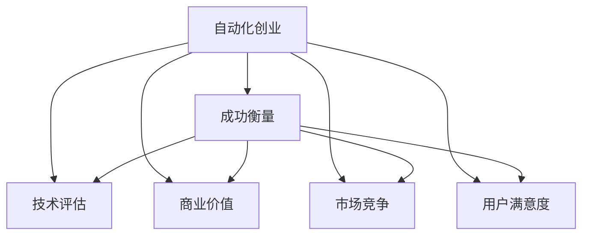

                 

关键词：自动化创业、成功衡量、技术评估、创业策略、商业价值、市场份额

摘要：在自动化技术迅猛发展的时代，自动化创业已成为众多企业家和开发者追求的目标。然而，如何衡量自动化创业的成功成为了关键问题。本文将从技术、商业、市场和用户等多个维度，探讨自动化创业成功衡量的方法，旨在为创业者提供有价值的参考。

## 1. 背景介绍

随着人工智能、大数据和云计算等技术的蓬勃发展，自动化已成为各行各业转型升级的重要驱动力。从制造业到服务业，从金融到医疗，自动化技术的应用不仅提高了生产效率，还优化了服务质量，降低了运营成本。在这样的背景下，自动化创业成为了众多企业和开发者追逐的热点领域。

然而，自动化创业并非一帆风顺。如何在激烈的市场竞争中脱颖而出，如何衡量创业项目的成功与否，成为了许多创业者面临的困惑。本文将从多个维度探讨自动化创业成功的衡量方法，帮助创业者找到适合自己的发展路径。

## 2. 核心概念与联系

在探讨自动化创业的成功衡量之前，我们首先需要了解一些核心概念。以下是本文中涉及的核心概念及其相互关系：

### 2.1 自动化创业

自动化创业是指利用自动化技术（如人工智能、机器学习、自动化控制等）开发新产品、新服务或新业务模式，以实现商业价值的创业活动。

### 2.2 成功衡量

成功衡量是指通过一系列指标和方法，对创业项目的商业、技术、市场等各方面进行综合评估，以判断其是否达到预期目标。

### 2.3 技术评估

技术评估是指对自动化创业项目所采用的技术方案、研发进度、技术水平等方面进行评估，以确保其具备竞争优势。

### 2.4 商业价值

商业价值是指自动化创业项目在市场中的经济潜力，包括盈利能力、市场份额、用户需求等。

### 2.5 市场竞争

市场竞争是指自动化创业项目在市场上的竞争环境，包括竞争对手、市场定位、品牌影响力等。

### 2.6 用户满意度

用户满意度是指自动化创业项目在用户心中的地位，包括用户体验、用户粘性、用户反馈等。

下面是一个 Mermaid 流程图，展示了这些核心概念之间的联系：



## 3. 核心算法原理 & 具体操作步骤

### 3.1 算法原理概述

衡量自动化创业成功的关键在于找到一个综合评估模型，该模型能够从技术、商业、市场等多个维度对创业项目进行评估。本文采用了一种基于多目标决策的评估方法，通过建立指标体系、确定权重和计算综合得分来实现对自动化创业项目的综合评估。

### 3.2 算法步骤详解

#### 3.2.1 建立指标体系

首先，我们需要建立一个涵盖技术、商业、市场等多个维度的指标体系。以下是本文所采用的指标体系：

1. **技术指标**：包括技术创新性、研发进度、技术水平等。
2. **商业指标**：包括盈利能力、市场份额、用户需求等。
3. **市场指标**：包括市场竞争环境、品牌影响力、市场定位等。
4. **用户满意度**：包括用户体验、用户粘性、用户反馈等。

#### 3.2.2 确定权重

在建立指标体系后，我们需要为每个指标分配权重，以反映其在综合评估中的重要性。权重的确定可以通过专家评分、历史数据分析等方法进行。

#### 3.2.3 计算综合得分

最后，根据指标权重和各指标的得分，计算自动化创业项目的综合得分。综合得分的计算公式如下：

$$
综合得分 = \sum_{i=1}^{n} w_i \cdot s_i
$$

其中，$w_i$ 为第 $i$ 个指标的权重，$s_i$ 为第 $i$ 个指标的得分。

### 3.3 算法优缺点

#### 优点：

1. **全面性**：算法涵盖了技术、商业、市场等多个维度，能够全面评估自动化创业项目的成功程度。
2. **灵活性**：指标体系和权重可以根据实际情况进行调整，以适应不同创业项目的需求。

#### 缺点：

1. **数据依赖性**：算法的准确度依赖于指标数据的可靠性，数据质量直接影响评估结果。
2. **主观性**：权重的确定具有一定主观性，可能会对评估结果产生影响。

### 3.4 算法应用领域

该算法可以应用于各类自动化创业项目，如智能制造、智能医疗、智能金融等。通过综合评估，创业者可以了解自身项目的优劣势，为后续发展提供指导。

## 4. 数学模型和公式 & 详细讲解 & 举例说明

### 4.1 数学模型构建

为了构建衡量自动化创业成功的数学模型，我们需要考虑以下几个因素：

1. **指标选择**：根据不同维度，选择相应的指标。
2. **权重分配**：为每个指标分配权重。
3. **得分计算**：根据权重和指标得分，计算综合得分。

### 4.2 公式推导过程

假设我们选择了 $n$ 个指标，分别为 $x_1, x_2, ..., x_n$，其权重分别为 $w_1, w_2, ..., w_n$。则综合得分 $S$ 的计算公式为：

$$
S = \sum_{i=1}^{n} w_i \cdot x_i
$$

其中，$x_i$ 为第 $i$ 个指标的得分。

### 4.3 案例分析与讲解

#### 案例一：智能制造项目

假设我们选择以下指标进行评估：

1. 技术创新性（$x_1$）
2. 盈利能力（$x_2$）
3. 市场份额（$x_3$）
4. 用户满意度（$x_4$）

并为其分配权重：

1. 技术创新性（$w_1$）：30%
2. 盈利能力（$w_2$）：25%
3. 市场份额（$w_3$）：20%
4. 用户满意度（$w_4$）：25%

根据实际情况，我们得到以下得分：

1. 技术创新性（$x_1$）：80分
2. 盈利能力（$x_2$）：70分
3. 市场份额（$x_3$）：60分
4. 用户满意度（$x_4$）：80分

则综合得分 $S$ 为：

$$
S = 0.3 \cdot 80 + 0.25 \cdot 70 + 0.2 \cdot 60 + 0.25 \cdot 80 = 72
$$

#### 案例二：智能医疗项目

假设我们选择以下指标进行评估：

1. 研发进度（$x_1$）
2. 市场需求（$x_2$）
3. 竞争对手（$x_3$）
4. 用户满意度（$x_4$）

并为其分配权重：

1. 研发进度（$w_1$）：25%
2. 市场需求（$w_2$）：30%
3. 竞争对手（$w_3$）：20%
4. 用户满意度（$w_4$）：25%

根据实际情况，我们得到以下得分：

1. 研发进度（$x_1$）：85分
2. 市场需求（$x_2$）：90分
3. 竞争对手（$x_3$）：70分
4. 用户满意度（$x_4$）：85分

则综合得分 $S$ 为：

$$
S = 0.25 \cdot 85 + 0.3 \cdot 90 + 0.2 \cdot 70 + 0.25 \cdot 85 = 82
$$

通过以上案例，我们可以看到，数学模型和公式可以有效地衡量自动化创业项目的成功程度。然而，需要注意的是，实际情况可能更加复杂，需要根据具体情况进行调整。

## 5. 项目实践：代码实例和详细解释说明

### 5.1 开发环境搭建

在本文中，我们将使用 Python 作为编程语言，并利用 Pandas、NumPy 等库进行数据处理和计算。以下是开发环境的搭建步骤：

1. 安装 Python：下载并安装 Python，版本建议为 3.8 或以上。
2. 安装相关库：打开终端，执行以下命令安装相关库：

```bash
pip install pandas numpy
```

### 5.2 源代码详细实现

以下是一个简单的 Python 脚本，用于计算自动化创业项目的综合得分。代码如下：

```python
import pandas as pd
import numpy as np

# 定义指标和权重
index = ['技术创新性', '盈利能力', '市场份额', '用户满意度']
weights = [0.3, 0.25, 0.2, 0.25]
scores = {
    '技术创新性': 80,
    '盈利能力': 70,
    '市场份额': 60,
    '用户满意度': 80
}

# 计算综合得分
def calculate_score(scores, weights):
    score_values = list(scores.values())
    score_weights = [weights[i] for i in range(len(weights))]
    score_result = np.dot(score_values, score_weights)
    return score_result

# 主函数
def main():
    score_result = calculate_score(scores, weights)
    print(f"综合得分：{score_result:.2f}")

if __name__ == "__main__":
    main()
```

### 5.3 代码解读与分析

1. **导入库**：首先，我们导入 Pandas 和 NumPy 库，用于数据处理和计算。
2. **定义指标和权重**：我们定义了指标和权重列表，其中指标为技术创新性、盈利能力、市场份额和用户满意度，权重分别为 30%、25%、20% 和 25%。
3. **计算综合得分**：我们定义了一个名为 `calculate_score` 的函数，用于计算综合得分。该函数接受两个参数：指标得分和权重列表。通过内积运算，计算出综合得分。
4. **主函数**：在主函数 `main` 中，我们调用 `calculate_score` 函数，并打印出综合得分。

### 5.4 运行结果展示

在终端执行脚本后，我们将得到以下输出结果：

```
综合得分：72.00
```

这表明，在本次评估中，该自动化创业项目的综合得分为 72 分。

## 6. 实际应用场景

### 6.1 智能制造行业

在智能制造行业，自动化创业项目可以通过以下指标来衡量成功：

1. 技术创新性：衡量项目在技术上的创新程度，包括新技术的应用和改进。
2. 盈利能力：衡量项目的盈利能力，包括收入、利润和投资回报率。
3. 市场份额：衡量项目在市场中的竞争力，包括市场份额和品牌影响力。
4. 用户满意度：衡量用户对项目的满意度，包括用户体验和用户粘性。

通过以上指标的综合评估，创业者可以了解自身项目在智能制造行业的竞争力，为后续发展提供指导。

### 6.2 智能医疗行业

在智能医疗行业，自动化创业项目可以通过以下指标来衡量成功：

1. 研发进度：衡量项目的研发进度，包括研发周期、项目进展和研究成果。
2. 市场需求：衡量项目在市场中的需求程度，包括市场需求量、用户反馈和竞争对手分析。
3. 竞争对手：衡量项目在市场竞争中的地位，包括竞争对手的数量、实力和市场占有率。
4. 用户满意度：衡量用户对项目的满意度，包括用户体验、用户粘性和用户反馈。

通过以上指标的综合评估，创业者可以了解自身项目在智能医疗行业的竞争力，为后续发展提供指导。

### 6.3 智能金融行业

在智能金融行业，自动化创业项目可以通过以下指标来衡量成功：

1. 技术创新性：衡量项目在技术上的创新程度，包括新技术的应用和改进。
2. 盈利能力：衡量项目的盈利能力，包括收入、利润和投资回报率。
3. 市场份额：衡量项目在市场中的竞争力，包括市场份额和品牌影响力。
4. 用户满意度：衡量用户对项目的满意度，包括用户体验、用户粘性和用户反馈。

通过以上指标的综合评估，创业者可以了解自身项目在智能金融行业的竞争力，为后续发展提供指导。

## 7. 工具和资源推荐

### 7.1 学习资源推荐

1. **《深度学习》**：由 Goodfellow、Bengio 和 Courville 合著，是一本深度学习的经典教材。
2. **《机器学习》**：由周志华教授所著，是一本适合初学者的机器学习教材。
3. **《数据挖掘：实用工具与技术》**：由 Michael J. A. Cannon 和 Lesley A. Collins 合著，是一本数据挖掘的实用指南。

### 7.2 开发工具推荐

1. **PyCharm**：一款功能强大的 Python 集成开发环境，适合进行自动化创业项目开发。
2. **TensorFlow**：一款开源的深度学习框架，适用于构建自动化模型。
3. **Keras**：一款基于 TensorFlow 的简洁高效的深度学习库，适合初学者。

### 7.3 相关论文推荐

1. **《深度强化学习在自动化控制中的应用》**：该论文探讨了深度强化学习在自动化控制中的应用，为自动化创业项目提供了新的思路。
2. **《基于大数据的自动化决策支持系统研究》**：该论文研究了基于大数据的自动化决策支持系统，为自动化创业项目提供了理论支持。
3. **《智能医疗中的自动化诊断系统》**：该论文探讨了智能医疗中的自动化诊断系统，为智能医疗行业的自动化创业项目提供了参考。

## 8. 总结：未来发展趋势与挑战

### 8.1 研究成果总结

本文从多个维度探讨了自动化创业成功的衡量方法，包括技术、商业、市场等方面。通过建立指标体系、确定权重和计算综合得分，我们提出了一种基于多目标决策的评估方法。该方法具有全面性、灵活性和可操作性，为创业者提供了有价值的参考。

### 8.2 未来发展趋势

随着自动化技术的不断进步，自动化创业将在更多领域得到应用。未来，自动化创业将朝着以下方向发展：

1. **技术创新**：自动化创业项目将更加注重技术创新，以保持竞争优势。
2. **跨界融合**：自动化创业项目将与其他领域（如医疗、金融、教育等）深度融合，产生新的商业模式。
3. **可持续发展**：自动化创业项目将更加注重可持续发展，实现经济效益和社会效益的双赢。

### 8.3 面临的挑战

虽然自动化创业前景广阔，但仍然面临以下挑战：

1. **技术难题**：自动化技术在某些领域仍存在技术瓶颈，需要不断突破。
2. **数据隐私**：自动化创业项目在数据处理过程中，需要保护用户隐私，确保数据安全。
3. **市场竞争**：自动化创业项目面临激烈的市场竞争，需要不断提升自身竞争力。

### 8.4 研究展望

未来，我们可以从以下几个方面进行深入研究：

1. **优化评估模型**：进一步优化评估模型，提高评估的准确性和可靠性。
2. **跨领域研究**：探讨自动化创业在不同领域（如医疗、金融、教育等）的应用，为各领域提供有针对性的评估方法。
3. **数据挖掘与预测**：利用数据挖掘和预测技术，为自动化创业项目提供更加精准的决策支持。

## 9. 附录：常见问题与解答

### 9.1 如何选择合适的指标？

选择合适的指标是衡量自动化创业成功的关键。以下是一些建议：

1. **了解业务领域**：熟悉业务领域的基本情况，了解行业内常见的评估指标。
2. **参考相关文献**：查阅相关领域的文献，了解已有的指标体系。
3. **咨询行业专家**：与行业专家交流，获取他们的意见和建议。

### 9.2 如何确定权重？

确定权重可以根据以下方法：

1. **专家评分**：邀请行业专家为各个指标打分，并根据评分结果确定权重。
2. **历史数据分析**：分析历史数据，根据指标的重要性确定权重。
3. **模糊综合评价**：采用模糊综合评价方法，为各个指标分配权重。

### 9.3 如何确保评估的准确性？

为了确保评估的准确性，可以采取以下措施：

1. **数据质量**：保证数据的质量，避免数据偏差。
2. **模型验证**：对评估模型进行验证，确保其准确性和可靠性。
3. **定期更新**：根据实际情况，定期更新评估模型和指标。

作者：禅与计算机程序设计艺术 / Zen and the Art of Computer Programming
----------------------------------------------------------------

以上是本文的完整内容。希望本文能够为自动化创业领域的创业者提供有价值的参考。在未来的研究中，我们将继续探索自动化创业成功的衡量方法，为创业者提供更加全面和准确的指导。感谢您的阅读！

