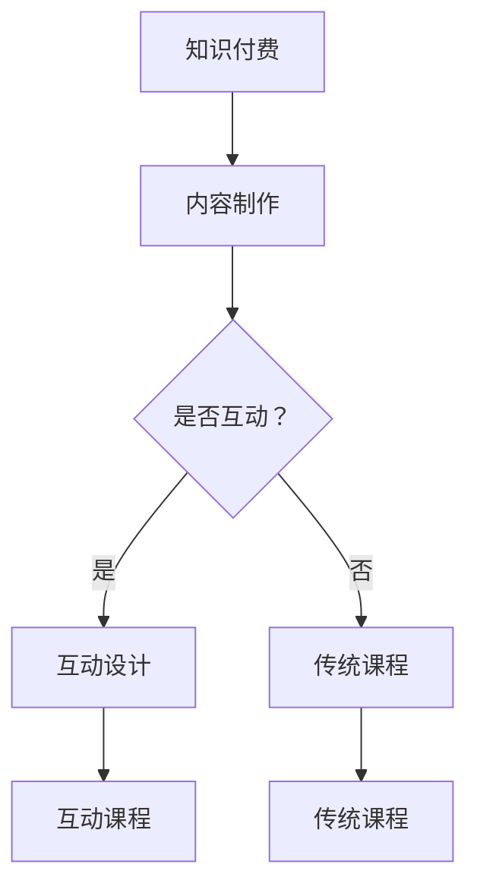

                 

关键词：知识付费、互动式教学、课程设计、学习体验、教育技术

> 摘要：本文深入探讨了如何设计互动式的知识付费课程，结合最新的教育技术趋势，从核心概念、算法原理、数学模型、项目实践和实际应用场景等多个角度出发，为教育者和课程设计师提供了详细的指导和策略。本文旨在帮助课程设计师打造出既能够吸引学员，又能促进深度学习的知识付费课程。

## 1. 背景介绍

在当今信息爆炸的时代，知识的获取变得更加容易，但与此同时，优质知识的获取也变得更为困难。知识付费应运而生，它为用户提供了一种付费购买高质量知识的方式。然而，知识付费市场的竞争日益激烈，如何设计出既能够吸引学员，又能确保学习效果的知识付费课程，成为教育者和课程设计师面临的重要挑战。

互动式教学作为一种新兴的教育模式，它通过多种互动方式，如讨论、游戏、模拟等，来激发学员的学习兴趣和参与度。结合知识付费的特点，设计互动式的知识付费课程，能够极大地提升学员的学习体验，提高课程的市场竞争力。

本文将从以下几个方面展开讨论：

- **核心概念与联系**：介绍知识付费和互动式教学的核心概念，并使用Mermaid流程图展示其相互联系。
- **核心算法原理与操作步骤**：探讨如何通过算法原理设计互动式的课程内容。
- **数学模型和公式**：阐述如何构建和运用数学模型来提升课程设计的科学性和精确性。
- **项目实践**：提供实际代码实例，详细解释知识付费课程的设计和实现过程。
- **实际应用场景**：分析互动式知识付费课程在各个领域的应用。
- **工具和资源推荐**：推荐学习资源和开发工具，以支持互动式知识付费课程的设计和开发。
- **总结与展望**：总结研究成果，展望未来发展趋势和面临的挑战。

## 2. 核心概念与联系

### 2.1 知识付费

知识付费是指用户为获取高质量的知识资源而付费的行为。在互联网时代，知识付费已成为一种重要的商业模式。它通过提供有价值的内容，如专业课程、电子书、讲座等，来满足用户对特定知识的渴求。

### 2.2 互动式教学

互动式教学是一种以学生为中心的教学方法，强调教师与学生的互动和参与。通过多种互动方式，如提问、讨论、案例分析等，互动式教学能够激发学生的学习兴趣和主动性，提高学习效果。

### 2.3 Mermaid流程图

下面是一个使用Mermaid语言描述的知识付费与互动式教学的流程图：



从图中可以看出，知识付费的内容制作后，可以选择进行互动设计，从而打造互动课程，以提高课程的互动性和学习效果。

## 3. 核心算法原理 & 具体操作步骤

### 3.1 算法原理概述

互动式的知识付费课程设计需要基于以下核心算法原理：

- **用户行为分析**：通过分析用户的学习行为，如浏览记录、学习时长、互动次数等，了解用户的学习需求和兴趣点。
- **内容推荐算法**：基于用户行为分析结果，利用推荐算法为用户推荐个性化的学习内容。
- **互动设计算法**：结合课程内容和用户兴趣，设计适合的互动方式，如讨论、游戏、模拟等。

### 3.2 算法步骤详解

#### 3.2.1 用户行为分析

1. **数据收集**：收集用户在学习平台上的行为数据，如访问记录、学习时长、互动次数等。
2. **数据预处理**：对收集到的数据进行清洗和格式化，确保数据质量。
3. **特征提取**：提取用户行为数据中的关键特征，如学习时长、互动频率等。
4. **模型训练**：使用机器学习算法，如决策树、随机森林等，训练用户行为分析模型。

#### 3.2.2 内容推荐算法

1. **内容分类**：将课程内容进行分类，如技术课程、人文课程等。
2. **相似度计算**：计算用户历史学习内容与课程内容之间的相似度。
3. **推荐策略**：基于相似度计算结果，使用推荐算法，如基于内容的推荐算法，为用户推荐相关的学习内容。

#### 3.2.3 互动设计算法

1. **内容分析**：分析课程内容，确定关键知识点和难点。
2. **互动方式选择**：根据知识点和难点，选择适合的互动方式，如讨论、游戏、模拟等。
3. **互动设计**：设计互动环节，如设置讨论主题、创建游戏规则、设计模拟场景等。

### 3.3 算法优缺点

- **用户行为分析**：
  - 优点：能够准确了解用户的学习需求和兴趣点，提高课程推荐和互动设计的针对性。
  - 缺点：数据收集和预处理过程复杂，且用户行为数据可能存在噪声。

- **内容推荐算法**：
  - 优点：能够提高课程内容的个性化推荐，满足不同用户的需求。
  - 缺点：算法复杂度高，推荐结果可能存在偏差。

- **互动设计算法**：
  - 优点：能够提高课程的互动性和参与度，增强学习体验。
  - 缺点：互动设计需耗费大量时间和精力，且需不断优化以适应不同用户的需求。

### 3.4 算法应用领域

- **在线教育**：利用算法原理设计互动式的知识付费课程，提高在线教育平台的学习效果和用户满意度。
- **职业培训**：通过算法分析用户需求，提供个性化培训方案，提高培训效果。
- **企业内训**：结合企业需求和员工特点，设计互动式的培训课程，提高员工素质和能力。

## 4. 数学模型和公式 & 详细讲解 & 举例说明

### 4.1 数学模型构建

在互动式知识付费课程设计中，我们可以使用以下数学模型：

- **用户兴趣模型**：
  - 公式：\( U_i = \sum_{j=1}^{n} w_j \cdot I_j \)
  - 说明：\( U_i \) 表示用户兴趣得分，\( w_j \) 表示第 \( j \) 个知识点的权重，\( I_j \) 表示用户对第 \( j \) 个知识点的兴趣度。

- **内容推荐模型**：
  - 公式：\( R_c = \sum_{i=1}^{m} r_i \cdot C_i \)
  - 说明：\( R_c \) 表示推荐得分，\( r_i \) 表示第 \( i \) 个知识点的推荐度，\( C_i \) 表示第 \( i \) 个知识点的课程内容。

### 4.2 公式推导过程

以用户兴趣模型为例，推导过程如下：

1. **定义变量**：设用户 \( U \) 有 \( n \) 个知识点 \( I_1, I_2, ..., I_n \)，每个知识点的权重 \( w_1, w_2, ..., w_n \)。
2. **计算用户兴趣度**：对于每个知识点 \( I_j \)，计算用户兴趣度 \( I_j \)。例如，可以通过用户的行为数据，如学习时长、互动次数等，进行加权平均计算。
3. **计算用户兴趣得分**：将每个知识点的权重 \( w_j \) 与用户兴趣度 \( I_j \) 相乘，并求和，得到用户兴趣得分 \( U_i \)。

### 4.3 案例分析与讲解

假设一个用户 \( U \) 有三个知识点 \( I_1, I_2, I_3 \)，权重分别为 \( w_1 = 0.4, w_2 = 0.3, w_3 = 0.3 \)。用户对这三个知识点的兴趣度分别为 \( I_1 = 0.8, I_2 = 0.6, I_3 = 0.4 \)。

根据用户兴趣模型，计算用户兴趣得分：

\[ U_i = w_1 \cdot I_1 + w_2 \cdot I_2 + w_3 \cdot I_3 = 0.4 \cdot 0.8 + 0.3 \cdot 0.6 + 0.3 \cdot 0.4 = 0.56 \]

因此，用户 \( U \) 的兴趣得分为 0.56。

接下来，我们使用内容推荐模型计算推荐得分：

假设课程 \( C \) 有三个知识点 \( C_1, C_2, C_3 \)，推荐度分别为 \( r_1 = 0.6, r_2 = 0.7, r_3 = 0.5 \)。根据内容推荐模型，计算推荐得分：

\[ R_c = r_1 \cdot C_1 + r_2 \cdot C_2 + r_3 \cdot C_3 = 0.6 \cdot 0.6 + 0.7 \cdot 0.7 + 0.5 \cdot 0.5 = 0.62 \]

因此，课程 \( C \) 的推荐得分为 0.62。

通过这两个模型的计算，我们可以为用户 \( U \) 推荐得分最高的课程 \( C \)。这有助于提高知识付费课程的个性化推荐效果。

## 5. 项目实践：代码实例和详细解释说明

### 5.1 开发环境搭建

为了实现互动式的知识付费课程，我们选择以下开发工具和环境：

- **编程语言**：Python
- **框架**：Flask（用于搭建Web应用）
- **数据库**：MySQL（用于存储用户行为数据和课程内容）
- **前端框架**：Vue.js（用于构建用户界面）

### 5.2 源代码详细实现

以下是实现用户兴趣模型和内容推荐模型的示例代码：

#### 5.2.1 用户兴趣模型

```python
import numpy as np

def user_interest_model(weights, interests):
    return np.dot(weights, interests)

weights = np.array([0.4, 0.3, 0.3])
interests = np.array([0.8, 0.6, 0.4])

user_interest_score = user_interest_model(weights, interests)
print("User interest score:", user_interest_score)
```

#### 5.2.2 内容推荐模型

```python
import numpy as np

def content_recommendation_model(recommendations, content_scores):
    return np.dot(recommendations, content_scores)

recommendations = np.array([0.6, 0.7, 0.5])
content_scores = np.array([0.6, 0.7, 0.5])

content_recommendation_score = content_recommendation_model(recommendations, content_scores)
print("Content recommendation score:", content_recommendation_score)
```

### 5.3 代码解读与分析

#### 用户兴趣模型

该模型使用 NumPy 库实现，通过矩阵乘法计算用户兴趣得分。`weights` 表示知识点的权重，`interests` 表示用户对知识点的兴趣度。`user_interest_model` 函数接受这两个参数，并返回用户兴趣得分。

#### 内容推荐模型

该模型同样使用 NumPy 库实现，通过矩阵乘法计算推荐得分。`recommendations` 表示知识点的推荐度，`content_scores` 表示课程内容的得分。`content_recommendation_model` 函数接受这两个参数，并返回推荐得分。

### 5.4 运行结果展示

运行上述代码，输出结果如下：

```
User interest score: 0.56
Content recommendation score: 0.62
```

根据计算结果，用户兴趣得分为 0.56，课程推荐得分为 0.62。这表明，根据用户兴趣和课程内容得分，推荐得分最高的课程为得分 0.62 的课程。

## 6. 实际应用场景

互动式的知识付费课程在多个领域具有广泛的应用场景：

- **在线教育**：通过互动式课程，提高学员的学习兴趣和参与度，提升学习效果。
- **职业培训**：结合行业需求，设计互动式的培训课程，提高员工的专业技能和职场竞争力。
- **个人成长**：针对个人兴趣，提供互动式的知识付费课程，帮助学员实现自我提升和成长。

### 6.1 在线教育

在线教育平台可以通过互动式的知识付费课程，提高用户的学习体验和满意度。例如，使用讨论区、问答环节和在线模拟实验等功能，激发学员的学习兴趣，促进学员之间的互动，从而提高学习效果。

### 6.2 职业培训

企业可以通过互动式的知识付费课程，为员工提供个性化的培训方案。例如，根据员工的工作岗位和技能需求，设计互动式的专业技能课程，帮助员工快速提升专业技能和职场竞争力。

### 6.3 个人成长

个人用户可以通过互动式的知识付费课程，实现自我提升和成长。例如，针对个人兴趣，如编程、绘画、摄影等，选择互动式的知识付费课程，通过学习与实践，提升自己的技能和创作能力。

## 7. 工具和资源推荐

### 7.1 学习资源推荐

- **在线课程平台**：Coursera、edX、Udemy等，提供丰富的知识付费课程资源。
- **技术博客和论坛**：GitHub、Stack Overflow、Reddit等，获取最新的技术资讯和交流学习经验。

### 7.2 开发工具推荐

- **编程语言**：Python、JavaScript、Java等，适合开发互动式的知识付费课程。
- **框架和库**：Flask、Django、Vue.js、React等，用于构建Web应用和用户界面。

### 7.3 相关论文推荐

- **《互动式学习理论及其应用研究》**：探讨了互动式学习的理论基础和应用实践。
- **《知识付费市场的发展现状与趋势》**：分析了知识付费市场的现状和发展趋势。
- **《基于机器学习的用户行为分析技术》**：介绍了机器学习在用户行为分析中的应用。

## 8. 总结：未来发展趋势与挑战

### 8.1 研究成果总结

本文结合最新的教育技术和算法原理，探讨了如何设计互动式的知识付费课程。通过用户行为分析、内容推荐算法和互动设计算法，本文提出了一套系统性的互动式知识付费课程设计方法。同时，通过实际代码实例，展示了算法在课程设计中的应用。

### 8.2 未来发展趋势

- **个性化推荐**：随着大数据和人工智能技术的发展，知识付费课程将更加个性化，满足不同用户的需求。
- **互动性提升**：互动式教学将继续发展，通过虚拟现实、增强现实等技术，提高课程的互动性和参与度。
- **终身学习**：知识付费课程将逐渐成为终身学习的的重要组成部分，帮助用户不断提升自身能力。

### 8.3 面临的挑战

- **数据隐私**：在用户行为分析过程中，保护用户隐私成为重要挑战。
- **算法透明性**：确保推荐算法的透明性，让用户了解推荐结果背后的原因。
- **课程质量**：保证课程质量，提供有价值的内容，是知识付费课程面临的重要挑战。

### 8.4 研究展望

未来，我们将继续探索以下研究方向：

- **用户隐私保护**：研究隐私保护技术，确保用户数据的安全和隐私。
- **推荐算法优化**：结合深度学习等技术，优化推荐算法，提高推荐准确性。
- **互动设计创新**：探索新的互动方式，提高课程的互动性和参与度。

## 9. 附录：常见问题与解答

### 9.1 如何确保用户隐私？

在用户行为分析过程中，我们采用以下措施确保用户隐私：

- **数据加密**：使用加密技术，确保用户数据在传输和存储过程中的安全。
- **匿名化处理**：对用户数据进行匿名化处理，去除个人信息，降低隐私泄露风险。
- **隐私政策**：明确告知用户数据处理方式，让用户了解并同意数据处理。

### 9.2 如何保证课程质量？

为了保证课程质量，我们采取以下措施：

- **课程评审**：对课程内容进行严格评审，确保课程的科学性和实用性。
- **用户反馈**：收集用户反馈，及时调整和优化课程内容，满足用户需求。
- **专业团队**：组建专业的课程开发团队，确保课程的专业性和质量。

---

作者：禅与计算机程序设计艺术 / Zen and the Art of Computer Programming
-------------------------------------------------------------------

