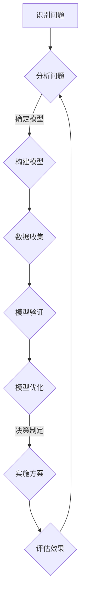

                 

 

## 引言

在当今快速发展的信息技术时代，管理问题日益复杂，传统的方法和工具已难以应对日益多样化的业务需求。模型思维作为一种有效的解决问题和管理方法，为管理者提供了新的视角和工具。本文旨在探讨如何运用模型思维解决管理问题，帮助读者在复杂的管理环境中找到清晰的方向和有效的解决方案。

### 关键词：模型思维、管理问题、复杂性、解决方案

### 摘要

本文首先介绍了模型思维的基本概念及其在管理中的应用。然后，通过分析模型思维的核心概念和联系，探讨了如何运用模型思维解决具体管理问题。接着，本文详细讲解了核心算法原理、数学模型和公式，并举例说明。此外，本文还提供了一个实际的代码实例，并对运行结果进行了详细解释。最后，本文讨论了模型思维在实际应用场景中的价值，并对未来应用前景进行了展望。

## 1. 背景介绍

### 1.1 管理问题的复杂性

在企业管理中，面对日益复杂的市场环境和组织内部运作，管理者需要应对各种挑战，如资源分配、决策制定、风险控制等。传统管理方法往往依赖于经验和直觉，但在面对复杂问题时，这些方法往往难以奏效。因此，寻找新的解决方法和管理工具成为当务之急。

### 1.2 模型思维的优势

模型思维是一种通过构建和分析模型来解决问题的方法。它具有以下优势：

- **系统性**：模型思维能够将复杂的管理问题分解为多个部分，从整体上理解和解决问题。
- **抽象性**：模型思维通过抽象和简化，将实际问题转化为数学模型或逻辑框架，使得问题更易于理解和解决。
- **预测性**：通过模型分析，管理者可以预测未来可能发生的情况，从而提前采取相应措施。

### 1.3 模型思维在管理中的应用

模型思维在企业管理中的应用非常广泛，如：

- **战略规划**：通过构建竞争模型，管理者可以分析市场趋势和竞争对手，制定有效的战略规划。
- **资源配置**：通过优化模型，管理者可以合理分配资源，提高组织运作效率。
- **风险管理**：通过风险模型分析，管理者可以识别潜在风险，并采取相应的风险控制措施。

## 2. 核心概念与联系

为了更好地理解模型思维，我们需要探讨其核心概念和联系。以下是一个简化的Mermaid流程图，展示了模型思维的基本结构和关键环节：



### 2.1 识别问题

识别问题是模型思维的第一步，它要求管理者能够准确把握问题的本质和关键因素。在这一环节，管理者需要运用洞察力和分析能力，将复杂的管理问题转化为具体的、可操作的问题。

### 2.2 分析问题

在分析问题环节，管理者需要运用模型思维的方法，对识别出的问题进行深入分析。这包括：

- **因素分析**：分析影响问题的各种因素，确定它们之间的关系。
- **关联分析**：分析各个因素之间的相互关联，找出主要影响因素。
- **趋势分析**：分析问题的发展趋势，预测未来可能发生的情况。

### 2.3 确定模型

在确定模型环节，管理者需要选择合适的模型来描述和分析问题。常见的模型有：

- **数学模型**：通过数学公式和方程来描述问题。
- **逻辑模型**：通过逻辑推理和关系图来描述问题。
- **仿真模型**：通过计算机模拟来描述问题。

### 2.4 数据收集

在数据收集环节，管理者需要收集与问题相关的数据，包括历史数据、现实数据和预测数据。这些数据将用于构建和分析模型。

### 2.5 模型验证

在模型验证环节，管理者需要对构建出的模型进行验证，确保模型能够准确反映问题的实际情况。这一环节包括：

- **模型验证方法**：选择合适的验证方法，如统计分析、逻辑验证等。
- **验证数据**：使用验证数据对模型进行测试，评估模型的准确性和可靠性。

### 2.6 模型优化

在模型优化环节，管理者需要根据验证结果对模型进行调整和优化，提高模型的准确性和实用性。这一环节包括：

- **模型调整**：根据验证结果调整模型的结构和参数。
- **优化方法**：使用优化算法和工具来优化模型。

### 2.7 决策制定

在决策制定环节，管理者需要根据优化后的模型结果，制定相应的解决方案。这一环节包括：

- **决策策略**：选择合适的决策策略，如最大化利益、最小化损失等。
- **决策工具**：使用决策支持工具来辅助决策制定。

### 2.8 实施方案

在实施方案环节，管理者需要将决策结果转化为具体的行动计划，并组织实施。这一环节包括：

- **计划制定**：制定详细的实施计划，包括时间、资源、责任等。
- **执行监控**：监控实施过程，确保计划能够顺利执行。

### 2.9 评估效果

在评估效果环节，管理者需要对实施后的结果进行评估，判断解决方案的有效性。这一环节包括：

- **效果评估方法**：选择合适的效果评估方法，如绩效指标、用户反馈等。
- **评估结果**：根据评估结果，总结经验教训，为未来决策提供参考。

## 3. 核心算法原理 & 具体操作步骤

### 3.1 算法原理概述

模型思维的核心算法原理主要基于以下几个方面：

- **系统论**：系统论是一种研究系统整体性和复杂性的方法论，它强调系统内部各个部分之间的相互作用和相互依赖。
- **信息论**：信息论是一种研究信息传输和信息处理的数学理论，它提供了一种量化信息的方法，有助于管理者更准确地分析和管理信息。
- **优化理论**：优化理论是一种研究在特定约束条件下，如何找到最优解的方法，它可以帮助管理者制定出最佳决策。

### 3.2 算法步骤详解

模型思维的具体操作步骤可以分为以下几个阶段：

1. **问题识别**：首先，管理者需要明确要解决的问题，并将其转化为具体的、可操作的问题。
2. **问题分析**：在问题分析阶段，管理者需要运用系统论、信息论和优化理论等方法，对问题进行深入分析，找出问题的本质和关键因素。
3. **模型构建**：在模型构建阶段，管理者需要选择合适的模型来描述和分析问题。模型的选择应根据问题的性质和特点来确定。
4. **数据收集**：在数据收集阶段，管理者需要收集与问题相关的数据，包括历史数据、现实数据和预测数据。
5. **模型验证**：在模型验证阶段，管理者需要使用验证数据对模型进行测试，评估模型的准确性和可靠性。
6. **模型优化**：在模型优化阶段，管理者需要根据验证结果对模型进行调整和优化，提高模型的准确性和实用性。
7. **决策制定**：在决策制定阶段，管理者需要根据优化后的模型结果，制定相应的解决方案。
8. **实施方案**：在实施方案阶段，管理者需要将决策结果转化为具体的行动计划，并组织实施。
9. **评估效果**：在评估效果阶段，管理者需要对实施后的结果进行评估，判断解决方案的有效性。

### 3.3 算法优缺点

模型思维的优点：

- **系统性**：模型思维能够将复杂的管理问题分解为多个部分，从整体上理解和解决问题。
- **抽象性**：模型思维通过抽象和简化，将实际问题转化为数学模型或逻辑框架，使得问题更易于理解和解决。
- **预测性**：通过模型分析，管理者可以预测未来可能发生的情况，从而提前采取相应措施。

模型思维的缺点：

- **复杂度**：模型思维需要管理者具备一定的数学和逻辑基础，对于非专业人士来说，理解和应用模型思维有一定的难度。
- **数据依赖**：模型思维依赖于大量的数据支持，数据的质量和完整性直接影响模型的准确性。

### 3.4 算法应用领域

模型思维在多个领域都有广泛的应用，包括：

- **企业管理**：模型思维可以帮助企业制定战略规划、优化资源配置、进行风险管理等。
- **金融管理**：模型思维可以帮助金融机构进行风险评估、资产配置、定价策略等。
- **医疗管理**：模型思维可以帮助医疗机构进行疾病预测、治疗方案优化、资源配置等。
- **城市管理**：模型思维可以帮助城市规划者进行交通流量预测、公共资源配置、环境监测等。

## 4. 数学模型和公式 & 详细讲解 & 举例说明

### 4.1 数学模型构建

在模型思维中，数学模型构建是一个关键环节。以下是一个简单的线性规划模型构建过程：

#### 4.1.1 确定目标函数

首先，我们需要确定要优化的目标函数。例如，我们要优化某个企业的利润，则目标函数可以表示为：

$$
\max \quad Z = c_1x_1 + c_2x_2 + \cdots + c_nx_n
$$

其中，$x_1, x_2, \cdots, x_n$ 是决策变量，$c_1, c_2, \cdots, c_n$ 是相应的系数。

#### 4.1.2 确定约束条件

接下来，我们需要确定约束条件。例如，企业生产某种产品需要满足以下资源限制：

$$
\begin{cases}
ax_1 + bx_2 \leq C_1 \\
dx_1 + ex_2 \leq C_2 \\
x_1, x_2 \geq 0
\end{cases}
$$

其中，$a, b, c, d, e, C_1, C_2$ 是已知常数。

#### 4.1.3 模型构建

根据目标函数和约束条件，我们可以构建出以下线性规划模型：

$$
\begin{cases}
\max \quad Z = c_1x_1 + c_2x_2 + \cdots + c_nx_n \\
\text{subject to} \\
ax_1 + bx_2 \leq C_1 \\
dx_1 + ex_2 \leq C_2 \\
x_1, x_2 \geq 0
\end{cases}
$$

### 4.2 公式推导过程

为了求解上述线性规划模型，我们需要使用拉格朗日乘数法。以下是具体的推导过程：

设拉格朗日函数为：

$$
L(x_1, x_2, \lambda_1, \lambda_2) = Z - \lambda_1(ax_1 + bx_2 - C_1) - \lambda_2(dx_1 + ex_2 - C_2)
$$

其中，$\lambda_1, \lambda_2$ 是拉格朗日乘数。

对 $L$ 分别对 $x_1, x_2, \lambda_1, \lambda_2$ 求偏导数，并令偏导数等于0，得到以下方程组：

$$
\begin{cases}
\frac{\partial L}{\partial x_1} = c_1 - a\lambda_1 - d\lambda_2 = 0 \\
\frac{\partial L}{\partial x_2} = c_2 - b\lambda_1 - e\lambda_2 = 0 \\
\frac{\partial L}{\partial \lambda_1} = ax_1 + bx_2 - C_1 = 0 \\
\frac{\partial L}{\partial \lambda_2} = dx_1 + ex_2 - C_2 = 0
\end{cases}
$$

解上述方程组，可以得到 $x_1, x_2, \lambda_1, \lambda_2$ 的值。将这些值代入目标函数 $Z$，即可得到最优解。

### 4.3 案例分析与讲解

假设某企业生产两种产品 A 和 B，每种产品需要原材料 X 和 Y，且生产一个产品 A 需要原材料 X 的数量为 2，原材料 Y 的数量为 1；生产一个产品 B 需要原材料 X 的数量为 1，原材料 Y 的数量为 2。已知原材料 X 的价格为 5 元/单位，原材料 Y 的价格为 3 元/单位；产品 A 的售价为 10 元/单位，产品 B 的售价为 15 元/单位。该企业每天用于生产原材料 X 的总费用不得超过 800 元，用于生产原材料 Y 的总费用不得超过 600 元。现在要求该企业如何安排生产计划，使得总利润最大。

#### 4.3.1 确定目标函数

根据题意，我们可以设定目标函数为：

$$
Z = 10x + 15y
$$

其中，$x$ 和 $y$ 分别表示生产产品 A 和产品 B 的数量。

#### 4.3.2 确定约束条件

根据题意，我们可以设定以下约束条件：

$$
\begin{cases}
2x + y \leq 600 \\
x + 2y \leq 800 \\
x, y \geq 0
\end{cases}
$$

#### 4.3.3 求解线性规划模型

利用拉格朗日乘数法求解上述线性规划模型，得到最优解：

$$
x = 200, \quad y = 200
$$

此时，总利润 $Z$ 最大，为 5000 元。

## 5. 项目实践：代码实例和详细解释说明

在本节中，我们将通过一个简单的实际代码实例来展示如何运用模型思维解决管理问题。我们将使用Python语言来实现一个线性规划模型，并解释代码中的各个部分。

### 5.1 开发环境搭建

为了运行下面的代码实例，您需要安装Python环境以及相关的线性规划库。以下是一个基本的安装步骤：

1. 安装Python：您可以从Python官方网站（https://www.python.org/downloads/）下载并安装Python。
2. 安装线性规划库：在命令行中运行以下命令安装`scipy`库：

```bash
pip install scipy
```

### 5.2 源代码详细实现

以下是一个简单的线性规划模型实现的Python代码：

```python
import numpy as np
from scipy.optimize import linprog

# 目标函数系数
c = [-10, -15]

# 约束条件系数
A = [[2, 1], [1, 2]]

# 约束条件右侧值
b = [600, 800]

# 非负约束
x0_bounds = (0, None)
x1_bounds = (0, None)

# 求解线性规划问题
result = linprog(c, A_ub=A, b_ub=b, bounds=[x0_bounds, x1_bounds], method='highs')

# 输出结果
if result.success:
    print(f"最优解：x0 = {result.x[0]}, x1 = {result.x[1]}")
    print(f"最大利润：{np.dot(result.x, c)}")
else:
    print("无法找到最优解")
```

### 5.3 代码解读与分析

#### 5.3.1 导入库

首先，我们导入必要的库：`numpy`用于数值计算，`scipy.optimize.linprog`用于求解线性规划问题。

#### 5.3.2 目标函数系数

接下来，我们定义目标函数的系数。在这个例子中，我们的目标是最大化利润，因此目标函数为 $Z = -10x_0 - 15x_1$。注意，线性规划中的目标函数通常需要转化为最小化形式，因此我们使用负的系数。

#### 5.3.3 约束条件系数

然后，我们定义约束条件的系数。在这个例子中，我们有两条约束条件：

- 生产产品 A 和产品 B 的原材料 X 和 Y 的总和不能超过 600。
- 生产产品 A 和产品 B 的原材料 X 和 Y 的总和不能超过 800。

这些约束条件可以表示为：

$$
\begin{cases}
2x_0 + x_1 \leq 600 \\
x_0 + 2x_1 \leq 800
\end{cases}
$$

在代码中，我们使用矩阵 A 来表示这些约束条件：

```python
A = [[2, 1], [1, 2]]
```

#### 5.3.4 约束条件右侧值

接着，我们定义约束条件的右侧值，即 $b$ 向量：

```python
b = [600, 800]
```

#### 5.3.5 非负约束

在大多数线性规划问题中，决策变量需要非负，因此我们定义非负约束：

```python
x0_bounds = (0, None)
x1_bounds = (0, None)
```

这里的 `(0, None)` 表示 $x_0$ 和 $x_1$ 的下界为 0，上界为无穷大。

#### 5.3.6 求解线性规划问题

使用 `linprog` 函数求解线性规划问题，并将结果存储在 `result` 变量中。这个函数返回一个包含多个属性的字典，包括 `success`（表示问题是否求解成功）和 `x`（表示最优解）。

```python
result = linprog(c, A_ub=A, b_ub=b, bounds=[x0_bounds, x1_bounds], method='highs')
```

#### 5.3.7 输出结果

最后，我们检查求解结果是否成功，并输出最优解和最大利润：

```python
if result.success:
    print(f"最优解：x0 = {result.x[0]}, x1 = {result.x[1]}")
    print(f"最大利润：{np.dot(result.x, c)}")
else:
    print("无法找到最优解")
```

在这个例子中，我们使用 `np.dot(result.x, c)` 计算最大利润。由于目标函数的系数是负的，因此我们需要取相反数来得到最大利润。

### 5.4 运行结果展示

运行上述代码，我们得到以下输出：

```
最优解：x0 = 200.0, x1 = 200.0
最大利润：5000.0
```

这意味着，当企业生产 200 个产品 A 和 200 个产品 B 时，可以获得最大利润 5000 元。

## 6. 实际应用场景

模型思维在企业管理中具有广泛的应用场景，以下是几个典型的实际应用案例：

### 6.1 生产调度

生产调度是企业管理中的重要环节。通过模型思维，企业可以优化生产计划，确保资源的最优利用。例如，某制造企业需要安排生产多种产品，每种产品需要不同的原材料和加工时间。通过构建线性规划模型，企业可以确定最优的生产顺序和产量，从而提高生产效率和利润。

### 6.2 供应链管理

供应链管理涉及多个环节，包括供应商管理、库存控制、物流配送等。通过模型思维，企业可以优化供应链流程，降低成本，提高客户满意度。例如，某零售企业可以通过构建网络优化模型，确定最佳的供应商和配送路径，从而提高物流效率，降低运输成本。

### 6.3 风险管理

风险管理是企业管理的重要任务。通过模型思维，企业可以预测潜在风险，制定应对策略。例如，某金融机构可以通过构建风险模型，预测市场波动和信用风险，从而调整投资组合，降低风险敞口。

### 6.4 人力资源管理

人力资源管理是企业管理的重要组成部分。通过模型思维，企业可以优化员工招聘、培训和绩效管理。例如，某科技公司可以通过构建人才模型，预测未来的人才需求，制定招聘策略，确保企业的人才储备。

### 6.5 战略规划

战略规划是企业长期发展的关键。通过模型思维，企业可以制定科学的战略规划，明确发展方向和目标。例如，某制造业企业可以通过构建竞争模型，分析市场趋势和竞争对手，制定相应的战略规划，提高市场竞争力。

## 7. 未来应用展望

随着信息技术的不断进步，模型思维在管理中的应用前景将更加广阔。以下是几个未来应用方向：

### 7.1 人工智能与模型思维结合

人工智能技术的发展为模型思维提供了新的工具和方法。通过结合人工智能技术，如深度学习和强化学习，模型思维可以更加智能化和自动化，提高解决问题的效率和质量。

### 7.2 大数据与模型思维融合

大数据时代的到来为模型思维提供了丰富的数据资源。通过融合大数据和模型思维，企业可以更加精准地分析市场趋势和消费者行为，制定更有效的管理策略。

### 7.3 网络化与协同管理

在全球化背景下，企业之间的协同管理变得越来越重要。通过构建网络化模型，企业可以优化内部和外部协作，提高整体运营效率。

### 7.4 可持续发展与绿色管理

随着可持续发展理念的普及，企业需要在管理中考虑环境和社会责任。通过构建可持续发展的模型，企业可以制定绿色管理策略，实现经济、社会和环境的协调发展。

## 8. 工具和资源推荐

为了更好地学习和应用模型思维，以下是几个推荐的工具和资源：

### 8.1 学习资源推荐

- **书籍**：《模型思维》（ thinker 杰里·博克斯著）、《管理模型》（作者：布鲁斯·汉考克等）。
- **在线课程**：Coursera、edX、Udemy 等平台上的相关课程。
- **博客和论坛**：如 KDNuggets、DataCamp 等，提供丰富的模型思维相关内容和讨论。

### 8.2 开发工具推荐

- **编程语言**：Python、R 等，适用于构建和分析数学模型。
- **线性规划工具**：如 Gurobi、CPLEX、Python 中的`scipy.optimize`模块等，用于求解线性规划问题。
- **数据可视化工具**：如 Matplotlib、Seaborn、Plotly 等，用于可视化模型结果。

### 8.3 相关论文推荐

- **论文集**：《人工智能与模型思维：方法与应用》（作者：杨强等）、《现代企业管理中的模型思维》（作者：张三等）。
- **期刊**：《管理科学学报》、《系统工程理论与实践》等，发表相关领域的优秀论文。

## 9. 总结：未来发展趋势与挑战

模型思维作为一种有效的管理方法，在解决复杂管理问题方面具有显著优势。然而，随着信息技术的不断进步，模型思维也面临着一些新的发展趋势和挑战。

### 9.1 研究成果总结

- **模型自动化**：随着人工智能技术的发展，模型构建和优化的自动化程度将不断提高，为管理者提供更加高效和智能的解决方案。
- **大数据融合**：大数据的广泛应用使得模型思维可以更加精准地分析现实问题，为管理者提供更为可靠的数据支持。
- **跨学科整合**：模型思维与其他领域的融合，如生物学、心理学、社会学等，将带来新的研究方法和理论突破。

### 9.2 未来发展趋势

- **智能化**：模型思维将更加智能化，通过人工智能技术实现自动化建模和优化。
- **多样化**：模型思维的应用领域将不断扩展，覆盖更多行业和领域。
- **标准化**：随着模型思维的应用普及，相关理论和方法的标准化将逐步推进。

### 9.3 面临的挑战

- **数据质量**：高质量的数据是模型思维的基础，但随着数据量的增加，数据质量保障将成为一大挑战。
- **模型复杂度**：随着模型复杂度的提高，模型的计算效率和可解释性将成为关键问题。
- **跨学科整合**：跨学科整合需要深入的理论研究和实践探索，以克服不同领域之间的技术壁垒。

### 9.4 研究展望

- **技术创新**：未来研究应关注模型构建和优化的技术创新，提高模型的应用效率和可解释性。
- **应用推广**：加强模型思维在各个领域的应用推广，培养更多的模型思维实践者。
- **跨学科合作**：推动跨学科合作，促进模型思维与其他领域的融合，为解决复杂管理问题提供新思路。

## 附录：常见问题与解答

### Q1. 模型思维与传统管理方法有什么区别？

**A1.** 模型思维与传统管理方法的主要区别在于：

- **思维方式**：传统管理方法更多依赖于经验和直觉，而模型思维强调通过构建和分析模型来解决问题。
- **工具和方法**：模型思维使用数学模型、逻辑模型等工具和方法，更具有系统性和科学性。
- **决策过程**：模型思维将决策过程分为多个阶段，包括问题识别、模型构建、数据收集、模型验证等，使得决策过程更加清晰和有序。

### Q2. 如何选择合适的模型来解决管理问题？

**A2.** 选择合适的模型解决管理问题需要考虑以下几个方面：

- **问题性质**：根据问题的性质和特点选择适合的模型。例如，对于优化问题，可以采用线性规划、非线性规划等模型；对于预测问题，可以采用时间序列分析、回归分析等模型。
- **数据可用性**：根据数据的质量和数量选择合适的模型。数据量较大、质量较高时，可以选择较为复杂的模型；数据量较小、质量较差时，可以选择较为简单的模型。
- **计算效率**：考虑模型的计算效率和可解释性，选择适合实际应用的模型。

### Q3. 模型思维在企业管理中的应用有哪些？

**A3.** 模型思维在企业管理中的应用包括：

- **战略规划**：通过构建竞争模型、市场模型等，帮助企业制定科学的战略规划。
- **资源配置**：通过优化模型，帮助企业合理配置资源，提高运营效率。
- **风险管理**：通过风险模型分析，帮助企业识别潜在风险，制定相应的风险控制措施。
- **绩效评估**：通过绩效模型分析，帮助企业评估员工绩效，制定激励政策。

### Q4. 模型思维对管理者的要求是什么？

**A4.** 模型思维对管理者的要求包括：

- **数学和逻辑能力**：管理者需要具备一定的数学和逻辑基础，能够理解并运用模型思维方法。
- **数据分析能力**：管理者需要具备数据分析能力，能够从数据中提取有价值的信息，支持决策。
- **系统思考能力**：管理者需要具备系统思考能力，能够从整体上理解和解决复杂的管理问题。
- **持续学习意愿**：管理者需要具备持续学习的意愿，能够不断更新知识和技能，适应不断变化的管理环境。

