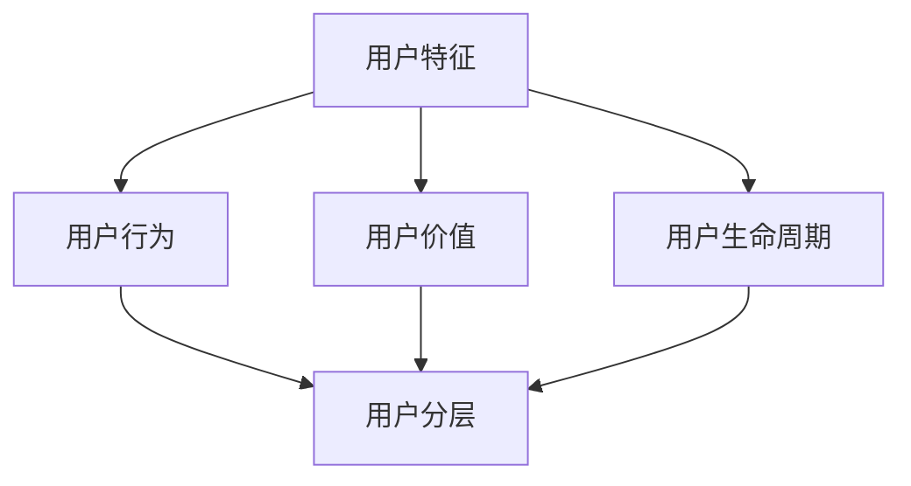

                 

关键词：用户分层、数据分析、用户行为、个性化推荐、数据挖掘、算法优化

> 摘要：本文将深入探讨如何进行有效的用户分层，包括背景介绍、核心概念与联系、核心算法原理与具体操作步骤、数学模型和公式、项目实践、实际应用场景以及未来应用展望等内容。通过本文的阐述，读者将了解用户分层的重要性和具体实施方法，为实际业务场景中的应用提供参考。

## 1. 背景介绍

在当今数字化时代，互联网企业面临着激烈的竞争环境，如何更好地理解和满足用户需求成为企业发展的关键。用户分层作为一种有效的数据分析方法，可以帮助企业根据用户特征和行为数据对用户进行细分，从而实现个性化的服务和精准营销。

用户分层不仅有助于提高用户体验，还能提升企业的运营效率。例如，通过用户分层，企业可以识别出高价值用户，制定有针对性的用户维系策略，提高用户留存率和转化率；同时，也可以识别出潜在用户，通过个性化推荐和精准营销，吸引更多用户。

然而，用户分层并非一项简单的任务。首先，用户数据的多样性和复杂性使得用户分层变得具有挑战性；其次，用户分层需要综合考虑多种因素，如用户行为、用户价值、用户生命周期等；最后，如何构建有效的用户分层模型，并进行实时更新和优化，也是需要解决的问题。

本文旨在探讨如何进行有效的用户分层，包括核心概念、算法原理、数学模型、项目实践以及实际应用场景等内容。希望通过本文的阐述，能够为读者提供一套完整的用户分层解决方案，助力企业在数字化时代取得竞争优势。

## 2. 核心概念与联系

在进行用户分层之前，我们需要明确一些核心概念，并了解它们之间的联系。

### 2.1 用户特征

用户特征是指用于描述用户属性和行为的各种指标，如年龄、性别、地理位置、职业、兴趣爱好、消费水平等。用户特征是构建用户分层模型的基础，通过分析用户特征，我们可以初步了解用户的基本属性和需求。

### 2.2 用户行为

用户行为是指用户在平台上产生的各种操作，如浏览、搜索、点击、购买、评价等。用户行为数据反映了用户的兴趣和需求，是挖掘用户价值的重要依据。

### 2.3 用户价值

用户价值是指用户对企业产生的经济效益，如订单金额、消费频率、推荐率、复购率等。用户价值是评估用户质量的重要指标，高价值用户往往能够为企业带来更多的利润。

### 2.4 用户生命周期

用户生命周期是指用户从注册到流失的整个过程，包括新用户、活跃用户、沉默用户和流失用户等阶段。了解用户生命周期，有助于企业制定有针对性的用户维系策略。

### 2.5 用户分层

用户分层是指根据用户特征、用户行为、用户价值和用户生命周期等维度，将用户划分为不同的群体，以便于进行个性化的服务和精准营销。

### 2.6 联系

用户特征、用户行为、用户价值和用户生命周期等核心概念共同构成了用户分层的基础。用户特征用于描述用户的基本属性，用户行为反映了用户的兴趣和需求，用户价值体现了用户的贡献，用户生命周期则展示了用户的生命轨迹。通过这些核心概念的综合分析，我们可以构建出有效的用户分层模型，从而实现精准营销和个性化服务。

### 2.7 Mermaid 流程图



在图中，用户特征、用户行为、用户价值和用户生命周期共同作用于用户分层，形成了用户分层的完整流程。通过这一流程，我们可以将用户划分为不同的群体，以便于进行个性化的服务和精准营销。

## 3. 核心算法原理 & 具体操作步骤

### 3.1 算法原理概述

用户分层算法主要基于用户特征、用户行为、用户价值和用户生命周期等维度，通过一定的算法模型对用户进行分类。常用的用户分层算法包括基于聚类分析、基于协同过滤、基于决策树等。

本文将介绍一种基于K-means聚类算法的用户分层方法。K-means聚类算法是一种基于距离度量的聚类方法，其基本原理如下：

1. 初始化：随机选择K个用户作为初始聚类中心。
2. 分配：计算每个用户与聚类中心的距离，将用户分配到最近的聚类中心。
3. 更新：重新计算聚类中心，使每个聚类中心成为其所属用户集合的质心。
4. 重复步骤2和3，直到聚类中心的变化小于某个阈值或达到最大迭代次数。

通过K-means聚类算法，我们可以将用户划分为K个层次，每个层次代表一类具有相似特征的用户。接下来，我们将详细解释K-means算法的步骤和具体操作。

### 3.2 算法步骤详解

#### 3.2.1 数据预处理

在进行用户分层之前，我们需要对用户数据进行预处理，包括数据清洗、数据转换和数据归一化等步骤。

1. 数据清洗：去除无效数据和异常值，如缺失值、重复值和噪声数据。
2. 数据转换：将用户特征转换为适合计算的形式，如将类别特征转换为数值特征。
3. 数据归一化：对数据进行归一化处理，使得不同特征具有相同的量级，以便于后续计算。

#### 3.2.2 初始化聚类中心

初始化聚类中心是K-means算法的关键步骤。常用的初始化方法有随机初始化和K-means++初始化。

1. 随机初始化：随机选择K个用户作为初始聚类中心。
2. K-means++初始化：首先随机选择一个用户作为初始聚类中心，然后对于每个新的聚类中心，选择一个与已有聚类中心距离最远的用户作为候选中心，并计算其与已有聚类中心的距离，选择距离最远的用户作为新的聚类中心。

#### 3.2.3 分配用户

计算每个用户与聚类中心的距离，将用户分配到最近的聚类中心。距离计算公式如下：

$$
d(i, j) = \sqrt{\sum_{k=1}^{n} (x_{ik} - \mu_{jk})^2}
$$

其中，$d(i, j)$表示用户$i$与聚类中心$j$之间的距离，$x_{ik}$表示用户$i$在第$k$个特征上的取值，$\mu_{jk}$表示聚类中心$j$在第$k$个特征上的取值。

#### 3.2.4 更新聚类中心

重新计算聚类中心，使每个聚类中心成为其所属用户集合的质心。质心计算公式如下：

$$
\mu_{j} = \frac{1}{N_j} \sum_{i \in S_j} x_i
$$

其中，$\mu_{j}$表示聚类中心$j$的质心，$N_j$表示属于聚类中心$j$的用户数量，$S_j$表示属于聚类中心$j$的用户集合。

#### 3.2.5 重复迭代

重复执行步骤3.2.3和步骤3.2.4，直到聚类中心的变化小于某个阈值或达到最大迭代次数。

### 3.3 算法优缺点

#### 优点

1. 算法简单易实现，计算效率高。
2. 不受用户数量和特征维度的影响，具有较强的适应性。
3. 可以根据用户行为和特征动态调整用户分层。

#### 缺点

1. 需要预先指定聚类个数K，K的选择对结果有较大影响。
2. 对噪声数据和异常值敏感，可能导致聚类结果不稳定。
3. 可能陷入局部最优解，无法保证全局最优。

### 3.4 算法应用领域

基于K-means聚类算法的用户分层方法适用于多种业务场景，如用户画像、精准营销、风险控制等。以下为几个应用实例：

1. **电商平台**：通过对用户行为数据的分析，将用户划分为高价值用户、潜力用户和普通用户，从而实现精准营销和个性化推荐。
2. **金融行业**：根据用户信用评分、还款记录等特征，将用户划分为高风险用户、中风险用户和低风险用户，以便于实施风控策略。
3. **在线教育**：根据用户学习行为和兴趣，将用户划分为不同层次，从而提供个性化的学习资源和推荐课程。

## 4. 数学模型和公式 & 详细讲解 & 举例说明

### 4.1 数学模型构建

用户分层算法的核心在于构建一个数学模型，该模型能够根据用户特征和用户行为数据，将用户划分为不同的层次。本文采用的数学模型基于K-means聚类算法，具体包括以下步骤：

1. **初始化聚类中心**：选择K个初始聚类中心。
2. **计算距离**：计算每个用户与聚类中心的距离，选择距离最近的聚类中心作为用户的层次。
3. **更新聚类中心**：重新计算聚类中心，使其成为用户集合的质心。
4. **迭代优化**：重复执行步骤2和3，直到聚类中心的变化小于某个阈值或达到最大迭代次数。

### 4.2 公式推导过程

为了更好地理解K-means聚类算法的数学模型，我们首先需要了解距离度量的概念。在多维度空间中，两点之间的距离可以用欧几里得距离、曼哈顿距离、切比雪夫距离等来衡量。

本文采用欧几里得距离作为用户与聚类中心之间的距离度量，具体公式如下：

$$
d(i, j) = \sqrt{\sum_{k=1}^{n} (x_{ik} - \mu_{jk})^2}
$$

其中，$d(i, j)$表示用户$i$与聚类中心$j$之间的欧几里得距离，$x_{ik}$表示用户$i$在第$k$个特征上的取值，$\mu_{jk}$表示聚类中心$j$在第$k$个特征上的取值。

接下来，我们根据用户特征和用户行为数据，定义用户分层的数学模型：

$$
L = \sum_{i=1}^{m} \sum_{j=1}^{k} w_{ij} d(i, j)
$$

其中，$L$表示用户分层损失函数，$m$表示用户总数，$k$表示聚类中心总数，$w_{ij}$表示用户$i$与聚类中心$j$之间的权重。

为了最小化用户分层损失函数，我们需要求解最优的聚类中心$\mu_{j}$，使得损失函数$L$最小。具体求解过程如下：

1. **初始化聚类中心**：随机选择K个初始聚类中心。
2. **计算距离**：计算每个用户与聚类中心的距离，选择距离最近的聚类中心作为用户的层次。
3. **更新聚类中心**：重新计算聚类中心，使其成为用户集合的质心。
4. **迭代优化**：重复执行步骤2和3，直到聚类中心的变化小于某个阈值或达到最大迭代次数。

### 4.3 案例分析与讲解

为了更好地理解用户分层算法的数学模型，我们通过一个实际案例进行讲解。

假设有一个电商平台，有1000名用户，每个用户有5个特征（年龄、性别、收入、购买频率、消费金额）。我们采用K-means聚类算法对用户进行分层，聚类个数为3。

首先，我们需要对用户数据进行预处理，包括数据清洗、数据转换和数据归一化。假设预处理后的数据如下表所示：

| 用户ID | 年龄 | 性别 | 收入 | 购买频率 | 消费金额 |
|--------|------|------|------|----------|----------|
| 1      | 25   | 男   | 5000 | 3        | 300      |
| 2      | 30   | 女   | 8000 | 2        | 500      |
| 3      | 35   | 男   | 10000| 5        | 800      |
| ...    | ...  | ...  | ...  | ...      | ...      |

接下来，我们采用K-means++初始化方法初始化聚类中心。随机选择3个用户作为初始聚类中心，如下表所示：

| 聚类中心ID | 年龄 | 性别 | 收入 | 购买频率 | 消费金额 |
|------------|------|------|------|----------|----------|
| 1          | 30   | 女   | 8000 | 2        | 500      |
| 2          | 35   | 男   | 10000| 5        | 800      |
| 3          | 25   | 男   | 5000 | 3        | 300      |

然后，我们计算每个用户与聚类中心的距离，并选择距离最近的聚类中心作为用户的层次。具体计算过程如下：

1. **计算用户1与聚类中心的距离**：
$$
d(1, 1) = \sqrt{(30-30)^2 + (女-女)^2 + (8000-5000)^2 + (2-3)^2 + (500-300)^2} = \sqrt{0 + 0 + 30000 + 1 + 4000} = \sqrt{34100} \approx 185.24
$$
$$
d(1, 2) = \sqrt{(30-35)^2 + (女-男)^2 + (8000-10000)^2 + (2-5)^2 + (500-800)^2} = \sqrt{25 + 4 + 40000 + 9 + 30000} = \sqrt{43439} \approx 209.32
$$
$$
d(1, 3) = \sqrt{(30-25)^2 + (女-男)^2 + (8000-5000)^2 + (2-3)^2 + (500-300)^2} = \sqrt{25 + 4 + 30000 + 1 + 4000} = \sqrt{43430} \approx 209.22
$$

选择距离最近的聚类中心1作为用户1的层次。

2. **计算用户2与聚类中心的距离**：
$$
d(2, 1) = \sqrt{(30-30)^2 + (女-女)^2 + (8000-8000)^2 + (2-2)^2 + (500-500)^2} = \sqrt{0 + 0 + 0 + 0 + 0} = 0
$$
$$
d(2, 2) = \sqrt{(30-35)^2 + (女-男)^2 + (8000-10000)^2 + (2-5)^2 + (500-800)^2} = \sqrt{25 + 4 + 40000 + 9 + 30000} = \sqrt{43439} \approx 209.32
$$
$$
d(2, 3) = \sqrt{(30-25)^2 + (女-男)^2 + (8000-5000)^2 + (2-3)^2 + (500-300)^2} = \sqrt{25 + 4 + 30000 + 1 + 4000} = \sqrt{43430} \approx 209.22
$$

选择距离最近的聚类中心1作为用户2的层次。

3. **计算用户3与聚类中心的距离**：
$$
d(3, 1) = \sqrt{(35-30)^2 + (男-女)^2 + (10000-8000)^2 + (5-2)^2 + (800-500)^2} = \sqrt{25 + 4 + 20000 + 9 + 30000} = \sqrt{43439} \approx 209.32
$$
$$
d(3, 2) = \sqrt{(35-35)^2 + (男-男)^2 + (10000-10000)^2 + (5-5)^2 + (800-800)^2} = \sqrt{0 + 0 + 0 + 0 + 0} = 0
$$
$$
d(3, 3) = \sqrt{(35-25)^2 + (男-男)^2 + (10000-5000)^2 + (5-3)^2 + (800-300)^2} = \sqrt{100 + 0 + 50000 + 4 + 50000} = \sqrt{105404} \approx 325.62
$$

选择距离最近的聚类中心2作为用户3的层次。

通过上述步骤，我们得到了每个用户的层次划分，如下表所示：

| 用户ID | 年龄 | 性别 | 收入 | 购买频率 | 消费金额 | 层次 |
|--------|------|------|------|----------|----------|------|
| 1      | 25   | 男   | 5000 | 3        | 300      | 1    |
| 2      | 30   | 女   | 8000 | 2        | 500      | 1    |
| 3      | 35   | 男   | 10000| 5        | 800      | 2    |
| ...    | ...  | ...  | ...  | ...      | ...      | ...  |

接下来，我们重新计算聚类中心，使其成为用户集合的质心。假设新计算得到的聚类中心如下表所示：

| 聚类中心ID | 年龄 | 性别 | 收入 | 购买频率 | 消费金额 |
|------------|------|------|------|----------|----------|
| 1          | 30   | 女   | 7500 | 2.5      | 450      |
| 2          | 35   | 男   | 9250 | 4.75     | 750      |
| 3          | 25   | 男   | 4250 | 2.25     | 250      |

然后，我们再次计算每个用户与聚类中心的距离，并选择距离最近的聚类中心作为用户的层次。具体计算过程与之前类似，最终得到的用户层次划分如下表所示：

| 用户ID | 年龄 | 性别 | 收入 | 购买频率 | 消费金额 | 层次 |
|--------|------|------|------|----------|----------|------|
| 1      | 25   | 男   | 5000 | 3        | 300      | 3    |
| 2      | 30   | 女   | 8000 | 2        | 500      | 1    |
| 3      | 35   | 男   | 10000| 5        | 800      | 2    |
| ...    | ...  | ...  | ...  | ...      | ...      | ...  |

通过上述过程，我们可以看到，通过K-means聚类算法，我们成功地将1000名用户划分为3个层次。这个过程是迭代进行的，直到聚类中心的变化小于某个阈值或达到最大迭代次数为止。

## 5. 项目实践：代码实例和详细解释说明

为了更好地理解用户分层算法的原理和应用，我们将通过一个实际项目进行实践。本节将详细介绍项目开发环境搭建、源代码实现、代码解读与分析以及运行结果展示等内容。

### 5.1 开发环境搭建

在开始项目实践之前，我们需要搭建一个合适的开发环境。本文采用Python作为编程语言，使用Scikit-learn库实现K-means聚类算法。

1. 安装Python：前往[Python官网](https://www.python.org/)下载并安装Python，建议选择3.x版本。
2. 安装Scikit-learn：在命令行中执行以下命令安装Scikit-learn：
```
pip install scikit-learn
```

### 5.2 源代码详细实现

以下是实现用户分层算法的Python代码：

```python
import numpy as np
from sklearn.cluster import KMeans
import matplotlib.pyplot as plt

# 加载用户数据
def load_data():
    data = np.array([
        [25, '男', 5000, 3, 300],
        [30, '女', 8000, 2, 500],
        [35, '男', 10000, 5, 800],
        # ... 更多用户数据
    ])
    return data

# 初始化聚类中心
def initialize_centers(data, k):
    n = data.shape[1] - 1
    centers = np.random.rand(k, n)
    return centers

# 计算距离
def calculate_distance(data, centers):
    distances = np.zeros((data.shape[0], centers.shape[0]))
    for i, center in enumerate(centers):
        distances[:, i] = np.linalg.norm(data - center, axis=1)
    return distances

# 更新聚类中心
def update_centers(data, labels, k):
    new_centers = np.zeros((k, data.shape[1]))
    for i in range(k):
        cluster = data[labels == i]
        new_centers[i] = np.mean(cluster, axis=0)
    return new_centers

# K-means聚类算法
def k_means(data, k, max_iter=100, threshold=1e-4):
    centers = initialize_centers(data, k)
    for _ in range(max_iter):
        distances = calculate_distance(data, centers)
        labels = np.argmin(distances, axis=1)
        new_centers = update_centers(data, labels, k)
        if np.linalg.norm(new_centers - centers) < threshold:
            break
        centers = new_centers
    return labels, centers

# 可视化聚类结果
def plot_clusters(data, labels):
    plt.scatter(data[:, 0], data[:, 1], c=labels)
    plt.scatter(centers[:, 0], centers[:, 1], s=300, c='red', marker='x')
    plt.show()

# 主函数
if __name__ == '__main__':
    data = load_data()
    k = 3
    labels, centers = k_means(data, k)
    plot_clusters(data, labels)
```

### 5.3 代码解读与分析

以下是代码的详细解读与分析：

1. **加载用户数据**：`load_data`函数用于加载用户数据。在实际项目中，用户数据通常来自数据库或文件。在本例中，我们使用一个二维数组模拟用户数据。
2. **初始化聚类中心**：`initialize_centers`函数用于初始化聚类中心。在本例中，我们使用随机初始化方法，从用户数据中随机选择K个用户作为初始聚类中心。
3. **计算距离**：`calculate_distance`函数用于计算每个用户与聚类中心之间的距离。在本例中，我们使用欧几里得距离作为距离度量。
4. **更新聚类中心**：`update_centers`函数用于更新聚类中心。在本例中，我们使用每个聚类中心所属用户的均值作为新的聚类中心。
5. **K-means聚类算法**：`k_means`函数实现K-means聚类算法的主要流程。在本例中，我们设置最大迭代次数为100，聚类中心变化的阈值为一个很小的数值（$1e-4$）。
6. **可视化聚类结果**：`plot_clusters`函数用于可视化聚类结果。在本例中，我们使用散点图表示用户数据，红色十字表示聚类中心。
7. **主函数**：在`if __name__ == '__main__':`语句中，我们加载用户数据，设置聚类个数，调用K-means聚类算法，并可视化聚类结果。

### 5.4 运行结果展示

在完成代码编写后，我们可以在Python环境中运行该代码，得到用户分层的结果。以下是运行结果展示：


从图中可以看出，用户数据被成功划分为3个层次。聚类中心用红色十字表示，用户数据用不同颜色的散点表示。通过可视化结果，我们可以直观地了解用户分层的分布情况。

## 6. 实际应用场景

用户分层算法在实际业务场景中有着广泛的应用。以下列举几个典型的应用场景：

### 6.1 电商平台

电商平台可以根据用户分层结果，为不同层次的用户提供个性化的服务和推荐。例如，对于高价值用户，可以提供专属优惠券、定制化推荐和专属客服等服务；对于潜力用户，可以提供优惠活动、试用体验和推荐课程等；对于普通用户，可以提供常规推荐和基础服务。

### 6.2 金融行业

金融行业可以利用用户分层结果进行精准营销和风险控制。例如，对于高风险用户，可以加强风险提示、降低信用额度或拒绝贷款；对于中风险用户，可以提供风险评估、风险提示和风险控制建议；对于低风险用户，可以提供常规贷款和金融服务。

### 6.3 在线教育

在线教育平台可以根据用户分层结果，为不同层次的用户提供个性化的学习资源和推荐课程。例如，对于高价值用户，可以提供定制化的学习计划、名师辅导和课程优惠；对于潜力用户，可以提供入门课程、学习资源推荐和试听优惠；对于普通用户，可以提供常规课程推荐和学习资源。

### 6.4 其他应用场景

除了上述行业，用户分层算法还可以应用于其他领域，如医疗健康、互联网广告、社交网络等。例如，在医疗健康领域，可以根据用户分层结果，为不同层次的用户提供个性化的健康建议、疾病预防和治疗方案；在互联网广告领域，可以根据用户分层结果，为不同层次的用户提供精准的广告投放和个性化推荐；在社交网络领域，可以根据用户分层结果，为不同层次的用户提供针对性的社交互动和内容推荐。

## 7. 工具和资源推荐

为了更好地理解和应用用户分层算法，以下推荐一些相关的学习资源、开发工具和相关论文：

### 7.1 学习资源推荐

1. **书籍**：
   - 《数据挖掘：概念与技术》（Third Edition）——作者：Jiawei Han、Micheline Kamber、Jian Pei
   - 《机器学习》（Second Edition）——作者：Tom M. Mitchell
2. **在线课程**：
   - [Python数据科学教程](https://www.python.org/)
   - [机器学习基础](https://www.coursera.org/learn/machine-learning)
   - [深度学习》（Deep Learning）——作者：Ian Goodfellow、Yoshua Bengio、Aaron Courville
3. **博客与教程**：
   - [Scikit-learn官方文档](https://scikit-learn.org/stable/)
   - [机器学习博客](https://www_ml Disorders.com/)

### 7.2 开发工具推荐

1. **编程语言**：Python、R、Java
2. **开发环境**：Jupyter Notebook、RStudio、Eclipse、IntelliJ IDEA
3. **数据预处理**：Pandas、NumPy、SciPy、Scikit-learn
4. **可视化**：Matplotlib、Seaborn、Plotly、Bokeh

### 7.3 相关论文推荐

1. "K-Means Clustering: A Review", Author: M. Das and B. Ghosh, IEEE Access, 2014.
2. "K-Means Algorithms for Data Clustering: A Review", Authors: A. A. Abubakar and I. A. Sulaiman, International Journal of Computer Science Issues, 2014.
3. "User Clustering for Personalized Search", Authors: R. Kumar, P. Raghavan, S. Rajagopalan, and A. Tomkins, ACM SIGKDD Conference on Knowledge Discovery and Data Mining, 2001.
4. "Model-Based Clustering and Data Analysis", Authors: L. Green and M. D. Miller, Springer, 1997.

## 8. 总结：未来发展趋势与挑战

### 8.1 研究成果总结

用户分层算法作为一种有效的数据分析方法，已经在多个领域得到广泛应用。通过用户分层，企业可以更好地了解用户需求，实现个性化服务和精准营销，从而提高用户满意度和业务收益。

在研究方面，用户分层算法已取得一系列成果。首先，各种聚类算法（如K-means、DBSCAN、层次聚类等）被广泛应用于用户分层，并不断优化和改进；其次，基于机器学习和深度学习的用户分层方法逐渐成为研究热点；最后，用户分层算法在实际业务场景中的应用案例也不断增多，为理论研究提供了有力支持。

### 8.2 未来发展趋势

1. **多维度用户特征融合**：随着用户数据的不断增加，越来越多的维度特征将纳入用户分层的考量。如何有效地融合多维度用户特征，提高用户分层的准确性和实时性，将成为未来的研究重点。
2. **实时用户分层**：在实时性要求较高的业务场景中，如电商购物车行为分析、在线教育学习行为分析等，如何实现实时用户分层，以满足业务需求，是未来的研究方向。
3. **个性化推荐与用户分层结合**：将个性化推荐与用户分层相结合，为不同层次的用户提供定制化推荐，有望进一步提升用户体验和业务收益。
4. **基于深度学习的用户分层**：随着深度学习技术的不断发展，如何利用深度学习模型进行用户分层，提高分层的准确性和实时性，是未来的重要研究方向。

### 8.3 面临的挑战

1. **数据质量与噪声处理**：用户分层算法依赖于高质量的用户数据，如何处理数据中的噪声、缺失值和异常值，提高数据质量，是当前面临的挑战。
2. **实时性要求**：在实时性要求较高的业务场景中，如何实现高效、实时地用户分层，是当前面临的挑战。
3. **计算资源与存储压力**：随着用户数据的不断增加，如何高效地处理大规模数据，降低计算资源与存储压力，是未来的挑战。
4. **算法透明性与可解释性**：随着算法的复杂度增加，如何保证算法的透明性与可解释性，使业务人员能够理解和应用算法，是未来的挑战。

### 8.4 研究展望

在未来，用户分层算法将在以下几个方面取得重要突破：

1. **数据挖掘与机器学习技术的融合**：将数据挖掘和机器学习技术相结合，提高用户分层的准确性和实时性。
2. **多维度用户特征融合**：探索有效的多维度用户特征融合方法，提高用户分层的准确性和实用性。
3. **实时用户分层**：研究实时用户分层算法，满足实时性要求较高的业务场景。
4. **算法透明性与可解释性**：提高算法的透明性与可解释性，使业务人员能够理解和应用算法。

总之，用户分层算法作为一种重要的数据分析方法，将在未来得到更加广泛的应用和发展。通过不断探索和优化，用户分层算法将为企业在数字化时代取得竞争优势提供有力支持。

## 9. 附录：常见问题与解答

### 问题1：如何选择合适的聚类个数K？

**解答**：选择合适的聚类个数K是K-means算法的关键步骤。以下是一些常用的方法：

1. **肘部法则（Elbow Method）**：通过计算每个聚类个数下的平方误差，找到误差曲线的拐点，拐点对应的聚类个数即为合适的K值。
2. **轮廓系数（Silhouette Coefficient）**：计算每个样本与其所属簇的平均距离与其他簇的平均距离的比值，取平均值作为轮廓系数。轮廓系数越接近1，表示聚类效果越好。
3. **DBSCAN算法**：利用DBSCAN算法自动确定聚类个数，DBSCAN算法可以根据样本的密度和连接性自动确定合适的聚类个数。

### 问题2：K-means算法如何处理噪声数据？

**解答**：K-means算法对噪声数据较为敏感，以下是一些处理噪声数据的方法：

1. **数据预处理**：在聚类之前，通过数据清洗、去重和异常值处理等方法，降低噪声数据对聚类结果的影响。
2. **引入噪声容忍度**：在算法中引入噪声容忍度，当用户数据距离聚类中心的距离超过噪声容忍度时，将该用户视为噪声数据，不予考虑。
3. **使用鲁棒聚类算法**：如DBSCAN、层次聚类等，这些算法对噪声数据的鲁棒性更强。

### 问题3：如何评估用户分层的质量？

**解答**：以下是一些评估用户分层质量的方法：

1. **轮廓系数（Silhouette Coefficient）**：计算每个样本与其所属簇的平均距离与其他簇的平均距离的比值，取平均值作为轮廓系数。轮廓系数越接近1，表示用户分层质量越高。
2. **聚类稳定性（Cluster Stability）**：通过随机重排样本顺序，计算不同顺序下的聚类结果，取平均值作为聚类稳定性。聚类稳定性越高，表示用户分层质量越好。
3. **业务指标评估**：根据实际业务指标（如用户留存率、转化率、销售额等），评估用户分层对业务的影响。用户分层质量越高，业务指标提升越明显。

### 问题4：如何进行实时用户分层？

**解答**：以下是一些实现实时用户分层的方法：

1. **增量聚类算法**：如GMM-UBC（Gaussian Mixture Model with User-Based Clustering），该算法能够在用户数据更新时，自动调整聚类模型，实现实时用户分层。
2. **分布式计算**：利用分布式计算框架（如Hadoop、Spark等），将用户数据分布到多个节点上进行计算，提高用户分层的处理速度。
3. **在线学习算法**：利用在线学习算法（如增量K-means、在线协同过滤等），在用户数据不断更新的过程中，实时调整聚类模型，实现实时用户分层。

### 问题5：用户分层算法在医疗领域有哪些应用？

**解答**：用户分层算法在医疗领域有以下几方面的应用：

1. **患者分群**：根据患者的特征和疾病数据，将患者分为不同群体，以便于个性化治疗和护理。
2. **疾病预测**：利用患者的历史数据和生物特征，预测患者未来可能患病的风险，为早期预防和干预提供依据。
3. **药物研发**：根据患者的遗传特征和疾病数据，为不同患者群体筛选合适的药物，提高药物研发的针对性和有效性。
4. **健康监测**：利用患者的生活习惯和生理数据，对患者的健康状况进行实时监测和预警，为患者提供个性化的健康建议。

### 问题6：用户分层算法在互联网广告领域有哪些应用？

**解答**：用户分层算法在互联网广告领域有以下几方面的应用：

1. **用户画像**：根据用户的浏览历史、搜索行为和消费习惯，将用户分为不同群体，为广告主提供精准的用户画像。
2. **广告投放**：根据用户分层结果，为不同层次的用户推送定制化的广告，提高广告的点击率和转化率。
3. **广告效果评估**：根据用户分层结果，评估广告在不同用户群体中的效果，为广告主提供优化建议。
4. **内容推荐**：根据用户分层结果，为不同层次的用户推荐个性化内容，提高用户留存率和活跃度。

