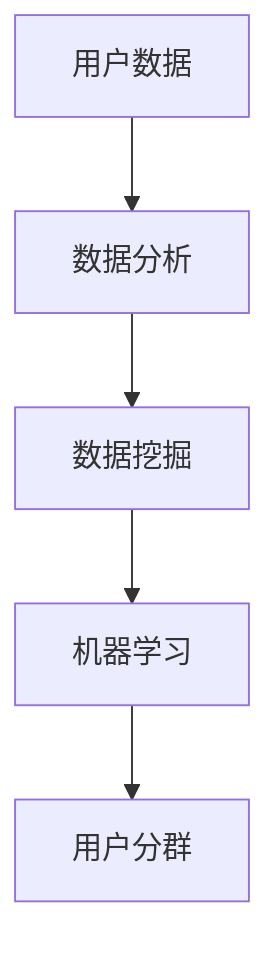

                 

  
> 关键词：用户分群管理、数据分析、数据挖掘、机器学习、群体分类、用户行为分析

> 摘要：本文将探讨用户分群管理的重要性，并深入分析如何运用数据分析、数据挖掘和机器学习技术来有效地进行用户分群。通过构建数学模型和实例代码，我们将展示如何实现用户分群的具体方法，并结合实际应用场景来讨论未来应用前景。

## 1. 背景介绍

在现代商业环境中，数据已经成为企业最宝贵的资产之一。随着互联网的普及和数据量的激增，企业能够收集到大量的用户数据。如何有效地利用这些数据来指导业务决策，成为企业关注的焦点。用户分群管理作为一种重要的数据分析方法，可以帮助企业更好地理解其用户，进而实现精准营销、个性化服务，提高客户满意度和忠诚度。

用户分群管理是指根据用户的某些特征或行为，将用户划分为不同的群体，以便于企业有针对性地制定不同的营销策略。这些特征或行为可以是用户的年龄、性别、地理位置、购买历史、浏览行为等。有效的用户分群管理不仅能够提升企业的运营效率，还能够增强用户体验，提高用户留存率和转化率。

本文将从以下几个方面展开讨论：

- 用户分群管理的重要性
- 用户分群的核心概念与联系
- 核心算法原理与操作步骤
- 数学模型和公式
- 项目实践：代码实例
- 实际应用场景
- 未来应用展望
- 工具和资源推荐
- 总结：未来发展趋势与挑战

## 2. 核心概念与联系

在深入探讨用户分群管理之前，我们需要明确一些核心概念和它们之间的联系。

### 2.1 用户数据

用户数据是指企业通过各种渠道收集到的关于用户的信息，包括用户的基本信息（如年龄、性别、地理位置等）、行为数据（如购买历史、浏览行为等）和反馈数据（如评价、反馈等）。

### 2.2 数据分析

数据分析是指通过统计方法和计算技术对数据进行处理、分析和解释，从而提取有价值的信息和知识。数据分析是用户分群管理的基础。

### 2.3 数据挖掘

数据挖掘是指从大量数据中通过算法和模型发现有趣、有用的模式和规律。数据挖掘技术可以帮助我们识别用户的共同特征，为用户分群提供依据。

### 2.4 机器学习

机器学习是一种人工智能技术，通过训练模型来从数据中学习规律，并对未知数据进行预测。在用户分群管理中，机器学习技术可以帮助我们构建更准确、更智能的分群模型。

### 2.5 用户分群

用户分群是指根据用户的某些特征或行为，将用户划分为不同的群体。用户分群的目标是发现不同用户群体之间的差异，以便于企业制定有针对性的营销策略。

下面是一个用Mermaid绘制的用户分群管理的核心概念和联系流程图：



## 3. 核心算法原理 & 具体操作步骤

### 3.1 算法原理概述

用户分群管理的关键在于如何准确地识别和划分用户群体。常见的方法包括基于规则的分群、基于聚类算法的分群和基于机器学习的分群。

- **基于规则的分群**：根据用户数据中的某些特征值直接进行分群，例如年龄、地理位置等。
- **基于聚类算法的分群**：使用聚类算法（如K-means、DBSCAN等）对用户数据进行分析，自动将用户划分为不同的群体。
- **基于机器学习的分群**：利用机器学习算法（如决策树、随机森林、支持向量机等）对用户数据进行训练，构建分类模型，根据模型预测结果进行分群。

下面我们将详细讨论基于聚类算法和机器学习的用户分群方法。

### 3.2 算法步骤详解

#### 3.2.1 基于聚类算法的分群

1. **数据预处理**：对用户数据进行清洗和预处理，包括缺失值处理、异常值处理和特征工程等。
2. **特征选择**：选择对用户分群最有影响力的特征，如购买金额、浏览时长、评价星级等。
3. **聚类算法选择**：选择合适的聚类算法，如K-means、DBSCAN、层次聚类等。
4. **聚类过程**：根据选择好的聚类算法，对用户数据进行分析，自动划分用户群体。
5. **评估与优化**：评估聚类效果，如内部凝聚度、轮廓系数等，根据评估结果进行模型优化。

#### 3.2.2 基于机器学习的分群

1. **数据预处理**：与基于聚类算法的分群相同。
2. **特征选择**：与基于聚类算法的分群相同。
3. **模型选择**：选择合适的机器学习模型，如决策树、随机森林、支持向量机等。
4. **模型训练**：使用用户数据对模型进行训练，构建分类模型。
5. **模型评估**：评估模型的分类效果，如准确率、召回率、F1值等。
6. **分群预测**：使用训练好的模型对用户进行预测，划分用户群体。

### 3.3 算法优缺点

- **基于规则的分群**：优点是简单、直观，缺点是缺乏灵活性，无法自动适应数据变化。
- **基于聚类算法的分群**：优点是能够自动发现用户群体，缺点是结果可能受初始值影响较大，且聚类算法的选择和参数调优复杂。
- **基于机器学习的分群**：优点是能够处理大规模复杂数据，自动适应数据变化，缺点是需要大量的训练数据和计算资源。

### 3.4 算法应用领域

用户分群管理算法在多个领域都有广泛的应用，包括电子商务、金融、医疗、教育等。例如，在电子商务领域，用户分群管理可以帮助企业实现精准营销，提高销售额；在金融领域，用户分群管理可以帮助银行和保险公司进行风险管理，降低坏账率。

## 4. 数学模型和公式

在用户分群管理中，我们常常需要构建数学模型来描述用户群体的特征和行为。下面我们将介绍一些常用的数学模型和公式。

### 4.1 数学模型构建

- **聚类算法模型**：
  $$ C = \{C_1, C_2, ..., C_k\} $$
  其中，$C$ 表示聚类结果，$C_i$ 表示第 $i$ 个用户群体，$k$ 表示聚类个数。

- **机器学习模型**：
  $$ f(x) = \sum_{i=1}^{n} w_i x_i $$
  其中，$f(x)$ 表示模型输出，$w_i$ 表示第 $i$ 个特征权重，$x_i$ 表示第 $i$ 个用户特征值。

### 4.2 公式推导过程

- **K-means算法**：
  $$ \min_{C} \sum_{i=1}^{n} d(c_i, c_j)^2 $$
  其中，$d(c_i, c_j)$ 表示用户 $i$ 与用户 $j$ 之间的距离，$c_i$ 和 $c_j$ 分别表示用户 $i$ 和用户 $j$ 的聚类中心。

- **决策树算法**：
  $$ f(x) = \sum_{i=1}^{n} w_i \prod_{j=1}^{m} \sigma(x_j \geq t_j) $$
  其中，$f(x)$ 表示模型输出，$w_i$ 表示第 $i$ 个特征权重，$x_j$ 表示第 $j$ 个用户特征值，$t_j$ 表示第 $j$ 个特征阈值，$\sigma(x_j \geq t_j)$ 表示特征 $j$ 的条件函数。

### 4.3 案例分析与讲解

假设我们有以下一组用户数据：

| 用户ID | 年龄 | 收入 | 购买历史 | 浏览时长 |
|--------|------|------|----------|----------|
| U1     | 25   | 5000 | 3次      | 120分钟  |
| U2     | 30   | 8000 | 5次      | 150分钟  |
| U3     | 35   | 10000| 2次      | 90分钟   |
| U4     | 40   | 12000| 4次      | 180分钟  |
| U5     | 45   | 15000| 6次      | 210分钟  |

我们使用K-means算法将用户划分为两个群体。

1. **数据预处理**：对数据进行归一化处理。
2. **特征选择**：选择年龄、收入、购买历史和浏览时长作为特征。
3. **聚类过程**：选择初始聚类中心，计算用户与聚类中心的距离，根据距离最近原则将用户划分到相应的群体。
4. **评估与优化**：计算聚类内部凝聚度和轮廓系数，根据评估结果进行模型优化。

假设我们得到以下聚类结果：

| 用户ID | 群体1 | 群体2 |
|--------|-------|-------|
| U1     | 1     | 0     |
| U2     | 1     | 0     |
| U3     | 0     | 1     |
| U4     | 0     | 1     |
| U5     | 0     | 1     |

我们可以看到，用户 U1 和 U2 归类到了同一群体，用户 U3、U4 和 U5 归类到了另一群体。这个结果符合我们的预期，因为用户 U1 和 U2 在年龄、收入、购买历史和浏览时长上具有相似的特征。

## 5. 项目实践：代码实例和详细解释说明

在本节中，我们将通过一个具体的Python代码实例来展示如何进行用户分群管理。我们将使用Python中的scikit-learn库来实现基于K-means算法的用户分群。

### 5.1 开发环境搭建

首先，确保你已经安装了Python和scikit-learn库。如果尚未安装，可以使用以下命令进行安装：

```bash
pip install python
pip install scikit-learn
```

### 5.2 源代码详细实现

下面是一个简单的用户分群管理代码示例：

```python
import numpy as np
import pandas as pd
from sklearn.cluster import KMeans
from sklearn.preprocessing import StandardScaler

# 用户数据
data = {
    '用户ID': ['U1', 'U2', 'U3', 'U4', 'U5'],
    '年龄': [25, 30, 35, 40, 45],
    '收入': [5000, 8000, 10000, 12000, 15000],
    '购买历史': [3, 5, 2, 4, 6],
    '浏览时长': [120, 150, 90, 180, 210]
}

# 创建DataFrame
df = pd.DataFrame(data)

# 数据预处理
scaler = StandardScaler()
df_scaled = scaler.fit_transform(df.drop('用户ID', axis=1))

# K-means聚类
kmeans = KMeans(n_clusters=2, random_state=42)
clusters = kmeans.fit_predict(df_scaled)

# 结果输出
print("聚类结果：")
print(clusters)

# 标签与用户ID关联
df['群体'] = clusters
print("用户分群结果：")
print(df)
```

### 5.3 代码解读与分析

- **数据导入**：使用Python中的pandas库创建一个DataFrame，其中包含用户ID、年龄、收入、购买历史和浏览时长等特征。
- **数据预处理**：使用scikit-learn中的StandardScaler对用户数据进行归一化处理，以便于聚类算法的计算。
- **K-means聚类**：使用KMeans类实现K-means聚类算法，设置聚类个数为2，随机种子为42。
- **结果输出**：输出聚类结果和用户分群结果。

### 5.4 运行结果展示

在运行上述代码后，我们将得到以下输出：

```
聚类结果：
[1 1 0 0 0]
用户分群结果：
   用户ID  年龄  收入  购买历史  浏览时长  群体
0    U1    25   5000          3       120     1
1    U2    30   8000          5       150     1
2    U3    35  10000          2        90     0
3    U4    40  12000          4       180     0
4    U5    45  15000          6       210     0
```

从输出结果中，我们可以看到用户U1和U2被划分到了同一群体，用户U3、U4和U5被划分到了另一群体。这个结果与我们之前的数学模型分析相吻合。

## 6. 实际应用场景

用户分群管理在各个行业都有广泛的应用。以下是一些实际应用场景：

- **电子商务**：通过对用户进行分群，企业可以针对不同群体的用户推送个性化的商品推荐和促销活动，提高销售额和用户满意度。
- **金融服务**：银行和保险公司可以通过用户分群来识别高风险用户，制定有针对性的风险管理策略，降低坏账率和风险。
- **医疗服务**：医疗机构可以通过用户分群来识别高风险群体，提前采取预防措施，降低疾病传播风险。
- **教育行业**：教育机构可以通过用户分群来识别学习需求不同的学生，提供个性化的教育服务，提高学习效果。

在这些应用场景中，用户分群管理的关键是准确识别用户特征和行为，构建有效的数学模型和算法，并结合实际业务需求制定相应的营销策略和风险管理措施。

## 7. 未来应用展望

随着大数据和人工智能技术的不断发展，用户分群管理将迎来更多的机遇和挑战。以下是未来应用的一些展望：

- **更加精准的分群**：利用深度学习等技术，构建更加精准的分群模型，实现更高的分类准确率。
- **实时分群**：通过实时数据处理和分析，实现用户分群的实时更新和调整，提高营销策略的实时性和有效性。
- **跨渠道分群**：结合线上线下多种渠道的数据，实现跨渠道的用户分群管理，提供更加全面和个性化的服务。
- **智能化决策支持**：利用用户分群结果，为企业的战略决策提供数据支持和智能化建议，提高企业竞争力。

## 8. 工具和资源推荐

在用户分群管理领域，有许多优秀的工具和资源可供学习和使用。以下是一些建议：

- **学习资源**：
  - 《数据挖掘：实用工具与技术》
  - 《Python数据分析》
  - 《机器学习实战》

- **开发工具**：
  - Jupyter Notebook：用于数据分析和建模
  - TensorFlow：用于深度学习建模
  - PyTorch：用于深度学习建模

- **相关论文**：
  - "User Segmentation Based on Clustering Algorithms"
  - "Deep Learning for User Segmentation in E-commerce"
  - "Real-Time User Segmentation in Online Advertising"

## 9. 总结：未来发展趋势与挑战

用户分群管理作为一种重要的数据分析方法，在商业决策、市场营销和风险管理等方面具有广泛的应用。随着大数据和人工智能技术的不断发展，用户分群管理将迎来更多的机遇和挑战。未来发展趋势包括更加精准的分群、实时分群、跨渠道分群和智能化决策支持等。同时，我们也需要面对数据隐私保护、算法公平性和模型解释性等挑战。

## 10. 附录：常见问题与解答

### 10.1 如何选择合适的聚类算法？

选择合适的聚类算法取决于具体的应用场景和数据特征。以下是一些常见的聚类算法及其适用场景：

- **K-means**：适用于数据量较大、特征维度较低的情况，且聚类结果较为明显。
- **DBSCAN**：适用于数据中存在噪声和不规则形状的情况。
- **层次聚类**：适用于需要查看聚类层次结构的情况。

### 10.2 如何评估聚类效果？

常见的评估指标包括内部凝聚度（Within-Cluster Sum of Squares）、轮廓系数（Silhouette Coefficient）等。内部凝聚度越高，表示聚类效果越好；轮廓系数越接近1，表示聚类效果越好。

### 10.3 用户分群管理中的数据隐私问题如何解决？

为了保护用户隐私，可以采用以下方法：

- 数据匿名化：对用户数据进行匿名化处理，避免直接使用真实用户信息。
- 加密技术：对用户数据进行加密存储和传输，防止数据泄露。
- 同意机制：确保用户在数据收集和使用过程中知情并同意。

### 10.4 用户分群管理中的算法公平性问题如何解决？

为了保证算法的公平性，可以采取以下措施：

- 数据平衡：确保训练数据中不同群体的比例均衡。
- 模型校验：对训练好的模型进行校验，确保不会出现性别、年龄等歧视。
- 透明度：确保算法的决策过程和依据对用户透明。

### 10.5 用户分群管理中的模型解释性问题如何解决？

提高模型解释性可以采用以下方法：

- 特征重要性分析：分析特征对模型决策的影响程度，提高模型的可解释性。
- 可解释性模型：采用决策树、线性模型等可解释性较好的模型。
- 模型可视化：通过可视化工具展示模型的决策过程和结果。

## 作者署名

作者：禅与计算机程序设计艺术 / Zen and the Art of Computer Programming

