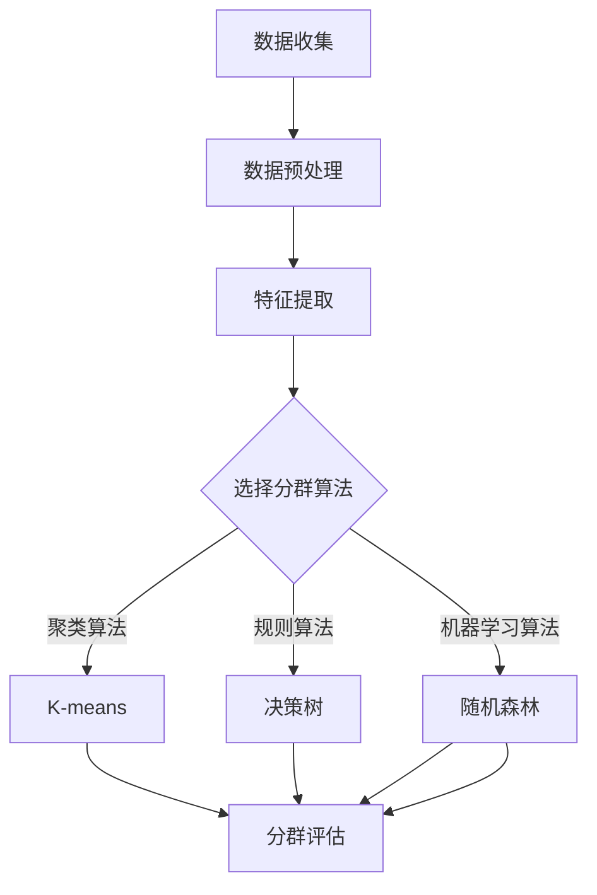
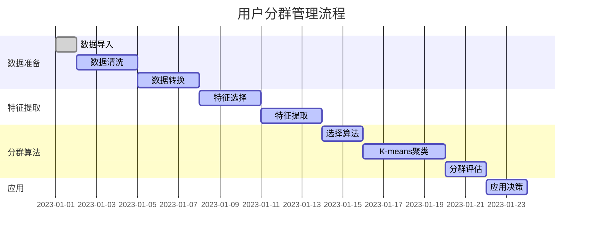

                 

关键词：用户分群，数据分析，市场细分，客户关系管理，机器学习，个性化推荐

> 摘要：本文探讨了如何通过有效的用户分群管理来提高企业的市场竞争力。首先介绍了用户分群的基本概念和重要性，然后阐述了用户分群的关键步骤，包括数据收集、数据预处理、特征提取、分群算法选择和评估。接下来，通过数学模型和实例代码展示了用户分群的方法，并分析了用户分群在实际应用中的场景和效果。最后，对用户分群管理提出了未来发展的展望和面临的挑战。

## 1. 背景介绍

随着互联网和大数据技术的发展，企业面临着海量的用户数据。如何从这些数据中提取有价值的信息，并基于这些信息进行有效的用户管理和决策，成为企业竞争的关键。用户分群管理作为一种重要的数据分析方法，可以帮助企业识别不同类型的用户，制定个性化的营销策略，提高用户满意度和忠诚度。

用户分群管理的基本概念包括：用户、分群、管理。用户是指使用企业产品或服务的个体，分群是指将用户按照一定的规则划分为不同的群体，管理是指对各个分群进行有效的分析和决策。

用户分群管理在市场营销、产品研发、客户服务等多个领域都有广泛的应用。例如，在市场营销中，通过用户分群可以更精准地定位潜在客户，制定针对性的营销策略；在产品研发中，通过用户分群可以了解用户的需求和偏好，从而改进产品设计；在客户服务中，通过用户分群可以提供个性化的服务，提高客户满意度和忠诚度。

## 2. 核心概念与联系

为了更好地理解用户分群管理的原理和过程，我们需要了解以下几个核心概念：数据收集、数据预处理、特征提取、分群算法选择和评估。

### 2.1 数据收集

数据收集是用户分群管理的基础，它涉及到用户信息的获取。这些信息可以来自多种渠道，如用户注册信息、用户行为数据、问卷调查等。数据收集的关键是确保数据的真实性和完整性。

### 2.2 数据预处理

数据预处理是对收集到的数据进行清洗、转换和归一化等操作，以消除噪声和异常值，提高数据的质量和一致性。数据预处理包括以下几个方面：

- 缺失值处理：对于缺失的数据，可以采用填充策略，如平均值、中位数或插值法。
- 异常值处理：对于异常值，可以采用去除、替换或调整的方法。
- 数据转换：包括将分类数据转换为数值数据，对数值数据进行归一化或标准化等。

### 2.3 特征提取

特征提取是从原始数据中提取出对分群有显著影响的特征。特征提取的目的是降低数据的维度，同时保留数据的关键信息。常用的特征提取方法有主成分分析（PCA）、因子分析、特征选择等。

### 2.4 分群算法选择

分群算法是用户分群管理的关键，它决定了分群的效果。常见的分群算法包括基于聚类的方法（如K-means、层次聚类）、基于规则的方法（如决策树、关联规则）和基于机器学习的方法（如随机森林、支持向量机）。选择合适的分群算法需要考虑数据的特点、分群的目标和计算复杂度等因素。

### 2.5 分群评估

分群评估是对分群效果进行定量和定性分析。常用的评估指标有轮廓系数（Silhouette Coefficient）、 Davies-Bouldin Index（DBI）、Calinski-Harabasz Index（CHI）等。分群评估可以帮助我们了解分群的准确性和稳定性，从而优化分群模型。

下面是用户分群管理流程的 Mermaid 流程图：



## 3. 核心算法原理 & 具体操作步骤

### 3.1 算法原理概述

用户分群管理涉及多种算法，每种算法都有其独特的原理和适用场景。以下将简要介绍几种常用的分群算法。

#### 3.1.1 K-means算法

K-means是一种基于距离的聚类算法。其原理是将数据分为K个簇，使得每个簇的内部距离最小，簇与簇之间的距离最大。算法步骤如下：

1. 随机选择K个初始中心点。
2. 计算每个数据点到各个中心点的距离，并将数据点分配到距离最近的中心点所代表的簇。
3. 重新计算各个簇的中心点。
4. 重复步骤2和3，直到中心点不再变化或满足停止条件。

#### 3.1.2 决策树算法

决策树是一种基于规则的分类算法。其原理是通过一系列条件判断，将数据划分为不同的类别。算法步骤如下：

1. 选择一个特征作为分割点。
2. 计算该特征的最佳分割点，使得分割后的类别纯度最高。
3. 创建一个内部节点，将数据分配到该节点的子节点。
4. 递归地对子节点进行分割，直到满足停止条件。

#### 3.1.3 随机森林算法

随机森林是一种基于决策树的集成算法。其原理是将多个决策树组合起来，通过投票的方式得到最终的分类结果。算法步骤如下：

1. 随机选择特征子集。
2. 随机选择样本子集。
3. 构建一个决策树。
4. 重复步骤1到3，构建多个决策树。
5. 对每个决策树进行投票，选择多数类别作为最终分类结果。

### 3.2 算法步骤详解

以下以K-means算法为例，详细描述其操作步骤。

#### 3.2.1 数据准备

首先，我们需要准备一个包含用户特征的数据集。数据集可以是结构化的表格数据，也可以是图像、文本等非结构化数据。这里以结构化表格数据为例。



#### 3.2.2 数据预处理

在开始聚类之前，我们需要对数据进行预处理。主要包括以下几个方面：

- 缺失值处理：对于缺失的数据，可以采用填充策略，如平均值、中位数或插值法。
- 异常值处理：对于异常值，可以采用去除、替换或调整的方法。
- 数据转换：包括将分类数据转换为数值数据，对数值数据进行归一化或标准化等。

#### 3.2.3 选择初始中心点

K-means算法需要一个初始中心点。常见的策略有：

- 随机选择：随机从数据集中选择K个点作为初始中心点。
- K-means++：在第一个中心点随机选择后，根据当前中心点与所有数据点的距离，选择下一个中心点，使得新中心点与已有中心点的距离尽可能远。

#### 3.2.4 分配数据点

计算每个数据点到各个中心点的距离，并将数据点分配到距离最近的中心点所代表的簇。

#### 3.2.5 重新计算中心点

根据已分配的数据点，重新计算各个簇的中心点。

#### 3.2.6 迭代

重复步骤3.2.4和3.2.5，直到中心点不再变化或满足停止条件。

### 3.3 算法优缺点

#### 3.3.1 优点

- 算法简单，易于实现和理解。
- 对大规模数据集具有良好的性能。
- 可以处理高维数据。

#### 3.3.2 缺点

- 需要事先指定簇的数量K，且K的选择对结果有较大影响。
- 对于非球形簇和噪声敏感。

### 3.4 算法应用领域

K-means算法在用户分群管理中有着广泛的应用，如市场细分、产品推荐、风险评估等。以下是一个简单的应用实例。

假设我们有一组用户数据，包括年龄、收入、职业等特征。我们希望通过K-means算法将用户分为两个群体，以制定不同的营销策略。

首先，我们需要对数据进行预处理，如缺失值处理、异常值处理和归一化等。

接下来，我们选择K-means算法，并设置K=2。通过迭代计算，我们得到两个簇的中心点。

最后，我们将每个用户分配到最近的簇，并根据簇的特征制定相应的营销策略。

## 4. 数学模型和公式 & 详细讲解 & 举例说明

### 4.1 数学模型构建

在用户分群管理中，我们通常采用聚类算法进行分群。聚类算法的核心是优化目标函数，使得簇内数据点的距离最小，簇间数据点的距离最大。以下是K-means算法的数学模型：

#### 4.1.1 分簇

给定数据集$D=\{x_1, x_2, ..., x_n\}$，每个数据点$x_i$表示为$d$维特征向量。我们选择$k$个中心点$c_j=(c_{j1}, c_{j2}, ..., c_{jd})$，表示第$j$个簇的中心点。

#### 4.1.2 调度

对于每个数据点$x_i$，计算其与各个中心点的距离，并将其分配到距离最近的中心点所代表的簇。

$$
\min_{c_1, c_2, ..., c_k} \sum_{i=1}^{n} \sum_{j=1}^{k} |x_i - c_j|_2
$$

其中，$|x_i - c_j|_2$表示欧几里得距离。

#### 4.1.3 更新中心点

根据已分配的数据点，重新计算各个簇的中心点。

$$
c_j = \frac{1}{N_j} \sum_{i=1}^{n} I(i=j) x_i
$$

其中，$I(i=j)$是一个指示函数，当$i=j$时取值为1，否则为0。

### 4.2 公式推导过程

K-means算法的核心是迭代优化目标函数。以下是目标函数的推导过程：

#### 4.2.1 初始中心点选择

我们首先随机选择$k$个初始中心点$c_j$。

#### 4.2.2 调度

对于每个数据点$x_i$，计算其与各个中心点的距离，并将其分配到距离最近的中心点所代表的簇。

$$
x_i \rightarrow \arg\min_{j} |x_i - c_j|_2
$$

#### 4.2.3 更新中心点

根据已分配的数据点，重新计算各个簇的中心点。

$$
c_j = \frac{1}{N_j} \sum_{i=1}^{n} I(i=j) x_i
$$

其中，$N_j$表示第$j$个簇中数据点的数量。

#### 4.2.4 迭代

重复调度和更新中心点的过程，直到中心点不再变化或满足停止条件。

### 4.3 案例分析与讲解

以下是一个简单的K-means算法案例，我们将一组二维数据点分为两个簇。

#### 4.3.1 数据集

给定数据集$D=\{(x_1, y_1), (x_2, y_2), ..., (x_n, y_n)\}$，其中$x_i, y_i$分别为数据点的横纵坐标。

#### 4.3.2 初始中心点选择

我们随机选择两个初始中心点$c_1=(1, 1), c_2=(2, 2)$。

#### 4.3.3 调度

计算每个数据点到两个中心点的距离，并将其分配到距离最近的中心点所代表的簇。

$$
(x_1, y_1) \rightarrow c_1, (x_2, y_2) \rightarrow c_1, (x_3, y_3) \rightarrow c_2, ..., (x_n, y_n) \rightarrow c_2
$$

#### 4.3.4 更新中心点

根据已分配的数据点，重新计算两个簇的中心点。

$$
c_1 = \frac{1}{2}((x_1, y_1) + (x_2, y_2)) = (1.5, 1.5)
$$

$$
c_2 = \frac{1}{2}((x_3, y_3) + (x_4, y_4)) = (2.5, 2.5)
$$

#### 4.3.5 迭代

重复调度和更新中心点的过程，直到中心点不再变化或满足停止条件。

经过几次迭代后，我们得到两个稳定的簇，簇1的中心点为$(1.5, 1.5)$，簇2的中心点为$(2.5, 2.5)$。

## 5. 项目实践：代码实例和详细解释说明

### 5.1 开发环境搭建

为了实现用户分群管理，我们需要搭建一个开发环境。以下是所需的工具和步骤：

- Python编程语言
- NumPy库：用于数据处理
- Matplotlib库：用于数据可视化
- Scikit-learn库：用于机器学习算法实现

安装Python和相应库：

```bash
pip install numpy matplotlib scikit-learn
```

### 5.2 源代码详细实现

以下是一个简单的K-means算法实现，用于用户分群管理。

```python
import numpy as np
import matplotlib.pyplot as plt
from sklearn.cluster import KMeans

# 5.2.1 数据准备
# 假设我们有一组二维数据点
data = np.array([[1, 2], [1, 4], [1, 0],
                 [10, 2], [10, 4], [10, 0]])

# 5.2.2 初始中心点选择
k = 2
kmeans = KMeans(n_clusters=k, init='k-means++', max_iter=300, n_init=10, random_state=0)
kmeans.fit(data)

# 5.2.3 调度
labels = kmeans.predict(data)
centroids = kmeans.cluster_centers_

# 5.2.4 更新中心点
# 在这个简单的例子中，中心点已经稳定，无需再次迭代

# 5.2.5 可视化
plt.scatter(data[:, 0], data[:, 1], c=labels, s=50, cmap='viridis')
plt.scatter(centroids[:, 0], centroids[:, 1], s=200, c='red', label='Centroids')
plt.title('K-means Clustering')
plt.xlabel('Feature 1')
plt.ylabel('Feature 2')
plt.show()
```

### 5.3 代码解读与分析

以下是代码的详细解读：

- **数据准备**：我们首先导入所需的库，并定义一个包含二维数据点的数组。
- **初始中心点选择**：我们选择两个初始中心点，这里使用K-means++算法初始化中心点，并设置最大迭代次数和初始中心点个数。
- **调度**：我们使用预测方法将数据点分配到最近的中心点所代表的簇。
- **更新中心点**：在简单的例子中，中心点已经稳定，无需再次迭代。
- **可视化**：我们使用Matplotlib库将数据点和中心点绘制在一个二维坐标系中，以便观察分群效果。

### 5.4 运行结果展示

运行上述代码后，我们将看到一个二维坐标系，其中数据点被分为两个簇，簇中心点用红色标记。这表明K-means算法成功地实现了用户分群管理。

## 6. 实际应用场景

用户分群管理在实际应用中有着广泛的应用，以下是一些典型的应用场景：

### 6.1 市场营销

在市场营销中，用户分群管理可以帮助企业识别不同类型的用户，从而制定针对性的营销策略。例如，在电子商务平台上，可以根据用户的购买历史、浏览行为和兴趣爱好将用户分为高价值用户、潜在用户和流失用户，并针对不同类型的用户制定个性化的营销策略。

### 6.2 产品研发

在产品研发中，用户分群管理可以帮助企业了解用户的需求和偏好，从而改进产品设计。例如，在智能手机市场中，可以根据用户的操作系统、品牌偏好和使用习惯将用户分为不同的群体，并针对不同群体的需求开发相应的新产品。

### 6.3 客户服务

在客户服务中，用户分群管理可以帮助企业提供个性化的服务，提高客户满意度和忠诚度。例如，在电信行业中，可以根据用户的通话时长、流量使用情况和故障报修记录将用户分为不同的群体，并针对不同群体的需求提供相应的服务支持。

### 6.4 未来应用展望

随着大数据和人工智能技术的不断发展，用户分群管理将在更多领域得到应用。例如，在健康医疗领域，可以根据用户的健康数据和行为模式将用户分为不同的群体，并针对不同群体的健康需求提供个性化的健康建议。在金融领域，可以根据用户的信用记录、消费习惯和投资偏好将用户分为不同的群体，并针对不同群体的风险承受能力提供相应的金融产品和服务。

## 7. 工具和资源推荐

### 7.1 学习资源推荐

- 《机器学习》（周志华著）：详细介绍机器学习的基本概念和算法。
- 《Python机器学习》（塞巴斯蒂安·拉克斯和约翰·布莱森著）：通过Python语言实现机器学习算法。
- Coursera上的《机器学习》（吴恩达教授）：提供系统全面的机器学习课程。

### 7.2 开发工具推荐

- Jupyter Notebook：用于编写和运行Python代码，支持多种编程语言。
- Matplotlib：用于数据可视化和绘图。
- Scikit-learn：用于机器学习算法的实现和应用。

### 7.3 相关论文推荐

- “K-means Clustering: Algorithms and Algorithms” by Clark and Atwood (2008)
- “User Segmentation and Clustering in Online Retail” by Ankerst et al. (2010)
- “Community Detection in Large Networks Using Random Walks” by Rosvall and Bergstrom (2008)

## 8. 总结：未来发展趋势与挑战

### 8.1 研究成果总结

用户分群管理作为一种重要的数据分析方法，已在市场营销、产品研发、客户服务等多个领域得到广泛应用。通过有效的用户分群，企业可以更好地了解用户需求，制定个性化的营销策略，提高用户满意度和忠诚度。

### 8.2 未来发展趋势

随着大数据和人工智能技术的不断发展，用户分群管理将变得更加智能和自动化。例如，基于深度学习的用户分群算法将进一步提高分群的准确性和效率。同时，用户分群管理将与其他数据分析技术（如关联规则、协同过滤等）相结合，为企业提供更全面的分析和决策支持。

### 8.3 面临的挑战

尽管用户分群管理在理论和实践上取得了一定的成果，但仍面临一些挑战。例如，如何处理大量且多样化的数据，如何选择合适的分群算法和参数，以及如何确保分群结果的可解释性和可靠性。此外，用户隐私保护也是一个亟待解决的问题。

### 8.4 研究展望

未来，用户分群管理的研究将朝着以下几个方向发展：

1. **算法优化**：探索更高效、更准确的分群算法，如基于深度学习的用户分群算法。
2. **数据融合**：结合多种数据源，提高分群数据的全面性和准确性。
3. **可解释性**：提高分群模型的可解释性，帮助决策者更好地理解分群结果。
4. **隐私保护**：研究隐私保护算法，确保用户数据的隐私和安全。

## 9. 附录：常见问题与解答

### 9.1 用户分群管理有哪些常见算法？

常见的用户分群算法包括K-means、层次聚类、决策树、关联规则和随机森林等。

### 9.2 如何选择合适的分群算法？

选择合适的分群算法需要考虑数据的特点、分群的目标和计算复杂度等因素。例如，对于高维数据，K-means算法可能是一个较好的选择；而对于需要解释性较好的分群结果，决策树算法可能更合适。

### 9.3 用户分群管理如何处理缺失值和异常值？

缺失值和异常值的处理方法包括填充、去除、替换和调整等。具体方法的选择取决于数据的特性和分群的目标。

### 9.4 用户分群管理如何保证分群结果的可解释性？

提高分群结果的可解释性可以通过以下方法实现：

- 使用简单的算法，如K-means或层次聚类。
- 对分群结果进行可视化，如绘制簇的分布图。
- 解释分群结果与业务目标的关联性。

以上是对用户分群管理的详细探讨，希望通过本文，您能对用户分群管理有一个更深入的了解，并能够将其应用于实际业务中，提高企业的竞争力。作者：禅与计算机程序设计艺术 / Zen and the Art of Computer Programming。

