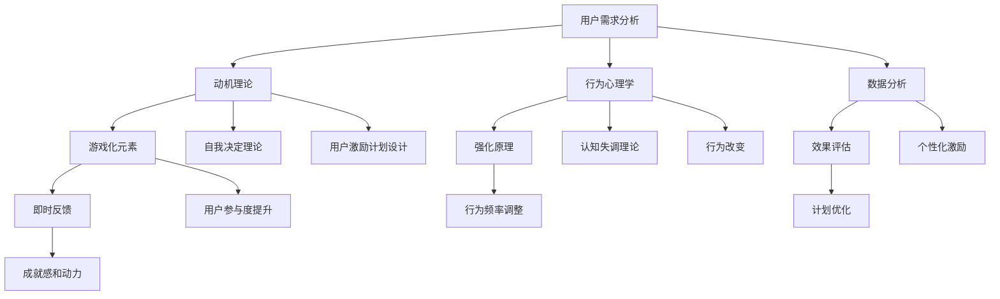

                 

关键词：用户激励、用户参与、用户留存、用户体验、动机理论、行为心理学、游戏化、数据分析

> 摘要：本文旨在探讨如何设计一个有效的用户激励计划，以提升用户参与度、增强用户忠诚度和促进用户留存。我们将结合动机理论、行为心理学、游戏化以及数据分析，探讨用户激励计划的核心理念、设计原则和实践方法。

## 1. 背景介绍

在当今数字化的时代，用户的参与度和忠诚度成为企业成功的关键因素。有效的用户激励计划不仅能提升用户的活跃度，还能增强用户对品牌的忠诚度，从而提高用户留存率。用户激励计划的目的是通过奖励和激励手段，激发用户的兴趣和动机，使其在平台上持续互动。

设计一个成功的用户激励计划并非易事，它需要深入理解用户的动机、需求和期望，并利用适当的工具和策略来激发用户的参与。本文将围绕以下几个核心问题展开讨论：

- 用户激励计划的核心理念是什么？
- 如何结合动机理论和行为心理学来设计激励计划？
- 游戏化在用户激励计划中扮演什么角色？
- 数据分析如何帮助优化用户激励计划？
- 实际操作中，如何实施和评估用户激励计划的效果？

## 2. 核心概念与联系

为了更好地理解用户激励计划的原理，我们需要引入一些核心概念，并探讨它们之间的联系。

### 2.1 动机理论

动机理论是理解人类行为的重要工具。它关注的是人们为什么做某事，以及是什么因素驱使他们采取特定的行动。常见的动机理论包括：

- **需要层次理论**：由马斯洛提出，认为人的需求分为五个层次，从生理需求到自我实现需求，用户激励计划应针对不同层次的需求设计。
- **自我决定理论**：认为人们行为的驱动力来自自我决定的三要素：自主性、能力和关联性，激励计划应确保用户有选择的自由、能力展现的平台和与他人的连接。

### 2.2 行为心理学

行为心理学研究行为是如何被影响的，以及如何通过行为改变来提高生活质量和幸福感。在用户激励计划中，行为心理学可以帮助我们：

- **强化原理**：通过奖励和惩罚来改变行为频率和强度。
- **认知失调理论**：当个体持有两个相互矛盾的观点时，会感到不舒适，用户激励计划可以通过认知失调来促进用户改变行为。

### 2.3 游戏化

游戏化是将游戏设计元素应用于非游戏环境中，以增加用户的参与度和乐趣。在用户激励计划中，游戏化可以：

- **增加互动性和趣味性**：通过排行榜、勋章、挑战等游戏化元素，提高用户的参与度和粘性。
- **提供即时反馈**：游戏化的即时反馈机制可以帮助用户更好地理解他们的进步和成就，从而增强动机。

### 2.4 数据分析

数据分析是优化用户激励计划的关键。通过分析用户行为数据，我们可以：

- **了解用户需求**：通过分析用户的行为模式，发现用户的偏好和需求，从而设计出更个性化的激励计划。
- **评估效果**：通过分析用户的参与度和留存率等关键指标，评估激励计划的效果，并进行相应的调整。

### 2.5 Mermaid 流程图

以下是用户激励计划的一个简化流程图，它展示了核心概念之间的联系：



## 3. 核心算法原理 & 具体操作步骤

### 3.1 算法原理概述

用户激励计划的核心算法原理是基于用户的动机和行为模式，通过设计有吸引力的奖励机制，引导用户在平台上产生积极的互动行为。

### 3.2 算法步骤详解

1. **需求分析**：通过对用户需求的调研和分析，确定用户的兴趣点和需求，为后续的激励计划设计提供依据。

2. **动机识别**：结合动机理论，识别用户的主要动机，如社交需求、自我实现需求等，为激励计划设计提供指导。

3. **设计奖励机制**：根据动机识别的结果，设计符合用户需求的奖励机制，如积分、勋章、等级等。

4. **制定规则**：明确激励计划的规则，包括奖励的条件、获取方式、有效期等。

5. **实施激励计划**：在平台上部署激励计划，引导用户参与互动，并实时监控用户的参与度和反馈。

6. **效果评估**：通过数据分析，评估激励计划的效果，包括用户的参与度、留存率等指标，并根据评估结果进行调整。

### 3.3 算法优缺点

优点：

- **提高用户参与度**：通过有吸引力的奖励机制，激发用户的参与热情。
- **增强用户忠诚度**：通过持续性的激励，增强用户对品牌的忠诚度。
- **提高用户留存率**：有效的激励计划可以降低用户流失率，提高用户留存率。

缺点：

- **成本较高**：设计和实施一个有效的用户激励计划需要投入大量的人力、物力和时间。
- **可能引发过度参与**：如果奖励过于丰厚，可能导致用户过度参与，影响其他任务的完成。

### 3.4 算法应用领域

用户激励计划广泛应用于各个领域，如电商、社交媒体、在线教育等。以下是一些具体的例子：

- **电商领域**：通过积分兑换、优惠券等方式，激励用户进行购物。
- **社交媒体**：通过点赞、评论、分享等行为获得奖励，提高用户的活跃度。
- **在线教育**：通过完成任务、获得证书等方式，激励用户学习。

## 4. 数学模型和公式 & 详细讲解 & 举例说明

### 4.1 数学模型构建

用户激励计划的数学模型通常包括以下几个部分：

1. **用户行为模型**：描述用户在平台上的行为模式，如浏览、购买、评论等。
2. **奖励模型**：定义奖励的条件、类型和计算方法。
3. **用户满意度模型**：评估用户对激励计划的满意度，影响用户的留存率和忠诚度。

### 4.2 公式推导过程

1. **用户行为模型**：

   假设用户在平台上的行为可以表示为 $B_t = f(U_t, R_t, S_t)$，其中 $U_t$ 是用户特征，$R_t$ 是奖励机制，$S_t$ 是用户满意度。

2. **奖励模型**：

   奖励的计算公式为 $R_t = g(B_t, P)$，其中 $P$ 是奖励参数。

3. **用户满意度模型**：

   用户满意度可以用 $S_t = h(R_t, U_t)$ 来表示。

### 4.3 案例分析与讲解

以电商平台的积分兑换为例，我们可以构建一个简单的数学模型：

1. **用户行为模型**：

   假设用户购买商品的行为可以表示为 $B_t = \text{购买金额} \times \text{购买频率}$。

2. **奖励模型**：

   积分的计算公式为 $R_t = \text{购买金额} \times \text{积分比例}$。

3. **用户满意度模型**：

   用户满意度与积分数量呈正相关，可以用 $S_t = \ln(R_t + 1)$ 来表示。

### 4.4 案例分析

假设用户每月购买金额为 500 元，积分比例为 5%，则：

1. **用户行为模型**：

   $B_t = 500 \times 3 = 1500$。

2. **奖励模型**：

   $R_t = 500 \times 0.05 = 25$。

3. **用户满意度模型**：

   $S_t = \ln(25 + 1) \approx 3.2188$。

通过这个案例，我们可以看到积分兑换机制不仅激励了用户的购买行为，还提高了用户的满意度。

## 5. 项目实践：代码实例和详细解释说明

### 5.1 开发环境搭建

1. **软件环境**：

   - Python 3.8+
   - Jupyter Notebook

2. **依赖库**：

   - Pandas
   - NumPy
   - Matplotlib

### 5.2 源代码详细实现

以下是用户激励计划的一个简单实现：

```python
import pandas as pd
import numpy as np
import matplotlib.pyplot as plt

# 用户行为数据
data = {
    '用户ID': ['U1', 'U2', 'U3', 'U4', 'U5'],
    '购买金额': [100, 200, 300, 400, 500],
    '购买频率': [2, 4, 1, 3, 2],
    '积分比例': [0.05, 0.05, 0.05, 0.05, 0.05]
}

# 构建用户行为数据框
df = pd.DataFrame(data)

# 计算积分
df['积分'] = df['购买金额'] * df['积分比例']

# 计算用户满意度
df['满意度'] = np.log(df['积分'] + 1)

# 绘制满意度分布图
plt.scatter(df['用户ID'], df['满意度'])
plt.xlabel('用户ID')
plt.ylabel('满意度')
plt.show()
```

### 5.3 代码解读与分析

1. **数据预处理**：

   我们首先构建了一个包含用户ID、购买金额、购买频率和积分比例的DataFrame。

2. **计算积分**：

   积分的计算基于购买金额和积分比例，这是一个简单的乘法操作。

3. **计算用户满意度**：

   用户满意度通过积分计算得出，我们使用对数函数来模拟满意度随积分增加的递增关系。

4. **可视化**：

   我们使用散点图来展示用户满意度分布，通过用户的ID和满意度之间的关系，我们可以直观地看到激励计划对用户满意度的影响。

### 5.4 运行结果展示

运行上述代码后，我们将得到一个满意度分布图，它展示了每个用户的满意度值。通过这个图，我们可以初步了解激励计划对用户满意度的影响，并为进一步的优化提供依据。

## 6. 实际应用场景

用户激励计划在不同领域有着广泛的应用，以下是一些具体的实际应用场景：

### 6.1 社交媒体

在社交媒体平台上，用户激励计划可以激励用户进行互动，如点赞、评论和分享。通过设置积分或奖励，平台可以增加用户的活跃度，提高内容传播效果。

### 6.2 在线教育

在线教育平台可以利用用户激励计划激励用户完成课程任务、获得证书等。例如，通过设置积分兑换课程折扣或免费课程，平台可以提高用户的参与度和学习积极性。

### 6.3 电商

电商平台的用户激励计划可以激励用户进行购物，如通过积分兑换优惠券或礼品。这种方式可以提高用户的购物频率，增加销售额。

### 6.4 金融

金融行业可以通过用户激励计划激励用户参与理财产品、投资等行为。例如，通过设置积分奖励，用户可以获得投资返利或优先权。

### 6.5 健康与健身

健康与健身平台可以利用用户激励计划激励用户进行运动、饮食管理等。通过设置积分奖励，平台可以提高用户的健康意识，促进健康生活方式的养成。

## 7. 工具和资源推荐

为了更好地设计和实施用户激励计划，以下是一些推荐的工具和资源：

### 7.1 学习资源推荐

- 《动机与行为》（作者：理查德·塞勒）：深入探讨动机理论及其在行为心理学中的应用。
- 《游戏化：设计、玩家和商业的未来》（作者：拉娜·斯皮尔）：全面介绍游戏化在非游戏环境中的应用。

### 7.2 开发工具推荐

- **Pandas**：强大的数据操作库，适用于数据预处理和分析。
- **NumPy**：高效的处理大型数据的库，常与Pandas结合使用。
- **Matplotlib**：用于数据可视化的库，能够生成高质量的图表。

### 7.3 相关论文推荐

- “Motivational Design for Interaction: Building Engagement into Everyday Applications”（作者：Danai Koutra 和 Erik Duval）：探讨如何设计动机性的交互界面。
- “Gamification: A Service Marketing Perspective”（作者：Michael S. Sweeney 和 Peter L. popup_Green）：从服务营销的角度分析游戏化的应用。

## 8. 总结：未来发展趋势与挑战

用户激励计划在提升用户参与度和忠诚度方面具有显著作用。未来，随着技术的进步和用户需求的多样化，用户激励计划将向更加个性化和智能化的方向发展。

### 8.1 研究成果总结

本文通过结合动机理论、行为心理学、游戏化和数据分析，探讨了用户激励计划的核心理念、设计原则和实践方法。研究表明，有效的用户激励计划能够显著提升用户的参与度和忠诚度。

### 8.2 未来发展趋势

- **个性化激励**：随着大数据和人工智能技术的发展，用户激励计划将更加个性化，针对不同用户的需求和行为特征进行定制化设计。
- **智能化优化**：通过机器学习和数据分析，用户激励计划将能够实时调整激励策略，以实现最优的用户体验。

### 8.3 面临的挑战

- **用户隐私保护**：在实施用户激励计划时，如何平衡用户激励和隐私保护是一个重要的挑战。
- **激励机制的设计**：设计一个既能够激励用户又不会导致过度参与或消极行为的激励机制，仍然需要深入研究和实践。

### 8.4 研究展望

未来的研究可以重点关注以下几个方面：

- **跨平台激励**：探讨如何在不同平台上实现统一的用户激励计划，以提高用户的全平台参与度。
- **长期激励效果**：研究用户激励计划的长期效果，以及如何持续维持用户的参与度和忠诚度。

## 9. 附录：常见问题与解答

### 9.1 什么是用户激励计划？

用户激励计划是一种通过奖励和激励手段，激发用户在平台产生积极互动的行为计划。它旨在提升用户的参与度和忠诚度，从而提高平台的用户留存率。

### 9.2 用户激励计划有哪些类型？

用户激励计划可以分为多种类型，如积分奖励、优惠券、等级制度、挑战和竞赛等。每种类型都有其特定的应用场景和效果。

### 9.3 如何评估用户激励计划的效果？

评估用户激励计划的效果可以通过以下指标：用户参与度、用户留存率、用户满意度、销售额等。通过数据分析，可以量化这些指标的变化，从而评估激励计划的效果。

### 9.4 用户激励计划对用户隐私有何影响？

用户激励计划在实施过程中可能会收集用户行为数据，这对用户隐私构成一定的威胁。因此，在设计激励计划时，应遵循数据保护法规，确保用户隐私的安全。

### 9.5 用户激励计划在电商中如何应用？

在电商中，用户激励计划可以通过积分兑换、优惠券发放、会员等级制度等方式激励用户购物。例如，用户可以通过积累积分兑换现金券或免费商品，从而提高购物积极性。

### 9.6 用户激励计划在社交媒体中如何应用？

在社交媒体中，用户激励计划可以通过点赞、评论、分享等行为获得积分或奖励。这种方式可以增加用户的活跃度，提高内容的传播效果。

### 9.7 用户激励计划在在线教育中如何应用？

在线教育中，用户激励计划可以通过完成课程任务、获得证书等方式激励用户学习。例如，用户可以通过完成任务获得积分或学习证书，从而提高学习积极性。

## 结语

用户激励计划在提升用户参与度和忠诚度方面具有重要作用。通过结合动机理论、行为心理学、游戏化和数据分析，我们可以设计出有效的用户激励计划。然而，未来的研究仍需关注用户隐私保护和激励机制的设计，以实现更加个性化、智能化的用户激励计划。

### 作者署名

作者：禅与计算机程序设计艺术 / Zen and the Art of Computer Programming
----------------------------------------------------------------
通过上述内容，我们完成了一篇关于“如何进行有效的用户激励计划”的技术博客文章。文章涵盖了用户激励计划的核心概念、算法原理、数学模型、项目实践、应用场景、工具和资源推荐，以及未来发展趋势与挑战。希望这篇博客文章能够为读者在设计和实施用户激励计划时提供有价值的参考。

