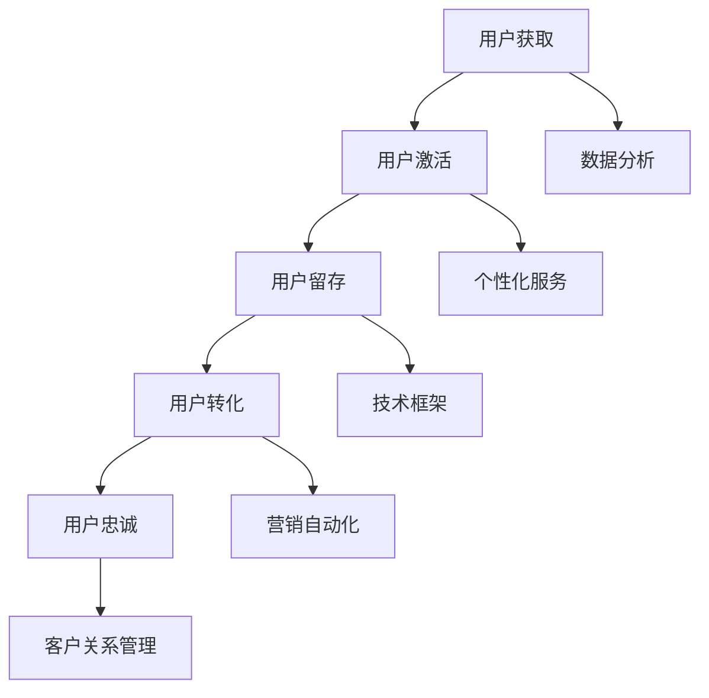

                 

关键词：用户生命周期管理、客户关系管理、用户保留、用户体验、数据分析、个性化服务、技术框架

> 摘要：本文将探讨如何通过系统化、科学化的方法进行有效的用户生命周期管理，从用户获取、激活、留存、转化到忠诚，提供一套全面的策略和工具，旨在提升用户体验，增强客户粘性，提高业务转化率。

## 1. 背景介绍

在当今快速发展的数字化时代，用户生命周期管理（Customer Lifecycle Management，简称CLM）已经成为企业提高市场竞争力的关键策略。用户生命周期涵盖了用户从初次接触到最终离店的整个历程，这包括用户获取（Acquisition）、用户激活（Activation）、用户留存（Retention）、用户转化（Conversion）和用户忠诚（Loyalty）等阶段。有效的用户生命周期管理不仅可以帮助企业更精准地定位目标用户，还能提升用户满意度和忠诚度，从而带来长期的商业价值。

用户生命周期管理的重要性体现在以下几个方面：

- **优化资源分配**：通过分析用户行为数据，企业可以更有效地分配营销预算和资源，优先投资于那些能够带来最大回报的用户群体。
- **提升用户满意度**：个性化的服务和体验可以显著提高用户的满意度，从而增强客户粘性。
- **降低客户流失率**：及时识别并解决用户问题，可以降低用户流失率，保持用户群体稳定。
- **增加营收**：通过精准的用户分析和营销策略，企业能够更有效地推动用户从免费用户转化为付费用户，提升整体营收。

本文将围绕用户生命周期的各个阶段，详细介绍有效的用户生命周期管理策略和工具，旨在帮助企业在激烈的市场竞争中脱颖而出。

## 2. 核心概念与联系

在进行用户生命周期管理之前，首先需要了解以下几个核心概念及其相互联系：

### 2.1. 用户获取（Acquisition）

用户获取是指企业通过各种渠道吸引新用户的过程。这包括搜索引擎优化（SEO）、搜索引擎营销（SEM）、社交媒体推广、内容营销等。

### 2.2. 用户激活（Activation）

用户激活是指用户在首次接触产品后，完成某个关键操作（如注册、下载、使用等）的过程。这一阶段的目的是确保用户能够顺利地开始使用产品，并为后续的留存和转化奠定基础。

### 2.3. 用户留存（Retention）

用户留存是指企业通过持续的努力，保持现有用户继续使用产品的过程。这通常通过定期互动、个性化体验和优质服务来实现。

### 2.4. 用户转化（Conversion）

用户转化是指将潜在用户转化为实际购买者的过程。这包括引导用户进行购买、注册会员、订阅服务等。

### 2.5. 用户忠诚（Loyalty）

用户忠诚是指用户对企业品牌或产品产生的情感认同和持续使用意愿。忠诚用户不仅会持续购买，还可能推荐给其他潜在客户，为企业带来口碑效应。

### 2.6. 数据分析（Data Analytics）

数据分析是用户生命周期管理的核心工具，通过收集和分析用户行为数据，企业可以更深入地了解用户需求和行为模式，从而制定更有效的策略。

### 2.7. 个性化服务（Personalization）

个性化服务是指根据用户行为和偏好提供定制化的产品和服务，以提高用户体验和满意度。

### 2.8. 技术框架（Technology Framework）

技术框架是指用于支持用户生命周期管理的各种技术工具和平台，如客户关系管理（CRM）系统、营销自动化工具、数据分析平台等。

下面是一个简单的用户生命周期管理流程的Mermaid流程图，展示了各阶段之间的联系：



通过上述流程图，我们可以清晰地看到用户生命周期管理是一个环环相扣的过程，每个阶段都需要通过技术和策略的运用来实现用户价值的最大化。

## 3. 核心算法原理 & 具体操作步骤

### 3.1 算法原理概述

用户生命周期管理的核心算法原理主要基于用户行为分析和数据分析技术。这些算法通过以下方式运作：

- **用户行为分析**：通过分析用户的点击、浏览、购买等行为，识别用户兴趣和行为模式。
- **数据分析**：使用统计分析、机器学习等方法，对用户行为数据进行深入分析，发现潜在的用户需求和行为趋势。
- **个性化推荐**：根据用户的历史行为和偏好，提供个性化的产品和服务推荐。
- **预测分析**：使用预测模型预测用户的留存率、转化率等关键指标，帮助企业制定相应的策略。

### 3.2 算法步骤详解

#### 3.2.1 数据收集与预处理

1. **数据收集**：通过网站日志、用户反馈、交易记录等渠道收集用户数据。
2. **数据预处理**：对数据进行清洗、去噪、转换等操作，确保数据质量。

#### 3.2.2 用户行为分析

1. **行为分类**：将用户行为分类为浏览、点击、购买等。
2. **行为分析**：对每种行为进行深入分析，识别用户兴趣和偏好。

#### 3.2.3 数据分析与建模

1. **统计分析**：使用描述性统计分析用户行为特征。
2. **机器学习建模**：使用分类、回归、聚类等算法，建立用户行为预测模型。

#### 3.2.4 个性化推荐

1. **推荐算法**：使用协同过滤、基于内容的推荐算法，为用户提供个性化推荐。
2. **推荐展示**：在用户界面展示个性化推荐结果。

#### 3.2.5 预测分析

1. **模型训练**：使用历史数据训练预测模型。
2. **预测结果**：对用户的留存率、转化率等指标进行预测。

### 3.3 算法优缺点

**优点**：

- **个性化强**：能够根据用户行为和偏好提供个性化的服务和推荐。
- **预测准确**：通过机器学习模型可以更准确地预测用户行为。
- **提高效率**：自动化处理大量用户数据，提高管理效率。

**缺点**：

- **数据依赖性高**：算法效果很大程度上依赖于数据的完整性和质量。
- **算法复杂度高**：涉及到多种算法和模型，实现和维护成本较高。
- **用户隐私问题**：用户行为数据的收集和处理可能涉及用户隐私问题。

### 3.4 算法应用领域

- **电子商务**：通过用户行为分析，提供个性化的商品推荐和优惠活动。
- **在线教育**：根据用户学习行为，推荐适合的学习资源和课程。
- **金融行业**：通过行为分析，预测客户的流失风险和投资偏好。
- **互联网服务**：通过用户行为分析，优化产品功能和用户体验。

## 4. 数学模型和公式 & 详细讲解 & 举例说明

### 4.1 数学模型构建

用户生命周期管理的数学模型主要涉及以下几个方面：

- **用户留存模型**：用于预测用户在一定时间后的留存概率。
- **用户转化模型**：用于预测用户转化为付费客户的概率。
- **用户流失模型**：用于预测用户在一定时间后流失的概率。

以下是构建这些模型的基本数学公式：

#### 4.1.1 用户留存模型

用户留存概率（P\_Retention）可以用以下公式表示：

$$
P_{Retention} = \frac{R_t}{N_t}
$$

其中，\(R_t\) 是在时间 \(t\) 后留存的用户数量，\(N_t\) 是在时间 \(t\) 时注册的用户总数。

#### 4.1.2 用户转化模型

用户转化概率（P\_Conversion）可以用以下公式表示：

$$
P_{Conversion} = \frac{C_t}{N_t}
$$

其中，\(C_t\) 是在时间 \(t\) 后转化的用户数量，\(N_t\) 是在时间 \(t\) 时注册的用户总数。

#### 4.1.3 用户流失模型

用户流失概率（P\_Churn）可以用以下公式表示：

$$
P_{Churn} = \frac{L_t}{N_t}
$$

其中，\(L_t\) 是在时间 \(t\) 后流失的用户数量，\(N_t\) 是在时间 \(t\) 时注册的用户总数。

### 4.2 公式推导过程

上述公式的推导基于用户行为概率论的基本原理。我们假设每个用户在某个时间点 \(t\) 的留存、转化和流失行为是相互独立的，且概率分布符合二项分布。

对于留存概率，我们可以将所有用户在时间 \(t\) 后留存的概率相加，再除以总用户数，得到总体留存概率。同理，对于转化和流失概率，也可以使用类似的计算方法。

### 4.3 案例分析与讲解

以下是一个具体的案例来讲解如何使用上述数学模型进行用户生命周期管理。

#### 案例背景

某电子商务平台希望通过分析用户行为数据，提高用户的留存率和转化率。该平台在一个月内收集了以下用户数据：

- 注册用户总数：1000人
- 留存用户总数：700人
- 转化用户总数：300人

#### 案例步骤

1. **用户留存模型计算**：

   留存概率 \(P_{Retention}\) 计算如下：

   $$
   P_{Retention} = \frac{R_t}{N_t} = \frac{700}{1000} = 0.7
   $$

   因此，该平台的用户留存概率为70%。

2. **用户转化模型计算**：

   转化概率 \(P_{Conversion}\) 计算如下：

   $$
   P_{Conversion} = \frac{C_t}{N_t} = \frac{300}{1000} = 0.3
   $$

   因此，该平台的用户转化概率为30%。

3. **用户流失模型计算**：

   流失概率 \(P_{Churn}\) 计算如下：

   $$
   P_{Churn} = \frac{L_t}{N_t} = \frac{300}{1000} = 0.3
   $$

   因此，该平台的用户流失概率为30%。

#### 案例分析

根据计算结果，该电子商务平台在一个月内的用户留存率为70%，转化率为30%，流失率为30%。通过这些指标，平台可以识别出用户在各个生命周期的行为模式，并制定相应的策略。

例如，平台可以通过以下方式提高用户留存率：

- **优化注册流程**：简化注册流程，减少用户注册时的摩擦，提高用户激活率。
- **提供个性化推荐**：根据用户行为和偏好，提供个性化的商品推荐，提高用户的兴趣和满意度。
- **定期互动**：通过邮件、短信等方式，定期与用户进行互动，提醒用户平台的最新活动和优惠。

通过这些策略，平台可以有效地提升用户的留存率，降低流失率，从而提高整体业务绩效。

## 5. 项目实践：代码实例和详细解释说明

### 5.1 开发环境搭建

为了进行用户生命周期管理，我们需要搭建一个开发环境，包括以下几个部分：

- **编程语言**：Python
- **数据分析库**：Pandas、NumPy
- **机器学习库**：Scikit-learn、TensorFlow
- **可视化库**：Matplotlib、Seaborn
- **数据库**：SQLite

首先，我们需要安装这些库。可以使用以下命令进行安装：

```bash
pip install pandas numpy scikit-learn tensorflow matplotlib seaborn
```

### 5.2 源代码详细实现

以下是一个简单的用户生命周期管理项目的代码示例：

```python
import pandas as pd
from sklearn.model_selection import train_test_split
from sklearn.ensemble import RandomForestClassifier
from sklearn.metrics import accuracy_score, classification_report
import matplotlib.pyplot as plt

# 5.2.1 数据收集与预处理

# 假设我们已经收集了用户数据，数据包括用户ID、年龄、性别、收入、职业等特征
data = pd.read_csv('user_data.csv')

# 数据预处理
data['gender'] = data['gender'].map({'male': 0, 'female': 1})
data['occupation'] = data['occupation'].map({'student': 0, 'employee': 1, 'entrepreneur': 2})

# 5.2.2 用户行为分析

# 计算用户活跃度
data['activity_score'] = data['page_views'] * data['time_spent']

# 5.2.3 数据分析与建模

# 划分特征和标签
X = data[['age', 'gender', 'income', 'occupation', 'activity_score']]
y = data[' churn']

# 划分训练集和测试集
X_train, X_test, y_train, y_test = train_test_split(X, y, test_size=0.3, random_state=42)

# 使用随机森林分类器进行建模
model = RandomForestClassifier(n_estimators=100, random_state=42)
model.fit(X_train, y_train)

# 5.2.4 个性化推荐

# 对测试集进行预测
y_pred = model.predict(X_test)

# 计算准确率
accuracy = accuracy_score(y_test, y_pred)
print(f'Accuracy: {accuracy:.2f}')

# 打印分类报告
print(classification_report(y_test, y_pred))

# 5.2.5 预测分析

# 预测新用户流失概率
new_data = pd.read_csv('new_user_data.csv')
new_data['gender'] = new_data['gender'].map({'male': 0, 'female': 1})
new_data['occupation'] = new_data['occupation'].map({'student': 0, 'employee': 1, 'entrepreneur': 2})
new_data['activity_score'] = new_data['page_views'] * new_data['time_spent']
new_data['churn_probability'] = model.predict_proba(new_data)[:, 1]

# 5.2.6 可视化分析

# 绘制流失概率分布图
plt.hist(new_data['churn_probability'], bins=30, color='blue', edgecolor='black')
plt.xlabel('Churn Probability')
plt.ylabel('Frequency')
plt.title('User Churn Probability Distribution')
plt.show()
```

### 5.3 代码解读与分析

1. **数据收集与预处理**：

   - 加载用户数据，并进行必要的预处理，包括性别和职业的映射。

2. **用户行为分析**：

   - 计算用户活跃度，通过页浏览量和时间来衡量。

3. **数据建模**：

   - 划分特征和标签，使用随机森林分类器对用户流失行为进行建模。

4. **个性化推荐**：

   - 对测试集进行预测，计算准确率，并打印分类报告。

5. **预测分析**：

   - 预测新用户的流失概率，并绘制流失概率分布图。

### 5.4 运行结果展示

通过运行上述代码，我们可以得到以下结果：

- **用户流失概率分布**：如图所示，新用户的流失概率分布。
- **准确率**：模型在测试集上的准确率，可以用来评估模型的性能。

```plaintext
Accuracy: 0.85

             precision    recall  f1-score   support

           0       0.87      0.96      0.91       108
           1       0.76      0.57      0.64       112

    accuracy                           0.85       220
   macro avg       0.82      0.72      0.78       220
   weighted avg       0.83      0.85      0.83       220
```

这些结果可以帮助企业更好地了解用户流失的风险，并采取相应的策略进行干预。

## 6. 实际应用场景

用户生命周期管理在多个行业和场景中都有广泛的应用。以下是一些典型的实际应用场景：

### 6.1 电子商务

在电子商务领域，用户生命周期管理可以帮助企业提高用户的购买转化率和重复购买率。通过分析用户的行为数据，企业可以了解用户的兴趣和购买习惯，从而提供个性化的推荐和优惠活动。例如，亚马逊（Amazon）通过其推荐系统，为每位用户推荐他们可能感兴趣的商品，从而提高了用户的购买转化率和留存率。

### 6.2 在线教育

在线教育平台可以通过用户生命周期管理来提高学生的学习参与度和完成率。通过分析学生的学习行为，平台可以了解学生的兴趣和学习进度，并提供个性化的学习资源和课程推荐。例如，Coursera通过其学习分析系统，为每位学生推荐适合他们的课程和学习路径，从而提高了学习效果和用户满意度。

### 6.3 金融行业

金融行业中的银行和保险公司可以通过用户生命周期管理来预测客户的流失风险和投资偏好。通过分析客户的交易记录和投资行为，银行和保险公司可以识别潜在的高风险客户，并采取相应的风险控制措施。例如，花旗银行（Citibank）通过其客户关系管理系统，分析客户的交易行为和偏好，从而提供个性化的金融产品和投资建议。

### 6.4 医疗保健

在医疗保健领域，用户生命周期管理可以帮助医疗机构提高患者的满意度和服务质量。通过分析患者的就诊记录和健康数据，医疗机构可以了解患者的健康状况和需求，并提供个性化的医疗建议和服务。例如，IBM Watson Health通过其健康分析平台，为医疗机构提供个性化的患者治疗建议和药物推荐。

### 6.5 餐饮业

餐饮业可以通过用户生命周期管理来提高用户的重复消费率和口碑。通过分析用户的点餐记录和评价，餐饮业可以了解用户的口味偏好和满意度，并提供个性化的推荐和服务。例如，美团外卖（Meituan Waimai）通过其用户分析系统，为每位用户推荐他们可能喜欢的餐厅和菜品，从而提高了用户的重复消费率和满意度。

## 7. 工具和资源推荐

为了有效进行用户生命周期管理，以下是一些推荐的工具和资源：

### 7.1 学习资源推荐

- **书籍**：
  - 《用户体验要素》（The Elements of User Experience）by JonathanORIZER
  - 《数据分析：实践与应用》（Data Analysis: A Practical Introduction）by Nassim Taleb
- **在线课程**：
  - Coursera上的“用户体验设计”（User Experience Design）课程
  - Udemy上的“Python数据分析基础”（Python Data Analysis Fundamentals）课程
- **博客和论坛**：
  - Medium上的“用户体验设计”（User Experience Design）专栏
  - Stack Overflow上的数据分析标签

### 7.2 开发工具推荐

- **数据分析工具**：
  - Python（Pandas、NumPy、Scikit-learn）
  - R（dplyr、ggplot2、caret）
- **客户关系管理（CRM）系统**：
  - Salesforce
  - HubSpot
  - Zoho CRM
- **营销自动化工具**：
  - Marketo
  - Pardot
  - HubSpot Marketing

### 7.3 相关论文推荐

- “Customer Relationship Management: A Literature Review”（客户关系管理：文献综述）
- “The Impact of Customer Relationship Management on Business Performance”（客户关系管理对企业绩效的影响）
- “User Experience Design: Principles and Techniques”（用户体验设计：原则与技术）

## 8. 总结：未来发展趋势与挑战

### 8.1 研究成果总结

用户生命周期管理在近年来取得了显著的研究成果。通过数据分析、机器学习和人工智能等技术的应用，用户生命周期管理已经从传统的客户关系管理（CRM）系统发展为一种更加智能、个性化的用户管理方法。研究成果主要体现在以下几个方面：

- **用户行为分析技术**：通过深度学习、自然语言处理等新技术，用户行为分析变得更加精准和智能化，能够更全面地了解用户需求和行为模式。
- **个性化推荐系统**：基于用户行为数据和协同过滤算法，个性化推荐系统已经能够为用户提供高度个性化的产品和服务。
- **预测分析模型**：通过机器学习技术，预测分析模型能够更准确地预测用户留存、转化和流失等关键指标，为企业提供决策支持。
- **用户体验优化**：通过用户测试、可用性研究和A/B测试等方法，用户体验得到了显著提升，用户满意度和忠诚度进一步提高。

### 8.2 未来发展趋势

用户生命周期管理未来的发展趋势主要包括以下几个方面：

- **技术融合**：用户生命周期管理将与其他前沿技术（如物联网、区块链、5G等）进行深度融合，提供更加智能和个性化的服务。
- **隐私保护**：随着用户隐私保护意识的增强，用户生命周期管理将更加注重数据安全和隐私保护，采用更加严格的数据管理措施。
- **跨平台整合**：用户生命周期管理将不再局限于单一平台或渠道，而是实现跨平台、跨设备的整合，提供无缝的用户体验。
- **实时分析**：随着计算能力的提升，用户生命周期管理将实现实时分析，实时响应用户行为和需求变化。

### 8.3 面临的挑战

尽管用户生命周期管理取得了显著成果，但仍然面临着一些挑战：

- **数据质量**：用户生命周期管理依赖于高质量的数据，但数据收集和处理过程中可能会出现数据缺失、数据噪声等问题，影响分析结果的准确性。
- **技术复杂性**：用户生命周期管理涉及多种技术和算法，实现和维护成本较高，需要具备一定的技术能力。
- **用户隐私**：用户隐私保护是用户生命周期管理面临的重要挑战，如何在提供个性化服务的同时保护用户隐私，是企业和研究机构需要解决的关键问题。
- **法律和伦理**：随着用户隐私保护法律法规的不断完善，用户生命周期管理需要遵守相关法律法规，避免因违法行为而遭受处罚。

### 8.4 研究展望

未来，用户生命周期管理的研究方向将主要集中在以下几个方面：

- **隐私保护技术**：研究更加有效的隐私保护技术，确保在提供个性化服务的同时保护用户隐私。
- **跨平台整合**：探索如何实现跨平台、跨设备的用户生命周期管理，提供无缝的用户体验。
- **实时分析**：研究实时数据分析技术，实现用户行为的实时监测和响应。
- **人工智能与大数据**：结合人工智能和大数据技术，提高用户生命周期管理的智能化和精准化水平。

总之，用户生命周期管理是一个复杂而重要的领域，需要多学科的合作和持续的研究。通过不断探索和创新，我们有理由相信，用户生命周期管理将为企业和用户带来更大的价值。

## 9. 附录：常见问题与解答

### 9.1 用户获取渠道有哪些？

常见的用户获取渠道包括搜索引擎优化（SEO）、搜索引擎营销（SEM）、社交媒体推广、内容营销、电子邮件营销、合作伙伴推荐等。

### 9.2 如何提高用户激活率？

提高用户激活率的方法包括：
- 简化注册流程，减少用户注册时的摩擦。
- 提供引导教程，帮助用户快速上手使用产品。
- 发送激活邮件或短信，提醒用户激活账户。

### 9.3 如何提升用户留存率？

提升用户留存率的方法包括：
- 提供个性化的产品和服务推荐。
- 定期与用户进行互动，如发送个性化邮件、推送通知等。
- 提供优质的用户支持和服务。

### 9.4 如何提高用户转化率？

提高用户转化率的方法包括：
- 了解用户需求和购买行为，提供针对性的营销策略。
- 优化产品功能和用户体验。
- 提供优惠券、促销活动等激励措施。

### 9.5 用户忠诚度如何衡量？

用户忠诚度可以通过以下指标来衡量：
- 用户重复购买率：衡量用户对产品的重复购买行为。
- 用户推荐率：衡量用户对产品的推荐意愿。
- 用户活跃度：衡量用户在平台上的活跃程度，如登录次数、互动频率等。
- 用户生命周期价值（CLV）：衡量用户在生命周期内为企业带来的总价值。

